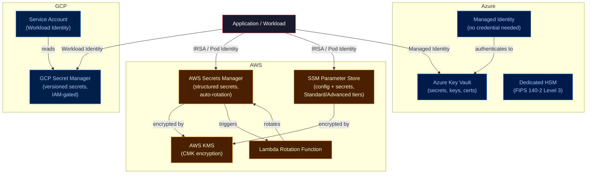

# ☁️ AWS and Azure Secret Services

> [!abstract] TL;DR
> Each major cloud provides a managed secrets service. **AWS Secrets Manager** stores structured secrets with automatic rotation via Lambda. **AWS Parameter Store (SSM)** is cheaper, simpler, hierarchical — good for config and less-sensitive parameters. **Azure Key Vault** manages secrets, keys (RSA, EC), and certificates with managed identity access. **GCP Secret Manager** is simple, IAM-gated, with version management. Cloud-native services eliminate infrastructure overhead at the cost of multi-cloud portability; **HashiCorp Vault** spans all clouds but requires operational investment.

---

## Intuition — analogy FIRST

Cloud secret services are like **bank branch safes**: each bank (AWS, Azure, GCP) runs their own, with their own access card system (IAM/Managed Identity), their own fee structure, and their own version of "you can't take the safe to a different bank." HashiCorp Vault is like a **private safety deposit vault company**: more expensive to operate, but accepts customers from any bank, supports any branch worldwide, and gives you full control of the vault policies.

---

## How It Works



---

## Key Concepts / Details

### AWS Secrets Manager

```bash
# Create a secret
aws secretsmanager create-secret \
  --name /production/payments/stripe-api-key \
  --secret-string '{"api_key":"sk_live_abc123","webhook_secret":"whsec_xyz"}' \
  --kms-key-id arn:aws:kms:us-east-1:123456789:key/mrk-abc123

# Get secret value
aws secretsmanager get-secret-value \
  --secret-id /production/payments/stripe-api-key \
  --query SecretString --output text

# List secrets
aws secretsmanager list-secrets --filters Key=name,Values=/production/

# Rotate a secret manually
aws secretsmanager rotate-secret \
  --secret-id /production/db/password \
  --rotation-lambda-arn arn:aws:lambda:us-east-1:123:function:rotate-db-secret

# Cross-account access (consumer account policy)
aws secretsmanager get-secret-value \
  --secret-id arn:aws:secretsmanager:us-east-1:PRODUCER_ACCOUNT:secret:shared-secret
```

**Automatic rotation with Lambda:**

```python
# Lambda rotation function (AWS provides templates)
import boto3
import json

def lambda_handler(event, context):
    arn = event['SecretId']
    token = event['ClientRequestToken']
    step = event['Step']
    
    client = boto3.client('secretsmanager')
    
    if step == "createSecret":
        # Generate new credential
        new_password = generate_password()
        client.put_secret_value(
            SecretId=arn,
            ClientRequestToken=token,
            SecretString=json.dumps({"password": new_password}),
            VersionStages=["AWSPENDING"]
        )
    
    elif step == "setSecret":
        # Apply new credential to the service (e.g., update DB password)
        secret = client.get_secret_value(SecretId=arn, VersionStage="AWSPENDING")
        update_database_password(json.loads(secret['SecretString'])['password'])
    
    elif step == "testSecret":
        # Verify the new credential works
        secret = client.get_secret_value(SecretId=arn, VersionStage="AWSPENDING")
        test_database_connection(json.loads(secret['SecretString'])['password'])
    
    elif step == "finishSecret":
        # Promote AWSPENDING to AWSCURRENT
        client.update_secret_version_stage(
            SecretId=arn,
            VersionStage="AWSCURRENT",
            MoveToVersionId=token,
            RemoveFromVersionId=get_current_version(client, arn)
        )
```

**IAM policy for application access:**
```json
{
  "Version": "2012-10-17",
  "Statement": [{
    "Effect": "Allow",
    "Action": [
      "secretsmanager:GetSecretValue",
      "secretsmanager:DescribeSecret"
    ],
    "Resource": "arn:aws:secretsmanager:us-east-1:123456789:secret:/production/payments/*"
  }, {
    "Effect": "Allow",
    "Action": ["kms:Decrypt"],
    "Resource": "arn:aws:kms:us-east-1:123456789:key/mrk-abc123"
  }]
}
```

### AWS Parameter Store (SSM)

```bash
# Standard tier (free) vs Advanced tier ($0.05/parameter/month for >10k)
# Standard: max 4KB value; Advanced: max 8KB, parameter policies, higher throughput

# Create a SecureString parameter (encrypted by KMS)
aws ssm put-parameter \
  --name /production/payments/db-password \
  --value "SuperSecret123" \
  --type SecureString \
  --key-id arn:aws:kms:us-east-1:123456789:key/mrk-abc123

# Create a String parameter (plaintext — for non-sensitive config)
aws ssm put-parameter \
  --name /production/payments/db-host \
  --value "prod-db.internal" \
  --type String

# Get by path (recursive)
aws ssm get-parameters-by-path \
  --path /production/payments/ \
  --recursive \
  --with-decryption

# Parameter policy (Advanced tier) — auto-expiry notification
aws ssm put-parameter \
  --name /production/db/temp-password \
  --type SecureString \
  --value "TempPass123" \
  --policies '[{"Type":"Expiration","Version":"1.0","Attributes":{"Timestamp":"2026-08-28T00:00:00.000Z"}}]'
```

**Secrets Manager vs Parameter Store:**

| Feature | Secrets Manager | Parameter Store |
|---------|----------------|----------------|
| Cost | $0.40/secret/month + $0.05/10k API calls | Free (Standard) |
| Automatic rotation | Built-in (Lambda) | Manual only |
| Cross-account replication | Native | IAM policy-based |
| Max value size | 65KB | 4KB (Standard) / 8KB (Advanced) |
| Versioning | Full version history | Current + 100 versions |
| Best for | DB creds, API keys needing rotation | Hierarchical config + secrets |

### Azure Key Vault

```bash
# Create Key Vault
az keyvault create \
  --name myapp-kv-prod \
  --resource-group myapp-rg \
  --location eastus \
  --sku standard \                      # or premium (HSM-backed)
  --enable-rbac-authorization true      # use RBAC not access policies

# Store a secret
az keyvault secret set \
  --vault-name myapp-kv-prod \
  --name stripe-api-key \
  --value "sk_live_abc123"

# Get secret
az keyvault secret show \
  --vault-name myapp-kv-prod \
  --name stripe-api-key \
  --query value -o tsv

# Store a certificate (PEM or PKCS12)
az keyvault certificate import \
  --vault-name myapp-kv-prod \
  --name myapp-tls \
  --file myapp.pfx

# Store a key (RSA 2048 — for signing/encryption)
az keyvault key create \
  --vault-name myapp-kv-prod \
  --name payments-signing-key \
  --kty RSA \
  --size 2048
```

**Managed Identity access (no credentials in code):**

```python
from azure.identity import DefaultAzureCredential
from azure.keyvault.secrets import SecretClient

# DefaultAzureCredential uses Managed Identity in Azure, 
# CLI credentials locally — no secrets in code
credential = DefaultAzureCredential()
client = SecretClient(
    vault_url="https://myapp-kv-prod.vault.azure.net",
    credential=credential
)

secret = client.get_secret("stripe-api-key")
print(secret.value)  # sk_live_abc123
```

**RBAC role assignment:**
```bash
# Assign Key Vault Secrets User to the app's managed identity
az role assignment create \
  --role "Key Vault Secrets User" \
  --assignee <managed-identity-object-id> \
  --scope "/subscriptions/<sub>/resourceGroups/myapp-rg/providers/Microsoft.KeyVault/vaults/myapp-kv-prod"
```

**Azure Key Vault — three asset types:**

| Asset | Operations | Use Case |
|-------|-----------|---------|
| **Secrets** | Get, Set, Delete, List versions | Passwords, API keys, connection strings |
| **Keys** | Encrypt, Decrypt, Sign, Verify, Wrap/Unwrap | Envelope encryption, signing JWTs |
| **Certificates** | Import, Create, Get (cert + private key) | TLS, client auth |

### GCP Secret Manager

```bash
# Create a secret
gcloud secrets create stripe-api-key \
  --project my-project \
  --replication-policy automatic

# Add a version (the actual value)
echo -n "sk_live_abc123" | gcloud secrets versions add stripe-api-key --data-file=-

# Access the latest version
gcloud secrets versions access latest \
  --secret stripe-api-key \
  --project my-project

# List versions
gcloud secrets versions list stripe-api-key --project my-project

# Disable/enable a version (without deleting)
gcloud secrets versions disable 1 --secret stripe-api-key --project my-project
```

**Python SDK + Workload Identity:**
```python
from google.cloud import secretmanager

client = secretmanager.SecretManagerServiceClient()
# Uses Application Default Credentials (ADC) — Workload Identity in GKE
name = "projects/my-project/secrets/stripe-api-key/versions/latest"
response = client.access_secret_version(request={"name": name})
payload = response.payload.data.decode("UTF-8")
```

### Cloud-Native vs HashiCorp Vault — Comparison

| Dimension | AWS SM / Azure KV / GCP SM | HashiCorp Vault |
|-----------|--------------------------|-----------------|
| **Setup** | Managed, zero-ops | Self-hosted, HA setup required |
| **Multi-cloud** | Cloud-locked | Single API across all clouds |
| **Dynamic secrets** | No (rotation only) | Yes (new cred per request, TTL) |
| **Transit encryption** | No (use KMS directly) | Yes (encrypt-as-a-service) |
| **Kubernetes integration** | ESO or SDK | ESO, Vault Agent, Vault Injector |
| **Audit log** | CloudTrail / Monitor / Audit | Vault audit device (file/syslog) |
| **Cost** | Pay-per-secret/call | Infrastructure + license (Enterprise) |
| **Vendor lock-in** | High | Low (open source) |
| **Secret leasing / revocation** | Basic (disable/delete) | Fine-grained lease TTLs |

---

## Real-World Notes

- **IRSA for EKS**: Bind an IAM role to a K8s ServiceAccount via annotation; pods using that SA assume the role to call Secrets Manager without any static credentials.
- **Azure Key Vault soft-delete**: By default, deleted secrets are retained for 90 days. Enable purge protection for compliance (prevents permanent deletion for the retention period).
- **GCP Secret Manager + Workload Identity Federation**: External workloads (GitHub Actions, GitLab CI) can access GCP secrets without service account keys via OIDC federation.
- **Cross-region replication**: AWS Secrets Manager supports multi-region replication. For DR, enable replication to your failover region so your applications can read secrets locally without cross-region latency.

---

## Common Pitfalls

1. **SDK caching stale secrets** — many SDKs cache the secret value in memory. Set a short cache TTL or use the `force-refresh` option when secrets are rotated.
2. **Sharing a single Key Vault across environments** — a misconfigured access policy in dev can expose production secrets; use separate vaults per environment.
3. **Forgetting KMS costs** — Secrets Manager calls KMS for every `GetSecretValue`; high-traffic services can incur unexpected KMS API costs. Add client-side caching with a short TTL.
4. **Azure Key Vault access policies (legacy) vs RBAC** — access policies are less granular and harder to audit; use RBAC mode (`--enable-rbac-authorization`) for new vaults.
5. **Not enabling CloudTrail for Secrets Manager** — without CloudTrail, there is no audit trail for secret access; enable it and ship logs to a tamper-proof S3 bucket.

---

## Related Concepts

- [[_MOC_Secret_Management|↑ Secret Management MOC]]
- [[Secret_Management_Fundamentals|← Fundamentals]] — rotation and audit principles
- [[HashiCorp_Vault|← HashiCorp Vault]] — multi-cloud alternative with dynamic secrets
- [[Kubernetes_Secrets|← K8s Secrets]] — ESO sources from all cloud providers
- [[../06_Cloud_Platforms/AWS_Core_Services|← AWS Core Services]] — IAM, KMS, IRSA
- [[../06_Cloud_Platforms/Azure_Services|← Azure Services]] — Managed Identity, RBAC

---

## Review Questions

1. When would you choose AWS Parameter Store over AWS Secrets Manager? Give two concrete scenarios where Parameter Store is the better fit.
2. Explain Azure Managed Identity. What problem does it solve compared to storing a service principal's client secret in app configuration?
3. A startup with workloads on both AWS EKS and Azure AKS needs centralised secrets. Compare using cloud-native services vs HashiCorp Vault for this scenario.
4. Describe the four steps in an AWS Secrets Manager Lambda rotation function. What happens if `testSecret` fails — does the old password remain active?

---

## Sources

- AWS Secrets Manager Documentation — docs.aws.amazon.com/secretsmanager
- AWS Systems Manager Parameter Store — docs.aws.amazon.com/systems-manager/latest/userguide/systems-manager-parameter-store.html
- Azure Key Vault — docs.microsoft.com/azure/key-vault
- GCP Secret Manager — cloud.google.com/secret-manager/docs

#DevOps #AWS #Azure #GCP #SecretsManager #KeyVault #SSMParameterStore #CloudSecurity #IRSA
