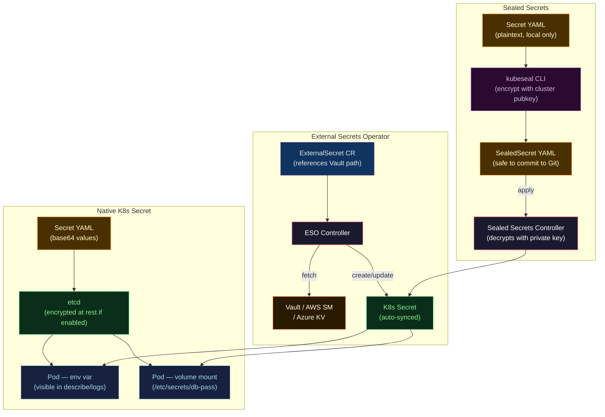

# 🔑 Kubernetes Secrets

> [!abstract] TL;DR
> Kubernetes Secrets store sensitive data as base64-encoded strings in etcd. Base64 is **encoding, not encryption** — without etcd encryption-at-rest, any user who can read etcd sees plaintext. Secrets are scoped by namespace and access-controlled via RBAC. **External Secrets Operator (ESO)** syncs secrets from Vault/AWS SM/GCP SM into K8s Secret objects. **Sealed Secrets** (Bitnami) encrypt Secret manifests for safe Git storage. Production: enable etcd encryption, use ESO or Vault Injector, never commit raw Secrets to Git, prefer volume mounts over env vars.

---

## Intuition — analogy FIRST

Kubernetes Secrets are like **locked filing cabinets in an open office**. The "lock" (base64) is trivially defeated — anyone who knows the scheme opens it in seconds. The real protection is **who has a key to the office** (RBAC + namespace isolation). External Secrets Operator is like a **secure courier**: instead of storing copies of sensitive documents in the local cabinet, it fetches originals from the bank vault on demand and places only what each department needs. Sealed Secrets is like a **sealed envelope**: you can store it in any public mailroom (Git), but only the recipient's private key (cluster controller) can open it.

---

## How It Works



---

## Key Concepts / Details

### Secret Types

| Type | `type` field | Use Case |
|------|-------------|---------|
| **Opaque** | `Opaque` | Generic key-value data (default) |
| **TLS** | `kubernetes.io/tls` | TLS cert + private key (tls.crt / tls.key) |
| **Docker registry** | `kubernetes.io/dockerconfigjson` | Image pull credentials |
| **Basic auth** | `kubernetes.io/basic-auth` | username + password |
| **SSH auth** | `kubernetes.io/ssh-auth` | ssh-privatekey |
| **Service account token** | `kubernetes.io/service-account-token` | Automatically created by K8s |

```yaml
# Opaque secret
apiVersion: v1
kind: Secret
metadata:
  name: payments-secrets
  namespace: production
type: Opaque
stringData:                    # stringData auto-encodes to base64
  DB_PASSWORD: "SuperSecret123"
  STRIPE_API_KEY: "sk_live_abc123"
---
# TLS secret
apiVersion: v1
kind: Secret
metadata:
  name: myapp-tls
  namespace: production
type: kubernetes.io/tls
data:
  tls.crt: <base64-encoded-cert>
  tls.key: <base64-encoded-key>
---
# Docker registry
apiVersion: v1
kind: Secret
metadata:
  name: registry-creds
  namespace: production
type: kubernetes.io/dockerconfigjson
data:
  .dockerconfigjson: <base64-encoded-dockerconfig>
```

### Base64 is NOT Encryption

```bash
# Creating a secret
kubectl create secret generic db-pass --from-literal=password=SuperSecret123

# Reading it back — trivially decoded
kubectl get secret db-pass -o jsonpath='{.data.password}' | base64 -d
# Output: SuperSecret123

# Anyone with kubectl get secret can read all secrets in the namespace
# This is why RBAC and etcd encryption are critical
```

**Enable etcd encryption at rest:**
```yaml
# /etc/kubernetes/encryption-config.yaml (on control plane nodes)
apiVersion: apiserver.config.k8s.io/v1
kind: EncryptionConfiguration
resources:
  - resources:
      - secrets
    providers:
      - aescbc:
          keys:
            - name: key1
              secret: <base64-encoded-32-byte-key>
      - identity: {}    # fallback for unencrypted existing secrets
```

### RBAC for Secrets

```yaml
# Principle: services get access only to their own secrets
apiVersion: rbac.authorization.k8s.io/v1
kind: Role
metadata:
  name: payments-secret-reader
  namespace: production
rules:
  - apiGroups: [""]
    resources: ["secrets"]
    resourceNames: ["payments-secrets"]   # scope to specific secret
    verbs: ["get"]                        # no list — prevents secret enumeration
---
apiVersion: rbac.authorization.k8s.io/v1
kind: RoleBinding
metadata:
  name: payments-svc-secret-reader
  namespace: production
subjects:
  - kind: ServiceAccount
    name: payments-svc
    namespace: production
roleRef:
  kind: Role
  name: payments-secret-reader
  apiGroup: rbac.authorization.k8s.io
```

**Audit RBAC permissions for secrets:**
```bash
# Who can read secrets in production namespace?
kubectl auth can-i get secrets -n production --list

# Check if a specific SA has access
kubectl auth can-i get secret/payments-secrets \
  --as=system:serviceaccount:production:payments-svc \
  -n production
```

### External Secrets Operator (ESO)

ESO is a Kubernetes operator that syncs secrets from external providers into native K8s Secret objects.

```bash
# Install ESO
helm repo add external-secrets https://charts.external-secrets.io
helm install external-secrets external-secrets/external-secrets \
  -n external-secrets --create-namespace
```

```yaml
# 1. SecretStore — connection to external provider
apiVersion: external-secrets.io/v1beta1
kind: SecretStore
metadata:
  name: vault-backend
  namespace: production
spec:
  provider:
    vault:
      server: "https://vault.vault.svc.cluster.local:8200"
      path: "secret"
      version: "v2"
      auth:
        kubernetes:
          mountPath: "kubernetes"
          role: "payments-app"
          serviceAccountRef:
            name: "payments-svc"
---
# 2. ExternalSecret — what to sync and how
apiVersion: external-secrets.io/v1beta1
kind: ExternalSecret
metadata:
  name: payments-secrets
  namespace: production
spec:
  refreshInterval: 1h           # re-sync every hour
  secretStoreRef:
    name: vault-backend
    kind: SecretStore
  target:
    name: payments-secrets      # creates this K8s Secret
    creationPolicy: Owner
  data:
    - secretKey: DB_PASSWORD    # K8s Secret key
      remoteRef:
        key: payments/db        # Vault path
        property: password      # Vault field
    - secretKey: STRIPE_API_KEY
      remoteRef:
        key: payments/stripe
        property: api_key
```

### Sealed Secrets (Bitnami)

```bash
# Install controller
helm repo add sealed-secrets https://bitnami-labs.github.io/sealed-secrets
helm install sealed-secrets sealed-secrets/sealed-secrets \
  -n kube-system

# Install kubeseal CLI
brew install kubeseal   # or download binary

# Create a regular Secret locally (NEVER commit this)
kubectl create secret generic db-pass \
  --from-literal=password=SuperSecret123 \
  --dry-run=client -o yaml > secret.yaml

# Seal it (fetches cluster public key)
kubeseal --format=yaml < secret.yaml > sealed-secret.yaml

# sealed-secret.yaml is safe to commit to Git
# Apply to cluster — controller decrypts and creates K8s Secret
kubectl apply -f sealed-secret.yaml
```

### Secret Rotation in Kubernetes

```yaml
# ESO auto-rotation: refreshInterval handles it
spec:
  refreshInterval: 30m    # ESO polls Vault every 30 min

# Triggering pod restart after secret rotation:
# Option 1: Annotate with reloader (Stakater Reloader)
metadata:
  annotations:
    secret.reloader.stakater.com/reload: "payments-secrets"

# Option 2: Vault Injector with Agent sidecar
# Agent detects lease expiry and rewrites the secret file
# Application uses inotify / SIGHUP to reload
```

### Env Vars vs Mounted Volumes

| Dimension | Env Vars | Volume Mount |
|-----------|---------|--------------|
| Visibility | `kubectl describe pod`, crash dumps, logs | Only in filesystem path |
| Dynamic update | Requires pod restart | Can be updated without restart (projected volumes) |
| Child processes | Inherited by all child processes | Only accessible to processes with fs access |
| K8s events | Appear in pod spec | Do not appear in pod spec |
| Recommendation | Non-sensitive config only | **Prefer for secrets** |

```yaml
# Preferred: volume mount
spec:
  volumes:
    - name: secrets-vol
      secret:
        secretName: payments-secrets
        defaultMode: 0400          # read-only by owner
  containers:
    - name: payments-app
      volumeMounts:
        - name: secrets-vol
          mountPath: /etc/secrets
          readOnly: true
# File per key: /etc/secrets/DB_PASSWORD, /etc/secrets/STRIPE_API_KEY

# Less preferred: env var (only for non-sensitive config)
spec:
  containers:
    - name: payments-app
      env:
        - name: DB_PASSWORD
          valueFrom:
            secretKeyRef:
              name: payments-secrets
              key: DB_PASSWORD
```

---

## Real-World Notes

- **Secret size limit**: K8s Secrets are limited to 1 MiB. For large blobs (certificates bundle, large JWKs), store in Vault and reference via ESO.
- **Namespace isolation**: Secrets are namespace-scoped. A pod in namespace A cannot read a Secret in namespace B — use a ClusterSecretStore (ESO) to share secrets across namespaces via individual ExternalSecret objects.
- **GitOps safety**: Never store raw Secret manifests in Git even in private repos. Use Sealed Secrets or ESO ExternalSecret manifests (which contain only the Vault path reference, not the actual value).
- **`imagePullSecrets`**: Scoped to ServiceAccount; create once and attach to the SA rather than annotating each pod.

---

## Common Pitfalls

1. **Committing base64-encoded secrets to Git** — developers sometimes think base64 is encryption; it is not. Treat any leaked base64 Secret manifest as a plaintext credential breach.
2. **Using `list` verb on secrets in RBAC** — `list` returns all secret values; restrict to `get` with `resourceNames` for fine-grained access.
3. **No etcd encryption** — default K8s clusters store secrets unencrypted in etcd. Any attacker with etcd access (or an etcd backup file) reads all secrets in plaintext.
4. **ESO `refreshInterval: 0`** — disables auto-refresh; set a reasonable interval (30m–1h) to pick up rotated credentials.
5. **Sealed Secrets controller key loss** — if the controller's private key is lost (e.g., cluster deletion), all SealedSecrets become unrecoverable. Back up the sealing key: `kubectl get secret -n kube-system -l sealedsecrets.bitnami.com/sealed-secrets-key -o yaml`.

---

## Related Concepts

- [[_MOC_Secret_Management|↑ Secret Management MOC]]
- [[Secret_Management_Fundamentals|← Fundamentals]] — secrets sprawl and rotation principles
- [[HashiCorp_Vault|← HashiCorp Vault]] — ESO source, Vault Injector alternative
- [[SOPS_and_Git_Secret_Management|→ SOPS]] — alternative to Sealed Secrets for GitOps
- [[../04_Kubernetes/Kubernetes_Core_Concepts|← K8s Core Concepts]] — etcd, RBAC, ServiceAccounts
- [[../04_Kubernetes/Operators_and_CRDs|← K8s Operators]] — ESO as an operator pattern

---

## Review Questions

1. Explain why base64 encoding provides no security. What two mechanisms actually protect K8s Secrets at rest?
2. Compare External Secrets Operator and Vault Injector: which approach keeps the secret value out of the K8s Secret object entirely?
3. A developer asks why they can't store a SealedSecret backup in S3. What are the risks, and what should they store instead?
4. Design RBAC for a microservices cluster: the `orders` service needs `orders/db-creds` and the `inventory` service needs `inventory/db-creds`. Neither should see the other's secrets. Write the Role and RoleBinding for `orders`.

---

## Sources

- Kubernetes Secrets — kubernetes.io/docs/concepts/configuration/secret
- External Secrets Operator — external-secrets.io/docs
- Sealed Secrets — github.com/bitnami-labs/sealed-secrets
- etcd Encryption — kubernetes.io/docs/tasks/administer-cluster/encrypt-data

#DevOps #Kubernetes #Secrets #ESO #SealedSecrets #RBAC #etcdEncryption #ExternalSecretsOperator
