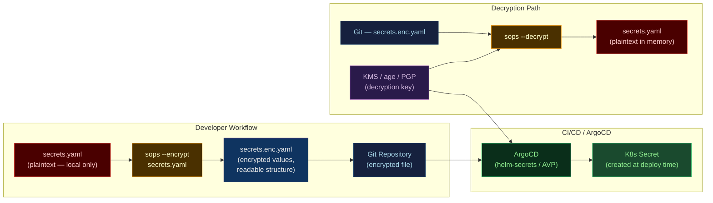

# 📁 SOPS and Git Secret Management

> [!abstract] TL;DR
> **SOPS** (Secrets OPerationS by Mozilla) encrypts individual values inside YAML/JSON/ENV files using **KMS** (AWS, GCP, Azure), **PGP**, or **age** keys — the file structure (keys, comments) remains readable, only values are ciphertext. Decryption requires the private key or KMS access, enforcing least-privilege. SOPS integrates natively with ArgoCD (via `argocd-vault-plugin` or `helm-secrets`) for GitOps workflows. **age** is the modern replacement for PGP — simpler, faster, no Web-of-Trust complexity. Alternatives: **git-crypt** (encrypts whole files, coarser) and **BlackBox** (PGP-based, team-oriented).

---

## Intuition — analogy FIRST

SOPS is like a **redacted document scanner**. When you scan a report, it blacks out the sensitive fields (SSNs, account numbers) but leaves the headers, labels, and structure fully readable. Anyone can see "SSN: ██████████" in the Git diff — they know the field exists and was changed, but not its value. To read the actual data, you need the decryption key. This is the opposite of encrypting the whole file, which makes diffs and reviews impossible.

---

## How It Works



---

## Key Concepts / Details

### SOPS File Format

```yaml
# Before encryption (secrets.yaml)
database:
  host: prod-db.internal
  password: SuperSecret123
  username: app_user
stripe:
  api_key: sk_live_abc123

# After sops --encrypt (secrets.enc.yaml)
database:
  host: ENC[AES256_GCM,data:xyz123,iv:abc,tag:def,type:str]
  password: ENC[AES256_GCM,data:qrs456,iv:ghi,tag:jkl,type:str]
  username: ENC[AES256_GCM,data:mno789,iv:pqr,tag:stu,type:str]
stripe:
  api_key: ENC[AES256_GCM,data:vwx012,iv:yzA,tag:BCD,type:str]
sops:
  kms:
    - arn: arn:aws:kms:us-east-1:123456789:key/mrk-abc123
      created_at: "2026-07-28T14:00:00Z"
      enc: AQICAHh...
  lastmodified: "2026-07-28T14:00:00Z"
  version: 3.7.3
```

Notice: keys (`host`, `password`, `username`) and structure are visible — diffs are meaningful.

### .sops.yaml Configuration

```yaml
# .sops.yaml — at repo root, controls which files get encrypted how
creation_rules:
  # Production secrets: use AWS KMS + age fallback
  - path_regex: environments/production/.*\.yaml$
    kms: arn:aws:kms:us-east-1:123456789:key/mrk-abc123
    age: age1ql3z7hjy54pw3hyww5ayyfg7zqgvc7w3j2elw8zmrj2kg5sfn9aqmcac97

  # Staging: use a different KMS key
  - path_regex: environments/staging/.*\.yaml$
    kms: arn:aws:kms:us-east-1:123456789:key/mrk-staging456

  # All other YAML: use age only (local development)
  - path_regex: \.yaml$
    age: age1ql3z7hjy54pw3hyww5ayyfg7zqgvc7w3j2elw8zmrj2kg5sfn9aqmcac97
```

### CLI Operations

```bash
# Install SOPS
brew install sops   # or download from github.com/getsops/sops/releases

# Encrypt a file (uses .sops.yaml rules)
sops --encrypt secrets.yaml > secrets.enc.yaml

# In-place encrypt
sops --encrypt --in-place secrets.yaml

# Decrypt to stdout (for piping)
sops --decrypt secrets.enc.yaml

# Edit encrypted file (opens decrypted in $EDITOR, re-encrypts on save)
sops secrets.enc.yaml

# Encrypt specific keys only (leave others plaintext)
sops --encrypt --encrypted-regex '^(password|api_key|secret)$' secrets.yaml

# Rotate data encryption key (re-encrypts with same master keys)
sops --rotate --in-place secrets.enc.yaml

# Update master key (add/remove team member's age key)
sops --rotate --add-age age1newmember... --in-place secrets.enc.yaml
```

### age Key Management

```bash
# Install age
brew install age

# Generate a keypair
age-keygen -o ~/.config/sops/age/keys.txt
# Public key: age1ql3z7hjy54pw3hyww5ayyfg7zqgvc7w3j2elw8zmrj2kg5sfn9aqmcac97
# Private key stored in keys.txt

# Set environment variable for SOPS to find the key
export SOPS_AGE_KEY_FILE=~/.config/sops/age/keys.txt
# Or use: SOPS_AGE_RECIPIENTS (public key only — for encryption)
# Or use: SOPS_AGE_KEY (private key inline — for decryption)

# In CI/CD: store private key as a CI secret
# GitHub Actions:
echo "${{ secrets.AGE_KEY }}" > /tmp/age-key.txt
export SOPS_AGE_KEY_FILE=/tmp/age-key.txt
sops --decrypt secrets.enc.yaml
```

### AWS KMS Integration

```bash
# AWS KMS encrypt (uses caller's IAM identity)
sops --encrypt \
  --kms arn:aws:kms:us-east-1:123456789:key/mrk-abc123 \
  secrets.yaml > secrets.enc.yaml

# Decrypt — requires kms:Decrypt permission on the key
# In CI/CD: attach IAM role with kms:Decrypt to runner

# IAM policy for CI decrypt role
{
  "Version": "2012-10-17",
  "Statement": [{
    "Effect": "Allow",
    "Action": ["kms:Decrypt", "kms:DescribeKey"],
    "Resource": "arn:aws:kms:us-east-1:123456789:key/mrk-abc123"
  }]
}
```

### Integration with ArgoCD (GitOps)

**Option 1: helm-secrets plugin**

```yaml
# ArgoCD Application using helm-secrets
spec:
  source:
    repoURL: https://github.com/myorg/myapp
    targetRevision: main
    path: charts/myapp
    helm:
      valueFiles:
        - secrets://environments/production/secrets.enc.yaml  # helm-secrets prefix
      values: |
        image.tag: latest
```

```bash
# Install helm-secrets plugin in ArgoCD
helm plugin install https://github.com/jkroepke/helm-secrets --version v4.6.0
```

**Option 2: ArgoCD Vault Plugin (AVP) with SOPS**

```yaml
# ConfigManagementPlugin in ArgoCD ConfigMap
apiVersion: v1
kind: ConfigMap
metadata:
  name: argocd-cm
data:
  configManagementPlugins: |
    - name: sops-helm
      init:
        command: ["sh", "-c"]
        args: ["helm dependency build"]
      generate:
        command: ["sh", "-c"]
        args: ["helm template $ARGOCD_APP_NAME . -f secrets.enc.yaml | sops --decrypt /dev/stdin"]
```

### Secrets in CI/CD Pipelines

**GitHub Actions:**

```yaml
name: Deploy
on: push
jobs:
  deploy:
    runs-on: ubuntu-latest
    permissions:
      id-token: write   # for OIDC → AWS STS
      contents: read
    steps:
      - uses: actions/checkout@v4

      - name: Configure AWS credentials (OIDC — no static keys)
        uses: aws-actions/configure-aws-credentials@v4
        with:
          role-to-assume: arn:aws:iam::123456789:role/github-deploy
          aws-region: us-east-1

      - name: Decrypt secrets and deploy
        run: |
          sops --decrypt environments/production/secrets.enc.yaml \
            > /tmp/secrets.yaml
          helm upgrade --install myapp ./charts/myapp \
            --values /tmp/secrets.yaml
          rm /tmp/secrets.yaml  # clean up
```

**GitLab CI:**

```yaml
deploy:
  stage: deploy
  variables:
    SOPS_AGE_KEY: $AGE_PRIVATE_KEY   # set in GitLab CI/CD variables (masked)
  script:
    - sops --decrypt environments/production/secrets.enc.yaml > /tmp/secrets.yaml
    - kubectl apply -f /tmp/secrets.yaml
```

### Alternatives Comparison

| Tool | Granularity | Key Type | Git-friendly diffs | Team key mgmt |
|------|------------|---------|------------------|---------------|
| **SOPS** | Per-value | KMS, age, PGP | Yes — structure visible | age recipients list |
| **git-crypt** | Whole file | GPG / symmetric | No — binary diff | GPG key import |
| **BlackBox** | Whole file | PGP | No — encrypted blob | PGP keyring |
| **Sealed Secrets** | Whole Secret object | RSA (cluster-bound) | No | Cluster-based |
| **Vault + ESO** | Per-secret path | Vault master key | N/A — not in Git | Vault policies |

---

## Real-World Notes

- **age over PGP**: PGP has Web-of-Trust complexity, expiry confusion, and keyserver dependency. `age` has a single public key, no expiry, and no external dependencies. Prefer age for new projects.
- **Separate encryption keys per environment**: production and staging should use different KMS keys or age keypairs. A compromised staging key must not decrypt production secrets.
- **`.sops.yaml` in pre-commit hooks**: Use `pre-commit` with a hook to prevent committing unencrypted files matching your secret path patterns.
- **SOPS metadata leaks key ARNs**: The SOPS metadata block in encrypted files reveals which KMS keys were used. This is low-risk (the ARN alone grants no access) but be aware.

---

## Common Pitfalls

1. **Encrypting the wrong file** — encrypting `values.yaml` (non-secret config) alongside `secrets.enc.yaml` makes diffs unreadable; only encrypt files that contain secrets.
2. **Losing the age private key** — there is no recovery mechanism for age. Store private keys in multiple locations: password manager, HSM backup, and a team 1Password vault.
3. **SOPS in Docker image** — don't include plaintext decrypted files in Docker images; decrypt at runtime in the entrypoint or via init container.
4. **`--encrypted-regex` too broad** — encrypting all string values obscures non-sensitive config; tune the regex to target only sensitive keys.
5. **CI caching decrypted files** — CI artifact caches may persist decrypted secrets across runs; ensure decrypted files are in `.gitignore` and CI artifact exclusions.

---

## Related Concepts

- [[_MOC_Secret_Management|↑ Secret Management MOC]]
- [[Secret_Management_Fundamentals|← Fundamentals]] — why Git secrets are dangerous
- [[Kubernetes_Secrets|← K8s Secrets]] — Sealed Secrets alternative for GitOps
- [[HashiCorp_Vault|← HashiCorp Vault]] — centralised alternative; ESO replaces SOPS for runtime injection
- [[../02_CICD_Pipelines/ArgoCD_and_GitOps|← ArgoCD]] — helm-secrets + SOPS integration
- [[../02_CICD_Pipelines/GitHub_Actions|← GitHub Actions]] — OIDC + KMS for CI secret decryption

---

## Review Questions

1. A colleague proposes using `git-crypt` instead of SOPS. What is the key functional difference, and when would you prefer SOPS for a GitOps workflow?
2. Describe the key management lifecycle for age in a team of 5 engineers. How do you onboard a new engineer and offboard a departing one?
3. Walk through the full flow of SOPS + ArgoCD deploying a Helm chart with encrypted values to Kubernetes. Which component holds the decryption key, and how does ArgoCD access it?
4. What information is visible in a SOPS-encrypted file committed to Git? What could an attacker infer from it?

---

## Sources

- SOPS Documentation — github.com/getsops/sops
- age encryption — age-encryption.org / github.com/FiloSottile/age
- helm-secrets — github.com/jkroepke/helm-secrets
- Mozilla Security Blog — origin of SOPS

#DevOps #Security #SOPS #GitOps #AgeEncryption #KMS #PGP #ArgoCD #GitSecretManagement
