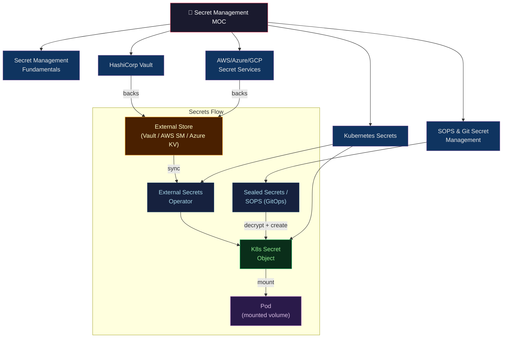

# 🔐 Secret Management — Section MOC

> [!abstract] Section Overview
> 5 notes covering the full secrets management spectrum: why secrets matter, HashiCorp Vault (enterprise engine), Kubernetes-native secret patterns, SOPS for GitOps, and cloud-native services (AWS/Azure/GCP). Designed for platform engineers securing microservices, GitOps pipelines, and multi-cloud deployments.

---

## Section Architecture



---

## Notes in This Section

| Note | Core Concepts | Difficulty |
|------|--------------|------------|
| [[Secret_Management_Fundamentals\|Secret Management Fundamentals]] | Secrets sprawl, rotation, least-privilege, audit logging | Intermediate |
| [[HashiCorp_Vault\|HashiCorp Vault]] | KV engine, dynamic secrets, AppRole/K8s auth, transit encryption, Vault Agent | Advanced |
| [[Kubernetes_Secrets\|Kubernetes Secrets]] | Secret types, base64 encoding, RBAC, ESO, Sealed Secrets, volume mounts | Intermediate |
| [[SOPS_and_Git_Secret_Management\|SOPS & Git Secret Management]] | SOPS value-level encryption, age keys, KMS, ArgoCD integration, CI/CD secrets | Intermediate |
| [[AWS_Azure_Secret_Services\|AWS/Azure/GCP Secret Services]] | AWS SM + rotation, SSM Parameter Store, Azure Key Vault, GCP Secret Manager | Intermediate |

---

## Learning Paths

### Path A — Platform Engineer (K8s-focused)
```
Secret Management Fundamentals
→ Kubernetes Secrets (base64, RBAC, ESO, Sealed Secrets)
→ HashiCorp Vault (Vault Injector, K8s auth, dynamic DB creds)
```

### Path B — GitOps / ArgoCD Practitioner
```
Secret Management Fundamentals
→ SOPS & Git Secret Management (age keys, .sops.yaml, ArgoCD helm-secrets)
→ Kubernetes Secrets (Sealed Secrets, ESO)
```

### Path C — Cloud Security Engineer
```
Secret Management Fundamentals
→ AWS/Azure/GCP Secret Services (cloud-native, IRSA, Managed Identity)
→ HashiCorp Vault (multi-cloud strategy, dynamic secrets)
```

### Path D — Full Secrets Platform
All notes in order: Fundamentals → Vault → K8s → SOPS → Cloud Services

---

## Secrets Rotation Decision Tree

```
Does the service need a new credential each time?
  YES → HashiCorp Vault dynamic secrets (Database / AWS / PKI engine)
  NO  → Is it a GitOps-managed K8s deployment?
          YES → ESO (ExternalSecret) syncing from Vault or cloud SM
               → OR SOPS-encrypted values in Git (helm-secrets / Sealed Secrets)
          NO  → Is the workload on AWS?
                  YES → AWS Secrets Manager (with Lambda auto-rotation)
                  NO  → Is it Azure?
                          YES → Azure Key Vault (with Managed Identity)
                          NO  → GCP Secret Manager (with Workload Identity)
```

---

## Key Formulas / Decision Criteria

| Decision | Recommendation |
|---------|---------------|
| Dynamic creds needed? | Vault Database/AWS/PKI engine |
| Encrypted secrets in Git? | SOPS + age/KMS, or Sealed Secrets |
| K8s secret syncing? | External Secrets Operator (ESO) |
| No K8s, AWS workload? | AWS Secrets Manager + IRSA |
| Multi-cloud, enterprise? | HashiCorp Vault (HA Raft) |
| Dev simplicity, single cloud? | Cloud-native SM (no Vault ops) |
| Encrypt data (not store secrets)? | Vault Transit engine |

---

## Cross-Section Links

- [[../_MOC_DevOps_Master|↑ DevOps Master MOC]]
- [[../04_Kubernetes/_MOC_Kubernetes|← Kubernetes]] — ServiceAccounts, RBAC, operators (ESO, Vault Injector)
- [[../02_CICD_Pipelines/_MOC_CICD_Pipelines|← CI/CD Pipelines]] — GitHub Actions OIDC, ArgoCD + SOPS
- [[../06_Cloud_Platforms/_MOC_Cloud_Platforms|← Cloud Platforms]] — AWS IAM, IRSA, Azure Managed Identity
- [[../12_Service_Mesh/_MOC_Service_Mesh|→ Service Mesh]] — mTLS between services (complements secret-managed certs)

---

#DevOps #MOC #SecretsManagement #Security #Vault #SOPS #ESO #SealedSecrets
