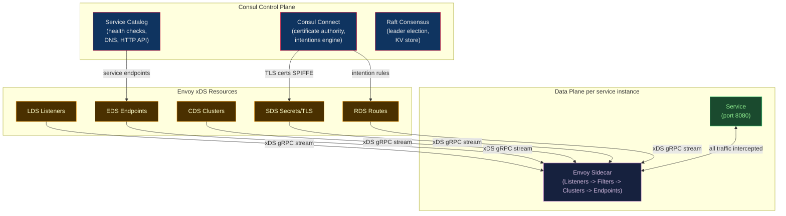

---
title: Consul and Envoy Proxy
aliases: [Consul Connect, Consul Service Mesh, Envoy Proxy, xDS API, Consul Intentions]
tags: [DevOps, Consul, Envoy, ServiceMesh, ServiceDiscovery, xDS, HashiCorp]
domain: DevOps
difficulty: Advanced
created: 2026-07-29
related: [Service_Mesh_Fundamentals, Istio_Architecture_and_Setup, Linkerd]
status: complete
---

# Consul and Envoy Proxy

> [!abstract] TL;DR
> **Consul** is HashiCorp's service catalog, health checking, and key-value store that also serves as a service mesh via **Consul Connect** (mTLS + Envoy sidecars). Consul extends beyond Kubernetes — it works on VMs, bare metal, and multi-datacenter setups via WAN federation. **Consul Intentions** (L4 allow/deny + L7 path/method rules) replace Kubernetes NetworkPolicies for cross-runtime authorization. **Envoy** is the high-performance C++ proxy at the heart of Istio, Consul Connect, and AWS App Mesh — it speaks the **xDS API** (gRPC), receiving dynamic config from a control plane without restarts. Understanding Envoy's filter chain architecture and xDS API is key to understanding any modern service mesh.

---

## Intuition — analogy FIRST

**Consul** is the city directory for your services: it knows every service address, whether it is healthy, and what it is allowed to do (Intentions = city ordinances). **Envoy** is the traffic cop at every intersection — it enforces those ordinances in real-time, decides which route each packet takes, and logs every vehicle that passes. The power of the xDS API is like giving the city planner a real-time radio link to every traffic cop: update a routing rule centrally, and every cop gets new instructions within seconds, without any downtime.

---

## How It Works



---

## Key Concepts / Details

### Consul Basics — Service Registration and Health Checks

```hcl
# /etc/consul.d/my-service.hcl
service {
  name    = "web-api"
  id      = "web-api-1"
  port    = 8080
  address = "10.0.1.5"
  tags    = ["v2", "production"]

  check {
    id       = "web-api-http"
    http     = "http://localhost:8080/health"
    interval = "10s"
    timeout  = "2s"
  }

  # Enables mTLS via Consul Connect
  connect {
    sidecar_service {
      port = 20000
      proxy {
        upstreams = [
          {
            destination_name = "postgres"
            local_bind_port  = 5432
          }
        ]
      }
    }
  }
}
```

```bash
# Query service catalog
consul catalog services
consul catalog nodes -service=web-api

# DNS interface
dig @127.0.0.1 -p 8600 web-api.service.consul SRV

# HTTP API
curl http://localhost:8500/v1/health/service/web-api?passing=true

# Start Envoy sidecar — Consul generates the xDS bootstrap config
consul connect envoy -sidecar-for web-api-1
```

### Consul Intentions — Service-to-Service Authorization

Intentions are identity-based (service name / cert CN) rather than IP-based — they survive pod restarts and IP changes.

```bash
# Allow frontend to call backend
consul intention create -allow frontend backend

# Zero-trust default: deny all, then allow specific paths
consul intention create -deny  '*'       backend
consul intention create -allow frontend  backend

# Check if a connection is allowed (debug)
consul intention check frontend backend
```

```hcl
# L7 intention: only allow GET /api/public from legacy-service
Kind = "service-intentions"
Name = "backend"
Sources = [
  {
    Name       = "frontend"
    Action     = "allow"
    Precedence = 9
    Type       = "consul"
  },
  {
    Name = "legacy-service"
    Type = "consul"
    Permissions = [
      {
        Action = "allow"
        HTTP = {
          Methods    = ["GET", "HEAD"]
          PathPrefix = "/api/public"
        }
      }
    ]
  }
]
```

### Consul on Kubernetes

```bash
# Install via official Helm chart
helm repo add hashicorp https://helm.releases.hashicorp.com

helm install consul hashicorp/consul \
  --namespace consul \
  --create-namespace \
  --set global.name=consul \
  --set global.datacenter=dc1 \
  --set connectInject.enabled=true \
  --set server.replicas=3
```

```yaml
# Enable sidecar injection via pod annotation
apiVersion: apps/v1
kind: Deployment
metadata:
  name: web-api
spec:
  template:
    metadata:
      annotations:
        consul.hashicorp.com/connect-inject: "true"
        consul.hashicorp.com/service-name: "web-api"
        # Bind upstream services to localhost ports
        consul.hashicorp.com/connect-service-upstreams: "backend:3000,postgres:5432"
    spec:
      containers:
      - name: web-api
        image: myapp:latest
        env:
        - name: BACKEND_URL
          value: "http://localhost:3000"   # Envoy proxies mTLS to backend
        - name: DB_HOST
          value: "localhost"               # Envoy proxies mTLS to postgres
```

### Consul WAN Federation — Multi-Datacenter

```hcl
# consul.hcl for datacenter 2
datacenter         = "dc2"
primary_datacenter = "dc1"
retry_join_wan     = ["dc1-consul-server.example.com:8302"]

connect { enabled = true }
```

```bash
# Verify WAN federation
consul members -wan

# Query service in another datacenter
dig @127.0.0.1 -p 8600 backend.service.dc2.consul SRV

# Start mesh gateway for cross-DC Connect traffic
consul connect envoy \
  -mesh-gateway \
  -register \
  -service mesh-gateway \
  -address "10.0.0.1:443"
```

---

## Envoy Proxy — Architecture Deep Dive

### Core Architecture: Listeners -> Filter Chains -> Clusters -> Endpoints

```yaml
# Envoy static bootstrap config
admin:
  address:
    socket_address: { address: 127.0.0.1, port_value: 9901 }

static_resources:
  listeners:
  - name: inbound_listener
    address:
      socket_address: { address: 0.0.0.0, port_value: 15001 }
    filter_chains:
    - filters:
      - name: envoy.filters.network.http_connection_manager
        typed_config:
          "@type": type.googleapis.com/envoy.extensions.filters.network.http_connection_manager.v3.HttpConnectionManager
          stat_prefix: ingress_http
          codec_type: AUTO
          route_config:
            name: local_route
            virtual_hosts:
            - name: local_service
              domains: ["*"]
              routes:
              - match: { prefix: "/" }
                route:
                  cluster: local_app
                  timeout: 5s
                  retry_policy:
                    retry_on: "5xx,connect-failure"
                    num_retries: 3
          http_filters:
          - name: envoy.filters.http.router
            typed_config:
              "@type": type.googleapis.com/envoy.extensions.filters.http.router.v3.Router

  clusters:
  - name: local_app
    connect_timeout: 1s
    type: STATIC
    load_assignment:
      cluster_name: local_app
      endpoints:
      - lb_endpoints:
        - endpoint:
            address:
              socket_address: { address: 127.0.0.1, port_value: 8080 }

  - name: api_backend
    connect_timeout: 1s
    type: STRICT_DNS       # Resolves DNS and uses ALL returned IPs as endpoints
    lb_policy: ROUND_ROBIN
    load_assignment:
      cluster_name: api_backend
      endpoints:
      - lb_endpoints:
        - endpoint:
            address:
              socket_address:
                address: api-service.default.svc.cluster.local
                port_value: 8080
    transport_socket:
      name: envoy.transport_sockets.tls
      typed_config:
        "@type": type.googleapis.com/envoy.extensions.transport_sockets.tls.v3.UpstreamTlsContext
        common_tls_context:
          tls_certificates:
          - certificate_chain: { filename: /certs/cert.pem }
            private_key: { filename: /certs/key.pem }
          validation_context:
            trusted_ca: { filename: /certs/ca.pem }
```

### xDS API — Dynamic Configuration

Envoy receives all config from a control plane (istiod, Consul, etc.) via gRPC streaming. No restart needed for any config change.

| API | Manages | Description |
|---|---|---|
| **LDS** | Listeners | Which ports to listen on, filter chain config |
| **RDS** | Routes | URL routing rules within an HTTP listener |
| **CDS** | Clusters | Upstream service definitions (name, LB policy, circuit breaker) |
| **EDS** | Endpoints | Individual IP:port instances per cluster |
| **SDS** | Secrets | TLS certificates rotated without restart |
| **ADS** | All | Aggregated Discovery Service — single gRPC stream for all resources |

### Envoy Admin API — Runtime Debugging

```bash
# View full running config (listeners, routes, clusters, certs)
curl http://localhost:9901/config_dump | jq .

# Active listeners
curl http://localhost:9901/listeners

# All clusters and endpoint health
curl http://localhost:9901/clusters

# Prometheus metrics
curl http://localhost:9901/stats/prometheus

# Health check for load balancer probes
curl http://localhost:9901/ready

# Graceful connection drain before shutdown
curl -X POST http://localhost:9901/drain_listeners
```

**Key Envoy metrics:**

```
# Per-cluster request stats (substitute backend with cluster name)
cluster.backend.upstream_rq_total                     # Total requests sent upstream
cluster.backend.upstream_rq_2xx                       # Successful responses
cluster.backend.upstream_rq_5xx                       # Server errors
cluster.backend.upstream_rq_time                      # Latency histogram
cluster.backend.upstream_cx_active                    # Active connections
cluster.backend.circuit_breakers.default.rq_open      # 1 means circuit open
cluster.backend.upstream_rq_pending_overflow          # Requests dropped by CB
```

### Envoy Filter Types

| Filter Level | Examples |
|---|---|
| **HTTP filters (L7)** | JWT validation, rate limiting, CORS, gRPC-JSON transcoding, Lua, WASM |
| **Network filters (L4)** | HTTP Connection Manager, TCP proxy, MySQL proxy, Redis proxy |
| **Listener filters** | TLS inspector, HTTP inspector, PROXY protocol |

---

## Consul vs etcd vs ZooKeeper for Service Discovery

| Feature | Consul | etcd | ZooKeeper |
|---|---|---|---|
| **Primary purpose** | Service discovery + mesh | Key-value (K8s backend) | Distributed coordination |
| **Health checks** | Native (HTTP/TCP/gRPC/script) | External only | External only |
| **Service mesh** | Yes (Consul Connect) | No | No |
| **DNS interface** | Built-in port 8600 | No | No |
| **Multi-DC** | Native WAN federation | Manual | Manual |
| **Consensus** | Raft | Raft | ZAB |
| **K8s role** | Optional app-level | Control plane data store | Legacy (pre-K8s era) |

---

## Real-World Notes

- Consul generates the full Envoy xDS bootstrap config automatically — you rarely write Envoy config manually when using Consul Connect. The `consul connect envoy -sidecar-for <service>` command starts Envoy with a bootstrap that points to Consul's xDS server.
- Envoy's `config_dump` endpoint is the most powerful debugging tool in the service mesh world. When a route is not working, check `config_dump` before anything else — it shows exactly what config the running proxy has.
- Consul Intentions are stored in Consul's state store and propagated to all Envoy sidecars in near-real-time (~1 second). Changing an Intention from allow to deny takes effect across the entire mesh without pod restarts.
- Envoy circuit breaking uses a **connection pool model** (max pending requests, max connections, max retries), not a state machine like Hystrix. The "circuit open" condition means the pending queue is full — scale the upstream service or increase pool limits.

---

## Common Pitfalls

1. **Consul DNS port 8600** — Consul DNS runs on port 8600, not 53. Configure CoreDNS to forward `*.consul` queries to Consul DNS, otherwise service discovery via DNS silently fails.
2. **Envoy STRICT_DNS vs LOGICAL_DNS** — `STRICT_DNS` re-resolves and uses ALL returned IPs as endpoints (correct for K8s headless services). `LOGICAL_DNS` uses only the first IP (correct for external FQDNs behind CDN). Wrong choice causes duplicate traffic or broken load balancing.
3. **Consul Connect on VMs without iptables** — Unlike Kubernetes where an init container injects iptables rules, on VMs you must configure iptables manually. Apps that bind to 0.0.0.0 bypass Connect mTLS entirely if iptables rules are missing.
4. **Envoy admin port exposure** — The admin API at port 9901 returns TLS private keys in config_dump output. Never expose it externally; restrict to localhost or use a Unix domain socket.
5. **xDS eventual consistency** — Config updates stream asynchronously. During rolling upgrades, new route configs may arrive before old endpoints drain. Configure upstream outlier_detection to handle transient errors during transitions.

---

## Related Concepts

- [[Service_Mesh_Fundamentals|<- Service Mesh Fundamentals]] — sidecar pattern, data/control plane
- [[Istio_Architecture_and_Setup|<- Istio]] — Envoy as Istio data plane, different xDS server
- [[Linkerd|<- Linkerd]] — Rust proxy alternative to Envoy
- [[../11_Secret_Management/HashiCorp_Vault|<- HashiCorp Vault]] — Consul and Vault commonly co-deployed
- [[../04_Kubernetes/Kubernetes_Networking_and_Ingress|<- K8s Networking]] — Consul vs K8s-native service discovery

---

## Review Questions

1. Explain the xDS API. Why is dynamic configuration via xDS preferable to static YAML in a service mesh?
2. A Consul Intention allows `frontend -> backend` but the frontend pod gets connection refused. List four possible root causes.
3. What is the difference between `STRICT_DNS` and `LOGICAL_DNS` cluster types in Envoy? Which is correct for a Kubernetes headless Service?
4. Envoy's `upstream_rq_pending_overflow` metric is incrementing. What does this indicate and what is the correct remediation?

---

## Sources

- [developer.hashicorp.com/consul/docs](https://developer.hashicorp.com/consul/docs)
- [developer.hashicorp.com/consul/docs/connect](https://developer.hashicorp.com/consul/docs/connect)
- [www.envoyproxy.io/docs/envoy/latest](https://www.envoyproxy.io/docs/envoy/latest/)
- [Envoy xDS Protocol Reference](https://www.envoyproxy.io/docs/envoy/latest/api-docs/xds_protocol)
- [github.com/hashicorp/consul-helm](https://github.com/hashicorp/consul-helm)

#DevOps #Consul #Envoy #ServiceMesh #ServiceDiscovery #xDS #ConsulConnect #Intentions
