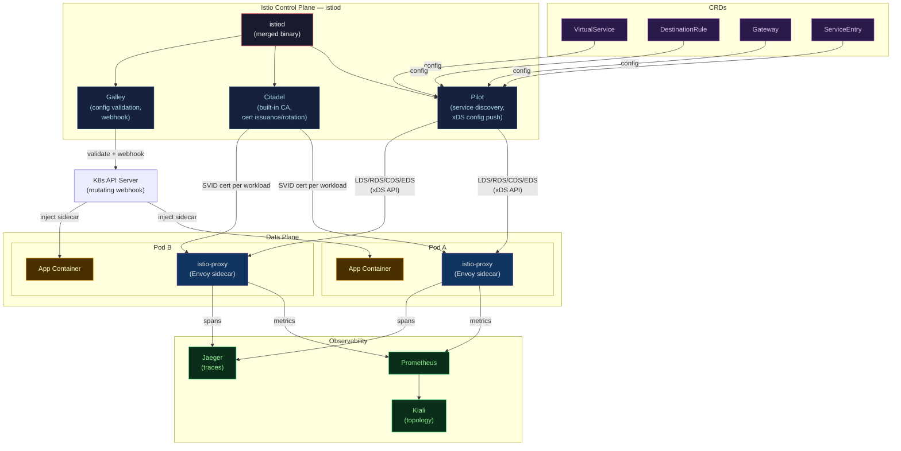

# ⚓ Istio Architecture and Setup

> [!abstract] TL;DR
> Istio's control plane is **istiod** — a single binary that consolidates the former Pilot (service discovery + config), Citadel (certificate authority), and Galley (config validation) components. The data plane is **Envoy** sidecars injected into every pod via a mutating webhook. Key CRDs: **VirtualService** (routing rules), **DestinationRule** (traffic policy per upstream), **Gateway** (ingress/egress config). Install profiles range from `minimal` (control plane only) to `demo` (all features with tracing). **Kiali** provides mesh topology and traffic visualization. `istioctl` is the primary CLI for install, diff, and debugging.

---

## Intuition — analogy FIRST

Istio is like a **city's traffic management system**. `istiod` is the **traffic control centre**: it knows every intersection (service), issues CCTV authentication tokens (certificates), and broadcasts signal timing rules (xDS config) to all intersections. Each Envoy sidecar is a **smart traffic light** at each building entrance — it enforces the rules from HQ, records every car that passes (metrics), and can hold traffic back when there's a bottleneck downstream (circuit breaking). Kiali is the **city map dashboard** showing real-time traffic flows between buildings.

---

## How It Works



---

## Key Concepts / Details

### istiod Components (Merged in Istio 1.5+)

| Former Component | Responsibility | Now |
|-----------------|---------------|-----|
| **Pilot** | Service discovery (watches K8s Services/Endpoints), translates to xDS, pushes to proxies | Part of istiod |
| **Citadel** | Root CA, issues SPIFFE SVIDs (X.509 certs) to each workload, rotates certs every 24h | Part of istiod |
| **Galley** | Validates Istio CRDs via admission webhook, config ingestion | Part of istiod |

### Installation Profiles

```bash
# Install istioctl
curl -L https://istio.io/downloadIstio | sh -
export PATH=$PATH:$PWD/istio-*/bin

# View available profiles
istioctl profile list
# Profiles: ambient, default, demo, empty, external, minimal, openshift, preview, remote

# Install with default profile (recommended for production)
istioctl install --set profile=default -y

# Demo profile (all features, tracing, Kiali — for learning)
istioctl install --set profile=demo -y

# Minimal (control plane only — data plane components managed separately)
istioctl install --set profile=minimal -y

# Verify installation
istioctl verify-install
kubectl get pods -n istio-system
```

**Profile comparison:**

| Profile | istiod | Ingress Gateway | Egress Gateway | Tracing/Kiali |
|---------|--------|----------------|----------------|---------------|
| `minimal` | Yes | No | No | No |
| `default` | Yes | Yes | No | No |
| `demo` | Yes | Yes | Yes | Yes |

### Sidecar Injection

**Automatic injection** (recommended): label the namespace

```bash
# Enable automatic sidecar injection for a namespace
kubectl label namespace production istio-injection=enabled

# Verify injection label
kubectl get namespace production --show-labels
# NAME         STATUS   AGE   LABELS
# production   Active   5d    istio-injection=enabled

# New pods in this namespace will have istio-proxy sidecar injected
kubectl rollout restart deployment/payments-svc -n production

# Verify sidecar presence (2/2 READY = app + istio-proxy)
kubectl get pods -n production
# NAME                           READY   STATUS    RESTARTS
# payments-svc-7d9b4f-abc12      2/2     Running   0
```

**Manual injection** (per-resource):
```bash
# Inject sidecar into a deployment manifest (output to stdout)
istioctl kube-inject -f deployment.yaml | kubectl apply -f -

# Exclude specific pod from injection
metadata:
  annotations:
    sidecar.istio.io/inject: "false"
```

### VirtualService and DestinationRule CRDs

```yaml
# VirtualService — routing rules for requests to a service
apiVersion: networking.istio.io/v1beta1
kind: VirtualService
metadata:
  name: payments-vs
  namespace: production
spec:
  hosts:
    - payments-svc           # target host (K8s Service name)
  http:
    - match:
        - headers:
            x-env:
              exact: canary
      route:
        - destination:
            host: payments-svc
            subset: canary
    - route:                 # default route
        - destination:
            host: payments-svc
            subset: stable
          weight: 95
        - destination:
            host: payments-svc
            subset: canary
          weight: 5
---
# DestinationRule — traffic policy for a destination
apiVersion: networking.istio.io/v1beta1
kind: DestinationRule
metadata:
  name: payments-dr
  namespace: production
spec:
  host: payments-svc
  trafficPolicy:
    connectionPool:
      tcp:
        maxConnections: 100
      http:
        http2MaxRequests: 1000
        pendingRequests: 100
    outlierDetection:        # circuit breaker
      consecutive5xxErrors: 5
      interval: 30s
      baseEjectionTime: 30s
      maxEjectionPercent: 50
  subsets:
    - name: stable
      labels:
        version: stable      # matches pod label
    - name: canary
      labels:
        version: canary
```

### Gateway Resource

```yaml
# Gateway — configure ingress traffic into the mesh
apiVersion: networking.istio.io/v1beta1
kind: Gateway
metadata:
  name: myapp-gateway
  namespace: production
spec:
  selector:
    istio: ingressgateway    # uses the Istio Ingress Gateway pod
  servers:
    - port:
        number: 443
        name: https
        protocol: HTTPS
      tls:
        mode: SIMPLE
        credentialName: myapp-tls-secret   # K8s TLS Secret
      hosts:
        - myapp.example.com
---
# VirtualService binds to the Gateway
apiVersion: networking.istio.io/v1beta1
kind: VirtualService
metadata:
  name: myapp-vs
spec:
  hosts:
    - myapp.example.com
  gateways:
    - production/myapp-gateway
  http:
    - route:
        - destination:
            host: myapp-svc
            port:
              number: 8080
```

### istioctl CLI Reference

```bash
# Analyze mesh configuration for errors/warnings
istioctl analyze -n production

# Debug proxy configuration for a specific pod
istioctl proxy-config cluster payments-svc-7d9b4f-abc12 -n production
istioctl proxy-config listener payments-svc-7d9b4f-abc12 -n production
istioctl proxy-config route payments-svc-7d9b4f-abc12 -n production
istioctl proxy-config endpoint payments-svc-7d9b4f-abc12 -n production

# Check certificate status
istioctl proxy-config secret payments-svc-7d9b4f-abc12 -n production

# Enable debug logging on a proxy
istioctl proxy-config log payments-svc-7d9b4f-abc12 --level debug

# Dashboard access
istioctl dashboard kiali
istioctl dashboard jaeger
istioctl dashboard prometheus

# Generate manifest (for review before apply)
istioctl manifest generate --set profile=default > istio-manifests.yaml

# Upgrade
istioctl upgrade --set profile=default
```

### Kiali Visualization

Kiali provides the mesh topology graph:
- Service dependency graph (arrows show request flow)
- Traffic rates, error rates, response times per edge
- mTLS lock icons (green = mTLS enforced, red = plaintext)
- VirtualService and DestinationRule status
- Configuration validation warnings

```bash
# Access Kiali (port-forward)
kubectl port-forward svc/kiali 20001:20001 -n istio-system
# Open: http://localhost:20001
```

### PeerAuthentication — Enforcing mTLS

```yaml
# Enforce STRICT mTLS for entire mesh
apiVersion: security.istio.io/v1beta1
kind: PeerAuthentication
metadata:
  name: default
  namespace: istio-system    # mesh-wide scope
spec:
  mtls:
    mode: STRICT

# Per-namespace override
apiVersion: security.istio.io/v1beta1
kind: PeerAuthentication
metadata:
  name: default
  namespace: production
spec:
  mtls:
    mode: STRICT

# PERMISSIVE during migration (accepts both mTLS and plaintext)
spec:
  mtls:
    mode: PERMISSIVE
```

---

## Real-World Notes

- **Resource requests for istiod**: `istiod` needs ~500m CPU and 2Gi memory for clusters with 100+ services. Size accordingly.
- **xDS push storms**: when many services restart simultaneously, istiod pushes large config updates to all proxies. Set `PILOT_PUSH_THROTTLE` to limit burst rate.
- **Sidecar resource CRD**: use a `Sidecar` CRD to scope which services each proxy needs to know about — reducing memory footprint in large clusters (default: every proxy knows about every service).
- **Egress control**: by default, traffic to external services is allowed (`outboundTrafficPolicy: ALLOW_ANY`). Set to `REGISTRY_ONLY` and add `ServiceEntry` CRDs for explicit external service allowlisting.

---

## Common Pitfalls

1. **Namespace label before deployment** — forgetting to label the namespace before deploying means pods are created without sidecars; rolling restart is required after labeling.
2. **CRD hostname case sensitivity** — `hosts: payments-svc` (short name) matches only within the namespace. Use FQDN `payments-svc.production.svc.cluster.local` for cross-namespace VirtualServices.
3. **Multiple VirtualServices for the same host** — Istio merges them but merge behavior can be surprising; use a single VirtualService per host.
4. **Not updating Istio before upgrading K8s** — Istio has a support matrix for K8s versions; upgrading K8s first can break istiod.
5. **Forgetting to update DestinationRule subsets** — deploying a new pod version label without adding the subset to DestinationRule results in 503 errors for that route.

---

## Related Concepts

- [[_MOC_Service_Mesh|↑ Service Mesh MOC]]
- [[Service_Mesh_Fundamentals|← Service Mesh Fundamentals]] — data/control plane, sidecar pattern
- [[Istio_Traffic_Management|→ Istio Traffic Management]] — VirtualService patterns, canary, fault injection
- [[Linkerd|→ Linkerd]] — simpler alternative, Rust proxy
- [[../04_Kubernetes/Kubernetes_Core_Concepts|← K8s Core Concepts]] — mutating webhooks, CRDs, RBAC
- [[../07_Monitoring_Observability/Distributed_Tracing|← Distributed Tracing]] — Jaeger integration via Istio

---

## Review Questions

1. What were Pilot, Citadel, and Galley in Istio's pre-1.5 architecture? How are their responsibilities distributed in istiod today?
2. Explain the difference between a VirtualService and a DestinationRule. Can you have a working canary deployment with only a VirtualService and no DestinationRule?
3. A pod in namespace `production` shows `1/1 READY` instead of `2/2 READY`. What is the most likely cause, and how do you fix it without recreating the pod?
4. Why would you set `outboundTrafficPolicy: REGISTRY_ONLY` in production? What additional CRD do you need to allow external HTTPS calls?

---

## Sources

- Istio Documentation — istio.io/latest/docs
- Istio Architecture — istio.io/latest/docs/ops/deployment/architecture
- istioctl Reference — istio.io/latest/docs/reference/commands/istioctl
- Kiali — kiali.io/docs

#DevOps #Istio #ServiceMesh #istiod #Envoy #VirtualService #DestinationRule #Kiali #mTLS #Kubernetes
