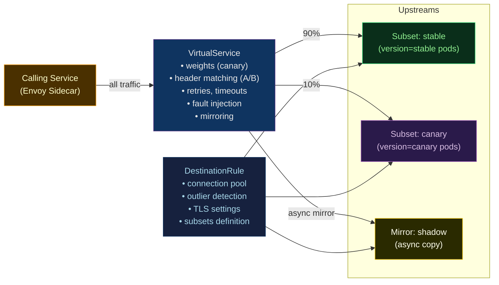

# 🚦 Istio Traffic Management

> [!abstract] TL;DR
> Istio's traffic management primitives sit in two CRDs: **VirtualService** (controls where/how traffic is routed — weights, headers, retries, timeouts, fault injection) and **DestinationRule** (configures the upstream — mTLS mode, connection pool, outlier detection / circuit breaker). Together they enable **canary deployments** (weight-based splits), **A/B testing** (header-based routing), **circuit breaking** (Envoy outlier detection), **retries**, **fault injection** (delay/abort for chaos testing), and **traffic mirroring** (shadow a percentage to a shadow service). The **Gateway** CRD binds these rules to inbound traffic.

---

## Intuition — analogy FIRST

VirtualService is the **traffic management manifesto**: "90% of cars go to district A, 10% to district B, cars with 'emergency' stickers always go to district C, and if district A is congested, wait 3 seconds then retry." DestinationRule is the **district code** — how each district accepts visitors: "District A only allows vehicles with valid inspection stickers (mTLS), can handle 100 simultaneous cars, and any driver who causes 5 incidents in 30 seconds gets banned for 30 seconds (outlier detection)."

---

## How It Works



---

## Key Concepts / Details

### Traffic Shifting — Canary Deployment

```yaml
# VirtualService: 90/10 canary split
apiVersion: networking.istio.io/v1beta1
kind: VirtualService
metadata:
  name: payments-vs
  namespace: production
spec:
  hosts:
    - payments-svc
  http:
    - route:
        - destination:
            host: payments-svc
            subset: stable
          weight: 90
        - destination:
            host: payments-svc
            subset: canary
          weight: 10
---
# DestinationRule: define subsets by pod label
apiVersion: networking.istio.io/v1beta1
kind: DestinationRule
metadata:
  name: payments-dr
  namespace: production
spec:
  host: payments-svc
  subsets:
    - name: stable
      labels:
        version: v1.2.0
    - name: canary
      labels:
        version: v1.3.0-canary
```

**Progressive canary promotion:**
```bash
# Step 1: 5% canary
kubectl patch vs payments-vs -n production --type=merge -p '{"spec":{"http":[{"route":[{"destination":{"host":"payments-svc","subset":"stable"},"weight":95},{"destination":{"host":"payments-svc","subset":"canary"},"weight":5}]}]}}'

# Step 2: Monitor error rates in Kiali/Prometheus for 30min
# Step 3: Promote to 20%
kubectl patch vs payments-vs ...   # weight: 80/20

# Step 4: Full promotion (100% canary)
# Remove old stable Deployment, rename canary to stable
```

### Header-Based Routing (A/B Testing)

```yaml
apiVersion: networking.istio.io/v1beta1
kind: VirtualService
metadata:
  name: frontend-vs
  namespace: production
spec:
  hosts:
    - frontend-svc
  http:
    # Beta users (header-based routing)
    - match:
        - headers:
            x-user-group:
              exact: beta
        - headers:
            cookie:
              regex: ".*beta=true.*"
      route:
        - destination:
            host: frontend-svc
            subset: v2
    # Default: stable
    - route:
        - destination:
            host: frontend-svc
            subset: v1
```

### Circuit Breaking — Envoy Outlier Detection

```yaml
# DestinationRule with outlier detection (circuit breaker)
apiVersion: networking.istio.io/v1beta1
kind: DestinationRule
metadata:
  name: payments-dr
spec:
  host: payments-svc
  trafficPolicy:
    # Connection pool limits (bulkhead pattern)
    connectionPool:
      tcp:
        maxConnections: 100       # max TCP connections per proxy
      http:
        http2MaxRequests: 1000    # max concurrent HTTP/2 requests
        pendingRequests: 100      # max queued requests before 503
        maxRetries: 3
    # Outlier detection (circuit breaker)
    outlierDetection:
      consecutive5xxErrors: 5     # eject after 5 consecutive 5xx
      interval: 30s               # analysis window
      baseEjectionTime: 30s       # minimum ejection duration
      maxEjectionPercent: 50      # max % of hosts ejected at once
      # Note: ejection duration = baseEjectionTime × ejection_count
      # Second ejection = 60s, third = 90s, etc.
```

**Visualising circuit breaker state:**
```bash
# Check if hosts are ejected
istioctl proxy-config endpoint payments-svc-pod -n production \
  | grep -E "HEALTHY|UNHEALTHY"
# HEALTHY   10.0.1.45:8080   outbound|8080||payments-svc...
# UNHEALTHY 10.0.1.46:8080   outbound|8080||payments-svc...  (ejected)
```

### Retries and Timeouts

```yaml
apiVersion: networking.istio.io/v1beta1
kind: VirtualService
metadata:
  name: orders-vs
spec:
  hosts:
    - orders-svc
  http:
    - route:
        - destination:
            host: orders-svc
      # Timeout for the entire request
      timeout: 5s
      # Retry configuration
      retries:
        attempts: 3               # retry up to 3 times
        perTryTimeout: 2s         # timeout per attempt
        retryOn: "5xx,reset,connect-failure,retriable-4xx"
        # retriable-4xx: retries on 409 Conflict
```

**Safe retry conditions** — only retry idempotent operations:
```
GET, HEAD, OPTIONS, PUT → safe to retry
POST, PATCH → NOT safe (avoid retry or use idempotency keys)
```

### Fault Injection — Chaos Testing

Fault injection tests how services degrade under failures, **without modifying application code**:

```yaml
# Inject 500ms delay for 30% of requests
apiVersion: networking.istio.io/v1beta1
kind: VirtualService
metadata:
  name: payments-vs-chaos
spec:
  hosts:
    - payments-svc
  http:
    - fault:
        delay:
          percentage:
            value: 30.0           # 30% of requests
          fixedDelay: 500ms
      route:
        - destination:
            host: payments-svc
            subset: stable
---
# Inject HTTP 503 abort for 10% of requests
spec:
  http:
    - fault:
        abort:
          percentage:
            value: 10.0
          httpStatus: 503
      route:
        - destination:
            host: payments-svc
```

**Chaos testing workflow:**
```bash
# 1. Apply fault injection
kubectl apply -f payments-vs-chaos.yaml

# 2. Run load test and observe
hey -n 1000 -c 50 http://payments-svc/api/charge

# 3. Check Kiali for error rate spikes
# 4. Verify circuit breakers and retries fired as expected

# 5. Remove fault injection
kubectl delete vs payments-vs-chaos
kubectl apply -f payments-vs-stable.yaml
```

### Traffic Mirroring (Shadowing)

Mirror live production traffic to a shadow service asynchronously. The shadow responses are **discarded** — no impact on production clients.

```yaml
apiVersion: networking.istio.io/v1beta1
kind: VirtualService
metadata:
  name: payments-vs
spec:
  hosts:
    - payments-svc
  http:
    - route:
        - destination:
            host: payments-svc
            subset: stable
      # Shadow 20% of traffic to the new version
      mirror:
        host: payments-svc
        subset: shadow
      mirrorPercentage:
        value: 20.0
```

**Use cases for mirroring:**
- Test a new service version with real production traffic
- Verify a new database schema handles real queries
- Shadow to a debug build to capture payloads
- Warm caches before cutover

### VirtualService vs DestinationRule vs Gateway

| Resource | Scope | Controls |
|---------|-------|---------|
| **VirtualService** | Caller-side (outbound from proxy) | Where traffic goes, how requests behave (retries, timeouts, fault injection, mirroring) |
| **DestinationRule** | Callee-side (arriving traffic policy) | Connection pool, circuit breaker, mTLS mode, subset definition |
| **Gateway** | Edge of the mesh (ingress/egress) | Port, protocol, TLS termination for external traffic entering the mesh |

```
Request flow:
External Client
  → Gateway (TLS termination, hostname matching)
  → VirtualService (routing decision: which subset, retries, timeouts)
  → DestinationRule (connection pool, mTLS, outlier detection)
  → Pod (Envoy sidecar → application container)
```

---

## Real-World Notes

- **Weight totals must equal 100**: if the sum of weights in a route block is not 100, Istio normalises them — but be explicit to avoid surprises.
- **Header propagation is mandatory for tracing**: fault injection with delay tests a single hop; to test end-to-end cascade effects, the application must propagate trace headers so the delay appears in the distributed trace.
- **Fault injection by user**: scope fault injection to a specific user (via header match) during QA testing to avoid impacting all users.
- **Traffic mirroring increases load**: the shadow service receives a full copy of traffic. Ensure it has sufficient resources, or use `mirrorPercentage` to shadow only a fraction.

---

## Common Pitfalls

1. **Miscounting weights** — `weight: 95` + `weight: 6` = 101, which Istio rejects with a validation error; always verify they sum to 100.
2. **VirtualService without DestinationRule subsets** — defining a subset in VirtualService (`subset: canary`) that does not exist in the corresponding DestinationRule causes 503 errors immediately.
3. **Retry on non-idempotent routes** — retrying `POST /api/charge` without idempotency keys causes duplicate charges; add `retryOn` only for safe methods or use idempotency tokens.
4. **Fault injection left in production** — a chaos YAML accidentally applied to production degrades service for real users; use namespace-scoped changes and a CI check to prevent chaos configs in `main` branch.
5. **Outlier detection ejecting all backends** — `maxEjectionPercent: 100` can eject all healthy pods if they all return errors (e.g., upstream DB outage) leaving no backends; set to 50% as a floor.

---

## Related Concepts

- [[_MOC_Service_Mesh|↑ Service Mesh MOC]]
- [[Istio_Architecture_and_Setup|← Istio Architecture]] — istiod, CRDs, setup
- [[Service_Mesh_Fundamentals|← Mesh Fundamentals]] — circuit breaking, east-west overview
- [[Linkerd|→ Linkerd]] — SMI-based traffic split alternative
- [[../02_CICD_Pipelines/Release_Strategies|← Release Strategies]] — canary + blue/green patterns at the pipeline level
- [[../07_Monitoring_Observability/Prometheus_and_Alertmanager|← Prometheus]] — alerting on mesh error rates during canary

---

## Review Questions

1. Design an Istio configuration for a canary deployment of the `checkout-svc` from v1 to v2: start at 5%, promote to 20% after 30 minutes, then 100%. Write the VirtualService and DestinationRule YAML for the initial 5% state.
2. Explain the difference between connection pool limits and outlier detection. Which one fires first when a service starts returning 503s under high load?
3. A fault injection of 2-second delay is applied to `inventory-svc`. The `orders-svc` caller has a 5-second timeout. Will the request succeed or fail? What changes if `orders-svc` has a 1-second timeout?
4. Why does traffic mirroring have no impact on production client latency, even though it doubles the traffic to the shadow service?

---

## Sources

- Istio Traffic Management — istio.io/latest/docs/concepts/traffic-management
- Fault Injection — istio.io/latest/docs/tasks/traffic-management/fault-injection
- Circuit Breaking — istio.io/latest/docs/tasks/traffic-management/circuit-breaking
- Traffic Mirroring — istio.io/latest/docs/tasks/traffic-management/mirroring

#DevOps #Istio #TrafficManagement #CanaryDeployment #CircuitBreaker #FaultInjection #TrafficMirroring #VirtualService #DestinationRule
