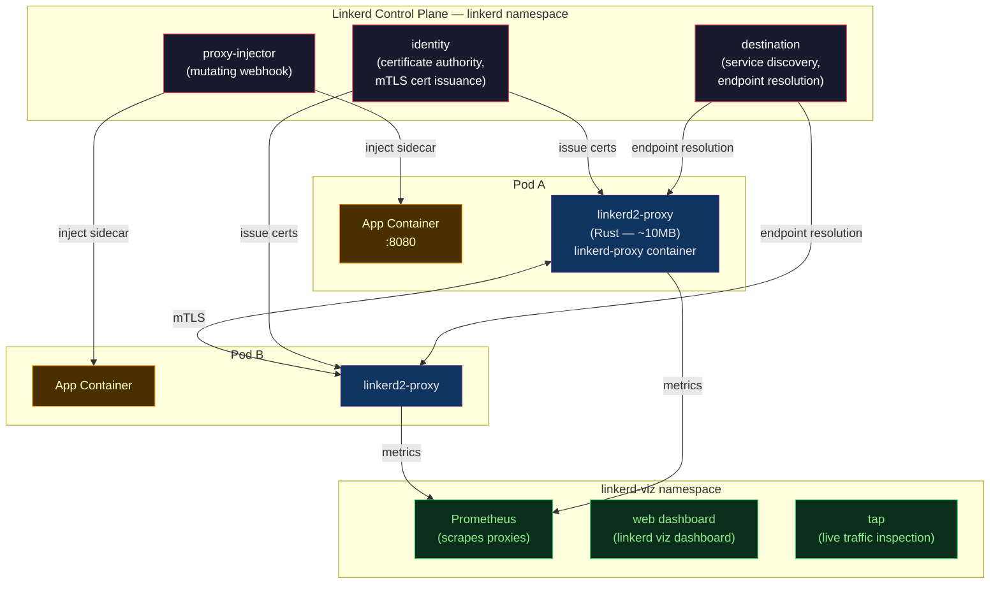

# 🔗 Linkerd

> [!abstract] TL;DR
> Linkerd is a **lightweight, Kubernetes-native service mesh** built around simplicity and performance. Its data plane uses a **Rust-based micro-proxy** (`linkerd2-proxy`) — not Envoy — with ~10MB footprint and ~1ms overhead. **Automatic mTLS** is on by default, zero config. The control plane lives in the `linkerd` namespace (destination, identity, proxy-injector services). **`linkerd viz`** installs the metrics and dashboard stack. **TrafficSplit** (SMI) and **HTTPRoute** (Gateway API) handle canary deployments. Compared to Istio: far simpler to operate, lower resource overhead, fewer features (no Lua/WASM extensions, less L7 routing flexibility).

---

## Intuition — analogy FIRST

Linkerd is the **fuel-efficient sedan** to Istio's **feature-loaded SUV**. The sedan gets you from A to B with excellent reliability, lower maintenance costs, and better fuel economy. The SUV has 4WD, a sunroof, and integrated GPS — but requires a dedicated mechanic. Choose Linkerd when you need mTLS, observability, and traffic splitting but don't need Lua extensions, multi-cluster federation, or WASM filters. Choose Istio when you need full L7 traffic programming or have a team that can operate it.

---

## How It Works



---

## Key Concepts / Details

### Installation

```bash
# Install Linkerd CLI
curl --proto '=https' --tlsv1.2 -sSfL https://run.linkerd.io/install | sh
export PATH=$PATH:~/.linkerd2/bin

# Check pre-requisites
linkerd check --pre

# Install Linkerd CRDs
linkerd install --crds | kubectl apply -f -

# Install Linkerd control plane
linkerd install | kubectl apply -f -

# Verify installation
linkerd check

# Install the viz extension (Prometheus + dashboard + tap)
linkerd viz install | kubectl apply -f -
linkerd viz check

# Access dashboard
linkerd viz dashboard
```

### Sidecar Injection

```bash
# Annotate namespace for automatic injection
kubectl annotate namespace production linkerd.io/inject=enabled

# Or per-Deployment (manual)
kubectl get deploy payments-svc -n production -o yaml \
  | linkerd inject - \
  | kubectl apply -f -

# Verify injection (2/2 READY = app + linkerd-proxy)
kubectl get pods -n production
# payments-svc-7d9b4f-abc12   2/2   Running

# Check Linkerd's proxy info for a pod
linkerd viz stat pods -n production
# NAME                        STATUS   SUCCESS   RPS   LATENCY_P50   LATENCY_P99
# payments-svc-7d9b4f-abc12  Running  100.00%   4.2   1ms           8ms
```

### Automatic mTLS

Linkerd enables mTLS by default — no configuration needed:

```bash
# Verify mTLS is active between two services
linkerd viz edges deployment -n production
# SRC            DST            SECURED
# orders-svc     payments-svc   √ (mTLS)
# frontend-svc   orders-svc     √ (mTLS)

# Check certificate for a specific pod
linkerd viz tap deployment/payments-svc -n production
# req id=0:1 proxy=in src=10.0.1.44:52801 dst=10.0.1.45:8080 tls=true
```

Linkerd uses **SPIFFE-compliant** certificates with a 24-hour TTL, auto-rotated by the `identity` control plane component.

### Traffic Split — SMI (Service Mesh Interface)

```bash
# Install SMI extension
linkerd smi install | kubectl apply -f -
```

```yaml
# TrafficSplit CRD (SMI) — 90/10 canary
apiVersion: split.smi-spec.io/v1alpha2
kind: TrafficSplit
metadata:
  name: payments-split
  namespace: production
spec:
  service: payments-svc        # the root service
  backends:
    - service: payments-stable
      weight: 90
    - service: payments-canary
      weight: 10
```

**Modern approach (HTTPRoute — Gateway API):**

```yaml
apiVersion: gateway.networking.k8s.io/v1beta1
kind: HTTPRoute
metadata:
  name: payments-route
  namespace: production
spec:
  parentRefs:
    - name: payments-svc
      kind: Service
      port: 8080
  rules:
    - backendRefs:
        - name: payments-stable
          port: 8080
          weight: 90
        - name: payments-canary
          port: 8080
          weight: 10
```

### Linkerd CLI Reference

```bash
# Real-time stats for deployments
linkerd viz stat deployments -n production

# Detailed stats for a specific deployment
linkerd viz stat deploy/payments-svc -n production

# Live traffic tap (watch real-time requests)
linkerd viz tap deploy/payments-svc -n production
linkerd viz tap deploy/payments-svc -n production \
  --to deploy/orders-svc

# Top-like view of live traffic
linkerd viz top deploy/payments-svc -n production

# Service graph (dependency topology)
linkerd viz routes deploy/orders-svc -n production

# Check pod proxy health
linkerd check --proxy -n production

# Profile — generate ServiceProfile (retries, timeouts)
linkerd profile --open-api openapi.yaml payments-svc

# Inject a manifest
linkerd inject deployment.yaml | kubectl apply -f -
```

### ServiceProfile — Retries and Timeouts

```yaml
# ServiceProfile configures per-route timeouts and retries
apiVersion: linkerd.io/v1alpha2
kind: ServiceProfile
metadata:
  name: payments-svc.production.svc.cluster.local
  namespace: production
spec:
  routes:
    - name: POST /api/v1/charge
      condition:
        method: POST
        pathRegex: /api/v1/charge
      isRetryable: false     # POST: not idempotent
      timeout: 5s
    - name: GET /api/v1/status
      condition:
        method: GET
        pathRegex: /api/v1/status
      isRetryable: true
      timeout: 2s
```

### AuthorizationPolicy

```yaml
# Allow only orders-svc to call payments-svc (L4 policy)
apiVersion: policy.linkerd.io/v1beta1
kind: Server
metadata:
  name: payments-server
  namespace: production
spec:
  podSelector:
    matchLabels:
      app: payments-svc
  port: 8080
  proxyProtocol: HTTP/2
---
apiVersion: policy.linkerd.io/v1beta2
kind: AuthorizationPolicy
metadata:
  name: payments-authz
  namespace: production
spec:
  targetRef:
    group: policy.linkerd.io
    kind: Server
    name: payments-server
  requiredAuthenticationRefs:
    - name: orders-svc-sa
      kind: MeshTLSAuthentication
      group: policy.linkerd.io
---
apiVersion: policy.linkerd.io/v1alpha1
kind: MeshTLSAuthentication
metadata:
  name: orders-svc-sa
  namespace: production
spec:
  identities:
    - "orders-svc.production.serviceaccount.identity.linkerd.cluster.local"
```

### Linkerd vs Istio — Trade-offs

| Dimension | Linkerd | Istio |
|-----------|---------|-------|
| **Proxy** | Rust micro-proxy (linkerd2-proxy) | Envoy (C++) |
| **Proxy memory** | ~10MB per sidecar | ~50MB per sidecar |
| **Latency overhead** | ~1ms | ~2–5ms |
| **Installation complexity** | Simple (single CLI command) | Moderate (profiles, multiple CRDs) |
| **L7 features** | Basic (retries, timeouts, splits) | Full (Lua, WASM, headers, fault injection) |
| **mTLS** | On by default | Requires PeerAuthentication config |
| **Multi-cluster** | Yes (Linkerd multicluster extension) | Yes (but complex) |
| **Traffic shadowing** | No | Yes (VirtualService mirror) |
| **Fault injection** | No | Yes (VirtualService fault) |
| **Ecosystem** | SMI, Gateway API | Rich (Kiali, many integrations) |
| **Best for** | Simplicity, greenfield, resource-constrained | Full-featured, enterprise, existing Envoy experience |

---

## Real-World Notes

- **Linkerd for non-Kubernetes**: Linkerd is Kubernetes-native; it does not have a VM-based deployment mode. For bare-metal or VM workloads, use Consul Connect or standalone Envoy.
- **No CRDs for basic mTLS**: unlike Istio, Linkerd mTLS requires zero config. This is a strong default for teams that want security-by-default without learning CRD schemas.
- **Linkerd's identity model**: every proxy gets a SPIFFE-compliant certificate tied to the pod's ServiceAccount. No service identity configuration is needed.
- **HA control plane**: for production, install with `--ha` flag, which runs 3 replicas of each control plane component with PodDisruptionBudgets.

```bash
# High-availability install
linkerd install --ha | kubectl apply -f -
```

---

## Common Pitfalls

1. **Not verifying the proxy after injection** — `linkerd check --proxy -n production` catches misconfigured proxies (missing trust anchors, outdated proxy versions) before they cause silent failures.
2. **Old `linkerd2-proxy` version with upgraded control plane** — always upgrade proxies immediately after upgrading the control plane; a large version skew can cause connection failures.
3. **Using SMI TrafficSplit with services that have the same selector** — if both `payments-stable` and `payments-canary` Services select the same pods, the split doesn't work; each subset Service must have distinct pod selectors.
4. **ServiceProfile for external hosts** — define a ServiceProfile for external services (e.g., `api.stripe.com`) to enable Linkerd's per-route metrics and timeout tracking for outbound calls.
5. **linkerd-viz Prometheus storing too much data** — by default, `linkerd viz` Prometheus retains 6 hours of data. It's not a replacement for a long-term Prometheus; ship metrics to an external TSDB.

---

## Related Concepts

- [[_MOC_Service_Mesh|↑ Service Mesh MOC]]
- [[Service_Mesh_Fundamentals|← Service Mesh Fundamentals]] — sidecar pattern, mTLS overview
- [[Istio_Architecture_and_Setup|← Istio Architecture]] — full-featured alternative
- [[Istio_Traffic_Management|← Istio Traffic Management]] — fault injection, mirroring (not in Linkerd)
- [[Consul_and_Envoy|→ Consul & Envoy]] — non-Kubernetes mesh alternative
- [[../04_Kubernetes/Kubernetes_Core_Concepts|← K8s Core Concepts]] — ServiceAccounts, identity

---

## Review Questions

1. Linkerd uses a Rust micro-proxy instead of Envoy. What are two concrete advantages of this choice in a large Kubernetes cluster with 500 pods?
2. A team wants automatic mTLS with minimal operational overhead. Should they choose Linkerd or Istio? Justify using the specific configuration steps required in each.
3. Explain how a Linkerd TrafficSplit canary works. What must be true about the Kubernetes Services and pod selectors for the split to function correctly?
4. Your team needs fault injection for chaos testing. Can Linkerd provide this? What tool would you add to complement Linkerd for chaos engineering?

---

## Sources

- Linkerd Documentation — linkerd.io/docs
- Linkerd GitHub — github.com/linkerd/linkerd2
- SMI Specification — smi-spec.io
- Gateway API — gateway-api.sigs.k8s.io

#DevOps #Linkerd #ServiceMesh #Kubernetes #mTLS #RustProxy #SMI #AuthorizationPolicy #TrafficSplit
