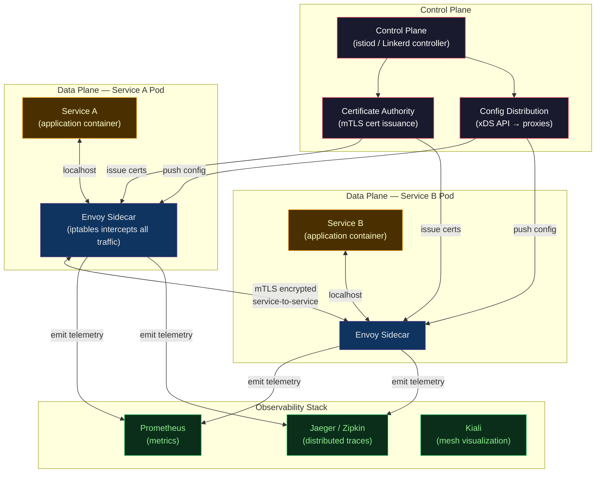

# 🕸️ Service Mesh Fundamentals

> [!abstract] TL;DR
> A **service mesh** is a dedicated infrastructure layer for service-to-service (east-west) communication. It implements the sidecar pattern: a proxy (Envoy) is injected alongside every pod and intercepts all inbound/outbound traffic. The **data plane** (proxies) enforces mTLS, retries, circuit breaking, and collects telemetry. The **control plane** (Istio's istiod, Linkerd's controller) distributes configuration to the proxies. Result: network policies, mutual TLS, and observability without any application code changes. Trade-off: operational complexity and ~5–10% latency overhead from the extra hop.

---

## Intuition — analogy FIRST

Imagine a corporate campus where every employee (microservice) walks through a security checkpoint (sidecar proxy) each time they enter or leave their building. The checkpoint validates their badge (mTLS certificate), logs where they went and how long they stayed (telemetry), can block them if they're behaving strangely (circuit breaking), and can redirect them based on their clearance level (traffic routing). The **guard headquarters** (control plane) updates the checkpoint rules — no individual employee needs to know the security procedures; the checkpoints handle it all.

---

## How It Works



---

## Key Concepts / Details

### Data Plane vs Control Plane

| Layer | What | Who (Istio) | Who (Linkerd) |
|-------|------|-------------|---------------|
| **Data plane** | Proxy sidecars — enforce policy, collect metrics | Envoy | Linkerd2-proxy (Rust) |
| **Control plane** | Config distribution, cert mgmt, policy compilation | istiod | Linkerd controller |

The control plane never touches actual traffic — it configures the proxies.

### Sidecar Proxy Pattern

```
Pod (before mesh injection):
  ┌─────────────────────────┐
  │   Application Container  │
  └─────────────────────────┘

Pod (after mesh injection — automatic via webhook):
  ┌─────────────────────────┐
  │   Application Container  │
  │   localhost:8080         │
  ├─────────────────────────┤
  │   Envoy Sidecar          │
  │   (istio-proxy container)│
  │   Intercepts via iptables│
  │   Port 15001 (outbound)  │
  │   Port 15006 (inbound)   │
  └─────────────────────────┘
```

iptables rules redirect all traffic through the proxy transparently. The application believes it is communicating directly with the upstream service, but every packet passes through Envoy first.

### East-West vs North-South Traffic

```
External Client
      │
      │ North-South (ingress)
      ▼
  Ingress Controller / API Gateway
  (handles TLS termination, auth, rate limit)
      │
      ▼
 ┌────────────────────────────────────┐
 │  Kubernetes Cluster                │
 │                                    │
 │  Service A ←── East-West ──→ Service B  │
 │      │          (mTLS, service mesh)  │   │
 │      └──────────────────────────────┘  │
 └────────────────────────────────────┘
```

**Service mesh** handles east-west traffic (service-to-service inside the cluster). An **API gateway** handles north-south traffic (external → cluster). They are complementary, not competing.

### Mutual TLS (mTLS)

Standard TLS: client verifies server identity.
mTLS: **both** sides present certificates — server verifies client, client verifies server.

```
Service A → Envoy A:  "call payments-svc:8080"
Envoy A → Envoy B:    mTLS handshake
  - A presents cert: SPIFFE ID: spiffe://cluster.local/ns/production/sa/orders-svc
  - B presents cert: SPIFFE ID: spiffe://cluster.local/ns/production/sa/payments-svc
  - Both verify against mesh CA
  - Encrypted channel established
  - Request proceeds with mutual authentication
```

SPIFFE (Secure Production Identity Framework) IDs encode workload identity in a standardised URI format, enabling cross-cluster and cross-mesh identity federation.

### Observability from the Mesh

Sidecars emit all three pillars automatically, without application code changes:

```yaml
# Metrics (Prometheus format)
envoy_cluster_upstream_rq_total{
  cluster_name="outbound|8080||payments-svc.production.svc.cluster.local",
  response_code="200"
} 14523

# Distributed traces (auto-propagated headers)
# Envoy generates span per request, propagates B3/W3C trace context headers
# Application must forward: x-request-id, x-b3-traceid, x-b3-spanid

# Access logs (per-request)
[2026-07-28T14:23:11.432Z] "POST /api/v1/charge HTTP/1.1" 200 "-" 
  client: orders-svc.production.svc.cluster.local
  upstream: 10.0.1.45:8080
  duration: 12ms bytes_sent: 234 bytes_received: 89
```

### Service Mesh vs API Gateway

| Concern | API Gateway | Service Mesh |
|---------|------------|-------------|
| Traffic direction | North-South (external) | East-West (internal) |
| Protocol | HTTP/1, HTTP/2, WebSocket | HTTP/1, HTTP/2, gRPC, TCP |
| Auth | OAuth2, JWT validation | mTLS (identity), AuthorizationPolicy |
| Typical tools | Kong, AWS ALB, NGINX | Istio, Linkerd, Consul |
| Deployment | Single/small cluster | Per-pod sidecar |
| Use together? | Yes — complementary layers | Yes |

### When to Use a Service Mesh

```
Use a service mesh when:
  ✓ >10 microservices with complex inter-service communication
  ✓ Zero-trust networking requirement (mTLS mandatory)
  ✓ Need unified observability (traces, metrics) without app changes
  ✓ Canary deployments, traffic shifting between service versions
  ✓ Circuit breaking, retry logic across all services consistently
  ✓ Compliance requiring encrypted all traffic (PCI-DSS, HIPAA)

Skip/defer when:
  ✗ Monolith or ≤3 microservices (overhead not justified)
  ✗ Team lacks Kubernetes/networking expertise
  ✗ Latency budget is very tight (<5ms P99 requirements)
  ✗ Already solving with app-level circuit breakers (Resilience4j)
```

### Overhead Trade-offs

| Dimension | Impact | Notes |
|-----------|--------|-------|
| **Latency** | +1–5ms P99 | Extra iptables + proxy hop; Linkerd's Rust proxy adds ~1ms vs Envoy ~2–5ms |
| **Memory** | +50–100MB per pod | Envoy: ~50MB; Linkerd2-proxy: ~10MB |
| **CPU** | +5–10% per service | mTLS crypto, metric aggregation |
| **Ops complexity** | High | CRDs, control plane HA, upgrade management |
| **Debug complexity** | High | iptables interception adds a hidden hop |

---

## Real-World Notes

- **Gradual adoption**: enable the mesh namespace-by-namespace (or pod-by-pod via label). Don't inject all pods at once; validate each namespace before proceeding.
- **gRPC + HTTP/2 awareness**: Envoy understands gRPC natively. Enable HTTP/2 in `DestinationRule` to avoid protocol downgrade for gRPC services.
- **Ambient mesh (Istio 1.21+)**: The sidecar model is evolving toward "ambient mesh" — L4 handled by a per-node proxy (ztunnel), L7 handled by a shared waypoint proxy. Removes per-pod sidecar overhead.
- **Health check port exclusion**: Kubernetes liveness/readiness probes originate from the kubelet, not from inside the pod, so they bypass the sidecar by default in Istio 1.9+ (kubelet health check rewrite).

---

## Common Pitfalls

1. **Not excluding health check ports** — in older Istio versions, iptables intercepts kubelet health checks causing them to fail; annotate pods with `traffic.sidecar.istio.io/excludeInboundPorts`.
2. **mTLS in PERMISSIVE mode forever** — starting with `PERMISSIVE` (allows both mTLS and plaintext) is fine for migration, but STRICT mode should be the production target; plaintext leaves the mesh unprotected.
3. **Missing trace header forwarding** — Envoy creates root spans but the application must forward B3/W3C headers on upstream calls; without this, traces are fragmented.
4. **Circuit breaker ejection too aggressive** — default outlier detection settings can eject all healthy hosts; tune `maxEjectionPercent` (default 10%) and validate before enabling in production.
5. **Sidecar injection in kube-system namespace** — injecting sidecars into system namespaces breaks DNS and kube-proxy; always exclude system namespaces from automatic injection.

---

## Related Concepts

- [[_MOC_Service_Mesh|↑ Service Mesh MOC]]
- [[Istio_Architecture_and_Setup|→ Istio Architecture]] — most feature-rich mesh implementation
- [[Istio_Traffic_Management|→ Istio Traffic Management]] — VirtualService, DestinationRule patterns
- [[Linkerd|→ Linkerd]] — lightweight alternative, Rust-based proxy
- [[Consul_and_Envoy|→ Consul & Envoy]] — Consul mesh and standalone Envoy
- [[../04_Kubernetes/Kubernetes_Core_Concepts|← K8s Core Concepts]] — pods, namespaces, webhooks
- [[../07_Monitoring_Observability/Distributed_Tracing|← Distributed Tracing]] — mesh-provided traces in Jaeger

---

## Review Questions

1. Explain the iptables interception mechanism. Why does the application not need to be aware of the sidecar proxy?
2. Compare a service mesh and an API gateway: can they coexist? Describe a request flow from an external client to a backend service that passes through both.
3. Your team is experiencing 8ms P99 latency between two services. After adding Istio, it becomes 14ms. Is this expected? What are two ways to reduce the overhead?
4. Define SPIFFE ID. How does it differ from a traditional TLS certificate's Common Name for microservice identity?

---

## Sources

- Envoy Proxy Documentation — envoyproxy.io/docs
- SPIFFE/SPIRE — spiffe.io
- Istio Documentation — istio.io/docs
- Linkerd Documentation — linkerd.io/docs

#DevOps #ServiceMesh #Envoy #mTLS #DataPlane #ControlPlane #EastWest #Observability #SPIFFE
