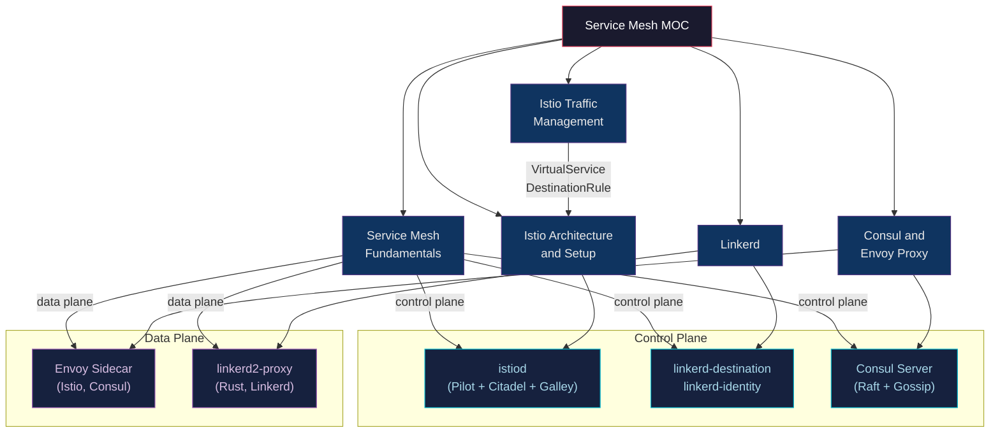
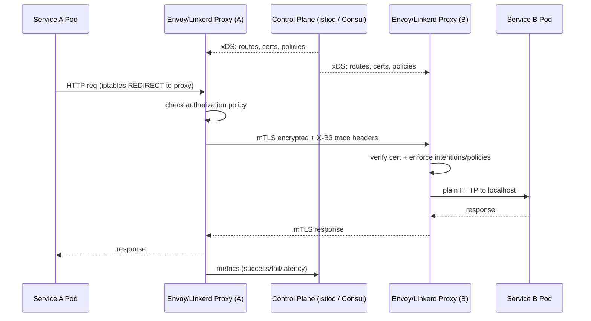

---
title: Service Mesh — Section MOC
aliases: [Service Mesh MOC, _MOC_Service_Mesh]
tags: [DevOps, MOC, ServiceMesh, Kubernetes, Istio, Linkerd, Consul, Envoy]
domain: DevOps
difficulty: Advanced
created: 2026-07-29
related: [_MOC_Kubernetes, _MOC_Containers_Docker, _MOC_Networking_Protocols, _MOC_Monitoring_Observability]
status: complete
---

# Service Mesh — Section MOC

> [!abstract] Section Overview
> 5 notes covering the service mesh ecosystem: fundamentals (why meshes exist, data vs control plane), Istio architecture and setup, Istio traffic management patterns (canary, circuit breaking, fault injection), Linkerd (lightweight Rust-based alternative), and Consul + Envoy (multi-runtime mesh + programmable proxy). Service meshes address the cross-cutting concerns of service-to-service communication — mTLS, observability, retries, traffic control — at the infrastructure layer rather than in application code.

[[../_MOC_DevOps_Master|Up to DevOps Master MOC]]

---

## Section Architecture

---

## Traffic Flow Through the Mesh

---

## Learning Path

| Step | Note | Focus | Difficulty |
|---|---|---|---|
| 1 | [[Service_Mesh_Fundamentals]] | Why meshes exist, sidecar pattern, data vs control plane | Intermediate |
| 2 | [[Istio_Architecture_and_Setup]] | istiod components, Envoy injection, core CRDs, Kiali | Advanced |
| 3 | [[Istio_Traffic_Management]] | VirtualService, DestinationRule, canary, circuit breaking, fault injection | Advanced |
| 4 | [[Linkerd]] | Rust proxy, automatic mTLS, ServiceProfile, SMI TrafficSplit | Intermediate |
| 5 | [[Consul_and_Envoy]] | Consul Connect, Intentions, WAN federation, Envoy xDS deep dive | Advanced |

---

## Notes in This Section

| Note | Key Concepts | Tags |
|---|---|---|
| [[Service_Mesh_Fundamentals]] | Sidecar proxy, data plane, control plane, east-west vs north-south, SPIFFE, SMI | `#ServiceMesh #Envoy #mTLS` |
| [[Istio_Architecture_and_Setup]] | istiod, MutatingWebhook, VirtualService, DestinationRule, Gateway, Kiali, istioctl | `#Istio #istiod #Kiali` |
| [[Istio_Traffic_Management]] | Canary/A-B testing, circuit breaking, retries, timeouts, fault injection, mirroring | `#TrafficManagement #CanaryDeployment` |
| [[Linkerd]] | linkerd2-proxy (Rust), automatic mTLS, ServiceProfile, TrafficSplit, linkerd viz | `#Linkerd #RustProxy #SMI` |
| [[Consul_and_Envoy]] | Consul Connect, Intentions, WAN federation, Envoy xDS/LDS/RDS/CDS/EDS/SDS | `#Consul #Envoy #xDS` |

---

## Service Mesh Comparison

| Dimension | Istio | Linkerd | Consul Connect |
|---|---|---|---|
| **Proxy** | Envoy (C++) | linkerd2-proxy (Rust) | Envoy (C++) |
| **Complexity** | High | Low | Medium |
| **K8s-only** | No (VM support via WorkloadEntry) | Yes | No (multi-runtime) |
| **Auto mTLS** | Yes (PeerAuthentication) | Yes (zero config) | Yes (Intentions) |
| **Traffic management** | Rich (header routing, fault injection) | Basic (TrafficSplit) | Medium (Intentions L7) |
| **Observability** | Prometheus + Kiali + Jaeger | linkerd viz (tap, top, routes) | Consul UI + Envoy stats |
| **Multi-DC** | Istio East-West Gateway | Linkerd multicluster | WAN federation (native) |
| **JWT auth** | Yes (RequestAuthentication) | No | No |

---

## When to Use a Service Mesh

| Situation | Recommendation |
|---|---|
| Small team, <10 microservices | Skip the mesh — add app-level retry/timeout libraries |
| Need mTLS between services, minimal ops burden | **Linkerd** |
| Need full L7 routing, canary, fault injection, JWT auth | **Istio** |
| Multi-runtime (K8s + VMs + bare metal), multi-DC | **Consul Connect** |
| Already using HashiCorp stack (Vault, Nomad) | **Consul Connect** |
| Migrating from non-mesh to mesh gradually | Linkerd (lower blast radius if misconfigured) |

---

## Related Sections

- [[../_MOC_Kubernetes|Kubernetes]] — mesh runs on top of K8s; Ingress handles north-south traffic
- [[../_MOC_Containers_Docker|Containers & Docker]] — sidecar containers, pod networking
- [[../_MOC_Monitoring_Observability|Monitoring & Observability]] — mesh emits Prometheus metrics, distributed traces
- [[../11_Secret_Management/_MOC_Secret_Management|Secret Management]] — mTLS certificates, SPIFFE/SPIRE identity

---

#DevOps #MOC #ServiceMesh #Kubernetes #Istio #Linkerd #Consul #Envoy
