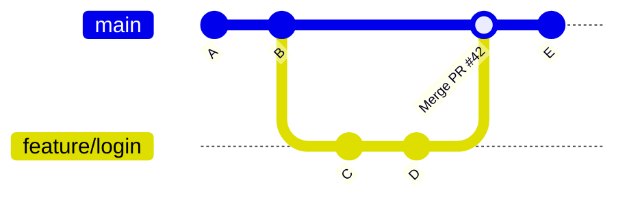

# GitHub Collaboration

> [!abstract] TL;DR
> GitHub's collaboration model centres on pull requests: branch → PR → code review → merge. Fork workflow adds an additional remote for open-source contributions. Branch protection rules enforce code quality gates. CODEOWNERS automates reviewer assignment. GitHub Projects, Releases, and Dependabot round out the collaboration lifecycle.

---

## GitHub Flow

The simplest sustainable branching model for teams deploying continuously:

```
1. Create a branch from main
2. Add commits
3. Open a Pull Request
4. Review and discuss
5. (Optionally) deploy the branch to a staging environment
6. Merge to main
7. Delete the branch
```



Key principle: `main` is **always deployable**. Never commit broken code to main.

---

## Fork Workflow (Open Source)

```
upstream/org/repo  (authoritative)
        │
        │ fork
        ▼
origin/you/repo    (your fork on GitHub)
        │
        │ clone
        ▼
local              (your machine)
```

```bash
# 1. Fork on GitHub UI → creates origin/you/repo
git clone https://github.com/you/repo.git
git remote add upstream https://github.com/org/repo.git

# 2. Keep your fork in sync
git fetch upstream
git checkout main
git merge upstream/main
git push origin main

# 3. Create a feature branch and open a PR from fork → upstream
git checkout -b feature/my-fix
git push origin feature/my-fix
# Then open PR from your fork's branch to upstream's main on GitHub UI
```

---

## Pull Request Anatomy

A well-structured PR has:

```
Title: feat(auth): add JWT refresh token rotation

## Summary
<!-- Why this change? What does it do? -->
Implements RFC for rotating refresh tokens on every use (closes #198).

## Changes
- Added `TokenRotationService`
- Updated `AuthController.refresh()` to issue new refresh token
- Deprecated `POST /api/v1/login` (returns 301 → /api/v2/login)

## Test plan
- [x] Unit tests for TokenRotationService
- [x] Integration test: back-to-back refresh calls
- [ ] Load test: 1000 concurrent refreshes (blocked on #201)

## Screenshots / recordings
<!-- Attach if UI change -->

## Breaking changes
`POST /api/v1/login` removed in v3.0.0
```

### PR Fields

| Field | Purpose |
|-------|---------|
| **Linked issues** | `Closes #42` auto-closes issue on merge |
| **Reviewers** | Team members assigned for review |
| **Assignees** | Person responsible for the PR |
| **Labels** | `bug`, `feature`, `breaking-change`, `WIP`, etc. |
| **Milestones** | Group PRs into a release |
| **Projects** | Add to a GitHub Project board |

---

## Code Review Best Practices

### Giving Reviews

- Focus on the code, not the author. ("This function" not "you wrote this function wrong")
- Distinguish blocking (`[blocking]`) from suggestions (`[nit]`)
- Suggest concrete alternatives: GitHub allows **suggestion commits** — inline diffs the author can apply with one click

```diff
# Suggestion commit syntax in a review comment:
```suggestion
    return user.uuid
```
```

- Approve when ready; request changes with clear required actions
- Keep comments actionable: "Consider extracting this to a helper" not "this is messy"

### Review Checklist Template

- [ ] Correctness: does the logic do what the PR description says?
- [ ] Tests: are new behaviours covered? Are edge cases handled?
- [ ] Security: any injection risk, credential exposure, IDOR?
- [ ] Performance: any N+1 queries, unbounded loops, large allocations?
- [ ] Error handling: all error paths handled gracefully?
- [ ] Documentation: public API changes documented?
- [ ] Breaking change: noted in PR description and changelog?

---

## CODEOWNERS File

Placed at `.github/CODEOWNERS` (or repo root / `docs/`). Automatically requests reviews from owners when their files are changed.

```
# Syntax: <path-pattern> <@owner-or-team>

# All files — default owner
*                          @org/platform-team

# Frontend
/src/frontend/             @alice @bob

# Backend
/src/backend/              @org/backend-team

# Kubernetes configs — multiple owners
/k8s/                      @carol @org/sre-team

# Any change to workflows requires platform approval
/.github/workflows/        @org/platform-team

# Specific file
/package.json              @org/security-team
```

> [!note]
> CODEOWNERS only triggers required reviews when branch protection requires "Required review from Code Owners" is enabled.

---

## Branch Protection Rules

Navigate to **Settings → Branches → Add rule** for the `main` (or any protected) branch.

| Rule | What It Enforces |
|------|-----------------|
| **Require a pull request** | No direct pushes to branch |
| **Required reviews** | N approvals before merge (e.g., 2) |
| **Dismiss stale reviews** | Re-review required after new commits |
| **Require review from Code Owners** | CODEOWNERS must approve |
| **Required status checks** | CI must pass (specify check names) |
| **Require branches to be up to date** | Branch must be current with base before merge |
| **Require signed commits** | All commits must have GPG/SSH signature |
| **Restrict who can push** | Only specific users/teams can force-push or push directly |
| **Include administrators** | Applies rules even to repo admins |

```yaml
# Branch protection via GitHub CLI
gh api repos/org/repo/branches/main/protection \
  --method PUT \
  --field required_pull_request_reviews[required_approving_review_count]=2 \
  --field required_status_checks[strict]=true \
  --field enforce_admins=true
```

---

## GitHub Discussions vs Issues vs PRs

| Tool | Purpose | When to Use |
|------|---------|------------|
| **Issues** | Bug reports, feature requests, tasks | Track actionable work items |
| **Discussions** | Q&A, ideas, announcements, polls | Open-ended conversation not tied to a specific task |
| **Pull Requests** | Code changes for review | Always when changing code |

Issues can be converted to Discussions and vice versa. Use `Closes #42` in PR description to auto-close an issue on merge.

---

## GitHub Projects (Kanban)

GitHub Projects (v2) is a flexible database-style project tracker integrated with Issues and PRs.

- **Views**: Board (Kanban), Table, Roadmap (Gantt-style)
- **Custom fields**: Status, Priority, Sprint, Estimate, linked PRs
- **Automations**: auto-move items when PR is opened/merged, issue is closed
- **Filtering/grouping**: by label, assignee, milestone, custom field

```
# Linking an issue to a project via CLI
gh issue create --title "Add refresh token" --project "Q3 Auth Sprint"
```

---

## GitHub Releases and Semantic Versioning

### Semantic Versioning (SemVer)

```
MAJOR.MINOR.PATCH[-prerelease][+buildmeta]

1.4.2
2.0.0-rc.1
3.1.0+git.abc123
```

| Bump | When |
|------|------|
| **MAJOR** | Breaking changes (removes/changes public API) |
| **MINOR** | New backwards-compatible functionality |
| **PATCH** | Backwards-compatible bug fixes |
| **Pre-release** | Alpha/beta/RC: `1.0.0-alpha.1`, `2.0.0-rc.2` |

### Creating a Release

```bash
git tag -a v1.4.2 -m "Release 1.4.2 — patch for CVE-2026-1234"
git push origin v1.4.2

# Via GitHub CLI
gh release create v1.4.2 \
  --title "v1.4.2" \
  --notes "Patch: fix CSRF token validation" \
  --prerelease=false \
  dist/*.tar.gz   # attach build artifacts
```

A release bundles: a tag, release notes (auto-generated from PR titles or manual), and optional binary assets.

---

## Dependabot for Automated Dependency Updates

`.github/dependabot.yml` configures automated PRs for outdated dependencies:

```yaml
version: 2
updates:
  # npm
  - package-ecosystem: "npm"
    directory: "/"
    schedule:
      interval: "weekly"
    reviewers:
      - "org/platform-team"
    labels:
      - "dependencies"
    open-pull-requests-limit: 5

  # GitHub Actions
  - package-ecosystem: "github-actions"
    directory: "/"
    schedule:
      interval: "monthly"

  # Docker base images
  - package-ecosystem: "docker"
    directory: "/docker"
    schedule:
      interval: "weekly"
```

Dependabot also runs **security alerts** — if a dependency has a published CVE, it opens a PR automatically with the patched version.

---

## Common Pitfalls

| Pitfall | Cause | Fix |
|---------|-------|-----|
| Stale review approvals | New commits pushed after approval | Enable "Dismiss stale reviews" in branch protection |
| PR merged without CI | No required status checks | Add CI workflow names to "Required status checks" |
| CODEOWNERS not triggering | File in wrong location | Must be `.github/CODEOWNERS`, `CODEOWNERS`, or `docs/CODEOWNERS` |
| Dependabot PR flood | Too many ecosystems, daily schedule | Use `weekly` schedule and set `open-pull-requests-limit` |
| Fork out of sync | Long-running fork not synced | Always `git fetch upstream && git rebase upstream/main` before new work |

---

## Review Questions

1. In GitHub Flow, what is the single rule about `main` that must always hold?
2. Write a CODEOWNERS entry that requires `@org/security-team` to review any file in `/src/auth/`.
3. What is the difference between "Dismiss stale reviews" and "Required review from Code Owners" as branch protection settings?
4. When would you use a fork workflow instead of branching directly in the upstream repo?
5. Explain when you would bump MAJOR vs MINOR vs PATCH in semantic versioning. Give an example for each.
6. What is a suggestion commit in a PR review and why is it useful?

---

#Git #GitHub #DevOps
