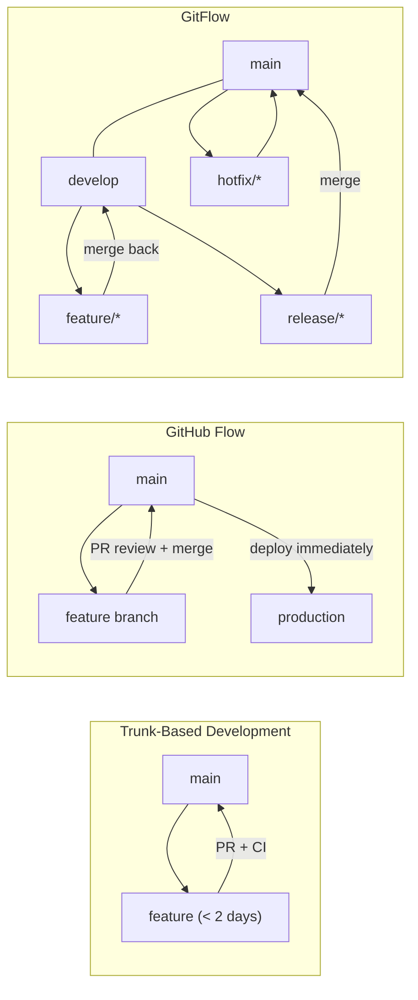

# Git Branching and Merging

> [!abstract] TL;DR
> A branch in Git is a file containing one SHA-1. Creating or deleting a branch costs nothing. Merging has two modes: fast-forward (moves a pointer) and 3-way (creates a merge commit). Rebase replays commits onto a new base to produce a linear history. Interactive rebase is the primary tool for cleaning up local history before sharing.

---

## Branch as a Lightweight Pointer

```
main:    A → B → C
                  ↑
                HEAD
```

Creating a branch writes one 40-byte file to `.git/refs/heads/<name>`:

```bash
git branch feature/login       # creates pointer at current HEAD
git checkout -b feature/login  # create + switch (classic syntax)
git switch -c feature/login    # create + switch (modern syntax, Git 2.23+)
git branch -v                  # list with latest commit
git branch --merged main       # branches whose tip is in main's ancestry
git branch -d feature/login    # delete (safe: rejects if unmerged)
git branch -D feature/login    # force delete
```

---

## Fast-Forward vs 3-Way Merge

### Fast-Forward Merge

Occurs when the target branch has **no diverging commits** — it is a direct ancestor.

```
Before:     main: A → B → C
                            ↑
            feature: A → B → C → D → E

After FF:   main: A → B → C → D → E  (pointer moved, no new commit)
```

```bash
git checkout main
git merge feature/login        # fast-forward if possible
git merge --no-ff feature/login  # force a merge commit even when FF is possible
```

`--no-ff` preserves the fact that a feature branch existed, which is useful in GitFlow.

### 3-Way Merge

Occurs when both branches have diverged. Git finds the **merge base** (common ancestor) and combines changes from both sides.

```
        C → D → E   (main)
       /
A → B
       \
        F → G       (feature)

After merge:
A → B → C → D → E → M  (merge commit M has two parents: E and G)
              ↗
        F → G
```

```bash
git merge feature/login        # creates merge commit M
git log --oneline --graph      # visualise the merge
```

---

## Git Rebase — Replaying Commits on a New Base

Rebase takes commits from your branch, temporarily sets them aside, fast-forwards the branch to the new base, then re-applies each commit in order as **new commits** (new SHAs).

```
Before:                         After rebase onto main:
main: A → B → C → D            main: A → B → C → D
           ↑                                        ↑
feature:   B → X → Y           feature:            D → X' → Y'
```

```bash
git checkout feature/login
git rebase main                # replay feature commits on top of latest main
git rebase origin/main         # rebase onto remote main
```

> [!warning] Golden Rule
> Never rebase commits that have been pushed to a shared remote branch. Rebase rewrites SHAs; collaborators' histories diverge.

### Rebase vs Merge Comparison

| Dimension | Merge | Rebase |
|-----------|-------|--------|
| History shape | Non-linear (preserves topology) | Linear (clean) |
| Commit SHAs | Preserved | New SHAs created |
| Merge commit | Yes (3-way) | No |
| Safe for shared branches | Yes | No (rewrites history) |
| Conflict resolution | Once, at merge time | Once per replayed commit |
| Best for | Public integrations, audit trail | Local cleanup before PR |

---

## Interactive Rebase — Rewriting Local History

`git rebase -i HEAD~n` opens an editor listing the last n commits. Each line starts with a command:

| Command | Effect |
|---------|--------|
| `pick` | keep commit as-is |
| `reword` | keep commit, edit its message |
| `edit` | pause after applying (allows amending) |
| `squash` | meld into previous commit, combine messages |
| `fixup` | meld into previous commit, discard this message |
| `drop` | remove the commit entirely |
| `exec` | run a shell command between commits |

```bash
git rebase -i HEAD~4
# Editor shows:
# pick a1b2c3 feat: add login
# pick d4e5f6 fix: typo in login
# pick 789abc wip: half-done stuff
# pick def012 feat: add logout
#
# Change to:
# pick a1b2c3 feat: add login
# fixup d4e5f6 fix: typo in login
# drop 789abc wip: half-done stuff
# pick def012 feat: add logout
```

```bash
git rebase --abort             # bail out during a rebase
git rebase --continue          # after resolving a conflict mid-rebase
git rebase --skip              # skip current conflicting commit
```

---

## Cherry-Pick

Apply specific commits from any branch onto the current branch. Creates new commits with new SHAs.

```bash
git cherry-pick abc123                     # apply one commit
git cherry-pick abc123 def456             # apply multiple
git cherry-pick main~3..main~1            # apply a range (exclusive..inclusive)
git cherry-pick -n abc123                 # stage only, don't commit automatically
```

Use cases: backporting a hotfix to a release branch; extracting a single useful commit from an experimental branch.

---

## Merge Conflicts

A conflict occurs when both branches modify the same region of a file differently.

### Conflict Markers

```
<<<<<<< HEAD
    return user.id
=======
    return user.uuid
>>>>>>> feature/uuid-migration
```

- Everything above `=======` is the current branch (HEAD).
- Everything below is the incoming branch.

### Resolving Conflicts

```bash
git status                     # shows files with conflicts (UU = unmerged both)
# Edit each conflicted file, remove markers, keep desired code
git add <resolved-file>
git commit                     # complete the merge
# or
git merge --abort              # abandon the merge entirely
```

```bash
git mergetool                  # open configured 3-way diff tool
git config --global merge.tool vimdiff   # set preferred tool
```

### Merge Strategy Options

```bash
git merge -X ours feature      # on conflicts, always prefer our version
git merge -X theirs feature    # on conflicts, always prefer their version
git merge -s ours feature      # use "ours" strategy (discards all their changes)
```

---

## Branch Naming Conventions

| Prefix | Purpose | Example |
|--------|---------|---------|
| `feature/` | New functionality | `feature/payment-gateway` |
| `bugfix/` | Non-urgent bug fixes | `bugfix/null-pointer-login` |
| `hotfix/` | Urgent production fixes | `hotfix/csrf-token-1.4.2` |
| `release/` | Release preparation | `release/2.3.0` |
| `chore/` | Tooling, dependencies | `chore/upgrade-node-20` |
| `docs/` | Documentation only | `docs/api-reference` |
| `experiment/` | Throwaway exploration | `experiment/llm-autocomplete` |

Rules of thumb:
- Use lowercase and hyphens (`kebab-case`)
- Include ticket number where applicable: `feature/JIRA-42-user-auth`
- Keep names short but descriptive

---

## Workflow Strategy Comparison



| Strategy | Branches | Release Cadence | Best For |
|----------|----------|-----------------|----------|
| **Trunk-Based** | main + short-lived feature | Continuous | High-velocity CI/CD teams |
| **GitHub Flow** | main + feature | On merge | SaaS, web apps, small teams |
| **GitFlow** | main, develop, feature, release, hotfix | Scheduled releases | Versioned software, libraries |

**Trunk-based** requires feature flags to hide incomplete features. Conflicts are smaller because branches live < 2 days. DORA metrics favour trunk-based for elite performers.

---

## Common Pitfalls

| Pitfall | Cause | Fix |
|---------|-------|-----|
| Rebase rewrites shared history | Rebasing a pushed branch | Only rebase local branches; use merge for shared ones |
| Merge conflict avalanche | Long-lived branch diverging far from main | Integrate frequently (daily) |
| Missing merge base after squash | Squash merge loses commit graph | Use `git cherry-pick -n` for partial backports |
| Accidental force-push to main | No branch protection rule | Enable branch protection on main |
| Detached HEAD after checkout tag | `git checkout v1.2.3` | Use `git checkout -b hotfix/v1.2.3 v1.2.3` |

---

## Review Questions

1. You have `main` at commit C, and `feature` at commit C→D→E. What happens when you run `git merge feature` from `main`? Does Git create a merge commit?
2. Explain why `git rebase` should not be used on branches that other developers are using.
3. When would you use `squash` vs `fixup` in interactive rebase?
4. A hotfix needs to go to both `main` and `release/2.3` branches. What Git command lets you apply it to both?
5. Your team is releasing versioned software once a month. Which branching strategy is most appropriate and why?
6. What does `git merge --no-ff` do and why might a team always use this flag?

---

#Git #GitHub #DevOps
