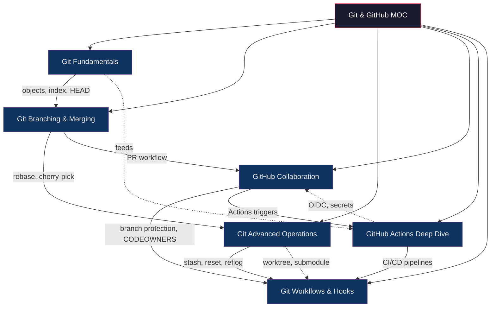

# Git & GitHub — Section MOC

> [!abstract] About
> 6 notes covering Git's internals, branching and merging strategies, advanced operations, GitHub collaboration workflows, GitHub Actions CI/CD, and automating quality gates with hooks. This section bridges Git fundamentals all the way through production-grade GitHub workflows and cloud-native CI/CD with OIDC.

---

## Concept Map



---

## Notes in This Section

| # | Note | Difficulty | Core Concepts |
|---|------|------------|---------------|
| 1 | [[Git_Fundamentals]] | Beginner | Blob/tree/commit/tag objects, SHA-1, index, HEAD, refs, packfiles, Conventional Commits |
| 2 | [[Git_Branching_and_Merging]] | Intermediate | Fast-forward, 3-way merge, rebase, interactive rebase, cherry-pick, conflicts, GitFlow vs GitHub Flow |
| 3 | [[Git_Advanced_Operations]] | Advanced | stash, reset modes, revert, reflog, bisect, blame, worktree, submodule, subtree, add -p |
| 4 | [[GitHub_Collaboration]] | Intermediate | GitHub Flow, fork workflow, PR anatomy, code review, CODEOWNERS, branch protection, Dependabot |
| 5 | [[GitHub_Actions_Deep_Dive]] | Advanced | Workflow YAML, matrix, caching, artifacts, reusable workflows, composite actions, OIDC |
| 6 | [[Git_Workflows_and_Hooks]] | Advanced | GitFlow, trunk-based dev, monorepo, hooks, Husky, lint-staged, commitlint, lefthook, .gitattributes |

---

## Recommended Learning Paths

### Path A — Git Beginner
```
Git Fundamentals → Git Branching and Merging → GitHub Collaboration
```

### Path B — CI/CD Focus
```
Git Fundamentals → GitHub Collaboration → GitHub Actions Deep Dive
```

### Path C — Engineering Excellence
```
Git Fundamentals → Git Branching and Merging → Git Advanced Operations
→ Git Workflows and Hooks
```

### Path D — Full Section
```
Git Fundamentals → Git Branching and Merging → Git Advanced Operations
→ GitHub Collaboration → GitHub Actions Deep Dive → Git Workflows and Hooks
```

---

## Key Formulas and Rules

| Concept | Rule |
|---------|------|
| Bisect steps | `⌈log₂ n⌉` steps for n commits |
| Conventional Commits | `<type>(<scope>): <description>` |
| SemVer | `MAJOR.MINOR.PATCH` — breaking / new feature / bug fix |
| Reflog retention | HEAD: 90 days; other refs: 30 days |
| Trunk-based branch life | < 2 days |
| reset --hard | Irrecoverable from working tree (but commits in reflog) |

---

## Cross-Section Links

- [[../01_Git_Version_Control/_MOC_Git_Version_Control|01 Git & Version Control]] — Git internals, monorepo tools, deeper branching
- [[../02_CICD_Pipelines/_MOC_CICD_Pipelines|02 CI/CD Pipelines]] — Jenkins, ArgoCD, GitOps, release strategies
- [[../_MOC_DevOps_Master|DevOps Master MOC]] — full vault overview

---

#Git #GitHub #DevOps #MOC
