# 🚀 DevOps & Platform Engineering — Master MOC

> [!abstract] Vault Overview
> 72 notes across 13 sections covering Git internals, CI/CD pipelines, containers, Kubernetes, IaC, cloud platforms, observability, Linux/OS internals, networking protocols, web servers, secrets management, service meshes, and Git/GitHub workflows. Designed for platform engineers, SREs, and DevOps practitioners targeting production-grade system design.

---

## Vault Architecture

```mermaid
graph TD
    MASTER["🚀 DevOps Master MOC"]:::master

    GIT["01 Git & Version Control"]:::section
    CICD["02 CI/CD Pipelines"]:::section
    CONT["03 Containers & Docker"]:::section
    K8S["04 Kubernetes"]:::section
    IAC["05 Infrastructure as Code"]:::section
    CLOUD["06 Cloud Platforms"]:::section
    OBS["07 Monitoring & Observability"]:::section

    GIT_INT["Git Internals"]:::note
    GIT_BR["Branching Strategies"]:::note
    GIT_RB["Rebasing & History"]:::note
    GIT_HK["Git Hooks & Automation"]:::note
    GIT_MR["Monorepo Tools"]:::note

    CI_PR["CI/CD Principles"]:::note
    CI_GH["GitHub Actions"]:::note
    CI_JK["Jenkins & GitLab CI"]:::note
    CI_AR["ArgoCD & GitOps"]:::note
    CI_RS["Release Strategies"]:::note

    D_ARCH["Docker Architecture"]:::note
    D_DF["Dockerfile Best Practices"]:::note
    D_NET["Compose & Networking"]:::note
    D_SEC["Container Security"]:::note
    D_REG["Registry & Distribution"]:::note

    K_CORE["K8s Core Concepts"]:::note
    K_NET["Networking & Ingress"]:::note
    K_STO["Storage & StatefulSets"]:::note
    K_HLM["Helm Charts"]:::note
    K_OPR["Operators & CRDs"]:::note

    TF["Terraform Core & Modules"]:::note
    CF["CloudFormation & CDK"]:::note
    ANS["Ansible"]:::note
    PUL["Pulumi"]:::note
    DR["Drift Detection"]:::note

    AWS["AWS Core Services"]:::note
    GCP["GCP Services"]:::note
    AZ["Azure Services"]:::note
    MC["Multi-Cloud Patterns"]:::note
    FO["FinOps & Cost Optimization"]:::note

    PROM["Prometheus & Alertmanager"]:::note
    GRAF["Grafana Dashboards"]:::note
    ELK["ELK/EFK Stack"]:::note
    TRACE["Distributed Tracing"]:::note
    SLO["SLO/SLI/SLA & Error Budgets"]:::note

    LINUX["08 Linux & OS"]:::section
    NET["09 Networking Protocols"]:::section
    WEB["10 Web Servers"]:::section
    SEC["11 Secret Management"]:::section
    MESH["12 Service Mesh"]:::section
    GH["13 Git & GitHub"]:::section

    LX_F["Linux Fundamentals"]:::note
    LX_P["Process Management"]:::note
    LX_S["Shell Scripting"]:::note
    LX_N["Networking Commands"]:::note
    LX_PT["Performance Tuning"]:::note
    LX_H["Security Hardening"]:::note

    N_DNS["DNS & Resolution"]:::note
    N_HTTP["HTTP/HTTPS Deep Dive"]:::note
    N_TLS["SSL/TLS Certificates"]:::note
    N_SSH["SSH & Remote Access"]:::note
    N_LB["Load Balancers & Proxies"]:::note
    N_FW["Firewall & Network Security"]:::note

    W_NGX["Nginx Config"]:::note
    W_APA["Apache Config"]:::note
    W_PRX["Nginx Reverse Proxy"]:::note
    W_CDY["Caddy"]:::note
    W_SEC["Web Server Security"]:::note

    S_F["SM Fundamentals"]:::note
    S_V["HashiCorp Vault"]:::note
    S_K["K8s Secrets / ESO"]:::note
    S_S["SOPS & GitOps"]:::note
    S_C["AWS/Azure/GCP SM"]:::note

    M_F["Mesh Fundamentals"]:::note
    M_IA["Istio Architecture"]:::note
    M_TM["Istio Traffic Mgmt"]:::note
    M_LK["Linkerd"]:::note
    M_CE["Consul & Envoy"]:::note

    GH_FD["Git Fundamentals"]:::note
    GH_BM["Git Branching & Merging"]:::note
    GH_AO["Git Advanced Operations"]:::note
    GH_CO["GitHub Collaboration"]:::note
    GH_AC["GitHub Actions Deep Dive"]:::note
    GH_WH["Git Workflows & Hooks"]:::note

    MASTER --> GIT & CICD & CONT & K8S & IAC & CLOUD & OBS & LINUX & NET & WEB & SEC & MESH & GH
    GIT --> GIT_INT & GIT_BR & GIT_RB & GIT_HK & GIT_MR
    CICD --> CI_PR & CI_GH & CI_JK & CI_AR & CI_RS
    CONT --> D_ARCH & D_DF & D_NET & D_SEC & D_REG
    K8S --> K_CORE & K_NET & K_STO & K_HLM & K_OPR
    IAC --> TF & CF & ANS & PUL & DR
    CLOUD --> AWS & GCP & AZ & MC & FO
    OBS --> PROM & GRAF & ELK & TRACE & SLO
    LINUX --> LX_F & LX_P & LX_S & LX_N & LX_PT & LX_H
    NET --> N_DNS & N_HTTP & N_TLS & N_SSH & N_LB & N_FW
    WEB --> W_NGX & W_APA & W_PRX & W_CDY & W_SEC
    SEC --> S_F & S_V & S_K & S_S & S_C
    MESH --> M_F & M_IA & M_TM & M_LK & M_CE
    GH --> GH_FD & GH_BM & GH_AO & GH_CO & GH_AC & GH_WH

    GIT_INT -. feeds .-> CICD
    CONT -. foundation .-> K8S
    IAC -. provisions .-> CLOUD
    CLOUD -. hosts .-> K8S
    K8S -. emits .-> OBS
    CI_AR -. deploys to .-> K8S
    LINUX -. OS foundation .-> CONT
    LINUX -. OS foundation .-> K8S
    NET -. networking layer .-> K8S
    NET -. protocol knowledge .-> CONT
    K8S -. uses .-> SEC
    K8S -. mesh .-> MESH
    SEC -. certs .-> MESH
    GH -. "Actions CI/CD" .-> CICD
    GH_AC -. "OIDC + deploy" .-> CLOUD
    GH_WH -. "hooks + monorepo" .-> GIT

    classDef master fill:#1a1a2e,stroke:#e94560,color:#ffffff
    classDef section fill:#16213e,stroke:#0f3460,color:#a8d8ea
    classDef note fill:#0f3460,stroke:#533483,color:#e8e8e8
```



---

## Sections Overview

| # | Section | Notes | Core Concepts | Difficulty |
|---|---------|-------|---------------|------------|
| 01 | [[_MOC_Git_Version_Control\|Git & Version Control]] | 5 | Merkle DAG, branching strategies, rebase, hooks, monorepos | Intermediate |
| 02 | [[_MOC_CICD_Pipelines\|CI/CD Pipelines]] | 5 | DORA metrics, GitHub Actions, GitOps, release strategies | Intermediate |
| 03 | [[_MOC_Containers_Docker\|Containers & Docker]] | 5 | namespaces/cgroups, multi-stage builds, OCI specs, security | Intermediate |
| 04 | [[_MOC_Kubernetes\|Kubernetes]] | 5 | Pod lifecycle, CNI, Helm, Operators, CRDs | Advanced |
| 05 | [[_MOC_Infrastructure_as_Code\|Infrastructure as Code]] | 5 | Terraform, CDK, Ansible, Pulumi, drift detection | Intermediate |
| 06 | [[_MOC_Cloud_Platforms\|Cloud Platforms]] | 5 | AWS/GCP/Azure, multi-cloud, FinOps | Advanced |
| 07 | [[_MOC_Monitoring_Observability\|Monitoring & Observability]] | 5 | Prometheus, Grafana, traces, SLOs, error budgets | Advanced |
| 08 | [[08_Linux_and_OS/_MOC_Linux_and_OS\|Linux & OS]] | 6 | FHS, permissions, shell scripting, performance analysis, security hardening | Intermediate–Advanced |
| 09 | [[09_Networking_Protocols/_MOC_Networking_Protocols\|Networking Protocols]] | 6 | DNS, HTTP/2/3, TLS/mTLS, SSH tunneling, load balancers, iptables, WAF | Intermediate–Advanced |
| 10 | [[10_Web_Servers/_MOC_Web_Servers\|Web Servers]] | 5 | Nginx config, Apache VirtualHosts, reverse proxy, Caddy, web server security | Intermediate |
| 11 | [[11_Secret_Management/_MOC_Secret_Management\|Secret Management]] | 5 | Secrets sprawl, HashiCorp Vault, K8s secrets/ESO, SOPS, AWS SM/Azure KV | Intermediate–Advanced |
| 12 | [[12_Service_Mesh/_MOC_Service_Mesh\|Service Mesh]] | 5 | Sidecar proxy, mTLS, Istio (istiod/VirtualService/DestinationRule), Linkerd, Consul+Envoy | Advanced |
| 13 | [[13_Git_and_GitHub/_MOC_Git_GitHub\|Git & GitHub]] | 6 | Git objects, branching/merging, rebase, GitHub Flow, GitHub Actions, OIDC, hooks, trunk-based dev | Beginner–Advanced |

---

## Learning Paths

### Path A — Beginner Platform Engineer
```
Git Internals → Branching Strategies → CI/CD Principles → GitHub Actions
→ Docker Architecture → Dockerfile Best Practices → K8s Core Concepts → Helm
```

### Path B — Container & Orchestration Track
```
Docker Architecture → Container Security → K8s Core Concepts
→ K8s Networking → Storage & StatefulSets → Operators & CRDs
```

### Path C — Infrastructure & Cloud Track
```
Terraform Core → CloudFormation & CDK → Ansible → AWS Core Services
→ GCP Services → Multi-Cloud Patterns → FinOps
```

### Path D — SRE / Observability Track
```
Prometheus → Grafana Dashboards → Distributed Tracing
→ ELK/EFK Stack → SLO/SLI/SLA → Error Budgets
→ ArgoCD & GitOps → Release Strategies
```

### Path E — Security & Zero-Trust Track

```
Linux Security Hardening → SSL/TLS Certificates → Secret Management Fundamentals
→ HashiCorp Vault → K8s Secrets & ESO → SOPS & GitOps
→ Service Mesh Fundamentals → Istio Architecture → Istio Traffic Management
```

### Path F — Full Platform Engineering
All sections in order: 01 → 02 → 03 → 04 → 05 → 06 → 07 → 08 → 09 → 10 → 11 → 12 → 13

### Path G — Git & GitHub Deep Dive

```
Git Fundamentals → Git Branching and Merging → Git Advanced Operations
→ GitHub Collaboration → GitHub Actions Deep Dive → Git Workflows and Hooks
```

See [[13_Git_and_GitHub/_MOC_Git_GitHub|Git & GitHub MOC]]

---

## DORA Four Keys — Reference

| Metric | Elite | High | Medium | Low |
|--------|-------|------|--------|-----|
| Deployment Frequency | On-demand | Weekly | Monthly | <Monthly |
| Lead Time for Changes | <1 hour | <1 week | <1 month | >6 months |
| MTTR | <1 hour | <1 day | <1 week | >1 week |
| Change Failure Rate | 0–5% | 5–10% | 10–15% | >15% |

---

## Cross-Vault Links

- [[../AI-ML/_MOC_AI_ML_Master|AI/ML Vault]] — LLM Observability, MLOps pipelines
- [[../DSA/_MOC_DSA_Master|DSA Vault]] — Algorithms used in distributed systems
- [[../System Design/_MOC_SystemDesign_Master|System Design Vault]] — Distributed systems, reliability patterns
- [[../Database/_MOC_Database_Master|Database Vault]] — Postgres/MySQL in K8s, StatefulSets

---

## Key Formulas Reference

| Formula | Meaning |
|---------|---------|
| `conflict ∝ p·(λt)` | Branch conflict probability scales with team size × integration interval |
| `⌈log₂n⌉` | Git bisect steps for n commits |
| `E=(p·ec+(100-p)·es)/100` | Canary blended error rate |
| `R₀×∏(1-mᵢ)` | Container residual risk after mitigations |
| `A=1-(1-p)ⁿ` | Multi-cloud availability with n independent regions |
| `cost÷(1-SLO)` | Error budget burn rate denominator |
| `instances=⌈arrival×latency/concurrency⌉` | Cloud Run instance sizing |

---

#DevOps #MOC #Master #PlatformEngineering
