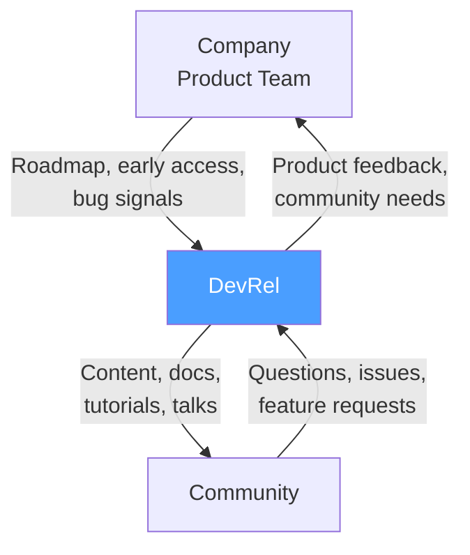

# DevRel Overview

> [!abstract] TL;DR
> Developer Relations (DevRel) is the bridge between a company and its developer community. The three pillars are awareness (talks, content), education (docs, tutorials), and community (forum, Discord, GitHub). DevRel is neither pure marketing nor pure engineering — it requires both technical depth and communication empathy. Success is measured by developer satisfaction, product adoption, community growth, and documentation quality.

## What is Developer Relations

**DevRel** is the practice of building authentic relationships between a company (or open-source project) and its developer community.



A good DevRel practitioner acts as an **internal advocate for developers** (bring developer feedback to the product team) and an **external advocate for the product** (help developers succeed with it).

---

## The Three Pillars of DevRel

### Pillar 1: Awareness

Getting developers to know your product exists and understand what it does:

- Conference talks (keynotes, technical sessions, workshops)
- Technical blog posts (features, tutorials, deep dives)
- Video content (YouTube, Twitch, conference recordings)
- Social media (technical threads, demos on X/LinkedIn)
- Podcast appearances
- Open-source contributions (making your tools visible in the ecosystem)

### Pillar 2: Education

Helping developers successfully use your product:

- Documentation (API reference, tutorials, how-to guides)
- Code samples and example applications
- SDK quickstarts
- Workshops and hands-on labs
- Office hours ("ask me anything" sessions)
- Developer certification programs

### Pillar 3: Community

Building and nurturing a developer community around your product:

- Discord server (help channels, showcase, announcements)
- GitHub Discussions
- Forum (Discourse)
- Community events (meetups, hackathons)
- Ambassador/champion programs
- Stack Overflow tag monitoring

---

## DevRel vs Developer Marketing vs Developer Experience

These three functions are often confused:

| Function | Focus | Primary output |
|---|---|---|
| **DevRel** | Authentic developer relationships; two-way feedback loop | Community, content, feedback |
| **Developer Marketing** | Driving awareness and acquisition at scale | Ad campaigns, SEO, demand gen |
| **Developer Experience (DX)** | Quality of using the product (API design, SDKs, docs UX) | SDK quality, onboarding flow, error messages |

**Overlap:** DevRel often does DX work (finding friction in onboarding and fixing it), and developer marketing (writing blog posts that drive search traffic). The distinction matters for org design, not execution.

**Key difference from sales:** DevRel doesn't sell. A developer advocate who pushes products without genuine enthusiasm loses community trust immediately. Authenticity is the foundation.

---

## DevRel Team Structures

### Small startup (1-3 people)
```
Developer Advocate × 1-2  (does everything: content, docs, community)
```

### Mid-size (10M+ ARR, 5-10 people)
```
Head of DevRel
├── Developer Advocate (content + conferences)
├── Developer Advocate (community + Discord)
├── Developer Educator (tutorials + docs)
└── Developer Experience Engineer (SDKs + DX tooling)
```

### Large (Stripe, Twilio, AWS scale)
```
VP of Developer Relations
├── Developer Advocacy team (content + conferences)
├── Developer Experience team (SDKs + docs + DX)
├── Community team (Discord + forums + events)
└── Developer Marketing (funnel, SEO, campaigns)
```

---

## Measuring DevRel Impact

DevRel is notoriously difficult to measure — the relationship-building nature resists easy attribution. Use a mix of leading and lagging indicators:

### Leading Indicators (affect sooner)

| Metric | Description |
|---|---|
| Content views | Blog post, YouTube, documentation page views |
| Community growth | Discord members, GitHub stars, forum users |
| Event attendance | Workshop attendance, office hours participants |
| Support quality | Time to first helpful response in community |

### Lagging Indicators (reflect impact over time)

| Metric | Description |
|---|---|
| **Developer satisfaction (NPS)** | Developer NPS survey: "How likely are you to recommend?" |
| **Product adoption** | API key creation rate, first API call rate, weekly active developers |
| **Community health** | Question resolution rate, returning contributors |
| **Doc quality** | Time-to-hello-world, page NPS, search success rate |
| **Product influence** | Developer-reported bugs fixed, features added from community feedback |

---

## Skills Required for DevRel

DevRel is an unusual role that combines technical depth with communication skills:

| Skill cluster | Why it matters |
|---|---|
| **Technical depth** | Must understand what developers build; credibility comes from being a real developer |
| **Written communication** | Blogs, docs, tutorials — most DevRel output is written |
| **Public speaking** | Conference talks, workshops, live demos |
| **Empathy** | Understanding developer frustration; advocating for developer needs internally |
| **Community management** | Moderation, conflict resolution, keeping communities healthy |
| **Product sense** | Translating developer feedback into actionable product improvements |

**Technical depth threshold:** DevRel doesn't require being an expert in everything, but advocates must be able to build something real with the product they're representing. Writing tutorials you haven't run yourself destroys credibility.

---

## DevRel Career Paths

```
Junior Developer Advocate
        ↓
Developer Advocate (IC)
        ↓
Senior Developer Advocate
        ↓
┌────────────────────┬──────────────────────┐
Staff Developer      Head of DevRel         Principal
Advocate (IC)        (Manager path)         Developer Advocate
                             ↓
                     Director of DevRel
                             ↓
                     VP of DevRel
```

---

## Common Pitfalls

- **DevRel without technical credibility.** Advocates who can't code lose community trust. If your team hires primarily communicators without engineering background, the community will notice.
- **Measuring only vanity metrics.** "1 million impressions" on a tweet doesn't mean developers adopted your product. Tie metrics to developer activation and retention.
- **Over-indexing on conferences.** Conference ROI is hard to measure. DevRel teams that spend 50% of time traveling and speaking and 10% on documentation produce less developer impact than the reverse.
- **Ignoring internal advocacy.** Half of DevRel's value is bringing developer feedback to the product team. If DevRel doesn't have influence over product decisions, the feedback loop breaks.
- **Community neglect.** Discord and forums require daily attention. A community without active moderation and engagement becomes toxic or dead within months.

---

## Review Questions

1. What is the difference between Developer Relations, Developer Marketing, and Developer Experience?
2. A developer asks a question in your Discord that reveals a significant UX problem with your API. Describe the full DevRel response — immediate and follow-up.
3. Why is authenticity critical for developer advocates, and what happens when developers perceive inauthenticity?
4. Your company wants to measure DevRel ROI for a board presentation. What metrics would you present, and which ones would you avoid?
5. A startup with 3 engineers just launched a developer API. They want to hire their first DevRel person. What should that person's first 90 days look like?
