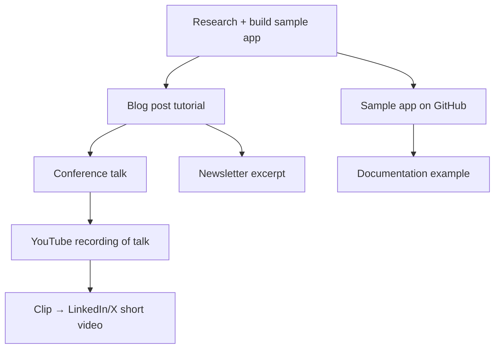

# Developer Content

> [!abstract] TL;DR
> Developer content drives awareness and education at scale. Technical blog posts, video screencasts, sample apps, and newsletters reach developers where they are. SEO for developer content targets long-tail technical keywords (specific error messages, library comparisons). Content repurposing — blog → talk → video → sample app — maximizes ROI on any single piece of research.

## Technical Blog Posts

Blog posts are the highest-leverage content format for developers. A single well-written tutorial can drive organic search traffic for years.

### Types of Technical Blog Posts

| Type | Purpose | Example |
|---|---|---|
| **Feature announcement** | Launch a new capability with context | "Announcing Workers AI: run LLMs at the edge" |
| **Tutorial** | Step-by-step guide for a specific task | "Build a real-time chat app with Durable Objects" |
| **Deep dive** | Technical explanation of how something works | "How Cloudflare Workers use V8 isolates for cold starts" |
| **Case study** | How a customer solved a real problem | "How Shopify uses our API to process 3M events/day" |
| **Comparison** | When to use X vs Y | "Cloudflare Workers vs AWS Lambda: when to use each" |
| **Post-mortem / lessons learned** | Transparent sharing of what went wrong | "How we recovered from a 99.9% uptime SLA miss" |

### Writing a Good Technical Blog Post

**Structure:**

```markdown
# [Specific, searchable title]
# e.g., "How to Build a Rate Limiter with Cloudflare Durable Objects"
# NOT: "Using Durable Objects" (too vague, won't rank)

## Introduction (< 150 words)
- What problem does this solve?
- Who is this for?
- What will they be able to do after reading?

## Prerequisites
- SDK version, language version, required accounts

## [Body sections — each with a working code example]

## Conclusion
- What was built
- What to explore next (link to related content)
- Call to action (try it, join Discord, star GitHub)
```

**Technical writing principles:**
- Show working code — not pseudocode or illustrations of code
- Every code block should be copy-pasteable and run immediately
- Explain the "why" not just the "what" — developers want to understand
- Keep it honest — acknowledge trade-offs and limitations

---

## Video Content

### Screencasts

Short-form screencasts (5–15 minutes) are the most consumed developer video format:

- **Loom:** quick "how I did X" for community support and async documentation
- **OBS Studio:** professional recording for YouTube tutorials
- **Camtasia:** screen recording with annotations and callouts

**Screencast best practices:**
- Show the terminal, not slide decks — developers want to see real usage
- Zoom into code (font size 20+ for screen share)
- Use a consistent color theme (terminal + editor)
- Demonstrate the finish line in the first 30 seconds ("Here's what we're going to build")

### Conference Talks

Conference talks reach concentrated audiences of senior developers:

**Talk types:**
- **Tutorial/workshop** — 45-90 min hands-on, attendees build something
- **Case study** — 30 min, "here's how we solved X at scale"
- **Concept talk** — 30 min, teach a concept (not product-specific)
- **Lightning talk** — 5-10 min, single idea

**Slides principles:**
- One idea per slide
- Large text (50+ pt for titles)
- Code on slides: short snippets only (< 10 lines)
- Live demos > screenshots of demos

### YouTube Strategy

```
Checklist for YouTube DevRel videos:
□ Thumbnail: clear text overlay + facial expression (for non-coding videos)
□ Title: keyword-first — "Build a WebSocket chat with Cloudflare Durable Objects"
□ Description: first 2 lines summarize the video (shown before "more")
□ Chapters: add timestamps for each major section
□ Pinned comment: link to GitHub repo and written tutorial
□ End screen: suggest 2 related videos
□ Card at midpoint: link to documentation
```

---

## Sample Apps and Code Examples

Sample apps are DevRel's highest-quality content but also most expensive to maintain.

### Good Sample App Characteristics

1. **Actually works** — tested on CI on every commit
2. **Well-documented** — README with setup instructions, what it demonstrates, architecture notes
3. **Simple** — demonstrates one concept, not every feature
4. **Up to date** — pinned to a specific SDK version with update policy
5. **Deployed** — live demo URL removes friction ("see it working before you clone")

```markdown
# Sample App README Template

## What this demonstrates
One-paragraph description of the concept and why it matters.

## Live demo
https://chat-demo.example.workers.dev

## What you'll need
- Node.js 18+
- Cloudflare account (free tier works)
- Wrangler CLI: `npm install -g wrangler`

## Local development
```bash
git clone https://github.com/example/chat-demo
cd chat-demo
npm install
wrangler dev
```

## Deploy your own
```bash
wrangler deploy
```

## How it works
Brief technical explanation of the architecture, with a diagram.

## Key files
- `src/ChatRoom.ts` — Durable Object that manages a chat room
- `src/index.ts` — Worker entry point that routes WebSocket connections
```

---

## Newsletters

Developer-focused newsletters (Substack, Buttondown, ConvertKit) keep engaged developers informed:

**Newsletter principles:**
- **Concise:** 400–800 words max. Developers scan, not read.
- **Technical, not marketing:** avoid "we're excited to announce" — just say what changed
- **Consistent cadence:** weekly or biweekly — irregular sends lose subscribers
- **Plain text or minimal HTML:** heavy design signals marketing; plain text signals peer communication

```markdown
## Example newsletter structure

**What's new this week:**
1. [Feature] — one sentence + link
2. [Blog post] — title + one sentence + link
3. [Community highlight] — interesting thing from Discord/GitHub

**From the community:**
- [User's project] — built with our API, brief description

**Reading list:**
- [External article] — relevant to developers using our tools

**Jobs:** (if relevant)
```

---

## SEO for Developer Content

### Long-Tail Technical Keywords

Developers search for specific problems, not generic topics:

```
Generic (hard to rank, low intent):
  "Cloudflare Workers" — millions of results, Cloudflare's own site wins

Long-tail (easy to rank, high intent):
  "Cloudflare Workers vs Lambda cold start" — specific comparison
  "durable objects websocket hibernation" — specific feature
  "workers kv eventual consistency problem" — specific problem
  "cf-cache-status HIT miss not working" — troubleshooting
```

**Finding long-tail keywords:**
- Stack Overflow questions about your product
- GitHub issues (search titles)
- Discord/forum questions that repeat
- "People also ask" on Google for related terms

### Structured Data for Technical Content

```html
<!-- Add code sample structured data for rich snippets -->
<script type="application/ld+json">
{
  "@context": "https://schema.org",
  "@type": "TechArticle",
  "headline": "Build a Rate Limiter with Cloudflare Durable Objects",
  "author": { "@type": "Person", "name": "Jane Smith" },
  "datePublished": "2026-07-29",
  "programmingLanguage": "TypeScript"
}
</script>
```

---

## Content Repurposing

One research investment → multiple content pieces:



**Process:**
1. Build a real sample app (this is the most expensive part)
2. Write a blog post about how you built it (includes code)
3. Turn the blog post into a conference talk (slides = blog sections)
4. Record the conference talk → YouTube
5. Clip 60-second highlight → Twitter/LinkedIn
6. Extract newsletter summary
7. Link sample app from docs

**Result:** one day of building → 6+ content pieces

---

## Content Calendar

```markdown
| Week | Blog post | Video | Social | Newsletter | Event |
|------|-----------|-------|--------|------------|-------|
| Jul 28 | Workers AI tutorial | — | 3× X posts | Weekly digest | — |
| Aug 4 | D1 migration guide | D1 screencast | 3× X posts | Weekly digest | Office hours |
| Aug 11 | — | — | 3× X posts | Weekly digest | KubeCon CFP deadline |
| Aug 18 | Durable Objects vs KV | — | 3× X posts | Weekly digest | — |
```

---

## Common Pitfalls

- **Tutorials that don't work.** A tutorial with a broken step 3 is worse than no tutorial. Test every step in a fresh environment before publishing.
- **SEO for vanity, not value.** Writing for search engines instead of developers produces thin, keyword-stuffed content that ranks briefly then tanks. Write for developers first.
- **Sample apps that go stale.** An SDK demo app built for v0.9 that crashes with v2.0 is actively harmful. Add CI tests to sample repos and pin them to specific SDK versions.
- **Video without a written counterpart.** Videos aren't searchable or copy-paste-able. Every video tutorial should have a corresponding written tutorial for accessibility and discoverability.
- **Content with no call to action.** "Enjoy reading?" is not a CTA. "Join our Discord to discuss" / "Star the repo" / "Try this in the playground" — give developers a next step.

---

## Review Questions

1. What is "content repurposing" and give a concrete example starting from a sample app?
2. Why should developer blog posts target long-tail keywords rather than generic product keywords?
3. You're writing a tutorial blog post. What are three things that make the code examples in it trustworthy?
4. Compare the production effort and reach of a conference talk vs a YouTube tutorial. Which has better long-term ROI and why?
5. A newsletter has a 15% open rate. The industry average for developer newsletters is 35%. What would you investigate to improve this?
