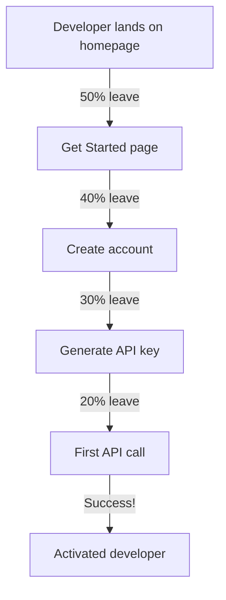

# Developer Experience

> [!abstract] TL;DR
> Developer Experience (DX) measures the quality of a developer's interaction with your product — from the first API call to daily usage. The most critical metric is time-to-hello-world. Improving DX requires consistent API design, great error messages, interactive docs, official SDKs, and a smooth local development story. Developer portals centralize everything into one place.

## What is Developer Experience

**Developer Experience (DX)** is the sum of all interactions a developer has with your product — APIs, SDKs, docs, error messages, local tooling, and support. Good DX means a developer can:

1. Understand what your product does in < 2 minutes
2. Get a working code sample in < 5 minutes
3. Build and ship something in < 1 day
4. Debug problems without support in < 30 minutes

DX is distinct from DevRel (relationship building) — DX is about the **product quality** as experienced by developers. You can have great community engagement (DevRel) with terrible DX (broken SDKs, confusing API), and the product will still fail.

---

## DX Metrics

| Metric | How to measure | Target |
|---|---|---|
| **Time to hello world** | User testing, session recordings | < 5 minutes |
| **API error rate** | API logs: 4xx/5xx rate | < 1% on well-formed requests |
| **SDK quality** | GitHub issues for SDK repos: open bug count, stale PRs | < 10 open bugs |
| **Docs NPS** | "Was this page helpful?" widget | > 70% positive |
| **Support escalation rate** | % of devs who need support to complete onboarding | < 10% |
| **Activation rate** | % of devs who create API key AND make first API call | > 60% |

### Time-to-Hello-World Measurement

```javascript
// Track in analytics:
// Event 1: developer signs up (or clicks "Get started")
// Event 2: first successful API call from their API key

// time_to_hello_world = Event 2 timestamp - Event 1 timestamp
// Segment by: traffic source, plan tier, language SDK used

// Red flags:
// - > 50% of devs never make first API call → signup/docs is the problem
// - median time > 20 minutes → too much friction before first call
// - p90 time > 2 hours → onboarding for non-trivial cases is broken
```

---

## Consistent API Design

Inconsistent APIs are a major DX drag. Developers build a mental model from the first endpoint they use. Surprises erode trust:

### Naming Conventions

```yaml
# Bad: inconsistent naming across endpoints
GET  /getUserById/{id}        # camelCase method name in URL
POST /create_user              # snake_case action + resource
PUT  /users/{id}/updateEmail   # verb in URL

# Good: consistent REST naming
GET    /users/{id}            # noun, kebab-case, consistent
POST   /users                 # create
PATCH  /users/{id}            # partial update
DELETE /users/{id}

# Consistent field naming (pick one: camelCase or snake_case — never mix)
# Bad:
{ "userId": "123", "email_address": "a@b.com", "createdAt": "..." }

# Good (camelCase):
{ "userId": "123", "emailAddress": "a@b.com", "createdAt": "..." }
```

### Pagination Consistency

```json
// Always return the same pagination structure:
{
  "data": [...],
  "pagination": {
    "cursor": "opaque_cursor_string",
    "hasMore": true,
    "totalCount": 1500
  }
}
// NOT: { "items": [...], "next_page_token": "...", "total": 1500 }
// (different field names for the same concepts)
```

### Error Response Consistency

```json
// Consistent error envelope:
{
  "error": {
    "code": "invalid_email",
    "message": "The email address 'not-an-email' is not valid.",
    "param": "email",
    "doc_url": "https://docs.example.com/errors/invalid_email"
  }
}
// Never:
{ "status": "error", "msg": "bad email" }  // inconsistent shape
```

---

## Error Message Best Practices

Poor error messages are one of the top DX complaints. A great error message has three components:

```
What went wrong:  "Invalid email address"
Why it happened:  "The value 'not-an-email' does not contain an '@' symbol"
How to fix it:    "Provide a valid email address like 'alice@example.com'"
Doc link:         "See https://docs.example.com/errors/invalid_email"
```

### Error Messages in Practice

```python
# Bad errors (Stripe's original error rate when errors were just codes):
# {"error": {"code": "invalid_request_error"}}  ← tells developer nothing

# Good error (Stripe's current approach — developer knows exactly what to fix):
{
  "error": {
    "code": "parameter_invalid_empty",
    "message": "You passed an empty string for 'email'. We assume empty values are an oversight. If you meant to not include this param, don't include it in the request.",
    "param": "email",
    "type": "invalid_request_error",
    "doc_url": "https://stripe.com/docs/error-codes/parameter-invalid-empty"
  }
}
```

### HTTP Status Code Consistency

```
Don't mix up:
  400 Bad Request     — malformed input (bad JSON, invalid parameter value)
  401 Unauthorized    — missing or invalid auth credentials
  403 Forbidden       — valid auth, but insufficient permissions
  404 Not Found       — resource doesn't exist
  409 Conflict        — resource already exists (duplicate create)
  422 Unprocessable   — valid JSON, but business logic validation failed
  429 Too Many Reqs   — rate limited
  500 Internal Error  — server-side bug (never leak stack traces)
```

---

## Official SDKs

Official SDKs dramatically improve DX for developers in each language. Without an SDK, developers must:
- Construct HTTP requests manually
- Parse responses manually
- Handle authentication manually
- Handle pagination manually
- Handle retries and timeouts manually

### SDK Quality Checklist

```
□ Published to the canonical package registry (npm, PyPI, Maven, Gem, crates.io)
□ README with 5-line quickstart that works
□ All endpoints covered
□ TypeScript types / type hints
□ Automatic retry with exponential backoff (on 429, 503)
□ Automatic pagination helpers
□ Configurable timeout
□ Test mode / sandbox mode
□ Changelog maintained
□ CI tested on each SDK release (test suite against staging API)
□ GitHub Issues monitored and responded to in < 7 days
```

### SDK Auto-Generation

For large APIs, manually maintaining SDKs in 5+ languages is impractical. Use SDK generators:

```bash
# fern-api: SDK generator from OpenAPI spec
npx fern init
npx fern generate  # generates TypeScript, Python, Go, Java, Ruby SDKs from openapi.yaml

# openapi-generator
npx openapi-generator-cli generate \
  -i openapi.yaml \
  -g typescript-fetch \
  -o ./sdk/typescript
```

**Warning:** auto-generated SDKs need human review and customization. They produce functional but ugly code. Stripe and Twilio write their SDKs by hand — the quality difference is notable.

---

## Onboarding Flow Optimization

The onboarding funnel from signup to first API call is where most developer activation is lost:



**Reducing friction at each step:**

| Step | Common friction | Fix |
|---|---|---|
| Get Started page | Long list of prerequisites | Reduce prerequisites; offer sandbox mode |
| Create account | Too many form fields | Only ask for email + password at signup |
| Generate API key | Buried in dashboard | Surface it on the welcome screen |
| First API call | Unclear which endpoint to call | Prescribe the exact first call in the quickstart |
| First success | No celebration | Show a "You made your first call!" confirmation |

---

## Developer Portals

A developer portal centralizes everything:

```
developer.example.com/
  /                ← overview and "get started" CTA
  /docs            ← tutorials, how-to guides, concepts
  /reference       ← API reference (OpenAPI)
  /sdks            ← SDK installation + links
  /changelog       ← versioned release notes
  /status          ← uptime/incident status (embed statuspage.io)
  /dashboard       ← API keys, usage, billing (app itself)
  /community       ← Discord/forum link
```

**Portal success criteria:**
- Developer can go from "I want to try this" to "first API call" without leaving the portal
- Search returns relevant results for any common developer question
- Every page has a "was this helpful?" feedback mechanism
- Changelog is always up to date (auto-generated from releases)

---

## Common Pitfalls

- **SDKs that lag the API by months.** A new API feature without SDK support means developers must drop down to raw HTTP. Track SDK lag as a metric and treat it as a P2 bug.
- **Error messages that expose internals.** Returning stack traces or database query errors in 500 responses is a security risk and a DX failure. Return developer-friendly error codes instead.
- **Onboarding that requires a credit card before first API call.** This is a conversion killer for developer tools. Offer a generous free tier or sandbox with no payment info required.
- **Inconsistent pagination across endpoints.** If `/users` uses cursor pagination and `/orders` uses page-based, developers must implement two patterns. Pick one and use it everywhere.
- **No local development story.** If developers can't test their integration without real API keys and internet access, feedback loops are slow. Provide a local mock server or sandbox environment.

---

## Review Questions

1. What are the five components of time-to-hello-world, and which step typically has the highest drop-off?
2. Write a good error message for an API call that fails because the user passed a negative number for a `quantity` field.
3. Why are official SDKs valuable even when an API has complete documentation? What do they save the developer from doing?
4. A developer complains "your API is inconsistent." What specific inconsistencies are they likely referring to? Give three examples.
5. Your activation rate (% of developers who sign up AND make their first API call) is 25%. What are three interventions you would try, in order of expected impact?
