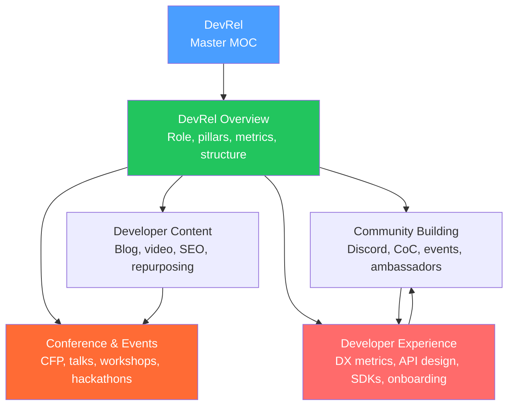

# DevRel — Map of Content

> [!info] About this vault
> 5 notes covering the Developer Relations craft: the role and pillars (awareness/education/community), content strategy (blog posts, video, sample apps, SEO), community building (Discord, CoC, events, ambassadors), developer experience (DX metrics, API design, error messages, SDKs, onboarding), and conferences & events (CFP writing, demo-driven talks, hackathons, virtual events).

---

## Concept Map

---

## Sections at a Glance

| # | Note | Difficulty | Focus |
|---|------|------------|-------|
| 01 | [[DevRel_Overview]] | Beginner | Role, pillars, structure, metrics |
| 02 | [[Developer_Content]] | Intermediate | Blog, video, SEO, newsletters |
| 03 | [[Community_Building]] | Intermediate | Discord, CoC, events, ambassadors |
| 04 | [[Developer_Experience]] | Intermediate | DX metrics, API UX, SDKs, onboarding |
| 05 | [[Conference_and_Events]] | Intermediate | CFP, talks, workshops, hackathons |

---

## Learning Paths

### Path A — First DevRel Hire

For the first DevRel at a company, in priority order:

1. [[DevRel_Overview]] — understand the role and how to position it internally
2. [[Developer_Experience]] — fix DX friction (time-to-hello-world, error messages, SDK quality) first — highest leverage
3. [[Developer_Content]] — produce foundational content (README, quickstart blog, tutorial)
4. [[Community_Building]] — launch Discord only after DX is solid
5. [[Conference_and_Events]] — begin speaking at meetups, build toward tier-1 conferences

### Path B — Growing DevRel Team

For an existing DevRel team scaling programs:

1. [[Community_Building]] — formalize community structure, ambassador program, CoC enforcement
2. [[Developer_Content]] — build content calendar, repurposing pipeline, SEO strategy
3. [[Conference_and_Events]] — expand speaking program, run first sponsored hackathon
4. [[Developer_Experience]] — establish DX metrics dashboard, feedback loop to product
5. [[DevRel_Overview]] — review team structure, metrics, internal advocacy

---

## All Notes

| Note | Core Idea | Key Concepts |
|------|-----------|--------------|
| [[DevRel_Overview]] | DevRel bridges company and developer community via awareness, education, and community pillars. Different from Developer Marketing (acquisition) and Developer Experience (product quality) | Three pillars, DevRel vs DX vs DevMarketing, measuring impact |
| [[Developer_Content]] | Technical blog posts, screencasts, sample apps, newsletters, SEO for long-tail keywords, content repurposing (blog → talk → video → sample) | Content types, SEO, repurposing, content calendar |
| [[Community_Building]] | Discord server structure, Code of Conduct + enforcement, response SLA, office hours, hackathons, ambassador programs, feedback-to-product loop, community health metrics | Discord structure, CoC, ambassador program, response SLA |
| [[Developer_Experience]] | DX metrics (time-to-hello-world, activation rate, correction rate), consistent API design (naming, pagination, errors), official SDKs, onboarding funnel optimization, developer portals | Time-to-hello-world, API consistency, SDK quality, onboarding funnel |
| [[Conference_and_Events]] | CFP abstract writing, demo-driven talks, safety nets, workshop design (pre-reqs, starter repo, pacing), hackathon sponsorship, virtual events, key DevRel conferences | CFP, demo-driven, workshop design, hackathon, DevRelCon |

---

## Key Frameworks Quick Reference

| Framework/Concept | What it is | Note |
|---|---|---|
| **Three Pillars** | Awareness + Education + Community | [[DevRel_Overview]] |
| **DevRel vs DX** | Relationships vs product quality | [[DevRel_Overview]], [[Developer_Experience]] |
| **Time-to-hello-world** | Minutes from signup to first working API call | [[Developer_Experience]] |
| **Content repurposing** | Blog → talk → video → sample app from one research investment | [[Developer_Content]] |
| **Response SLA** | < 4h first response in Discord (business hours) | [[Community_Building]] |
| **Ambassador program** | Tiered recognition for top community contributors | [[Community_Building]] |
| **Demo-driven talks** | Technical conference talks built around live demos | [[Conference_and_Events]] |
| **CFP abstract structure** | Hook → context → specific takeaways → audience → CTA | [[Conference_and_Events]] |

---

## Cross-Vault Links

- [[Technical_Writing/_MOC_Technical_Writing_Master|Technical Writing MOC]] — documentation is a core DevRel output; technical writers and DevRel overlap significantly
- [[AI_Product_Builder/_MOC_AI_Product_Builder_Master|AI Product Builder MOC]] — AI products have unique DevRel challenges (eval transparency, model versioning, AI-specific docs)
- [[Engineering_Leadership/_MOC_Engineering_Leadership_Master|Engineering Leadership MOC]] — DevRel intersects with engineering culture and Developer Experience design

#MOC #DevRel #MasterMOC
