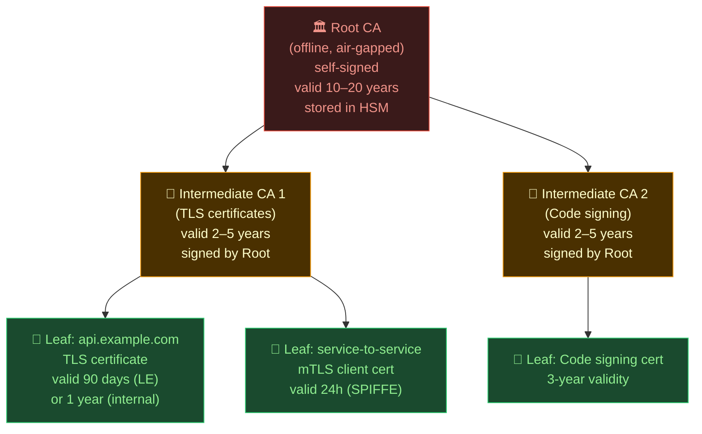

# PKI and Certificate Management

> [!abstract] TL;DR
> **PKI (Public Key Infrastructure)** is the system of trust anchors, certificates, and policies that lets computers verify each other's identity. The hierarchy is **Root CA → Intermediate CA → Leaf (end-entity) certificates**. **X.509** is the certificate format; **TLS** uses it for server identity; **mTLS** uses it for mutual (client + server) authentication. In Kubernetes, **cert-manager** automates issuance and renewal using **Let's Encrypt** (public ACME-based CA) or an internal CA. The critical operational discipline is **certificate rotation** — automated, regular rotation before expiry, because a missed rotation causes outages and security incidents at once.

---

## PKI Hierarchy



**Why the hierarchy?** The Root CA is kept offline and never issues leaf certificates directly. If an Intermediate CA is compromised, you revoke it and re-issue from the Root — the Root itself (the ultimate trust anchor) is never exposed to the network.

---

## X.509 Certificate Structure

```bash
# View a certificate's fields
openssl x509 -in /etc/ssl/certs/example.pem -text -noout

# Key fields:
# Subject: CN=api.example.com, O=Example Corp, C=US
# Issuer:  CN=Example Intermediate CA, O=Example Corp
# Validity: Not Before: 2026-07-01, Not After: 2026-09-29 (90 days - Let's Encrypt)
# Subject Alt Names (SAN): DNS:api.example.com, DNS:*.example.com, IP:10.0.1.5
# Key Usage: Digital Signature, Key Encipherment
# Extended Key Usage: TLS Web Server Authentication
# Basic Constraints: CA:FALSE  (this is NOT a CA cert)
# Subject Key Identifier: ab:cd:ef:...
# Authority Key Identifier: 12:34:56:...  (points to Intermediate CA)

# Generate a self-signed certificate (dev/testing ONLY)
openssl req -x509 -newkey rsa:4096 \
  -keyout key.pem \
  -out cert.pem \
  -sha256 -days 365 \
  -nodes \
  -subj "/CN=localhost"

# Generate CSR + key (for production: send CSR to CA)
openssl req -newkey rsa:2048 \
  -keyout server.key \
  -out server.csr \
  -nodes \
  -subj "/CN=api.example.com/O=Example Corp/C=US"

# Sign CSR with your Intermediate CA
openssl x509 -req \
  -in server.csr \
  -CA intermediate-ca.pem \
  -CAkey intermediate-ca.key \
  -CAcreateserial \
  -out server.crt \
  -days 90 \
  -sha256 \
  -extfile san.conf               # include Subject Alt Names
```

---

## TLS vs mTLS

```
TLS (one-way authentication):
  Client ──── "Hello" ────────────────────────────► Server
  Client ◄─── Server Certificate (proves server identity) ─ Server
  Client verifies cert against trusted CA bundle
  Client ──── "OK, let's encrypt" ────────────────► Server
  Result: Client trusts server. Server trusts nobody.

mTLS (mutual authentication):
  Client ──── "Hello" ────────────────────────────► Server
  Client ◄─── Server Certificate (proves server identity) ─ Server
  Client ──── Client Certificate (proves client identity) ─► Server
  Both sides verify each other's cert against trusted CA
  Result: Both sides authenticated. No anonymous clients.
```

```python
# Python: configure mTLS server
import ssl, http.server

context = ssl.SSLContext(ssl.PROTOCOL_TLS_SERVER)
context.load_cert_chain("server.crt", "server.key")
context.verify_mode = ssl.CERT_REQUIRED          # require client cert
context.load_verify_locations("ca-bundle.pem")   # CA that signed client certs

server = http.server.HTTPServer(("0.0.0.0", 8443), http.server.BaseHTTPRequestHandler)
server.socket = context.wrap_socket(server.socket, server_side=True)
server.serve_forever()

# Python: mTLS client
context = ssl.SSLContext(ssl.PROTOCOL_TLS_CLIENT)
context.load_cert_chain("client.crt", "client.key")   # client presents this
context.load_verify_locations("ca-bundle.pem")          # trust this CA for server
```

---

## Let's Encrypt and the ACME Protocol

**Let's Encrypt** is a free, automated, open CA. **ACME (Automatic Certificate Management Environment)** is the protocol (RFC 8555) it uses to prove domain ownership before issuing certificates.

```
ACME Challenge types:
  HTTP-01: Place a file at http://<domain>/.well-known/acme-challenge/<token>
            → proves control of the domain's HTTP server (port 80 must be open)
  DNS-01:  Create a TXT record at _acme-challenge.<domain>
            → proves control of DNS (works for wildcard certs, firewalled servers)
  TLS-ALPN-01: Serve a specific cert on port 443 with special ALPN extension

Certificate validity: 90 days (by design — forces automation)
Rate limits: 50 certs/domain/week; 5 duplicate certs/week
```

```bash
# Certbot — Let's Encrypt client
# HTTP-01 challenge (standalone mode — temporarily listens on port 80)
certbot certonly --standalone -d api.example.com -d www.example.com

# DNS-01 challenge (wildcard cert, requires DNS provider plugin)
certbot certonly \
  --dns-route53 \
  -d "*.example.com" \
  -d example.com

# Renew (run every 12 hours via cron — renews when <30 days left)
certbot renew --quiet
# 0 */12 * * * certbot renew --quiet

# List certificates
certbot certificates

# Where certs are stored:
# /etc/letsencrypt/live/api.example.com/fullchain.pem  (cert + intermediates)
# /etc/letsencrypt/live/api.example.com/privkey.pem    (private key)
```

---

## cert-manager in Kubernetes

**cert-manager** automates certificate issuance, renewal, and storage as Kubernetes Secrets.

```yaml
# Install cert-manager
kubectl apply -f https://github.com/cert-manager/cert-manager/releases/latest/download/cert-manager.yaml

# --- ClusterIssuer: Let's Encrypt (HTTP-01 via Nginx Ingress) ---
apiVersion: cert-manager.io/v1
kind: ClusterIssuer
metadata:
  name: letsencrypt-prod
spec:
  acme:
    server: https://acme-v02.api.letsencrypt.org/directory
    email: admin@example.com
    privateKeySecretRef:
      name: letsencrypt-prod-account-key
    solvers:
      - http01:
          ingress:
            class: nginx                    # uses Nginx Ingress for HTTP-01

# --- ClusterIssuer: Let's Encrypt (DNS-01 via Route53) ---
apiVersion: cert-manager.io/v1
kind: ClusterIssuer
metadata:
  name: letsencrypt-dns
spec:
  acme:
    server: https://acme-v02.api.letsencrypt.org/directory
    email: admin@example.com
    privateKeySecretRef:
      name: letsencrypt-dns-account-key
    solvers:
      - dns01:
          route53:
            region: us-east-1
            hostedZoneID: Z1234ABCD56789

# --- ClusterIssuer: Internal CA (private PKI) ---
apiVersion: cert-manager.io/v1
kind: ClusterIssuer
metadata:
  name: internal-ca
spec:
  ca:
    secretName: internal-ca-tls     # Secret containing CA cert + key

# --- Certificate resource ---
apiVersion: cert-manager.io/v1
kind: Certificate
metadata:
  name: api-tls
  namespace: production
spec:
  secretName: api-tls-secret        # cert-manager writes here automatically
  issuerRef:
    name: letsencrypt-prod
    kind: ClusterIssuer
  commonName: api.example.com
  dnsNames:
    - api.example.com
    - "*.api.example.com"
  duration: 2160h                   # 90 days
  renewBefore: 720h                 # renew 30 days before expiry

# --- Annotate an Ingress for automatic cert management ---
apiVersion: networking.k8s.io/v1
kind: Ingress
metadata:
  name: api-ingress
  namespace: production
  annotations:
    cert-manager.io/cluster-issuer: letsencrypt-prod  # cert-manager reads this
spec:
  tls:
    - hosts:
        - api.example.com
      secretName: api-tls-secret
  rules:
    - host: api.example.com
      http:
        paths:
          - path: /
            pathType: Prefix
            backend:
              service:
                name: api-service
                port:
                  number: 80
```

```bash
# Check cert-manager status
kubectl get certificates -A
kubectl get certificaterequests -A
kubectl describe certificate api-tls -n production

# Force immediate renewal
kubectl delete secret api-tls-secret -n production
# cert-manager automatically re-issues within seconds

# Check certificate expiry
kubectl get secret api-tls-secret -n production \
  -o jsonpath='{.data.tls\.crt}' | base64 -d | openssl x509 -noout -dates
```

---

## Certificate Rotation

```bash
# Automated rotation checklist:
# 1. cert-manager renews K8s certs automatically (30 days before expiry)
# 2. Set monitoring: alert if cert expires within 14 days
# 3. Certbot auto-renew via cron for non-K8s systems

# Monitor certificate expiry (Prometheus)
# Install the blackbox_exporter probe target
- job_name: tls_expiry
  metrics_path: /probe
  params:
    module: [tcp_connect]
  static_configs:
    - targets:
        - api.example.com:443
  relabel_configs:
    - source_labels: [__address__]
      target_label: __param_target
    - target_label: __address__
      replacement: blackbox-exporter:9115

# Alert rule: cert expires in <14 days
alert: SSLCertExpiringSoon
expr: probe_ssl_earliest_cert_expiry - time() < 14 * 86400
labels:
  severity: warning
annotations:
  summary: "SSL cert for {{ $labels.instance }} expires in < 14 days"

# Manual cert rotation for an internal service
openssl req -newkey rsa:2048 -keyout new-server.key -out new-server.csr -nodes \
  -subj "/CN=internal-api.svc.cluster.local"
# Send CSR to internal CA, get new-server.crt
kubectl create secret tls internal-api-tls \
  --cert=new-server.crt \
  --key=new-server.key \
  --dry-run=client -o yaml | kubectl apply -f -
kubectl rollout restart deployment/internal-api
```

---

## Common Pitfalls

- **Storing private keys in Git**: private keys committed to Git are compromised — treat the cert as revoked immediately. Use secrets managers (Vault, AWS SM) or Kubernetes Secrets instead.
- **Using self-signed certs in production without pinning**: self-signed certs require custom CA distribution to all clients; public-facing services should use a trusted CA (Let's Encrypt for internet, internal CA for intranet).
- **Certificates that never rotate**: "set and forget" 3-year certificates cause a scramble every 3 years, have large blast radius if private key is compromised, and train teams not to automate.
- **Missing SAN (Subject Alt Names)**: modern browsers and TLS libraries reject certs without SANs matching the target hostname, even if CN matches — always include SANs.
- **Forgetting to reload services after rotation**: copying a new cert file without restarting/reloading Nginx, the JVM, or the load balancer means the old cert keeps serving.

---

## Review Questions

1. Explain the three-tier PKI hierarchy (Root CA → Intermediate CA → Leaf). Why is the Root CA kept offline, and what is the operational consequence if the Root CA private key is compromised?
2. A Kubernetes service uses mTLS between pods. What does mutual TLS add over one-way TLS, and what Kubernetes component would you use to automate cert issuance for both the server and client certificates?
3. Let's Encrypt certificates are only valid for 90 days. A colleague argues this is a disadvantage. Make the case that 90-day validity is actually a security feature.

---

#DevSecOps #Security #PKI #X509 #TLS #mTLS #CertManager #LetsEncrypt #ACME #CertificateRotation #Kubernetes
