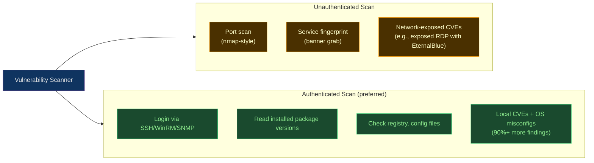

# Vulnerability Scanning Tools

> [!abstract] TL;DR
> Vulnerability scanners probe **infrastructure** (hosts, network devices, cloud services) for known weaknesses — missing patches, insecure configurations, default credentials, and exposed services. The three market leaders are **Nessus/Tenable.io** (market leader, 200,000+ plugins), **OpenVAS/Greenbone** (OSS alternative), and **Qualys** (cloud-native SaaS). Scans come in two modes: **authenticated** (agent or credentials provided, finds local CVEs and misconfig) and **unauthenticated** (network-facing, finds externally exploitable issues). Findings are scored using **CVSS v3.1** (0–10). The vulnerability lifecycle — discover → prioritise → remediate → verify → accept-risk — requires integration with ticketing and SLA tracking. DevSecOps teams embed scanners in cloud pipelines (Tenable.cs, Qualys CSPM) for continuous infrastructure scanning.

---

## Authenticated vs Unauthenticated Scanning



**Authenticated scans** find ~5–10x more vulnerabilities than unauthenticated scans. They require providing scanner credentials (SSH key or Windows credentials) with least-privilege read access. The tradeoff: credentials must be protected and rotated.

---

## CVSS Scoring

CVSS v3.1 produces a score from 0.0 to 10.0:

| Score | Severity | SLA (typical enterprise) |
|-------|----------|--------------------------|
| 9.0–10.0 | **Critical** | 24–72 hours |
| 7.0–8.9 | **High** | 7–14 days |
| 4.0–6.9 | **Medium** | 30 days |
| 0.1–3.9 | **Low** | 90 days |
| 0.0 | **None** | Best effort |

```
CVSS v3.1 Vector example:
CVE-2021-44228 (Log4Shell): CVSS:3.1/AV:N/AC:L/PR:N/UI:N/S:C/C:H/I:H/A:H = 10.0

AV:N  = Attack Vector: Network (remotely exploitable)
AC:L  = Attack Complexity: Low (no special conditions)
PR:N  = Privileges Required: None (no auth needed)
UI:N  = User Interaction: None
S:C   = Scope: Changed (impacts other components)
C:H/I:H/A:H = High confidentiality, integrity, availability impact
```

**EPSS (Exploit Prediction Scoring System)** augments CVSS — it predicts the probability a CVE will be exploited in the wild within 30 days (0–100%). Prioritise `CVSS ≥ 7 AND EPSS > 0.1` for fastest remediation.

---

## Nessus / Tenable.io

Nessus is the most widely deployed vulnerability scanner (~30% market share), now part of the Tenable product family.

```bash
# Nessus CLI (nessuscli)
# Start/stop Nessus
sudo service nessusd start

# List plugins
nessuscli fetch --list

# Tenable.io API — list scans
curl -X GET https://cloud.tenable.com/scans \
  -H "X-ApiKeys: accessKey=$ACCESS_KEY;secretKey=$SECRET_KEY" \
  | python3 -m json.tool

# Launch a scan via API
curl -X POST https://cloud.tenable.com/scans/12345/launch \
  -H "X-ApiKeys: accessKey=$ACCESS_KEY;secretKey=$SECRET_KEY"

# Export scan results as CSV
curl -X POST "https://cloud.tenable.com/scans/12345/export" \
  -H "X-ApiKeys: accessKey=$ACCESS_KEY;secretKey=$SECRET_KEY" \
  -H "Content-Type: application/json" \
  -d '{"format": "csv"}'

# Tenable.cs (cloud security) — scan Terraform before deploy
# Install tenable_cs CLI
pip install tenable-cs
tes scan --path ./terraform/ --format cyclonedx
```

**Tenable.io key features:**
- 200,000+ plugins (largest coverage)
- Frictionless Assessment: agents on hosts, no credentials needed
- Lumin: risk-based prioritisation using business context
- Tenable.cs: cloud-native IaC + runtime scanning
- Integrations: ServiceNow, Jira, Splunk

---

## OpenVAS / Greenbone

OpenVAS (Open Vulnerability Assessment Scanner) is the open-source alternative, now maintained as **Greenbone Community Edition**.

```bash
# Install Greenbone Community Edition (Docker)
docker compose -f docker-compose.yml up -d
# Access web UI at https://localhost:9392

# gvm-cli — command-line interface
pip install gvm-tools

# Connect to GVM daemon
gvm-cli socket --socketpath /run/gvmd/gvmd.sock

# Run a scan (GMP XML commands)
gvm-cli socket --gmp-username admin --gmp-password admin --socketpath /run/gvmd/gvmd.sock \
  --xml "<create_task>
    <name>My Scan</name>
    <config id='daba56c8-73ec-11df-a475-002264764cea'/>
    <target id='TARGET_UUID'/>
  </create_task>"

# Export report as PDF
gvm-cli socket \
  --xml "<get_reports report_id='REPORT_UUID' format_id='PDF_FORMAT_UUID'/>"
```

**OpenVAS key features:**
- Free and open source (AGPL)
- Community NVT (Network Vulnerability Tests) feed — updated daily
- Greenbone Enterprise provides commercial support + premium feed
- Suitable for: labs, universities, SMBs, and compliance validation

---

## Qualys VMDR

Qualys is a cloud-native SaaS platform with no on-premises components needed.

```bash
# Qualys API v2 — launch a scan
curl -X POST "https://qualysapi.qg3.apps.qualys.com/api/2.0/fo/scan/" \
  -u "$QUALYS_USER:$QUALYS_PASSWORD" \
  -H "X-Requested-With: curl" \
  -d "action=launch&scan_title=WeeklyScan&target_from=tags&tag_set_by=id&tag_set_id=12345&option_id=67890"

# Get scan status
curl "https://qualysapi.qg3.apps.qualys.com/api/2.0/fo/scan/?action=list" \
  -u "$QUALYS_USER:$QUALYS_PASSWORD"

# Download report
curl -X POST "https://qualysapi.qg3.apps.qualys.com/api/2.0/fo/report/" \
  -u "$QUALYS_USER:$QUALYS_PASSWORD" \
  -d "action=launch&report_title=WeeklyReport&report_type=Scan&output_format=pdf&scan_ref=scan/12345"
```

**Qualys VMDR key features:**
- Inventory → Detection → Assessment → Prioritisation → Remediation in one platform
- TruRisk scoring: CVSS + threat intel + business criticality
- Cloud Agent: lightweight 1–5 MB agent, no firewall rules needed
- Policy Compliance module: maps findings to CIS/NIST/PCI-DSS
- Qualys CSPM: AWS/Azure/GCP cloud posture management

---

## Vulnerability Lifecycle

```
Discover → Prioritise → Remediate → Verify → Accept/Defer

1. DISCOVER:    Run authenticated scan; import findings into CMDB/Jira
2. PRIORITISE:  CVSS × EPSS × asset criticality → risk score ranking
3. REMEDIATE:   Patch (OS/package), mitigate (WAF rule, disable service), 
                or compensating control
4. VERIFY:      Re-scan to confirm the vulnerability is fixed; 
                automated post-patch validation
5. ACCEPT RISK: For unfixable/low-risk items → document risk acceptance
                with owner sign-off and set review date (90/180 days)
```

```python
# Example: automated SLA breach detection (pseudo-code)
for finding in scan_results:
    age_days = (today - finding.first_seen).days
    sla = get_sla(finding.cvss_score)       # Critical=3, High=14, Medium=30
    
    if age_days > sla and finding.status == "OPEN":
        create_jira_escalation(finding)
        notify_asset_owner(finding.asset, finding)
```

---

## Comparison of Tools

| Feature | Nessus / Tenable.io | OpenVAS / Greenbone | Qualys VMDR |
|---------|---------------------|---------------------|-------------|
| **Deployment** | On-prem + SaaS | On-prem (OSS) | SaaS only |
| **Cost** | Commercial | Free (CE) / Paid (Enterprise) | Commercial |
| **Plugin count** | 200,000+ | 130,000+ NVTs | 150,000+ |
| **Cloud scanning** | Tenable.cs | Limited | Qualys CSPM |
| **Agent-based** | Yes (Nessus Agent) | Partial | Yes (Cloud Agent) |
| **API quality** | Excellent | Good | Excellent |
| **Risk-based prioritisation** | Lumin (EPSS + context) | Basic | TruRisk |
| **Best for** | Enterprise (largest coverage) | Regulated/air-gapped/OSS | Large cloud-first enterprise |

---

## Common Pitfalls

- **Unauthenticated scans only**: teams report "clean scans" but have only done unauthenticated scans — missing 80%+ of actual vulnerabilities on the host.
- **No remediation SLA tracking**: scanning without enforced SLAs creates vulnerability backlogs that grow indefinitely; CVSS alone without EPSS leads to fixing unimportant issues first.
- **Scanning production during peak hours**: active scanning generates significant network traffic and CPU load — schedule during maintenance windows or use passive/agent-based approaches.
- **Accepting risk without re-review dates**: risk acceptances expire — a "won't fix" decision from 2 years ago may now have a working exploit in the wild.
- **Missing service accounts rotation**: scanner credentials with read access to 10,000 hosts are a high-value target; rotate them regularly and store in a secrets manager.

---

## Review Questions

1. Explain why authenticated vulnerability scans typically find significantly more vulnerabilities than unauthenticated scans. What is the security risk of providing the scanner with credentials?
2. A CVE has CVSS score 7.8 (High) but EPSS of 0.003 (0.3% exploitation probability). Another CVE has CVSS 5.4 (Medium) but EPSS 0.45 (45%). Which should you remediate first and why?
3. Your organisation has 5,000 open vulnerabilities. Describe a prioritisation strategy that goes beyond sorting by CVSS score alone.

---

#DevSecOps #Security #VulnerabilityScanning #Nessus #OpenVAS #Qualys #Tenable #CVSS #EPSS #Remediation #VulnerabilityManagement
