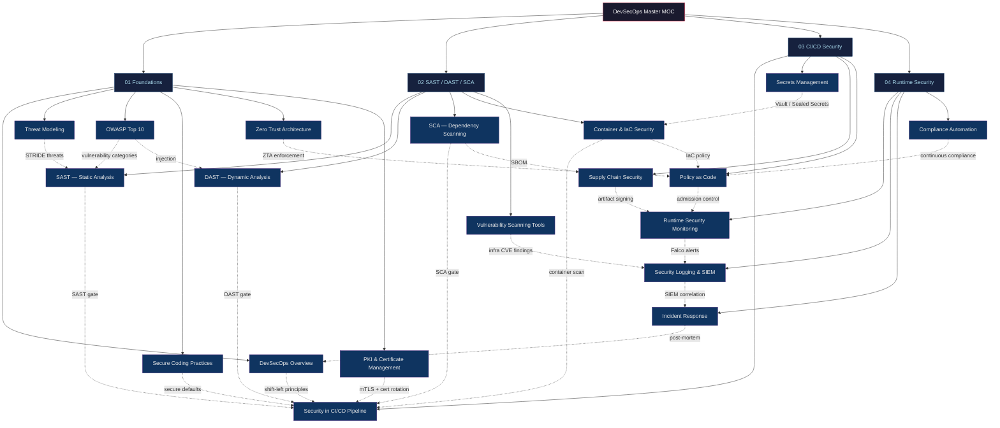

# DevSecOps — Master MOC

> [!abstract] Vault Overview
> 19 notes across 4 sections — embedding security throughout the entire software delivery lifecycle. Covers the shift-left philosophy, OWASP Top 10, threat modeling, static and dynamic analysis, software composition analysis, CI/CD security automation, secrets management, supply chain integrity, PKI and certificate management, runtime threat detection, SIEM, incident response, vulnerability scanning, and compliance automation. Designed for DevOps engineers adding security, security engineers automating DevOps, and platform engineers building secure-by-default infrastructure.

---

## Vault Architecture



---

## Sections Overview

| # | Section | Notes | Core Tools & Concepts | Difficulty |
|---|---------|-------|-----------------------|------------|
| 01 | [[01_Foundations/DevSecOps_Overview\|Foundations]] | 6 | Shift-left, SDLC gates, security champions, OWASP guidelines, compliance-as-code, PKI/mTLS | Intermediate |
| 02 | [[02_SAST_DAST_SCA/SAST_Static_Analysis\|SAST / DAST / SCA]] | 5 | Semgrep, SonarQube, OWASP ZAP, Burp Suite, Snyk, Trivy, SBOM, CycloneDX, Nessus/Qualys | Intermediate |
| 03 | [[03_CI_CD_Security/Security_in_CICD_Pipeline\|CI/CD Security]] | 4 | GitHub Actions security, OIDC, Vault, Sealed Secrets, SLSA, cosign, OPA/Rego | Intermediate–Advanced |
| 04 | [[04_Runtime_Security/Runtime_Security_Monitoring\|Runtime Security]] | 4 | Falco, eBPF, EDR, Splunk/Elastic SIEM, PICERL IR, CIS Benchmarks, InSpec | Advanced |

---

## Notes Index

### Section 01 — Foundations

| Note | Key Concepts |
|------|-------------|
| [[01_Foundations/DevSecOps_Overview\|DevSecOps Overview]] | Shift-left, three pillars, security as code, OWASP DevSecOps guidelines, security champions |
| [[01_Foundations/Threat_Modeling\|Threat Modeling]] | STRIDE, PASTA, attack trees, DFDs, trust boundaries, DREAD scoring, OWASP Threat Dragon |
| [[01_Foundations/OWASP_Top_10\|OWASP Top 10]] | A01–A10 (2021): Broken Access Control, Injection, SSRF — each with attack example and prevention |
| [[01_Foundations/Secure_Coding_Practices\|Secure Coding Practices]] | Allowlist validation, parameterized queries, output encoding, least privilege, security headers, secrets never in code |
| [[01_Foundations/Zero_Trust_Architecture\|Zero Trust Architecture]] | Never trust/always verify, BeyondCorp model, microsegmentation, SPIFFE/SPIRE, NIST SP 800-207 |
| [[01_Foundations/PKI_and_Certificate_Management\|PKI & Certificate Management]] | Root CA/Intermediate CA hierarchy, X.509 fields, mTLS, cert-manager, Let's Encrypt, ACME protocol, certificate rotation |

### Section 02 — SAST / DAST / SCA

| Note | Key Concepts |
|------|-------------|
| [[02_SAST_DAST_SCA/SAST_Static_Analysis\|SAST — Static Analysis]] | Taint analysis, Semgrep custom rules, SonarQube Quality Gates, SARIF format, false positive management |
| [[02_SAST_DAST_SCA/DAST_Dynamic_Analysis\|DAST — Dynamic Analysis]] | ZAP automation framework, Burp Suite Intruder/Repeater, OWASP API Top 10, authenticated DAST |
| [[02_SAST_DAST_SCA/SCA_Dependency_Scanning\|SCA — Dependency Scanning]] | CVE/CVSS, Snyk, Dependabot, transitive dependencies, SBOM (CycloneDX/SPDX), license compliance |
| [[02_SAST_DAST_SCA/Container_and_IaC_Security\|Container & IaC Security]] | Trivy, Dockerfile best practices (non-root, distroless, pinned), Kubernetes PSS/RBAC, Checkov, CSPM |
| [[02_SAST_DAST_SCA/Vulnerability_Scanning_Tools\|Vulnerability Scanning Tools]] | Nessus/Tenable.io, OpenVAS/Greenbone, Qualys VMDR, authenticated vs unauthenticated scans, CVSS, EPSS, remediation SLAs |

### Section 03 — CI/CD Security

| Note | Key Concepts |
|------|-------------|
| [[03_CI_CD_Security/Security_in_CICD_Pipeline\|Security in CI/CD Pipeline]] | Staged pipeline (pre-commit→PR→build→DAST), SHA-pinned actions, GITHUB_TOKEN least privilege, OIDC cloud auth |
| [[03_CI_CD_Security/Secrets_Management\|Secrets Management]] | HashiCorp Vault (dynamic secrets, K8s auth), AWS Secrets Manager, Sealed Secrets, SOPS, gitleaks |
| [[03_CI_CD_Security/Supply_Chain_Security\|Supply Chain Security]] | SolarWinds/Log4Shell case studies, SLSA framework, cosign/Sigstore, provenance attestation, dependency confusion |
| [[03_CI_CD_Security/Policy_as_Code\|Policy as Code]] | OPA + Rego, Gatekeeper (ConstraintTemplate + Constraint), Conftest for CI, Sentinel, AWS SCPs |

### Section 04 — Runtime Security

| Note | Key Concepts |
|------|-------------|
| [[04_Runtime_Security/Runtime_Security_Monitoring\|Runtime Security Monitoring]] | Falco eBPF rules, Cilium Tetragon, EDR (CrowdStrike/SentinelOne), SOAR playbooks |
| [[04_Runtime_Security/Security_Logging_and_SIEM\|Security Logging & SIEM]] | What to log (auth/authz/errors), structured JSON logs, Splunk SPL, Elastic KQL, CloudTrail, retention policies |
| [[04_Runtime_Security/Incident_Response\|Incident Response]] | PICERL phases, container forensics (crictl), AWS GuardDuty, isolation runbooks, blameless post-mortems, MTTR |
| [[04_Runtime_Security/Compliance_Automation\|Compliance Automation]] | CIS Benchmarks (kube-bench/Lynis), InSpec, SOC2/PCI-DSS/HIPAA/GDPR technical controls, OpenSCAP |

---

## Learning Paths

### Path A — DevOps Engineer Adding Security

Start here if you know DevOps but want to embed security:

```
DevSecOps Overview → Secure Coding Practices → Security in CI/CD Pipeline
→ SAST Static Analysis → SCA Dependency Scanning → Secrets Management
→ Container & IaC Security → Supply Chain Security → Runtime Security Monitoring
```

### Path B — Security Engineer Automating DevOps

Start here if you know security but want to automate it:

```
DevSecOps Overview → Threat Modeling → OWASP Top 10
→ SAST Static Analysis → DAST Dynamic Analysis → SCA Dependency Scanning
→ Policy as Code → Security Logging & SIEM → Incident Response → Compliance Automation
```

### Path C — Platform Engineer

Start here if you're building the security platform infrastructure:

```
Zero Trust Architecture → Container & IaC Security → Policy as Code
→ Supply Chain Security → Secrets Management → Security in CI/CD Pipeline
→ Runtime Security Monitoring → Compliance Automation
```

---

## Key Tools Quick Reference

| Tool | Category | Primary Use |
|------|----------|-------------|
| **Semgrep** | SAST | Fast pattern-based code scanning, custom rules |
| **SonarQube** | SAST | Code quality + security, Quality Gates in CI |
| **OWASP ZAP** | DAST | Open-source web + API scanner, CI-integrated |
| **Burp Suite** | DAST | Manual penetration testing proxy |
| **Snyk** | SCA | Dependency and container vulnerability scanning |
| **Trivy** | SCA / Container | Container image + filesystem + IaC scanning |
| **Checkov** | IaC | Terraform/K8s/Dockerfile misconfiguration scanning |
| **Gitleaks** | Secrets | Pre-commit secrets detection |
| **HashiCorp Vault** | Secrets | Dynamic secrets, PKI, K8s integration |
| **cosign / Sigstore** | Supply Chain | Keyless artifact signing and verification |
| **OPA / Gatekeeper** | Policy | Kubernetes admission control policies |
| **Conftest** | Policy | CI-stage policy testing against IaC/manifests |
| **Falco** | Runtime | eBPF-based container runtime threat detection |
| **Splunk / Elastic** | SIEM | Security event correlation and alerting |
| **Nessus / Tenable.io** | Vuln Scanning | Infrastructure and network vulnerability scanning |
| **OpenVAS / Greenbone** | Vuln Scanning | Open-source infrastructure vulnerability scanning |
| **Qualys VMDR** | Vuln Scanning | Cloud-native SaaS vulnerability management platform |
| **cert-manager** | PKI | Automated Kubernetes certificate issuance and rotation |
| **Let's Encrypt / ACME** | PKI | Free public CA with automated certificate lifecycle |

---

## Security Scanning Coverage Map

```
Code        → SAST (Semgrep, SonarQube, Bandit)
Dependencies → SCA (Snyk, Dependabot, Trivy fs)
Containers  → Container Scan (Trivy image, Grype)
IaC         → IaC Scan (Checkov, tfsec, Terrascan)
Running App → DAST (OWASP ZAP, Burp Suite)
Runtime     → Runtime (Falco, EDR, eBPF)
Secrets     → Secrets (gitleaks, detect-secrets)
Policies    → Policy (OPA/Gatekeeper, Conftest)
Infra/Hosts → Vuln Scanning (Nessus, OpenVAS, Qualys)
Identity    → PKI (cert-manager, Let's Encrypt, mTLS)
```

---

## Cross-Vault Links

- [[../DevOps/_MOC_DevOps_Master|DevOps Vault]] — CI/CD pipelines, Kubernetes, containers, secret management, service mesh (foundational layer for DevSecOps)
- [[../Cybersecurity/_MOC_Cybersecurity_Master|Cybersecurity Vault]] — Penetration testing, network security, applied cryptography, threat intelligence, digital forensics

---

#DevSecOps #MOC #Master #Security #ShiftLeft #OWASP #ZeroTrust
