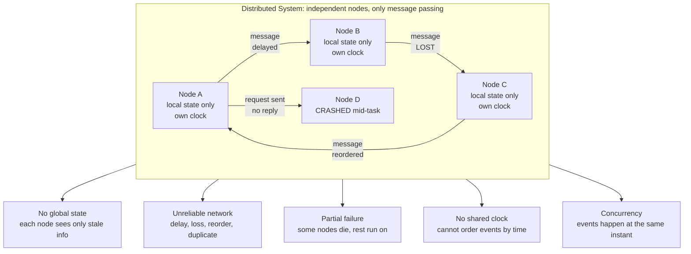

# 🌐 Distributed Systems Overview

> [!abstract] TL;DR
> A **distributed system** is a collection of independent computers that appears to its users as a single coherent system (Tanenbaum) — nodes with **no shared memory** and **no shared clock**, coordinating only by **message passing** over an **unreliable network**. Everything hard about the field flows from four brute facts: **no global knowledge**, **unreliable communication**, **independent (partial) failure**, and **no shared time**. This vault studies the *theory* — the models, algorithms, impossibility results, and fundamental trade-offs — that tell you what is and is not possible, so your design rests on proof rather than hope.

---

## Intuition

**Analogy:** A distributed system is like a **large multinational organization** where no single person knows everything. Each employee (node) sees only their own desk and whatever memos have reached them so far. Memos between people (messages) can arrive **late, get lost in the mail room, arrive out of order, or be photocopied and delivered twice**. Any employee can **quit unexpectedly mid-task** — and their colleagues cannot tell whether that person quit, is just slow to reply, or the internal mail route to them has been cut. And there is **no single clock on the wall** everyone reads, so "who did what first?" often has no objective answer. Yet somehow the whole organization must act coherently — ship one consistent product, never double-charge a customer, never elect two CEOs.

Translate the office into machines and you have the entire field: **no global state** (each node has local info plus stale messages), **unreliable communication**, **independent failures**, and **no shared time**. Almost every theorem, algorithm, and famous outage in distributed computing is a direct consequence of one of these four facts.

---

## How It Works

A distributed system is defined not by *what* it computes but by *what it lacks* compared to a single machine. On one host, two threads share memory at nanosecond speed and read one clock; a crash halts everything at once — cleanly and honestly. The instant you cross a machine boundary, all three of those gifts vanish, and coordination becomes the central problem.

### The four essential difficulties

1. **No global state / no global knowledge.** No node can observe the whole system at an instant. Each node acts on its *local* state plus whatever messages have arrived — and every message describes a *past* that may already be stale by the time it is read. There is no `SELECT * FROM everything` for a cluster.
2. **Unreliable communication.** The only channel between nodes is the network, and the network **delays, drops, reorders, and duplicates** messages. A missing reply is fundamentally ambiguous: request lost, reply lost, or peer dead — you cannot tell which.
3. **Partial failure — the defining feature.** On a single machine, failure is all-or-nothing. In a distributed system **some nodes or links fail while the rest keep running**. A live node cannot distinguish "peer crashed" from "peer is slow" from "network partitioned." That *ambiguity*, not raw failure, is what makes the algorithms hard. (Vault sibling: *Failure_Models* — crash-stop, crash-recovery, omission, Byzantine.)
4. **No shared clock.** Every node's crystal drifts; even NTP-synced clocks disagree by milliseconds — larger than the gap between many events. So you cannot order events across nodes by wall-clock time. Causality must be reconstructed *logically*, not physically. (Vault siblings: *System_and_Timing_Models*, *Logical_Clocks_and_Happens_Before*.)

Add **concurrency** — thousands of nodes acting at the same instant with no referee — and every convenient assumption from single-machine programming collapses.

### Why distribute at all?

If distribution is so hard, why do it? Four forces make it unavoidable:

- **Scalability** — one machine has a ceiling on CPU, RAM, and disk; distribution scales *out* past it (see [[Horizontal_Scaling]]).
- **Fault tolerance / availability** — redundancy across independent nodes means the service survives any single failure.
- **Geography / latency** — putting data near users worldwide beats the speed of light to one datacenter.
- **Resource sharing** — pooling storage, compute, and specialized hardware across an organization.

### The Eight Fallacies of Distributed Computing

Peter Deutsch and James Gosling catalogued the false assumptions that new distributed programmers make — each one a classic bug source when it silently turns out untrue:

1. The network is reliable.
2. Latency is zero.
3. Bandwidth is infinite.
4. The network is secure.
5. Topology doesn't change.
6. There is one administrator.
7. Transport cost is zero.
8. The network is homogeneous.

Every retry storm, split-brain incident, and mysterious timeout traces back to one of these being assumed true when it was false.

### Safety vs Liveness — how correctness is stated

Distributed correctness is almost always phrased as two kinds of property:

- **Safety** — *"nothing bad ever happens"* (e.g., never two leaders elected; no committed value is ever un-committed). A safety violation has a concrete moment where it breaks.
- **Liveness** — *"something good eventually happens"* (e.g., a decision is eventually reached; every request is eventually answered).

The deepest results in the field (below) say that under adversarial timing you often **cannot guarantee both at once** — you must sacrifice or weaken one.

### Diagram: one system, four radiating difficulties



---

## Key Concepts

### Secondary (intuition level)
- A distributed system is **many computers pretending to be one**.
- They talk only by **passing messages**, and the mail is not trustworthy — it can be late, lost, or shuffled.
- **Any one computer can fail while the others keep going** — unlike your laptop, which fails all at once.
- There is **no shared clock**, so ordering events across computers is genuinely hard.

### Undergraduate (models and mechanisms)
- **Definition (Tanenbaum):** independent computers appearing as one coherent system; contrast with **parallel/concurrent computing on one machine**, which *does* share memory and a clock.
- **The eight fallacies** as an assumption checklist.
- **Time and ordering:** wall clocks are unreliable across nodes; the **happens-before** relation and **logical clocks** (Lamport, vector) recover *causal* order without physical time.
- **Failure models:** crash-stop, crash-recovery, omission, and the worst case, **Byzantine** (arbitrary/malicious).
- **The CAP intuition:** during a network partition you must choose between **Consistency** and **Availability** ([[CAP_Theorem]]).
- **Consistency models** as a spectrum from **linearizable** (behaves like one copy) down to **eventual** ([[Consistency_Models]]).

### Graduate (impossibility, proofs, and limits)
- **The consensus problem** — getting nodes to agree on one value despite failures — is the theoretical heart of the field (vault sibling: *The_Consensus_Problem*).
- **FLP impossibility (Fischer–Lynch–Paterson, 1985):** in a purely asynchronous system, **no** deterministic protocol can guarantee consensus if even *one* process may crash — you cannot have both safety and liveness under adversarial scheduling (vault sibling: *FLP_Impossibility_Result*).
- **CAP / PACELC:** CAP covers partitions; **PACELC** extends it — *else* (no partition) you still trade **Latency** vs **Consistency** (vault sibling: *CAP_Theorem_and_PACELC*).
- **Safety vs liveness** as the formal frame for every correctness claim and every impossibility result.
- Consensus is made *possible* in practice by weakening the model — adding **partial synchrony**, **randomization**, or **failure detectors** — the escape hatches around FLP.

---

## Python Demo

This simulation reproduces the field's core difficulty in miniature: several nodes exchange messages over an **asynchronous network with random delays and message loss**, and — **without any coordination protocol** — end up **disagreeing** about a single shared value. Two clients issue *concurrent* writes to key `x` at two different nodes; each node naively gossips writes to its peers and applies "last write I received wins." Because messages arrive in **different orders** (and some are lost), the nodes **diverge**. This is precisely why "just send a message" does not give agreement.

```python
"""
WHY "just send a message" does not give agreement.

4 nodes, no shared clock, no shared memory. Two clients issue CONCURRENT
writes to key "x" at two different nodes. Each node naively gossips writes
to its peers over a network with RANDOM DELAY and RANDOM LOSS, applying
"last write I received wins" locally. Result: the nodes DISAGREE about x.
Pure stdlib async-network simulation + matplotlib visualization.
"""

import heapq
import random
import matplotlib.pyplot as plt

random.seed(7)                       # reproducible run

N_NODES   = 4
P_DELIVER = 0.75                     # probability a sent message is NOT lost
DELAY     = (1.0, 6.0)               # per-link network delay range in ms

# Two concurrent writes to key "x" -- there is NO global order between them.
WRITES = {
    1: {"value": "RED",  "color": "#d9534f", "origin": 0},
    2: {"value": "BLUE", "color": "#0275d8", "origin": 1},
}

# ---- discrete-event simulation of an asynchronous network ----
event_queue = []                     # heap of (time, seq, dst, write_id, src)
seq = 0                              # unique tie-breaker so heap never compares dicts

def schedule(t, dst, wid, src):
    global seq
    heapq.heappush(event_queue, (t, seq, dst, wid, src))
    seq += 1

seen      = [set() for _ in range(N_NODES)]   # write ids each node has processed
value_of  = [None] * N_NODES                  # current local value per node
apply_log = [[] for _ in range(N_NODES)]      # (time, write_id) applied per node
messages  = []                                # (t_send, t_recv, src, dst, wid, delivered)

# Inject the two concurrent client writes at their origin nodes at t = 0.
for wid, w in WRITES.items():
    schedule(0.0, w["origin"], wid, src=-1)   # src = -1 => straight from client

while event_queue:
    t, _, node, wid, src = heapq.heappop(event_queue)
    if wid in seen[node]:
        continue                              # already processed this write
    seen[node].add(wid)
    value_of[node] = WRITES[wid]["value"]     # naive: last applied wins
    apply_log[node].append((t, wid))
    for peer in range(N_NODES):               # gossip to peers over unreliable net
        if peer == node:
            continue
        t_recv    = t + random.uniform(*DELAY)
        delivered = random.random() < P_DELIVER
        messages.append((t, t_recv, node, peer, wid, delivered))
        if delivered:
            schedule(t_recv, peer, wid, src=node)

# ---- report divergence ----
print("Final value of key 'x' at each node:")
for n in range(N_NODES):
    print(f"  node {n}: {value_of[n]}")
print("\nAgreement reached?",
      "YES" if len(set(value_of)) == 1 else "NO  -- the nodes DIVERGED")

# ---- visualize: spacetime message diagram + final states ----
fig, (ax1, ax2) = plt.subplots(1, 2, figsize=(13, 5),
                               gridspec_kw={"width_ratios": [3, 1]})

for n in range(N_NODES):                       # node timelines
    ax1.axhline(n, color="#bbbbbb", lw=1, zorder=1)
for (ts, tr, s, d, wid, ok) in messages:       # message arrows
    ax1.annotate("", xy=(tr, d), xytext=(ts, s),
                 arrowprops=dict(arrowstyle="->", color=WRITES[wid]["color"],
                                 alpha=0.9 if ok else 0.18,
                                 ls="-" if ok else ":"), zorder=2)
for n in range(N_NODES):                       # write-apply events
    for (t, wid) in apply_log[n]:
        ax1.scatter(t, n, s=150, color=WRITES[wid]["color"],
                    edgecolor="black", zorder=3)
ax1.set_yticks(range(N_NODES))
ax1.set_yticklabels([f"node {n}" for n in range(N_NODES)])
ax1.set_xlabel("time in ms -- every node has its OWN clock")
ax1.set_title("Messages over an unreliable network\n"
              "solid = delivered, dotted = lost, dots = write applied")

for n in range(N_NODES):                       # final per-node value
    v   = value_of[n]
    col = next((w["color"] for w in WRITES.values() if w["value"] == v), "#cccccc")
    ax2.barh(n, 1, color=col, edgecolor="black")
    ax2.text(0.5, n, str(v), ha="center", va="center",
             color="white", fontweight="bold")
ax2.set_yticks(range(N_NODES))
ax2.set_yticklabels([f"node {n}" for n in range(N_NODES)])
ax2.set_xticks([])
ax2.set_title("Final value of 'x'\ndifferent colors = NO agreement")

plt.tight_layout()
plt.savefig("distributed_divergence.png", dpi=120)
plt.show()
print("\nSaved figure -> distributed_divergence.png")
```

**What you see:** node 0 and node 1 disagree from the very first instant (each applied its own client's write at `t = 0`), and as the delayed, lossy gossip propagates, nodes 2 and 3 latch onto whichever write happened to arrive *last*. No amount of "just broadcasting" fixes this — reaching agreement requires an actual **consensus protocol** (ordering, quorums, leadership), which is exactly what later sections of this vault build.

---

## Real-World Applications

Essentially all of modern computing is distributed; the theory here is the ground truth beneath the engineering:

- **Cloud platforms** (AWS, GCP, Azure) — every managed service is a fault-tolerant distributed system spanning many machines and zones.
- **Distributed databases** — Cassandra, DynamoDB, Spanner, and CockroachDB each pick a concrete point on the CAP / consistency spectrum ([[Consistency_Models]], [[Replication_Strategies]], [[Consensus_and_Quorums]]).
- **Coordination services** — ZooKeeper and etcd exist *only* to solve consensus (leader election, config, locks) so other systems don't have to.
- **Blockchains** — Bitcoin and Ethereum are consensus under the *Byzantine*, open-membership failure model.
- **The internet itself** — DNS, BGP routing, and CDNs are planet-scale distributed systems with no central authority.
- **Microservice backends** — every service-to-service call ([[Microservices]]) inherits partial failure, so patterns like retries, timeouts, and idempotency are direct consequences of the four difficulties.

> This vault is the **theory** — models, proofs, algorithms, impossibility results — while the practical [[System_Design_Intro|System Design vault]] is the **engineering** — load balancers, caches, queues, [[Replication]]. They are complementary: theory tells you *what is possible and what it costs*; system design tells you *how to build it*.

---

## Common Pitfalls

- **Assuming the network is reliable** — Fallacy #1. Code that ignores loss, delay, and reordering works in tests and detonates in production. Design for the message that never arrives.
- **Treating a slow node as a dead node (or vice versa)** — You *cannot* distinguish them. Timeouts are heuristics, not facts; acting on them naively causes false failovers and **split-brain**.
- **Believing timestamps give a global order** — Clock skew means `event A at 10:00:01` on node 1 may have really happened *after* `event B at 10:00:02` on node 2. Use logical/vector clocks for causality, not wall time.
- **"We'll just add more replicas for consistency"** — More copies *increase* coordination cost and the surface for divergence. Replication buys availability, not automatic agreement.
- **Cargo-culting CAP as "pick two"** — Partition tolerance is not optional in a real distributed system; the actual choice is C vs A *during a partition*, and latency vs consistency the rest of the time (PACELC).
- **Ignoring the safety/liveness distinction** — Systems that "usually work" often have a lurking safety bug (two leaders, lost writes) that appears only under the exact bad timing the theory warns about.

---

## Related Concepts

- [[CAP_Theorem]] — the foundational trade-off (Consistency vs Availability under partition) formalized in this vault's Consensus section.
- [[Consistency_Models]] — the spectrum from linearizable to eventual that quantifies "how much agreement" you actually get.
- [[Consensus_and_Quorums]] — how real distributed databases achieve agreement via quorum overlap.
- [[Replication_Strategies]] — the mechanism (leader/follower, multi-leader, leaderless) behind fault tolerance and divergence.
- [[Consistency_Patterns]] — practical strong/eventual/weak patterns that map onto the consistency spectrum.
- [[Distributed_Transactions_in_Databases]] — atomic commit and two-phase commit as applied consensus.
- [[Distributed_Operating_Systems]] — the same core facts (message passing, partial failure, no global clock) seen from the OS layer.
- [[TCP_Protocol]] — the reliable transport that hides *some* network unreliability, but never partial failure or the absence of a shared clock.
- [[Horizontal_Scaling]] — the scalability motivation for distributing in the first place.

> Vault siblings still to be written (referenced in prose above): *System_and_Timing_Models*, *Failure_Models*, *Logical_Clocks_and_Happens_Before*, *The_Consensus_Problem*, *FLP_Impossibility_Result*, *CAP_Theorem_and_PACELC*, *Consistency_Models_Spectrum*, *The_Reach_and_Future_of_Distributed_Systems*.

---

## Map of This Vault

This theory vault is organized into six sections that build on one another:

1. **Foundations & Models** *(you are here)* — what a distributed system is, timing and failure models, the four difficulties, safety vs liveness.
2. **Communication & Global State** — logical clocks, happens-before, causality, snapshots, and why "the state of the whole system" is a subtle idea.
3. **Consensus & Agreement** — the consensus problem, FLP impossibility, Paxos, Raft, and how partial synchrony escapes the impossibility.
4. **Consistency & Replication** — linearizability down to eventual consistency, replication strategies, quorums, CRDTs.
5. **Distributed Data** — partitioning, distributed transactions, atomic commit, and distributed storage.
6. **Advanced Topics & Frontiers** — Byzantine fault tolerance, blockchains, distributed ML, and the reach and future of the field.

Sections 1–2 establish the *models*; section 3 delivers the field's central *impossibility and its workarounds*; sections 4–5 turn theory into *usable guarantees*; section 6 pushes to the *frontier*.

---

## Review Questions

**Secondary (understanding):**
1. In your own words, why can a distributed system fail *partially* while a single laptop fails *all at once* — and why does that make distribution harder, not easier?

**Undergraduate (application):**
2. Name three of the eight fallacies of distributed computing and give a concrete bug that each one would cause if a programmer assumed it were true.
3. In the Python demo, every write was eventually broadcast to every node, yet the nodes still disagreed on `x`. Explain precisely *why* broadcasting was not enough, and name one mechanism a real system adds to fix it.

**Graduate (analysis / trade-offs):**
4. FLP proves consensus is impossible in a purely asynchronous system with one possible crash, yet Raft and Paxos are used in production every day. Reconcile these two facts — what assumption do the practical algorithms add, and which property (safety or liveness) does it protect?
5. A teammate proposes "CA" as their architecture (consistent and available, dropping partition tolerance). Using the four essential difficulties and CAP/PACELC, explain why this choice is meaningful only for a single node and collapses the moment the system is truly distributed.

---

## Sources

- Tanenbaum, A. S., & van Steen, M. *Distributed Systems: Principles and Paradigms* (3rd ed.). [distributed-systems.net](https://www.distributed-systems.net/index.php/books/ds3/)
- Lamport, L. (1978). *Time, Clocks, and the Ordering of Events in a Distributed System.* Communications of the ACM. [PDF](https://lamport.azurewebsites.net/pubs/time-clocks.pdf)
- Fischer, M., Lynch, N., & Paterson, M. (1985). *Impossibility of Distributed Consensus with One Faulty Process.* Journal of the ACM. [PDF](https://groups.csail.mit.edu/tds/papers/Lynch/jacm85.pdf)
- Rotem-Gal-Oz, A. *Fallacies of Distributed Computing Explained* (Deutsch & Gosling). [PDF](https://www.rgoarchitects.com/Files/fallacies.pdf)
- Kleppmann, M. (2017). *Designing Data-Intensive Applications*, Ch. 8 "The Trouble with Distributed Systems." O'Reilly. [dataintensive.net](https://dataintensive.net/)

---

#distributed-systems #distributed-theory #fault-tolerance #consistency #consensus
