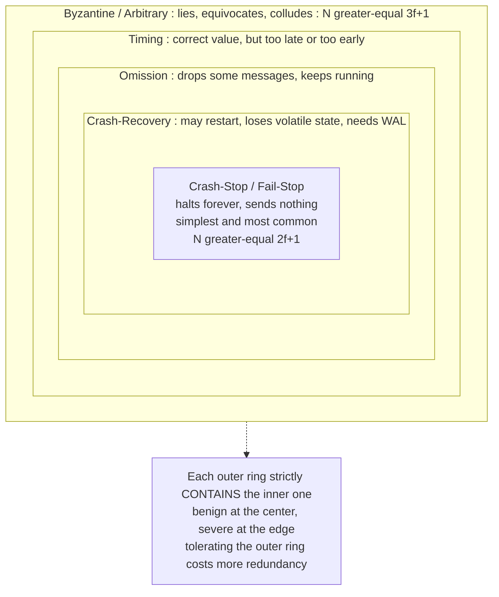

# 💥 Failure Models

> [!abstract] TL;DR
> A **failure model** is the assumption about *how* nodes and links are allowed to go wrong — from simply halting (crash) to dropping messages (omission) to actively lying (Byzantine). It is one of the two foundational assumptions of any distributed protocol (the other being the timing model), and it dictates exactly how much redundancy you must pay: tolerating `f` crash faults needs `N >= 2f+1` replicas, but tolerating `f` Byzantine faults needs `N >= 3f+1`.

---

## Intuition

**Analogy:** Think of a teammate who might fail you in different ways. In the mildest case they simply **stop showing up** — a crash. Worse, they show up *sometimes* and miss other times — an **omission**. Worst of all, they show up, look perfectly fine, and **actively lie**, telling different false stories to different people so nobody can even agree on what they said — a **Byzantine** failure.

Each kind of failure demands a different defense. If a teammate merely vanishes, you just need one reliable backup to cover them. But if a teammate might *lie and tell contradictory stories*, you need enough honest people that even after the liars equivocate, an honest two-thirds supermajority can still outvote them and cross-check each other. The nastier the failure you choose to tolerate, the more redundancy and agreement you must buy.

---

## How It Works

### Fault vs Error vs Failure

These three words are not synonyms — they name a causal chain:

1. **Fault** — a *defect* or root cause: a bug, a flipped bit, a dead disk, a malicious operator. A fault may lie dormant forever.
2. **Error** — a *wrong internal state* produced when a fault is activated (a corrupted variable, a stale cache entry). The system is now incorrect internally but may not yet be visibly wrong.
3. **Failure** — the system *deviates from its specification* as observed from outside (wrong answer, no answer, crash).

The chain is **fault -> error -> failure**. **Fault tolerance is the art of preventing faults from becoming failures** — masking or containing an error before it escapes as an externally visible deviation. This vocabulary comes straight from the classic dependability literature and underpins the broader picture in the *Distributed Systems Overview* sibling note.

### The Failure-Model Hierarchy

Failure models form a strict containment hierarchy, from most benign to most severe. Each level can do everything the level inside it can, plus more:

- **Crash-Stop (fail-stop)** — a node halts *permanently* and sends nothing thereafter. This is the simplest and most common model. The stronger variant **fail-stop** adds the idealization that other nodes can *reliably detect* the halt.
- **Crash-Recovery** — a node crashes but may *restart*, losing all volatile (in-memory) state unless it persisted to **stable storage**. This forces **recovery protocols** and **write-ahead logs** so a rebooted node can rejoin consistently.
- **Omission** — a node or link *intermittently drops messages* without crashing. **Send-omission** loses outbound messages; **receive-omission** loses inbound ones. The node keeps running, which is what makes this sneakier than a clean crash.
- **Timing** — a node computes the *correct* value but delivers it *too late or too early*. Only meaningful in a **synchronous** system where timing bounds are part of the spec (see the *System and Timing Models* sibling).
- **Byzantine / Arbitrary** — the worst case: a node behaves *arbitrarily*. It may crash, lie, send **conflicting messages to different peers** (equivocate), or **collude** with other faulty nodes. This single model covers software bugs, memory corruption, *and* deliberate malicious attackers.

Because Byzantine strictly contains every weaker model, a protocol that is safe under Byzantine failures is automatically safe under crash — but at a much higher cost.



### Redundancy Requirements: 2f+1 vs 3f+1

The failure model sets a hard **resilience bound** — the minimum replica count `N` needed to tolerate `f` faults:

- **Crash faults: `N >= 2f+1`.** With a majority quorum, any two quorums overlap, and after `f` nodes go silent a majority `f+1` still survives to agree. A crashed node simply *stops talking* — it never sends a wrong answer, so counting non-empty answers is enough.
- **Byzantine faults: `N >= 3f+1`.** This is the classic bound from the *Byzantine Generals* problem. You need a **two-thirds honest supermajority** because liars can **equivocate**. The subtle reason is asynchrony: a client can only wait for `N - f` responses (the other `f` might be crashed or slow), and of those, up to `f` may be Byzantine lies. For the honest votes to still win the collected quorum you need `(N - f) - f > f`, i.e. `N > 3f`, i.e. `N >= 3f+1`.

Byzantine tolerance is roughly **50% more expensive in replicas** and dramatically more expensive in message complexity — this is why it is reserved for settings that truly need it (see the *Byzantine Agreement and PBFT* and *Quorum Systems* siblings).

### Fail-Stop vs Crash, and "You Can't Tell Slow From Dead"

**Fail-stop** = crash **plus** the guarantee that others *reliably detect* the halt. That guarantee is an idealization. In a real **asynchronous** system, a crashed node and a merely *slow* node are **indistinguishable** — no timeout is ever provably "long enough." So **failure detection itself becomes a hard, model-dependent problem**, formalized by unreliable **failure detectors** (see the *Failure Detectors* and *System and Timing Models* siblings). This is also the root of the FLP impossibility that the consensus problem must sidestep.

### Network Failures and Partitions

Links fail too, not just nodes. Messages can be lost or reordered, and — most importantly — a **network partition** can split the system into groups that cannot talk to each other. Partitions are the "P" in the CAP theorem: during a partition you must sacrifice either consistency or availability. See [[CAP_Theorem]] and [[PACELC_Theorem]].

---

## Python Demo

This simulation contrasts tolerating **crash** vs **Byzantine** faults in a majority-voting replicated service. The honest answer is `COMMIT`; faulty replicas either go silent (crash) or push a coordinated lie `ABORT` (Byzantine). The key async realism: **a client can only wait for the first `N - f` replies**, because up to `f` replicas may be crashed or arbitrarily slow. Byzantine replicas weaponize this by answering *fast* with a lie while honest replicas lag.

```python
"""
Failure Models: why crash tolerance needs N >= 2f+1
but Byzantine tolerance needs N >= 3f+1.

Async key insight ("you can't tell slow from dead"): a client cannot
wait for all N replies, because up to f replicas may be crashed or
arbitrarily slow. So it must DECIDE on the first  N - f  replies.
Byzantine replicas weaponise this: they answer fast with a coordinated
lie while f honest replicas are still 'slow', maximising the lies in
the quorum the client actually sees.
"""

import matplotlib.pyplot as plt

CORRECT = "COMMIT"   # the true answer every honest replica returns
LIE     = "ABORT"    # the answer the colluding Byzantine replicas push


def collect_quorum(N, f, byzantine):
    """First N-f votes a client can safely wait for, worst case."""
    quorum = N - f
    if not byzantine:
        # crash: faulty replicas are silent -> every vote seen is honest
        return [CORRECT] * quorum
    # byzantine worst case: f fast lies land first, honest replies lag
    lies = min(f, quorum)
    return [LIE] * lies + [CORRECT] * (quorum - lies)


def decide(votes):
    tally = {}
    for v in votes:
        tally[v] = tally.get(v, 0) + 1
    correct = tally.get(CORRECT, 0)
    wrong = tally.get(LIE, 0)
    safe = correct > len(votes) / 2   # strict majority AND it is the truth
    return correct, wrong, safe


def report(label, N, f, byzantine):
    correct, wrong, safe = decide(collect_quorum(N, f, byzantine))
    verdict = "SAFE  " if safe else "UNSAFE"
    print(f"{label:26s} N={N} f={f}  quorum={N - f}  "
          f"correct={correct} wrong={wrong}  -> {verdict}")
    return correct, wrong, safe


print("=== CRASH faults: silent replicas, N >= 2f+1 suffices ===")
for f in (1, 2, 3):
    report("crash  N=2f+1", 2 * f + 1, f, byzantine=False)

print("\n=== BYZANTINE faults: fast coordinated lies ===")
for f in (1, 2, 3):
    report("byz    N=2f+1 too few", 2 * f + 1, f, byzantine=True)
for f in (1, 2, 3):
    report("byz    N=3f+1 enough ", 3 * f + 1, f, byzantine=True)

# ---- visualize the dramatic case f = 2 ----
f = 2
cfgs = [
    ("Crash\nN=2f+1=5", 2 * f + 1, f, False),
    ("Byzantine\nN=2f+1=5", 2 * f + 1, f, True),
    ("Byzantine\nN=3f+1=7", 3 * f + 1, f, True),
]

labels, corrects, wrongs, thresholds, safes = [], [], [], [], []
for name, N, ff, byz in cfgs:
    c, w, s = decide(collect_quorum(N, ff, byz))
    labels.append(name); corrects.append(c); wrongs.append(w)
    thresholds.append((N - ff) / 2); safes.append(s)

fig, (ax1, ax2) = plt.subplots(1, 2, figsize=(12, 5))

x = range(len(labels))
ax1.bar([i - 0.2 for i in x], corrects, width=0.4,
        label="honest (CORRECT)", color="#2e8b57")
ax1.bar([i + 0.2 for i in x], wrongs, width=0.4,
        label="faulty (LIE)", color="#c0392b")
for i, t in enumerate(thresholds):
    ax1.hlines(t, i - 0.45, i + 0.45, colors="black", linestyles="--")
for i, s in enumerate(safes):
    ax1.text(i, max(corrects[i], wrongs[i]) + 0.15,
             "SAFE" if s else "UNSAFE", ha="center", fontweight="bold",
             color="#2e8b57" if s else "#c0392b")
ax1.set_xticks(list(x)); ax1.set_xticklabels(labels)
ax1.set_ylabel("votes in the collected quorum (f = 2)")
ax1.set_title("Votes a client actually sees\ndashed line = majority threshold")
ax1.legend()

fs = list(range(0, 6))
ax2.plot(fs, [2 * i + 1 for i in fs], "o-",
         label="crash: N = 2f+1", color="#2e8b57")
ax2.plot(fs, [3 * i + 1 for i in fs], "s-",
         label="Byzantine: N = 3f+1", color="#c0392b")
ax2.set_xlabel("faults to tolerate, f")
ax2.set_ylabel("replicas required, N")
ax2.set_title("Cost of the failure model")
ax2.legend(); ax2.grid(alpha=0.3)

plt.tight_layout()
plt.savefig("failure_models.png", dpi=110)
plt.show()
```

**What it prints (abridged):**

```
=== CRASH faults: silent replicas, N >= 2f+1 suffices ===
crash  N=2f+1              N=3 f=1  quorum=2  correct=2 wrong=0  -> SAFE
crash  N=2f+1              N=5 f=2  quorum=3  correct=3 wrong=0  -> SAFE

=== BYZANTINE faults: fast coordinated lies ===
byz    N=2f+1 too few      N=5 f=2  quorum=3  correct=1 wrong=2  -> UNSAFE
byz    N=3f+1 enough       N=7 f=2  quorum=5  correct=3 wrong=2  -> SAFE
```

The takeaway: with `f = 2`, five replicas (`2f+1`) survive crashes but **fail against Byzantine liars** — the quorum the client sees is polluted with 2 lies vs only 1 truth. Bumping to seven replicas (`3f+1`) restores an honest majority (3 vs 2) in every collectible quorum.

---

## Key Concepts

### Secondary (plain-language)
- A node can fail by **stopping** (crash), by **occasionally missing** messages (omission), or by **lying** (Byzantine).
- Backing up a node that just *stops* is cheap. Guarding against a node that *lies* is expensive, because you need enough honest voters to outnumber and cross-check the liars.

### Undergraduate (CS background)
- The **fault -> error -> failure** chain; fault tolerance = stopping a fault before it becomes a visible failure.
- The **containment hierarchy**: crash-stop ⊂ crash-recovery ⊂ omission ⊂ timing ⊂ Byzantine; the strongest model subsumes all weaker ones.
- **Crash-recovery** needs stable storage and write-ahead logs; **fail-stop** = crash + reliable detection (an idealization).
- **Majority quorum** `N >= 2f+1` masks `f` crash faults because any two majorities intersect.

### Graduate (system-level)
- Derivation of `N >= 3f+1`: a client waits for `N - f` replies; up to `f` are Byzantine; honest must still dominate, so `N - 2f > f`.
- **Equivocation** — a Byzantine node sending contradictory messages to different peers — is exactly what breaks simple majority and forces the extra `f` replicas.
- **"You can't tell slow from dead"**: in asynchronous systems crashes are undetectable, so failure detection is a first-class abstraction (unreliable failure detectors, `♦S` / `Ω`), and FLP shows deterministic consensus is impossible without extra timing assumptions.
- **Partitions** are link failures elevated to a first-class concern in CAP/PACELC.

---

## Real-World Applications

- **Raft / Paxos (etcd, ZooKeeper, CockroachDB, Consul)** — assume the **crash-recovery** model in a *trusted* datacenter. They tolerate `f` crashes with `2f+1` nodes (hence 3- or 5-node clusters). See [[Consensus_and_Raft]] and [[Leader_Election]].
- **PBFT and BFT blockchains (Tendermint, HotStuff, Diem)** — assume **Byzantine** failures across trust boundaries; they require `3f+1` validators and reach finality only with a two-thirds honest supermajority. See [[Consensus_Mechanisms]].
- **Nakamoto consensus (Bitcoin, Ethereum PoW)** — a probabilistic Byzantine-tolerant design assuming an **honest majority of hash power / stake** rather than a fixed `3f+1` committee. See [[Distributed_Ledgers_and_Trilemma]].
- **Replicated databases** — [[Replication]] and [[Failover]] implement crash tolerance; primary-backup masks a crashed primary but assumes replicas do not lie.
- **Aircraft, spacecraft, and automotive flight computers** — use true Byzantine-fault-tolerant redundancy (triple/quad modular redundancy with voting) because a *stuck* or *corrupted* sensor is an arbitrary fault, not a clean crash.
- **Distributed operating systems** — coordinate crash detection and recovery at the OS layer; see [[Distributed_Operating_Systems]].

---

## Common Pitfalls

- **Assuming crash-only when the environment is Byzantine** — running Raft across mutually distrusting organizations. A single malicious node can violate safety because crash protocols never anticipate lies. Choose the model to match the *trust boundary*, not the happy path.
- **Confusing fail-stop with crash** — designing as if crashes are instantly and reliably detectable. In async systems they are not; you can only *suspect* failures, and false suspicions (of slow-but-alive nodes) must be handled.
- **Forgetting that omission is not crash** — an omission-faulty node keeps running and may *later* speak, so protocols that assume "silent forever" can be surprised by a delayed message from a node they wrote off.
- **Ignoring crash-recovery state loss** — assuming a rebooted node remembers its last vote. Without a write-ahead log to stable storage, a recovered node can equivocate by accident and break consensus safety.
- **Sizing clusters with the wrong bound** — using `2f+1` where `3f+1` is required (Byzantine) leaves the system silently vulnerable; using `3f+1` where `2f+1` suffices (crash) wastes 50% of your replicas.
- **Treating partitions as node failures** — a partition is *symmetric*: both sides are alive and may keep serving, risking split-brain. This is why partition tolerance forces the CAP choice.

---

## Related Concepts

- [[Consensus_and_Raft]] — a crash-tolerant consensus protocol built directly on the `N >= 2f+1` majority bound; assumes crash-recovery, not Byzantine.
- [[Consensus_Mechanisms]] — blockchain consensus (PoW, PoS, BFT) operating under the Byzantine failure model with a two-thirds honest threshold.
- [[Distributed_Ledgers_and_Trilemma]] — Nakamoto-style probabilistic Byzantine tolerance based on honest-majority resources.
- [[CAP_Theorem]] — network partitions (a link failure) force the consistency-vs-availability choice.
- [[PACELC_Theorem]] — extends CAP with the latency-vs-consistency tradeoff even when no partition (failure) is present.
- [[Replication]] — the redundancy mechanism that failure models size (`2f+1` vs `3f+1`).
- [[Failover]] — the recovery response to a detected crash failure.
- [[Vector_Clocks]] — order events across nodes that may crash and recover.
- [[Leader_Election]] — needed after a leader crash; only well-defined under a chosen failure + detection model.
- [[Distributed_Operating_Systems]] — OS-level fault detection, recovery, and coordination primitives.

> Sibling notes in this vault — *System and Timing Models*, *The Consensus Problem*, *Failure Detectors*, *Byzantine Agreement and PBFT*, *Quorum Systems*, and *Blockchain and Nakamoto Consensus* — are referenced in prose above and will be wikilinked once they exist.

---

## Review Questions

1. **(Secondary)** In plain terms, why is a teammate who *lies* harder to defend against than one who simply *stops showing up*? Relate your answer to why Byzantine tolerance needs more replicas than crash tolerance.
2. **(Undergraduate)** Distinguish *fault*, *error*, and *failure* with a concrete example (e.g., a flipped bit in RAM). At which step does "fault tolerance" intervene, and how does a write-ahead log help a crash-recovery node avoid turning a fault into a failure?
3. **(Graduate)** Derive the `N >= 3f+1` bound from first principles: explain why a client can only wait for `N - f` responses, why up to `f` of those may be Byzantine, and why equivocation makes `2f+1` insufficient. Then argue why an *asynchronous* system makes "slow vs dead" undecidable and what a failure detector buys you.

---

## Sources

- Lamport, Shostak, Pease. "The Byzantine Generals Problem." *ACM TOPLAS*, 1982. [PDF](https://lamport.azurewebsites.net/pubs/byz.pdf)
- Castro, Liskov. "Practical Byzantine Fault Tolerance." *OSDI*, 1999. [PDF](https://pmg.csail.mit.edu/papers/osdi99.pdf)
- Schneider. "Implementing Fault-Tolerant Services Using the State Machine Approach: A Tutorial." *ACM Computing Surveys*, 1990. [PDF](https://www.cs.cornell.edu/fbs/publications/smsurvey.pdf)
- Chandra, Toueg. "Unreliable Failure Detectors for Reliable Distributed Systems." *JACM*, 1996. [PDF](https://www.cs.utexas.edu/~lorenzo/corsi/cs380d/papers/p225-chandra.pdf)
- Cachin, Guerraoui, Rodrigues. *Introduction to Reliable and Secure Distributed Programming*, 2nd ed. Springer, 2011. [Book site](https://www.distributedprogramming.net/)

---

#distributed-systems #failure-models #byzantine-faults #crash-failures #fault-tolerance
