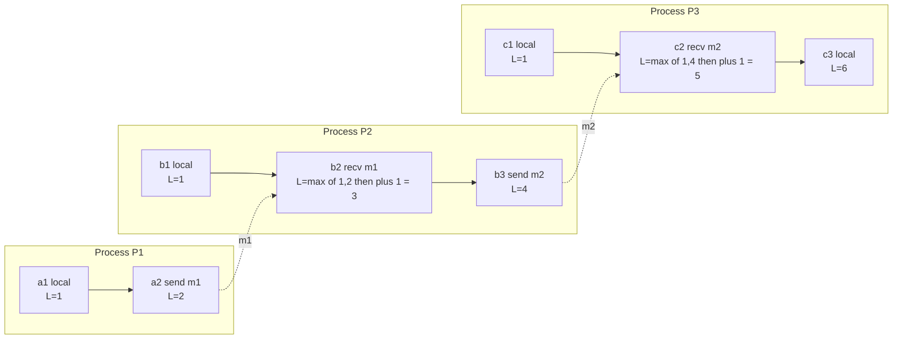

# ⏱️ Logical Clocks and the Happens-Before Relation

> [!abstract] TL;DR
> Wall-clock time is unreliable across machines, so Lamport (1978) replaces "what time did it happen" with "could X have influenced Y" — the **happens-before** partial order `→`. A tiny per-process integer counter (a **Lamport clock**) that ticks on every event and takes a `max` on message receipt assigns each event a timestamp satisfying the **clock condition**: `A → B` implies `LC(A) < LC(B)`. This is the conceptual bedrock of distributed systems — but it is one-way: ordered timestamps do **not** prove causality, which is exactly the gap vector clocks fill.

---

## Intuition

**Analogy:** Imagine reconstructing a group email thread where everyone's laptop clock is set slightly wrong. You cannot trust the timestamps — someone's clock is three minutes fast, another's is a minute slow. So how do you know the true order? You order by **cause and effect** instead: a reply *must* come after the message it answers, no matter what any clock claims, because the reply *quotes* it. If two emails never reference each other and were written independently, there simply **is no fact** about which came "first" — they are concurrent.

That is Lamport's whole insight. In a distributed system the meaningful notion of "before" is **causal**, not temporal. Physical simultaneity across machines is unobservable and, for correctness, irrelevant. Two events are ordered only if information *could* have flowed from one to the other — and you can track exactly that flow with simple integer counters that tick on every event and ride along inside every message.

---

## How It Works

### The happens-before relation (→)

Lamport defines a **partial order** on events using three rules:

1. **Program order** — if `a` and `b` happen in the same process and `a` occurs before `b`, then `a → b`.
2. **Message order** — if `a` is the *send* of a message and `b` is the matching *receive*, then `a → b`.
3. **Transitivity** — if `a → b` and `b → c`, then `a → c`.

If neither `a → b` nor `b → a` holds, the events are **concurrent**, written `a ‖ b`. Concurrency is not a bug — it is the honest statement that no information could have flowed either way, so no order is defined. Happens-before captures **potential causality**: `a → b` means "`a` *could* have influenced `b`", not that it necessarily did.

### The key insight: causal, not temporal

Because there is no global clock and message delay is unbounded, the only orderings a distributed system can ever *know* are the ones traced by actual information flow — program steps and messages. Everything else is concurrent. This is deliberately conservative: it never claims an order it cannot justify.

### Lamport logical clocks

Lamport turns the partial order into concrete integer timestamps. Each process keeps one counter `LC`, updated by:

- **Local event or send:** `LC = LC + 1` (tick before the event).
- **Send:** attach the new `LC` value to the outgoing message.
- **Receive** of a message carrying timestamp `t`: `LC = max(LC, t) + 1`.

The `max` is the magic: it forces the receiver's clock past anything the sender knew, so causally-later events get strictly larger numbers. This guarantees the **clock condition**:

> If `A → B` then `LC(A) < LC(B)`.

### The fundamental limitation

Lamport clocks are **one-way**. `A → B` implies `LC(A) < LC(B)`, but the **converse is false**: `LC(A) < LC(B)` does *not* tell you whether `A → B` or `A ‖ B`. Two totally independent (concurrent) events still receive different, ordered numbers — the timestamp cannot distinguish "caused" from "coincidentally larger". **Detecting concurrency requires vector clocks**, which carry one counter per process instead of a single scalar.

### Building a total order

A partial order leaves ties (concurrent events). Break them deterministically with the **process id**: define a global order by `(LC, pid)`. This is a **linear extension** of happens-before — consistent with every `→` edge, arbitrary elsewhere. Because every process computes the *same* total order from the same timestamps, it powers **Lamport's mutual exclusion** algorithm and, more importantly, **state-machine replication**: totally-order all commands so every replica applies them identically and stays consistent.

### Space-time diagram

Lamport visualized executions as horizontal process timelines with diagonal message arrows — structurally identical to a **light cone** in special relativity, where causality (not absolute time) defines order.



Horizontal arrows are program order; the dotted diagonals are messages. Follow any arrow chain and `L` strictly increases — that is the clock condition made visible. But note `c1` (`L=1`) and `a2` (`L=2`): no arrow chain connects them, so they are **concurrent** even though their timestamps are ordered.

---

## Key Concepts

**Secondary (plain-language core):** You cannot trust clocks on different computers, so you order events by cause and effect instead — a reply comes after the message it answers. A small counter that goes up on every step and jumps forward whenever a message arrives lets you stamp events so that later-because-of causes always get bigger numbers.

**Undergraduate (CS foundations):** Happens-before `→` is a strict partial order from program order + send-before-receive + transitivity; its incomparable pairs are *concurrent*. Lamport's scalar clock (`+1` per event, `max+1` on receive) satisfies the clock condition `A → B ⇒ LC(A) < LC(B)`. Appending the process id yields a total order that is a linear extension of `→` — enough for mutual exclusion and totally-ordered command logs.

**Graduate (systems theory):** The converse `LC(A) < LC(B) ⇒ A → B` fails; a scalar clock loses the dimensionality needed to characterize causality, so it cannot detect concurrency. Vector clocks recover the *iff* (`VC(A) < VC(B) ⇔ A → B`) at `O(N)` space. Total-order broadcast built on `(LC, pid)` requires *all* messages delivered (or blocking on silent processes) to know a timestamp is stable — connecting logical clocks to consensus, the FLP impossibility, and the ordering guarantees underneath state-machine replication and causal consistency.

---

## Python Demo

Pure-stdlib simulation plus matplotlib. It runs the Lamport rules, verifies the clock condition, demonstrates that the **converse fails** (concurrent events get ordered timestamps), builds a total order, and visualizes the space-time diagram highlighting a concurrent pair the total order falsely separates.

```python
"""
Lamport logical clocks from scratch.

Simulate three processes doing local events and exchanging messages, apply
Lamport's rules, assign a timestamp to every event, then:
  1. verify the CLOCK CONDITION    A -> B  implies  LC(A) < LC(B)
  2. show the CONVERSE FAILS       LC(A) < LC(B) does NOT imply A -> B
  3. build a consistent TOTAL order by breaking ties with the process id
  4. visualise the space-time diagram and ring a concurrent pair the total
     order falsely separates.
"""

from itertools import combinations
import matplotlib.pyplot as plt

# --- 1. A causally valid global schedule -----------------------------------
# Each entry is one event.  kind: local | send | recv;  msg links send->recv.
# Only requirement: every send appears before its matching recv.
PROC = {0: "P1", 1: "P2", 2: "P3"}

schedule = [
    ("a1", 0, "local", None),
    ("b1", 1, "local", None),
    ("c1", 2, "local", None),
    ("a2", 0, "send",  "m1"),   # P1 sends m1
    ("b2", 1, "recv",  "m1"),   # P2 receives m1
    ("b3", 1, "send",  "m2"),   # P2 sends m2
    ("c2", 2, "recv",  "m2"),   # P3 receives m2
    ("c3", 2, "local", None),
]
pid_of = {eid: pid for eid, pid, _, _ in schedule}

# --- 2. Run the Lamport clock ----------------------------------------------
clock  = {0: 0, 1: 0, 2: 0}     # per-process integer counter
msg_ts = {}                     # message id -> timestamp attached at send
LC     = {}                     # event id  -> Lamport timestamp

for eid, pid, kind, msg in schedule:
    if kind == "recv":
        clock[pid] = max(clock[pid], msg_ts[msg]) + 1
    else:                       # local or send both just tick
        clock[pid] = clock[pid] + 1
    if kind == "send":
        msg_ts[msg] = clock[pid]
    LC[eid] = clock[pid]

# --- 3. Build happens-before (transitive closure) --------------------------
edges = [("a1", "a2"),                      # program order P1
         ("b1", "b2"), ("b2", "b3"),        # program order P2
         ("c1", "c2"), ("c2", "c3"),        # program order P3
         ("a2", "b2"),                      # message m1
         ("b3", "c2")]                       # message m2

hb = set(edges)
changed = True
while changed:
    changed = False
    for a, b in list(hb):
        for c, d in list(hb):
            if b == c and (a, d) not in hb:
                hb.add((a, d)); changed = True

def happens_before(x, y): return (x, y) in hb
def concurrent(x, y):
    return x != y and not happens_before(x, y) and not happens_before(y, x)

# --- 4. Verify clock condition and expose the converse failure -------------
print("event  Lamport")
for eid, *_ in schedule:
    print(f"  {eid}      {LC[eid]}")

print("\nClock condition  A->B => LC(A) < LC(B):")
assert all(LC[a] < LC[b] for a, b in hb), "clock condition violated!"
print("  holds for every happens-before pair.")

print("\nConverse FAILS  (LC(A) < LC(B) yet A and B are CONCURRENT):")
for x, y in combinations(LC, 2):
    a, b = (x, y) if LC[x] < LC[y] else (y, x)
    if LC[a] < LC[b] and concurrent(a, b):
        print(f"  LC({a})={LC[a]} < LC({b})={LC[b]}  but  {a} || {b}")

# --- 5. Consistent TOTAL order: sort by (Lamport, pid) ---------------------
total = sorted(LC, key=lambda e: (LC[e], pid_of[e]))
print("\nTotal order (Lamport, pid):", " < ".join(total))

hi_a, hi_b = "c1", "a2"         # concurrent, yet total order puts c1 first

# --- 6. Space-time diagram, x = Lamport time -------------------------------
xpos = {eid: LC[eid] for eid, *_ in schedule}
ypos = {eid: 2 - pid_of[eid] for eid, *_ in schedule}   # P1 on top

fig, ax = plt.subplots(figsize=(10, 4.5))
for pid, name in PROC.items():
    y = 2 - pid
    evs = [e for e, *_ in schedule if pid_of[e] == pid]
    ax.plot([xpos[e] for e in evs], [y] * len(evs), "-o", color="0.4", zorder=1)
    ax.text(-0.4, y, name, ha="right", va="center", fontweight="bold")
    for e in evs:
        ax.annotate(f"{e}\nL={LC[e]}", (xpos[e], y), textcoords="offset points",
                    xytext=(0, 11), ha="center", fontsize=9)

for send, recv, msg in [("a2", "b2", "m1"), ("b3", "c2", "m2")]:
    ax.annotate("", (xpos[recv], ypos[recv]), (xpos[send], ypos[send]),
                arrowprops=dict(arrowstyle="->", color="tab:blue", lw=1.6))
    ax.text((xpos[send] + xpos[recv]) / 2,
            (ypos[send] + ypos[recv]) / 2 + 0.12, msg,
            color="tab:blue", ha="center", fontsize=9)

for e in (hi_a, hi_b):          # ring the falsely-separated concurrent pair
    ax.plot(xpos[e], ypos[e], "o", ms=20, mfc="none", mec="tab:red", mew=2, zorder=3)
ax.annotate("", (xpos[hi_b], ypos[hi_b]), (xpos[hi_a], ypos[hi_a]),
            arrowprops=dict(arrowstyle="-", color="tab:red", lw=1.4, ls="--"))
ax.text((xpos[hi_a] + xpos[hi_b]) / 2, 0.6,
        f"{hi_a} || {hi_b} are concurrent\ntotal order falsely puts {hi_a} first",
        color="tab:red", ha="center", fontsize=9)

ax.set_xlabel("Lamport timestamp")
ax.set_yticks([]); ax.set_xlim(-1.2, 7); ax.set_ylim(-0.5, 2.95)
ax.set_title("Lamport clocks: messages always raise L; "
             "concurrent events can still be ordered by L")
plt.tight_layout()
plt.savefig("lamport_clocks.png", dpi=120)
print("\nsaved lamport_clocks.png")
```

Expected output (abridged):

```
Clock condition  A->B => LC(A) < LC(B):
  holds for every happens-before pair.

Converse FAILS  (LC(A) < LC(B) yet A and B are CONCURRENT):
  LC(c1)=1 < LC(a2)=2  but  c1 || a2
  LC(b1)=1 < LC(a2)=2  but  b1 || a2
  ...
Total order (Lamport, pid): a1 < b1 < c1 < a2 < b2 < b3 < c2 < c3
```

The total order lists `c1 < a2` as if `c1` happened first — but they are genuinely concurrent. That false ordering is harmless for replication (any linear extension is fine) yet **fatal for conflict detection**: if these were two writes to the same key, a Lamport-only system would silently pick a "winner" and clobber the other. That is precisely why multi-master stores use vector clocks.

---

## Real-World Applications

- **State-machine replication (Raft, Paxos-based systems):** the deep reason replicas stay consistent is that they apply commands in an identical **total order**; Lamport's `(timestamp, id)` scheme is the canonical way to define that order without a global clock.
- **Version vectors in Dynamo, Riak, Voldemort:** the vector-clock descendants of Lamport's idea detect concurrent (conflicting) writes across replicas instead of blindly overwriting.
- **Distributed tracing (Jaeger, Zipkin, OpenTelemetry):** span parent-child edges are a happens-before graph; causal ordering, not wall-clock time, reconstructs a request's true flow across services with skewed clocks.
- **Causal consistency and CRDT delivery:** enforcing "you never see an effect before its cause" is happens-before applied to reads/writes; causal-broadcast layers under CRDTs deliver updates respecting `→`.
- **Deterministic replay and debugging:** replaying a distributed execution requires reproducing the causal order of events, captured with logical clocks.
- **Database timestamp ordering:** logical/hybrid clocks assign transaction timestamps so concurrency control can serialize without trusting NTP.

---

## Common Pitfalls

- **Treating ordered timestamps as causality.** `LC(A) < LC(B)` does *not* mean `A → B`. Using Lamport timestamps to detect conflicts produces false orderings and clobbered writes. When you must know "were these independent?", reach for vector clocks.
- **Ordering events by wall-clock time.** NTP skew (±ms, occasionally seconds) routinely exceeds the gap between events; `timestamp()`-based "which write is newer" silently loses data whenever clocks disagree. Use logical clocks for *ordering*, physical clocks only for human-readable time.
- **Forgetting to tick before a send.** If you attach the counter without incrementing, a send and a following local event can share a timestamp, and the receiver's `max+1` no longer strictly separates cause from effect. Increment first, then send.
- **Assuming a total order is "the truth".** The `(LC, pid)` tie-break is *arbitrary* for concurrent events. It is safe for replication (consistency only needs *some* agreed order) but must never be read as a claim about causality.
- **Believing a timestamp is immediately stable.** In total-order broadcast you cannot deliver an event at time `t` until you know no smaller-or-equal timestamp can still arrive — which means hearing from every process (or a quorum). A silent process blocks progress, linking logical clocks to liveness and consensus.

---

## Related Concepts

- [[Vector_Clocks]] — the direct successor that carries one counter per node and recovers the missing direction: `VC(A) < VC(B)` iff `A → B`, so it *can* detect concurrency that Lamport clocks lose.
- [[Consensus_and_Raft]] — an alternative to conflict detection: a leader imposes a single total order (`term + index`) so replicas never diverge in the first place.
- [[Replication]] — the setting where ordering matters; totally-ordered command application is what keeps replicas identical.
- [[Consistency_Patterns]] — causal consistency is happens-before applied to reads and writes; logical clocks are its enforcement mechanism.
- [[CAP_Theorem]] — explains why eventually-consistent, multi-master designs exist, which is exactly where causal ordering and conflict detection become essential.
- [[Consensus_and_Quorums]] — quorum reads/writes plus version vectors are how Dynamo-style stores use Lamport's causality in practice.
- [[Distributed_Locks]] — Lamport's original mutual-exclusion algorithm uses logically-timestamped, totally-ordered request queues.
- [[Distributed_Operating_Systems]] — surveys logical vs physical clocks in the OS context; a sibling treatment of the same happens-before machinery.

Within this vault, this note is the foundation for the not-yet-written siblings *Physical Clocks and Synchronization* (NTP, PTP, TrueTime — why physical time cannot order events), *Vector Clocks and Causality* (the concurrency-detecting successor), *Distributed Systems Overview*, *Distributed Mutual Exclusion*, *Replication Models*, *Consistency Models Spectrum*, *CRDTs*, and *Reliable and Ordered Broadcast*.

---

## Review Questions

1. **(Undergraduate)** State the three rules defining happens-before, and prove informally why the Lamport update rule `LC = max(local, received) + 1` guarantees the clock condition `A → B ⇒ LC(A) < LC(B)`. What role does the `max` play?
2. **(Scenario)** Two writes to the same key have Lamport timestamps `LC(a) = 3` and `LC(b) = 4`. A colleague says "4 > 3, so `b` is newer — overwrite `a` with `b`." Under what circumstance is this reasoning a data-loss bug? What single piece of information does a Lamport timestamp fail to provide that a vector clock would, and how would the vector clocks look in the buggy case?
3. **(Graduate / trade-off)** You need total-order broadcast for state-machine replication. Compare (a) Lamport clocks with `(timestamp, pid)` tie-breaking versus (b) a leader-based consensus log. Address correctness under concurrency, what happens when one process goes silent, and why "the total order is arbitrary for concurrent events" is acceptable here but unacceptable for conflict detection in a Dynamo-style store.

---

## Sources

- Leslie Lamport, "Time, Clocks, and the Ordering of Events in a Distributed System," *Communications of the ACM* 21(7), 1978 — the foundational paper. [PDF](https://lamport.azurewebsites.net/pubs/time-clocks.pdf)
- Colin Fidge, "Timestamps in Message-Passing Systems That Preserve the Partial Ordering," *Proc. 11th Australian Computer Science Conference*, 1988 — formal vector-clock definition motivated by Lamport's limitation.
- Martin Kleppmann, *Designing Data-Intensive Applications*, Ch. 8–9 (O'Reilly, 2017) — logical clocks, ordering, and total-order broadcast in practice.
- Andrew S. Tanenbaum & Maarten van Steen, *Distributed Systems: Principles and Paradigms*, Ch. 6 (coordination and logical clocks). [distributed-systems.net](https://www.distributed-systems.net/)
- Martin Kleppmann, "Distributed Systems" lecture notes, University of Cambridge — clean derivations of happens-before, Lamport and vector clocks, and total-order broadcast. [PDF](https://www.cl.cam.ac.uk/teaching/2122/ConcDisSys/dist-sys-notes.pdf)

---

#distributed-systems #logical-clocks #lamport-timestamps #happens-before #causality
