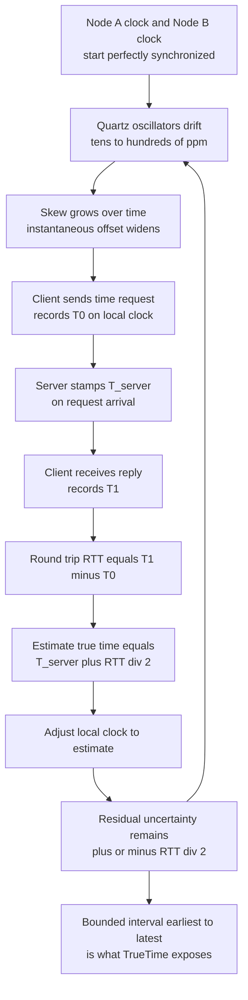

# ⏰ Physical Clocks and Synchronization

> [!abstract] TL;DR
> Every node in a distributed system keeps its own hardware clock — a quartz oscillator that **drifts** by tens to hundreds of parts-per-million, so any two clocks develop a growing **skew**. Synchronization protocols (Cristian's algorithm, NTP, Berkeley, PTP, Google TrueTime) can *bound* the error but never eliminate it, because network delay is variable. The residual uncertainty means **wall-clock timestamps cannot reliably order events across machines** — which is why distributed systems mostly switch to *logical* time, while a few (Spanner) exploit *tightly bounded* physical time to get global consistency.

---

## Intuition

**Analogy:** Every computer has its own wristwatch, and no two watches ever agree. Each drifts a little — a few milliseconds an hour — so watches that started identical slowly wander apart. Now imagine two colleagues in different buildings, each writing the exact time of an event on a sticky note using their own watch. If the events are seconds apart you can compare the notes; if they are *milliseconds* apart, the watches' disagreement is larger than the gap, and you genuinely cannot tell which event happened first.

Physical-clock synchronization is the act of periodically walking over to a reference clock and nudging every watch to match it. But by the time you have looked at the reference clock, walked back, and adjusted, some *unknown* amount of time has passed — so even a freshly synced watch is only correct to within a margin, never exactly. That irreducible margin is why distributed systems mostly abandon wall-clock time for **logical time**, and why the systems that *do* trust physical time (like Spanner) treat "now" as an **interval**, not a point.

---

## How It Works

### Core Mechanics

1. **The hardware clock.** Each machine has a counter driven by a quartz **oscillator**. Temperature, voltage, and manufacturing variance make it tick slightly faster or slower than a true second. The deviation rate is the **drift**, typically 10s–100s of ppm (parts-per-million). At 100 ppm a clock gains or loses about **8.6 seconds per day** with no correction.

2. **Skew grows over time.** **Skew** is the *instantaneous* difference between two clocks at a given moment. Because each clock drifts at its own rate, an initially-synchronized pair develops skew that grows roughly linearly with elapsed time since the last correction.

3. **Two kinds of clock — do not confuse them.**
   - **Wall-clock / time-of-day clock** (`CLOCK_REALTIME`, `System.currentTimeMillis`): tracks calendar UTC, human-meaningful — but can **jump backward** when NTP steps it, or during a leap second. Never use it to measure elapsed time.
   - **Monotonic clock** (`CLOCK_MONOTONIC`, `time.monotonic`, `System.nanoTime`): only ever moves forward, unaffected by NTP adjustments. **Use it for durations, timeouts, and leases.**

4. **External vs internal synchronization.**
   - **External:** sync every node to an absolute reference — UTC via GPS, radio, or an atomic clock. Gives globally meaningful timestamps.
   - **Internal:** keep all nodes close to *each other* with no absolute reference (Berkeley algorithm). Cheaper, but the whole cluster can drift together away from real UTC.

5. **Cristian's algorithm (the core trick).** A client asks a time server for the time and must account for the round trip:
   - Client records `T0` on its own clock, sends the request.
   - Server stamps its time `T_server` and replies.
   - Client records `T1` when the reply arrives; measures `RTT = T1 - T0`.
   - **Estimate:** `true_time ≈ T_server + RTT/2` (assume the reply took half the round trip).
   - **Error bound:** `± RTT/2` — because the true split between forward and return delay is unknown. Accuracy is therefore limited by network delay *variability*, not average latency.

6. **NTP (Network Time Protocol).** A hierarchy of **strata** (stratum 0 = atomic/GPS source, stratum 1 = directly attached servers, and so on). Each exchange yields **four timestamps** (`t1..t4`) from which NTP computes offset and delay, then *filters* many samples and *disciplines* the local clock by gently slewing rather than stepping. Achieves ~milliseconds over the internet, ~tens of microseconds on a LAN.

7. **Berkeley algorithm.** Internal sync with no accurate reference: a coordinator polls everyone, computes an average (discarding outliers), and tells each node how much to adjust. Good for isolated clusters.

8. **PTP (Precision Time Protocol, IEEE 1588).** Hardware-timestamped at the NIC to remove OS jitter; reaches **sub-microsecond** accuracy on dedicated datacenter and finance networks.

9. **Google TrueTime (Spanner).** Instead of pretending time is a point, TrueTime's API returns an **interval `[earliest, latest]`** guaranteed to contain true UTC, with the width bounded (a few ms) by GPS + atomic clocks in every datacenter. Spanner turns bounded error into a *feature*: on commit it **waits out** the uncertainty (**commit-wait**) so that a transaction's timestamp is guaranteed to be in the past for everyone — yielding externally-consistent (linearizable) global transactions.

10. **Why physical time is insufficient for ordering.** Even synchronized clocks carry residual error. Two events milliseconds apart on different nodes cannot be reliably ordered by timestamp, and a timestamp can even **violate causality** — an effect may receive an *earlier* timestamp than its cause. This is the motivation for **logical clocks**, which capture causality directly rather than guessing at wall time.

11. **Hybrid approaches.** **Hybrid Logical Clocks (HLC)** glue a physical-time component to a logical counter, giving timestamps that are causally consistent *and* close to wall time. Used in CockroachDB, YugabyteDB, and MongoDB.

### Flow / Architecture



---

## Key Concepts

**Secondary (intuition level).** Computer clocks are not perfectly accurate; they run slightly fast or slow and slowly disagree. To fix this a computer asks a trusted time server "what time is it?" and corrects itself — but the answer is always a little stale because the message took time to travel. So the correction is close, never exact.

**Undergraduate (CS background).**
- **Drift** = rate of deviation (ppm); **skew** = offset at an instant; **resolution/granularity** = the smallest tick the clock can represent.
- **Cristian's algorithm:** `estimate = T_server + RTT/2`, uncertainty `± RTT/2`; accuracy is set by delay *asymmetry*, i.e. `|forward − return| / 2`.
- **NTP** derives offset and delay from four timestamps `t1..t4`:
  `offset = ((t2 − t1) + (t3 − t4)) / 2`, `delay = (t4 − t1) − (t3 − t2)`.
- **Monotonic vs wall-clock:** measure elapsed time with a monotonic clock; a wall clock can step backward on correction and produce negative durations.

**Graduate (systems-level).**
- Synchronization cannot beat the *lower bound* set by delay variance; on a wide-area link with jitter, no protocol gets you below that uncertainty. This connects to the asynchronous-model impossibility results that underpin distributed consensus.
- **TrueTime** reframes the problem: expose uncertainty `ε` explicitly and pay `2ε` of commit-wait latency to purchase **external consistency**. Tightening `ε` (better hardware, more time sources) directly cuts transaction latency — a rare case where clock engineering buys correctness.
- **HLC** provides a total order compatible with the `happens-before` relation while staying within a bounded distance of physical time, giving snapshot reads "as of" a wall-clock instant without an atomic-clock fleet.
- The deep lesson: physical time answers "*what* wall-clock instant?" but *not* "*which event came first?*" across nodes. Ordering is a **causal** question, best answered by logical/vector clocks — see the sibling notes referenced below.

---

## Python Demo

```python
"""
Cristian's algorithm / NTP-style clock synchronization simulation.

Demonstrates:
  * a client quartz clock that DRIFTS at a fixed ppm rate
  * the client periodically syncing to a UTC time server over a channel
    with VARIABLE round-trip delay
  * Cristian's estimate:  true_time ~= T_server + RTT/2,  bound = +/- RTT/2
  * WITHOUT sync the error grows linearly; WITH sync it stays bounded (sawtooth)
  * a RESIDUAL uncertainty that never shrinks to zero -> motivates
    TrueTime-style bounded-uncertainty intervals.

Pure standard library + matplotlib (numpy not required).
"""

import random
import matplotlib.pyplot as plt

random.seed(7)

# ---- parameters ----
DURATION_S      = 3600      # simulate one hour of real time
SAMPLE_DT       = 1.0       # sample every second
DRIFT_PPM       = 80.0      # client clock runs fast by 80 parts-per-million
SYNC_INTERVAL_S = 300.0     # Cristian sync every 5 minutes
ONE_WAY_MIN_MS  = 5.0       # min one-way network delay
ONE_WAY_MAX_MS  = 45.0      # max one-way delay (its VARIABILITY = the uncertainty)

drift = DRIFT_PPM / 1e6     # fractional rate: local seconds per true second, minus 1


def read_clock(true_t, offset):
    """A hardware clock that ticks `drift` too fast, plus a correction offset."""
    return true_t * (1.0 + drift) + offset


# ---- state ----
offset_nosync = 0.0         # this clock is never corrected
offset_sync   = 0.0         # this clock is corrected by Cristian syncs
next_sync_t   = 0.0
last_sync_t   = 0.0
last_half_ms  = 0.0         # +/- RTT/2 captured at the most recent sync

# ---- logs ----
mins, err_nosync, err_sync = [], [], []
band_hi, band_lo = [], []
sync_t, sync_resid, sync_bound = [], [], []

t = 0.0
while t <= DURATION_S:

    # perform a Cristian sync when one is due
    if t >= next_sync_t:
        d_fwd  = random.uniform(ONE_WAY_MIN_MS, ONE_WAY_MAX_MS) / 1000.0
        d_back = random.uniform(ONE_WAY_MIN_MS, ONE_WAY_MAX_MS) / 1000.0
        rtt    = d_fwd + d_back

        t_server    = t + d_fwd                 # server stamps true UTC on arrival
        t_recv_true = t + d_fwd + d_back        # client receives the reply here
        estimate    = t_server + rtt / 2.0      # Cristian's guess of "true time now"

        # re-derive the offset so the clock reads `estimate` at the moment of receipt
        offset_sync = estimate - t_recv_true * (1.0 + drift)

        last_sync_t  = t_recv_true
        last_half_ms = (rtt / 2.0) * 1000.0
        next_sync_t += SYNC_INTERVAL_S

        resid_ms = (estimate - t_recv_true) * 1000.0   # = (d_fwd - d_back)/2, the real error
        sync_t.append(t_recv_true / 60.0)
        sync_resid.append(resid_ms)
        sync_bound.append(last_half_ms)

    # sample both clocks (error vs true time, in milliseconds)
    e_ns = (read_clock(t, offset_nosync) - t) * 1000.0
    e_s  = (read_clock(t, offset_sync)   - t) * 1000.0

    # the guaranteed uncertainty half-width grows with drift since the last sync
    half = last_half_ms + drift * max(0.0, t - last_sync_t) * 1000.0

    mins.append(t / 60.0)
    err_nosync.append(e_ns)
    err_sync.append(e_s)
    band_hi.append(half)
    band_lo.append(-half)
    t += SAMPLE_DT

# ---- console summary ----
print(f"Drift rate: {DRIFT_PPM:.0f} ppm  ->  ~{DRIFT_PPM * 3.6:.0f} ms error per hour if never synced")
print(f"Unsynced error after 1 h : {err_nosync[-1]:8.1f} ms")
print(f"Synced   max |error|     : {max(abs(e) for e in err_sync):8.2f} ms")
print("Per-sync residual vs Cristian bound (ms):")
for tm, r, b in zip(sync_t, sync_resid, sync_bound):
    ok = "OK" if abs(r) <= b else "VIOLATION"
    print(f"  t={tm:6.1f} min  residual={r:+6.2f}  within +/-{b:5.2f}  -> {ok}")

# ---- visualization ----
fig, (ax1, ax2) = plt.subplots(2, 1, figsize=(10, 8), sharex=True)

ax1.plot(mins, err_nosync, color="crimson",   label="No sync: error drifts linearly")
ax1.plot(mins, err_sync,   color="steelblue", label="Cristian sync: bounded sawtooth")
ax1.scatter(sync_t, sync_resid, color="black", zorder=5, s=25,
            label="Sync instants (residual error)")
ax1.axhline(0, color="grey", lw=0.8)
ax1.set_ylabel("Clock error vs true time [ms]")
ax1.set_title("Physical clock drift and periodic synchronization")
ax1.legend(loc="upper left")
ax1.grid(alpha=0.3)

ax2.fill_between(mins, band_lo, band_hi, color="steelblue", alpha=0.2,
                 label="Guaranteed uncertainty interval  +/- half-width")
ax2.plot(mins, err_sync, color="steelblue", lw=1.0,
         label="Actual synced error (stays inside the band)")
ax2.axhline(0, color="grey", lw=0.8)
ax2.set_xlabel("Time [minutes]")
ax2.set_ylabel("Error / uncertainty [ms]")
ax2.set_title("Residual uncertainty never collapses to zero -> motivates TrueTime intervals")
ax2.legend(loc="upper left")
ax2.grid(alpha=0.3)

plt.tight_layout()
plt.savefig("clock_sync.png", dpi=120)
print("Saved plot to clock_sync.png")
```

**What you see:** the unsynchronized clock's error climbs in a straight line to roughly a quarter-second after an hour, while the Cristian-synced clock traces a **sawtooth** — drifting between syncs, snapping back at each one, but never to *zero*. The shaded band is the `± RTT/2` uncertainty (widened by drift since the last sync); the actual error always stays inside it but the band never shrinks to a point. That irreducible width is exactly what TrueTime models as an explicit interval.

---

## Real-World Applications

> **Example:** **Google Spanner / TrueTime.** Every Spanner datacenter houses GPS receivers and atomic clocks; the TrueTime API returns `[earliest, latest]` bounding true UTC to within a few milliseconds. On commit, Spanner picks a timestamp `s` and **waits until `TT.now().earliest > s`** before releasing locks, guaranteeing the commit is globally in the past. This "commit-wait" is how Spanner delivers externally-consistent, linearizable transactions across continents — turning *bounded* clock error into a correctness tool. See [[NewSQL]] and [[Consistency_Models]].

- **NTP everywhere:** almost every server, phone, and router disciplines its clock via NTP to stay within milliseconds of UTC for logs, TLS certificate validity windows, and Kerberos tickets.
- **PTP in finance/datacenters:** exchanges and HFT firms run PTP for sub-microsecond timestamps; **MiFID II** legally mandates clock accuracy for trade-event ordering.
- **CockroachDB / YugabyteDB / MongoDB:** use **Hybrid Logical Clocks** to get causally consistent, wall-clock-close timestamps without an atomic-clock fleet — and set a `max clock offset`; a node whose skew exceeds it is *evicted* to preserve correctness.
- **Cross-server debugging:** correlating request logs across microservices depends on synchronized wall clocks — and the classic "our clocks skewed and everything broke" outage (expired-too-early caches, out-of-order log lines, premature lease expiry) is a perennial incident. See [[Distributed_Locks]].

---

## Trade-offs

| Aspect | Pro | Con |
|--------|-----|-----|
| Performance | NTP/PTP sync is cheap background traffic; PTP hardware timestamping removes OS jitter | TrueTime commit-wait *adds* latency (`~2ε`) to every transaction; tighter bounds cost money |
| Complexity | Cristian's algorithm is a few lines; NTP is a mature, ubiquitous daemon | TrueTime needs GPS + atomic clocks per datacenter; HLC adds bookkeeping to every message |
| Scalability | Stratified/hierarchical NTP scales to the whole internet | Accuracy degrades with network distance and jitter; wide-area sync is fundamentally loose |
| Correctness | Bounded, *known* uncertainty (TrueTime) enables global linearizability | Naive timestamp ordering can violate causality and silently corrupt data |

---

## When to Use vs Avoid

**Use physical clocks when:**
- You need **human-meaningful, absolute** timestamps (logs, audit trails, certificate expiry, scheduling, billing).
- You can measure and **bound** the uncertainty and are willing to wait it out for consistency (Spanner/TrueTime), or you have PTP-grade hardware.
- You are measuring a **duration on a single machine** — then use the *monotonic* clock specifically.

**Avoid relying on physical clocks when:**
- You must **order events across nodes** whose timestamps differ by less than the clock uncertainty — use logical or vector clocks instead.
- You need **causal correctness** (conflict detection, versioning) — wall clocks can invert cause and effect.
- You break ties in concurrent writes with wall-clock **last-writer-wins** — skew then silently discards data.

---

## Common Pitfalls

- **Using the wall clock to measure elapsed time** — an NTP step can move it backward, yielding negative or wildly wrong durations. Always use a monotonic clock for timeouts, benchmarks, and leases.
- **Trusting sub-second timestamp order across machines** — if two events are closer together than the clock uncertainty (often 1–50 ms on the internet), their timestamp order is meaningless.
- **Last-writer-wins with skewed clocks** — a slow clock makes a *newer* write look *older*, so it loses to a stale value. Skew becomes silent data loss.
- **Ignoring leap seconds and NTP steps** — code that assumes time is strictly increasing and never repeats will break; prefer smearing/monotonic sources.
- **Assuming sync means exact** — every synced clock still carries a residual bound. Systems that treat "now" as a point (rather than an interval) are quietly making an unsafe assumption; TrueTime's whole design is to make that bound explicit.
- **Setting `max clock offset` too loose (or too tight)** — in HLC databases (Cockroach/Yugabyte), too loose risks consistency anomalies, too tight causes spurious node evictions during NTP hiccups.

---

## Related Concepts

- [[Vector_Clocks]] — the logical-clock answer to the ordering problem physical clocks cannot solve; captures causality directly instead of guessing at wall time.
- [[Consensus_and_Raft]] — the alternative to clock-based ordering: a leader imposes a total order via a replicated log, sidestepping clock skew entirely.
- [[NewSQL]] — Spanner, CockroachDB, YugabyteDB; where TrueTime and Hybrid Logical Clocks are actually deployed for distributed ACID.
- [[Consistency_Models]] — the linearizability / external-consistency guarantees that TrueTime's bounded uncertainty makes possible.
- [[Distributed_Locks]] — leases and lock timeouts are built on clocks; skew is a classic cause of double-holding a "distributed" lock.
- [[Distributed_Operating_Systems]] — the OS-level view of clock synchronization and logical time in distributed kernels.

*Planned sibling notes in this vault (referenced in prose above, not yet created):* `Distributed_Systems_Overview`, `Logical_Clocks_and_Happens_Before`, `Vector_Clocks_and_Causality`, `Linearizability_and_Sequential_Consistency`, `Distributed_Transactions`.

---

## Review Questions

1. **(Conceptual)** Cristian's algorithm estimates the true time as `T_server + RTT/2`. Derive the exact residual error in terms of the forward delay `d_fwd` and return delay `d_back`, and prove it always lies within the claimed `± RTT/2` bound. Under what network condition does the estimate become *exact*?
2. **(Scenario)** You are designing a globally distributed database. One team proposes ordering all transactions purely by `System.currentTimeMillis()` timestamps; another proposes Spanner-style TrueTime with commit-wait. Given clocks synchronized to within ±5 ms, what specific correctness anomaly can the first design produce, and how does commit-wait eliminate it? What latency does that cost?
3. **(Trade-off)** A microservice measures request latency by subtracting two `wall-clock` readings and occasionally reports *negative* latencies. Explain the root cause, name the correct clock to use, and describe one situation where you nonetheless *do* need the wall clock rather than a monotonic one.

---

## Sources

- Cristian, F. "Probabilistic Clock Synchronization." *Distributed Computing*, 1989. https://link.springer.com/article/10.1007/BF01784241
- Mills, D. L. "Network Time Protocol (Version 4) Specification." RFC 5905, 2010. https://www.rfc-editor.org/rfc/rfc5905
- Corbett, J. C., et al. "Spanner: Google's Globally-Distributed Database." OSDI, 2012. https://research.google/pubs/pub39966/
- Kleppmann, M. *Designing Data-Intensive Applications*, Chapter 8: "The Trouble with Distributed Systems." O'Reilly, 2017.
- Kulkarni, S., et al. "Logical Physical Clocks and Consistent Snapshots in Globally Distributed Databases" (Hybrid Logical Clocks), 2014. https://cse.buffalo.edu/tech-reports/2014-04.pdf

---

#distributed-systems #physical-clocks #clock-synchronization #ntp #truetime
