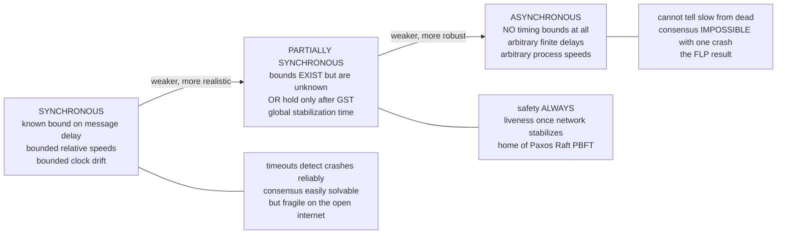

# ⏱️ System and Timing Models

> [!abstract] TL;DR
> Every theorem in distributed computing is stated **relative to a model** — a precise set of assumptions about *timing*, *communication*, and *computation*. The single most consequential choice is the **timing model**: whether message delays and processing speeds are **bounded (synchronous)**, **completely unbounded (asynchronous)**, or **bounded-but-unknown / eventually-bounded (partial synchrony)**. That one decision determines what is *solvable*: consensus is easy under synchrony, **provably impossible** under pure asynchrony with a single crash (FLP), and *solvable-with-caveats* under partial synchrony — which is exactly why real systems (Paxos, Raft, PBFT) are built on the partial-synchrony model, promising **safety always, liveness eventually**.

---

## Intuition

**Analogy:** Imagine coordinating a group of collaborators purely **by mail**. Suppose the postal service **guarantees every letter arrives within one day**. Then you can reason cleanly: "I wrote to Priya two days ago and heard nothing back — since a round trip is at most two days, she must have *gone silent* (crashed)." A missing reply is genuine information. This is the **synchronous** world, where **timeouts detect failure reliably**.

Now drop the guarantee: letters can take **any finite amount of time** — usually a day, but occasionally weeks. A silent collaborator might be **dead**, or might just be **slow** — a letter still crawling through the system. No matter how long you wait, you can *never* tell these two apart, because there is no deadline a live-but-slow person is required to beat. This is the **asynchronous** world, and that single inability — **you cannot distinguish "slow" from "dead"** — is what makes so many problems impossible. Real networks live in between: usually timely, occasionally not, with no advertised bound. That in-between is **partial synchrony**, and picking the right point on this spectrum is the first — and most important — modeling decision in the entire field.

---

## How It Works

### Why models are the whole game

Results in distributed computing are **never absolute** — they are always of the form *"in model M, problem P is (im)possible."* Change M and the answer flips. Consensus is a **five-line algorithm** in a synchronous system with crash faults, yet is **impossible** in an asynchronous system with even one crash. The problem statement did not change; only the *timing assumption* did. So the craft of the theorist — and the systems engineer — is to **state the model precisely** and then prove what holds inside it. Vague assumptions ("the network is usually fast") produce systems that work in the demo and page you at 3 a.m.; a named model makes the guarantee **checkable**.

A full system model has **three orthogonal dimensions**:

1. **Timing** — how delay, processing speed, and clock drift are bounded (the focus of this note).
2. **Communication** — how processes exchange information.
3. **Computation** — what a process is and how it takes steps.

A separate, orthogonal dimension is the **failure model** — *how* nodes fail (crash, omission, Byzantine) — which is developed in its own note; here we only note that timing and failure combine to define solvability.

### The timing spectrum

**Synchronous model.** There are **known upper bounds** on (a) message delay `Δ`, (b) the ratio of processing speeds between the fastest and slowest process, and (c) clock drift. Because a bound is *known*, a process can set a timeout of `Δ` (plus a bit) and treat expiry as **proof** of a crash — with **no false positives**. This is a *strong* model: it enables round-based algorithms, lock-step protocols, and simple failure detection. Its weakness is **realism** — the open internet offers no such guarantee, and a system that assumes one shatters the moment a GC pause or a congested link violates the bound.

**Asynchronous model.** There are **no timing assumptions whatsoever**: messages take **arbitrary but finite** time, and processes run at **arbitrary speeds**. This is the **weakest and most robust** model — an algorithm proven correct here works *everywhere*, because it never relied on timing. But robustness has a price: a slow message is indistinguishable from a crashed sender, so **perfect failure detection is impossible**, and with it, deterministic consensus (this is the **FLP impossibility result** — consensus cannot be solved deterministically in an asynchronous system if even one process may crash).

**Partial synchrony (Dwork–Lynch–Stockmeyer, 1988).** The realistic middle ground, in two equivalent flavours: either (a) bounds `Δ` on delay **exist but are unknown** to the algorithm, or (b) bounds hold **only after some unknown Global Stabilization Time (GST)** — before GST the network may behave arbitrarily; after GST it is synchronous forever. This precisely models the real internet: **usually timely, occasionally not, with no advertised limit**. It is powerful enough to let a protocol guarantee **safety in *all* executions** and **liveness once the network stabilizes** — which is the exact contract that Paxos, Raft, and PBFT rely on.

### The spectrum, and what each model permits



### The communication model

Timing is *what* the network guarantees about speed; the communication model is *what shape* the channels take:

- **Message-passing vs shared-memory** — processes either exchange explicit messages, or read/write shared registers. Distributed systems are almost always **message-passing**; shared-memory is the model for multicore concurrency.
- **Point-to-point vs broadcast** — a link between two named processes, versus a primitive that delivers to everyone.
- **Reliable vs lossy** — a **reliable** link never drops a message; a **fair-loss** link may drop messages but not *every* retransmission (retry eventually gets through), which is the honest model for UDP-style networks. Higher-level abstractions (reliable delivery, ordered/total-order broadcast) are *built on top of* fair-loss links plus retransmission.

### The process / computation model

A process is modeled as a **deterministic (or randomized) state machine / automaton** that takes discrete **steps**: receive a message, change state, send messages. An **execution** (or **run**) is an **interleaving of events** across all processes over time. The decisive proof device is the **adversarial scheduler**: an adversary that controls *when* each message is delivered and *which* process takes the next step (subject to the model's timing rules). Impossibility proofs work by showing the adversary can always steer the system into a bad interleaving — the FLP proof, for instance, shows the scheduler can perpetually delay decision by delivering messages in an order that keeps the system "undecided."

### Safety, liveness, and the design mantra

Two kinds of property, and the model affects them very differently:

- **Safety** — "nothing bad happens" (e.g. two nodes never decide different values). Safety typically holds in **all** timing models, because it constrains what states are *reachable*, not *when*.
- **Liveness** — "something good eventually happens" (e.g. every node eventually decides). Liveness usually **requires synchrony assumptions**, because it demands *progress within finite time*, which pure asynchrony can starve forever.

This yields the industry mantra: **"safety always, liveness eventually."** A well-designed consensus protocol *never* violates agreement even during a network partition; it merely *stops making progress* until timely communication returns. Over-strong assumptions (assume synchrony) buy simplicity but produce **fragile** systems; over-weak assumptions (pure asynchrony) buy robustness but hit **impossibility**. **Partial synchrony is the sweet spot**, and choosing it is why modern consensus systems both *work* and *stay correct* when the network misbehaves.

---

## Key Concepts

**Secondary (intuitive level)**
- A **model** is a set of rules the system is assumed to obey; results only make sense *relative* to a model.
- **Synchronous** = the network has a speed limit you know, so silence means "crashed."
- **Asynchronous** = no speed limit, so silence means "crashed *or* just slow — can't tell."
- **Timeout** = the practical tool for guessing failure; it is only *reliable* when delays are bounded.

**Undergraduate (mechanism level)**
- The three timing models and their formal bounds: known `Δ` (synchronous), no `Δ` (asynchronous), unknown/eventual `Δ` (partial synchrony).
- **Communication model**: message-passing vs shared-memory; reliable vs fair-loss links; point-to-point vs broadcast.
- **Computation model**: processes as state machines taking steps; a **run** as an interleaving of events.
- **Safety vs liveness** and why liveness is the property that needs synchrony.
- **Failure detectors** as an abstraction that *encapsulates* timing assumptions: a "◇P" (eventually perfect) detector is exactly what partial synchrony can build.

**Graduate (research level)**
- **Dwork–Lynch–Stockmeyer** partial synchrony: the two definitions (unknown bounds vs GST) and their equivalence for consensus solvability.
- **FLP impossibility** and how the **adversarial scheduler** + a *bivalent* initial configuration force a non-terminating execution.
- The **failure-detector hierarchy** (Chandra–Toueg): the *weakest* detector `Ω` / `◇S` sufficient to solve consensus, and how it maps back to timing assumptions.
- Separating **safety** and **liveness** as intersections of, respectively, closed and dense sets in the topology of executions (Alpern–Schneider).
- Round models, lock-step vs eventual synchrony, and the cost of over-assuming timing (correlated failures, GC/VM pauses violating `Δ`).

---

## Python Demo

This simulation shows **why the timing model matters** by building the simplest failure detector — a **timeout on a ping**. Node A repeatedly pings a node B that is **always alive**, so *every* suspicion is a **false positive**. Under a **synchronous** network (round-trip delay bounded by `Δ`), a timeout `T ≥ Δ` yields **zero** false positives — crash detection is reliable. Under an **asynchronous** network (heavy-tailed, unbounded delay), **any finite timeout** eventually times out on a live-but-slow reply, so false suspicions **never vanish**. We measure the false-positive rate vs timeout under each model and visualize both the delay distributions and the "can't distinguish slow from dead" problem.

```python
# Timing models and failure detection: why any finite timeout fails under asynchrony.
# Pure stdlib for simulation; matplotlib for visualization (numpy not required).
import random
import matplotlib.pyplot as plt

random.seed(7)

DELTA = 100.0        # ms: the KNOWN upper bound in the synchronous model
N_PINGS = 200_000    # samples per timeout value

# --- delay models: round-trip time of a ping to a LIVE node -------------
def synchronous_rtt():
    """Bounded delay, uniform on (1, DELTA]. Guaranteed <= DELTA."""
    return random.uniform(1.0, DELTA)

def asynchronous_rtt():
    """Unbounded, heavy-tailed delay (Pareto): most replies are fast, but a
    small fraction take arbitrarily long. There is NO finite upper bound."""
    alpha, xm = 1.5, 20.0            # mean ~60ms, but the tail is heavy
    u = 1.0 - random.random()        # u in (0, 1], avoids division by zero
    return xm * u ** (-1.0 / alpha)  # inverse-CDF sampling of a Pareto

# --- false-positive rate: a LIVE node wrongly declared "dead" -----------
def false_positive_rate(sampler, timeout, n=N_PINGS):
    suspected = sum(1 for _ in range(n) if sampler() > timeout)
    return suspected / n

timeouts = list(range(10, 401, 10))  # candidate timeout values in ms
fp_sync  = [false_positive_rate(synchronous_rtt,  t) for t in timeouts]
fp_async = [false_positive_rate(asynchronous_rtt, t) for t in timeouts]

print(f"SYNCHRONOUS : timeout=Delta={DELTA:.0f}ms -> false positives = "
      f"{false_positive_rate(synchronous_rtt, DELTA):.4%}")
print(f"ASYNCHRONOUS: timeout=400ms          -> false positives = "
      f"{false_positive_rate(asynchronous_rtt, 400):.4%}  (never reaches 0)")

# --- visualize -----------------------------------------------------------
fig, (ax1, ax2) = plt.subplots(1, 2, figsize=(13, 5))

sync_samples  = [synchronous_rtt()  for _ in range(20000)]
async_samples = [asynchronous_rtt() for _ in range(20000)]
ax1.hist(sync_samples,  bins=50, range=(0, 400), alpha=0.6,
         color="tab:green", label="synchronous: bounded by Delta")
ax1.hist(async_samples, bins=50, range=(0, 400), alpha=0.6,
         color="tab:red",   label="asynchronous: heavy-tailed, unbounded")
ax1.axvline(DELTA, color="black", ls="--", lw=1.5, label=f"Delta = {DELTA:.0f}ms")
ax1.set_title("Round-trip delay to a LIVE node")
ax1.set_xlabel("delay in ms")
ax1.set_ylabel("count, clipped at 400ms; async tail runs off-chart")
ax1.legend()

ax2.plot(timeouts, fp_sync,  "o-", color="tab:green", label="synchronous")
ax2.plot(timeouts, fp_async, "s-", color="tab:red",   label="asynchronous")
ax2.axvline(DELTA, color="black", ls="--", lw=1.5, label=f"Delta = {DELTA:.0f}ms")
ax2.set_title("False-positive rate vs timeout\n(suspecting a node that is actually ALIVE)")
ax2.set_xlabel("timeout T in ms")
ax2.set_ylabel("P[ live node wrongly suspected ]")
ax2.legend()

fig.suptitle("Cannot distinguish SLOW from DEAD: any finite timeout leaks "
             "false positives under asynchrony", fontweight="bold")
fig.tight_layout()
plt.savefig("timing_models_failure_detector.png", dpi=120)
print("saved timing_models_failure_detector.png")
```

**What you observe.** The synchronous curve **drops to exactly 0** the moment the timeout reaches `Δ` — beyond the bound, a live node is *never* falsely suspected. The asynchronous curve **stays strictly above 0 for every finite timeout**: pushing the timeout out only trades false positives for slower detection, never eliminating them. The histogram makes the cause visible — the synchronous delay has a hard right edge at `Δ`, while the asynchronous delay has a **fat tail** that spills past any cutoff you draw. That gap is FLP in miniature: with unbounded delay, no timeout can safely equate silence with death.

---

## Real-World Applications

- **Consensus systems (Raft, Paxos, PBFT)** assume **partial synchrony**: they keep **safety** (never commit conflicting values) during arbitrary network turbulence, and regain **liveness** — electing a leader, committing entries — only once messages start arriving in time. Raft's randomized **election timeout** is precisely a partial-synchrony failure detector; see [[Consensus_and_Raft]].
- **Failure detectors and heartbeats** in etcd, ZooKeeper, Cassandra, and Kubernetes' node controller are timeout-based, so they are **unavoidably imperfect** under asynchrony. Cassandra's **Phi Accrual** detector replaces a hard timeout with a *suspicion level* estimated from the observed delay distribution — an engineering answer to exactly the tail problem the demo visualizes.
- **CAP / PACELC trade-offs** are a timing-model consequence: during a partition (an extreme asynchrony), a system must choose **consistency or availability**, precisely because it cannot tell a partitioned peer from a dead one; see [[CAP_Theorem]].
- **Blockchain protocols** state their timing model explicitly: Nakamoto/PoW assumes *synchrony* for its security bound, whereas classical BFT chains (Tendermint, HotStuff) assume *partial synchrony* — a direct real-world stake in getting the model right; see [[Consensus_and_Quorums]].
- **Distributed OS coordination** — logical clocks and consensus inside a cluster inherit these assumptions the instant work crosses a machine boundary; see [[Distributed_Operating_Systems]] and [[Vector_Clocks]].

---

## Common Pitfalls

- **Assuming synchrony implicitly.** Code that says "if no ACK in 500 ms, the node is dead" has silently assumed a synchronous model. A GC pause, VM migration, or congested link violates the bound and triggers **false failover** — the classic cause of split-brain and cascading outages.
- **Believing a bigger timeout "fixes" false positives.** Under a heavy-tailed (asynchronous-ish) network, raising the timeout only shifts the trade-off: fewer false positives but slower real-crash detection. There is **no finite timeout with zero false positives** — the demo shows this directly.
- **Conflating timing faults with crash faults.** A slow node is *not* a crashed node, yet timeout-based detectors label both "dead." Treating a live-but-slow leader as crashed and electing a second leader is how you get **two leaders** (a safety hazard if the protocol is not carefully designed around it).
- **Proving an algorithm in the synchronous model, deploying on the internet.** The proof does not transfer. Guarantees that held under bounded delay can fail catastrophically once the bound is only *eventual*.
- **Forgetting the safety/liveness split.** Expecting a consensus system to *make progress* during a partition misunderstands the contract. It is *designed* to sacrifice liveness to preserve safety — that stall is correct behaviour, not a bug.
- **Treating partial synchrony as "synchronous most of the time."** GST is *unknown and unbounded*; a correct protocol must not assume the network stabilizes by any particular deadline, only that it *eventually* does.

---

## Related Concepts

- [[Consensus_and_Raft]] — Raft/Paxos assume **partial synchrony**; their timeouts and terms are the practical embodiment of this note's models.
- [[CAP_Theorem]] — the availability-vs-consistency choice under a partition is a direct downstream consequence of not being able to tell "slow/partitioned" from "dead."
- [[Consensus_and_Quorums]] — quorum-based agreement in distributed databases; its correctness argument is stated relative to a timing + failure model.
- [[Vector_Clocks]] — ordering events *without* a global clock is the flip side of the "no bounded clock drift" concern in the asynchronous model.
- [[Distributed_Operating_Systems]] — where partial failure, message passing, and no-global-clock first bite as you cross a machine boundary.
- [[Interprocess_Communication]] — the single-machine communication primitives that the distributed **message-passing model** generalizes (and strips of shared memory).

*Companion notes planned for this vault — Distributed_Systems_Overview, The_Consensus_Problem, FLP_Impossibility_Result, Failure_Models, Failure_Detectors, Message_Passing_and_RPC_Semantics, Reliable_and_Ordered_Broadcast, Paxos, and Raft_Consensus — extend the models introduced here.*

---

## Review Questions

1. **(Conceptual)** Why is the sentence "consensus is impossible" incomplete, and what must you add to make it a precise, true statement? Explain the role the *model* plays in every distributed-computing result.
2. **(Mechanism)** In the synchronous model a timeout of `Δ` detects crashes with zero false positives, yet the same timeout is useless under asynchrony. Explain *precisely* which assumption changes and why "you cannot distinguish slow from dead" follows from dropping it.
3. **(Applied trade-off)** You are designing a coordination service for a globally distributed cluster. Justify choosing the **partial-synchrony** model over both synchronous and asynchronous. Which property (safety or liveness) will you guarantee unconditionally, which will you make conditional, and what real network event will expose the difference?

---

## Sources

- Fischer, M. J., Lynch, N. A., Paterson, M. S. — *Impossibility of Distributed Consensus with One Faulty Process*, JACM 32(2), 1985. [DOI](https://doi.org/10.1145/3149.214121)
- Dwork, C., Lynch, N., Stockmeyer, L. — *Consensus in the Presence of Partial Synchrony*, JACM 35(2), 1988. [DOI](https://doi.org/10.1145/42282.42283)
- Chandra, T. D., Toueg, S. — *Unreliable Failure Detectors for Reliable Distributed Systems*, JACM 43(2), 1996. [DOI](https://doi.org/10.1145/226643.226647)
- Cachin, C., Guerraoui, R., Rodrigues, L. — *Introduction to Reliable and Secure Distributed Programming*, 2nd ed., Springer, 2011. [Book site](https://distributedprogramming.net/)
- Lynch, N. A. — *Distributed Algorithms*, Morgan Kaufmann, 1996. [Publisher](https://www.elsevier.com/books/distributed-algorithms/lynch/978-1-55860-348-6)

---

#distributed-systems #system-models #synchrony #asynchronous #partial-synchrony
