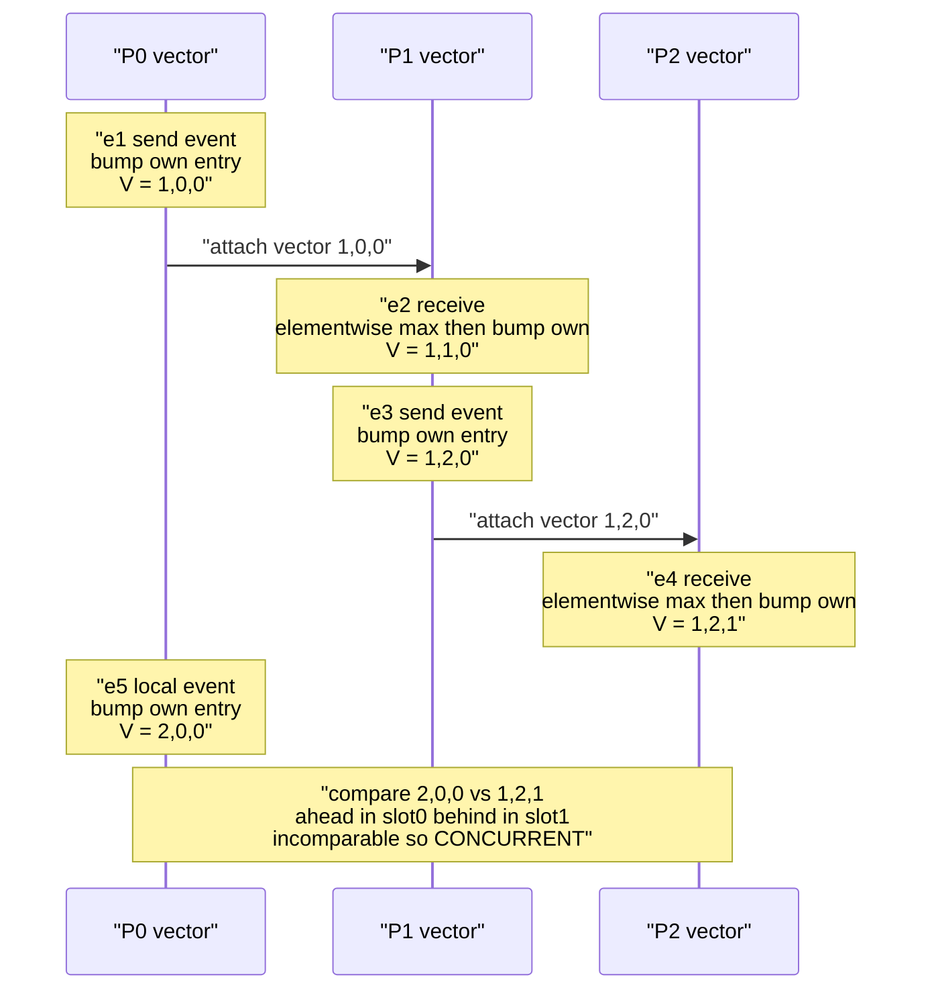

# 🧭 Vector Clocks and Causality

> [!abstract] TL;DR
> A **vector clock** gives each of N nodes a vector of N counters — one tally per node of "how much I have heard from you." Comparing two vectors gives the *exact* answer to "did event A know about event B?": if one vector dominates the other, one event **happened-before** the other; if neither dominates, the events are **concurrent**. This two-way characterization is precisely what scalar Lamport clocks cannot provide, and it is the algebra behind conflict detection in Dynamo-style databases, CRDTs, causal broadcast, and causal consistency.

---

## Intuition

**Analogy — the news scoreboard.** Imagine three colleagues — Ana, Bo, and Cy — spread across time zones, keeping each other updated only by email. Each keeps a small scoreboard: "the latest news I have heard from Ana / from Bo / from Cy," counted as a number of updates. Every time you do something noteworthy, you tick up *your own* number. Every time you read someone's email, you copy over any of their numbers that are fresher than yours — you now know at least as much as they did.

A single running counter (a **Lamport clock**) can only tell you *"this message is stamped later"* — but "later stamp" does not mean "actually knew about." Two people can each write "update #7" without ever having heard from each other. The scoreboard fixes this: lay two scoreboards side by side. If one is **greater-or-equal in every column**, that person strictly knew everything the other did — a real causal dependency. If each scoreboard is **ahead in some column and behind in another**, then neither person had heard the other's latest news when they acted — they moved **concurrently**, in mutual ignorance. That is a potential conflict, and the vectors detect it exactly.

The technical claim is that this scoreboard reconstructs the **happens-before partial order** (Lamport's `→`) with no loss: vector comparison is both *sound* and *complete* for causality, which the scalar Lamport clock is not. This new-but-not-yet-written vault will develop the scalar version separately in `Logical_Clocks_and_Happens_Before`; this note is the exact, complete upgrade.

---

## How It Works

### The problem vector clocks solve

Lamport's scalar clock guarantees only a **one-way** implication:

> if `A → B` (A happens-before B) then `LC(A) < LC(B)`.

The **converse fails**: `LC(A) < LC(B)` does **not** imply `A → B`. Two concurrent events routinely receive different Lamport values — the smaller-valued one merely *looks* earlier. So a Lamport timestamp can never tell you whether two events are causally related or merely concurrent; it imposes a total order that erases concurrency. For replicated data that is fatal: you cannot tell a genuine "newer version supersedes older" from "two independent writes that conflict."

Vector clocks restore the missing direction, satisfying the **strong clock condition**:

> `A → B` **if and only if** `V(A) < V(B)`.

### Core mechanics — the update rules

Each process `i` in a group of `N` maintains a vector `V` of `N` integer counters, initialized to all zeros. `V[i]` means "the number of events at process `i` that this process is aware of."

1. **Local event or send** — process `i` increments *its own* entry: `V[i] = V[i] + 1`.
2. **On send** — attach a copy of the full current vector `V` to the outgoing message.
3. **On receive** of a message carrying vector `M` — first take the **element-wise maximum**, absorbing everything the sender knew, then tick your own entry for the receive event itself:
   - `V[k] = max(V[k], M[k])` for every `k`,
   - then `V[i] = V[i] + 1`.

The element-wise max is the whole trick: it merges causal histories. After a receive, your vector dominates both your previous state and the message's state, so you now "know" everything the sender knew.

### The comparison — recovering the causal partial order

Define the componentwise order:

> `V ≤ W` iff `V[k] ≤ W[k]` for **all** `k`.

Then for two event timestamps:

| Relation | Test | Meaning |
|---|---|---|
| `V(A) < V(B)` | `V(A) ≤ V(B)` and `V(A) ≠ V(B)` | **A → B**: A happens-before B |
| `V(B) < V(A)` | symmetric | **B → A** |
| `V(A) = V(B)` | equal in every entry | same event |
| **incomparable** | neither `≤` holds | **A ∥ B: concurrent** |

"Incomparable" — ahead in one coordinate, behind in another — is exactly the definition of **concurrent**. This is the precise, two-sided characterization Lamport clocks lack. Vector clocks realize the happens-before relation as an **antichain-aware partial order**, not a lossy total order.

### Flow / Architecture



In the diagram, `e5 = [2,0,0]` and `e4 = [1,2,1]` are incomparable: `e5` is ahead in coordinate 0 but behind in coordinate 1. Neither dominates, so P0's local update and P2's received state are **concurrent** — each acted without knowledge of the other. A Lamport clock would stamp `e5` with `2` and `e4` with `4` and wrongly suggest `e5` came "before" `e4`, hiding the concurrency entirely.

---

## Key Concepts

### Secondary (plain intuition)
- A **clock** here is just a set of counters, not a wall clock. Wall clocks drift and cannot decide who acted first across machines.
- The **scoreboard**: each node keeps "latest news I have from each node." You bump your own number when you act, and copy over fresher numbers when you hear from someone.
- Compare two scoreboards: one is completely ahead → it happened *later and knew about* the other. Each ahead in different columns → they happened **at the same time**, unaware of each other.

### Undergraduate (CS foundations)
- **Happens-before (`→`)**: the partial order over events from same-process order, send-before-receive, and transitivity (developed in `Logical_Clocks_and_Happens_Before`).
- **Lamport limitation**: `A → B ⟹ LC(A) < LC(B)`, but not the converse — cannot detect concurrency.
- **Vector clock update rules**: increment own entry on local/send; on receive take element-wise `max` then increment own entry; ship the vector on every message.
- **Comparison**: `V ≤ W` componentwise gives happens-before; incomparable gives concurrent. This is the **strong clock condition**: `A → B ⟺ V(A) < V(B)`.
- **Cost**: each timestamp and each message header is **O(N)** in the number of nodes.

### Graduate (system-level)
- **Completeness / isomorphism**: a vector clock is order-isomorphic to the event's **causal history** (the down-set of events that precede it). Concurrency corresponds to **antichains** in the happens-before DAG.
- **Version vectors**: the practical variant that tags *data replicas* rather than events; incomparable version vectors flag **conflicting concurrent writes** (Dynamo, Riak, Voldemort). Contrast with a plain vector clock over events.
- **Scaling variants**: entries grow with membership, so systems use **dotted version vectors** (Almeida et al.), **interval tree clocks** (Almeida/Baquero/Fonte) for dynamic membership, and pruning of dead nodes. The core is a space-vs-precision tradeoff.
- **Matrix clocks**: an `N×N` matrix where row `i` is "what process `i` knows that each other process knows" — enables **garbage collection** of message logs once a message is known-known everywhere.
- **Causal delivery & consistency**: vector clocks implement **causal broadcast** (deliver a message only after all messages that causally precede it) and underpin **causal / causal+ consistency** (COPS, Bayou) — the strongest consistency model achievable under network partitions per the CAP theorem.

---

## Python Demo

Pure standard library for the simulation and comparison; `matplotlib` for the two visualizations (timelines + causal-relation matrix). No numpy required.

```python
"""
Vector Clocks vs Lamport Clocks -- a runnable simulation.

Shows:
  1. Vector-clock update rules (bump own on local/send; elementwise max + bump own on receive).
  2. The causal comparison: happens-before vs concurrent vs equal.
  3. Why vector clocks DETECT concurrency that Lamport clocks CANNOT.
  4. Version-vector conflict detection for replicated data.
  5. matplotlib views: process timelines + a happens-before / concurrent matrix.
"""

import matplotlib.pyplot as plt
from matplotlib.colors import ListedColormap

# ---------------------------------------------------------------------------
# 1. The simulator: tracks a vector clock AND a Lamport clock per process
# ---------------------------------------------------------------------------
class Cluster:
    def __init__(self, n):
        self.n = n
        self.vc = [[0] * n for _ in range(n)]   # vc[p] = vector clock of process p
        self.lc = [0] * n                        # lc[p] = Lamport scalar clock of p
        self.events = []                         # list of {name, pid, vc, lc}
        self.channel = {}                        # msg_id -> (vector, lamport, send_index)
        self.messages = []                       # (send_index, recv_index) for drawing arrows

    def _record(self, name, pid):
        self.events.append({
            "name": name,
            "pid": pid,
            "vc": tuple(self.vc[pid]),
            "lc": self.lc[pid],
        })
        return len(self.events) - 1

    def local(self, pid, name):
        self.vc[pid][pid] += 1                    # rule 1: bump own entry
        self.lc[pid] += 1
        return self._record(name, pid)

    def send(self, pid, name, msg_id):
        self.vc[pid][pid] += 1                    # a send is an event too
        self.lc[pid] += 1
        idx = self._record(name, pid)
        self.channel[msg_id] = (tuple(self.vc[pid]), self.lc[pid], idx)  # rule 2: attach vector
        return idx

    def recv(self, pid, name, msg_id):
        m_vc, m_lc, send_idx = self.channel[msg_id]
        self.vc[pid] = [max(a, b) for a, b in zip(self.vc[pid], m_vc)]   # rule 3: elementwise max
        self.vc[pid][pid] += 1                    # ...then bump own entry
        self.lc[pid] = max(self.lc[pid], m_lc) + 1
        idx = self._record(name, pid)
        self.messages.append((send_idx, idx))
        return idx

# ---------------------------------------------------------------------------
# 2. The comparison: the exact algebra of causality
# ---------------------------------------------------------------------------
def compare(v, w):
    """Return 'equal', 'before' (v -> w), 'after' (w -> v), or 'concurrent'."""
    if v == w:
        return "equal"
    le = all(a <= b for a, b in zip(v, w))        # v <= w  componentwise
    ge = all(a >= b for a, b in zip(v, w))        # v >= w  componentwise
    if le:                                        # v <= w and not equal => v happens-before w
        return "before"
    if ge:
        return "after"
    return "concurrent"                           # incomparable => concurrent

# ---------------------------------------------------------------------------
# 3. Build a scenario that contains a KNOWN concurrent pair
# ---------------------------------------------------------------------------
def build_scenario():
    c = Cluster(3)                     # P0, P1, P2
    c.send(0, "e1", "m1")              # P0 send   -> [1,0,0]  Lamport 1
    c.recv(1, "e2", "m1")             # P1 recv   -> [1,1,0]  Lamport 2
    c.send(1, "e3", "m2")             # P1 send   -> [1,2,0]  Lamport 3
    c.recv(2, "e4", "m2")             # P2 recv   -> [1,2,1]  Lamport 4
    c.local(0, "e5")                  # P0 local  -> [2,0,0]  Lamport 2
    return c

# ---------------------------------------------------------------------------
# 4. Show causality detection AND the Lamport failure
# ---------------------------------------------------------------------------
def report(c):
    ev = {e["name"]: e for e in c.events}
    print("Event timestamps")
    print("  name  vector        lamport")
    for e in c.events:
        print(f"   {e['name']}   {list(e['vc'])}      {e['lc']}")

    print("\nVector clock verdicts (the exact truth):")
    for a, b in [("e1", "e2"), ("e5", "e4"), ("e5", "e2")]:
        print(f"   {a} vs {b}: {compare(ev[a]['vc'], ev[b]['vc']).upper()}")

    print("\nLamport clock verdicts (lossy -- cannot see concurrency):")
    for a, b in [("e5", "e4"), ("e5", "e2")]:
        la, lb = ev[a]["lc"], ev[b]["lc"]
        guess = "looks BEFORE" if la < lb else ("looks AFTER" if la > lb else "TIE, cannot order")
        print(f"   {a}(L={la}) vs {b}(L={lb}): {guess}"
              f"   <-- vectors say {compare(ev[a]['vc'], ev[b]['vc']).upper()}")

# ---------------------------------------------------------------------------
# 5. Version-vector conflict detection (replicated data)
# ---------------------------------------------------------------------------
def version_vector_demo():
    ancestor  = (1, 0, 0)             # one write by replica 0, then it replicated out
    replica_a = (1, 1, 0)             # replica 1 writes concurrently (bumps slot 1)
    replica_b = (1, 0, 1)             # replica 2 writes concurrently (bumps slot 2), unaware of A
    print("\nVersion-vector conflict detection:")
    print(f"   ancestor  {ancestor}")
    print(f"   replica_a {replica_a}  vs ancestor -> {compare(ancestor, replica_a).upper()}")
    print(f"   replica_b {replica_b}  vs ancestor -> {compare(ancestor, replica_b).upper()}")
    verdict = compare(replica_a, replica_b)
    print(f"   replica_a vs replica_b -> {verdict.upper()}"
          + ("  ==> CONFLICT: needs resolution (siblings / LWW / merge)"
             if verdict == "concurrent" else ""))

# ---------------------------------------------------------------------------
# 6. Visualization
# ---------------------------------------------------------------------------
def visualize(c):
    fig, (ax1, ax2) = plt.subplots(1, 2, figsize=(14, 6))
    colors = {0: "#1f77b4", 1: "#ff7f0e", 2: "#2ca02c"}

    # --- (a) process timelines with vector timestamps ---
    for p in range(c.n):
        ax1.axhline(p, color="lightgray", zorder=0)
    for i, e in enumerate(c.events):
        p = e["pid"]
        ax1.scatter(i, p, s=140, color=colors[p], zorder=3)
        ax1.annotate(str(list(e["vc"])), (i, p), textcoords="offset points",
                     xytext=(0, 13), ha="center", fontsize=9)
        ax1.annotate(e["name"], (i, p), textcoords="offset points",
                     xytext=(0, -20), ha="center", fontsize=9, color="dimgray")
    for s_idx, r_idx in c.messages:
        ax1.annotate("", xy=(r_idx, c.events[r_idx]["pid"]),
                     xytext=(s_idx, c.events[s_idx]["pid"]),
                     arrowprops=dict(arrowstyle="->", color="crimson", lw=1.6))
    ax1.set_yticks(range(c.n))
    ax1.set_yticklabels([f"P{p}" for p in range(c.n)])
    ax1.set_ylim(-0.7, c.n - 0.3)
    ax1.set_xlabel("event order")
    ax1.set_title("Process timelines with vector timestamps\n(red arrows = messages)")

    # --- (b) causal-relation matrix ---
    ne = len(c.events)
    code = {"equal": 0, "before": 1, "after": 2, "concurrent": 3}
    sym  = {0: "=", 1: "->", 2: "<-", 3: "||"}
    M = [[code[compare(c.events[i]["vc"], c.events[j]["vc"])] for j in range(ne)]
         for i in range(ne)]
    cmap = ListedColormap(["#dddddd", "#4caf50", "#90caf9", "#e53935"])
    ax2.imshow(M, cmap=cmap, vmin=0, vmax=3)
    labels = [e["name"] for e in c.events]
    ax2.set_xticks(range(ne)); ax2.set_xticklabels(labels, rotation=45)
    ax2.set_yticks(range(ne)); ax2.set_yticklabels(labels)
    for i in range(ne):
        for j in range(ne):
            ax2.text(j, i, sym[M[i][j]], ha="center", va="center", fontsize=13)
    ax2.set_title("Causal relation matrix (row vs column)\n-> before   <- after   || concurrent   = equal")

    fig.tight_layout()
    fig.savefig("vector_clocks.png", dpi=120)
    print("\nSaved figure -> vector_clocks.png")

if __name__ == "__main__":
    cluster = build_scenario()
    report(cluster)
    version_vector_demo()
    visualize(cluster)
```

Expected console output (abridged): `e1 vs e2: BEFORE`, `e5 vs e4: CONCURRENT`, and crucially `e5(L=2) vs e2(L=2): TIE` while the vectors report `CONCURRENT` — two events Lamport literally cannot separate, correctly diagnosed as concurrent by the vector comparison. The version-vector block flags `replica_a` and `replica_b` as a conflict because their vectors are incomparable.

---

## Real-World Applications

> **Example — Amazon Dynamo and its lineage.** The original Dynamo paper attaches a **version vector** (called a *vector clock* there) to every object value. A read that returns two values with incomparable vectors surfaces **siblings** — concurrent writes the store cannot auto-order. **Riak** exposes this directly as a `causal context` / `vclock` header and lets the app resolve siblings; **Voldemort** used the same idea. **DynamoDB** and **Cassandra**-lineage stores often simplify to last-writer-wins with a timestamp, trading conflict *detection* for operational simplicity (and accepting silent lost updates).

Other production uses:
- **CRDTs** rely on causal metadata (version vectors / dotted version vectors) so that concurrent operations converge; causal delivery ensures adds are seen before their removes. Developed in the vault's planned `CRDTs` note.
- **Causal / causal+ consistency** (COPS, Bayou, Facebook TAO-style read paths) uses vector-clock dependencies so a reader never sees an effect before its cause — the strongest model available under partitions, tied to the `CAP_Theorem_and_PACELC` discussion.
- **File sync and version control** — Dropbox-style sync and Git's commit DAG are structurally version vectors: a merge/conflict is exactly two incomparable histories.
- **Distributed tracing and debugging** — reconstructing causal order of events across services to build correct happens-before traces.

---

## Common Pitfalls

- **Treating Lamport order as causal order** — `LC(A) < LC(B)` never implies `A → B`. Using scalar clocks for conflict detection yields false negatives (missed concurrency). Only vector comparison is complete.
- **Forgetting to increment on the receive itself** — the receive is an event; after the element-wise max you must bump your own entry, or distinct receives collapse to identical timestamps.
- **Confusing "concurrent" with "conflicting"** — vector clocks *detect* concurrency; they do not *resolve* it. Two users adding different cart items are concurrent but not a semantic conflict (an OR-Set CRDT merges them). You still need a resolution policy: LWW, siblings, or app-level merge.
- **Unbounded vector growth** — with dynamic membership the vector grows per node ever seen. Prune decommissioned nodes and prefer **dotted version vectors** or **interval tree clocks** for churny, large-N systems; naive O(N) vectors do not scale to thousands of clients.
- **Per-client vs per-server entries** — indexing version vectors by client instead of by replica/server causes the vector to explode with client count; Dynamo-style systems key entries on coordinating nodes for exactly this reason.
- **Using wall-clock tie-breaks on concurrent writes** — falling back to physical timestamps to "resolve" incomparable vectors reintroduces clock-skew data loss; that is a policy choice, not a fix, and belongs to the `Physical_Clocks_and_Synchronization` discussion.

---

## Related Concepts

Verified in-vault links:

- [[Vector_Clocks]] — the System Design vault's companion note; this note is the deeper causality-theory treatment.
- [[CAP_Theorem]] — why conflict detection exists at all: partition tolerance forces eventual/causal consistency, where concurrent writes are unavoidable.
- [[Consistency_Models]] — where causal consistency sits in the spectrum; vector clocks are its enabling mechanism.
- [[Consensus_and_Raft]] — the opposite strategy: enforce a single total order so conflicts never arise (no vector clocks needed).
- [[Replication_Strategies]] — multi-leader / leaderless replication is the setting that requires version vectors.
- [[Consistent_Hashing]] — how Dynamo-style stores place replicas whose version vectors are then compared for conflicts.
- [[Cassandra]] — a Dynamo-lineage store; contrast its LWW timestamps with true version-vector conflict detection.
- [[Eventual_Consistency]] — the Java-vault note on the model vector clocks make safe.

Planned siblings in this new `Distributed_Systems_Theory` vault (referenced in prose above, not yet created): `Logical_Clocks_and_Happens_Before`, `Physical_Clocks_and_Synchronization`, `Eventual_Consistency_and_Anti_Entropy`, `CRDTs`, `Consistency_Models_Spectrum`, `Reliable_and_Ordered_Broadcast`, `CAP_Theorem_and_PACELC`.

---

## Review Questions

**Secondary.** Two colleagues each write "update 7" without ever emailing each other. Using the scoreboard idea, explain why a single running counter cannot tell they never heard from one another, but two scoreboards can.

**Undergraduate.** Node A has vector `[3, 1, 0]` and Node B has `[2, 2, 0]`. Work through the componentwise comparison. Are the events causally ordered or concurrent? State the precise rule (the strong clock condition) that justifies your answer, and explain why a Lamport timestamp could not reach the same verdict.

**Graduate.** A leaderless store keys its version-vector entries by *client id*, and client count reaches the tens of thousands while the number of replicas stays at 5. Describe the failure mode, why it happens, and how dotted version vectors (or re-keying entries by replica) fix it. Then explain the additional guarantee you would need on top of version vectors to provide **causal consistency** for reads, and name a system that does this.

---

## Sources

- Lamport, L. (1978). *Time, Clocks, and the Ordering of Events in a Distributed System.* Communications of the ACM, 21(7). https://lamport.azurewebsites.net/pubs/time-clocks.pdf
- Fidge, C. (1988). *Timestamps in Message-Passing Systems That Preserve the Partial Ordering.* Proc. 11th Australian Computer Science Conference.
- Mattern, F. (1989). *Virtual Time and Global States of Distributed Systems.* Parallel and Distributed Algorithms.
- DeCandia, G. et al. (2007). *Dynamo: Amazon's Highly Available Key-value Store.* SOSP '07. https://www.allthingsdistributed.com/files/amazon-dynamo-sosp2007.pdf
- Almeida, P. S., Baquero, C., Gonçalves, R., Preguiça, N., Fonte, V. (2014). *Scalable and Accurate Causality Tracking for Eventually Consistent Stores* (Dotted Version Vectors). DAIS.
- Lloyd, W. et al. (2011). *Don't Settle for Eventual: Scalable Causal Consistency for Wide-Area Storage with COPS.* SOSP '11.
- Kleppmann, M. (2017). *Designing Data-Intensive Applications*, Chapters 5 and 9. O'Reilly.

---

#distributed-systems #vector-clocks #causality #version-vectors #conflict-detection
