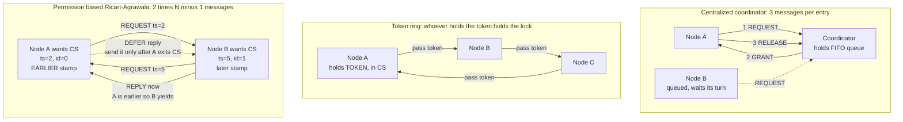

# 🔐 Distributed Mutual Exclusion

> [!abstract] TL;DR
> **Distributed mutual exclusion** is the problem of guaranteeing that **at most one** process is inside a **critical section** at a time — a mutex without shared memory or a shared clock, negotiated purely by messages. The classic algorithms trade off message count, latency, fairness, and fault tolerance: a **centralized coordinator** (3 messages, single point of failure), a **token ring** (token = the lock, starvation-free but token loss is fatal), **Ricart–Agrawala** (permission from *everyone*, Lamport-timestamp ordering, `2(N-1)` messages), and **Maekawa** (permission from an intersecting *quorum*, roughly `O(sqrt(N))` messages). All of them break when a node crashes mid-protocol, which is why *practical* distributed locks must add **leases** (auto-expiring locks) and **fencing tokens** (monotonic numbers checked at the resource) to stay correct.

---

## Intuition

**Analogy:** On **one computer**, a lock protecting a shared resource is easy because the hardware helps: every thread reads the *same* memory word and a single atomic CPU instruction (compare-and-swap) can flip "free" to "held" in one indivisible step. The OS kernel is a referee everyone can see. Now move that lock **across a network**. There is no shared memory word and no shared wall clock — so "only one at a time" has to be **negotiated purely by mail**. Picture a group of people who share a meeting room but have **no physical key**. They must agree, entirely by letters, whose turn it is to enter. Letters arrive late, out of order, or get lost in the post; a member can vanish without warning; and there is no clock on the wall everyone reads to settle "who asked first."

And here is the twist that single-machine intuition misses: a network lock **cannot simply block forever** if the holder vanishes. On one machine a crashed thread's lock dies with the process; across a network, a crashed holder's lock just... stays held, silently freezing everyone else. So the whole discipline is about agreeing on order by message passing *while tolerating lost letters and absent members* — and never trusting a lock to be released by a party that may already be dead.

---

## How It Works

### The problem, stated precisely

Coordinate **exclusive access to a shared resource** across nodes with no shared memory. A correct algorithm must satisfy three properties (the distributed analog of the single-machine mutex studied in `Operating_Systems`):

1. **Safety (mutual exclusion)** — *never* two processes in the critical section at once. A safety violation has a concrete instant where it breaks.
2. **Liveness** — every request is *eventually* granted; no **deadlock** (everyone waiting on everyone) and no **starvation** (one node waits forever while others cycle).
3. **Fairness / ordering** — requests are served in some fair, well-defined order (often the causal order of when they were made, not the order they happened to arrive).

Because there is no global clock, "who asked first" must be reconstructed *logically* — this is exactly where **Lamport timestamps** and the happens-before relation earn their keep (DST sibling *Logical_Clocks_and_Happens_Before*, to be written).

### Approach 1 — Centralized coordinator

One elected node is the **coordinator**. To enter, a node sends `REQUEST`; the coordinator either replies `GRANT` immediately (if free) or **queues** the request. On exit the node sends `RELEASE`, and the coordinator grants the head of the queue.

- **Cost:** exactly **3 messages per entry** (REQUEST, GRANT, RELEASE) — the cheapest scheme.
- **Fairness:** trivially fair via the FIFO queue.
- **Weakness:** the coordinator is a **single point of failure** and a throughput **bottleneck**. If it dies you must run **leader election** to appoint a new one and rebuild the queue (DST sibling *Leader_Election*, to be written; see the existing `Consensus_and_Raft` note for how production systems elect a coordinator safely).

### Approach 2 — Token ring

A single unique **token** circulates around a logical ring. **Holding the token = holding the lock.** A node that wants the CS keeps the token when it arrives, enters, then passes it on; a node that does not want it forwards it immediately.

- **Starvation-free:** the token visits every node in turn.
- **Efficient under high contention:** when everyone wants in, message overhead per entry is low.
- **Weaknesses:** **latency** — you may wait a full loop for the token even when nobody else wants it; and **token loss** is catastrophic (a crash while holding the token loses the lock for everyone, requiring a token-regeneration protocol to detect and mint a new one). Tree-structured variants such as **Raymond's algorithm** cut the message cost to `O(log N)` by routing requests toward the current token holder.

### Approach 3 — Permission-based: Ricart–Agrawala

The elegant classic, and the one implemented below. To enter, a node **broadcasts** a `REQUEST` stamped with its **Lamport timestamp** and node id. Every other node **REPLYs immediately** — *unless* it is itself currently requesting with an **earlier** `(timestamp, id)`, in which case it **defers** the reply until it exits its own critical section. A node enters only after it has collected replies from **all** `N-1` others.

The Lamport timestamps impose a **total order** on requests (ties broken by node id), so among any set of competing requests the one with the smallest `(ts, id)` always wins — nobody with a larger stamp can gather all replies before the smaller one is done, because the smaller-stamped node deferred its reply. This gives fairness "for free" and costs **`2(N-1)` messages per entry** (`N-1` requests out, `N-1` replies back). It builds directly on the happens-before / total-order theory.

### Approach 4 — Quorum-based: Maekawa

Instead of asking *everyone*, a node asks only a **quorum** (voting set). The quorums are constructed so that **any two of them intersect** — so two nodes can never both collect a full "yes" from their quorums, because the shared member votes for at most one at a time. This cuts messages to roughly **`O(sqrt(N))`** but reintroduces the risk of **deadlock** (cyclic waiting among partially-granted quorums), which needs extra fail/inquire/yield handling. The intersecting-quorum idea is the seed of quorum systems generally (DST sibling *Quorum_Systems*, to be written; the same intersection principle underlies read/write quorums in `Consensus_and_Quorums`).



---

## Key Concepts

### Secondary (intuition level)
- A **mutex on one computer** works because all threads share memory and hardware helps flip "free" to "held" in one step.
- **Across a network there is no shared memory and no shared clock**, so "only one at a time" must be agreed by sending messages.
- Three schemes: a **boss** grants turns (centralized), a **talking stick** circulates (token ring), or **everyone must say "go ahead"** before you enter (permission-based).
- If the current holder **disappears**, the lock must not freeze forever — so real locks **expire on their own** after a while.

### Undergraduate (mechanisms)
- **Three requirements:** safety (mutual exclusion), liveness (no deadlock/starvation), and fairness/ordering.
- **Centralized:** 3 messages, simple and fair, but single point of failure needing **leader election** to recover.
- **Token ring / Raymond's tree:** token = lock; starvation-free; must handle **token loss** and **wait latency**.
- **Ricart–Agrawala:** broadcast a **Lamport-timestamped** request; reply immediately unless you hold an *earlier* `(ts, id)`; enter after **all** reply; `2(N-1)` messages; requests served in timestamp order.
- **Maekawa:** ask an **intersecting quorum** instead of everyone; `O(sqrt(N))` messages; must guard against **deadlock**.
- **Practical locks** add a **lease** (TTL) so a dead holder's lock auto-releases.

### Graduate (theory and correctness)
- Ricart–Agrawala is a direct application of the **total order** induced by Lamport clocks — mutual exclusion falls out of the happens-before relation.
- **Fault tolerance is the fault line:** every classic algorithm assumes nodes do not crash mid-protocol. A crashed CS holder blocks everyone; a lost token or lost reply stalls progress. This is why production coordination is built on **consensus** (Raft/Paxos) rather than these bare algorithms — see `Consensus_and_Raft` (DST sibling *Raft_Consensus*, to be written).
- **Leases + fencing tokens** are what make locks safe under the true failure model. A lease is a *time-bounded* lock; a **fencing token** is a strictly increasing number the lock service hands out, which the **resource itself** checks and rejects if stale. Leases depend on bounded clock drift, connecting to physical-clock synchronization (DST sibling *Physical_Clocks_and_Synchronization*, to be written).
- **Kleppmann's argument:** a lock holder paused by GC or a network hiccup can *believe* it still holds an expired lease after another node acquired it — data corruption follows *unless* the resource enforces fencing. "Distributed locks are harder than they look."

---

## Python Demo

A pure-stdlib discrete-event simulation of **Ricart–Agrawala** over an asynchronous network with random delays. Five nodes issue concurrent requests; each node broadcasts a Lamport-timestamped `REQUEST` and enters only after `N-1` replies. The program **verifies** safety (no two nodes in the CS at once), fairness (served in `(timestamp, id)` order), and cost (`2(N-1)` messages per entry), then **visualizes** the serialized access and the timestamp ordering with matplotlib.

```python
"""
Ricart-Agrawala distributed mutual exclusion -- pure-stdlib simulation.

N nodes, no shared memory, no shared clock. To enter the critical section a
node broadcasts a Lamport-timestamped REQUEST(ts, id). Every other node REPLYs
immediately UNLESS it is itself requesting with an EARLIER (ts, id) -- in which
case it DEFERS the reply until it exits its own CS. A node enters only after it
has collected REPLYs from ALL N-1 others.

We inject concurrent requests, then VERIFY:
  * SAFETY   -- never two nodes in the CS at the same instant
  * FAIRNESS -- CS granted in (Lamport timestamp, id) order
  * COST     -- exactly 2*(N-1) messages per CS entry
and VISUALIZE the request timestamps, service order, and serialized
critical-section access with matplotlib.
"""

import heapq
import itertools
import random
import matplotlib.pyplot as plt

random.seed(11)

N           = 5
CS_DURATION = 0.6              # how long a node holds the critical section
DELAY_RANGE = (0.4, 1.6)      # random one-way network delay per message
INIT_CLOCKS = [2, 0, 3, 1, 0] # simulated prior logical activity per node


def link_delay():
    return random.uniform(*DELAY_RANGE)


# ---------------- per-node state (only local info + messages) ----------------
class Node:
    def __init__(self, nid, clock0):
        self.id           = nid
        self.clock        = clock0
        self.state        = "RELEASED"   # RELEASED | WANTED | HELD
        self.request_ts   = None         # (ts, id) stamped once at request time
        self.replies_left = 0
        self.deferred     = []           # node ids awaiting our postponed reply
        self.msg_count    = 0            # messages charged to the current entry


nodes = [Node(i, INIT_CLOCKS[i]) for i in range(N)]

# ---------------- discrete-event network simulator ----------------
seqgen = itertools.count()
events = []                              # min-heap of (time, seq, callback)

held   = set()                          # node ids currently in the CS
cs_log = []                             # one dict per CS entry


def at(t, fn):
    heapq.heappush(events, (t, next(seqgen), fn))


def send(t_now, dst, msg):
    t_deliver = t_now + link_delay()    # asynchronous: random one-way delay
    at(t_deliver, lambda: deliver(t_deliver, dst, msg))


def request_cs(t, node):
    node.state        = "WANTED"
    node.clock       += 1
    node.request_ts   = (node.clock, node.id)     # Lamport-stamp the request
    node.replies_left = N - 1
    node.msg_count    = N - 1                      # the N-1 REQUESTs we send now
    for peer in range(N):
        if peer != node.id:
            send(t, peer, ("REQUEST", node.request_ts[0], node.id))


def deliver(t, dst, msg):
    node = nodes[dst]
    if msg[0] == "REQUEST":
        _, ts, src = msg
        node.clock = max(node.clock, ts) + 1       # Lamport clock update
        i_have_priority = (node.state == "HELD") or (
            node.state == "WANTED" and node.request_ts < (ts, src))
        if i_have_priority:
            node.deferred.append(src)              # hold the reply back
        else:
            send(t, src, ("REPLY", node.id))       # grant permission now
    elif msg[0] == "REPLY":
        node.msg_count   += 1
        node.replies_left -= 1
        if node.replies_left == 0:
            enter_cs(t, node)


def enter_cs(t, node):
    assert not held, f"SAFETY VIOLATION at t={t:.2f}: {held} plus {node.id}"
    held.add(node.id)
    node.state = "HELD"
    entry = {"id": node.id, "enter": t, "ts": node.request_ts,
             "msgs": node.msg_count}
    cs_log.append(entry)
    at(t + CS_DURATION, lambda: exit_cs(t + CS_DURATION, node, entry))


def exit_cs(t, node, entry):
    held.discard(node.id)
    node.state   = "RELEASED"
    entry["exit"] = t
    for src in node.deferred:            # release everyone we made wait
        send(t, src, ("REPLY", node.id))
    node.deferred = []


# ---- inject all requests concurrently at t = 0, then run to completion ----
for nd in nodes:
    at(0.0, lambda nd=nd: request_cs(0.0, nd))

while events:
    _, _, fn = heapq.heappop(events)
    fn()

# ---- verification ----
served         = sorted(cs_log, key=lambda e: e["enter"])
order_actual   = [e["id"] for e in served]
order_expected = [e["id"] for e in sorted(cs_log, key=lambda e: e["ts"])]

no_overlap = all(served[i]["exit"] <= served[i + 1]["enter"] + 1e-9
                 for i in range(len(served) - 1))
right_cost = all(e["msgs"] == 2 * (N - 1) for e in cs_log)

print("CS service order by entry time :", order_actual)
print("Expected order by (ts, id)     :", order_expected)
print("SAFETY   no CS overlap         :", "OK" if no_overlap else "FAIL")
print("FAIRNESS timestamp order       :", "OK" if order_actual == order_expected else "FAIL")
print("COST     2*(N-1) per entry     :", "OK" if right_cost else "FAIL",
      "  ->", [e["msgs"] for e in cs_log], f"(expected {2 * (N - 1)})")

# ---- visualize ----
fig, (ax1, ax2) = plt.subplots(1, 2, figsize=(13, 5))
colors = plt.cm.tab10.colors

# Panel 1: Gantt of serialized CS access -- bars must never overlap
for e in served:
    ax1.barh(e["id"], e["exit"] - e["enter"], left=e["enter"],
             color=colors[e["id"]], edgecolor="black")
    ax1.text((e["enter"] + e["exit"]) / 2, e["id"], f"n{e['id']}\nts {e['ts'][0]}",
             ha="center", va="center", color="white", fontweight="bold", fontsize=8)
ax1.set_yticks(range(N))
ax1.set_yticklabels([f"node {i}" for i in range(N)])
ax1.set_xlabel("simulation time")
ax1.set_title("Serialized critical-section access\n"
              "bars never overlap  =>  SAFETY holds")

# Panel 2: service order vs Lamport timestamp -- must be monotone
for i, e in enumerate(served):
    ax2.bar(i, e["ts"][0], color=colors[e["id"]], edgecolor="black")
    ax2.text(i, e["ts"][0] + 0.05, f"n{e['id']}\nts {e['ts'][0]}, id {e['ts'][1]}",
             ha="center", va="bottom", fontsize=8)
ax2.set_xticks(range(len(served)))
ax2.set_xticklabels([f"{i + 1}" for i in range(len(served))])
ax2.set_xlabel("order served  ->  1st, 2nd, 3rd ...")
ax2.set_ylabel("Lamport timestamp of request")
ax2.set_ylim(0, max(e["ts"][0] for e in served) + 1)
ax2.set_title("Requests granted in (timestamp, id) order\n"
              "non-decreasing bars  =>  FAIRNESS holds")

plt.tight_layout()
plt.savefig("ricart_agrawala.png", dpi=120)
plt.show()
print("\nSaved figure -> ricart_agrawala.png")
```

**What you see:** all five nodes request at once, but the protocol serializes them perfectly. Node 1 and node 4 both stamp `ts=1`, so the tie breaks by id (1 before 4); then node 3 (`ts=2`), node 0 (`ts=3`), node 2 (`ts=4`). The left panel's non-overlapping bars prove **safety**; the right panel's non-decreasing timestamps prove **fairness**; and every entry costs exactly `2(N-1) = 8` messages — all without a single shared clock or shared memory word.

---

## Real-World Applications

- **ZooKeeper locks** — a client creates an **ephemeral sequential znode**; the lowest sequence number holds the lock; others watch the node just below them. "Ephemeral" means the lock **auto-releases** if the client's session dies — a lease in disguise. This is the canonical correct pattern.
- **etcd locks** — a **lease**-bound key plus the key's **mod-revision** used as a **fencing token**. Kubernetes leader election (the `Lease` object) is built on exactly this.
- **Redis / Redlock** — `SET key val NX PX ttl` is a lease-based lock; **Redlock** extends it across multiple independent Redis nodes. It is widely used and widely **criticized** (Kleppmann vs Antirez): without a fencing token checked at the resource, a paused client can corrupt data after its lease expires. Practical patterns are covered in `Redis_Distributed_Patterns` and `Distributed_Locks`.
- **Distributed cron / singleton jobs** — "only one worker runs the nightly billing job" is distributed mutual exclusion; the notorious anti-pattern is "just grab a lock in Redis" with no fencing.
- **Exclusive access to external resources** — a single writer to a file, device, shard migration, or leader replica — the same problem as electing a singleton, which is why locks and leader election share machinery.

---

## Common Pitfalls

- **Assuming a lock is released when the holder dies** — In these classic algorithms a crashed CS holder or a lost token/reply **freezes everyone**. Always bound locks with a **lease/TTL** so they auto-expire.
- **Trusting a lease alone (no fencing)** — A GC pause or network stall can make a holder *think* it still owns an expired lease after someone else acquired it. Without a **fencing token** validated *at the resource*, two writers proceed and corrupt data. Fencing, not the lease, is what makes it safe.
- **Confusing "slow" with "dead"** — A late reply is indistinguishable from a crashed peer. Setting timeouts too aggressively triggers false failovers and split-brain; too slow and progress stalls (see `System_and_Timing_Models`).
- **Ricart–Agrawala at scale** — `2(N-1)` messages **per entry** grows linearly with the cluster; fine for a handful of nodes, unworkable for hundreds. Reach for quorum (Maekawa) or a coordination service.
- **Maekawa deadlock** — Intersecting quorums alone do not prevent cyclic waiting among partially-granted requests; you must add the fail/inquire/yield handshake or you will deadlock under contention.
- **Rolling your own instead of using consensus** — Ad-hoc locks miss the failure edge cases. Production advice: use a **consensus-backed** coordination service (ZooKeeper, etcd) with fencing, per `Consensus_and_Raft`.

---

## Related Concepts

- [[Distributed_Systems_Overview]] — the four difficulties (no global state, unreliable network, partial failure, no shared clock) that make this problem hard in the first place.
- [[System_and_Timing_Models]] — synchronous vs asynchronous vs partial-synchrony assumptions that determine whether leases and timeouts are even meaningful.
- [[Distributed_Locks]] — the practical System-Design view: Redlock, ZooKeeper/etcd, TTLs, and fencing tokens.
- [[Consensus_and_Raft]] — how production systems elect a coordinator and back locks with consensus rather than bare algorithms.
- [[Consensus_and_Quorums]] — the intersecting-quorum principle that Maekawa's algorithm foreshadows, generalized to read/write quorums.
- [[Redis_Distributed_Patterns]] — Redis-based locking patterns and the Redlock debate in practice.
- [[Locks_Semaphores_and_Monitors]] — the single-machine mutex/semaphore this problem generalizes; the hardware-assisted baseline.
- [[Process_Synchronization_and_Race_Conditions]] — critical sections and the mutual-exclusion requirement on one machine.
- [[Deadlocks_Detection_and_Avoidance]] — the cyclic-wait hazard that reappears in quorum-based Maekawa.
- [[Locking]] — database locking, another concrete instance of coordinating exclusive access.

> DST siblings referenced in prose but not yet written: *Logical_Clocks_and_Happens_Before*, *Leader_Election*, *Quorum_Systems*, *Raft_Consensus*, *Physical_Clocks_and_Synchronization*, *The_Consensus_Problem*.

---

## Review Questions

**Secondary (understanding):**
1. On one computer a lock "just works" with help from the CPU and OS. Name two things that disappear the moment the lock must span a network, and explain why each makes "only one at a time" harder.

**Undergraduate (application):**
2. In Ricart–Agrawala, why does a node reply to an incoming request *immediately* if its own request has a **later** timestamp, but **defer** the reply if its own request is **earlier**? Trace how this rule alone guarantees that the smallest `(ts, id)` always enters first.
3. Compare centralized, token-ring, and Ricart–Agrawala on messages-per-entry, fault tolerance, and fairness. For a 4-node cluster that needs a strict fair order and has no spare node to act as coordinator, which would you pick and why?

**Graduate (analysis / trade-offs):**
4. A client holds a 30-second lease on a resource, then suffers a 40-second GC pause; during the pause another client acquires the lease and both resume writing. Explain exactly how a **fencing token** checked at the resource prevents corruption, and why the lease's TTL alone cannot.
5. Maekawa reduces messages from `2(N-1)` to `O(sqrt(N))` by using intersecting quorums, yet it can **deadlock** where Ricart–Agrawala cannot. Explain the source of the deadlock and what property of "ask everyone" made Ricart–Agrawala deadlock-free.

---

## Sources

- Ricart, G., & Agrawala, A. K. (1981). *An Optimal Algorithm for Mutual Exclusion in Computer Networks.* Communications of the ACM. [PDF](https://dl.acm.org/doi/10.1145/358527.358537)
- Maekawa, M. (1985). *A sqrt(N) Algorithm for Mutual Exclusion in Decentralized Systems.* ACM TOCS. [ACM DL](https://dl.acm.org/doi/10.1145/214438.214445)
- Lamport, L. (1978). *Time, Clocks, and the Ordering of Events in a Distributed System.* Communications of the ACM. [PDF](https://lamport.azurewebsites.net/pubs/time-clocks.pdf)
- Kleppmann, M. (2016). *How to do distributed locking.* [martin.kleppmann.com](https://martin.kleppmann.com/2016/02/08/how-to-do-distributed-locking.html)
- Tanenbaum, A. S., & van Steen, M. *Distributed Systems: Principles and Paradigms* (3rd ed.), Ch. 6 "Coordination." [distributed-systems.net](https://www.distributed-systems.net/index.php/books/ds3/)

---

#distributed-systems #mutual-exclusion #ricart-agrawala #distributed-locks #coordination
