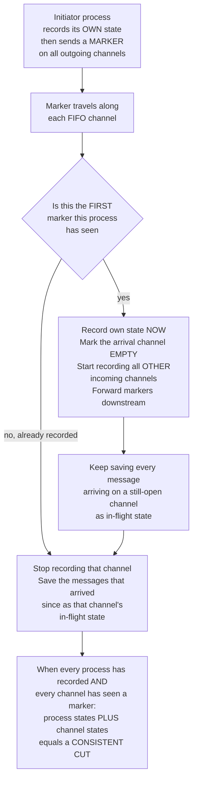

# 📸 Distributed Snapshots and Global State (Chandy-Lamport)

> [!abstract] TL;DR
> The **Chandy-Lamport algorithm** records a globally **consistent** snapshot of a distributed system — every node's local state **plus** the messages still in flight on every channel — **without any global clock**. It works by pushing a special **marker** message down every FIFO channel: each node records its own state the first time it sees a marker, then records the messages arriving on its other channels until their markers arrive. The result is a **consistent cut** — a picture of "the whole system at once" that could have been the real global state at some instant, even though **no two nodes paused at the same real moment**. This is the theoretical answer to *"what is the state of a distributed system?"* and the engine behind **checkpointing**, **deadlock/termination detection**, and **exactly-once stream processing**.

---

## Intuition

**Analogy:** You want to photograph a running water park — all the slides, all the pools, and *all the water currently mid-slide between them* — in a single coherent shot. But there is **no global shutter**: you cannot freeze every slide and pool at the exact same instant. If you just yell *"everyone, write down how much water you have RIGHT NOW"*, the tallies won't add up. A bucket of water that already left the top pool but hasn't yet splashed into the bottom pool gets counted by **nobody** — or, if timing is unlucky, gets counted **twice**. Your census of the park's water is simply *wrong*.

Chandy and Lamport's trick is to send a **colored dye marker** down every pipe. The moment a pool *first* sees dye arrive, it records its own water level, then keeps a tally of any water that keeps flowing in from its *other* pipes until the dye reaches those too — that leftover water is exactly the amount that was **in transit** at snapshot time. Because water in a pipe always arrives in the order it was sent (**FIFO**), the dye cleanly separates *"water that belongs to the snapshot"* from *"water that came after"*. Stitch together every pool's recorded level and every pipe's recorded in-transit water, and you get a total that is **exactly right** — a globally consistent census, even though each pool wrote down its number at a slightly different real time.

Translate pools into **processes**, water into **state/messages**, and pipes into **FIFO channels**, and you have the Chandy-Lamport global snapshot algorithm.

---

## How It Works

### The problem: you cannot freeze the system

You want the state of the *whole* system — all node states **and** all messages in transit — for checkpointing, debugging, or detecting a stable property. But a distributed system has **no shared clock** (see *Physical_Clocks_and_Synchronization*, a sibling note in this vault), so you cannot tell everyone to "dump your state at 12:00:00.000". Worse, at any instant there are **messages sitting in the channels** — sent but not yet received. A naive *"everyone report your local state now"* misses exactly those in-flight messages, producing an **inconsistent** picture where money vanishes or appears from nowhere.

### The key idea: a consistent cut

A **cut** is a choice, for each process, of *"the last event I include"* — a frontier drawn across every process's timeline. A cut is **consistent** if it is **closed under happens-before** (the causal ordering from *Logical_Clocks_and_Happens_Before*): if event `B` is in the cut and `A → B` (A causally precedes B), then `A` must also be in the cut. Concretely, this forbids **messages from the future** — you may never record a message *receive* without also recording its *send*. A receive-without-a-send would mean the snapshot "knows" about a message nobody sent, which no real execution could ever produce.

Consistent cuts are precisely the snapshots that **could have been the real global state at some instant**. The whole job of Chandy-Lamport is to compute a consistent cut *mechanically*, using only local actions and one extra message type.

### The marker algorithm

The algorithm assumes **reliable, FIFO channels** (messages on a channel arrive in send order, none lost or reordered).

1. **Initiation.** Any process becomes the **initiator**: it **records its own state**, then sends a **MARKER** message on **every one of its outgoing channels**, before sending any further application message.
2. **On receiving a MARKER on channel `c`:**
   - **If this is the FIRST marker the process has seen:** it **records its own state**, records channel `c`'s state as **EMPTY** (nothing was in flight ahead of the marker on `c`), starts **recording** every *other* incoming channel, and sends **MARKER on all its outgoing channels**.
   - **If it has already recorded** (seen a marker before): it **stops recording** channel `c`, and saves whatever messages arrived on `c` *since it recorded its own state* as **channel `c`'s state** — these are the **in-flight** messages.
3. **Recording channels.** Between recording its own state and receiving the marker on a given incoming channel, a process **appends every application message arriving on that channel** to that channel's recorded state. FIFO guarantees these are exactly the messages that were *sent before the sender's snapshot but received after the receiver's snapshot* — the ones on the wire at cut time.
4. **Termination.** The snapshot is complete once **every process has recorded** and **every channel has received a marker**. The collected `{process states} ∪ {channel states}` is a **consistent global snapshot**.

### Why it works

FIFO channels make the marker a clean **"before / after" divider**: any application message that a process sent *before* it recorded is ahead of that process's marker in the channel, so it either lands in the receiver's recorded local state (received before the receiver's snapshot) or is captured as recorded channel state (received after). Any message sent *after* recording is behind the marker and is correctly excluded. The captured cut is therefore consistent — no receive without its send. Lamport's subtlety: the recorded snapshot **may not equal any single real instantaneous state** (no wall-clock instant may have looked exactly like it), yet it is always a valid **reachable** state — one the system *could* have passed through — which is all a checkpoint or stable-property check needs.

### Diagram: the marker algorithm producing a consistent cut



---

## Key Concepts

### Secondary (intuition level)
- You cannot take one photo of the whole distributed system at once — there is **no global shutter** (no shared clock).
- A snapshot must count **two** things: what each node holds **and** what is currently **traveling between** nodes.
- Sending a **marker** down every pipe lets each node record itself and its incoming pipes cleanly, so the totals **add up**.

### Undergraduate (mechanism level)
- **Consistent cut:** a frontier across all processes that is **closed under happens-before** — no message received inside the cut whose send is outside it (no "messages from the future"). Consistent cuts are the snapshots that *could* have been a real instant.
- **Marker algorithm:** initiator records + floods markers; each node on its *first* marker records itself and floods markers; it records subsequent-channel messages as **channel state** until each channel's marker arrives.
- **FIFO requirement:** the marker only cleanly separates before/after if channels preserve order. Without FIFO you need extra machinery (message tagging / acknowledgements).
- **Stable properties only:** a snapshot detects properties that **stay true once true** — deadlock, termination, token loss. Transient/unstable properties can be missed because the snapshot is not a real instant.

### Graduate (theory level)
- **Reachability, not instantaneity:** the recorded state `S*` need not equal the actual state at any wall-clock instant. Formally, if `S_init` and `S_final` are the true states when the snapshot begins and ends, then `S*` is **reachable from `S_init`** and **`S_final` is reachable from `S*`** — the snapshot lies "somewhere on the way", which suffices for stable-property detection and for restart from a checkpoint.
- **Causal foundation:** the consistency condition is exactly the happens-before closure that **vector clocks** (see [[Vector_Clocks]]) make testable — a cut is consistent iff for every pair, no included receive causally depends on an excluded send.
- **Lattice of cuts:** the set of consistent cuts of an execution forms a **lattice**; Chandy-Lamport computes *one* such cut, while algorithms like *global-state observation with vector clocks* can enumerate them for predicate detection.
- **Relation to checkpointing theory:** coordinated checkpointing (Chandy-Lamport style) avoids the **domino effect** that plagues uncoordinated checkpointing, where cascading rollbacks can undo arbitrarily much progress.

---

## Python Demo

This simulation runs the **real** Chandy-Lamport marker algorithm on a 3-node **ring** that passes money around FIFO channels. **Total money is conserved (= 100)**. We deliberately arrange for a **$5 payment to be in flight** across the cut. The algorithm records each node's balance **and** the in-flight money on each channel; we then verify the recorded total equals 100 — even though the three nodes recorded at **different real times**. A **naive** snapshot (node balances only, ignoring channels) under-counts by exactly the $5 on the wire. The figure shows the **consistent cut** on a space-time diagram and the accounting side by side. Pure stdlib simulation + matplotlib.

```python
"""
Chandy-Lamport global snapshot on a 3-node ring passing money.
Total money is CONSERVED (== 100). We run the marker algorithm to record a
globally CONSISTENT snapshot -- each node's balance PLUS the money in flight
on each channel -- with NO global clock: the three nodes record at DIFFERENT
real times, yet the recorded total equals the true conserved total. A NAIVE
snapshot (sum of node balances only) UNDER-counts by exactly the in-flight
money. Pure stdlib simulation + matplotlib visualization.
"""

import matplotlib.pyplot as plt

# ---- topology: ring 0 -> 1 -> 2 -> 0, one FIFO channel per hop ----
N        = 3
SUCC     = {0: 1, 1: 2, 2: 0}            # each node's single outgoing edge
INCOMING = {0: 2, 1: 0, 2: 1}            # each node's single incoming edge
CHANNELS = [(2, 0), (0, 1), (1, 2)]      # directed FIFO channels (src, dst)

# ---- true system state (the simulation's ground truth) ----
balance = [50, 30, 20]                   # money at each node
TOTAL   = sum(balance)                   # == 100, invariant forever
channel = {c: [] for c in CHANNELS}      # FIFO queues of messages in transit

# ---- Chandy-Lamport per-node / per-channel recording state ----
recorded    = [False] * N                # has node recorded its own state
rec_balance = [None] * N                 # the recorded local balance
rec_time    = [None] * N                 # REAL time each node recorded (differs!)
chan_money  = {c: [] for c in CHANNELS}  # in-flight money recorded per channel
chan_open   = {c: False for c in CHANNELS}   # currently recording this channel
chan_done   = {c: False for c in CHANNELS}   # marker seen -> channel finalized

arrows = []   # (t_send, src, t_recv, dst, kind, amt) for the space-time plot


def send_money(src, amt, t):
    """src pushes `amt` onto its outgoing FIFO channel (money leaves src)."""
    balance[src] -= amt
    channel[(src, SUCC[src])].append(("MONEY", amt, t))


def _record_and_forward(p, t):
    """p records its OWN state, then emits a marker on its outgoing channel."""
    recorded[p]    = True
    rec_balance[p] = balance[p]
    rec_time[p]    = t
    channel[(p, SUCC[p])].append(("MARKER", None, t))   # marker on all out-edges


def initiate(p, t):
    """Initiator: record own state and start watching all incoming channels."""
    _record_and_forward(p, t)
    chan_open[(INCOMING[p], p)] = True     # begin recording its incoming channel


def deliver(c, t):
    """Pop the head of channel c (FIFO) and process it at the receiver."""
    kind, amt, t_send = channel[c].pop(0)
    dst = c[1]
    arrows.append((t_send, c[0], t, dst, kind, amt))
    if kind == "MONEY":
        balance[dst] += amt
        # record it as in-flight state iff we are still recording this channel
        if recorded[dst] and chan_open[c] and not chan_done[c]:
            chan_money[c].append(amt)
    else:  # MARKER
        if not recorded[dst]:
            _record_and_forward(dst, t)         # first marker -> record NOW
            chan_money[c] = []                  # arrival channel is EMPTY
            chan_done[c]  = True
            for cc in CHANNELS:                 # start recording OTHER in-channels
                if cc[1] == dst and cc != c and not chan_done[cc]:
                    chan_open[cc] = True
        else:                                    # later marker -> close channel
            chan_open[c] = False
            chan_done[c] = True


# ---- a deterministic interleaving (real times drive the diagram only) ----
#   The $5 that node 2 sends at t=1 is still ON THE WIRE when node 0 records
#   at t=2, so it must be captured as CHANNEL state -- that is the whole point.
schedule = [
    (0.5, lambda: send_money(0, 10, 0.5)),   # 0 -> 1 : settles BEFORE the snapshot
    (1.0, lambda: send_money(2,  5, 1.0)),   # 2 -> 0 : stays IN FLIGHT across the cut
    (1.5, lambda: deliver((0, 1), 1.5)),     # node 1 banks the $10 (pre-snapshot)
    (2.0, lambda: initiate(0, 2.0)),         # node 0 STARTS the global snapshot
    (3.0, lambda: deliver((0, 1), 3.0)),     # node 1 sees marker -> records @ t=3
    (4.0, lambda: deliver((1, 2), 4.0)),     # node 2 sees marker -> records @ t=4
    (5.0, lambda: deliver((2, 0), 5.0)),     # node 0 receives the $5 -> CHANNEL state
    (6.0, lambda: deliver((2, 0), 6.0)),     # node 0 sees marker -> channel closed
]
for _, action in schedule:
    action()

# ---- results ----
snap_nodes   = sum(rec_balance)
snap_channel = sum(sum(v) for v in chan_money.values())
snap_total   = snap_nodes + snap_channel

print("Recorded local balances :", rec_balance, " at real times", rec_time)
print("Recorded channel money  :", {c: v for c, v in chan_money.items() if v})
print(f"NAIVE  snapshot (nodes only)      = {snap_nodes}  -> WRONG (misses in-flight)")
print(f"CHANDY-LAMPORT (nodes + channels) = {snap_total}  -> matches TOTAL = {TOTAL}")
assert snap_total == TOTAL, "consistent snapshot must equal the conserved total"

# ---- visualize: space-time diagram + snapshot accounting ----
fig, (ax1, ax2) = plt.subplots(1, 2, figsize=(13, 5),
                               gridspec_kw={"width_ratios": [3, 2]})

for p in range(N):                                    # node timelines
    ax1.axhline(p, color="#cccccc", lw=1, zorder=1)
    ax1.text(-0.2, p, f"node {p}", ha="right", va="center", fontweight="bold")

for (ts, s, tr, d, kind, amt) in arrows:              # message arrows
    if kind == "MONEY":
        col, ls, lbl = "#2e7d32", "-", f"${amt}"
    else:
        col, ls, lbl = "#e67e22", "--", "marker"
    ax1.annotate("", xy=(tr, d), xytext=(ts, s),
                 arrowprops=dict(arrowstyle="-|>", color=col, ls=ls, lw=2))
    ax1.text((ts + tr) / 2, (s + d) / 2 + 0.08, lbl, color=col,
             fontsize=8, ha="center")

for p in range(N):                                    # record events = cut vertices
    ax1.scatter(rec_time[p], p, s=190, color="#c0392b", edgecolor="black", zorder=4)

ax1.plot([rec_time[p] for p in range(N)], list(range(N)),   # the consistent cut
         color="#c0392b", lw=2.2, ls=":", zorder=3, label="consistent cut")
ax1.annotate("in-flight $5\ncaptured as\nCHANNEL state",
             xy=(3.0, 1.0), xytext=(3.4, 0.35), fontsize=8, color="#2e7d32",
             arrowprops=dict(arrowstyle="->", color="#2e7d32"))
ax1.set_xlim(-0.5, 6.6)
ax1.set_ylim(-0.6, 2.6)
ax1.set_yticks([])
ax1.set_xlabel("real time -- each node records at a DIFFERENT instant")
ax1.set_title("Chandy-Lamport marker run on a token-passing ring")
ax1.legend(loc="upper left")

labels = ["True\ntotal", "Chandy-Lamport\n(nodes + channel)", "Naive\n(nodes only)"]
ax2.bar(0, TOTAL, color="#7f8c8d")
ax2.bar(1, snap_nodes, color="#0275d8", label="node states")
ax2.bar(1, snap_channel, bottom=snap_nodes, color="#2e7d32", label="channel money")
ax2.bar(2, snap_nodes, color="#0275d8")
ax2.axhline(TOTAL, color="#c0392b", ls="--", lw=1.5)
ax2.text(2, snap_nodes + 1.2, "MISSING $5", ha="center", color="#c0392b", fontsize=9)
ax2.set_xticks([0, 1, 2])
ax2.set_xticklabels(labels, fontsize=8)
ax2.set_ylabel("money counted")
ax2.set_title("Only the snapshot that counts\nchannels gets the right total")
ax2.legend(loc="lower center", fontsize=8)

plt.tight_layout()
plt.savefig("chandy_lamport_snapshot.png", dpi=120)
plt.show()
print("Saved figure -> chandy_lamport_snapshot.png")
```

**What you see:** node 0 records at real time 2, node 1 at 3, node 2 at 4 — *three different instants* — yet the recorded snapshot `{node0=40, node1=40, node2=15}` plus the recorded channel money `{2→0: $5}` sums to exactly **100**. The naive census (node balances only) reports **95**, having lost the $5 that was mid-payment on channel `2→0`. On the space-time plot, that $5 arrow starts **left of** node 2's cut point (sent before its snapshot) and ends **right of** node 0's cut point (received after its snapshot): it **crosses the cut**, which is precisely why it must be booked as channel state.

---

## Real-World Applications

- **Apache Flink — exactly-once stream processing.** Flink's fault tolerance is a direct Chandy-Lamport variant called **Asynchronous Barrier Snapshotting**: **barrier** messages (markers) are injected into the data stream; when an operator has received the barrier on all its inputs, it snapshots its state to durable storage (RocksDB → S3/HDFS). On failure, Flink restores all operators to the last complete snapshot and replays inputs since then — giving **exactly-once** semantics for streaming state and in-flight records. See [[Stream_Processing]], which documents Flink's use of Chandy-Lamport, and the [[Kafka]]-based sources it consumes.
- **Distributed checkpointing for fault recovery.** HPC jobs, distributed databases, and long-running dataflow systems periodically capture a consistent global snapshot so that after a crash they **restart from a coherent state** rather than replaying from the beginning, and without the **domino effect** of uncoordinated rollback.
- **Deadlock and termination detection.** Both are **stable properties** (once the system is deadlocked/terminated it stays that way). Take a snapshot, then check offline whether a wait-for cycle exists or whether all processes are idle with empty channels. See [[Deadlocks_Detection_and_Avoidance]] for the wait-for-graph condition being tested, and *Distributed_Mutual_Exclusion* (a sibling in this vault) for the coordination such detection often protects.
- **Distributed debugging and monitoring.** Reconstructing a coherent global state lets engineers reason about *"what did the whole system look like?"* at a logical point, rather than stitching together mismatched local logs.
- **Garbage collection / lost-token detection.** Detecting that a distributed token or reference has been lost (another stable property) is a classic snapshot application, as seen from the OS side in [[Distributed_Operating_Systems]].

---

## Common Pitfalls

- **Trusting a naive "everyone dump state now" snapshot.** Ignoring channel state loses (or, under other timings, double-counts) in-flight messages — exactly the `95 ≠ 100` bug in the demo. You **must** record channel contents, not just node states.
- **Forgetting the FIFO requirement.** The marker only cleanly separates "before" from "after" because channels preserve order. On a **non-FIFO** transport you need extra mechanism (per-message coloring/tagging or acknowledgements) or the snapshot may be inconsistent.
- **Expecting the snapshot to equal a real instant.** It generally does **not** match any wall-clock instant; it is a **reachable/consistent** state. Building logic that assumes "this is exactly what the system looked like at 12:00:00" is wrong — treat it as a valid intermediate state instead.
- **Trying to detect unstable properties.** Snapshots only reliably detect **stable** properties (deadlock, termination, token loss). A transient condition like "queue length > 100 right now" can be entirely missed because the cut is not a real instant.
- **Blocking application traffic during the snapshot.** Chandy-Lamport is designed to run **concurrently** with normal messages. Naively pausing all processing to snapshot destroys the point and hurts availability.
- **Assuming a single global order of the markers.** Markers reach different nodes at different times; correctness comes from the **per-channel** before/after rule, not from any global synchronization of when markers "fire".

---

## Related Concepts

- [[Distributed_Systems_Overview]] — the four difficulties (no global state, no shared clock, unreliable network, partial failure); snapshots directly attack "no global state".
- [[System_and_Timing_Models]] — the synchrony/FIFO assumptions that determine whether the marker algorithm applies as-is.
- [[Vector_Clocks]] — the happens-before machinery that makes the *consistency* of a cut precise and testable; snapshots and vector clocks are two faces of causal reasoning.
- [[Stream_Processing]] — Apache Flink's exactly-once checkpointing is an asynchronous-barrier (Chandy-Lamport) snapshot in production.
- [[Kafka]] — the durable, ordered log Flink typically replays from when restoring a snapshot after failure.
- [[Deadlocks_Detection_and_Avoidance]] — deadlock is a stable property detected by snapshotting and inspecting the wait-for graph.
- [[Distributed_Operating_Systems]] — the OS-layer view of global-state capture, checkpointing, and stable-property detection.
- [[CAP_Theorem]] — snapshots are a coordination tool; the same partition/failure realities that constrain CAP also constrain when a snapshot can complete.

> Vault siblings referenced in prose but not yet written: *Logical_Clocks_and_Happens_Before*, *Physical_Clocks_and_Synchronization*, *Distributed_Mutual_Exclusion*, *Reliable_and_Ordered_Broadcast*.

---

## Review Questions

**Secondary (understanding):**
1. Why can't you photograph a distributed system's global state by simply asking every node to report its local state "right now"? What does that naive census miss, and how does the demo show it as `95 ≠ 100`?

**Undergraduate (application):**
2. Walk through the marker algorithm on the demo's ring: what does node 0 do when it initiates, and why is the $5 payment on channel `2→0` recorded as *channel state* rather than as part of any node's balance?
3. The algorithm requires **FIFO** channels. Explain concretely what could go wrong with the recorded snapshot if a channel could reorder messages, and name one way to restore correctness without FIFO.

**Graduate (analysis / trade-offs):**
4. Lamport notes the recorded snapshot may correspond to **no actual instantaneous state**, yet is always a **reachable** state. Explain why "reachable" is sufficient for (a) restarting from a checkpoint and (b) detecting deadlock, but insufficient for detecting a transient property like "some queue currently exceeds 100 messages".
5. Flink injects barriers into a data stream and snapshots operator state on barrier alignment. Map each part of Flink's scheme onto Chandy-Lamport's marker algorithm (initiator, marker, first-marker recording, channel state, termination), and explain what property of the input source (e.g., Kafka) is required for the replay-on-recovery step to yield exactly-once results.

---

## Sources

- Chandy, K. M., & Lamport, L. (1985). *Distributed Snapshots: Determining Global States of Distributed Systems.* ACM TOCS. [PDF](https://lamport.azurewebsites.net/pubs/chandy.pdf)
- Lamport, L. (1978). *Time, Clocks, and the Ordering of Events in a Distributed System.* Communications of the ACM. [PDF](https://lamport.azurewebsites.net/pubs/time-clocks.pdf)
- Carbone, P., Fóra, G., Ewen, S., Haridi, S., & Tzoumas, K. (2015). *Lightweight Asynchronous Snapshots for Distributed Dataflows* (Apache Flink). arXiv:1506.08603. [PDF](https://arxiv.org/abs/1506.08603)
- Apache Flink Documentation — *Stateful Stream Processing / Checkpointing.* [nightlies.apache.org](https://nightlies.apache.org/flink/flink-docs-stable/docs/concepts/stateful-stream-processing/)
- Coulouris, G., Dollimore, J., Kindberg, T., & Blair, G. *Distributed Systems: Concepts and Design* (5th ed.), Ch. 14 "Time and Global States."

---

#distributed-systems #chandy-lamport #global-snapshot #consistent-cut #global-state
