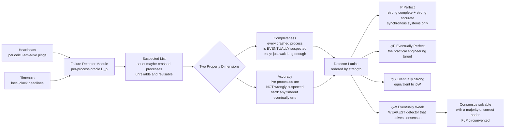

# 🩺 Failure Detectors

> [!abstract] TL;DR
> A **failure detector** (Chandra & Toueg, 1996) is a per-process oracle that outputs a set of **suspected** processes — an *unreliable* answer to "who has crashed?" It is allowed to be **wrong** (suspect a live node, or miss a dead one) and to **change its mind**. Its power is measured on two axes — **completeness** (every crashed process is *eventually* suspected) and **accuracy** (live processes are not *wrongly* suspected). The celebrated result: the **eventually-weak** detector **◇W** is the *weakest* oracle that lets an asynchronous system with a majority of correct processes **solve consensus** — the precise minimum of synchrony needed to **circumvent FLP**. In practice this abstraction is just **heartbeats plus timeouts**, and it lives inside every cluster you have ever run.

---

## Intuition

**Analogy:** You are on a video call with a colleague who suddenly goes silent. Did they **hang up** (crash), or is their **connection just lagging** (slow)? In an asynchronous world you can *never be certain* — a silent line is genuinely ambiguous. So you do what everyone does: you make an **educated guess** from a timeout ("no reply for 10 seconds — I bet they dropped"), you **act** on that guess, and you **revise** it the instant they speak again ("oh, you were there all along, sorry"). A failure detector is exactly this fallible **"who's alive?"** oracle bolted onto a process: it hands out best guesses, sometimes wrong, always willing to take them back.

The remarkable part is the theory that follows from this humble idea. Pure asynchrony makes consensus *impossible* (FLP). Yet an oracle that only *eventually* stops guessing wrong — one that is unreliable for an arbitrarily long but finite time — injects **just enough** timing information to make consensus possible again. You do not need perfect failure detection. You need a detector that is eventually right, and a majority of nodes that stay alive.

---

## How It Works

### The problem it isolates

In an asynchronous system there is **no bound** on message delay or relative process speed, so a live-but-slow node is **indistinguishable** from a crashed one. This single ambiguity is what makes fault-tolerant agreement hard, and it is exactly what the *FLP impossibility result* exploits. Failure detectors are a piece of **software engineering applied to theory**: they **encapsulate the timing assumptions** a protocol needs into one module, cleanly separating two concerns that used to be tangled together —

- **"Detect failures"** — a messy, timing-dependent, best-effort job handled by the detector.
- **"Reach agreement"** — a clean, asynchronous algorithm (Paxos-like) that consumes the detector's output as an oracle and never touches a clock itself.

This separation is the whole point. The consensus algorithm becomes *time-free* and easy to reason about; all the ugly reality of clocks, timeouts, and jitter is quarantined inside the detector. (See the vault siblings *System_and_Timing_Models* for the synchrony spectrum and *Failure_Models* for crash-stop vs Byzantine.)

### The abstraction

A failure detector is a **distributed oracle**: every process `p` has its own local detector module `D_p` that, at any time, outputs a **set of processes it currently suspects** to have crashed. Formally it is an oracle that reflects the underlying (unknown) **partial synchrony** of the system — a way to *use* timing without *assuming* a specific bound. Crucially the output is:

- **Unreliable** — `D_p` may suspect a process that is perfectly alive (a *false positive*), or fail to suspect one that has truly crashed (a *false negative*).
- **Non-monotonic** — it may add a process to the suspected set and later remove it, because a delayed heartbeat finally arrived.
- **Local and possibly inconsistent** — `D_p` and `D_q` can disagree about who is suspected at the same instant.

### The two property dimensions

Chandra and Toueg classified detectors along **two independent axes**, and every named class is a point in that grid:

**Completeness** — *does it catch the dead?*
- **Strong completeness:** *every* crashed process is eventually suspected by *every* correct process.
- **Weak completeness:** every crashed process is eventually suspected by *at least one* correct process.
- Completeness is the **easy** half: just time out eventually and you will always, in the limit, suspect a truly dead node. Silence is forever, so a long-enough wait guarantees detection.

**Accuracy** — *does it spare the living?*
- **Strong accuracy:** *no* correct process is *ever* suspected (by anyone).
- **Weak accuracy:** *some* correct process is *never* suspected.
- **Eventual accuracy (◇):** accuracy holds only *after some unknown finite time* — before that "stabilization" point the detector may slander live nodes freely.
- Accuracy is the **hard** half in an asynchronous system: *any* finite timeout will eventually be exceeded by a slow-but-live node, producing a false positive. You cannot be perfectly accurate without a real timing bound — which asynchrony denies you.

### The class lattice

Combining the two axes yields the classic hierarchy, ordered by strength:

| Class | Completeness | Accuracy | Realizable in |
|-------|--------------|----------|---------------|
| **P** — Perfect | Strong | Strong (never wrong) | **Synchronous** systems only |
| **◇P** — Eventually Perfect | Strong | Eventual strong | **Partially synchronous** — the practical target |
| **S** — Strong | Strong | Weak | Synchronous |
| **◇S** — Eventually Strong | Strong | Eventual weak | Partially synchronous |
| **W** — Weak | Weak | Weak | Synchronous |
| **◇W** — Eventually Weak | Weak | Eventual weak | Partially synchronous |

A key equivalence: **◇W and ◇S have identical power** — weak completeness can be *boosted* to strong completeness by a simple gossip transformation (if any correct process suspects a crashed one, tell everyone). So the practically interesting achievable target is **◇P / ◇S**, and the theoretically minimal one is **◇W**.

### Diagram: from heartbeats to the detector lattice



### The celebrated result: ◇W is the weakest detector for consensus

Chandra, Hadzilacos, and Toueg (1996) proved the sharp characterization every distributed-systems course quotes:

> Consensus is solvable in an asynchronous system with a **majority of correct processes** if and only if the system is equipped with an **eventually-weak failure detector ◇W**. ◇W is the **weakest** failure detector that can solve consensus.

Read that carefully — it is a two-sided statement. **Sufficiency:** give the system ◇W (plus n > 2f, a correct majority) and a Paxos-style rotating-coordinator algorithm reaches agreement. **Necessity:** *any* detector strong enough to solve consensus can be transformed into ◇W, so you cannot get away with anything weaker. This pins down, with mathematical precision, **exactly how much synchrony consensus requires**: not full synchrony, not a perfect detector — merely an oracle that is *eventually* not-completely-wrong about at least one correct node.

### How this circumvents FLP

The *FLP impossibility result* assumes **pure asynchrony**: no clocks, unbounded delays, an adversary that schedules messages to keep the protocol forever undecided. A failure detector breaks that assumption without abandoning it — it injects the **minimal eventual timing information** needed to deny the adversary its infinite stalling, while the consensus algorithm itself stays clock-free. This is provably **equivalent in power to the partial-synchrony assumption** that Paxos and Raft rely on: "there is *some* unknown time after which the network behaves well enough." Failure detectors, partial synchrony, and randomization are the three classic **escape hatches** around FLP, and the failure-detector framing is the one that most cleanly isolates *why* the escape works. FLP is not violated — it is *routed around* by weakening the model by exactly the amount ◇W represents. (See *FLP_Impossibility_Result* and *The_Consensus_Problem*.)

### From theory to a real timeout

All of the above reduces, in production, to two mechanisms:

1. **Heartbeats** — each monitored process periodically sends an "I'm alive" message every `Δ` seconds.
2. **Timeouts** — the monitor suspects a process if no heartbeat has arrived within a deadline `T`.

The entire design problem is choosing `T`, and it is a genuine tension: an **aggressive** (small) `T` detects real crashes fast but **falsely suspects** slow-but-live nodes; a **conservative** (large) `T` is accurate but **slow to react** to real crashes. The elegant fix is an **adaptive timeout** that behaves like ◇P: start aggressive, and every time you are proven wrong (a heartbeat arrives from a node you were suspecting), **back off** and grow `T`. Once `T` exceeds the true worst-case delay, false suspicions **stop forever** (eventual accuracy) while a genuinely dead node still eventually blows past even the grown deadline (completeness). The **phi-accrual** detector generalizes this: instead of a boolean it outputs a continuous **suspicion level φ** derived from the statistical distribution of recent inter-arrival times, letting each application pick its own threshold. The next section builds the adaptive ◇P detector from scratch.

---

## Key Concepts

### Secondary (intuition level)
- You **can't tell** a crashed friend from a silent one — you can only **guess** from how long they've been quiet.
- A failure detector is a little module that keeps a **list of "probably dead" nodes** and is allowed to be **wrong** and to **change its mind**.
- It runs on **heartbeats** ("I'm alive" pings) and a **timeout** ("quiet too long → suspected").
- **Too twitchy** a timeout cries wolf on slow nodes; **too patient** a timeout is slow to notice real deaths.

### Undergraduate (models and mechanisms)
- **Two axes:** *completeness* (eventually catch every dead node) and *accuracy* (don't slander the living). Completeness is easy; accuracy is the hard one under asynchrony.
- **Strong vs weak** on each axis: by *all* correct processes vs by *some*; *never* wrong vs *some* correct node never suspected.
- **Eventual (◇) variants:** the property only kicks in after an unknown finite **stabilization time** — the essence of the partially-synchronous model.
- **Named classes:** **P** (perfect, synchronous only), **◇P** (eventually perfect — the engineering target), **S / ◇S**, **W / ◇W**, arranged in a **strength lattice**.
- **Boosting:** weak completeness + gossip → strong completeness, so **◇W ≡ ◇S** in power.
- **Practical realization:** heartbeats + timeouts; the accuracy/speed tradeoff; **adaptive** and **phi-accrual** timeouts.

### Graduate (theory and limits)
- **Chandra–Toueg (1996):** the formal completeness/accuracy taxonomy and the reduction algorithms between classes.
- **Chandra–Hadzilacos–Toueg (1996):** **◇W is the weakest failure detector for consensus** — a *necessary and sufficient* characterization, given a correct majority `n > 2f`. This is a **lower bound on synchrony**, not just an algorithm.
- **FLP circumvention:** a failure detector is a way to *add* to the asynchronous model precisely the eventual-timing power that FLP's adversary needs denied — equivalent to **Dwork–Lynch–Stockmeyer partial synchrony**.
- **Reductions as the currency of the theory:** detector strength is compared by *reducibility* (can `D` emulate `D'`?), giving a partial order whose bottom (for consensus) is ◇W.
- **Beyond crash faults:** extensions include the **muteness / Byzantine failure detectors** for arbitrary faults and the **heartbeat detector HB** for quiescent reliable communication — the framework generalizes past crash-stop.

---

## Python Demo

This simulation builds an **adaptive, eventually-perfect (◇P)** heartbeat failure detector and contrasts it with a naive **fixed aggressive** one on the *same* event stream. A single monitored node sends a heartbeat every second over a network with **jitter, congestion spikes, and occasional message loss**, then **truly crashes** partway through. We run two detectors:

- **FIXED** — a constant aggressive timeout. Big gaps (a lost heartbeat, a delay spike) exceed it, so it **falsely suspects a slow-but-live node repeatedly** — an *accuracy* violation that never stops.
- **ADAPTIVE (◇P)** — same starting timeout, but it **grows the timeout after every proven-wrong suspicion**. Once the timeout clears the worst real gap, false suspicions **cease forever** (eventual accuracy) — yet it still catches the real crash, because silence is eternal and the age-since-last-heartbeat grows without bound (completeness).

We plot the **true up/down status**, both detectors' **suspicion events**, the **age since last heartbeat**, and the **adapting timeout**.

```python
"""
Adaptive eventually-perfect (◇P) heartbeat failure detector vs a fixed one.
A monitored node heartbeats every 1s over a jittery/lossy network, then CRASHES.
Shows: fixed aggressive timeout -> endless FALSE suspicions of a live node;
       adaptive timeout -> false suspicions STOP (eventual accuracy) but the
       real crash is still detected (completeness).
Pure-stdlib simulation + matplotlib visualization.
"""

import random
import matplotlib.pyplot as plt

random.seed(11)

# ---- simulation parameters ----
HB_PERIOD    = 1.0     # a live node sends a heartbeat every 1.0 s
BASE_DELAY   = 0.12    # typical one-way network delay
JITTER       = 0.18    # uniform jitter added to every delay
LOSS_PROB    = 0.12    # chance a single heartbeat is dropped by the network
SPIKE_PROB   = 0.10    # chance a heartbeat hits a transient congestion spike
CRASH_TIME   = 28.0    # the monitored node REALLY crashes here (then silence)
T_END        = 40.0    # simulation horizon
DT           = 0.02    # monitor sampling resolution

INIT_TIMEOUT = 1.25    # aggressive starting timeout (smaller than some real gaps!)
GROWTH       = 0.40    # additive safety margin added after each false suspicion

# ---- generate the heartbeat ARRIVAL stream (shared by both detectors) ----
arrivals = []
s = 0.0
while s < CRASH_TIME:
    if random.random() >= LOSS_PROB:                    # heartbeat survives the network
        delay = BASE_DELAY + random.uniform(0.0, JITTER)
        if random.random() < SPIKE_PROB:
            delay += random.uniform(0.3, 0.8)           # transient congestion spike
        arrivals.append(s + delay)
    s += HB_PERIOD
arrivals.sort()                                         # monitor sees them in real time order
# after CRASH_TIME: eternal silence -- this is the actual crash

def run_detector(adaptive):
    """Suspect the node whenever (now - last_heartbeat) > timeout.
       If adaptive, GROW the timeout every time a suspicion is proven wrong."""
    timeout      = INIT_TIMEOUT
    last_arrival = 0.0
    ai           = 0
    suspected    = False
    times, ages, timeouts, susp, false_susp = [], [], [], [], []
    now = 0.0
    while now <= T_END:
        while ai < len(arrivals) and arrivals[ai] <= now:
            if suspected:                               # heartbeat arrived while suspected
                false_susp.append(now)                  #   -> the node was ALIVE: a MISTAKE
                if adaptive:
                    timeout += GROWTH                   #   -> back off so it won't recur
            last_arrival = arrivals[ai]
            ai += 1
            suspected = False
        suspected = (now - last_arrival) > timeout
        times.append(now); ages.append(now - last_arrival)
        timeouts.append(timeout); susp.append(1 if suspected else 0)
        now += DT
    return times, ages, timeouts, susp, false_susp

fixed = run_detector(adaptive=False)
adapt = run_detector(adaptive=True)

def crash_detect_time(times, susp):
    """First time AFTER the crash that suspicion turns on and never turns off."""
    for i, tv in enumerate(times):
        if tv >= CRASH_TIME and susp[i] == 1 and all(susp[i:]):
            return tv
    return None

fd_detect = crash_detect_time(fixed[0], fixed[3])
ad_detect = crash_detect_time(adapt[0], adapt[3])
print(f"FIXED    detector: {len(fixed[4])} false suspicions; crash detected at t={fd_detect:.2f}")
print(f"ADAPTIVE detector: {len(adapt[4])} false suspicions; crash detected at t={ad_detect:.2f}")

# ---- visualize ----
fig, axes = plt.subplots(3, 1, figsize=(12, 9), sharex=True)

# row 0: ground truth
ax = axes[0]
ax.axvspan(0, CRASH_TIME, color="#dff0d8", label="node ALIVE")
ax.axvspan(CRASH_TIME, T_END, color="#f2dede", label="node CRASHED")
ax.vlines(arrivals, 0.2, 0.8, color="#5cb85c", lw=1.2)
ax.axvline(CRASH_TIME, color="#d9534f", ls="--", lw=1.5)
ax.set_yticks([]); ax.set_ylabel("ground\ntruth")
ax.set_title("Adaptive (eventually-perfect) heartbeat failure detector")
ax.legend(loc="upper right", ncol=2, fontsize=8)

def plot_detector(ax, res, title, detect_t, step_timeout):
    times, ages, timeouts, susp, false_susp = res
    smask = [bool(x) for x in susp]
    ax.fill_between(times, 0, ages, where=smask, color="#f7c6c6", label="SUSPECTED")
    ax.plot(times, ages, color="#333333", lw=1.0, label="age since last heartbeat")
    if step_timeout:
        ax.step(times, timeouts, color="#0275d8", lw=1.6, where="post",
                label="adaptive timeout")
    else:
        ax.plot(times, timeouts, color="#0275d8", lw=1.6, label="fixed timeout")
    ax.scatter(false_susp, [0.08] * len(false_susp), marker="x", color="#d9534f",
               s=70, zorder=5, label="FALSE suspicion")
    if detect_t is not None:
        ax.axvline(detect_t, color="#5cb85c", lw=1.8, label="crash DETECTED")
    ax.set_ylim(0, 4.5)
    ax.set_ylabel("seconds"); ax.set_title(title, fontsize=9)
    ax.legend(loc="upper left", fontsize=8, ncol=3)

plot_detector(axes[1], fixed,
              "FIXED aggressive timeout -> keeps FALSELY suspecting a slow-but-live "
              "node (accuracy VIOLATED forever)", fd_detect, step_timeout=False)
plot_detector(axes[2], adapt,
              "ADAPTIVE timeout grows after each mistake -> false suspicions STOP "
              "(eventual accuracy) yet the real crash is still caught (completeness)",
              ad_detect, step_timeout=True)

axes[2].set_xlabel("time in seconds")
plt.tight_layout()
plt.savefig("failure_detector.png", dpi=120)
plt.show()
print("\nSaved figure -> failure_detector.png")
```

**What you see:** the FIXED detector fires a red-X false suspicion every time a lost or spiked heartbeat pushes the gap past its flat blue timeout line — and it never stops, because the timeout never learns. The ADAPTIVE detector makes the *same* early mistakes, but each one **steps its blue timeout upward**; after a few corrections the timeout clears the worst real gap and the red X's **cease entirely** — that is **eventual accuracy (◇)** made visible. Yet after the crash at t = 28, the black "age since last heartbeat" curve climbs forever, blows past even the grown timeout, and the green "crash DETECTED" line fires — **completeness** intact. Note the price: the adaptive detector detects the real crash slightly *later* than the twitchy fixed one. That lag is the **accuracy/speed tradeoff** in one picture.

---

## Real-World Applications

Failure detection is not an exotic algorithm you invoke rarely — it is the **always-on heartbeat of every cluster**:

- **Cassandra** uses a **phi-accrual failure detector** almost verbatim from the Hayashibara paper: nodes gossip heartbeats, and each node computes a continuous suspicion level φ from the observed inter-arrival distribution, so the effective timeout **self-tunes** to each link's real latency instead of a hand-set constant.
- **Akka Cluster** and **Apache Pekko** ship the same **phi-accrual** detector for cluster membership, flagging unreachable members and driving quarantine/downing decisions.
- **ZooKeeper and etcd** implement failure detection as **session / lease expiry**: a client or follower that misses its heartbeat window loses its session (ephemeral znodes vanish; the lease lapses), which is precisely a completeness event that triggers reconfiguration ([[Consensus_and_Quorums]]).
- **Raft** folds the detector into its **election timeout**: a follower that hears no heartbeat from the leader within a randomized window *suspects* the leader and starts an election — a failure detector wired directly to [[Leader_Election]] ([[Consensus_and_Raft]]).
- **Kubernetes** exposes application-level detection through **liveness and readiness probes** plus node **heartbeats** (Lease objects); a missed probe restarts a pod, a missed node heartbeat marks the node `NotReady` and reschedules its workloads ([[Health_Monitoring]]).
- **SWIM-style gossip** (used by HashiCorp Serf/Consul and Memberlist) distributes the detection load: instead of one monitor watching everyone, members **randomly probe** each other and **disseminate** suspicions via gossip, giving scalable, infection-style failure detection.
- **Leader leases and failover** everywhere: a lease that is not renewed within its timeout is a failure-detection event that hands leadership elsewhere ([[Failover]]).

---

## Common Pitfalls

- **Confusing "not suspected" with "definitely alive."** A failure detector's output is a *guess*, not a fact. Building safety on a false negative (acting as if a node is dead when it is merely slow) is how you get **two leaders** and **split-brain**. Safety must never depend on the detector; only *liveness* (making progress) may.
- **Tuning the timeout too aggressively.** A short timeout under normal jitter produces a storm of **false failovers** — the system spends its life re-electing leaders and shuffling data instead of serving traffic. This is the single most common cause of "our cluster is flapping" incidents.
- **Tuning it too conservatively.** An over-long timeout satisfies accuracy but tanks availability: real crashes go unnoticed for tens of seconds, extending outages. The right answer is usually **adaptive/phi-accrual**, not a bigger constant.
- **Assuming symmetric, transitive reachability.** `p` may reach `q` while `q` cannot reach `p`, or `p` reaches `q` and `q` reaches `r` but `p` cannot reach `r` (a partial partition / gray failure). A naive detector produces **inconsistent suspicion sets** and can wedge the cluster; SWIM's indirect probing exists precisely to fight this.
- **Forgetting the correct-majority precondition.** ◇W solves consensus *only with n > 2f* (a majority alive). No failure detector rescues you once too many nodes are down — the detector supplies timing, not extra votes.
- **Treating GC pauses / VM stalls as network events.** A multi-second stop-the-world pause makes a healthy node look dead to every detector at once. Long pauses are a leading source of spurious suspicions; budget the timeout for them or you will falsely evict live nodes.
- **Believing a "perfect" detector P is achievable.** P requires strong accuracy — *never* wrong — which needs a real synchrony bound. In any partially-synchronous production network the best you can honestly build is **◇P**; designs that quietly assume P are unsafe.

---

## Related Concepts

- [[Distributed_Systems_Overview]] — the four core difficulties (no global clock, partial failure, unreliable network) that make failure detection necessary and hard in the first place.
- [[Consensus_and_Quorums]] — failure detectors supply the eventual-timing oracle; quorum overlap supplies the correct-majority precondition the ◇W result requires.
- [[Consensus_and_Raft]] — Raft's randomized election timeout *is* a failure detector wired to leader replacement; a concrete instance of the abstraction.
- [[Leader_Election]] — the classic client of failure detection: you elect a new leader precisely when the detector suspects the old one.
- [[Health_Monitoring]] — the operational, system-design view of the same heartbeats, probes, and health checks discussed here in theory.
- [[Failover]] — a lease/heartbeat timeout that fires is exactly the completeness event that drives failover to a standby.
- [[Circuit_Breaker]] — a *local* failure detector for a single downstream dependency: trip open on repeated timeouts, probe to close, revise the guess.
- [[Retry_Storm]] — the failure-mode of over-aggressive timeouts and suspicion: false positives cascade into retry/failover storms.
- [[Distributed_Operating_Systems]] — the OS-layer view of message passing, heartbeats, and membership from which these mechanisms descend.

> Vault siblings referenced in prose above but not yet written: *System_and_Timing_Models* (the synchrony spectrum ◇ detectors live on), *FLP_Impossibility_Result* (the impossibility these oracles circumvent), *The_Consensus_Problem* (what ◇W is the weakest detector *for*), *Failure_Models* (crash-stop vs Byzantine), *Paxos* (the ◇S-driven consensus algorithm), *Raft_Consensus*, and *Gossip_and_Epidemic_Protocols* (SWIM-style scalable detection).

---

## Review Questions

**Secondary (understanding):**
1. Your teammate says "our monitoring flagged server X as down." Using the video-call analogy, explain why that alert might be *wrong* even though the monitor did its job correctly, and what would make the alert change back.

**Undergraduate (application):**
2. Distinguish **completeness** from **accuracy**, and explain precisely *why completeness is easy but perfect accuracy is impossible* in a purely asynchronous system. Which of the two does the demo's adaptive detector guarantee only *eventually*, and how does the growing timeout achieve it?
3. In the demo, the ADAPTIVE detector detects the real crash *later* than the FIXED one. Name the general principle this illustrates and describe one production setting where you would deliberately accept the slower detection.

**Graduate (analysis / trade-offs):**
4. State the Chandra–Hadzilacos–Toueg result about **◇W** as both a *sufficiency* and a *necessity* claim, including the majority precondition. Why is calling ◇W "the weakest failure detector for consensus" a statement about the *minimum synchrony consensus needs*, not merely about one algorithm?
5. FLP proves consensus is impossible under pure asynchrony, yet a system equipped with ◇W solves it. Reconcile these: exactly what does the failure detector *add* to the model, which FLP assumption does that addition negate, and why is this provably equivalent to the partial-synchrony assumption Paxos and Raft already rely on? Does the detector *violate* FLP or *route around* it — and what is the difference?

---

## Sources

- Chandra, T. D., & Toueg, S. (1996). *Unreliable Failure Detectors for Reliable Distributed Systems.* Journal of the ACM, 43(2), 225–267. [PDF](https://www.cs.cornell.edu/home/sam/FDpapers/CT96-JACM.pdf)
- Chandra, T. D., Hadzilacos, V., & Toueg, S. (1996). *The Weakest Failure Detector for Solving Consensus.* Journal of the ACM, 43(4), 685–722. [PDF](https://www.cs.utexas.edu/~lorenzo/corsi/cs380d/papers/weakest.pdf)
- Hayashibara, N., Défago, X., Yared, R., & Katayama, T. (2004). *The φ Accrual Failure Detector.* IEEE SRDS. [PDF](https://api.semanticscholar.org/CorpusID:15206692)
- Das, A., Gupta, I., & Motivala, A. (2002). *SWIM: Scalable Weakly-consistent Infection-style Process Group Membership Protocol.* IEEE DSN. [PDF](https://www.cs.cornell.edu/projects/Quicksilver/public_pdfs/SWIM.pdf)
- Cachin, C., Guerraoui, R., & Rodrigues, L. (2011). *Introduction to Reliable and Secure Distributed Programming* (2nd ed.), Ch. 2 (failure detectors). Springer. [book site](https://www.distributedprogramming.net/)

---

#distributed-systems #failure-detectors #heartbeats #chandra-toueg #flp-circumvention
