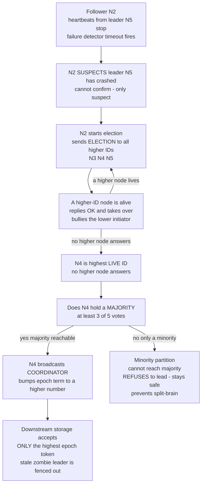

# 👑 Leader Election

> [!abstract] TL;DR
> **Leader election** is how a set of equal peer nodes agrees on a single **coordinator** to sequence operations, assign order, and drive replication — because most distributed algorithms get dramatically simpler with one node "in charge." The classic algorithms (Garcia-Molina's **Bully**, Chang-Roberts's **Ring**) pick the highest live ID, but doing it *safely* is essentially as hard as consensus: without a **majority quorum** a network partition can elect **two** leaders (**split-brain**) who accept conflicting writes, and even a correct election needs **fencing tokens** to stop a deposed "zombie" leader from doing damage.

---

## Intuition

**Analogy:** A committee of equals is hopeless at making fast decisions — everyone argues, ties never break, work stalls. Appoint **one chairperson** and suddenly it flows: the chair calls the order of speakers, breaks ties, records the minutes, and decides when a vote is final. Almost every hard group task becomes easy once *one* person is clearly in charge.

The trouble is the chairperson is not appointed by any outside authority — the equals must **elect** one *among themselves*. And they must handle the chair suddenly dropping dead mid-meeting (run a new election), all while never — under any circumstance — ending up with **two people who each believe they are the chair**, giving contradictory orders to different halves of the room. That last danger is **split-brain**, and avoiding it is the entire difficulty. In the technical domain, the "chair" sequences writes and assigns timestamps, "dropping dead" is a crash the group can only *suspect* (not confirm), and "two chairs" means two nodes accepting conflicting updates that silently corrupt your data.

---

## How It Works

### Why a leader at all

A **distinguished coordinator** collapses a swarm of symmetric peers into a simple star: the leader **sequences operations** into a single total order, **assigns timestamps / log indices**, **coordinates commits**, and **drives replication** to followers. This is why leader-based designs dominate real systems — Raft has a *strong leader* that owns all writes, Paxos usually runs through a *distinguished proposer* to avoid dueling ballots, Kafka gives each partition a single *leader replica*, and primary-backup replication funnels all writes through one *primary*. Leader election is simply **how you (re-)establish that leader** after startup or after the current one dies.

### The problem statement

Elect **exactly one** leader from the currently live nodes:

1. **Safety (uniqueness):** at most **one** leader at a time. This is the property split-brain violates.
2. **Liveness (progress):** eventually **some** leader is elected so work can proceed.
3. **Robustness:** survive the leader **crashing** (trigger re-election) and tolerate the same asynchrony and failures as any distributed protocol.

Because you can only *suspect* a crash — not confirm it — election inherits the exact impossibility constraints of consensus (see the *Failure Detectors* and *The Consensus Problem* siblings, and the FLP result discussed below).

### The Bully algorithm (Garcia-Molina, 1982)

Nodes have **unique, comparable IDs**. When a node's **failure detector** (a heartbeat timeout) suspects the leader has died:

1. The node starts an election by sending an `ELECTION` message to **all higher-ID nodes**.
2. If **no higher node replies** within a timeout, the initiator is the highest live ID: it becomes leader and broadcasts a `COORDINATOR` announcement to everyone.
3. If a higher node **does** reply `OK`, the initiator steps back and waits — the higher node "**bullies**" it by taking over and running *its own* election upward.
4. The recursion climbs until the **highest live ID** finds no one above it and announces itself.

Cost: **O(N^2)** messages worst case (every node below the leader messages every node above it).

### The Ring algorithm (Chang-Roberts, 1979)

Nodes sit in a **logical ring**. An initiator puts its ID in an `ELECTION` message and passes it clockwise. Each node forwards the message carrying the **maximum ID seen so far** (a node replaces the ID only if its own is larger). When the message circulates back to the node whose ID equals the maximum, that node knows it won and sends a `COORDINATOR` message around the ring. Cost: **O(N)** messages — cheaper than Bully, at the price of ring-topology maintenance.

### Election is (almost) consensus

Electing a *unique* leader in an asynchronous system with failures is **essentially as hard as consensus** — a "leader" is really just a **decided value** that everyone must agree on. It therefore requires the same **partial-synchrony / failure-detector** assumptions, and the **FLP impossibility** result (no deterministic consensus in a fully async system with even one crash) applies directly. This is precisely why robust election is **built into** consensus protocols rather than bolted on: Raft uses **randomized election timeouts** to break symmetry and elect a leader per **term**; Paxos elects a distinguished proposer via monotonic **ballot numbers**. "Pick the biggest ID" is the easy 10% — agreeing on it safely under partitions is the hard 90%.

### Split-brain and the quorum fix

The central danger: under a **network partition**, each side sees the other as "crashed" and may **independently elect its own leader**. Now **two** active leaders accept **conflicting writes** — split-brain, a famous class of data-corruption outage. The fix is a **majority quorum**: a node may act as leader only if it holds votes from a **majority** of the *whole* cluster. Since a cluster has **at most one** majority, the **minority partition physically cannot** elect a leader — it refuses and stays safe. This is why clusters use **odd sizes** (3, 5, 7): a 5-node cluster split 3|2 lets only the 3-side lead.

### Fencing and leases

Quorum guarantees at most one leader, but a **deposed-yet-unaware old leader** (a "zombie" that was slow, GC-paused, or partitioned) may still think it is in charge and issue a late write. Two defenses:

- **Fencing tokens** — every leadership grant carries a **monotonically increasing epoch / term number**. Downstream storage records the highest token it has seen and **rejects** any request carrying a lower one, so a stale leader's late write is fenced out (Kleppmann's fencing-token pattern).
- **Leases** — leadership is a **time-bounded** grant that must be renewed; a leader that cannot renew must **stop acting** before its lease expires, bounding the zombie window.



---

## Key Concepts

### Secondary (plain-language)
- Many group tasks get far easier once **one** member is "in charge" — a coordinator that breaks ties and sets the order.
- The peers must **elect** that leader themselves, and re-elect when the leader dies.
- The nightmare is **two** leaders at once (**split-brain**), each giving conflicting orders. Requiring a **majority vote** stops the smaller group from crowning a rival.

### Undergraduate (CS background)
- **Bully algorithm**: highest ID wins; higher nodes take over lower initiators; `O(N^2)` messages.
- **Ring algorithm**: max ID circulates the ring and returns as coordinator; `O(N)` messages.
- **Safety vs liveness**: at most one leader (safety) vs eventually a leader (liveness); a partition forces a trade-off.
- **Quorum** = strict majority; any two majorities **intersect**, so only one side of a partition can win.

### Graduate (system-level)
- Leader election **reduces to consensus**: the leader is a decided value, so **FLP** applies and pure asynchrony admits no deterministic solution — you need **partial synchrony** or an eventually-accurate failure detector (`♦S` / `Ω`, the "leader elector" oracle).
- **Epochs / terms** are logical clocks over leadership; **fencing tokens** are those epochs enforced at the resource, turning "at most one leader" into "at most one *effective* writer" even with zombies.
- **Leases** trade a bounded clock-drift assumption for a self-terminating zombie window; combined with fencing they give both liveness and safety.
- Real systems delegate election to a **consensus-backed coordination service** (ZooKeeper/Zab, etcd/Raft, Consul) rather than rolling their own — election bugs are a top source of split-brain outages.

---

## Python Demo

A pure-stdlib simulation of the **Bully** algorithm plus a **split-brain** experiment, visualized with matplotlib. Scenario A crashes the leader and verifies a re-election yields **exactly one** leader. Scenario B partitions the network and shows that **without** a quorum rule two leaders emerge (split-brain), while a **majority quorum** lets only the majority side lead.

```python
"""
Leader Election: the Bully algorithm, re-election, and how a MAJORITY
QUORUM prevents split-brain under a network partition.

Model:
  - nodes have unique comparable IDs (higher wins)
  - `alive`      : set of non-crashed node IDs
  - `reachable`  : whether two nodes can talk (models a partition)
  - a node may DECLARE itself leader only if it is the highest reachable
    live node AND (when quorum is required) it can reach a majority.
"""

import matplotlib.pyplot as plt

NODES = [1, 2, 3, 4, 5]          # unique IDs; higher ID wins the bully race
TOTAL = len(NODES)
MAJORITY = TOTAL // 2 + 1        # 3 of 5


def make_reachable(groups):
    """groups = list of sets; two nodes talk iff they share a group."""
    def reachable(a, b):
        return any(a in g and b in g for g in groups)
    return reachable


def bully(initiator, alive, reachable, use_quorum, msg_log, declared):
    """Recursive Bully election from `initiator`'s viewpoint.
    Records messages in msg_log and any self-declared leaders in `declared`.
    Returns the elected leader ID, or None if no legal leader emerges."""
    higher = [n for n in NODES
              if n > initiator and n in alive and reachable(initiator, n)]
    for h in higher:
        msg_log.append((initiator, h, "ELECTION"))

    if not higher:                       # initiator is the highest reachable-alive
        reachable_alive = [n for n in NODES
                           if n in alive and (n == initiator or reachable(initiator, n))]
        if use_quorum and len(reachable_alive) < MAJORITY:
            return None                  # minority: refuse to lead -> stays SAFE
        for n in reachable_alive:
            if n != initiator:
                msg_log.append((initiator, n, "COORDINATOR"))
        declared.add(initiator)
        return initiator

    winner = None
    for h in higher:                     # higher nodes "bully" the initiator
        msg_log.append((h, initiator, "OK"))
        res = bully(h, alive, reachable, use_quorum, msg_log, declared)
        if res is not None:
            winner = res if winner is None else max(winner, res)
    return winner


def elect(groups, alive, use_quorum):
    """Run one election per partition; union the declared leaders."""
    reachable = make_reachable(groups)
    msg_log, declared = [], set()
    for g in groups:
        live = sorted(n for n in g if n in alive)
        if live:                         # lowest live node in the group detects & starts
            bully(live[0], alive, reachable, use_quorum, msg_log, declared)
    return msg_log, declared


# ---- Scenario A: leader (ID 5) crashes -> re-election must yield ONE leader ----
alive_A = {1, 2, 3, 4}                    # node 5 has crashed
logA, declaredA = elect([set(NODES)], alive_A, use_quorum=True)
print("Scenario A  (leader 5 crashed, single network)")
print(f"  leaders declared : {sorted(declaredA)}  -> "
      f"{'OK exactly one' if len(declaredA) == 1 else 'BUG'}")

# ---- Scenario B: partition {1,2,3} | {4,5}, all alive ----
groups_B = [{1, 2, 3}, {4, 5}]
alive_B = set(NODES)
_, split = elect(groups_B, alive_B, use_quorum=False)      # no quorum rule
_, safe = elect(groups_B, alive_B, use_quorum=True)        # majority quorum
print("\nScenario B  (partition 1,2,3 | 4,5)")
print(f"  no quorum rule   : leaders {sorted(split)}  -> "
      f"{'SPLIT-BRAIN' if len(split) > 1 else 'ok'}")
print(f"  majority quorum  : leaders {sorted(safe)}  -> "
      f"{'SAFE one leader' if len(safe) == 1 else 'BUG'}")

# ============================ VISUALIZATION ============================
fig, (ax1, ax2) = plt.subplots(1, 2, figsize=(13, 5.2))

# --- ax1: Bully re-election message flow (Scenario A) ---
xpos = {n: n for n in NODES}
for n in NODES:
    dead = n not in alive_A
    ax1.scatter(xpos[n], 0, s=1400,
                color="#c0392b" if dead else "#2e8b57", zorder=3)
    ax1.text(xpos[n], 0, f"N{n}", ha="center", va="center",
             color="white", fontweight="bold", zorder=4)
    if dead:
        ax1.text(xpos[n], 0.35, "crashed", ha="center", color="#c0392b")

seen = set()
for src, dst, kind in logA:
    if (src, dst, kind) in seen:
        continue
    seen.add((src, dst, kind))
    if kind == "ELECTION":
        ax1.annotate("", xy=(xpos[dst], 0.12), xytext=(xpos[src], 0.12),
                     arrowprops=dict(arrowstyle="->", color="#e67e22", lw=1.6,
                                     connectionstyle="arc3,rad=0.3"))
    elif kind == "COORDINATOR":
        ax1.annotate("", xy=(xpos[dst], -0.12), xytext=(xpos[src], -0.12),
                     arrowprops=dict(arrowstyle="->", color="#2980b9", lw=2.0,
                                     connectionstyle="arc3,rad=-0.3"))
leader = max(declaredA)
ax1.text(xpos[leader], -0.42, f"N{leader} = new leader", ha="center",
         color="#2980b9", fontweight="bold")
ax1.plot([], [], color="#e67e22", lw=1.6, label="ELECTION (to higher IDs)")
ax1.plot([], [], color="#2980b9", lw=2.0, label="COORDINATOR (announce)")
ax1.set_title("Scenario A: Bully re-election after leader N5 crashes")
ax1.set_ylim(-0.7, 0.7)
ax1.set_xlim(0.3, 5.7)
ax1.axis("off")
ax1.legend(loc="upper center", ncol=2, fontsize=9)

# --- ax2: quorum prevents split-brain (Scenario B) ---
cats = ["No quorum rule", "Majority quorum (need 3 of 5)"]
partA = [1, 1]                 # side {1,2,3} always elects node 3
partB = [1, 0]                 # side {4,5}: elects 5 without quorum, refuses with quorum
x = range(len(cats))
ax2.bar([i - 0.2 for i in x], partA, width=0.4,
        label="Partition {1,2,3}", color="#2980b9")
ax2.bar([i + 0.2 for i in x], partB, width=0.4,
        label="Partition {4,5}", color="#8e44ad")
for i in x:
    total = partA[i] + partB[i]
    verdict = "SPLIT-BRAIN" if total > 1 else "SAFE"
    ax2.text(i, 1.15, f"{total} leader(s)\n{verdict}", ha="center",
             fontweight="bold",
             color="#c0392b" if total > 1 else "#2e8b57")
ax2.set_xticks(list(x))
ax2.set_xticklabels(cats)
ax2.set_ylabel("leaders elected in each partition")
ax2.set_ylim(0, 1.7)
ax2.set_title("Scenario B: majority quorum stops the minority side leading")
ax2.legend(loc="upper right", fontsize=9)

plt.tight_layout()
plt.savefig("leader_election.png", dpi=110)
plt.show()
```

**What it prints:**

```
Scenario A  (leader 5 crashed, single network)
  leaders declared : [4]  -> OK exactly one

Scenario B  (partition 1,2,3 | 4,5)
  no quorum rule   : leaders [3, 5]  -> SPLIT-BRAIN
  majority quorum  : leaders [3]  -> SAFE one leader
```

The takeaway: the Bully re-election deterministically crowns the highest live ID (N4) with exactly one leader. But add a partition and **naive** election produces **two** leaders (N3 and N5) — split-brain. Requiring a majority quorum (3 of 5) lets only the 3-node side lead; the 2-node minority **refuses**, preserving uniqueness.

---

## Real-World Applications

- **Apache Kafka** — a single **controller** broker (historically elected via ZooKeeper, now via **KRaft/Raft**) manages partition leadership; each partition has one **leader replica** that owns all reads/writes, with followers replicating from it. See [[Kafka]].
- **Raft-based systems (etcd, Consul, CockroachDB, TiKV)** — election is *part of* the protocol: **randomized timeouts** trigger a candidate to request votes and win a **term** only with a **majority**. See [[Consensus_and_Raft]] and the *Quorum Systems* / *The Consensus Problem* siblings.
- **ZooKeeper / Zab** — the canonical **coordination service**; apps implement leader election with **ephemeral sequential znodes** (lowest sequence number wins; the ephemeral node vanishes on session loss, triggering re-election). "Don't roll your own — use a proven coordination service."
- **HDFS NameNode HA & database primary election** — Patroni/etcd elect a PostgreSQL **primary**; failover promotes a standby but must **fence** the old primary to avoid two masters. See [[Failover]] and [[Replication]].
- **Kubernetes** — controller-manager and scheduler use **lease-based leader election** (a `Lease` object in the API) so exactly one replica is active; the rest stand by. This is the classic **distributed singleton** pattern, closely related to [[Distributed_Locks]].
- **Distributed cron / singleton jobs** — ensuring a scheduled task runs on exactly one node uses the same election-plus-fencing machinery, often via [[Service_Discovery]] and a consensus store.

---

## Common Pitfalls

- **No quorum -> split-brain.** Electing on "highest reachable ID" without a **majority** requirement lets both sides of a partition crown a leader. Always gate leadership on a majority quorum and use **odd** cluster sizes.
- **Even-sized clusters.** A 4-node cluster split 2|2 has **no** majority — *neither* side can lead (loss of availability) or, worse, a misconfigured rule lets both (split-brain). Prefer 3, 5, or 7.
- **Trusting the leader is dead.** You can only **suspect** a crash (asynchrony), so an aggressive timeout may depose a merely-slow leader, causing **election churn** and dueling leaders. Tune failure detectors and use randomized backoff.
- **Forgetting fencing.** Even with correct quorum election, a GC-paused or partitioned **old leader** wakes up believing it still leads and issues a stale write. Without **monotonic fencing tokens** enforced at the storage layer, this corrupts data.
- **Assuming election is trivial.** "Pick the biggest ID" ignores that safe election under partitions **is consensus** — subject to FLP. Rolling your own almost always hides a split-brain bug; delegate to ZooKeeper/etcd/Consul.
- **Ring topology fragility.** The Ring algorithm's `O(N)` elegance breaks if a node in the ring dies mid-election; production ring elections need failure handling to repair the ring or restart.

---

## Related Concepts

- [[Consensus_and_Raft]] — Raft folds leader election into consensus via randomized timeouts and per-term majority votes; the reference model for "election ≈ consensus."
- [[Failover]] — the operational response after a leader crash; promotion of a standby *is* a re-election and must be fenced.
- [[Replication]] — primary-backup and leader-based replication funnel all writes through the elected leader; election re-establishes the primary.
- [[Distributed_Locks]] — leadership is a distributed lock held by one node; the same quorum + fencing concerns apply (Kleppmann's fencing tokens come from the lock-service debate).
- [[CAP_Theorem]] — a partition forces the consistency-vs-availability choice that *creates* the split-brain temptation; quorum election chooses consistency (minority becomes unavailable).
- [[PACELC_Theorem]] — extends CAP with the latency cost of routing every write through one leader even without a partition.
- [[Vector_Clocks]] — logical time across nodes; fencing tokens (monotonic epochs) are a degenerate one-node logical clock enforcing "at most one effective writer."
- [[Service_Discovery]] — clients must find the *current* leader after each election; discovery/registration and election go hand in hand.
- [[Consensus_and_Quorums]] — the database-side treatment of the majority-quorum intersection property that makes split-brain impossible.
- [[Failure_Models]] — election assumes a chosen failure + detection model (crash-recovery, not Byzantine, in most coordination services).
- [[System_and_Timing_Models]] — partial synchrony is what makes election possible at all despite FLP.
- [[Distributed_Systems_Overview]] — where coordination and leadership sit in the broader map.
- [[Distributed_Operating_Systems]] — OS-level coordinator election and singleton services.

> Sibling notes in this vault — *The Consensus Problem*, *Failure Detectors*, *Quorum Systems*, *Raft Consensus*, *Paxos*, *Replication Models*, *FLP Impossibility Result*, *CAP Theorem and PACELC*, and *Physical Clocks and Synchronization* — are referenced in prose above and will be wikilinked once they exist.

---

## Review Questions

1. **(Secondary)** In plain terms, why do many distributed tasks get *easier* once one node is elected "in charge"? Give one everyday example of two people both thinking they are the boss and the confusion it causes.
2. **(Undergraduate)** Walk through a **Bully** election in a 5-node cluster `{1..5}` where node 5 (the leader) has crashed and node 2 detects it first. Which messages are sent, who becomes leader, and why is the worst-case message count `O(N^2)`? How would the **Ring** algorithm reach the same leader with only `O(N)` messages?
3. **(Graduate)** Explain why "elect the highest reachable ID" is unsafe under a network partition, and prove why requiring a **majority quorum** makes two simultaneous leaders impossible. Then argue why quorum alone is *still* insufficient against a GC-paused old leader, and how **fencing tokens** or **leases** close that gap. Finally, connect the whole problem to **FLP** and the failure-detector assumptions consensus requires.

---

## Sources

- Garcia-Molina, H. "Elections in a Distributed Computing System." *IEEE Transactions on Computers*, 1982. (The Bully algorithm.) [PDF](https://www.cs.utexas.edu/~lorenzo/corsi/cs380d/papers/Elections.pdf)
- Chang, E. and Roberts, R. "An Improved Algorithm for Decentralized Extrema-Finding in Circular Configurations of Processes." *CACM*, 1979. (The Ring algorithm.) [ACM](https://dl.acm.org/doi/10.1145/359104.359108)
- Ongaro, D. and Ousterhout, J. "In Search of an Understandable Consensus Algorithm (Raft)." *USENIX ATC*, 2014. [PDF](https://raft.github.io/raft.pdf)
- Kleppmann, M. "How to do distributed locking." 2016. (Fencing tokens; the split-brain zombie-leader argument.) [Blog](https://martin.kleppmann.com/2016/02/08/how-to-do-distributed-locking.html)
- Hunt, P. et al. "ZooKeeper: Wait-free Coordination for Internet-scale Systems." *USENIX ATC*, 2010. [PDF](https://www.usenix.org/legacy/event/atc10/tech/full_papers/Hunt.pdf)

---

#distributed-systems #leader-election #bully-algorithm #split-brain #coordination
