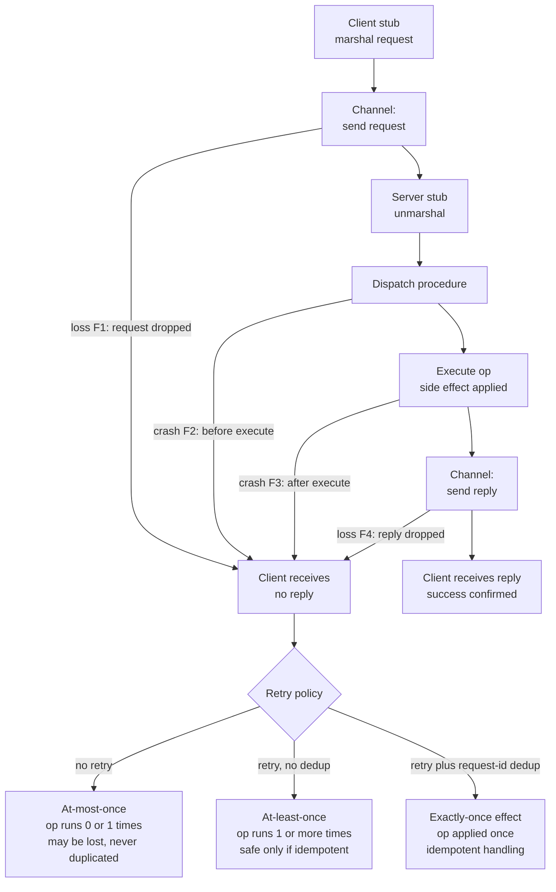

# 📨 Message Passing and RPC Semantics

> [!abstract] TL;DR
> Distributed nodes share no memory, so **message passing over unreliable channels is the only primitive they have**. **RPC** dresses a remote message exchange up as a local function call, but that transparency is a leaky abstraction: when a caller gets no reply it *cannot tell* whether the work was done. That ambiguity forces every system to pick a **delivery semantic** — at-most-once, at-least-once, or exactly-once — and the only practical route to correctness under failure is **at-least-once retries + idempotency/dedup**.

---

## Intuition

**Analogy:** You mail a signed contract to a business partner and expect a signed copy mailed back. Calling a function on another machine *looks* like handing the document across a desk — instant, guaranteed, obvious success or failure. In reality it is the postal system: your envelope can vanish, the partner can have a heart attack before or after signing, and their reply envelope can vanish. When no signed copy comes back, you are stuck with a genuinely undecidable question: **was the contract signed or not?** You literally cannot tell "my letter got lost" apart from "they signed it and *their* reply got lost."

That single ambiguity is the whole story. A local call either returns or throws; there is no third state. A remote call has a **third state — silence — and silence is unresolvable**. If you *re-send* the contract to be safe, you risk it being signed **twice** (a double charge). If you *don't* re-send, you risk it never being signed at all (a lost order). This is exactly why "exactly once" is the single hardest promise in distributed systems, and why **idempotency and retries are stapled onto every real API, queue, and database driver you will ever touch**.

---

## How It Works

### Message passing is the only primitive

In a distributed system there is **no shared address space**. A process on machine A cannot dereference a pointer that lives on machine B, cannot take a lock that machine B can see, and cannot read machine B's memory. The *only* thing it can do is **put bytes on a channel and hope they arrive**. Every higher-level idea — remote calls, locks, consensus, replication, ordered broadcast — is ultimately a protocol built out of messages. "The network is the computer": coordination *is* messaging.

Channels come with different **abstract guarantees**, and choosing the right model is half of getting a protocol correct:

- **Reliable link** — a message sent is eventually delivered (no loss), assuming both ends stay up. Usually *built* on top of an unreliable link via acks + retransmission (this is what TCP does).
- **Fair-loss link** — a message sent infinitely often is delivered infinitely often; individual messages may drop, but persistence eventually wins. This is the realistic base model on which reliable links are constructed.
- **Lossy / arbitrary link** — messages may be dropped, duplicated, or reordered with no fairness guarantee.
- **Ordering:** **FIFO** (per-link order preserved) vs **unordered** (any permutation). Note UDP gives you unordered, possibly-duplicated datagrams; TCP gives you a reliable FIFO byte stream *per connection* — but says nothing across connections.
- **Topology:** **point-to-point** (one sender, one receiver) vs **broadcast/multicast** (one-to-many). Reliable and *ordered broadcast* are strictly stronger abstractions layered on top of point-to-point messaging.

### RPC: making a message exchange look like a function call

**Remote Procedure Call** (Birrell & Nelson, 1984) hides the messaging behind a familiar syntax. The generated **stubs** do the plumbing:

1. **Client stub** — the caller invokes `balance = account.deposit(10)` as if local. The stub **marshals** (serializes) the method identifier + arguments into a byte buffer.
2. **Transport** — bytes travel over the channel (TCP/HTTP2/QUIC) to the server.
3. **Server stub (skeleton)** — receives bytes, **unmarshals** them back into arguments, and **dispatches** to the real procedure.
4. **Execute** — the server runs the actual code, producing a result **and any side effects** (this is the dangerous step — side effects are not undoable by the network).
5. **Reply** — the result is marshalled, sent back, unmarshalled by the client stub, and returned as if the local call simply completed.

The design *goal* is **location transparency**: the caller shouldn't care where the code runs. Frameworks that implement this include **gRPC** (Protobuf over HTTP/2), **Apache Thrift**, and historically **Sun RPC**, **CORBA**, and **Java RMI**. See the vault's [[RPC]] and [[gRPC]] notes for the framework mechanics.

### Why transparency is a leaky abstraction

The seminal critique — Waldo et al., *"A Note on Distributed Computing"* (1994) — argues you **cannot** paper over the gap between local and remote. Four differences leak through no matter how pretty the stub:

- **Partial failure** — a local call cannot fail "halfway"; the whole process lives or dies together. A remote call can fail *independently* of caller and callee (network dies, or one side crashes while the other lives). There is no unified fate.
- **Latency** — a remote call is 10³–10⁶× slower. Code written assuming cheap calls (loops of tiny RPCs) becomes catastrophically chatty over a network. See [[Chatty_IO]].
- **No shared memory** — pointers, references, and mutable object graphs don't transfer. You copy values; aliasing semantics silently change.
- **Concurrency** — remote endpoints are hit by many callers at once with no shared lock; local-style reasoning about exclusive access breaks.

### The core theory: delivery / invocation semantics

Here is the crux. A client sends a request and **gets no reply**. Four mutually indistinguishable things could have happened:

1. the **request was lost** (server never saw it → op ran 0 times);
2. the **server crashed before executing** (op ran 0 times);
3. the **server executed, then crashed** before replying (op ran 1 time);
4. the **reply was lost** in transit (op ran 1 time).

From the client's seat, cases 1–2 (safe to retry) look *identical* to cases 3–4 (retry double-applies). This is undecidable at the network layer. So systems pick one of three achievable **invocation semantics**:

| Semantic | Retry policy | Times op runs | Safe when |
|----------|-------------|---------------|-----------|
| **At-most-once** | never retry | 0 or 1 | losing the op is acceptable; or op is non-idempotent and duplicates are worse than loss |
| **At-least-once** | retry until acked | 1 or more | the op is **idempotent** |
| **Exactly-once (effect)** | retry + dedup | applied once | you add unique request IDs + a server-side dedup/response cache, often backed by a transaction/log |

The punchline every practitioner memorizes: **"exactly-once *delivery* is impossible, but exactly-once *processing/effect* is achievable."** You cannot guarantee the wire delivers a message precisely once — but you *can* make the *observable effect* happen once by having the receiver **deduplicate** retries via a stable request ID.



The diagram shows the key truth: **all four failure edges collapse into the same client observation** — "no reply." The retry policy alone decides which semantic you get, and only the dedup path is safe for a non-idempotent operation.

### Idempotency: the practical escape hatch

An operation is **idempotent** if applying it many times is indistinguishable from applying it once — `set x = 5` (idempotent) versus `x += 1` (not). Because at-least-once retries are the only cheap way to survive loss, **the dominant reliable pattern is: make the operation idempotent, then retry freely.** You achieve idempotency by:

- attaching a **unique request/idempotency ID** and having the server keep a **dedup table / response cache** (return the cached reply on a repeat);
- using **conditional writes** (`INSERT ... ON CONFLICT`, compare-and-set, `PUT` with an ETag) instead of blind mutations;
- modeling state as a value to *set* rather than a delta to *add*.

This is the same instinct behind [[Idempotent_Operations]] and, in a fancier form, behind convergent replicated data types where merges are commutative and idempotent by construction.

### Ordering and flow control are layered on top

Raw message passing gives you neither order nor safety valves:

- **Ordering** — FIFO (per-link), **causal**, or **total** order are all *stronger abstractions* built above point-to-point messaging. Causal delivery relies on happens-before tracking (logical clocks); total order underpins reliable/atomic broadcast and state-machine replication.
- **Flow control / backpressure** — an unbounded receive queue is a memory bomb; a fast sender will OOM a slow receiver. **Backpressure** (see [[Back_Pressure]]) propagates "slow down" upstream. Durable, async message passing — **Kafka**, **RabbitMQ** — turns the channel itself into a persistent buffer/log, which is what makes replayable at-least-once (and Kafka's exactly-once) delivery possible.

---

## Key Concepts

### 🟢 Secondary (explain to a junior dev)
- **Message passing** is the *only* way two machines talk — they mail bytes to each other; nothing is shared.
- **RPC** makes calling a remote server *look* like calling a local function, but it's a polite lie: the call can be slow or fail on its own.
- If you send a request and hear nothing back, **you can't tell if it worked**. Retrying might do it twice.
- An **idempotent** operation is safe to repeat (`set balance = 100`); a non-idempotent one is not (`add 100 to balance`).

### 🟡 Undergraduate (needs CS background)
- **Channel models:** reliable vs fair-loss vs lossy; FIFO vs unordered; point-to-point vs broadcast. Reliable+ordered channels are *constructions* over unreliable ones (acks, sequence numbers, retransmission — i.e., TCP).
- **Stubs / marshalling:** client stub serializes args → transport → server stub deserializes → dispatch → reply. Location transparency is the goal.
- **The three semantics:** at-most-once (no retry, may lose), at-least-once (retry, may duplicate — needs idempotency), exactly-once-effect (retry + dedup by request ID).
- **Why exactly-once delivery is impossible:** the client cannot distinguish "request lost" from "reply lost," so it must either risk loss or risk duplication; only *receiver-side dedup* recovers a once-effect.

### 🔴 Graduate (system-level thinking)
- **The Two Generals / FLP shadow:** you cannot achieve common knowledge over a lossy channel with a bounded number of messages, which is precisely why exactly-once *delivery* is unattainable and why acknowledgement protocols only ever give *eventual* certainty.
- **Exactly-once effect as a distributed transaction:** dedup table + side effect must commit **atomically** (otherwise you dedup but lose the effect, or apply the effect but forget the dedup record). This ties directly to atomic commitment / write-ahead logging; Kafka's exactly-once = idempotent producer (sequence numbers per partition) + transactional atomic writes across the offset log and output topic.
- **Interaction with ordering & timing models:** at-least-once + reordering means the receiver must be idempotent *and* commutative, or must enforce order (FIFO/causal/total) — which itself needs happens-before tracking and, for total order, consensus. The achievable semantics depend on the synchrony assumptions of the underlying timing model.
- **End-to-end argument:** reliable delivery is best enforced at the application endpoints (idempotency keys, dedup), not solely in the network, because only the endpoint knows what "the same operation" means.

---

## Python Demo

Pure-stdlib simulation of a lossy request/reply channel, comparing the three delivery semantics on a **non-idempotent** operation (`balance += 1`). We count how many times the side effect is *actually applied* versus intended, exposing duplicate applications, then visualize with matplotlib.

```python
# Simulate RPC delivery semantics under message loss + crashes.
# One logical operation = "increment balance by 1" (NON-idempotent).
# Ideal final balance with N ops and a perfect network = N.
#   at_most_once : no retries        -> balance <= N (ops silently lost)
#   at_least_once: retry, no dedup   -> balance >  N (reply-loss => re-apply => DOUBLE COUNT)
#   exactly_once : retry + dedup     -> balance ~= N (request-id dedup => applied once)
import random
import matplotlib.pyplot as plt

LOSS = 0.30        # probability a single message (request OR reply) is dropped
CRASH = 0.03       # probability server crashes mid-op (after applying, before reply)
N_OPS = 300        # logical operations the client wants to perform, each +1
MAX_RETRIES = 6    # extra attempts when retrying
SEED = 7


class Server:
    """Applies a non-idempotent side effect. Optional request-id dedup cache."""
    def __init__(self, use_dedup):
        self.balance = 0
        self.use_dedup = use_dedup
        self.dedup = {}            # request_id -> cached reply (the exactly-once trick)
        self.apply_count = 0       # how many times the side effect ACTUALLY ran
        self.applied_ids = set()   # distinct ops that ran at least once (for measurement)

    def handle(self, req_id, amount):
        # Dedup: a repeat of an already-processed request returns the cached
        # reply WITHOUT re-applying the side effect -> exactly-once effect.
        if self.use_dedup and req_id in self.dedup:
            return self.dedup[req_id]
        self.balance += amount           # <-- the non-idempotent effect
        self.apply_count += 1
        self.applied_ids.add(req_id)
        reply = self.balance
        if self.use_dedup:
            self.dedup[req_id] = reply
        return reply


def delivered(rng):
    """True if a message survives the lossy channel."""
    return rng.random() >= LOSS


def run(mode):
    rng = random.Random(SEED)
    use_dedup = (mode == "exactly_once")
    do_retry = (mode != "at_most_once")
    srv = Server(use_dedup=use_dedup)
    acked = 0

    for i in range(N_OPS):
        req_id = i                       # STABLE id -> reused on every retry (enables dedup)
        attempts = 1 + (MAX_RETRIES if do_retry else 0)
        for _ in range(attempts):
            if not delivered(rng):
                continue                 # F1: request lost -> no effect, retry (if allowed)
            reply = srv.handle(req_id, 1)  # server executes here (effect applied)
            if rng.random() < CRASH:
                continue                 # F3: crash after execute, before reply -> retry
            if delivered(rng):
                acked += 1               # client saw the reply -> stop retrying
                break
            # F4: reply lost -> op DID run, but client thinks it failed -> retry
    duplicates = srv.apply_count - len(srv.applied_ids)
    return {"balance": srv.balance, "applied": srv.apply_count,
            "distinct": len(srv.applied_ids), "acked": acked, "duplicates": duplicates}


modes = ["at_most_once", "at_least_once", "exactly_once"]
results = {m: run(m) for m in modes}

print(f"{'mode':<16}{'balance':>9}{'applied':>9}{'distinct':>9}{'acked':>7}{'dupes':>7}")
for m in modes:
    r = results[m]
    print(f"{m:<16}{r['balance']:>9}{r['applied']:>9}{r['distinct']:>9}{r['acked']:>7}{r['duplicates']:>7}")

# ---- Visualization ----
labels = ["at-most-once\n(no retry)", "at-least-once\n(retry, no dedup)", "exactly-once\n(retry + dedup)"]
colors = ["#e07a5f", "#f2cc8f", "#81b29a"]
balances = [results[m]["balance"] for m in modes]
dupes = [results[m]["duplicates"] for m in modes]

fig, (ax1, ax2) = plt.subplots(1, 2, figsize=(12, 5))

bars = ax1.bar(labels, balances, color=colors, edgecolor="black")
ax1.axhline(N_OPS, ls="--", color="black", lw=1.3, label=f"correct balance = {N_OPS}")
ax1.set_title("Final server balance vs. intended")
ax1.set_ylabel("balance (each op intends +1)")
ax1.legend()
for b, v in zip(bars, balances):
    ax1.text(b.get_x() + b.get_width()/2, v + 3, str(v), ha="center", fontweight="bold")

bars2 = ax2.bar(labels, dupes, color=colors, edgecolor="black")
ax2.set_title("Duplicate side-effect applications")
ax2.set_ylabel("times the op was applied MORE than once")
for b, v in zip(bars2, dupes):
    ax2.text(b.get_x() + b.get_width()/2, v + 0.3, str(v), ha="center", fontweight="bold")

fig.suptitle("RPC delivery semantics under 30% message loss (non-idempotent op)", fontweight="bold")
plt.tight_layout()
plt.savefig("rpc_delivery_semantics.png", dpi=120)
plt.show()
```

**Expected shape of the output.** `at_most_once` under-counts (balance well below 300 — ops silently vanished) with **zero** duplicates. `at_least_once` over-counts (balance far above 300) with **many** duplicate applications — every lost *reply* triggered a retry that re-ran `balance += 1`; this is the classic **double-charge bug**. `exactly_once` lands at (or just under) 300 with **zero** duplicates: the stable `req_id` lets the server recognize a retry and return the cached reply instead of re-applying. Same lossy network, same retries — the *only* difference that makes it correct is the receiver-side dedup table.

---

## Real-World Applications

- **Stripe / payment APIs** — every mutating call takes an `Idempotency-Key` header. The server stores the key with the first response; a retried charge returns the *same* result instead of charging twice. Textbook exactly-once *effect* over an at-least-once transport.
- **gRPC / Thrift microservice meshes** — default RPC retries are safe only for methods declared idempotent; service meshes (Envoy/Istio) let you configure retry policy *per method* precisely because at-least-once is unsafe otherwise. See [[Microservices]] and [[gRPC]].
- **Kafka exactly-once** — the idempotent producer tags records with a producer ID + monotonic sequence number per partition so the broker drops duplicate appends, and transactions commit the output write and consumer offset atomically. This is exactly-once *processing*, not magic delivery. See the vault's [[Kafka]] note.
- **RabbitMQ / SQS / message queues** — publish/consume acks give at-least-once by default; consumers must dedup (idempotency keys, a processed-message table) to be correct. See [[Message_Queues]] and [[RabbitMQ]].
- **TCP itself** — the everyday reliable link is *built* from an unreliable one: sequence numbers + cumulative acks + retransmission turn a fair-loss IP substrate into a reliable FIFO byte stream. See [[TCP_Protocol]] / [[UDP_Protocol]] and [[Transport_Layer]].
- **Database drivers & HTTP clients** — retry-on-timeout is ubiquitous, which is exactly why `POST` (non-idempotent) is treated differently from `PUT`/`GET` (idempotent) and why "safe retry" requires idempotency keys.

---

## Common Pitfalls

- **Assuming RPC is a local call** — writing tight loops of remote calls, ignoring partial failure, treating a timeout as "it failed" when it may well have *succeeded*. The whole "Note on Distributed Computing" critique in one bug class.
- **Blind retries on a non-idempotent op** — the #1 cause of double charges, duplicate emails, and doubled inventory decrements. At-least-once *without* idempotency is a data-corruption engine.
- **Confusing exactly-once delivery with exactly-once effect** — chasing an impossible network guarantee instead of implementing receiver-side dedup + idempotency. The wire can never promise once; the *application* can.
- **Non-atomic dedup** — recording the idempotency key and applying the side effect in *separate* steps. If you crash between them you either lose the effect or forget the dedup record and reapply. The dedup write and the effect must commit in one transaction.
- **Unbounded receive queues** — no backpressure means a fast sender OOMs a slow receiver; the "reliable" system falls over under load precisely when you need it. See [[Back_Pressure]].
- **Retry storms / thundering herd** — synchronized retries after a blip amplify load and take the service down. Needs jittered exponential backoff + circuit breakers. See [[Retry_Storm]] and [[Circuit_Breaker]].
- **Assuming FIFO or no-duplication from the channel** — UDP reorders and duplicates; even TCP only orders *within one connection*. Cross-connection or cross-partition order must be enforced explicitly.

---

## Related Concepts

- [[RPC]] — the framework mechanics (stubs, marshalling, request/response) this note analyzes for failure semantics.
- [[gRPC]] — concrete modern RPC (Protobuf + HTTP/2) where per-method retry/idempotency config matters.
- [[Idempotent_Operations]] — the practical property that makes at-least-once retries safe; the escape hatch from the delivery-semantics trap.
- [[Message_Queues]] — durable, async message passing; the at-least-once + dedup pattern in queue form.
- [[Kafka]] — real exactly-once *processing* via idempotent producers + transactions.
- [[RabbitMQ]] — broker acks giving at-least-once; consumer-side dedup required.
- [[Back_Pressure]] — flow control that keeps unbounded channels from becoming memory bombs.
- [[Retry_Storm]] — what goes wrong when at-least-once retries are naive and synchronized.
- [[Circuit_Breaker]] — the guard that stops retries from hammering a failing dependency.
- [[Microservices]] — the architecture where every internal call is an RPC subject to these semantics.
- [[TCP_Protocol]] / [[UDP_Protocol]] / [[Transport_Layer]] — the concrete channel models (reliable FIFO vs unordered/lossy) discussed abstractly here.

> **Planned sibling notes (this vault is new; referenced in prose above until they exist):** *Distributed Systems Overview*, *System and Timing Models*, *Reliable and Ordered Broadcast*, *Logical Clocks and Happens-Before*, *Atomic Commitment*, and *Failure Detectors*. Wire these as `[[wikilinks]]` once created.

---

## Review Questions

1. **(Secondary)** Your client sends a "charge $10" request and receives no response. List the four different things that could have happened on the server side, and explain why the client cannot distinguish between them. Which two are safe to retry and which two are not?

2. **(Undergraduate)** A payment endpoint currently does `balance += amount`. The client library retries on timeout. Under at-least-once delivery, describe the exact sequence of events that causes a customer to be charged twice, then redesign the endpoint so retries are safe. What data structure does the server need and what must be atomic?

3. **(Graduate)** People say "exactly-once delivery is impossible but exactly-once processing is achievable." Justify the impossibility (relate it to the Two Generals problem / common knowledge over a lossy channel), then explain precisely what additional machinery — beyond the network — turns at-least-once delivery into an exactly-once *effect*. Why must the deduplication record and the side effect commit in a single atomic transaction, and how does Kafka implement this for a producer writing to an output topic while advancing a consumer offset?

---

## Sources

- Birrell, A. D., & Nelson, B. J. (1984). *Implementing Remote Procedure Calls.* ACM TOCS 2(1). https://dl.acm.org/doi/10.1145/2080.357392
- Waldo, J., Wyant, G., Wollrath, A., & Kendall, S. (1994). *A Note on Distributed Computing.* Sun Microsystems Labs TR-94-29. https://scholar.harvard.edu/waldo/publications/note-distributed-computing
- Tanenbaum, A. S., & van Steen, M. *Distributed Systems* (3rd ed.), Ch. 4 "Communication" (RPC, message-oriented communication). https://www.distributed-systems.net/
- Kleppmann, M. (2017). *Designing Data-Intensive Applications*, Ch. 8 "The Trouble with Distributed Systems" & Ch. 9 (unreliable networks, exactly-once semantics). O'Reilly. https://dataintensive.net/
- Confluent. *Exactly-Once Semantics in Apache Kafka* (idempotent producers + transactions). https://www.confluent.io/blog/exactly-once-semantics-are-possible-heres-how-apache-kafka-does-it/

---

#distributed-systems #rpc #message-passing #delivery-semantics #idempotency
