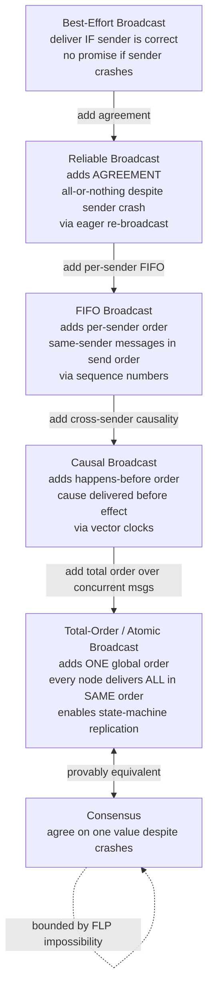

# 📡 Reliable and Ordered Broadcast

> [!abstract] TL;DR
> **Broadcast abstractions** are the group-communication primitives that sit between raw, unreliable message passing and full consensus. They form a **ladder of escalating delivery guarantees** — *best-effort* → *reliable* (all-or-nothing despite the sender crashing) → *FIFO* (per-sender order) → *causal* (cause before effect) → **total-order / atomic** (every correct node delivers **all** messages in the **same** order). The top rung is the whole game: **total-order broadcast is provably equivalent to consensus**, and it is exactly the primitive that makes **state-machine replication** work — feed every replica the identical ordered log of commands and they stay identical forever. Because it equals consensus, it inherits consensus's limits: impossible in pure asynchrony with one crash (FLP), and every real implementation (Paxos, Raft, Zab) is a replicated log in disguise.

---

## Intuition

**Analogy:** Imagine you must **tell news to a group of friends**. "Just tell everyone" sounds trivial, but under real conditions it is treacherous. What if you **collapse halfway through the phone tree** — you told Ana and Ben but died before reaching Cara and Dan? Now half the group knows and half doesn't, and they will act on incompatible pictures of the world. Fixing *that* is **reliable broadcast**: an "all-or-nothing" promise that if *any* friend who stays healthy hears the news, then *every* healthy friend eventually hears it — even if you drop dead mid-call, because the friends who heard it **re-tell it** to cover for you.

But there is a second, sneakier failure. Suppose everyone *does* hear everything, yet in **different orders**. You text "the party is CANCELLED" and, a beat later, "just kidding, party is ON." If Ana receives them in order she shows up; if the messages cross in the mail and Dan reads "party is ON" then "CANCELLED," Dan stays home. Same messages, **divergent conclusions**, purely because of **order**. Making everyone process the news in the **exact same sequence** is **total-order (atomic) broadcast** — and it is the single trick that keeps replicated copies of anything (a database, a ledger, a chat log) byte-for-byte identical.

Translate friends into servers and phone calls into network packets and you have the entire subject: broadcast abstractions specify *precisely* what "tell everyone" is allowed to mean when senders crash and the network reorders.

---

## How It Works

A naive "send to all peers in a loop" is called **best-effort broadcast**, and it is broken in two independent ways. First, **atomicity under sender failure**: if the sender crashes partway through its send loop, the message reaches an *arbitrary subset* of nodes — some replicas apply an update that others never see, and they diverge permanently. Second, **order**: even with zero loss, an asynchronous network **reorders** messages, so different receivers apply the same set of updates in different sequences and — for any operation where order matters — end up in different states.

Broadcast abstractions fix these by attaching **formal delivery properties** to two distinct verbs: **`broadcast(m)`** (what the application requests) and **`deliver(m)`** (when the middleware is *allowed* to hand `m` up to the application). The gap between "a message arrived on the wire" and "the message was delivered" is where all the buffering and reordering logic lives. Each rung on the ladder adds one property to `deliver`.

### The ladder of broadcast abstractions

1. **Best-effort broadcast.** *Validity* only: if a **correct** sender broadcasts `m`, every correct process eventually delivers `m`. If the sender crashes mid-broadcast, **no promise** — an arbitrary subset delivers. This is `for peer in peers: send(peer, m)`. The weakest rung.

2. **Reliable broadcast.** Adds the crucial **agreement** property: *if **any** correct process delivers `m`, then **all** correct processes deliver `m`* — "all-or-nothing" that survives the sender crashing. Plus *no duplication* and *no creation* (only genuinely broadcast messages are delivered). The classic implementation is **eager reliable broadcast**: on first receiving `m`, a node **re-broadcasts** `m` to everyone *before* delivering it. Now the message's survival no longer depends on the original sender — once one correct node has it, it floods to all. **Uniform reliable broadcast** strengthens agreement to cover *faulty* processes too: if *any* process (even one about to crash) delivers `m`, all correct processes must deliver it — important when a soon-to-die node's delivery has externally visible side effects. (See the vault's *Failure_Models* for crash-stop vs crash-recovery, which decides how strong you can make this.)

3. **FIFO broadcast.** Adds **per-sender ordering**: messages from the *same* sender are delivered in the order that sender broadcast them. Implemented with **per-sender sequence numbers** — each node buffers messages from sender *s* until it has delivered all lower sequence numbers from *s*. FIFO says nothing about messages from *different* senders.

4. **Causal broadcast.** Adds **causal (happens-before) ordering**: if `broadcast(m1)` → `broadcast(m2)` (m1 causally precedes m2, possibly via a chain crossing *different* senders), then every correct process delivers `m1` **before** `m2`. This is FIFO plus cross-sender causality. It is implemented with **vector clocks**: each message carries the sender's vector timestamp, and a receiver **holds a message in a buffer until every message it causally depends on has been delivered**. Causal broadcast is the communication-layer twin of *causal consistency* (see *Logical_Clocks_and_Happens_Before* and *Vector_Clocks_and_Causality*). Crucially, causal broadcast still imposes **no order between concurrent messages** — and that gap is exactly what the next rung closes.

5. **Total-order (atomic) broadcast.** The strongest common rung. Adds **total ordering**: all correct processes deliver **all** messages in the **one same sequence** (on top of reliable delivery). Even *concurrent* messages get a single agreed order. This is precisely what **state-machine replication** needs: if every replica starts identical and applies the *identical ordered stream* of commands, every replica ends identical — deterministically. Total order can be built with a **sequencer** (a leader stamps every message with a global sequence number and everyone delivers in that order), or by running a consensus instance per log slot.

### The fundamental equivalence: total-order broadcast ⟺ consensus

The deepest fact in this note: **total-order broadcast and consensus are equivalent** — you can build either from the other. Given consensus, agree on "message for slot *i*" one slot at a time to get a total order. Given total-order broadcast, run one round: everyone broadcasts its proposal and decides on the *first* delivered message; identical delivery order means everyone decides the same value. Therefore total-order broadcast is **as hard as consensus**: it is **impossible** in a purely asynchronous system where even one process may crash (**FLP impossibility**), and every real implementation escapes FLP with the same tricks — **partial synchrony**, a **leader/failure detector**, or randomization. **Paxos, Raft, and ZooKeeper's Zab are total-order broadcast engines**: their entire job is to give every node the same **replicated log** in the same order. (See the vault siblings *The_Consensus_Problem*, *FLP_Impossibility_Result*, *Paxos*, *Raft_Consensus*.)

### The order × reliability matrix

The classic taxonomy of group communication is a 2-D grid: **reliability level** `{best-effort, reliable, uniform}` × **ordering level** `{none, FIFO, causal, total}`. Any cell is a valid abstraction — e.g. "reliable FIFO," "uniform total-order." Ordering and reliability are **independent axes**: FIFO/causal/total order say *what sequence*, while best-effort/reliable/uniform say *who is guaranteed to receive*. Real systems pick a cell to match their needs.



---

## Key Concepts

### Secondary (intuition level)
- "Tell everyone" is easy when nothing fails — but under crashes and a shuffling network it splits into two hard problems: **who hears it** and **in what order**.
- **Reliable broadcast** = *all-or-nothing*: if one healthy node gets the message, they all do, even if the sender dies mid-send (survivors re-tell it).
- **Total-order broadcast** = *everyone in the same order*: the trick that keeps copies of data identical.

### Undergraduate (mechanisms)
- **Two verbs:** `broadcast(m)` is the request; `deliver(m)` is when the middleware is *allowed* to hand it up. Buffering lives in the gap between "arrived" and "delivered."
- **Best-effort** (validity only) → **reliable** (agreement, via eager re-broadcast) → **FIFO** (per-sender sequence numbers) → **causal** (vector clocks, buffer until causal predecessors delivered) → **total-order** (a single agreed sequence, e.g. via a sequencer).
- **Uniform** vs regular reliable broadcast: uniform includes the deliveries of *faulty* processes, mattering when a doomed node's delivery has visible side effects.
- **Order × reliability matrix:** ordering and reliability are independent axes you combine.

### Graduate (theory)
- **Total-order broadcast ⟺ consensus.** Bidirectional reduction. Therefore total-order broadcast is **impossible in pure async with one crash (FLP)** and needs **partial synchrony / failure detectors / randomization** — the same escape hatches as consensus.
- **State-machine replication** is the payoff: a deterministic state machine + total-order broadcast of commands = identical replicas. This is the abstract shape of Raft/Paxos/Zab replicated logs.
- **Causal is strictly weaker than total:** causal order leaves *concurrent* operations unordered, so replicas of a **non-commutative** data type can diverge under causal broadcast even though no causal edge was violated. **CRDTs** dodge this by making operations *commute*, so causal delivery suffices; otherwise you must pay for total order.
- **View-synchronous / virtually synchronous broadcast** (Birman's ISIS/Isis2, group views) extends these guarantees across **changing membership** — messages are delivered relative to an agreed sequence of group *views*, so everyone agrees on "who was in the group when this was delivered." (Membership changes themselves require agreement — see *Leader_Election*.)

---

## Python Demo

This is a pure-stdlib simulation of the **broadcast ladder**. Four messages are broadcast over a network that **reorders** deliveries differently at each of three nodes. We run the *same* physical arrival streams through three delivery disciplines — **FIFO** (per-sender sequence numbers), **causal** (Birman–Schiper–Stephenson vector clocks, buffering out-of-causal-order arrivals), and **total-order** (a sequencer imposing one global sequence) — then apply each node's delivered stream to a **replicated accumulator** whose operations (`+` and `×`) **do not commute**. The punchline: **only total order keeps every replica consistent**; FIFO and causal each let replicas **diverge** on the concurrent, non-commutative operations. A matplotlib figure shows the per-node delivery order and final state under each discipline.

```python
"""
The BROADCAST LADDER: FIFO vs CAUSAL vs TOTAL-ORDER delivery, and why only
total order keeps a replicated (non-commutative) state consistent.

Scenario -- 3 nodes, start value = 2, four broadcast operations:
  m1  sender 0  "+3"   vc=(1,0,0)
  m2  sender 0  "+1"   vc=(2,0,0)   (FIFO after m1)
  m3  sender 1  "x2"   vc=(0,1,0)   (CONCURRENT with m1,m2)
  m4  sender 1  "+5"   vc=(2,2,0)   (causally AFTER m2 AND m3 -> cross-sender dep)

The network reorders arrivals differently at each node. We feed the SAME
arrival streams to three delivery disciplines and apply each node's delivered
order to a replicated accumulator. '+' and 'x' do NOT commute, so delivery
order changes the result. Pure stdlib simulation + matplotlib visualization.
"""

from collections import namedtuple
import matplotlib.pyplot as plt
from matplotlib.patches import Rectangle

Msg = namedtuple("Msg", "id sender sseq vc gseq")

# --- the four broadcast messages (vc = vector timestamp attached by sender) ---
M = {
    "m1": Msg("m1", 0, 1, (1, 0, 0), 0),
    "m2": Msg("m2", 0, 2, (2, 0, 0), 1),
    "m3": Msg("m3", 1, 1, (0, 1, 0), 2),
    "m4": Msg("m4", 1, 2, (2, 2, 0), 3),
}
OP    = {"m1": ("add", 3), "m2": ("add", 1), "m3": ("mul", 2), "m4": ("add", 5)}
LABEL = {"m1": "+3", "m2": "+1", "m3": "x2", "m4": "+5"}
COLOR = {"m1": "#4C9F70", "m2": "#7FC29B", "m3": "#D96C4F", "m4": "#E0A458"}
START = 2

# --- how the reordering network hands raw arrivals to each node ---
ARRIVALS = {
    0: [M["m1"], M["m2"], M["m3"], M["m4"]],   # roughly in order
    1: [M["m3"], M["m1"], M["m4"], M["m2"]],   # m3 first; m4 BEFORE its cause m2
    2: [M["m1"], M["m3"], M["m4"], M["m2"]],   # m3 between m1 and m2; m4 early
}
NODES = sorted(ARRIVALS)


def fifo_deliver(arrivals):
    """Per-sender order only: buffer a sender's msg until its predecessors ship."""
    nxt = {n: 1 for n in NODES}
    buf, order = [], []
    for m in arrivals:
        buf.append(m)
        progress = True
        while progress:
            progress = False
            for b in list(buf):
                if b.sseq == nxt[b.sender]:
                    order.append(b.id); nxt[b.sender] += 1
                    buf.remove(b); progress = True
    return order


def causal_deliver(arrivals):
    """BSS vector-clock rule: deliver m from s only when all causal deps delivered."""
    L = [0, 0, 0]
    buf, order = [], []

    def deliverable(m):
        s = m.sender
        if m.vc[s] != L[s] + 1:                 # exactly the next msg from s
            return False
        return all(m.vc[k] <= L[k] for k in range(3) if k != s)  # no missing cause

    for m in arrivals:
        buf.append(m)
        progress = True
        while progress:
            progress = False
            for b in list(buf):
                if deliverable(b):
                    order.append(b.id); L[b.sender] = b.vc[b.sender]
                    buf.remove(b); progress = True
    return order


def total_deliver(arrivals):
    """Sequencer: deliver strictly in one global sequence (gseq), buffering gaps."""
    nxt, buf, order = 0, {}, []
    for m in arrivals:
        buf[m.gseq] = m
        while nxt in buf:
            order.append(buf.pop(nxt).id); nxt += 1
    return order


def apply_ops(order):
    x = START
    for mid in order:
        op, v = OP[mid]
        x = x + v if op == "add" else x * v
    return x


DISCIPLINES = [("FIFO broadcast", fifo_deliver),
               ("Causal broadcast", causal_deliver),
               ("Total-order broadcast", total_deliver)]

# --- run all three disciplines; collect delivery orders and final states ---
delivery, state = {}, {}
for name, fn in DISCIPLINES:
    delivery[name] = {n: fn(ARRIVALS[n]) for n in NODES}
    state[name]    = {n: apply_ops(delivery[name][n]) for n in NODES}

print(f"start value = {START}   (ops '+' and 'x' do NOT commute)\n")
for name, _ in DISCIPLINES:
    vals = set(state[name].values())
    tag  = "CONSISTENT" if len(vals) == 1 else "DIVERGED"
    print(f"{name:<24} -> {tag}")
    for n in NODES:
        print(f"    node {n}: deliver {delivery[name][n]}  =>  {state[name][n]}")
    print()

# --- visualize per-node delivery order + final state under each discipline ---
fig, axes = plt.subplots(1, 3, figsize=(15, 4.6))
for ax, (name, _) in zip(axes, DISCIPLINES):
    for n in NODES:
        for pos, mid in enumerate(delivery[name][n]):
            ax.add_patch(Rectangle((pos - 0.46, n - 0.4), 0.92, 0.8,
                                   facecolor=COLOR[mid], edgecolor="black"))
            ax.text(pos, n, f"{mid}\n{LABEL[mid]}", ha="center", va="center",
                    fontsize=8, fontweight="bold", color="white")
        ax.text(4.05, n, f"= {state[name][n]}", ha="left", va="center",
                fontsize=11, fontweight="bold")
    consistent = len(set(state[name].values())) == 1
    ax.set_xlim(-0.6, 5.3); ax.set_ylim(-0.6, len(NODES) - 0.3)
    ax.set_xticks(range(4)); ax.set_xticklabels([f"pos {i+1}" for i in range(4)])
    ax.set_yticks(NODES);    ax.set_yticklabels([f"node {n}" for n in NODES])
    ax.invert_yaxis()
    ax.set_title(f"{name}\n{'CONSISTENT replicas' if consistent else 'DIVERGED replicas'}",
                 fontweight="bold",
                 color="#2e7d32" if consistent else "#c0392b")

fig.suptitle("Broadcast ladder: only TOTAL ORDER keeps non-commutative "
             "replicated state consistent", fontsize=13, fontweight="bold")
plt.tight_layout(rect=(0, 0, 1, 0.94))
plt.savefig("broadcast_ladder.png", dpi=120)
plt.show()
print("Saved figure -> broadcast_ladder.png")
```

**What you see.** Under **FIFO**, node 1 even delivers `m4` *before* its cause `m2` (FIFO ignores cross-sender causality) and the three replicas finish at `17`, `13`, `16` — **diverged**. Under **causal**, that cross-sender bug is fixed (`m2` always precedes `m4`), yet because the *concurrent* pair `{m1, m2}` and `m3` may be delivered in either relative order, the replicas *still* land on `17`, `13`, `16` — **diverged**, since `+` and `×` do not commute. Only **total-order** broadcast forces every node through the identical sequence `m1, m2, m3, m4`, so all three replicas compute `17` — **consistent**. That single figure is the entire argument for why state-machine replication needs total order, not just causal order.

---

## Real-World Applications

- **Kafka** ([[Kafka]]): a topic **partition** is a total-order broadcast log — the broker assigns each record a monotonic **offset**, and every consumer reads the partition in that one order. Ordering is guaranteed *per partition*, not across partitions, which is exactly the "total order over a single log" primitive.
- **ZooKeeper (Zab)** and **etcd (Raft)**: coordination services whose core is total-order broadcast of a replicated state-machine log. Zab ("ZooKeeper Atomic Broadcast") is literally named after this abstraction.
- **State-machine-replicated databases** (Spanner, CockroachDB, TiKV): each Raft/Paxos group is a total-order broadcast engine feeding an identical command stream to replicas ([[Replication]], [[Replication_Strategies]]).
- **Message queues** ([[Message_Queues]]): FIFO queues implement per-sender/per-queue ordering; ordering guarantees and delivery semantics (at-least-once, exactly-once) build directly on these broadcast properties and on [[Idempotent_Operations]] to tolerate re-delivery.
- **Collaborative apps and chat** (Google Docs, Signal group messaging): use **causal broadcast** so a reply never appears before the message it answers, while allowing genuinely concurrent edits to interleave — often paired with CRDTs so concurrent (unordered) operations still converge.
- **Blockchains** ([[Consensus_Mechanisms]]): the peer-to-peer **gossip layer** is reliable broadcast (a transaction must reach all honest nodes despite crashes), while **Nakamoto consensus** effectively provides a *probabilistic* total order over blocks — the same "agree on one ordered log" goal reached under an open, Byzantine membership model (see the vault sibling *Blockchain_and_Nakamoto_Consensus*).

---

## Common Pitfalls

- **Thinking "send to all in a loop" is broadcast.** That is best-effort only. A sender crash mid-loop delivers to an arbitrary subset and permanently diverges replicas. Reliable broadcast needs receivers to **re-broadcast**.
- **Confusing FIFO with causal.** FIFO orders only same-sender messages. A reply from node B to a message from node A can be delivered *before* A's message under FIFO. You need **causal** (vector clocks) to enforce cross-sender happens-before.
- **Assuming causal order is enough for replication.** It is not, for **non-commutative** operations — concurrent ops stay unordered and replicas diverge (as the demo shows). You need **total order**, or you must make operations commute (CRDTs).
- **Hoping total-order broadcast is "cheaper" than consensus.** It is *provably equal* to consensus. It inherits FLP: no async, crash-tolerant, deterministic implementation exists. Every real one assumes partial synchrony / a leader.
- **Ignoring membership changes.** Plain broadcast algorithms assume a fixed group. When nodes join/leave, "deliver to all correct processes" becomes ambiguous without **view-synchronous** delivery and an agreed sequence of group views.
- **Forgetting duplicates and re-delivery.** Eager re-broadcast and at-least-once transports resend messages; without **no-duplication** filtering (message IDs) or idempotent handlers, replicas double-apply operations.
- **Uniform vs non-uniform mismatch.** If a delivery has externally visible side effects (an email, a payment), you need **uniform** reliable broadcast — otherwise a node can act on a message and crash before the message reaches everyone else.

---

## Related Concepts

- [[Distributed_Systems_Overview]] — the four difficulties (no global state, unreliable network, partial failure, no shared clock) that make "just broadcast" hard; this note is the fix.
- [[CAP_Theorem]] — total-order broadcast provides strong consistency, so it must sacrifice availability under a partition, exactly as CAP predicts.
- [[Consistency_Patterns]] — causal broadcast is the delivery-layer twin of causal consistency; total-order broadcast underpins strong/linearizable consistency.
- [[Replication]] — state-machine replication *is* total-order broadcast of commands plus a deterministic state machine.
- [[Replication_Strategies]] — leader-based, multi-leader, and leaderless schemes differ mainly in how (and whether) they achieve an agreed order.
- [[Kafka]] — a partition is a production total-order broadcast log addressed by offset.
- [[Message_Queues]] — FIFO/ordering and delivery semantics of queues are direct applications of these broadcast properties.
- [[RPC]] — broadcast abstractions are built atop point-to-point message passing; RPC delivery semantics (at-most-once, at-least-once) are the per-link version of these guarantees.
- [[Idempotent_Operations]] — the practical antidote to the re-delivery/duplication that reliable and at-least-once broadcast introduce.
- [[Consensus_Mechanisms]] — blockchain consensus is total-order-over-a-log under Byzantine, open membership.

> Vault siblings referenced in prose but not yet written (link when created): *Message_Passing_and_RPC_Semantics*, *The_Consensus_Problem*, *FLP_Impossibility_Result*, *Replication_Models*, *Vector_Clocks_and_Causality*, *Logical_Clocks_and_Happens_Before*, *Failure_Models*, *Paxos*, *Raft_Consensus*, *Leader_Election*, *Blockchain_and_Nakamoto_Consensus*.

---

## Review Questions

**Secondary (understanding):**
1. Explain, without jargon, the *two* different things that can go wrong with "just tell everyone the news," and which broadcast guarantee fixes each one.

**Undergraduate (application):**
2. A node broadcasts message A; another node receives A and, in reply, broadcasts message B. Under **FIFO** broadcast, can a third node deliver B before A? Under **causal** broadcast? Explain what mechanism makes the difference.
3. In the Python demo, causal broadcast fixed the cross-sender ordering bug that FIFO had, yet the three replicas *still* diverged. Explain precisely why, and name two different ways a real system could make them converge.

**Graduate (analysis / trade-offs):**
4. Prove informally that **total-order broadcast and consensus are equivalent** by sketching a reduction in *each* direction. What immediate impossibility result does this equivalence hand to total-order broadcast, and which extra assumption do Paxos and Raft add to escape it?
5. You are designing a geo-replicated collaborative editor. Argue for using **causal broadcast + CRDTs** instead of **total-order broadcast**, in terms of availability, latency, and what property of the operations you are exploiting. When would this argument break down and force you back to total order?

---

## Sources

- Cachin, C., Guerraoui, R., & Rodrigues, L. (2011). *Introduction to Reliable and Secure Distributed Programming* (2nd ed.), Ch. 3 "Reliable Broadcast" and Ch. 6 "Consensus." Springer. [book site](https://www.distributedprogramming.net/)
- Défago, X., Schiper, A., & Urbán, P. (2004). *Total Order Broadcast and Multicast Algorithms: Taxonomy and Survey.* ACM Computing Surveys. [PDF](https://dl.acm.org/doi/10.1145/1041680.1041682)
- Birman, K., Schiper, A., & Stephenson, P. (1991). *Lightweight Causal and Atomic Group Multicast.* ACM TOCS. [PDF](https://dl.acm.org/doi/10.1145/128738.128742)
- Chandra, T. D., & Toueg, S. (1996). *Unreliable Failure Detectors for Reliable Distributed Systems* (consensus ⟺ atomic broadcast). Journal of the ACM. [PDF](https://www.cs.cornell.edu/home/sam/FDpapers/CT96-JACM.pdf)
- Kleppmann, M. (2017). *Designing Data-Intensive Applications*, Ch. 9 "Consistency and Consensus" (total order broadcast and state-machine replication). O'Reilly. [dataintensive.net](https://dataintensive.net/)

---

#distributed-systems #reliable-broadcast #total-order-broadcast #atomic-broadcast #causal-delivery
