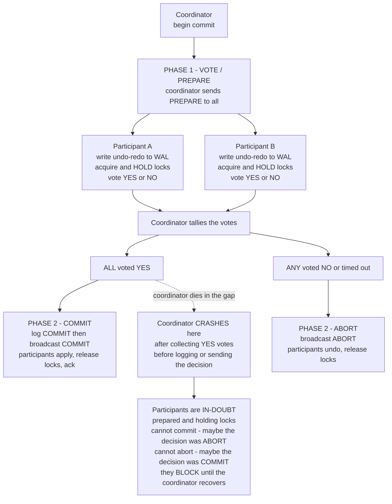

# 🤝 Atomic Commitment

> [!abstract] TL;DR
> **Atomic commitment** is the problem of making a transaction that touches *multiple* nodes **all-or-nothing**: either **every** participant commits or **every** one aborts — never a mix that debits one account without crediting the other. **Two-Phase Commit (2PC)** is the classic protocol — everyone votes, the coordinator tallies, commit only on **unanimous YES** — but it has a fatal flaw: if the **coordinator crashes** after collecting votes but before delivering the decision, participants are stuck **in-doubt**, holding locks, unable to safely commit or abort. **Three-Phase Commit (3PC)** and **consensus-based commit (Paxos Commit)** exist to remove that blocking.

---

## Intuition

**Analogy:** Picture a wire transfer that spans two banks. Bank A must **debit** your account and Bank B must **credit** the recipient's. The only acceptable outcomes are *both happen* or *neither happens*. If A debits but B never credits, money vanishes into thin air; if B credits but A never debits, money is conjured from nothing. There is no "partially transferred" state a customer would tolerate — it must be **all-or-nothing**.

Now add a notary who coordinates the closing: the notary asks both banks "are you ready and able to do your part?", each writes the pending entry in ink and **locks that ledger line** so nothing else can touch it, and only when *both* say "ready" does the notary announce "commit — finalize it." That is **Two-Phase Commit**: phase one is *everyone vote and prepare*, phase two is *coordinator tallies and tells all*. The catastrophe is when the notary collects both "ready"s and then **drops dead** before announcing the verdict. Both banks now sit with a locked, pending entry they *promised* to finalize, but they dare not act alone — finalizing might be wrong if the notary had decided to cancel, and cancelling might be wrong if the notary had decided to commit. They **block**, ledgers frozen, until the notary is revived. In the technical domain the "notary" is a coordinator process, "ink and lock" is a durable write-ahead log entry plus held locks, and "block" is a liveness disaster that can freeze rows in a production database.

---

## How It Works

### The problem: agreement under unanimity

A distributed transaction updates data on several **participants** (nodes / resource managers). **Atomicity** demands one global outcome shared by all. Atomic commitment specifies the exact properties any such protocol must satisfy:

1. **Agreement** — no two participants decide differently. All reach the *same* verdict, COMMIT or ABORT.
2. **Validity** — the verdict is COMMIT **only if every participant voted YES**; if any participant votes NO or fails, the verdict must be ABORT. (Conversely, if all vote YES and nothing fails, it should commit.)
3. **Termination** — every correct participant *eventually* decides (this is the property plain 2PC sacrifices under coordinator failure).

Property 2 is the crux and the reason **atomic commit is not the same as consensus** (next section): commit requires **unanimity**, not a majority.

### Atomic commit vs consensus — a subtle, important distinction

Both are *agreement* problems, but they differ in what counts as a valid decision:

| | **Consensus** | **Atomic commit** |
|---|---|---|
| Decide value | *any* value some node proposed | strictly COMMIT or ABORT |
| Threshold to decide "yes" | a **majority** is enough | **every** participant must vote YES — **unanimity** |
| One node fails or objects | majority proceeds anyway | forces a **global ABORT** |
| Fault tolerance | tolerates a minority of failures and still makes progress | a single participant failure can force abort |

So atomic commit is in one sense *harder*: a lone failed or dissenting participant vetoes the whole commit, whereas consensus shrugs off a minority. The lesson repeated in the literature is **"commit is not consensus"** — but, crucially, the *agreement-and-termination* machinery underneath can be *built* from consensus, which is exactly what modern commit protocols do (see Paxos Commit below). Contrast the majority-quorum world of `The_Consensus_Problem`, `Consensus_and_Raft`, and [[Consensus_and_Quorums]] with the unanimity world here.

### Two-Phase Commit (2PC)

A single **coordinator** drives two round trips:

1. **Phase 1 — Voting / Prepare.** The coordinator sends `PREPARE` to every participant. Each participant that *can* commit durably **prepares**: it writes undo/redo records to its write-ahead log, acquires and **holds locks**, and replies **YES**. A participant that cannot (constraint violation, deadlock, disk full) replies **NO** and may abort locally at once. Voting YES is a *binding promise*: the participant guarantees it can commit later if told to, so it must keep its locks until it hears the outcome.
2. **Phase 2 — Decision.** The coordinator tallies. If **all** voted YES, it durably logs `COMMIT` (the point of no return) and broadcasts `COMMIT`; if **any** voted NO or timed out, it logs and broadcasts `ABORT`. Each participant applies the decision, releases locks, and acknowledges.

Optimizations reduce logging: **presumed-abort** (the default in XA) lets the coordinator forget aborted transactions and answer "ABORT" to any inquiry about an unknown transaction, saving log writes on the common abort path; **presumed-commit** optimizes the all-commit path instead. See [[Distributed_Transactions]] and [[Write_Ahead_Logging]] for the logging mechanics.

### The fatal flaw: blocking

2PC's crippling weakness is the **decision gap**. Suppose the coordinator has collected all YES votes but **crashes before** it logs or broadcasts the decision. Every participant is now **in-doubt**: it has *promised* to commit and is *holding locks*, yet it **cannot decide on its own**:

- It cannot **commit** — the coordinator might have decided ABORT (perhaps a slow NO arrived), and committing would violate agreement/atomicity.
- It cannot **abort** — the coordinator might have decided COMMIT, and aborting would equally violate atomicity.

So it **blocks**, holding locks, until the coordinator recovers and consults its log. This is why **2PC is a *blocking* protocol** — it is *not* fault-tolerant to coordinator failure. The coordinator is a single point of failure whose crash can freeze rows indefinitely, cascading into lock contention and stalled transactions. (This is a crash-recovery failure of the coordinator; see [[Failure_Models]].)



### Three-Phase Commit (3PC)

3PC inserts a **PRE-COMMIT** phase between the vote and the commit. After collecting all YES votes, the coordinator first broadcasts `PRE-COMMIT` ("everyone agreed, prepare to finalize"), waits for acks, and only then broadcasts `COMMIT`. The extra phase makes the protocol **non-blocking under crash faults**: a recovering participant can look at its peers' states and safely infer the decision — if anyone reached PRE-COMMIT, the group commits; if nobody did, it aborts. The catch is that 3PC **assumes bounded message delays and a synchronous model** (see [[System_and_Timing_Models]]) and is **not partition-tolerant**: a network partition can drive the two sides to *different* decisions, violating agreement. Because real networks partition, 3PC is elegant on paper but **rarely used in practice**.

### Consensus-based commit (Paxos Commit)

The modern fix is to attack the *root* cause — the fragile single coordinator — rather than add phases. **Paxos Commit** (Gray and Lamport, 2006) replaces the lone coordinator with a **fault-tolerant, replicated one** backed by consensus: it runs **one consensus instance per participant's vote**, so each vote and the final decision are *replicated* across a group. If the coordinator (or an acceptor) crashes, the surviving majority still holds the decision — **no participant is ever left in-doubt**, so the protocol is **non-blocking** without assuming synchrony. In effect, atomic commit's *unanimity* rides on top of consensus's *majority-replicated log* (Paxos / Raft — see [[Consensus_and_Raft]]). This is why robust systems never rely on *plain* 2PC for availability: they make the coordinator's state highly available via consensus.

**The elegant real-world layering — Spanner:** Google Spanner runs **2PC *across* Paxos groups**. Each shard is a Paxos group that replicates its own data durably and stays available across replica failures; a cross-shard transaction uses **2PC for atomicity** among the shard leaders, and because each participant (and the coordinator role) is itself a **Paxos-replicated** state machine, a crashed coordinator is simply re-elected from its replicated log — the blocking window is closed. **2PC for atomicity, Paxos for durability and availability.**

### Sagas — the availability-first alternative

For long-running or microservice workflows, a **[[Saga_Pattern|saga]]** abandons distributed atomicity entirely: it runs a *sequence of local transactions*, each with a **[[Compensating_Transaction|compensating action]]** that semantically undoes it if a later step fails. Sagas hold **no distributed locks** and need **no 2PC**, trading strict atomicity and isolation for **availability and eventual consistency**. The common wisdom: *avoid distributed transactions if you can, and never rely on plain 2PC for availability* — reach for sagas or the outbox pattern in microservices, and use 2PC only where a highly-available coordinator (consensus-backed) makes it safe.

---

## Key Concepts

### Secondary (plain-language)
- A transaction across several machines must be **all-or-nothing**: everyone commits or everyone aborts, never a half-done state that loses or invents money.
- **Two-Phase Commit** = *everyone vote, then the coordinator tallies and tells all*. Commit only if **everyone** said yes.
- The danger: if the coordinator **dies** right after collecting votes, the others are **stuck** holding locks, afraid to commit or abort on their own.

### Undergraduate (CS background)
- The three properties: **agreement** (same decision), **validity** (commit only on unanimous YES; else abort), **termination** (eventually decide).
- 2PC mechanics: **Phase 1** prepare + vote (durable WAL write, locks held); **Phase 2** decision broadcast; **presumed-abort / presumed-commit** logging optimizations.
- **Blocking**: a coordinator crash in the decision gap leaves YES-voters **in-doubt**, holding locks, unable to unilaterally decide — 2PC is a *blocking* protocol.
- **3PC** adds a **PRE-COMMIT** phase to become non-blocking under crash faults, but assumes synchrony and is **not partition-tolerant**.

### Graduate (system-level)
- **Commit ≠ consensus**: atomic commit needs **unanimity** (one NO/failure forces abort), whereas consensus decides *any* proposed value by **majority**. Commit is less fault-tolerant to participant failure yet is *implemented over* consensus.
- **Paxos Commit** (Gray–Lamport): one consensus instance per participant vote replicates every vote and the outcome, so the coordinator's decision survives crashes — **non-blocking without synchrony**.
- **Spanner** layers **2PC over Paxos**: 2PC gives cross-shard atomicity; Paxos gives each shard's durability and re-electable coordinator, closing the blocking window.
- **Recovery correctness** hinges on the coordinator's **commit log record** being durable *before* any broadcast (the commit point), so on recovery it can answer every in-doubt participant deterministically; forgetting to persist this reintroduces indeterminacy.
- **Sagas / outbox** trade ACID atomicity for availability via compensations and eventual consistency — the microservice-era answer to 2PC's coupling.

---

## Python Demo

A pure-stdlib simulation of **Two-Phase Commit** across a coordinator and N participants, plus a matplotlib visualization contrasting a **healthy commit** (bounded lock-hold window) with the **coordinator-crash blocking window** (locks held indefinitely). Scenarios: (A) unanimous YES commits atomically; (B) one NO forces a global ABORT; (C) the coordinator crashes in the decision gap and YES-voters are stuck **in-doubt**; (D) how 3PC / Paxos Commit remove the blocking.

```python
"""
Two-Phase Commit (2PC): atomic commitment across N participants, and the
fatal BLOCKING problem when the coordinator crashes in the decision gap.

Model (pure stdlib):
  - a Coordinator drives two phases
  - each Participant has a DURABLE log (survives a crash), locks, a vote,
    and a final decision (None == in-doubt)
  - Phase 1 VOTE:   coordinator -> PREPARE; the participant logs 'prepared',
                    acquires locks, votes YES  (or votes NO and aborts locally)
  - Phase 2 DECIDE: coordinator commits IFF every vote is YES, else aborts,
                    then notifies every participant, who acts and frees its locks
"""

import matplotlib.pyplot as plt


class Participant:
    def __init__(self, name, will_vote_yes=True):
        self.name = name
        self.will_vote_yes = will_vote_yes
        self.log = []              # durable write-ahead log; survives a crash
        self.locks_held = False
        self.vote = None
        self.decision = None       # 'COMMIT' / 'ABORT' / None (== in-doubt)

    def prepare(self):
        """Phase 1: durably prepare and vote."""
        if not self.will_vote_yes:
            self.vote = "NO"
            self.log.append("abort")     # a NO-voter can unilaterally abort
            self.locks_held = False
            self.decision = "ABORT"
            return "NO"
        self.log.append("prepared")      # WAL: undo/redo + intent to commit
        self.locks_held = True           # HOLD locks until told the outcome
        self.vote = "YES"
        return "YES"

    def apply(self, decision):
        """Phase 2: the coordinator delivered the global decision."""
        self.decision = decision
        self.log.append(decision.lower())
        self.locks_held = False          # safe to release now

    def in_doubt(self):
        """A YES-voter that never heard the decision is STUCK holding locks."""
        return self.vote == "YES" and self.decision is None


def two_phase_commit(participants, crash_after_votes=False):
    # -------- Phase 1: VOTE / PREPARE --------
    votes = {p.name: p.prepare() for p in participants}
    all_yes = all(v == "YES" for v in votes.values())

    if crash_after_votes:
        # coordinator has the YES votes but DIES before logging/sending a decision
        return {"votes": votes, "global": None, "crashed": True}

    # -------- Phase 2: DECIDE (commit iff unanimous YES) --------
    decision = "COMMIT" if all_yes else "ABORT"
    for p in participants:
        if p.vote == "YES":              # NO-voters already aborted locally
            p.apply(decision)
    return {"votes": votes, "global": decision, "crashed": False}


def show(title, participants, result):
    print(f"\n=== {title} ===")
    print("  votes:", result["votes"])
    if result["crashed"]:
        print("  coordinator CRASHED before broadcasting a decision")
    else:
        print("  global decision:", result["global"])
    for p in participants:
        state = ("IN-DOUBT (blocked, locks held)" if p.in_doubt()
                 else str(p.decision))
        locks = "HELD" if p.locks_held else "free"
        print(f"    {p.name}: vote={p.vote:3s} locks={locks:4s} -> {state}")


# ---- A. unanimous YES -> atomic COMMIT ----
A = [Participant("A"), Participant("B"), Participant("C")]
show("A. Successful atomic COMMIT (all vote YES)", A, two_phase_commit(A))

# ---- B. one NO -> global ABORT (atomicity) ----
B = [Participant("A"), Participant("B", will_vote_yes=False), Participant("C")]
show("B. One NO vote -> global ABORT (atomicity preserved)", B, two_phase_commit(B))

# ---- C. coordinator crashes in the decision gap -> BLOCKING ----
C = [Participant("A"), Participant("B"), Participant("C")]
rC = two_phase_commit(C, crash_after_votes=True)
show("C. Coordinator CRASH in the gap -> participants BLOCK in-doubt", C, rC)
stuck = [p.name for p in C if p.in_doubt()]
print(f"  stuck holding locks: {stuck}")
print("  none can decide alone: COMMIT may break atomicity if the coordinator")
print("  chose ABORT; ABORT may break it if the coordinator chose COMMIT.")

# ---- D. removing the blocking ----
print("\n=== D. Removing the blocking ===")
print("  3PC        : add a PRE-COMMIT phase so a recovering peer infers the")
print("               outcome from neighbours' states -- non-blocking under crash")
print("               faults GIVEN synchrony, but NOT partition-tolerant.")
print("  Paxos Commit: replace the single coordinator with a consensus group;")
print("               each vote is a Paxos instance, so the decision is replicated")
print("               and survives coordinator failure -- no blocking.")

# ============================ VISUALIZATION ============================
GREEN, ORANGE, BLUE, RED = "#2e8b57", "#e67e22", "#2980b9", "#c0392b"
parts = ["Part A", "Part B", "Part C"]
ypos = {p: i for i, p in enumerate(parts)}

fig, (ax1, ax2) = plt.subplots(1, 2, figsize=(13, 5.2), sharey=True)

# ---- ax1: healthy 2PC -> bounded lock-hold window ----
prepare_t, decide_t, release_t = 1.0, 3.0, 4.0
for p in parts:
    ax1.barh(ypos[p], release_t - prepare_t, left=prepare_t, height=0.5,
             color=GREEN, alpha=0.55, edgecolor="black")
    ax1.text((prepare_t + release_t) / 2, ypos[p], "locks held",
             ha="center", va="center", fontsize=8, color="black")
ax1.axvline(prepare_t, color=ORANGE, lw=2)
ax1.axvline(decide_t, color=BLUE, lw=2)
ax1.text(prepare_t, len(parts) - 0.35, "PREPARE\nvote YES, lock",
         ha="center", color=ORANGE, fontsize=8, fontweight="bold")
ax1.text(decide_t, len(parts) - 0.35, "COMMIT\nbroadcast",
         ha="center", color=BLUE, fontsize=8, fontweight="bold")
ax1.text((prepare_t + release_t) / 2, -0.95, "locks released -> DONE",
         ha="center", color=GREEN, fontsize=9, fontweight="bold")
ax1.set_title("Healthy 2PC: bounded lock-hold window")
ax1.set_xlim(0, 5.5)

# ---- ax2: coordinator crash -> unbounded blocking window ----
crash_t, edge = 3.0, 7.0
for p in parts:
    ax2.barh(ypos[p], crash_t - prepare_t, left=prepare_t, height=0.5,
             color=GREEN, alpha=0.55, edgecolor="black")
    ax2.barh(ypos[p], edge - crash_t, left=crash_t, height=0.5,
             color=RED, alpha=0.35, edgecolor=RED, hatch="//")
    ax2.annotate("", xy=(edge + 0.5, ypos[p]), xytext=(edge - 0.2, ypos[p]),
                 arrowprops=dict(arrowstyle="->", color=RED, lw=2))
ax2.axvline(prepare_t, color=ORANGE, lw=2)
ax2.axvline(crash_t, color=RED, lw=2, ls="--")
ax2.text(prepare_t, len(parts) - 0.35, "PREPARE\nvote YES, lock",
         ha="center", color=ORANGE, fontsize=8, fontweight="bold")
ax2.text(crash_t, len(parts) - 0.35, "coordinator\nCRASHES\nbefore deciding",
         ha="center", color=RED, fontsize=8, fontweight="bold")
ax2.text((crash_t + edge) / 2, -0.95,
         "IN-DOUBT: locks held indefinitely (blocking!)",
         ha="center", color=RED, fontsize=9, fontweight="bold")
ax2.set_title("2PC blocking: coordinator dies in the decision gap")
ax2.set_xlim(0, 8)

for ax in (ax1, ax2):
    ax.set_yticks(list(ypos.values()))
    ax.set_yticklabels(parts)
    ax.set_xlabel("time ->")
    ax.set_ylim(-1.4, len(parts) + 0.2)

fig.suptitle("Two-Phase Commit: healthy commit vs the coordinator-crash blocking window",
             fontweight="bold")
plt.tight_layout()
plt.savefig("atomic_commitment_2pc.png", dpi=110)
plt.show()
```

**What it prints:**

```
=== A. Successful atomic COMMIT (all vote YES) ===
  votes: {'A': 'YES', 'B': 'YES', 'C': 'YES'}
  global decision: COMMIT
    A: vote=YES locks=free -> COMMIT
    B: vote=YES locks=free -> COMMIT
    C: vote=YES locks=free -> COMMIT

=== B. One NO vote -> global ABORT (atomicity preserved) ===
  votes: {'A': 'YES', 'B': 'NO', 'C': 'YES'}
  global decision: ABORT
    A: vote=YES locks=free -> ABORT
    B: vote=NO  locks=free -> ABORT
    C: vote=YES locks=free -> ABORT

=== C. Coordinator CRASH in the gap -> participants BLOCK in-doubt ===
  votes: {'A': 'YES', 'B': 'YES', 'C': 'YES'}
  coordinator CRASHED before broadcasting a decision
    A: vote=YES locks=HELD -> IN-DOUBT (blocked, locks held)
    B: vote=YES locks=HELD -> IN-DOUBT (blocked, locks held)
    C: vote=YES locks=HELD -> IN-DOUBT (blocked, locks held)
  stuck holding locks: ['A', 'B', 'C']
```

The takeaway: unanimous YES yields a clean atomic commit; a single NO forces a global abort so no participant commits in isolation (atomicity); but when the coordinator dies in the decision gap, all three YES-voters are frozen **in-doubt**, holding locks with no safe unilateral move — the exact liveness failure that 3PC and Paxos Commit are designed to eliminate.

---

## Real-World Applications

- **XA / distributed SQL transactions** — the X/Open **XA** standard, Java **JTA**, MySQL `XA`, and PostgreSQL `PREPARE TRANSACTION` / `COMMIT PREPARED` all implement 2PC across resource managers, typically with **presumed-abort** logging. See [[Distributed_Transactions_in_Databases]].
- **Google Spanner** — the canonical elegant layering: **2PC across Paxos groups**. 2PC provides cross-shard atomicity while each shard's Paxos group provides durability and a re-electable coordinator, so a coordinator crash never blocks. See [[Consensus_and_Raft]].
- **Kafka exactly-once / transactions** — a **transaction coordinator** runs a 2PC-style protocol over the replicated log so a batch of produce + offset-commit operations is atomic across partitions. See [[Distributed_Transactions]].
- **Message-broker + database "XA" transactions** — enterprise integrations historically wrapped a JMS send and a DB update in one XA transaction; the coordinator (a transaction manager) drives 2PC across both resources.
- **Microservice sagas / outbox** — because 2PC couples services and hurts availability, microservices usually replace it with a [[Saga_Pattern|saga]] of local transactions plus [[Compensating_Transaction|compensations]], or the transactional outbox pattern, accepting eventual consistency instead.

---

## Common Pitfalls

- **Relying on plain 2PC for availability.** The coordinator is a single point of failure whose crash **blocks** in-doubt participants. If you must use 2PC, make the coordinator highly available with **consensus/failover** ([[Failover]], [[Leader_Election]]) — never bet uptime on a lone coordinator.
- **Holding locks across a slow prepare window.** Every YES-voter holds locks from PREPARE until the decision. Under high latency or a stalled coordinator this crushes throughput and breeds distributed **deadlocks** — 2PC's cost is *lock duration*, not just messages.
- **Confusing atomic commit with consensus.** Believing "we run Raft, so distributed transactions are solved" — Raft gives *majority* agreement on a log; atomic commit needs *unanimity* over heterogeneous participants. Consensus is a *building block* for commit, not a substitute.
- **Forgetting the commit point.** The coordinator must **durably log COMMIT before broadcasting it**. If it broadcasts first and crashes, a recovering coordinator cannot deterministically answer in-doubt participants — reintroducing the very indeterminacy 2PC recovery exists to prevent.
- **Trusting 3PC under partitions.** 3PC is non-blocking only under **synchrony**; a network partition can split it into divergent COMMIT/ABORT decisions, breaking agreement. Real networks partition (see [[CAP_Theorem]]), so 3PC is rarely deployed.
- **Heuristic resolution of in-doubt transactions.** When a 2PC transaction hangs, operators/XA managers sometimes force a *heuristic* commit or rollback. If the guess disagrees with the coordinator's actual decision, atomicity is silently violated and a **heuristic exception** is raised — a data-corruption hazard.

---

## Related Concepts

- [[Distributed_Transactions]] — the System Design companion covering 2PC, XA, sagas, and the outbox pattern in one place.
- [[Distributed_Transactions_in_Databases]] — how relational engines implement 2PC, prepared transactions, and cross-shard commit.
- [[Consensus_and_Raft]] — the majority-quorum consensus that replaces the fragile single coordinator (Paxos Commit, Spanner's 2PC-over-Paxos).
- [[Consensus_and_Quorums]] — quorum-based *majority* agreement; contrast its majority rule with atomic commit's **unanimity**.
- [[Failure_Models]] — 2PC assumes crash-recovery; the blocking flaw is precisely a coordinator *crash* in the decision gap.
- [[System_and_Timing_Models]] — 3PC is non-blocking only under a *synchronous* model and is not partition-tolerant.
- [[Saga_Pattern]] — the availability-first alternative that avoids distributed locks and 2PC via local transactions.
- [[Compensating_Transaction]] — the semantic undo a saga uses in place of atomic rollback.
- [[Transactions_and_ACID]] — atomicity is the "A"; atomic commitment extends it across multiple nodes.
- [[Write_Ahead_Logging]] — participants durably log "prepared"; recovery reads the WAL to resolve in-doubt state.
- [[CAP_Theorem]] — 2PC favors consistency and gives up availability when the coordinator or network fails.
- [[Failover]] — highly-available coordinators use failover/consensus to shrink or close the blocking window.
- [[Leader_Election]] — a consensus-backed coordinator re-elects a leader after a crash; the commit outcome is a decided value.
- [[Failure_Detectors]] — timeouts flag a suspected coordinator crash and trigger in-doubt resolution / recovery.

> Sibling notes in this vault — *The Consensus Problem*, *Paxos*, *Raft Consensus (as a standalone note)*, *Three-Phase Commit*, and *CAP Theorem and PACELC* — are referenced in prose above and will be wikilinked once they exist.

---

## Review Questions

1. **(Secondary)** In the two-bank wire-transfer analogy, describe the one outcome atomic commitment forbids and why. Then explain, in plain terms, what goes wrong if the "notary" coordinator drops dead right after both banks say "ready."
2. **(Undergraduate)** Walk through 2PC for a coordinator and three participants where participant B votes NO. Which messages flow in each phase, what is the global decision, and which locks are held when? Then modify the scenario so the coordinator crashes *after* three YES votes but *before* the decision — explain precisely why each participant is stuck and cannot decide alone.
3. **(Graduate)** Explain why "commit is not consensus," contrasting the **unanimity** requirement of atomic commit with the **majority** rule of consensus, and why one implies *less* fault tolerance to participant failure. Then describe how **Paxos Commit** uses one consensus instance per vote to make commit **non-blocking**, and how **Spanner** layers **2PC over Paxos** to get atomicity *and* availability. Why does 3PC fail to achieve the same guarantee under network partitions?

---

## Sources

- Gray, J. and Lamport, L. "Consensus on Transaction Commit." *ACM TODS*, 2006. (Paxos Commit.) [PDF](https://lamport.azurewebsites.net/pubs/paxos-commit.pdf)
- Skeen, D. "Nonblocking Commit Protocols." *ACM SIGMOD*, 1981. (The 3PC / non-blocking commit result.) [ACM](https://dl.acm.org/doi/10.1145/582318.582339)
- Bernstein, P., Hadzilacos, V., Goodman, N. *Concurrency Control and Recovery in Database Systems.* Addison-Wesley, 1987. (Ch. 7: atomic commitment, 2PC, presumed abort/commit.) [Free book](https://www.microsoft.com/en-us/research/people/philbe/book/)
- Corbett, J. et al. "Spanner: Google's Globally-Distributed Database." *OSDI*, 2012. (2PC over Paxos.) [PDF](https://www.usenix.org/system/files/conference/osdi12/osdi12-final-16.pdf)
- Kleppmann, M. *Designing Data-Intensive Applications*, Ch. 9: "Consistency and Consensus" (atomic commit vs consensus). O'Reilly, 2017. [Book site](https://dataintensive.net/)

---

#distributed-systems #atomic-commit #two-phase-commit #3pc #distributed-transactions
