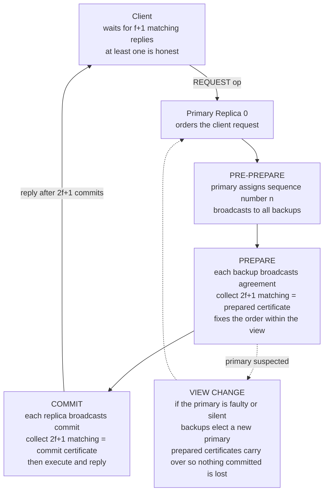

# 🛡️ Byzantine Agreement and PBFT

> [!abstract] TL;DR
> **Byzantine agreement** is consensus that survives nodes behaving *arbitrarily* — crashing, lying, and sending **conflicting messages to different peers** (equivocating), possibly in collusion. The foundational result is the **3f+1 bound**: to tolerate `f` Byzantine faults in the general asynchronous case you need `N >= 3f+1` nodes, a *more-than-two-thirds honest supermajority*. **PBFT** (Castro-Liskov, 1999) was the first BFT protocol fast enough for real use: a **primary** orders requests and **backups** validate through three phases — **pre-prepare, prepare, commit** — each requiring a **2f+1 quorum certificate** so that any two decisions must overlap in at least one honest node. This three-phase quorum technique is the direct ancestor of modern permissioned-blockchain and proof-of-stake finality protocols.

---

## Intuition

**Analogy:** Crash-tolerant consensus assumes a failed teammate simply *goes silent* — they stop answering, and everyone can see the empty chair. Byzantine agreement asks a far nastier question: **what if a teammate stays in the room and actively lies — whispering "attack" to one neighbor and "retreat" to another** so the honest people can never even agree on what was said?

This is the **Byzantine Generals problem** (Lamport, Shostak, Pease, 1982). Several generals surround a city and must *all* attack or *all* retreat; a half-hearted split loses. They coordinate only by messenger, and some generals — or messengers — are **traitors** who send contradictory orders to sabotage agreement. The startling answer to "how many traitors can the loyal generals survive?" is that **agreement is possible only if more than two-thirds of everyone is honest**: you need `N >= 3f+1` generals to survive `f` liars. With just three generals and one traitor, agreement is *provably impossible* — a loyal general cannot tell a lying commander apart from a lying peer, because both produce the exact same contradictory evidence.

---

## How It Works

### The Byzantine Generals Problem and the 3f+1 Bound

The problem models the **worst possible failure mode**: a faulty node may do *anything* — halt, forge messages, replay old ones, and crucially **equivocate** (tell different, mutually inconsistent things to different honest peers). It may also **collude** with the other faulty nodes as a single coordinated adversary.

The central theorem is the **3f+1 lower bound**. In the general asynchronous setting without cryptographic signatures, **you cannot solve Byzantine agreement with `f` faulty nodes unless `N >= 3f+1`.** The intuition combines two pressures that a correct protocol must satisfy at once:

1. **Availability under asynchrony.** A node can never wait for all `N` responses, because up to `f` peers may be crashed, slow, or deliberately silent — and *you cannot tell slow from dead*. So any decision must be reachable from a quorum of at most `N - f` nodes.
2. **Honesty under equivocation.** Two different quorums must overlap in at least one *honest* node, otherwise a Byzantine set sitting in the "gap" could tell one quorum "the value is A" and another quorum "the value is B", and both would decide. Any two quorums of size `q` overlap in at least `2q - N` nodes; to guarantee an honest node in that overlap despite `f` liars we need `2q - N >= f + 1`.

Combine `q <= N - f` (availability) with `2q - N >= f + 1` (honest intersection). The smallest quorum satisfying honesty is `q = 2f + 1`, and it fits inside the availability budget exactly when `N >= 3f + 1`. At that size, any two `2f+1` quorums intersect in at least `f + 1` nodes, guaranteeing at least one honest node in common — which is what makes conflicting decisions impossible.

**The three-generals impossibility (`N = 3, f = 1`)** is the sharpest illustration. A loyal lieutenant L1 hears an order *directly* from the commander and hears *relayed* what the commander told the other lieutenant L2. Consider two worlds:

- **World A — traitor commander:** the commander sends `ATTACK` to L1 and `RETREAT` to L2; both lieutenants are loyal and relay honestly. L1 observes `(direct=ATTACK, relayed=RETREAT)`.
- **World B — traitor peer L2:** the commander is loyal and says `ATTACK` to both; the traitor L2 lies to L1 that the commander said `RETREAT`. L1 observes `(direct=ATTACK, relayed=RETREAT)`.

L1's local observation is **identical** in both worlds, yet the correct action differs (in World B it must obey the loyal commander and attack; in World A it must reach the *same* decision as L2 despite symmetric contradictory evidence). No deterministic rule can be correct in both, so `N = 3` cannot tolerate one Byzantine fault.

### Crash (2f+1) versus Byzantine (3f+1)

The contrast with crash-tolerant consensus is the whole story. Crash faults need only a **simple majority `N >= 2f+1`**, because a crashed node merely *stops talking* — it can never send a *wrong* answer, so counting non-empty replies is enough and any two majorities already intersect. Byzantine faults demand the extra `f`: because liars can equivocate, you must enlarge every quorum from `f+1` to `2f+1` so the *honest* portions of any two quorums are guaranteed to overlap. **That extra `f` is precisely the price of malice** — roughly 50% more replicas and, as we will see, quadratic message cost. (See [[Failure_Models]] for the full fault hierarchy behind this contrast.)

**Digital signatures help but do not lower the bound.** Authenticated (signed) messages stop a traitor from *forging* what another node said and enable non-repudiable transferable evidence, which simplifies protocols and can rescue the synchronous case. But in the asynchronous BFT setting the `3f+1` bound still stands, because signatures cannot stop a node from *equivocating* — signing two contradictory messages and sending each to a different peer.

### PBFT: The First Practical BFT Protocol

Before **PBFT** (Castro and Liskov, *Practical Byzantine Fault Tolerance*, OSDI 1999), Byzantine agreement was considered too slow to deploy. PBFT made it practical for replicated state machines by running an efficient leader-based protocol over `N = 3f + 1` replicas. One replica acts as the **primary** (leader) that *orders* client requests; the rest are **backups** that validate. A request passes through **three phases**, each gated by a **quorum certificate** of `2f+1` matching messages:

1. **PRE-PREPARE** — the primary assigns the request a sequence number `n` (within the current *view*) and broadcasts a signed pre-prepare to all backups. This proposes an ordering but does not yet commit it.
2. **PREPARE** — each backup that accepts the pre-prepare broadcasts a `PREPARE`. When a replica collects `2f+1` matching pre-prepare+prepare messages it holds a **prepared certificate**, which fixes the order of request `n` *within this view* — no other request can take slot `n` under an honest quorum.
3. **COMMIT** — each replica broadcasts a `COMMIT`; collecting `2f+1` matching commits forms a **commit certificate**, after which the replica **executes** the request and sends a reply. The client waits for `f+1` matching replies (at least one from an honest replica) and accepts the result.

If the primary is faulty or silent, backups trigger a **view change** (see [[Leader_Election]]): they stop accepting the current primary, exchange their prepared certificates, and elect the next primary, which reconstructs safe state from those certificates so no committed request is lost.

### Why Three Phases and Quorum Certificates

Crash consensus needs only two effective rounds; PBFT adds the extra **COMMIT** phase for one reason: to guarantee that **agreement persists across view changes even when the primary itself is Byzantine.** A prepared certificate proves an ordering was agreed *within a view*, but a malicious primary could have equivocated to only *some* replicas; the commit phase forces a *second* `2f+1` quorum to witness the decision so that any future view is guaranteed (by quorum intersection) to observe it and preserve it. The core safety argument is the **quorum-intersection property generalized to the Byzantine setting**: any two `2f+1` quorums share at least `f+1` nodes, hence at least one honest node, so two conflicting values can never both gather a commit certificate. This is the same intersection logic that underlies read/write quorum systems and Paxos, hardened for lying participants.



### Performance, Scalability, and Modern BFT

PBFT's all-to-all message pattern in the prepare and commit phases gives it **`O(N^2)` message complexity per decision**. That is perfectly fine for small committees (tens of replicas) but does not scale to thousands of nodes — the driver behind a decade of improvements. The **modern BFT renaissance**, propelled by blockchains, produced faster and leaner successors:

- **Tendermint / CometBFT** (Cosmos) — a simplified, gossip-based PBFT variant with immediate, deterministic finality.
- **HotStuff** (used in Diem/Libra) — reduces communication to **linear `O(N)`** per phase by routing votes through the leader and using threshold signatures, and adds a clean pipelined view-change.
- **Istanbul BFT, SBFT, Zyzzyva** — further engineering tradeoffs on latency, throughput, and optimistic fast paths.

Crucially, PBFT-style BFT is only **one of two families** of blockchain consensus. **BFT versus Nakamoto** is the defining contrast: PBFT-style protocols give **deterministic finality** with a known, permissioned validator set of small `N`, whereas **Nakamoto consensus** (Bitcoin/Ethereum proof-of-work, discussed under the *Blockchain and Nakamoto Consensus* sibling) gives only **probabilistic finality** but scales to a permissionless, open membership of huge `N` under an honest-*majority*-of-resources assumption rather than a fixed `3f+1` committee.

---

## Key Concepts

### Secondary (plain-language)
- A **crash** teammate goes silent; a **Byzantine** teammate stays and *lies*, even telling two people opposite things.
- To survive `f` liars you need **more than two-thirds honest**: `N >= 3f+1` total. Three generals cannot survive one traitor.
- **PBFT** puts one node in charge (the *primary*) to order requests, and everyone double-checks through three rounds of voting before acting.

### Undergraduate (CS background)
- **Byzantine / arbitrary fault** = the top of the failure hierarchy (crash ⊂ omission ⊂ Byzantine); it includes **equivocation** and **collusion**.
- **3f+1 bound derivation:** availability forces quorum `q <= N - f`; honest intersection forces `2q - N >= f+1`; together they require `N >= 3f+1`, with `q = 2f+1`.
- **Crash `2f+1` vs Byzantine `3f+1`:** the extra `f` buys resistance to lies, because simple-majority quorums no longer guarantee an *honest* overlap.
- **PBFT phases:** pre-prepare (order) -> prepare (`2f+1` = prepared certificate, order fixed in view) -> commit (`2f+1` = commit certificate, execute); client accepts on `f+1` matching replies.

### Graduate (system-level)
- **Quorum-certificate safety proof:** any two `2f+1` quorums in `3f+1` nodes intersect in `>= f+1` nodes, hence `>= 1` honest node; therefore two conflicting values cannot both obtain a commit certificate. Safety holds without any timing assumption.
- **Why the commit phase exists:** it makes a decision *stable across view changes* against a Byzantine primary that equivocated during pre-prepare; a single prepared certificate is insufficient because the primary may have shown it to a non-overlapping set.
- **Signatures vs the bound:** authentication prevents forgery and enables transferable proofs, and can defeat the impossibility in *synchronous* systems, but **does not lower the asynchronous `3f+1` bound** because equivocation survives signing.
- **Complexity and evolution:** PBFT is `O(N^2)`; HotStuff achieves `O(N)` via leader-relayed threshold-signed votes and responsiveness; this line of work underpins PoS finality gadgets.
- **Relation to FLP:** deterministic asynchronous consensus is impossible even for crash faults (*FLP Impossibility Result* sibling); PBFT sidesteps it via partial synchrony — safety always holds, liveness resumes once the network is synchronous enough for view changes to complete.

---

## Python Demo

Two experiments. **Part A** reproduces the classic three-generals impossibility for `N = 3, f = 1` by showing a loyal lieutenant's observation is *identical* whether the commander lies or a peer lies. **Part B** implements the PBFT quorum-certificate check: with `N = 3f+1` and a `2f+1` quorum, any two quorums intersect in `>= f+1` nodes (at least one honest), so equivocating Byzantine nodes cannot get two conflicting values committed — and we verify this **holds at `3f+1` but breaks at `3f`**, then visualize the intersection and the threshold.

```python
"""
Byzantine Agreement & PBFT: the 3f+1 bound and quorum-certificate safety.

Part A - Byzantine Generals impossibility for N=3, f=1:
  a loyal lieutenant L1 cannot distinguish a TRAITOR COMMANDER from a
  TRAITOR PEER L2, because both produce the SAME local observation.
  No decision rule is correct in both worlds -> agreement is impossible.

Part B - PBFT quorum certificates with N = 3f+1:
  a value commits only with 2f+1 matching PREPARE/COMMIT messages.
  Any two 2f+1 quorums intersect in >= f+1 nodes, so they share >= 1
  honest node -> two conflicting values can NEVER both commit (SAFETY).
  We verify safety holds at N = 3f+1 but BREAKS at N = 3f.
"""

import matplotlib.pyplot as plt
from matplotlib.patches import Rectangle


# ----------------------------------------------------------------------
# Part A: the classic three-generals impossibility (N = 3, f = 1)
# ----------------------------------------------------------------------
# Loyal lieutenant L1 forms its view from two sources:
#   direct  = the order received straight from the commander
#   relayed = what the other lieutenant L2 says the commander said

def view_commander_is_traitor():
    # Commander is the traitor: ATTACK to L1 but RETREAT to L2.
    # Both lieutenants are loyal, so L2 relays honestly what it heard.
    direct = "ATTACK"     # commander -> L1
    relayed = "RETREAT"   # L2 loyally forwards what the commander told it
    return (direct, relayed)


def view_peer_L2_is_traitor():
    # Commander is loyal: ATTACK to both. L2 is the traitor and lies to L1.
    direct = "ATTACK"     # commander -> L1 (loyal)
    relayed = "RETREAT"   # L2 lies about what the commander said
    return (direct, relayed)


va = view_commander_is_traitor()
vb = view_peer_L2_is_traitor()
print("=== Part A: Byzantine Generals, N=3 f=1 ===")
print(f"L1 observes when COMMANDER is traitor : {va}")
print(f"L1 observes when PEER L2 is traitor   : {vb}")
print(f"Indistinguishable to L1?              : {va == vb}")
print("-> No rule works in both worlds: obeying the commander breaks")
print("   agreement in world A; ignoring it disobeys a LOYAL commander in")
print("   world B. Hence N=3 cannot tolerate f=1 (need N >= 3f+1 = 4).\n")


# ----------------------------------------------------------------------
# Part B: quorum-certificate safety, N = 3f+1 vs 3f
# ----------------------------------------------------------------------

def best_quorum(N, f):
    """Largest quorum a client can ALWAYS assemble from live nodes,
    since up to f nodes may be crashed or arbitrarily slow."""
    return N - f


def intersection(N, q):
    """Guaranteed overlap of any two size-q quorums (inclusion-exclusion)."""
    return 2 * q - N


def double_commit_possible(N, f, q):
    """
    Byzantine nodes EQUIVOCATE: they vote for BOTH conflicting values A and B.
    Honest nodes (N-f of them) each vote for exactly one value.
    A value commits with >= q votes. Two conflicting values can both reach q
    exactly when the guaranteed quorum overlap is NOT forced to be honest,
    i.e. when intersection(N, q) <= f  (the overlap could be all liars).
    """
    return intersection(N, q) <= f


print("=== Part B: PBFT quorum certificates ===")
for f in (1, 2, 3):
    for N, tag in ((3 * f + 1, "N=3f+1"), (3 * f, "N=3f  ")):
        q = best_quorum(N, f)
        inter = intersection(N, q)
        unsafe = double_commit_possible(N, f, q)
        verdict = "UNSAFE  two conflicting values commit" if unsafe else "SAFE"
        print(f"f={f}  {tag}  N={N:2d}  quorum q=N-f={q:2d}  "
              f"overlap={inter:2d} (need >= {f + 1})  -> {verdict}")
print()
print("At N=3f+1 the best quorum is exactly 2f+1 (the PBFT quorum) and the")
print("overlap is f+1 >= 1 honest -> SAFE. At N=3f the overlap drops to f,")
print("which the adversary can fill entirely -> equivocation double-commits.\n")


# ----------------------------------------------------------------------
# Visualization
# ----------------------------------------------------------------------
fig, (ax1, ax2) = plt.subplots(1, 2, figsize=(13, 5.5))

# ---- Panel 1: quorum intersection, worst-case Byzantine placement -----
def draw_case(ax, N, f, y0, title):
    q = best_quorum(N, f)
    ov_lo, ov_hi = N - q, q               # overlap cell indices [ov_lo, ov_hi)
    byz = set(range(ov_lo, ov_lo + f))    # worst case: put liars in the overlap
    honest_overlap = (ov_hi - ov_lo) - len(byz & set(range(ov_lo, ov_hi)))

    for i in range(N):
        color = "#f1948a" if i in byz else "#a9dfbf"
        ax.add_patch(Rectangle((i, y0), 0.9, 0.9, facecolor=color,
                               edgecolor="gray", lw=0.8))
        ax.text(i + 0.45, y0 + 0.45, "B" if i in byz else "H",
                ha="center", va="center", fontsize=9, fontweight="bold")

    ax.add_patch(Rectangle((0, y0 + 0.95), q - 0.05, 0.26,
                           facecolor="#2e86de", alpha=0.85))
    ax.text(q / 2, y0 + 1.08, "Quorum 1 = 2f+1" if N == 3 * f + 1 else "Quorum 1 = N-f",
            ha="center", va="center", fontsize=8, color="white")
    ax.add_patch(Rectangle((N - q, y0 - 0.31), q - 0.05, 0.26,
                           facecolor="#e67e22", alpha=0.9))
    ax.text(N - q / 2, y0 - 0.18, "Quorum 2", ha="center", va="center",
            fontsize=8, color="white")

    ax.add_patch(Rectangle((ov_lo, y0 - 0.04), (ov_hi - ov_lo) - 0.05, 0.98,
                           fill=False, edgecolor="red", lw=2, linestyle="--"))
    safe = honest_overlap >= 1
    ax.text(N + 0.4, y0 + 0.45,
            f"{title}\noverlap = {ov_hi - ov_lo} cells\nhonest in overlap = "
            f"{honest_overlap}\n-> {'SAFE' if safe else 'UNSAFE'}",
            va="center", ha="left", fontsize=9, fontweight="bold",
            color="#1e8449" if safe else "#c0392b")


draw_case(ax1, N=7, f=2, y0=2.2, title="N=3f+1=7, f=2")   # safe
draw_case(ax1, N=6, f=2, y0=0.2, title="N=3f=6, f=2")     # unsafe
ax1.set_xlim(-0.5, 11.5)
ax1.set_ylim(-0.8, 3.9)
ax1.axis("off")
ax1.set_title("Quorum intersection (worst-case liar placement)\n"
              "dashed box = guaranteed overlap of any two quorums")

# ---- Panel 2: the N >= 3f+1 resilience threshold ----------------------
Ns = list(range(1, 19))
fmax = [(n - 1) // 3 for n in Ns]
ax2.step(Ns, fmax, where="post", color="#8e44ad", lw=2,
         label="max Byzantine faults tolerated")
ax2.plot(Ns, fmax, "o", color="#8e44ad", ms=4)
for n in (4, 7, 10, 13, 16):
    ax2.annotate(f"N={n}\nf={(n - 1) // 3}", (n, (n - 1) // 3),
                 textcoords="offset points", xytext=(4, -22), fontsize=8,
                 color="#5b2c6f")
ax2.set_xlabel("total nodes  N")
ax2.set_ylabel("max Byzantine faults  f = floor((N-1)/3)")
ax2.set_title("N >= 3f+1 : the Byzantine resilience threshold")
ax2.grid(alpha=0.3)
ax2.legend(loc="upper left")

plt.tight_layout()
plt.savefig("byzantine_pbft.png", dpi=110)
plt.show()
```

**What it prints (abridged):**

```
=== Part A: Byzantine Generals, N=3 f=1 ===
L1 observes when COMMANDER is traitor : ('ATTACK', 'RETREAT')
L1 observes when PEER L2 is traitor   : ('ATTACK', 'RETREAT')
Indistinguishable to L1?              : True

=== Part B: PBFT quorum certificates ===
f=1  N=3f+1  N= 4  quorum q=N-f= 3  overlap= 2 (need >= 2)  -> SAFE
f=1  N=3f    N= 3  quorum q=N-f= 2  overlap= 1 (need >= 2)  -> UNSAFE  two conflicting values commit
f=2  N=3f+1  N= 7  quorum q=N-f= 5  overlap= 3 (need >= 3)  -> SAFE
f=2  N=3f    N= 6  quorum q=N-f= 4  overlap= 2 (need >= 3)  -> UNSAFE  two conflicting values commit
```

The overlap of two `2f+1` quorums is exactly `f+1` at `N = 3f+1` (one honest node guaranteed in common) but drops to `f` at `N = 3f` (the adversary can own the entire overlap and equivocate to commit two conflicting values). Part A shows why the smallest interesting case, three generals with one traitor, is already impossible.

---

## Real-World Applications

- **Permissioned blockchains — Hyperledger Fabric ordering, R3 Corda notaries** — use BFT ordering services so a consortium of mutually distrusting organizations agrees on a canonical transaction order without any single member being trusted. See [[Consensus_Mechanisms]].
- **Diem/Libra (HotStuff) and Cosmos (Tendermint/CometBFT)** — production PBFT descendants providing **deterministic finality** with a known validator set; HotStuff's linear communication made hundreds of validators feasible.
- **Ethereum proof-of-stake finality (Casper FFG / Gasper)** — the finality gadget uses BFT-style two-thirds-stake supermajority voting to *finalize* checkpoints, blending Nakamoto-style block production with BFT finality. Contrast the two families under the *Blockchain and Nakamoto Consensus* sibling and [[Distributed_Ledgers_and_Trilemma]].
- **Aerospace and avionics (SIFT, Boeing 777 / 787, fly-by-wire)** — genuine Byzantine-tolerant flight-control computers vote across redundant channels, because a *stuck* or *corrupted* sensor is an arbitrary fault, not a clean crash; the FTMP/SIFT lineage motivated much of the original theory.
- **Any system spanning a trust boundary** — cross-organization ledgers, decentralized finance, and secure multi-party services where you cannot assume peers merely crash rather than cheat. Where nodes *are* trusted (a single datacenter), crash-tolerant [[Consensus_and_Raft]] and [[Consensus_Algorithms]] are cheaper and sufficient.

---

## Common Pitfalls

- **Using a crash protocol across a trust boundary** — deploying Raft/Paxos among mutually distrusting parties. A single malicious node breaks safety because crash protocols never anticipate equivocation. Match the failure model to the *trust boundary*, not the happy path (see [[Failure_Models]]).
- **Sizing to `2f+1` for Byzantine faults** — a `2f+1` cluster survives crashes but silently violates safety under lies; Byzantine tolerance needs `3f+1`. Conversely, paying `3f+1` where crashes are the only threat wastes replicas.
- **Believing signatures remove the `3f+1` bound** — authentication stops forgery and enables transferable proofs, but not equivocation; the asynchronous bound stands. Signatures buy simpler protocols and the synchronous special case, not a smaller committee.
- **Dropping the COMMIT phase to "optimize"** — a two-phase (prepare-only) design loses safety across view changes when the primary is Byzantine; the second quorum is what makes a decision stable. The extra round is load-bearing, not ceremony.
- **Confusing finality models** — expecting Nakamoto-style probabilistic settlement to behave like PBFT's instant deterministic finality, or vice versa. Reorg risk, confirmation depth, and membership assumptions differ fundamentally.
- **Ignoring the `O(N^2)` message cost** — classic PBFT does not scale to thousands of validators; large deployments need linear-communication successors (HotStuff) or committee sampling, or throughput collapses.
- **Assuming liveness is guaranteed** — like all async consensus, BFT protocols preserve *safety* unconditionally but rely on partial synchrony for *liveness*; a persistently adversarial network can stall progress even though no wrong value is ever committed (the FLP-flavored limit).

---

## Related Concepts

- [[Failure_Models]] — the fault hierarchy that places Byzantine at the top and derives the `2f+1` vs `3f+1` redundancy split this note builds on.
- [[Failure_Detectors]] — the "slow vs dead" indistinguishability that forces quorums of at most `N - f`, half of the `3f+1` derivation.
- [[Leader_Election]] — PBFT's **view change** is Byzantine-hardened leader election that replaces a faulty primary while preserving committed state.
- [[Consensus_and_Raft]] — the crash-tolerant counterpart (`2f+1`, no equivocation) that shows exactly what the extra Byzantine phase and replicas buy.
- [[Consensus_Algorithms]] — broader survey of agreement protocols and where BFT sits among them.
- [[Consensus_and_Quorums]] — the quorum-intersection principle, generalized here to require an *honest* overlap of `f+1`.
- [[Consensus_Mechanisms]] — blockchain consensus, including the PBFT-family (deterministic finality) vs Nakamoto (probabilistic) contrast.
- [[Distributed_Ledgers_and_Trilemma]] — Nakamoto-style honest-majority-of-resources tolerance versus a fixed `3f+1` committee.

> Sibling notes in this vault — *The Consensus Problem*, *Quorum Systems*, *Paxos*, *Blockchain and Nakamoto Consensus*, and *FLP Impossibility Result* — are referenced in prose above and will be wikilinked once they exist.

---

## Review Questions

1. **(Secondary)** In plain words, why can three generals not reach agreement if even one is a traitor, but four generals can survive one? Tie your answer to "more than two-thirds must be honest."
2. **(Undergraduate)** PBFT runs three phases — pre-prepare, prepare, commit. What does the *prepared certificate* guarantee, what additional guarantee does the *commit certificate* add, and why is `2f+1` (not `f+1`) the required quorum size at each phase?
3. **(Graduate)** Derive the `3f+1` bound from the availability constraint `q <= N - f` and the honest-intersection constraint `2q - N >= f+1`. Then explain precisely why the extra COMMIT phase is necessary for safety across a view change when the primary is Byzantine, and why adding digital signatures does not let you shrink `N` below `3f+1` in the asynchronous model.

---

## Sources

- Lamport, Shostak, Pease. "The Byzantine Generals Problem." *ACM TOPLAS*, 1982. [PDF](https://lamport.azurewebsites.net/pubs/byz.pdf)
- Castro, Liskov. "Practical Byzantine Fault Tolerance." *OSDI*, 1999. [PDF](https://pmg.csail.mit.edu/papers/osdi99.pdf)
- Yin, Malkhi, Reiter, Gueta, Abraham. "HotStuff: BFT Consensus with Linearity and Responsiveness." *PODC*, 2019. [PDF](https://arxiv.org/pdf/1803.05069)
- Buchman, Kwon, Milosevic. "The latest gossip on BFT consensus (Tendermint)." 2018. [PDF](https://arxiv.org/pdf/1807.04938)
- Cachin, Guerraoui, Rodrigues. *Introduction to Reliable and Secure Distributed Programming*, 2nd ed. Springer, 2011. [Book site](https://www.distributedprogramming.net/)

---

#distributed-systems #byzantine-fault-tolerance #pbft #byzantine-generals #bft-consensus
