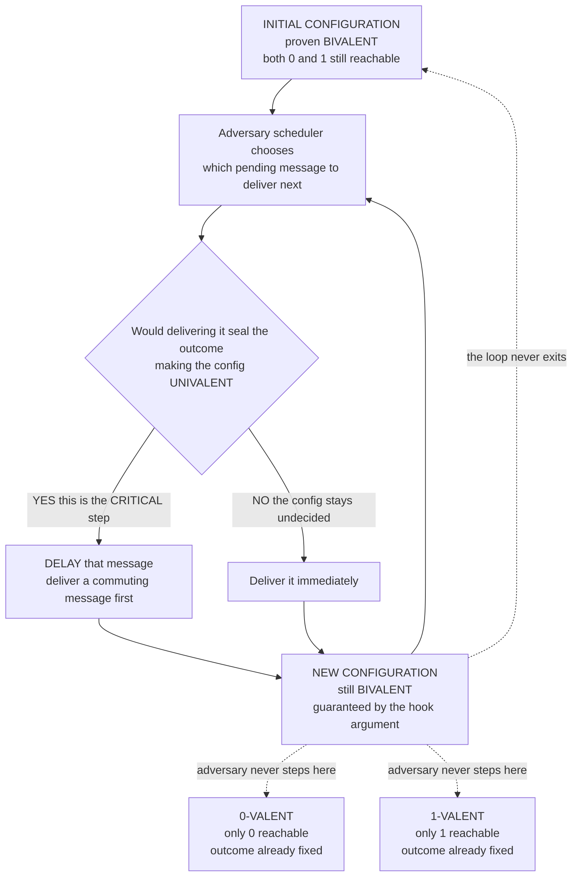

# 🚫 FLP Impossibility Result

> [!abstract] TL;DR
> The **FLP theorem** (Fischer, Lynch & Paterson, 1985) is the most famous impossibility result in distributed computing: in a purely **asynchronous** message-passing system where even **one** process may fail by **crashing**, **no deterministic protocol can solve consensus** — that is, any protocol that is always **safe** (never lets two nodes decide differently) cannot also **guarantee termination** in *every* execution. It does **not** say consensus "never works"; it says no algorithm can *always* terminate — there is always at least one (possibly astronomically improbable) run where the timing keeps the system perpetually undecided. Safety is never at risk; **only liveness** is. This single result is *why* every production consensus system (Raft, Paxos, Zab, PBFT) adds partial synchrony, failure detectors, or randomization, and why the whole field lives by the mantra **"safe always, live usually."**

---

## Intuition

**Analogy:** Imagine a committee that must **always** reach a verdict — yes or no — and you have promised it will *never* deadlock. But there is a catch: at any moment **any one member may fall silent forever**, and you can **never tell** whether that member has walked out (crashed) or is simply **thinking very slowly** (a delayed message still in transit). To be safe, you can never finalize a verdict while a decisive member might still be "just thinking," because their vote could flip the outcome — so you wait. FLP proves that no matter how clever your committee's rules are, there is always a way for the **timing to conspire**: right at the instant a decision is about to crystallize, the one message that would tip the balance gets delayed, nudging the group into a *different* still-undecided state — and this can be repeated forever. The committee teeters on the edge of a decision without ever making one.

The punchline is that this is **not a failure of cleverness**. It is not that we have not yet found the right protocol. FLP shows it is **mathematically impossible** to design a deterministic protocol that is both always safe and always terminating under these conditions. The inability to distinguish "dead" from "slow" is the whole ballgame — remove it (assume timing bounds) and consensus becomes easy again.

---

## How It Works

### The statement, made precise

FLP fixes a very specific — and deliberately weak — model, and proves impossibility *even there*. Because a weaker model makes impossibility *stronger* (it rules out more), the result is devastating:

- **Asynchronous** timing: messages take an **arbitrary but finite** time; processes run at arbitrary speeds. There are **no** clocks, no timeouts, no upper bound on delay (see [[System_and_Timing_Models]]).
- **Reliable channels**: the network never drops, duplicates, or corrupts a message. FLP does **not** even need a lossy network — reliable delivery is enough for impossibility.
- **Crash faults only**: a faulty process simply **stops** taking steps at some point. Not Byzantine, not malicious — the mildest possible fault (see [[Failure_Models]]).
- **At most one** process may crash. Not a majority — **one**.
- **Deterministic** protocol: no coin flips; each process's next step is a function of its state and the message it receives.

The three properties a consensus protocol is asked to satisfy (see the companion *The_Consensus_Problem*):

1. **Agreement** (safety) — no two correct processes decide different values.
2. **Validity** (safety) — the decided value was some process's input.
3. **Termination** (liveness) — every correct process eventually decides.

> **FLP theorem.** In the asynchronous crash-prone model above, **no deterministic protocol satisfies all three.** Any protocol that guarantees Agreement and Validity in every execution must have **at least one execution that never terminates.**

Crucially, the sacrifice is **always on the liveness side**. A well-designed protocol keeps safety inviolable and merely *fails to make progress* in the adversarial run. You never get a *wrong* answer; you occasionally get *no* answer (see [[Distributed_Systems_Overview]]).

### The proof idea: bivalence

The proof is a small masterpiece of adversary reasoning. Define a **configuration** as a global snapshot: every process's local state plus the set of messages in transit. Classify configurations by their *destiny*:

- **Univalent** — the eventual decision is already sealed regardless of scheduling. If only `0` is reachable it is **0-valent**; if only `1`, **1-valent**.
- **Bivalent** — **both** `0` and `1` are still reachable from here. The outcome is genuinely undecided.

The argument runs in three moves:

1. **There exists a bivalent initial configuration.** By a valency-flipping argument over the "chain" of initial input vectors differing in one bit, some starting point must have both outcomes reachable — otherwise a single crashed process at a boundary could force disagreement.
2. **Every bivalent configuration has a bivalent successor reachable by delaying one message.** Suppose from a bivalent configuration `C` every possible next step led to a univalent configuration. Then there must be a single **critical message** whose delivery order decides everything. But by a **commutativity / "hook" argument** — two messages to *different* processes can be delivered in either order to reach the *same* state, and the possibly-crashed process cannot be relied on to break the tie — one can always deliver messages in an order that lands in *another bivalent* configuration. The adversary simply **delays the critical message**.
3. **Chain it forever.** Starting bivalent (move 1) and forever able to step to another bivalent configuration while still eventually delivering every message (move 2), the scheduler builds an **infinite, fair, non-deciding execution**. Termination is violated. ∎

The adversary here is the **scheduler** — it controls only *when* messages are delivered (a power the asynchronous model grants it), never *what* they contain. That is enough to keep the system perpetually on the fence.

### The proof skeleton as a diagram



### Why asynchrony is the linchpin

Every load-bearing beam of the proof rests on one fact: **you cannot distinguish a crashed process from a merely slow one.** In the asynchronous model no bound on delay exists, so no timeout is ever *justified* — waiting one more instant might always yield the decisive message. That is what lets the adversary "delay the critical message" indefinitely without ever being caught cheating.

Break that symmetry and impossibility evaporates. In a **synchronous** model, delays are bounded by a known `Δ`; a process that misses its deadline is **provably** crashed, so the protocol can safely proceed without it and *force* a decision within a bounded number of rounds. FLP is precisely a statement about what the loss of that timing power costs you (see [[System_and_Timing_Models]]).

### How real systems circumvent FLP

FLP is a fence, not a wall. Every practical consensus system pays the one toll FLP demands — it re-introduces *just enough* of the power that asynchrony removed — via one of three routes:

1. **Partial synchrony / timing assumptions** (the dominant route). Assume the network is *eventually* timely (bounds hold after some unknown Global Stabilization Time). The protocol stays **safe in all executions** and regains **liveness once the network behaves**. This is exactly what **Paxos** and **Raft** do; Raft's randomized *election timeout* is a partial-synchrony failure detector in disguise (see [[Consensus_and_Raft]]). Companion notes: *Paxos*, *Raft_Consensus*.
2. **Failure detectors** (Chandra–Toueg, 1996). Bolt on an oracle that *suspects* crashed processes. The famously *weakest* detector that still solves consensus is **◇W** ("eventually weak"), which encapsulates precisely the synchrony FLP says you must add — no more, no less. Companion note: *Failure_Detectors*.
3. **Randomization** (Ben-Or 1983, and modern blockchains). Drop the *deterministic* assumption. Randomized protocols **terminate with probability 1** — the infinite non-deciding run still *exists* but has probability zero, so the adversary can no longer force it. This is the deep reason a coin flip breaks the impossibility. Companion note: *Blockchain_and_Nakamoto_Consensus* (see also [[Consensus_Mechanisms]]).

Each escape hatch grants back exactly the ingredient FLP proved you cannot do without.

### FLP is not CAP

FLP and the **CAP theorem** are cousins, not twins, and conflating them is a classic error:

| | FLP (1985) | CAP (2000/2002) |
|---|---|---|
| **What is at risk** | **Termination** (liveness) | **Availability** vs **Consistency** |
| **Model** | Asynchronous, **1 crash**, reliable links | Asynchronous, **network partition** |
| **Fault** | A process stops | The network splits |
| **Verdict** | Cannot *always* terminate | Cannot have both C and A *during a partition* |

Both are fundamental impossibility results delimiting distributed coordination, but FLP is about *deciding at all* under crash + asynchrony, while CAP is about *what you must give up* under a partition (see [[CAP_Theorem]]; the companion *CAP_Theorem_and_PACELC* extends CAP with the latency dimension).

---

## Key Concepts

### Secondary (intuitive level)
- **Consensus** = get every honest node to agree on one value, even if some fail.
- FLP says: in a world with **no clocks** where a node might silently die, you can build a protocol that **never gives a wrong answer**, but you cannot build one that is **guaranteed to always give an answer**.
- The reason: you can never tell a **dead** node from a **slow** one, so you can always be forced to keep waiting.

### Undergraduate (mechanism level)
- The **three consensus properties**: Agreement, Validity, Termination — and that FLP forfeits only **Termination**.
- **Configuration** = global state (all local states + in-flight messages); **execution** = an interleaving chosen by the **adversarial scheduler**.
- **Univalent (0-valent / 1-valent) vs bivalent** configurations; a bivalent configuration is one where the decision is not yet forced.
- The **three-step proof**: an initial bivalent configuration exists; every bivalent configuration can step to another bivalent one by delaying the **critical message**; therefore a non-terminating execution exists.
- Why **synchrony breaks the result**: a bounded delay `Δ` turns silence into proof of a crash, forcing progress.

### Graduate (research level)
- The **commutativity ("hook") lemma**: for steps by distinct processes, the diamond of message deliveries commutes, and the one possibly-faulty process cannot be used to break bivalence — this is the technical heart.
- **Weakest failure detector** results (Chandra–Toueg–Hadzilacos): **Ω** / **◇W** as the minimal synchrony sufficient for consensus; a lattice-theoretic characterization of "how much" of FLP you must repair.
- **Partial synchrony** (Dwork–Lynch–Stockmeyer, 1988) as the exact model where consensus becomes solvable with **safety in all runs, liveness after GST**.
- **Randomized consensus** (Ben-Or; Rabin; modern async BFT like HoneyBadgerBFT): termination *with probability 1* sidesteps the determinism premise; expected-round complexity replaces worst-case termination.
- FLP's kinship with computability impossibilities such as the **halting problem** — both draw a hard line around what algorithms *cannot* do (see [[The_Halting_Problem_and_Undecidability]]), though FLP is about scheduling adversaries, not undecidability.

---

## Python Demo

> [!warning] This is an **ILLUSTRATION of the bivalence mechanism, not a formal proof.**
> The real FLP proof reasons over *all* protocols and *all* infinite executions. Here we build a **tiny, hand-made configuration graph** that has the FLP property *by construction*, compute each configuration's valence *by reachability* (so the labels are derived, not asserted), then (1) walk the adversarial scheduler and watch it stay **BIVALENT forever**, and (2) contrast a **synchronous bounded-round** model where every path is **forced** to a decision.

```python
"""
ILLUSTRATION (not a proof) of the FLP bivalence argument.

A configuration is:
  * 0-VALENT  if every reachable decision is 0
  * 1-VALENT  if every reachable decision is 1
  * BIVALENT  if BOTH 0 and 1 are still reachable
FLP's key lemma: from any BIVALENT configuration the adversary can DELAY the one
"critical" message and reach ANOTHER BIVALENT configuration -> chaining that
forever yields an execution that NEVER decides. Pure stdlib + matplotlib.
"""

import matplotlib.pyplot as plt
from matplotlib.patches import FancyArrowPatch

# ---------------------------------------------------------------------------
# 1. ASYNCHRONOUS model: a bivalent "spine" that loops forever. Each spine
#    node Bi has TWO successors:
#      - the next spine node   -> adversary DELAYS the critical step (stays undecided)
#      - a univalent leaf       -> the CRITICAL step that would DECIDE
# ---------------------------------------------------------------------------
async_edges = {
    "B0": ["B1", "L0a"],
    "B1": ["B2", "L1a"],
    "B2": ["B3", "L0b"],
    "B3": ["B0", "L1b"],       # spine loops -> an unbounded non-deciding run
    "L0a": [], "L0b": [],      # leaves that decide 0
    "L1a": [], "L1b": [],      # leaves that decide 1
}
decision = {"L0a": 0, "L0b": 0, "L1a": 1, "L1b": 1}   # None for internal configs

def reachable_decisions(start, edges):
    """Set of decision values reachable from `start` (cycle-safe DFS)."""
    seen, stack, out = set(), [start], set()
    while stack:
        n = stack.pop()
        if n in seen:
            continue
        seen.add(n)
        if decision.get(n) is not None:
            out.add(decision[n])
        stack.extend(edges[n])
    return out

def valence(node, edges):
    if decision.get(node) is not None:
        return f"{decision[node]}-valent"       # a leaf is already decided
    d = reachable_decisions(node, edges)
    if d == {0}: return "0-valent"
    if d == {1}: return "1-valent"
    return "BIVALENT"

print("Async configuration valences (COMPUTED by reachability):")
for n in ["B0", "B1", "B2", "B3", "L0a", "L1a", "L0b", "L1b"]:
    print(f"  {n:4s} -> {valence(n, async_edges)}")

def adversary_walk(start, edges, steps):
    """At each bivalent config, step to a successor that STAYS bivalent."""
    path, cur = [start], start
    for _ in range(steps):
        nxt = [s for s in edges[cur] if valence(s, edges) == "BIVALENT"]
        if not nxt:                # no bivalent successor -> forced to decide
            break
        cur = nxt[0]               # delay the critical message; stay undecided
        path.append(cur)
    return path

walk = adversary_walk("B0", async_edges, steps=9)
print("\nAdversary walk (delaying the critical step each time):")
print("  " + " -> ".join(walk))
print(f"  STILL BIVALENT after {len(walk) - 1} steps: a decision is deferred "
      "INDEFINITELY (never terminates).")

# ---------------------------------------------------------------------------
# 2. SYNCHRONOUS model: bounded rounds FORCE a decision. A depth-R binary tree;
#    every leaf at round R is decided, so every path terminates by round R.
# ---------------------------------------------------------------------------
R = 3
sync_edges, sync_pos, leaf_counter = {}, {}, [0]

def build_tree(node, depth, x, y, span):
    sync_pos[node] = (x, y)
    if depth == R:
        sync_edges[node] = []
        decision[node] = leaf_counter[0] % 2      # alternate 0,1,0,1,...
        leaf_counter[0] += 1
        return
    l, r = node + "L", node + "R"
    sync_edges[node] = [l, r]
    build_tree(l, depth + 1, x - span, y - 1.0, span / 2)
    build_tree(r, depth + 1, x + span, y - 1.0, span / 2)

build_tree("S", 0, 0.0, float(R), 2.0)
print(f"\nSynchronous model: EVERY execution decides by round {R} "
      "-> termination is GUARANTEED (no infinite run exists).")

# ---------------------------------------------------------------------------
# 3. Visualize both models side by side.
# ---------------------------------------------------------------------------
COLOR = {"BIVALENT": "#f0932b", "0-valent": "#eb4d4b", "1-valent": "#3867d6"}
async_pos = {
    "B0": (0, 3), "B1": (2, 3), "B2": (4, 3), "B3": (6, 3),
    "L0a": (0, 1), "L0b": (4, 1), "L1a": (2, 5), "L1b": (6, 5),
}
walk_edges = set(zip(walk, walk[1:]))

fig, (ax1, ax2) = plt.subplots(1, 2, figsize=(15, 6))

def draw(ax, edges, pos, title, highlight=frozenset()):
    for u in edges:
        for v in edges[u]:
            crit = v.startswith("L")             # leaf edge = the critical step
            hot = (u, v) in highlight
            ax.add_patch(FancyArrowPatch(
                pos[u], pos[v], arrowstyle="-|>", mutation_scale=15,
                color="#f0932b" if hot else ("#bbbbbb" if crit else "#888888"),
                lw=3.0 if hot else 1.4, ls="--" if crit else "-",
                connectionstyle="arc3,rad=0.12", zorder=1))
    for n, (x, y) in pos.items():
        ax.scatter(x, y, s=1500, color=COLOR[valence(n, edges)],
                   edgecolor="black", linewidths=1.5, zorder=2)
        lab = n if decision.get(n) is None else f"decide {decision[n]}"
        ax.text(x, y, lab, ha="center", va="center", color="white",
                fontweight="bold", fontsize=8, zorder=3)
    ax.set_title(title, fontsize=11, fontweight="bold")
    ax.axis("off")

draw(ax1, async_edges, async_pos,
     "ASYNCHRONOUS: adversary keeps the system BIVALENT forever\n"
     "orange = 'delay the critical message'; dashed = the critical step it avoids",
     walk_edges)
draw(ax2, sync_edges, sync_pos,
     f"SYNCHRONOUS: {R} bounded rounds FORCE a decision\n"
     "every root-to-leaf path terminates in 'decide 0/1'")

handles = [plt.Line2D([0], [0], marker="o", ls="", markersize=12,
                      markerfacecolor=c, markeredgecolor="black", label=k)
           for k, c in COLOR.items()]
ax1.legend(handles=handles, loc="lower center", ncol=3, framealpha=0.9)
fig.suptitle("ILLUSTRATION of the FLP bivalence argument "
             "(mechanism, not a formal proof)", fontsize=13, fontweight="bold")
fig.tight_layout()
plt.savefig("flp_bivalence_illustration.png", dpi=120)
print("\nSaved figure -> flp_bivalence_illustration.png")
```

**What you observe.** The left panel is the asynchronous world: every spine node computes to **BIVALENT** (orange), and the adversary's highlighted path loops through spine nodes forever, always **refusing the dashed "critical step"** that would drop it into a decided (red/blue) leaf — a decision deferred without end. The right panel is the synchronous world: the tree has **bounded depth `R`**, so *every* path is forced into a `decide 0/1` leaf by round `R` — termination is guaranteed. The contrast is FLP in miniature: remove the timing bound and the adversary gains the power to keep the system eternally on the fence.

---

## Real-World Applications

- **Raft / etcd, ZooKeeper (Zab), Consul.** These *are* consensus systems, and FLP is exactly why each can, in principle, **stall** under pathological timing. Raft's randomized **election timeout**, exponential backoff, and leader re-election are engineering answers to FLP: they assume partial synchrony to regain liveness while *never* compromising safety (see [[Consensus_and_Raft]]).
- **Google Spanner / Chubby (Paxos).** Multi-Paxos commits are always safe; progress depends on a stable leader and timely messaging. During a bad network episode the system may *pause* commits rather than risk split-brain — a deliberate FLP-driven choice of **safety over liveness**.
- **Distributed databases (CockroachDB, YugabyteDB, TiDB).** Their Raft/Paxos-based replication inherits FLP directly; quorum agreement is stated relative to a timing + failure model (see [[Consensus_and_Quorums]]).
- **Blockchains (Bitcoin, Ethereum, Tendermint).** Nakamoto consensus and modern BFT chains lean on **randomization** and **economic timeouts** to sidestep deterministic impossibility; finality is probabilistic or partially-synchronous rather than instantaneous-and-guaranteed (see [[Consensus_Mechanisms]]).
- **Why timeouts and retries exist at all.** Every heartbeat interval, leader lease, and "leader is dead, start an election" rule in production infrastructure is a concrete admission of FLP: the only way to make progress is to *assume* timing the model does not give you for free.

---

## Common Pitfalls

- **"FLP means consensus is impossible."** No — it means no *deterministic* protocol can *always terminate* under asynchrony + one crash. Consensus works fine in practice; only the *universal guarantee* of termination is lost. Safety is never sacrificed.
- **Conflating FLP with CAP.** FLP is about **termination under crash + asynchrony**; CAP is about **consistency vs availability under partition**. Related in spirit, distinct in claim (see [[CAP_Theorem]]).
- **Thinking a bigger timeout "fixes" it.** Under true asynchrony *no* finite timeout is ever justified — a live-but-slow node can always exceed it. Timeouts only work because real networks are *partially* synchronous, not asynchronous. Raising the timeout trades false failovers for slower detection; it never reaches a guarantee.
- **Believing randomization "beats" FLP.** It does not violate FLP — it changes the model. FLP is about *deterministic* protocols; randomized ones terminate with probability 1, so the non-deciding run still *exists* but has measure zero. The premise, not the theorem, is escaped.
- **Assuming FLP forbids fault tolerance.** FLP assumes only **one** crash and still bites. It is not about tolerating *many* faults; it is about the *impossibility of a termination guarantee* even with the mildest single fault.
- **Ignoring that only liveness is at risk.** Engineers sometimes "fix" a stalled consensus by loosening safety (e.g., letting a suspected-dead leader be overridden without a proper term change). That trades a temporary liveness problem for a permanent **split-brain / lost-write** safety disaster — precisely the wrong side to give on.

---

## Related Concepts

- [[System_and_Timing_Models]] — defines the **asynchronous** vs **synchronous** vs **partial-synchrony** models; FLP is the sharpest reason the timing model matters, and partial synchrony is its escape hatch.
- [[Distributed_Systems_Overview]] — situates FLP among the field's four core difficulties and the safety/liveness framing.
- [[Failure_Models]] — FLP assumes the **crash-stop** fault model; the result is stated against this specific (mildest) failure class.
- [[Message_Passing_and_RPC_Semantics]] — FLP's **reliable channel** assumption; the impossibility holds even when the network never loses a message.
- [[Consensus_and_Raft]] — the practical circumvention: Raft/Paxos assume **partial synchrony**, delivering "safe always, live when the network behaves."
- [[Consensus_and_Quorums]] — quorum-based agreement in distributed databases, whose correctness is argued relative to the same timing + failure model.
- [[Consensus_Mechanisms]] — blockchain-style **randomized / probabilistic** consensus, the third route around FLP.
- [[CAP_Theorem]] — the related-but-distinct impossibility about consistency vs availability under partition.
- [[The_Halting_Problem_and_Undecidability]] — a computability-theory sibling: another hard, provable line around what algorithms cannot do.

*Companion notes planned for this section and referenced in prose above — The_Consensus_Problem, Failure_Detectors, Paxos, Raft_Consensus, CAP_Theorem_and_PACELC, and Blockchain_and_Nakamoto_Consensus — develop the escape hatches sketched here.*

---

## Review Questions

**Secondary (understanding):**
1. FLP is often paraphrased as "consensus is impossible." Explain precisely why that paraphrase is misleading, and restate what FLP *actually* forbids using the words "deterministic," "always terminate," and "one crash."

**Undergraduate (application):**
2. Define **bivalent** and **univalent** configurations. Using the three-step bivalence argument, explain how the adversarial scheduler keeps a system undecided forever, and identify exactly which of the three consensus properties (Agreement, Validity, Termination) is the one that gets sacrificed.
3. In the Python demo, the synchronous model terminates while the asynchronous one loops forever, even though both are built from the same kind of configuration graph. What *single* difference between the two models is responsible, and how does it map to the real-world inability to "distinguish slow from dead"?

**Graduate (analysis / trade-offs):**
4. Real systems circumvent FLP via partial synchrony, failure detectors, or randomization. For each of the three, state *exactly* which assumption of the FLP model it weakens, and argue why that weakening is *necessary and sufficient* to restore termination without ever endangering safety.
5. A colleague claims that because Raft "solves consensus in production," FLP is "only of theoretical interest." Rebut this by describing a concrete, realistic timing scenario in which a Raft cluster makes **no progress**, and explain why this stall is *correct* behaviour rather than a bug — connecting it explicitly to the "safe always, live usually" design philosophy.

---

## Sources

- Fischer, M. J., Lynch, N. A., & Paterson, M. S. (1985). *Impossibility of Distributed Consensus with One Faulty Process.* Journal of the ACM, 32(2), 374–382. [PDF](https://groups.csail.mit.edu/tds/papers/Lynch/jacm85.pdf) · [DOI](https://doi.org/10.1145/3149.214121)
- Dwork, C., Lynch, N., & Stockmeyer, L. (1988). *Consensus in the Presence of Partial Synchrony.* Journal of the ACM, 35(2), 288–323. [DOI](https://doi.org/10.1145/42282.42283)
- Chandra, T. D., & Toueg, S. (1996). *Unreliable Failure Detectors for Reliable Distributed Systems.* Journal of the ACM, 43(2), 225–267. [DOI](https://doi.org/10.1145/226643.226647)
- Ben-Or, M. (1983). *Another Advantage of Free Choice: Completely Asynchronous Agreement Protocols.* PODC 1983. [DOI](https://doi.org/10.1145/800221.806707)
- Lynch, N. A. (1996). *Distributed Algorithms*, Ch. 12 (FLP impossibility). Morgan Kaufmann. [Publisher](https://www.elsevier.com/books/distributed-algorithms/lynch/978-1-55860-348-6)

---

#distributed-systems #flp-impossibility #consensus #asynchronous #impossibility-results
