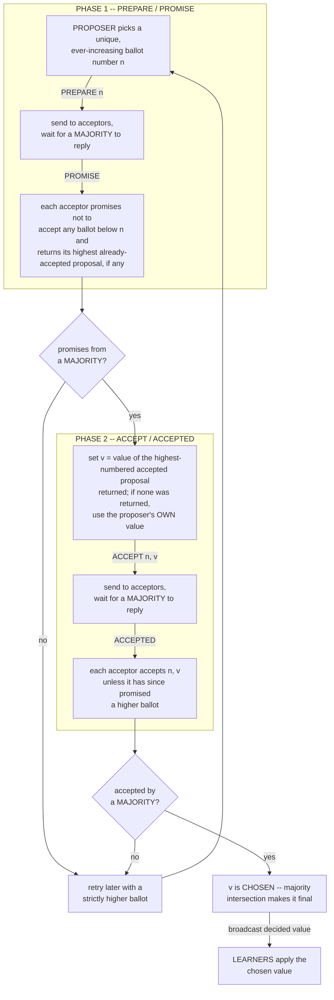

# 🏛️ Paxos

> [!abstract] TL;DR
> **Paxos** (Lamport, 1998) is the seminal algorithm for solving **consensus** — getting a set of unreliable machines to agree on one value — in an **asynchronous system with crash faults**, as long as a **majority** of nodes survive. Its power rests on two ideas working together: proposals carry **ever-increasing ballot numbers** so newer proposals preempt older ones, and **no value is chosen until a majority of acceptors have accepted it**. Because **any two majorities share at least one member**, that overlapping member "remembers" an earlier decision and forces every later proposer to re-propose the same value — which is why Paxos guarantees **agreement always**, even under arbitrary message loss, delay, and reordering. It only sacrifices **liveness** (progress) when the network misbehaves, sidestepping the [[FLP_Impossibility_Result|FLP impossibility]] via partial synchrony. Paxos is the historical backbone of replicated systems (Google Chubby, Spanner, Megastore) and the intellectual ancestor of [[Consensus_and_Raft|Raft]].

---

## Intuition

**Analogy:** Imagine a committee scattered across the world that must agree on **one** decision — say, the single date for a conference. There is no chairperson, members can drop offline at any moment, and messages travel by an unreliable courier who may lose, delay, duplicate, or reorder letters. **Anyone** may propose a date, and the group must never end up believing in **two different** dates. How do you guarantee that?

Paxos gives two rules that, together, make this bulletproof. **First**, every proposal is stamped with a **ballot number** that only ever goes up — a newer proposal outranks an older one, so stale letters that arrive late can never overwrite a fresher decision. **Second**, a date is only "**chosen**" once a **majority** of members have written it down. Now here is the whole trick: **any two majorities of the same committee must share at least one member**. So before you push a new proposal, you first ask a majority "*have you already written down a date?*" — and because your majority overlaps with any previous majority, at least one member **will tell you the date that was already chosen**, and you are then *obligated to propose that same date*. The shared member acts as the group's memory, and that single overlap is what makes it mathematically impossible for the committee to contradict itself.

Everything else in Paxos — the two phases, the promises, the retries — is just the careful machinery that enforces these two rules over a lossy network.

---

## How It Works

### The setting and the guarantees

Paxos solves consensus in an **asynchronous** system (no bounds on message delay or processing speed; see [[System_and_Timing_Models]]) subject to **crash — non-Byzantine — failures**: nodes may halt, and messages may be lost, delayed, reordered, or duplicated, but nobody lies. As long as **a majority of nodes are eventually up and reachable**, Paxos guarantees the three consensus properties (formalized in [[The_Consensus_Problem]]):

- **Validity** — the chosen value is one that some proposer actually proposed (nothing is invented).
- **Agreement** — no two nodes ever learn different chosen values. This holds in **every** execution, *always*, even during total network chaos.
- **Termination** — every non-faulty node eventually learns the chosen value — but **only when the network is well-behaved** (partial synchrony). Under adversarial timing Paxos may stall forever without ever violating agreement. This is exactly how it lives with the [[FLP_Impossibility_Result|FLP impossibility]]: it trades away *guaranteed* liveness to keep *unconditional* safety.

### The three roles

A Paxos deployment assigns nodes to three **roles**; a single physical node commonly plays all three at once.

- **Proposers** propose values and drive the protocol.
- **Acceptors** are the **memory** of the system. They vote on proposals, and **a majority of acceptors forms a quorum**. Acceptors hold all the durable state that makes Paxos safe.
- **Learners** find out which value was ultimately chosen and act on it (e.g. apply it to a replicated state machine).

### The two-phase protocol (single-decree "Synod")

Basic Paxos decides **one** value. Each acceptor keeps three pieces of state: the **highest ballot it has promised** (`promised`), and the **ballot and value of the last proposal it accepted** (`accepted_ballot`, `accepted_value`).

**Phase 1 — PREPARE / PROMISE.** A proposer picks a **unique, strictly increasing ballot number** `n` (a common trick is the pair `(round, server_id)`, which is unique and totally ordered — echoing [[Logical_Clocks_and_Happens_Before|logical-clock]] tie-breaking) and sends `PREPARE n` to the acceptors. An acceptor that has **not** already promised a *higher* ballot responds `PROMISE`: it vows never again to accept anything numbered below `n`, and — crucially — it **returns the highest-numbered proposal it has already accepted** (if any). An acceptor that has promised something higher rejects the prepare.

**Phase 2 — ACCEPT / ACCEPTED.** If the proposer collects `PROMISE`s from a **majority** of acceptors, it moves to Phase 2. It must now choose the value `v`:
- If **any** promise reported an already-accepted proposal, the proposer is **forced** to adopt the value from the one with the **highest** accepted ballot.
- Only if **no** acceptor reported an accepted value may the proposer use **its own** value.

It then sends `ACCEPT n, v`. An acceptor accepts `(n, v)` — recording it as its latest accepted proposal — **unless** it has meanwhile promised a higher ballot. Once a **majority** of acceptors have accepted `(n, v)`, the value `v` is **CHOSEN**. Learners are then informed, and the decision is permanent.

### Why it is safe: the majority-intersection invariant

This is the crux of Paxos, and it is worth stating precisely. **Any two majorities of the same set of acceptors intersect in at least one acceptor** (two subsets each larger than half the whole must share an element). Suppose value `v` was chosen at ballot `n` — meaning a majority `Q1` accepted `(n, v)`. Now consider *any* later proposer running Phase 1 with a higher ballot `m > n`, gathering promises from some majority `Q2`. Since `Q1` and `Q2` **share an acceptor**, and that acceptor had accepted `(n, v)`, it will **report `v` back in its promise**. The later proposer is therefore **forced to propose `v` again**. By induction over increasing ballots, *every* proposal numbered above `n` carries `v`, so no majority can ever accept a different value. **Agreement is preserved not by preventing concurrent proposers, but by making them converge.** Ballot numbers supply the total order that stops stale proposals from clobbering a decision; majority overlap supplies the memory that propagates it.

### The two-phase flow



### Liveness, dueling proposers, and Multi-Paxos

Paxos guarantees safety unconditionally, but **not** liveness. Two proposers can **duel**: `P1` prepares ballot 1, `P2` preempts with ballot 2, `P1`'s Phase-2 `ACCEPT` is rejected so it retries with ballot 3, which preempts `P2`, whose `ACCEPT` is then rejected, and so on **forever**. No value is ever chosen. This **livelock** is [[FLP_Impossibility_Result|FLP]] made concrete — safety intact, progress starved. The standard fix is to elect a **distinguished proposer / leader** so that, in the common case, only one proposer is active (see [[Leader_Election]]).

Single-decree Paxos decides one value; real systems need to agree on a **sequence** of commands. **Multi-Paxos** runs a series of Paxos **instances**, one per log slot, to build a replicated **log** for state-machine replication (see [[Replication_Strategies]] and [[Reliable_and_Ordered_Broadcast]] — the total-order-broadcast abstraction the log implements). Its key optimization: once a leader is stable, it can run **Phase 1 just once** for all future slots and thereafter skip straight to Phase 2, amortizing consensus to a **single round-trip per command**. This is the practical form of Paxos that ships in production.

---

## Key Concepts

**Secondary (intuitive level)**
- Paxos is how a group of computers agrees on **one** decision when anyone can propose, messages get lost, and machines crash.
- Two rules make it safe: proposals carry **numbers that only go up** (newer wins), and a decision is final only after **more than half** the machines accept it.
- Because **any two "more-than-half" groups overlap**, a shared machine always remembers an earlier decision and stops the group from contradicting itself.

**Undergraduate (mechanism level)**
- The three **roles**: proposers, acceptors (the durable memory / quorum), learners.
- The **two phases**: `PREPARE`/`PROMISE` (reserve a ballot and read back any accepted value) then `ACCEPT`/`ACCEPTED` (commit a value); a value is **chosen** once a majority accepts it.
- **Ballot numbers** as unique, totally ordered proposal ids `(round, server_id)`; higher ballots **preempt** lower ones.
- The rule that a proposer **must adopt the highest-numbered previously-accepted value**, using its own value only when none exists.
- **Majority = quorum**; correctness needs at most `f` crashes out of `2f + 1` acceptors.

**Graduate (research level)**
- The **majority-intersection invariant** as the formal safety argument, proved by induction over ballots (any Phase-2 quorum overlaps any earlier accepting quorum).
- Why Paxos circumvents **FLP**: safety is a property of *reachable states* and holds under pure asynchrony, while termination requires **partial synchrony** plus an eventual single leader (equivalently, an `Ω` leader oracle / `◇S` failure detector, per Chandra–Toueg).
- **Multi-Paxos** and the leader-lease optimization; the equivalence of the Phase-1 "prepare for all future slots" to a leader claiming ownership of the log.
- The Paxos **family**: Fast Paxos (fewer round-trips at the cost of larger quorums), Cheap Paxos, Generalized Paxos, **Flexible Paxos** (Phase-1 and Phase-2 quorums need only *intersect*, not both be majorities), and **EPaxos** (leaderless, exploits command commutativity).
- Reconfiguration (changing the acceptor set) and the subtle interplay with the majority invariant during membership change.

---

## Python Demo

A from-scratch single-decree Paxos. There are `N` acceptors holding `(promised, accepted_ballot, accepted_value)`; a proposer runs Phase 1 (`PREPARE n → PROMISE`, returning any previously accepted value) then Phase 2 (`ACCEPT n, v → ACCEPTED`), each requiring a **majority** quorum. We drive message delivery by hand to stage three scenarios and prove **safety**: (a) a single proposer chooses a value; (b) two concurrent proposers with interleaved ballots — the later ballot is **forced** by an overlapping acceptor to adopt the value a majority already accepted, so both converge on the **same** value; (c) dueling proposers **livelock**, motivating a leader. Two matplotlib panels visualize the message exchange and the majority-intersection property. Pure stdlib plus matplotlib; numpy not required.

```python
"""
Single-decree Paxos -- the Synod protocol -- from scratch.

N acceptors, crash (non-Byzantine) model.  We deliver messages by hand so we
can stage the subtle interleavings that make Paxos safe.  We demonstrate:

  (a) SINGLE PROPOSER   -> a value is chosen in two round-trips.
  (b) TWO CONCURRENT PROPOSERS with interleaved ballots -> the LATER ballot is
      FORCED, by a promise carrying an already-accepted value, to re-propose the
      value a majority already accepted.  Both proposers end on the SAME value:
      agreement is preserved.  This is the majority-intersection invariant.
  (c) DUELING PROPOSERS -> they preempt each other forever; no value is ever
      chosen (LIVELOCK).  Safety holds, liveness does not -- the reason real
      systems elect a distinguished leader (Multi-Paxos).

Pure stdlib for the protocol; matplotlib for the two visualizations.
"""

import matplotlib.pyplot as plt
from matplotlib.patches import Ellipse

# Ballots are (round, proposer_id) tuples: unique and totally ordered.
# Tuple comparison gives exactly "higher round wins, ties broken by id".


class Acceptor:
    """The 'memory' of Paxos: what it promised and what it last accepted."""

    def __init__(self, aid):
        self.aid = aid
        self.promised = None          # highest ballot promised   (Phase 1)
        self.accepted_ballot = None   # ballot of last accepted proposal
        self.accepted_value = None    # value  of last accepted proposal

    def prepare(self, n):
        """Phase 1: promise not to accept below n; report any accepted value."""
        if self.promised is None or n > self.promised:
            self.promised = n
            return ("PROMISE", self.accepted_ballot, self.accepted_value)
        return ("NACK", self.promised, None)

    def accept(self, n, v):
        """Phase 2: accept (n, v) unless a higher ballot was promised."""
        if self.promised is None or n >= self.promised:
            self.promised = n
            self.accepted_ballot = n
            self.accepted_value = v
            return ("ACCEPTED", n, v)
        return ("NACK", self.promised, None)


def majority(acceptors):
    return len(acceptors) // 2 + 1


def phase1(quorum, n):
    """Send PREPARE n to a quorum; collect the promises."""
    promises = []
    for a in quorum:
        tag, ab, av = a.prepare(n)
        if tag == "PROMISE":
            promises.append((a.aid, ab, av))
    return promises


def pick_value(promises, own_value):
    """Adopt the value of the highest-numbered accepted proposal, else own."""
    seen = [(ab, av) for _, ab, av in promises if ab is not None]
    if seen:
        _, v = max(seen, key=lambda t: t[0])   # highest accepted ballot wins
        return v, True                          # FORCED to adopt
    return own_value, False                     # free to use own value


def phase2(quorum, n, v):
    """Send ACCEPT (n, v) to a quorum; return the acceptors that accepted."""
    return [a for a in quorum if a.accept(n, v)[0] == "ACCEPTED"]


# ---------------------------------------------------------------------------
# (a) SINGLE PROPOSER
# ---------------------------------------------------------------------------
print("=== (a) single proposer ===")
accs = [Acceptor(i) for i in range(3)]        # A0, A1, A2
n = (1, "P1")
promises = phase1(accs, n)                     # all promise, none accepted
v, forced = pick_value(promises, own_value="X")
accepted = phase2(accs[: majority(accs)], n, v)
print(f"  proposed value={v!r} forced={forced} "
      f"chosen={len(accepted) >= majority(accs)}\n")

# ---------------------------------------------------------------------------
# (b) TWO CONCURRENT PROPOSERS with interleaved ballots -> forced agreement
# ---------------------------------------------------------------------------
print("=== (b) two concurrent proposers, interleaved ballots ===")
accs = [Acceptor(i) for i in range(3)]         # A0, A1, A2

# P1 (ballot (1,P1), wants RED) completes BOTH phases on the majority {A0, A1}
n1 = (1, "P1")
p1_promises = phase1(accs, n1)                  # prepare all three
v1, _ = pick_value(p1_promises, own_value="RED")
phase2([accs[0], accs[1]], n1, v1)              # {A0,A1} accept -> RED CHOSEN
print(f"  P1 runs Phase 2 on quorum {{A0,A1}}: value={v1!r}  "
      "-> RED is now CHOSEN by a majority")

# P2 (higher ballot (2,P2), WANTS BLUE) uses the OVERLAPPING majority {A1, A2}
n2 = (2, "P2")
q2 = [accs[1], accs[2]]                          # shares A1 with P1's quorum
p2_promises = phase1(q2, n2)                     # A1 returns accepted (n1, RED)
v2, forced2 = pick_value(p2_promises, own_value="BLUE")
print(f"  P2 WANTED 'BLUE' but its Phase-1 promises forced value={v2!r} "
      f"(forced={forced2})")
phase2(q2, n2, v2)                               # {A1,A2} accept -> RED again
assert v1 == v2 == "RED", "SAFETY VIOLATION -- proposers disagree!"
print("  AGREEMENT preserved: both proposers chose RED because the shared\n"
      "  acceptor A1 remembered it and reported it back to P2.\n")

# ---------------------------------------------------------------------------
# (c) DUELING PROPOSERS -> livelock (safety kept, liveness lost)
# ---------------------------------------------------------------------------
print("=== (c) dueling proposers -> livelock ===")
accs = [Acceptor(i) for i in range(3)]
chosen = False
rnd = 1
for _ in range(5):
    nA = (rnd, "P1"); phase1(accs, nA); rnd += 1   # P1 prepares
    nB = (rnd, "P2"); phase1(accs, nB); rnd += 1   # P2 PREEMPTS before P1 commits
    stale = phase2(accs, nA, "RED")                # P1's ACCEPT is now too old
    got = len(stale) >= majority(accs)
    print(f"  P1 tries ACCEPT {nA} after P2 preempted -> majority accepted? {got}")
    if got:
        chosen = True
        break
print(f"  value ever chosen? {chosen}   (safety intact, liveness starved)\n")

# ===========================================================================
# VISUALIZATION
# ===========================================================================
fig, (axL, axR) = plt.subplots(1, 2, figsize=(15, 6))

# ---- Left: message exchange for scenario (b) ----
lane = {"P1": 0, "A0": 1, "A1": 2, "A2": 3, "P2": 4}
for name, x in lane.items():
    axL.plot([x, x], [0.6, -5.4], color="0.85", lw=1, zorder=0)   # lifelines
    axL.text(x, 0.9, name, ha="center", fontweight="bold")


def msg(row, src, dsts, label, color):
    y = -row
    for d in dsts:
        axL.annotate("", (lane[d], y), (lane[src], y),
                     arrowprops=dict(arrowstyle="->", color=color, lw=1.8))
    axL.text(-0.2, y, label, ha="right", va="center", fontsize=8.5, color=color)


msg(0, "P1", ["A0", "A1", "A2"], "P1 PREPARE b=1", "0.45")
msg(1, "P1", ["A0", "A1"],       "P1 ACCEPT 1,RED", "tab:red")
msg(2, "P2", ["A1", "A2"],       "P2 PREPARE b=2", "0.45")
msg(3, "A1", ["P2"],             "A1 PROMISE -> RED", "tab:red")
msg(4, "P2", ["A1", "A2"],       "P2 ACCEPT 2,RED", "tab:red")

axL.text(4.55, -1, "RED chosen by\nmajority {A0,A1}", color="tab:red",
         fontsize=8.5, ha="left", va="center")
axL.text(4.55, -3, "shared acceptor A1\nFORCES P2 to RED", color="tab:red",
         fontsize=8.5, ha="left", va="center")
axL.text(4.55, -4.3, "same value:\nAGREEMENT", color="tab:red",
         fontsize=8.5, ha="left", va="center")
axL.set_xlim(-1.9, 6.4)
axL.set_ylim(-5.6, 1.5)
axL.axis("off")
axL.set_title("Two concurrent proposers: the later ballot is forced to RED",
              fontweight="bold")

# ---- Right: any two majorities intersect -> overlap carries the value ----
pos = {"A0": (0.0, 0.0), "A1": (1.0, 0.0), "A2": (2.0, 0.0)}
axR.add_patch(Ellipse((0.5, 0.0), 2.0, 1.1, alpha=0.20, color="tab:red"))
axR.add_patch(Ellipse((1.5, 0.0), 2.0, 1.1, alpha=0.20, color="tab:blue"))
for name, (x, y) in pos.items():
    axR.plot(x, y, "o", ms=16, color="0.3", zorder=3)
    axR.text(x, y - 0.32, name, ha="center", fontweight="bold")
axR.plot(1.0, 0.0, "o", ms=16, color="tab:red", zorder=4)     # the shared node
axR.annotate("A1 is in BOTH majorities:\nit remembers RED and\nreports it to P2",
             (1.0, 0.0), (1.0, 0.9), ha="center", fontsize=9, color="tab:red",
             arrowprops=dict(arrowstyle="->", color="tab:red"))
axR.text(0.0, -0.85, "Quorum 1 = {A0,A1}\nchose RED", ha="center",
         color="tab:red", fontsize=9)
axR.text(2.0, -0.85, "Quorum 2 = {A1,A2}\nP2's quorum", ha="center",
         color="tab:blue", fontsize=9)
axR.set_xlim(-1.4, 3.4)
axR.set_ylim(-1.35, 1.6)
axR.axis("off")
axR.set_title("Any two majorities intersect -> the overlap carries the value",
              fontweight="bold")

fig.suptitle("Single-decree Paxos: majority intersection guarantees agreement",
             fontweight="bold", fontsize=13)
fig.tight_layout()
plt.savefig("paxos_safety.png", dpi=120)
print("saved paxos_safety.png")
```

**What you observe.** Scenario (a) chooses `X` in two round-trips with `forced=False` (no prior value existed). Scenario (b) is the heart of Paxos: `P2` *wanted* `BLUE`, but because its Phase-1 quorum `{A1, A2}` overlaps `P1`'s accepting quorum `{A0, A1}` at `A1`, the promise from `A1` carries `RED`, and `pick_value` **forces `P2` to propose `RED`**. The `assert` proving `v1 == v2` never fires — agreement is structural, not lucky. Scenario (c) shows the flip side: with two proposers leap-frogging ballots, every Phase-2 `ACCEPT` arrives already preempted, `chosen` stays `False`, and no value is ever decided — the livelock that a stable leader eliminates.

---

## Real-World Applications

> **Example — Google Chubby & Spanner.** Google's **Chubby** lock service replicates its state across five machines using a **Multi-Paxos** log: every write goes through Paxos so all replicas apply commands in the same order, and Chubby then exposes that agreement as coarse-grained locks and a tiny consistent filesystem that the rest of Google's infrastructure (GFS, Bigtable) uses for leader election and metadata. **Spanner** shards data into **Paxos groups**, each an independent Multi-Paxos state machine replicating one shard across datacenters; a group's leader holds a lease and commits writes at one round-trip in the steady state. Both are direct embodiments of "majority-quorum + ballot numbers."

- **Google Megastore, Chubby, Spanner** — replicated logs and locks built on Paxos / Multi-Paxos.
- **Microsoft Azure Storage** and **Amazon** internal systems have used Paxos-family protocols for strongly consistent metadata and replication.
- **Apache ZooKeeper** uses **Zab**, a Paxos-like atomic broadcast protocol serving the same role (leader-based, majority-quorum replicated log) — see [[Distributed_Locks]] and [[Consensus_and_Quorums]].
- **State-machine replication in general** — any system needing a linearizable replicated log (config stores, coordination services, distributed databases) is running Paxos or its cousin [[Consensus_and_Raft|Raft]]; see [[Replication_Strategies]] and [[Distributed_Operating_Systems]].

---

## Common Pitfalls

- **Assuming Paxos guarantees progress.** It does not. Safety is unconditional, but liveness needs a **single active proposer** during good network periods. Deploying "leaderless" basic Paxos under contention invites livelock. Elect a distinguished leader (see [[Leader_Election]]).
- **Non-unique or non-monotonic ballot numbers.** If two proposers can generate the *same* ballot, or a proposer reuses an old number, the ordering that underpins safety collapses. Always use globally unique, strictly increasing ids such as `(round, server_id)`.
- **Forgetting that a proposer must adopt the returned value.** The single most common bug: in Phase 2 a proposer pushes *its own* value even though a promise reported an accepted one. That directly breaks agreement. Own value is allowed **only** when no acceptor reported any accepted proposal.
- **Losing acceptor state on restart.** Acceptors are the durable memory; `promised` and `accepted_*` **must** be persisted to stable storage *before* replying. An acceptor that forgets a promise after a crash can accept a conflicting value and violate safety.
- **Using an even number of acceptors.** With `2f` acceptors you tolerate the same `f` failures as `2f - 1` but waste a node and enlarge quorums. Use `2f + 1` (an odd count) for the best failure tolerance per node.
- **Treating single-decree Paxos as the product.** Basic Paxos decides *one* value. A real replicated log needs **Multi-Paxos** with a stable leader; implementing the log, leader leases, and reconfiguration correctly is where most of the engineering effort (and most of the subtle bugs) actually live.

---

## Related Concepts

- [[The_Consensus_Problem]] — the formal agreement / validity / termination specification that Paxos implements; read it first to know exactly what "solving consensus" means.
- [[FLP_Impossibility_Result|FLP impossibility]] — the theorem that no deterministic asynchronous protocol can guarantee consensus with even one crash. Paxos's dueling-proposer livelock is FLP made concrete, and its leader is the escape hatch.
- [[System_and_Timing_Models]] — Paxos is safe under **asynchrony** but only terminates under **partial synchrony**; this note defines exactly that spectrum and the "safety always, liveness eventually" contract Paxos honors.
- [[Logical_Clocks_and_Happens_Before]] — ballot numbers `(round, server_id)` are a Lamport-style unique, totally ordered id; the same tie-breaking idea that turns a partial order into a total one.
- [[Leader_Election]] — electing a single distinguished proposer is Paxos's fix for livelock and the foundation of Multi-Paxos's steady-state efficiency.
- [[Reliable_and_Ordered_Broadcast]] — total-order broadcast is the abstraction a Multi-Paxos log implements; consensus and atomic broadcast are inter-reducible.
- [[Consensus_and_Raft]] — Raft offers the **same guarantees** as Multi-Paxos but was engineered for **understandability** with a strong leader and an explicit log; most new systems pick Raft, which is Paxos's most influential descendant.
- [[Consensus_and_Quorums]] — the database-side view of majority quorums and consensus; the read/write-quorum framing generalizes Paxos's majority-intersection invariant.
- [[Replication_Strategies]] — Multi-Paxos exists to build a **replicated log** for state-machine replication; this note surveys the replication landscape Paxos powers.
- [[Failure_Models]] — Paxos assumes **crash (non-Byzantine)** faults; tolerating lying nodes requires BFT protocols and larger `3f + 1` quorums.
- [[Message_Passing_and_RPC_Semantics]] — Paxos runs over lossy, reordering channels; its idempotent, retry-driven message handling is why it survives at-least-once delivery.
- [[Distributed_Systems_Overview]] and [[Vector_Clocks_and_Causality]] — the broader model and ordering machinery this vault builds Paxos on top of.

*Companion notes planned for this vault — **Quorum Systems** (the general theory of intersecting quorums) and **Replication Models** (the state-machine-replication framing) — extend the machinery introduced here.*

---

## Review Questions

1. **(Undergraduate)** State the two rules that make Paxos safe (increasing ballot numbers and majority acceptance) and explain, using the majority-intersection property, why a proposer running Phase 1 with a higher ballot can *never* miss a value that was already chosen. What exactly does the shared acceptor contribute?
2. **(Scenario)** A value `RED` was chosen by the majority `{A0, A1}` at ballot `(1, P1)`. A new proposer `P2` with ballot `(2, P2)` runs Phase 1 against the majority `{A1, A2}` and wants to propose `BLUE`. Walk through what each acceptor replies, what value `P2` is obligated to propose in Phase 2, and why the final outcome preserves agreement. Which single acceptor made this guarantee, and what would break if acceptors forgot their accepted value on restart?
3. **(Graduate / trade-off)** Paxos guarantees safety unconditionally but can livelock. (a) Explain precisely how two dueling proposers cause non-termination and why this does *not* contradict any safety property. (b) Relate this to the FLP impossibility. (c) A colleague proposes fixing liveness by adding a distinguished leader, and separately asks why the team might adopt Raft instead of Multi-Paxos even though both give identical guarantees. Address both — what does the leader buy, and on what axis does Raft actually differ from Paxos?

---

## Sources

- Leslie Lamport, "The Part-Time Parliament," *ACM Transactions on Computer Systems* 16(2), 1998 — the original Paxos paper (the Synod). [PDF](https://lamport.azurewebsites.net/pubs/lamport-paxos.pdf)
- Leslie Lamport, "Paxos Made Simple," *ACM SIGACT News* 32(4), 2001 — the shorter, widely cited exposition. [PDF](https://lamport.azurewebsites.net/pubs/paxos-simple.pdf)
- Tushar Chandra, Robert Griesemer, Joshua Redstone, "Paxos Made Live — An Engineering Perspective," *PODC 2007* — how Google actually built Chubby on Paxos, and everything the papers omit. [PDF](https://static.googleusercontent.com/media/research.google.com/en//archive/paxos_made_live.pdf)
- Diego Ongaro & John Ousterhout, "In Search of an Understandable Consensus Algorithm (Raft)," *USENIX ATC 2014* — the Raft paper, whose motivation is that Paxos is hard to understand. [PDF](https://raft.github.io/raft.pdf)
- Robbert van Renesse & Deniz Altinbuken, "Paxos Made Moderately Complex," *ACM Computing Surveys* 47(3), 2015 — a rigorous, implementable treatment of Multi-Paxos. [PDF](https://www.cs.cornell.edu/home/rvr/Paxos/paxos.pdf)

---

#distributed-systems #paxos #consensus #quorums #multi-paxos
