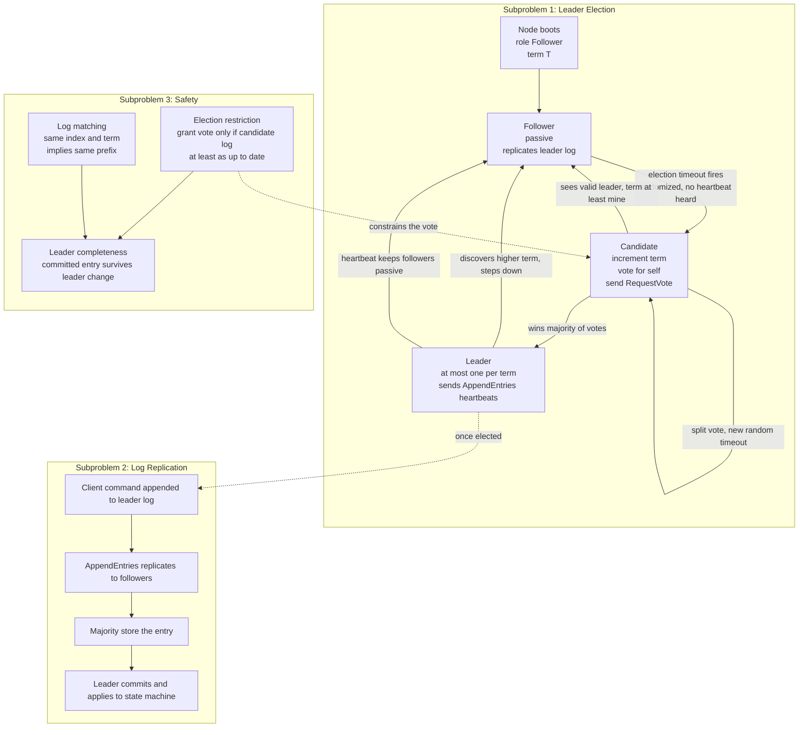

# 🛶 Raft Consensus

> [!abstract] TL;DR
> **Paxos is correct but notoriously hard to understand and implement**, so Ongaro and Ousterhout (2014) redesigned crash-tolerant consensus around a single explicit goal — **understandability**. Raft decomposes the problem into three independent subproblems (**leader election, log replication, safety**), elects **at most one leader per term**, and routes *all* client requests through that leader, which is the single source of truth for a **replicated log**. An entry is **committed once a majority replicate it**; a randomized election timeout picks a new leader when the old one dies; **newer terms always win**. Same safety/liveness as Multi-Paxos, far clearer structure — which is why it became the default for etcd, Consul, TiKV, and CockroachDB.

---

## Intuition

**Analogy:** Picture a committee that must keep one shared, append-only notebook perfectly in sync across five members, even though members occasionally faint and messengers occasionally get lost. Instead of letting everyone scribble at once (chaos, contradictions), the committee elects **one chairperson**. Only the chair writes new lines; every member copies exactly what the chair dictates. A line is considered **official** only once **a majority of members have copied it into their own notebook** — so it can never be lost even if the chair faints. If the chair goes silent for a while, whoever gets bored first (a **randomized** wait, so they rarely stand up at the same instant) calls a fresh vote and says "I'll chair the *next* session." Crucially, the committee **refuses to elect a chair whose notebook is behind** — that single rule is what guarantees no official line is ever forgotten across chair changes.

That is Raft almost exactly. The chairperson is the **leader**; a "session" is a **term** (a monotonically increasing integer that acts as a logical clock); "dictating lines" is **log replication**; "a majority copied it" is **commit**; the randomized boredom is the **election timeout**; and "never elect a behind chair" is the **election restriction** that underpins safety. Where Paxos hands you a symmetric pile of proposers and acceptors and leaves the log protocol as an exercise, Raft prescribes the strong leader, the terms, and the log rules explicitly — trading Paxos's generality for a protocol a working engineer can actually implement correctly.

---

## How It Works

Raft solves **exactly the same problem** as Multi-Paxos — get a cluster of nodes to agree on an ever-growing, totally-ordered **log** of commands so that every replica applies the same commands in the same order (state-machine replication) — but it is deliberately factored into three parts you can reason about one at a time.

### The strong-leader model

Unlike Paxos's symmetric proposers, Raft has **at most one leader per term**. The leader is the *single source of truth* for the log: all client requests go to it, it appends them to its own log, and entries flow in **only one direction — leader to followers**. Followers are passive; they never accept writes from clients and never talk to each other about log content. This single asymmetry collapses an enormous amount of the state space that makes Paxos hard to reason about: there is never a moment where two peers are independently proposing conflicting values at the same log index within a term.

### Terms as a logical clock

Time is divided into **terms**, numbered with monotonically increasing integers. Each term begins with an election. Terms are Raft's [[Logical_Clocks_and_Happens_Before|logical clock]] for detecting stale leaders: every RPC carries the sender's term, and the rule is uniform and ruthless —

- a message with an **older** term is **rejected**;
- a node that **sees a higher term** immediately **steps down to follower** and adopts that term.

Because at most one leader is elected per term, "which leader is authoritative" reduces to "who has the highest term," and split-brain writes are impossible.

### Subproblem 1 — Leader election

Followers expect periodic **heartbeats** (empty AppendEntries) from the leader. If a follower hears nothing for a **randomized election timeout**, it assumes the leader is dead, transitions to **candidate**, increments its term, votes for itself, and sends **RequestVote** RPCs to all peers. A node grants its vote for a given term to **at most one** candidate, and *only if* the candidate's log is **at least as up-to-date** as its own (the election restriction — this is where safety is enforced). A candidate that collects a **majority** of votes becomes **leader** and starts sending heartbeats to suppress further elections. **Randomizing** the timeout is the trick that makes split votes rare: nodes rarely time out simultaneously, so usually one candidate gets a head start and wins before others wake up.

### Subproblem 2 — Log replication

When a client sends a command, the leader appends it to its log as a new entry `(term, command)` and issues **AppendEntries** RPCs to replicate it. Once a **majority** of the cluster (including the leader) have stored the entry, the leader marks it **committed**, applies it to its state machine, and returns success to the client; followers apply it once they learn the commit index (piggybacked on later AppendEntries). The same AppendEntries RPC doubles as the **heartbeat**, so replication and leader liveness share one mechanism.

### Subproblem 3 — Safety

Raft guarantees five properties; the load-bearing ones are:

1. **Election Safety** — at most one leader per term.
2. **Log Matching** — if two logs contain an entry with the same index *and* term, then all preceding entries are identical. Maintained by an AppendEntries **consistency check**: the RPC includes the index/term of the entry preceding the new ones, and a follower rejects it unless that predecessor matches, forcing the leader to **backtrack** and repair divergent tails.
3. **Leader Completeness** — every committed entry appears in the logs of all future leaders. Enforced by the **election restriction**: a candidate lacking a committed entry cannot win, because the majority that holds that entry will refuse to vote for a less-up-to-date log.
4. **State Machine Safety** — no two nodes ever apply *different* commands at the same log index.

A new leader **repairs** followers by overwriting their conflicting **uncommitted** tail to match its own log; **committed** entries are never overwritten, precisely because Leader Completeness guarantees the new leader already has them.

### State transitions and the three subproblems



### Beyond the core

- **Membership changes** use **joint consensus**: the cluster transitions through a combined old-plus-new configuration so that no two disjoint majorities can ever elect separate leaders during reconfiguration — safe dynamic add/remove without split-brain.
- **Log compaction** via **snapshots** bounds the log: state is periodically snapshotted and the prefix discarded, so logs do not grow forever.

### Paxos vs Raft

They provide **equivalent guarantees** — safe *always* (even under asynchrony and partitions) and *live* under partial synchrony. Raft is essentially **Multi-Paxos with a prescriptive election and log protocol**: the deep Paxos machinery (majority quorums, ballots/terms, the constraint that a new leader must adopt already-chosen values) is repackaged as a strong-leader protocol with a canonical structure. You give up Paxos's generality and flexibility; you gain a design mainstream engineers can implement correctly.

---

## Key Concepts

### 🟢 Secondary (explain to a junior)
- A cluster keeps a shared, append-only **log**; every machine must end up with the *same* log so they all behave identically.
- One machine is elected **leader**. Only the leader adds new entries; everyone else copies it.
- An entry is **official (committed)** once **more than half** the machines have it — then it can survive any single failure.
- If the leader stops responding, machines wait a **random** amount of time and then hold a new election, so a new leader takes over.

### 🟡 Undergraduate (needs CS background)
- **Terms** are a monotonically increasing integer clock; higher term wins, older-term messages are rejected, and there is **at most one leader per term**.
- **Roles:** follower → candidate (on election timeout) → leader (on majority vote). **RequestVote** and **AppendEntries** are the only two RPCs.
- **Commit rule:** an entry is committed when a **majority** (quorum `N/2 + 1`) have replicated it; quorum overlap guarantees any two majorities share a node, so committed data is never lost to a minority failure.
- **Randomized election timeouts** make simultaneous candidacies (split votes) rare, giving liveness in practice.

### 🔴 Graduate (system-level thinking)
- Raft cannot escape **FLP**: no deterministic protocol guarantees termination in a fully asynchronous system with even one crash. Raft is **always safe** but only **live under partial synchrony** — a persistently adversarial network (repeated timeouts) can starve elections forever. Randomized timeouts are the pragmatic route around FLP, just as they are for Paxos.
- The **election restriction** is the crux of correctness: it is Raft's encoding of the Paxos invariant that a new leader must not contradict an already-chosen value. Proving **Leader Completeness** from it (a committed entry is on a majority; any winning candidate needs votes from a majority; two majorities intersect; the intersecting voter refuses less-up-to-date candidates) is the heart of the safety argument.
- Raft only commits entries **from the current term** by counting replicas; a leader must *not* directly commit an inherited older-term entry on a majority count alone (Figure 8 in the paper) — it commits older entries indirectly once a current-term entry above them commits. This subtle rule is a classic implementation pitfall.
- Raft's log is **total-order broadcast** built on a leader plus terms; contrast with a leaderless quorum store using [[Vector_Clocks_and_Causality|version vectors]], which detects rather than prevents divergence.

---

## Python Demo

A pure-stdlib simulation of a **5-node Raft cluster** with real mechanics — roles, **terms**, **randomized election timeouts**, **RequestVote** and **AppendEntries** RPCs, a replicated **log**, and **commit-on-majority**. It demonstrates all three requested scenarios and visualizes them with matplotlib:

- **(a)** a normal election, then a client entry **committed once a majority store it**;
- **(b)** the leader **crashes** → randomized timeouts fire → a **new leader is elected in a higher term**;
- **(c)** the **safety property**: the previously-committed entry is present in the new leader's log (Leader Completeness via the election restriction).

```python
"""
Simplified Raft consensus on a 5-node cluster (pure stdlib) + matplotlib.

Real mechanics implemented:
  * roles follower / candidate / leader, monotonic TERMS
  * randomized election timeouts (split-vote avoidance)
  * RequestVote RPC   -> vote at most once per term, ONLY if candidate log
                         is at least as up-to-date (the ELECTION RESTRICTION)
  * AppendEntries RPC  -> leader replicates its log; also the heartbeat
  * commit-on-MAJORITY, then propagate the commit index to followers

Scenarios: (a) election + majority commit, (b) leader crash -> higher-term
re-election, (c) committed entry survives the leader change (Leader Completeness).
"""

import random
import matplotlib.pyplot as plt
from matplotlib.patches import Patch, Rectangle

random.seed(42)

N = 5
MAJORITY = N // 2 + 1          # = 3
FOLLOWER, CANDIDATE, LEADER = "follower", "candidate", "leader"
HEARTBEAT = 3                  # leader broadcasts every 3 ticks
TMIN, TMAX = 6, 12             # randomized election timeout window (ticks)


class Node:
    def __init__(self, nid):
        self.id = nid
        self.term = 0
        self.voted_for = None
        self.log = []           # list of (term, command)
        self.commit = 0         # count of committed entries (1-based prefix length)
        self.role = FOLLOWER
        self.alive = True
        self.clock = 0          # ticks since last heartbeat / vote reset
        self.timeout = random.randint(TMIN, TMAX)

    def last_index(self):
        return len(self.log)

    def last_term(self):
        return self.log[-1][0] if self.log else 0

    # ---- RequestVote RPC (receiver side) ----
    def handle_request_vote(self, cand_term, cand_id, cand_last_idx, cand_last_term):
        if cand_term < self.term:                      # stale candidate
            return self.term, False
        if cand_term > self.term:                      # newer term -> step down
            self.term, self.voted_for, self.role = cand_term, None, FOLLOWER
        # ELECTION RESTRICTION: candidate log must be at least as up-to-date
        up_to_date = (cand_last_term > self.last_term() or
                      (cand_last_term == self.last_term() and
                       cand_last_idx >= self.last_index()))
        if self.voted_for in (None, cand_id) and up_to_date:
            self.voted_for, self.clock = cand_id, 0
            return self.term, True
        return self.term, False

    # ---- AppendEntries RPC (receiver side) ----
    def handle_append_entries(self, leader_term, entries, leader_commit):
        if leader_term < self.term:                    # stale leader -> reject
            return self.term, False
        self.term, self.role, self.voted_for, self.clock = leader_term, FOLLOWER, None, 0
        # Simplified log repair: adopt the leader's log (overwrites conflicting
        # UNCOMMITTED tail; committed entries always match by Leader Completeness).
        self.log = list(entries)
        self.commit = min(leader_commit, len(self.log))
        return self.term, True


class Cluster:
    def __init__(self):
        self.nodes = [Node(i) for i in range(N)]
        self.tick = 0
        self.history = []              # per-tick snapshots for plotting
        self.leader_changes = []       # (tick, leader_id, term)

    def current_leader(self):
        live = [n for n in self.nodes if n.alive and n.role == LEADER]
        return live[0] if live else None

    def start_election(self, cand):
        cand.term += 1
        cand.role, cand.voted_for, cand.clock = CANDIDATE, cand.id, 0
        cand.timeout = random.randint(TMIN, TMAX)
        votes = 1                                       # votes for self
        for other in self.nodes:
            if other is cand or not other.alive:
                continue
            _, granted = other.handle_request_vote(
                cand.term, cand.id, cand.last_index(), cand.last_term())
            votes += int(granted)
        if votes >= MAJORITY:
            cand.role = LEADER
            for other in self.nodes:                    # depose any stale leader
                if other is not cand and other.role == LEADER:
                    other.role = FOLLOWER
            self.leader_changes.append((self.tick, cand.id, cand.term))
        else:
            cand.role = FOLLOWER                         # lost -> retry after timeout

    def leader_broadcast(self, leader):
        replicas = 1                                     # leader has every entry
        for other in self.nodes:
            if other is leader or not other.alive:
                continue
            term, ok = other.handle_append_entries(leader.term, leader.log, leader.commit)
            if term > leader.term:                       # discovered higher term
                leader.term, leader.role = term, FOLLOWER
                return
            replicas += int(ok)
        # Commit rule: only entries from the LEADER'S CURRENT TERM, on a majority.
        if replicas >= MAJORITY:
            new_commit = leader.commit
            for idx, (t, _) in enumerate(leader.log):
                if t == leader.term:
                    new_commit = idx + 1
            leader.commit = max(leader.commit, new_commit)

    def client_submit(self, command):
        leader = self.current_leader()
        if leader:
            leader.log.append((leader.term, command))
            return True
        return False

    def step(self):
        self.tick += 1
        leader = self.current_leader()
        for n in self.nodes:                             # tick every live node's timer
            if n.alive:
                n.clock += 1
        if leader and self.tick % HEARTBEAT == 0:        # replication + heartbeat
            self.leader_broadcast(leader)
        for n in self.nodes:                             # at most one election per tick
            if n.alive and n.role != LEADER and n.clock >= n.timeout:
                self.start_election(n)
                break
        self._snapshot()

    def _snapshot(self):
        leader = self.current_leader()
        self.history.append({
            "tick": self.tick,
            "terms": [n.term for n in self.nodes],
            "leader": leader.id if leader else None,
        })

    def run_until_leader(self, budget):
        stop = self.tick + budget
        while self.current_leader() is None and self.tick < stop:
            self.step()
        return self.current_leader()


# ================= Scenario driver =================
cx = Cluster()

# (a) bootstrap -> first election
L1 = cx.run_until_leader(budget=40)
print(f"[a] election: node N{L1.id} became LEADER in term {L1.term} at tick {cx.tick}")

# (a) client commands replicate and commit on a majority
cx.client_submit("x=1")
cx.client_submit("y=2")
for _ in range(9):
    cx.step()
have_it = sum(1 for n in cx.nodes if len(n.log) >= L1.commit)
committed_cmds = [c for (_, c) in L1.log[:L1.commit]]
print(f"[a] replication: leader log={[c for _, c in L1.log]} commit_index={L1.commit}")
print(f"[a] commit-on-majority: committed prefix {committed_cmds} stored on "
      f"{have_it}/{N} nodes (majority = {MAJORITY})")

# (b) crash the leader
L1.alive, L1.role = False, FOLLOWER
crash_tick = cx.tick
print(f"[b] CRASH: leader N{L1.id} died at tick {crash_tick} (term {L1.term})")

# (b) randomized timeouts -> new leader in a higher term
L2 = cx.run_until_leader(budget=100)
assert L2 is not None, "no leader re-elected"
print(f"[b] re-election: node N{L2.id} became LEADER in term {L2.term} "
      f"(strictly higher than crashed term {L1.term})")
assert L2.term > L1.term and L2.id != L1.id

# new leader appends a current-term entry so inherited entries can commit
cx.client_submit("z=3")
for _ in range(9):
    cx.step()

# (c) SAFETY: every previously-committed entry is in the new leader's log
new_leader_cmds = [c for (_, c) in L2.log]
survived = all(cmd in new_leader_cmds for cmd in committed_cmds)
print(f"[c] safety: committed {committed_cmds} present in new leader N{L2.id} "
      f"log {new_leader_cmds}? {survived}")
assert survived, "Leader Completeness violated!"
print("[c] Leader Completeness holds: committed entries survived the leader change.")

# ================= Visualization =================
ticks = [h["tick"] for h in cx.history]
cluster_term = [max(h["terms"]) for h in cx.history]
cmap = plt.get_cmap("tab10")

fig, (axT, axL) = plt.subplots(2, 1, figsize=(12, 8),
                               gridspec_kw={"height_ratios": [1.1, 1.0]})

# --- Panel 1: term timeline + leadership intervals ---
for nid in range(N):
    bars, start = [], None
    for h in cx.history:
        if h["leader"] == nid and start is None:
            start = h["tick"]
        elif h["leader"] != nid and start is not None:
            bars.append((start, h["tick"] - start)); start = None
    if start is not None:
        bars.append((start, ticks[-1] - start + 1))
    if bars:
        axT.broken_barh(bars, (nid - 0.3, 0.6), facecolors=cmap(nid), alpha=0.65)
        axT.text(bars[0][0] + 0.1, nid, f"N{nid} leader", va="center", fontsize=8)

axT.axvline(crash_tick, color="red", ls="--", lw=1.6)
axT.text(crash_tick + 0.2, N - 0.7, "leader crash", color="red", fontsize=9)
axT.set_yticks(range(N)); axT.set_yticklabels([f"N{i}" for i in range(N)])
axT.set_ylabel("leadership (colored bars)"); axT.set_xlabel("tick")
axT.set_ylim(-0.6, N - 0.4)
axT.set_title("Raft: leader changes (bars) and TERM timeline (black step)")

axT2 = axT.twinx()
axT2.step(ticks, cluster_term, where="post", color="black", lw=2)
axT2.set_ylabel("term (black step line)")
axT2.set_ylim(0, max(cluster_term) + 1)

# --- Panel 2: final replicated logs + commit index per node ---
max_len = max(len(n.log) for n in cx.nodes)
for nid, n in enumerate(cx.nodes):
    for idx, (term, cmd) in enumerate(n.log):
        axL.add_patch(Rectangle((idx, nid - 0.4), 1, 0.8,
                                facecolor=cmap(term), edgecolor="black"))
        axL.text(idx + 0.5, nid, f"{cmd}\nT{term}", ha="center", va="center", fontsize=7)
    axL.plot([n.commit, n.commit], [nid - 0.45, nid + 0.45], color="green", lw=4)
    tag = "CRASHED" if not n.alive else ("LEADER" if n.role == LEADER else "follower")
    axL.text(-0.25, nid, f"N{nid}\n{tag}", ha="right", va="center", fontsize=8)

axL.set_xlim(-1.7, max_len + 0.3); axL.set_ylim(-0.6, N - 0.4)
axL.set_yticks([]); axL.set_xlabel("log index")
axL.set_title("Replicated logs (cells colored by term); green bar = commit index")
axL.legend(handles=[Patch(color="green", label="commit index (majority-acked prefix)")],
           loc="lower right")

plt.tight_layout()
plt.savefig("raft_simulation.png", dpi=120)
print("saved raft_simulation.png")
```

**Expected shape of the output** (seeded, so deterministic): scenario **(a)** prints a leader emerging in **term 1** and the prefix `['x=1', 'y=2']` committed once it sits on **5/5** nodes (well past the majority of 3). Scenario **(b)** crashes that leader and a **different** node wins the next election in a **strictly higher term** — because only nodes that already hold the committed prefix can gather a majority. Scenario **(c)** asserts that `['x=1', 'y=2']` is still present in the new leader's log: the **election restriction** made it impossible for a behind node to win, so **no committed entry is ever lost**. The figure's top panel shows the term step-climbing at each election and the leadership bar jumping to a new node at the red crash line; the bottom panel shows every live node's log converging to the leader's, with the green commit bar at an identical position across nodes (the crashed node frozen one entry short).

---

## Real-World Applications

- **etcd (Kubernetes' backing store):** the entire cluster state of Kubernetes — every Pod, Secret, and ConfigMap — lives in etcd, which uses Raft (`etcd/raft`) to keep an odd number of control-plane members consistent. A `kubectl apply` is ultimately a Raft-committed log entry. See [[Kubernetes_Core_Concepts]].
- **HashiCorp Consul & Nomad:** service discovery, health, and KV state are replicated with the widely-reused `hashicorp/raft` library; Consul's server quorum is a textbook 3-or-5-node Raft group.
- **TiKV / TiDB:** the distributed key-value layer shards data into **Regions**, each of which is an independent Raft group ("Multi-Raft"), giving horizontal scale on top of per-shard consensus.
- **CockroachDB:** every **range** of the keyspace is its own Raft group; strongly-consistent, geo-distributed SQL is built by running thousands of Raft instances in parallel.
- **MongoDB replica sets:** use a **Raft-like** election and oplog-replication protocol (protocol version 1) for automatic failover and majority write concern.
- **Kafka KRaft, RethinkDB, Redis Raft:** Kafka replaced its ZooKeeper dependency with a self-managed Raft metadata quorum (KRaft); the pattern "just embed a Raft library" is now the industry default for new fault-tolerant systems.

---

## Common Pitfalls

- **Committing inherited (older-term) entries by majority count.** A fresh leader must *not* declare an old-term entry committed merely because it now sits on a majority (the paper's Figure 8 scenario shows this can lose data). It may only count replicas for entries of its **own** term; older entries commit *indirectly* once a current-term entry above them commits. The demo's commit rule enforces exactly this.
- **Deterministic (non-randomized) election timeouts.** Fixed timeouts make nodes time out together, producing repeated **split votes** and a livelocked cluster that never elects a leader. Randomization is not optional — it is the liveness mechanism.
- **Even-sized clusters.** A 4-node cluster tolerates the same one failure as a 3-node cluster but is *more* likely to split votes and needs the same majority of 3. Always run an **odd** number of members.
- **Reads from a stale leader.** A partitioned old leader that has not yet learned it was deposed can serve **stale reads**. Correct systems require a leader to confirm leadership (heartbeat a quorum, use lease/ReadIndex) before answering a linearizable read.
- **Forgetting fsync / durable state.** `currentTerm`, `votedFor`, and the log must be **persisted before responding** to an RPC. Losing them on restart can elect two leaders in one term or resurrect discarded entries, breaking safety.
- **Unsafe reconfiguration.** Adding or removing nodes by simply editing the peer list can create two disjoint majorities. Use **joint consensus** (or the single-server-at-a-time change) so membership transitions can never split-brain.
- **Unbounded logs.** Without **snapshotting/compaction**, the log grows forever and restarts replay it all. Compaction is a first-class requirement, not an afterthought.

---

## Related Concepts

- [[Consensus_and_Raft]] — the System Design vault's practitioner-oriented companion to this note (interview framing, deployment sizing); read alongside for the applied view.
- [[Consensus_and_Quorums]] — how databases put Raft/quorum replication into practice (write concern, read repair); the majority-quorum overlap argument this note relies on.
- [[Logical_Clocks_and_Happens_Before]] — Raft's **terms** are a logical clock; the same "higher timestamp wins, detect staleness" idea, specialized to a single-leader protocol.
- [[Vector_Clocks_and_Causality]] — the *leaderless* alternative: detect divergence with version vectors instead of *preventing* it with a leader-imposed total order.
- [[Leader_Election]] — the standalone primitive Raft folds into subproblem 1; Raft's contribution is coupling election to the log via the up-to-date restriction.
- [[Replication]] / [[Replication_Strategies]] — Raft is the leader-based, strongly-consistent point on the replication-models spectrum (versus async primary-backup or multi-master).
- [[Failure_Models]] — Raft assumes the **crash-recovery** (fail-stop, non-Byzantine) model; it does *not* tolerate lying nodes, which is where BFT protocols like PBFT come in.
- [[System_and_Timing_Models]] — Raft is safe under asynchrony but needs **partial synchrony** for liveness; the timing model is why it can guarantee one but not the other.
- [[Distributed_Systems_Overview]] — situates consensus among the field's core problems.

> **Planned sibling notes in this new vault (referenced in prose above until they exist):** *The Consensus Problem* (the formal agreement/validity/termination spec Raft satisfies), *Paxos* / *Multi-Paxos* (the algorithm Raft was engineered to out-clarify), *FLP Impossibility Result* (why no deterministic protocol is both safe and live under full asynchrony), *Reliable and Ordered Broadcast* (total-order broadcast, which a Raft log implements), *Failure Detectors* (the ◇S abstraction underlying practical elections), *Quorum Systems* (the majority-intersection math), and *Byzantine Agreement and PBFT* (consensus without the crash-only assumption). Wire these as `[[wikilinks]]` once created.

---

## Review Questions

1. **(Undergraduate)** Explain why Raft commits an entry only after a **majority** replicate it, and prove informally that a committed entry can never be lost when a single node fails. Where does the "any two majorities intersect" property enter the argument?
2. **(Scenario)** A five-node Raft cluster commits entry `E` (leader plus two followers hold it), then the leader crashes. A follower that is **missing** `E` times out first and starts an election in a higher term. Walk through the RequestVote exchanges and explain, using the **election restriction**, why this node cannot become leader — and which nodes *can*. What Raft safety property does this uphold?
3. **(Graduate / trade-off)** Raft and Multi-Paxos offer equivalent guarantees. (a) Given FLP, what exactly does "safe always, live under partial synchrony" mean, and what does randomization buy you? (b) Why must a new leader avoid directly committing an *inherited* older-term entry on a majority count (the Figure 8 problem), and how does the current-term commit rule fix it? (c) When would you deliberately choose a **leaderless**, version-vector store over Raft, and what do you give up?

---

## Sources

- Diego Ongaro & John Ousterhout, "In Search of an Understandable Consensus Algorithm (Extended Version)," USENIX ATC 2014. https://raft.github.io/raft.pdf
- Diego Ongaro, "Consensus: Bridging Theory and Practice," PhD dissertation, Stanford University, 2014 — the full treatment incl. membership changes and log compaction. https://web.stanford.edu/~ouster/cgi-bin/papers/OngaroPhD.pdf
- The Raft website (paper list, implementations, and the interactive visualization). https://raft.github.io/
- "The Secret Lives of Data — Raft," a step-by-step animated walkthrough of election and replication. https://thesecretlivesofdata.com/raft/
- Martin Kleppmann, *Designing Data-Intensive Applications*, Ch. 9 "Consistency and Consensus" (total-order broadcast, leaders, and consensus). O'Reilly, 2017. https://dataintensive.net/

---

#distributed-systems #raft #consensus #replicated-log #leader-election
