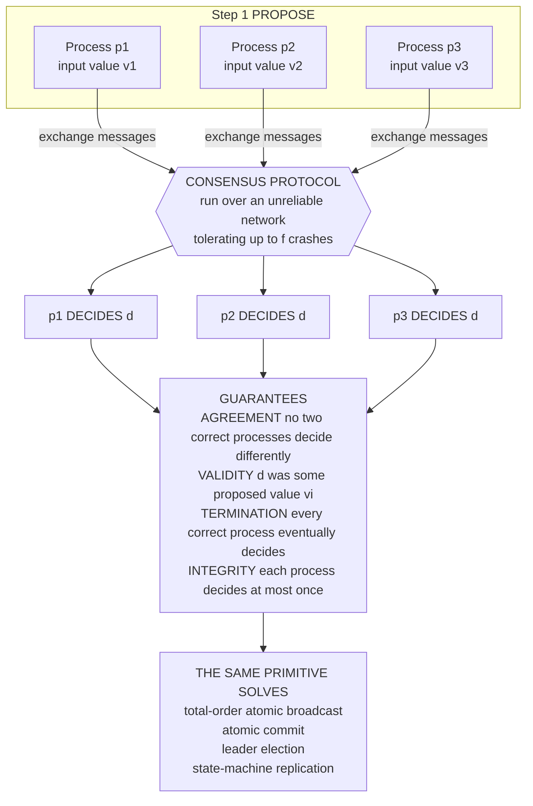

# 🤝 The Consensus Problem

> [!abstract] TL;DR
> **Consensus** is the problem of getting a set of processes — each starting with its own proposed value — to all **decide on a single common value**, despite crashes and an unreliable network. Its correctness is pinned down by four properties: **agreement** (no two correct processes decide differently), **validity** (the decision was actually proposed by someone), **termination** (every correct process eventually decides), and **integrity** (each decides at most once). Consensus is the **atom of coordination**: total-order broadcast, atomic commit, leader election, and state-machine replication are all *equivalent* to it, so solve consensus once and you can build almost any fault-tolerant system. It is **easy under synchrony** — solvable in `f + 1` rounds for `f` crashes — and **provably impossible under pure asynchrony** with even one crash. Understanding consensus *is* understanding distributed systems.

---

## Intuition

**Analogy:** Several generals surround a city, each in a separate camp. Every general has a private opinion — **attack** or **retreat** — but the army only wins if **all of them do the same thing**: a half-hearted, split assault is worse than either full option. They can coordinate only by sending messengers across enemy territory, where messengers arrive **late, get lost, or the general who sent them is captured mid-plan**. The generals must converge on **one shared decision**, and that decision must be one somebody genuinely proposed — they cannot pre-agree "always retreat," because then the meeting was pointless and validity is meaningless.

"Everyone ends up agreeing on the same single value, and that value was actually proposed by someone" sounds almost trivial when you say it out loud. Add crashes — a general who commits and then falls silent must not leave the others stuck or split — and an unreliable network where you **cannot tell a slow messenger from a dead one**, and this innocent-looking requirement becomes the single hardest and most important problem in distributed computing. Nearly every strongly-consistent system you use is, underneath, a machine for solving it.

---

## How It Works

### The formal problem

Each process `p_i` begins with an **input** value `v_i` and must eventually call `decide(d)` exactly once. The set of processes runs a protocol, exchanging messages over a network that may delay, drop, or reorder them, and some processes may **crash** and stop. A protocol *solves consensus* if and only if it guarantees all of the following in every execution the model permits:

1. **Agreement (safety).** No two **correct** processes decide different values. This is the property everything hinges on — a violation means two replicas believe two different things are true, i.e. split-brain, double-spend, two committed-but-conflicting transactions.
2. **Validity / non-triviality (safety).** The decided value must be one that was **proposed** by some process. This rules out the cheating "solution" of always deciding `0`: that would satisfy agreement trivially while making consensus useless. Validity forces the decision to *mean* something.
3. **Termination (liveness).** Every correct process eventually decides. Without it, "never decide" would satisfy both agreement and validity vacuously.
4. **Integrity.** Each process decides **at most once**, and only on a value that was actually proposed (a "no spontaneous decisions" clause).

The split matters enormously: **safety = agreement + validity + integrity** ("nothing bad ever happens"), and **liveness = termination** ("something good eventually happens"). This division is not academic hygiene — the deepest impossibility result in the field, *FLP*, attacks **termination** specifically. A correctly built protocol will *never* violate agreement; under bad timing it merely *stops deciding* until the network recovers. That is why the industry mantra is **"safety always, liveness eventually."**

### Why consensus is hard

Three adversaries conspire, and their *combination* — not any one alone — is what makes the problem deep:

- **Crashes.** A process can decide and then die. Its decision must not be lost in a way that lets a survivor decide differently, nor can the survivors block forever waiting for it.
- **Asynchrony.** With no bound on message delay, a live-but-slow process is **indistinguishable from a crashed one** (see *System_and_Timing_Models*). You cannot safely "give up" on a peer.
- **Adversarial timing.** An adversary that schedules message delivery can hold the system in an undecided state, exploiting the exact tension between *never disagree* (safety) and *always decide* (liveness).

Crash faults are the mild case; the *Byzantine* model — where faulty nodes may lie arbitrarily — is harder still and needs `N >= 3f + 1` replicas instead of the crash-tolerant `N >= 2f + 1` (see *Byzantine_Agreement_and_PBFT*).

### Consensus is the atom of coordination

Consensus's importance comes from a web of **equivalences** — solve any one of these and you can solve the rest by reduction:

- **Total-order (atomic) broadcast** — agree on a single global *order* of a stream of messages. This is just **repeated consensus**: run one consensus instance per slot in the log (see *Reliable_and_Ordered_Broadcast*).
- **Atomic commit** — a set of participants agree to *commit* or *abort* a transaction together. This is consensus with a validity twist: commit only if all vote yes (see *Atomic_Commitment* and [[Consensus_and_Quorums]]).
- **Leader election** — agree on *who* is in charge. Electing exactly one leader is deciding on a single value: an identifier (see *Leader_Election*).
- **State-machine replication** — the killer application, below.

Because they are interreducible, "consensus is the atom of coordination": build it once, correctly, and you can construct nearly any fault-tolerant service on top.

### State-machine replication: the killer app

Model your service as a **deterministic state machine**: given the same command in the same state, it always produces the same next state and output. Now use consensus to agree on a **totally-ordered log of commands**. Every replica applies the identical command sequence in the identical order, so all replicas traverse identical states and produce identical outputs. A minority of replicas can crash and the majority keeps serving — **fault tolerance falls out for free**. This is exactly how etcd, ZooKeeper, and Spanner survive machine failures, and it is why [[Consensus_and_Raft]] and Paxos are built the way they are (see *Replication_Models* and [[Replication_Strategies]]).

### Synchronous is easy; asynchronous is impossible

The timing model flips the answer completely:

- **Synchronous + crash faults → easy.** With a known bound on message delay, consensus is solvable in `f + 1` rounds for up to `f` crashes using a simple **flooding** algorithm (the Python demo). And `f + 1` is a **tight lower bound** — no crash-tolerant protocol can always finish faster.
- **Asynchronous + one crash → impossible.** The **FLP impossibility result** (Fischer, Lynch, Paterson, 1985) proves that no *deterministic* protocol can guarantee consensus in a purely asynchronous system if even a single process may crash. It is the most important negative result in the field. Real systems escape it not by breaking the theorem but by *weakening the model*: **partial synchrony** (Paxos, Raft), **unreliable failure detectors** (see *Failure_Detectors*), or **randomization** (Ben-Or). See *FLP_Impossibility_Result*.

### Flow: propose, exchange, decide, and what it unlocks



---

## Key Concepts

### Secondary (intuitive level)
- Consensus = a group of computers **all agreeing on one value**, even when some of them crash and messages get lost.
- The agreed value must be **something a computer actually suggested** — you cannot cheat by always saying "0."
- The hard part is not *agreeing*; it is agreeing **reliably despite failures and a network you cannot trust**.
- Solve consensus and you can build almost anything fault-tolerant on top of it — it is the foundation.

### Undergraduate (mechanism level)
- The **four properties**: agreement, validity, termination, integrity — and the **safety vs liveness** split that groups the first three against the last.
- **Equivalences**: total-order broadcast is *repeated* consensus; atomic commit, leader election, and state-machine replication all reduce to it.
- **State-machine replication**: deterministic replicas + an agreed command log = identical state = fault tolerance.
- The **timing dependence**: synchronous crash consensus in `f + 1` rounds (flooding), versus asynchronous impossibility.
- **Fault-model thresholds**: crash-tolerant needs `N >= 2f + 1`; Byzantine needs `N >= 3f + 1`.

### Graduate (research level)
- **FLP impossibility**: a *bivalent* initial configuration plus an adversarial scheduler forces a non-terminating execution — asynchronous deterministic consensus cannot guarantee termination with one crash.
- **Circumventions**: partial synchrony (Dwork-Lynch-Stockmeyer), the weakest failure detector `Ω` sufficient for consensus (Chandra-Toueg), and randomized consensus reaching agreement with probability 1.
- **Uniform vs non-uniform** consensus: whether the agreement property also binds processes that decide and then crash.
- **Binary vs multivalued** consensus and their interreductions; the `f + 1` round lower bound for synchronous crash consensus.
- **The consensus number** hierarchy (Herlihy): objects ranked by how many processes they can solve wait-free consensus for — compare-and-swap sits at the top with consensus number infinity.

---

## Python Demo

This simulation makes the properties concrete with the **synchronous flooding** consensus algorithm. Each of `N` nodes starts with a value and keeps a **set of known values**; in every round each node broadcasts its current set, and after enough rounds every correct node decides a deterministic function — here `min` — of its known set. We then **prove by construction** that `f` rounds is **not enough** (a carefully chained crash leaks a decision-flipping value to some nodes but not others → **disagreement**), while `f + 1` rounds **is** enough (a crash budget of `f` cannot cover `f + 1` rounds, so at least one round is crash-free, after which all live nodes hold identical sets → **agreement**). A Monte-Carlo sweep confirms agreement holds across thousands of random crash schedules at `f + 1` rounds, and the figure visualizes the value propagation, the decisions, and the agreement rates.

```python
"""
Synchronous crash-tolerant CONSENSUS via flooding, and why f+1 rounds is the
magic number. Pure stdlib simulation + matplotlib visualization (no numpy).

Each node holds a SET of known values. Every round it broadcasts that set;
after the final round it decides min(known_set). We show:
  * f rounds  -> a chained crash causes DISAGREEMENT (safety broken)
  * f+1 rounds -> AGREEMENT always holds (proved over random schedules too)
  * VALIDITY (decide a proposed value) and TERMINATION hold throughout.
"""

import random
import matplotlib.pyplot as plt

N, F = 5, 2                       # 5 nodes, tolerate up to f = 2 crashes
ROUNDS_ENOUGH = F + 1             # 3 rounds  -> agreement guaranteed
ROUNDS_SHORT  = F                 # 2 rounds  -> a crash chain can break it
VALUES = [0, 10, 20, 30, 40]      # node 0 holds the unique global minimum 0
SECRET = min(VALUES)              # the decision-flipping value

def run_flooding(values, num_rounds, crashes, decide=min):
    """crashes: {node: (crash_round, recipients_set)} -- in crash_round the
    node broadcasts to ONLY that subset, then is dead for all later rounds.
    Messages carry each node's START-of-round known set (synchronous rounds)."""
    n = len(values)
    known = [{v} for v in values]
    dead  = [False] * n
    hist_known = [[set(k) for k in known]]   # snapshot per round, for the figure
    hist_dead  = [list(dead)]
    for r in range(1, num_rounds + 1):
        outgoing = {s: set(known[s]) for s in range(n) if not dead[s]}
        inbox = [set() for _ in range(n)]
        newly_dead = []
        for s, msg in outgoing.items():
            if s in crashes and crashes[s][0] == r:
                recips = crashes[s][1]        # partial send, then crash
                newly_dead.append(s)
            else:
                recips = range(n)             # healthy: full broadcast
            for d in recips:
                if d != s and not dead[d]:
                    inbox[d] |= msg
        for d in range(n):
            if not dead[d]:
                known[d] |= inbox[d]
        for s in newly_dead:
            dead[s] = True
        hist_known.append([set(k) for k in known])
        hist_dead.append(list(dead))
    decisions = [decide(known[i]) if not dead[i] else None for i in range(n)]
    return decisions, dead, hist_known, hist_dead

def live_values(decisions, dead):
    return [d for d, x in zip(decisions, dead) if not x]

# --- the adversary: a crash CHAIN leaking the secret to one next node per round
#     node 0 -> node 1 in round 1, then node 1 -> node 2 in round 2 (f = 2 crashes)
chain = {0: (1, {1}), 1: (2, {2})}

dec_s, dead_s, _, _              = run_flooding(VALUES, ROUNDS_SHORT,  chain)
dec_e, dead_e, hkE, hdE          = run_flooding(VALUES, ROUNDS_ENOUGH, chain)

print("Chain adversary, f =", F)
print(f"  {ROUNDS_SHORT} rounds (= f)  -> decisions {dec_s}"
      f"  live={sorted(set(live_values(dec_s, dead_s)))}")
print(f"  {ROUNDS_ENOUGH} rounds (= f+1)-> decisions {dec_e}"
      f"  live={sorted(set(live_values(dec_e, dead_e)))}")
print("  AGREEMENT at f rounds  :", len(set(live_values(dec_s, dead_s)))  == 1)
print("  AGREEMENT at f+1 rounds:", len(set(live_values(dec_e, dead_e))) == 1)

# --- Monte Carlo: random crash schedules; check agreement/validity/termination
def random_crashes(n, f, num_rounds, rng):
    crashers = rng.sample(range(n), rng.randint(0, f))
    return {c: (rng.randint(1, num_rounds),
                {d for d in range(n) if d != c and rng.random() < 0.5})
            for c in crashers}

def agreement_rate(num_rounds, trials=20000, seed=1):
    rng = random.Random(seed)
    agree = 0
    for _ in range(trials):
        cr = random_crashes(N, F, num_rounds, rng)
        dec, dead, _, _ = run_flooding(VALUES, num_rounds, cr)
        lv = live_values(dec, dead)
        assert len(lv) >= 1                       # TERMINATION: someone decides
        assert all(v in VALUES for v in lv)       # VALIDITY: decided a proposed value
        if len(set(lv)) <= 1:                     # AGREEMENT
            agree += 1
    return agree / trials

rate_s = agreement_rate(ROUNDS_SHORT)
rate_e = agreement_rate(ROUNDS_ENOUGH)
print(f"\nMonte Carlo over 20000 random schedules:")
print(f"  agreement rate at {ROUNDS_SHORT} rounds (= f)  : {rate_s:6.2%}")
print(f"  agreement rate at {ROUNDS_ENOUGH} rounds (= f+1): {rate_e:6.2%}  <- always agrees")

# ---------------- visualization ----------------
fig, (ax1, ax2, ax3) = plt.subplots(1, 3, figsize=(15, 4.6))

# Panel 1: who knows the SECRET after each round (f+1 chain run) -- 0 unknown, 1 knows, 2 dead
grid = [[2 if hdE[r][i] else (1 if SECRET in hkE[r][i] else 0)
         for r in range(ROUNDS_ENOUGH + 1)] for i in range(N)]
ax1.imshow(grid, cmap=plt.matplotlib.colors.ListedColormap(
    ["#e9e9e9", "#2ca02c", "#333333"]), vmin=0, vmax=2, aspect="auto")
for i in range(N):
    for r in range(ROUNDS_ENOUGH + 1):
        txt = {0: "?", 1: "*", 2: "x"}[grid[i][r]]
        ax1.text(r, i, txt, ha="center", va="center",
                 color="white" if grid[i][r] else "#888", fontweight="bold")
ax1.set_xticks(range(ROUNDS_ENOUGH + 1))
ax1.set_xticklabels(["init"] + [f"r{r}" for r in range(1, ROUNDS_ENOUGH + 1)])
ax1.set_yticks(range(N)); ax1.set_yticklabels([f"node {i}" for i in range(N)])
ax1.set_title("Secret value '0' propagating\nf+1 rounds: crawls, then floods\n* knows, ? unknown, x dead")

# Panel 2: decisions per node -- f rounds vs f+1 rounds
colmap = {0: "#2ca02c", 10: "#d62728", None: "#999999"}
lab    = {0: "0", 10: "10", None: "x"}
rows = [("f rounds\nDISAGREE", dec_s, dead_s), ("f+1 rounds\nAGREE", dec_e, dead_e)]
for y, (name, dec, dead) in enumerate(rows):
    for i in range(N):
        v = None if dead[i] else dec[i]
        ax2.add_patch(plt.Rectangle((i - 0.5, y - 0.5), 1, 1,
                                    facecolor=colmap[v], edgecolor="white"))
        ax2.text(i, y, lab[v], ha="center", va="center",
                 color="white", fontweight="bold")
ax2.set_xlim(-0.5, N - 0.5); ax2.set_ylim(1.5, -0.5)
ax2.set_xticks(range(N)); ax2.set_xticklabels([f"n{i}" for i in range(N)])
ax2.set_yticks([0, 1]); ax2.set_yticklabels([r[0] for r in rows])
ax2.set_title("Decisions of the chain adversary\ngreen=0  red=10  gray=crashed")

# Panel 3: Monte-Carlo agreement rate
bars = ax3.bar(["f rounds", "f+1 rounds"], [rate_s * 100, rate_e * 100],
               color=["#d62728", "#2ca02c"], edgecolor="black")
for b, rate in zip(bars, [rate_s, rate_e]):
    ax3.text(b.get_x() + b.get_width() / 2, b.get_height() + 1,
             f"{rate:.1%}", ha="center", fontweight="bold")
ax3.set_ylim(0, 108); ax3.set_ylabel("agreement rate over 20000 schedules")
ax3.set_title("f+1 rounds always agrees\nf rounds can be broken by a crash")

fig.suptitle("Synchronous flooding consensus: f+1 rounds tolerates f crashes",
             fontweight="bold")
fig.tight_layout()
plt.savefig("flooding_consensus.png", dpi=120)
print("\nsaved flooding_consensus.png")
```

**What you observe.** With the chain adversary, `f = 2` rounds leaves exactly one live node holding the secret minimum while the others never receive it — node 2 decides `0`, nodes 3 and 4 decide `10`: **agreement is broken**. Extend to `f + 1 = 3` rounds and the same chain cannot help: the crash budget is spent (nodes 0 and 1 are the two allowed crashes), so the last surviving link floods the secret to everyone and **all live nodes decide `0`**. The Monte-Carlo sweep drives the point home: at `f + 1` rounds agreement holds in **100%** of thousands of random crash schedules, while validity (only proposed values decided) and termination (every correct node decides) hold throughout. This is the synchronous side of consensus — clean, bounded, and provably correct — in sharp contrast to the asynchronous impossibility.

---

## Real-World Applications

- **Coordination services — etcd, ZooKeeper, Consul.** These exist *only* to solve consensus so other systems do not have to. They provide leader election, distributed locks, configuration, and service discovery on top of a replicated log agreed by Raft or Zab (a Paxos relative). Kubernetes stores its entire cluster state in etcd for exactly this reason. See [[Consensus_and_Raft]].
- **Strongly-consistent databases — Spanner, CockroachDB, TiKV.** Each shard is a Raft or Paxos group implementing state-machine replication; consensus on the command log is what makes a globally distributed database behave like a single consistent copy. See [[Consensus_and_Quorums]] and [[Replication_Strategies]].
- **Kafka's controller and metadata (KRaft).** Modern Kafka replaced its ZooKeeper dependency with an internal Raft quorum (KRaft) to agree on partition leadership and cluster metadata — consensus as the backbone of an event-streaming platform.
- **Blockchains — Nakamoto and BFT consensus.** Bitcoin and Ethereum solve consensus under the *Byzantine*, open-membership model at internet scale; permissioned chains (Tendermint, HotStuff) use classical BFT consensus. See [[Consensus_Mechanisms]] and *Blockchain_and_Nakamoto_Consensus*.
- **"Which consensus protocol?" is an architectural decision.** Choosing crash-tolerant Raft or Paxos versus Byzantine PBFT, and choosing the timing/failure model, defines the correctness, latency, and trust properties of the whole system.

---

## Common Pitfalls

- **Confusing agreement with validity.** "Always decide 0" trivially satisfies agreement and is useless. Validity is what forces the decision to reflect a real proposal; a spec that omits it is not consensus.
- **Forgetting the safety/liveness split.** Expecting a consensus system to *make progress* during a network partition misreads the contract. A correct protocol sacrifices **liveness** (stalls) to preserve **safety** (never disagrees) — that stall is correct behavior, not a bug. FLP attacks liveness precisely because safety cannot be given up.
- **Assuming a slow node is a dead node.** In an asynchronous network you cannot tell them apart. Declaring a slow-but-live leader "crashed" and electing a second one is how you get **two leaders** — a safety hazard unless the protocol is carefully designed around it.
- **Thinking more replicas means more agreement.** Extra replicas raise the coordination cost and the quorum size; they buy availability, not automatic agreement. Crash consensus needs a strict majority (`N >= 2f + 1`); Byzantine needs `N >= 3f + 1`.
- **Believing synchronous results transfer to the internet.** The clean `f + 1`-round flooding algorithm relies on a *known* delay bound. Deploy it on a partially-synchronous network and its liveness guarantee evaporates the moment a GC pause or congested link violates the bound.
- **Hand-rolling your own consensus.** The corner cases (dueling leaders, split votes, stale terms, partial writes) are exactly where subtle safety bugs hide. Use a proven protocol and a proven implementation.

---

## Related Concepts

- [[Distributed_Systems_Overview]] — consensus is named there as the theoretical heart of the field; this note delivers its specification.
- [[System_and_Timing_Models]] — the synchrony spectrum that decides whether consensus is easy, hard, or impossible.
- [[Failure_Models]] — crash vs Byzantine faults set the replica thresholds `2f + 1` and `3f + 1`.
- [[Consensus_and_Raft]] — a practical, understandable consensus protocol that solves exactly this problem under partial synchrony.
- [[Consensus_and_Quorums]] — how distributed databases realize agreement through quorum overlap.
- [[Consensus_Mechanisms]] — consensus under the Byzantine, open-membership model in blockchains.
- [[CAP_Theorem]] — the availability-vs-consistency choice under partition is the applied face of "safety always, liveness eventually."
- [[Replication_Strategies]] — leader/follower replication is state-machine replication built on consensus.
- [[Consistency_Models]] — linearizability, the strongest model, is what a consensus-backed replicated log delivers.
- [[Logical_Clocks_and_Happens_Before]] — ordering without a global clock; total-order broadcast strengthens causal order into a single agreed order.
- [[Vector_Clocks]] — causality tracking that complements, but does not by itself provide, total agreement.

> Companion notes planned for this vault, referenced in prose above: *FLP_Impossibility_Result*, *Paxos*, *Raft_Consensus*, *Byzantine_Agreement_and_PBFT*, *Atomic_Commitment*, *Reliable_and_Ordered_Broadcast*, *Leader_Election*, *Replication_Models*, *Failure_Detectors*, *Blockchain_and_Nakamoto_Consensus*.

---

## Review Questions

**Secondary (understanding):**
1. In plain words, what are the two things a group of computers must guarantee to "reach consensus," and why is "everyone just always says 0" not a real solution?

**Undergraduate (application):**
2. Explain how a replicated key-value store is built out of consensus. What does each replica agree on, why must the state machine be deterministic, and how does this survive a minority of crashed nodes?
3. In the Python demo, why does `f` rounds allow disagreement while `f + 1` rounds does not? Frame your answer in terms of the crash budget and the existence of a crash-free round.

**Graduate (analysis / trade-offs):**
4. FLP proves asynchronous consensus is impossible with one crash, yet Raft and Paxos run in production every day. Which of the four properties does FLP threaten, which model assumption do the practical protocols add to escape it, and why does that assumption not compromise safety?
5. You are told total-order broadcast, atomic commit, and leader election are all "equivalent to consensus." Pick two of them and sketch the reduction in each direction, then explain what this equivalence implies for a team that has already built a correct consensus module.

---

## Sources

- Fischer, M. J., Lynch, N. A., Paterson, M. S. — *Impossibility of Distributed Consensus with One Faulty Process*, JACM 32(2), 1985. [DOI](https://doi.org/10.1145/3149.214121)
- Lamport, L. — *The Part-Time Parliament* (Paxos), ACM TOCS 16(2), 1998. [PDF](https://lamport.azurewebsites.net/pubs/lamport-paxos.pdf)
- Schneider, F. B. — *Implementing Fault-Tolerant Services Using the State Machine Approach: A Tutorial*, ACM Computing Surveys 22(4), 1990. [DOI](https://doi.org/10.1145/98163.98167)
- Dwork, C., Lynch, N., Stockmeyer, L. — *Consensus in the Presence of Partial Synchrony*, JACM 35(2), 1988. [DOI](https://doi.org/10.1145/42282.42283)
- Cachin, C., Guerraoui, R., Rodrigues, L. — *Introduction to Reliable and Secure Distributed Programming*, 2nd ed., Springer, 2011. [Book site](https://distributedprogramming.net/)

---

#distributed-systems #consensus #agreement #atomic-broadcast #state-machine-replication
