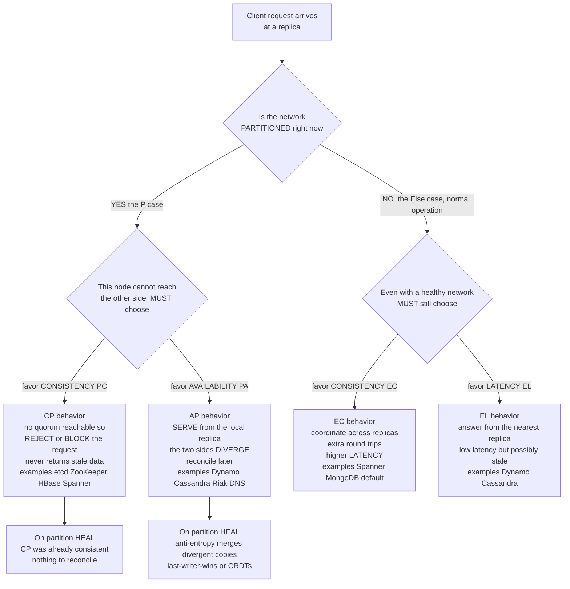

# ⚖️ CAP Theorem and PACELC

> [!abstract] TL;DR
> The **CAP theorem** (Brewer's 2000 conjecture, proven by Gilbert & Lynch in 2002) says a distributed data store cannot **simultaneously** guarantee all three of **Consistency** (linearizability — every read sees the latest write), **Availability** (every request to a live node gets a non-error answer), and **Partition tolerance** (the system keeps working when the network drops messages). The subtlety everyone misses: **P is not a choice** — network partitions *will* happen, so the real, unavoidable decision is only *during a partition*: be **CP** (reject requests to stay consistent) or **AP** (serve possibly-stale data to stay available). "CA" is not a real option for a distributed system. **PACELC** (Abadi, 2012) completes the picture: **if Partition, choose A or C; Else, choose Latency or Consistency** — because even in normal operation, strong consistency costs you coordination round-trips. CAP/PACELC is the framework every architect uses to select and configure a datastore, and the source of endless cargo-cult confusion.

---

## Intuition

**Analogy:** Picture a small bank with **two branches** — call them North and South — that keep in sync over a single phone line, so a withdrawal recorded at one is instantly known to the other. One afternoon the **phone line goes dead**. Now a customer walks into *each* branch at the same moment, each wanting to withdraw the last $500 from the same shared account. Neither teller can call the other to check whether the money is still there. You, the bank, face an **unavoidable choice** with no third door:

- **Refuse to serve** until the line is restored — you stay **consistent** (the account can never go negative) but you are **unavailable** (you turned away a paying customer who did nothing wrong). This is **CP**.
- **Let both withdraw** — you stay **available** (every customer is served) but you become **inconsistent** (the account is now overdrawn by $500, and the two branches hold *conflicting* balances that must be reconciled once the line comes back). This is **AP**.

The dead phone line is the **network partition**, and here is the whole theorem in one sentence: **while the line is dead, you must sacrifice either consistency or availability — you genuinely cannot have both.** You did not *choose* for the line to fail; lines fail. The only thing CAP lets you choose is **how you behave when it does**. PACELC then adds the quieter, everyday truth: even when the line works *perfectly*, keeping the two branches in lock-step means every withdrawal waits for a confirming phone call — so **strong consistency costs latency all the time**, not just during outages.

---

## How It Works

### The CAP statement, made precise

CAP fixes three properties and proves you can have **at most two** of them at once for a distributed shared-data object:

- **Consistency (C)** — specifically **linearizability**, not the "C" of ACID. Every read returns the value of the most recent completed write, as if there were a single copy of the data updated atomically in real time. The system behaves like one register (see the planned sibling *Linearizability_and_Sequential_Consistency* and [[Consistency_Models]]).
- **Availability (A)** — a *strict* definition: **every request to a non-failing node** must return a **non-error** response in finite time. Not "mostly up" — literally every live node answers, even one stranded on the wrong side of a partition.
- **Partition tolerance (P)** — the system continues to operate despite the network **arbitrarily dropping or delaying messages** between nodes. A partition is not a node crash; it is the *link* between groups of nodes failing while the nodes themselves keep running.

> **CAP theorem (Gilbert & Lynch, 2002).** In an asynchronous network, it is impossible for a read/write data object to be **both** available **and** linearizable in the presence of message loss (partitions). You may guarantee at most two of {C, A, P}.

### The impossibility argument (short and clean)

The proof is almost embarrassingly direct. Suppose a system claims to be **both** consistent and available while tolerating partitions. Partition the network into two halves, `{G1}` and `{G2}`, that cannot exchange a single message.

1. A client **writes** `x = v2` (the old value was `v1`) to a node in `G1`.
2. Because the system is **available**, that node must accept and acknowledge the write without hearing from `G2` (it *can't* — the partition blocks it).
3. A client now **reads** `x` from a node in `G2`. Because the system is **available**, that node must answer without hearing from `G1`.
4. But `G2` **never received** `v2` — the write is invisible across the partition. So it returns the stale `v1`.
5. A read returning `v1` after a completed write of `v2` **violates linearizability**. ∎

The contradiction is unavoidable: to keep both nodes answering (availability) across a partition, at least one of them must answer *without* the latest write, breaking consistency. The only escapes are to **stop answering** on one side (sacrifice A → **CP**) or to **accept the stale/divergent answer** (sacrifice C → **AP**). The Python demo below turns this exact argument into a runnable simulation.

### The crucial clarification: P is not optional

This is the single most misunderstood point in all of distributed systems. **You do not "choose" partition tolerance the way you choose C or A.** Partitions are a *fact of the physical world*: packet loss, switch and NIC failures, misconfigured routers, overloaded links, and even long **GC pauses** or VM stalls (which look identical to a partition — a node goes silent) all manifest as dropped messages between nodes. Any real distributed system spanning more than one machine **will** experience partitions.

Therefore, "CA" — giving up partition tolerance to keep C and A — **is not a meaningful option** for a distributed system. Dropping P only makes sense for a single node (where there is no network to partition). The instant your data lives on two machines, P is forced upon you, and CAP collapses to a **binary runtime choice that only applies during a partition**:

- **CP** — sacrifice **availability**: when a node cannot reach a quorum, it **refuses or blocks** requests rather than risk returning stale or divergent data.
- **AP** — sacrifice **consistency**: nodes keep **serving from their local replica**, accepting that the two sides diverge and must be **reconciled later**.

When the network is healthy, a well-designed system is **both** consistent and available — CAP's trilemma only bites *during* the partition. (See [[Distributed_Systems_Overview]] for why partial failure and unreliable networks are the field's defining difficulties.)

### CP vs AP: the forced choice, and PACELC's extension



**PACELC** (Daniel Abadi, 2010/2012) is the more complete framework. It reads: **PAC** — *if there is a Partition, trade Availability against Consistency* — **ELC** — *else, trade Latency against Consistency*. The insight CAP omits is the **Else** clause: even with **zero** partitions, guaranteeing linearizability requires replicas to **coordinate** (a write must reach a quorum, a read may need to confirm it is not stale), and that coordination is **latency** — extra network round-trips on the hot path. So the tradeoff never fully disappears; it just changes shape when the network is healthy.

Systems are classified by both letters. A datastore is written as **`<Partition behavior>/<Else behavior>`**:

| System | PACELC class | Reading |
|---|---|---|
| Dynamo, Cassandra, Riak | **PA/EL** | stay available under partition; favor low latency otherwise |
| Google Spanner | **PC/EC** | stay consistent under partition; favor consistency otherwise |
| MongoDB (default) | **PC/EC** | consistent under partition; consistent (majority) otherwise |
| Google BigTable / HBase | **PC/EC** | consistent both under partition and normally |
| Amazon DynamoDB | **PA/EL** (tunable) | available and low-latency, with opt-in strong reads |

### Consistency is a spectrum, not a switch

CAP's binary "C" (full linearizability) is a **simplification**. You do not have to give up *all* consistency to regain availability under a partition — you can drop to a **weaker** model and keep serving. **Causal consistency** is provably the **strongest** model that remains **available during a partition**: it preserves cause-and-effect ordering (using mechanisms like [[Vector_Clocks_and_Causality]]) without requiring the global agreement that linearizability demands. Below it lie **session** and **eventual** consistency (see the planned siblings *Consistency_Models_Spectrum* and *Eventual_Consistency_and_Anti_Entropy*, and [[Consistency_Patterns]]). This is why "AP" systems are not "no consistency" — they occupy a rich middle ground.

Modern systems also refuse the "pick two at design time" framing: they **tune per operation**. Cassandra exposes **per-query consistency levels** (`ONE`, `QUORUM`, `ALL`); DynamoDB offers eventually-consistent *or* strongly-consistent reads per call; MongoDB has **read/write concerns**. The CAP position is chosen *per request*, not once for the whole system (see [[Replication_Strategies]] and [[Consensus_and_Quorums]] for the quorum mechanics that make this tuning work).

### CAP is not FLP

CAP is frequently conflated with the **FLP impossibility result** — they are cousins, not twins:

| | **CAP** (2000 / 2002) | **FLP** (1985) |
|---|---|---|
| **About** | Consistency **vs** Availability | **Termination** (liveness) of consensus |
| **Trigger** | A **network partition** | Asynchrony **+ one crash** |
| **Verdict** | Can't have C **and** A during a partition | No deterministic protocol *always* terminates |
| **What you lose** | C or A (your choice) | A guarantee of *ever deciding* |

Both are deep impossibility results about coordination, but FLP is about *being able to decide at all* under crash + asynchrony, while CAP is about *what you must give up* under a partition. See [[FLP_Impossibility_Result]] for the full treatment; do not treat them as the same theorem.

---

## Key Concepts

### Secondary (intuitive level)
- Three good things — **Consistency** (everyone sees the latest data), **Availability** (every request gets an answer), **Partition tolerance** (survive a network split) — and you can only fully have **two at once**.
- Networks **will** break, so you can't skip Partition tolerance. The real choice is: when the network splits, do you **stop answering to stay correct** (CP) or **keep answering and risk wrong answers** (AP)?
- Money and locks want **CP**; shopping carts and social feeds are fine with **AP**.

### Undergraduate (mechanism level)
- CAP's **C = linearizability** (not ACID's "C"); **A** is the strict "every live node answers" definition; **P** = the network may drop messages.
- The **Gilbert–Lynch proof**: partition the network, write on one side, read on the other — availability forces a stale answer, breaking consistency.
- "**CA**" is a myth for distributed systems: dropping P only makes sense on a single node.
- **CP examples**: etcd, ZooKeeper, HBase, Spanner, consensus-backed stores — used for coordination, locks, config. **AP examples**: Dynamo, Cassandra, Riak, DNS — reconcile later via eventual consistency / CRDTs.
- **Quorums** make the choice tunable: with `N` replicas, requiring `W + R > N` gives strong consistency; smaller quorums trade it for availability/latency.

### Graduate (research level)
- **PACELC** formalizes the **Else** dimension: even without partitions, linearizability costs **coordination latency** (round-trips to a quorum). Classification: PA/EL (Dynamo, Cassandra), PC/EC (Spanner, HBase, MongoDB default).
- **Causal+ consistency** (COPS, Bolt-on) is the **strongest available-under-partition** model — the sharp boundary in the "CAP is not binary" refinement; it relies on tracking causality ([[Vector_Clocks_and_Causality]]).
- Brewer's own "**CAP Twelve Years Later**" recants the naive "2 of 3": partitions are rare and *localized*, so the interesting engineering is **partition detection → explicit degraded mode → recovery/reconciliation**, not a global static choice.
- **Spanner's "CP but effectively CA"** claim: TrueTime plus a highly reliable Google network make partitions rare enough that Spanner delivers linearizability *and* very high availability in practice — a reminder that CAP bounds the *worst case*, not the common case.
- CAP's kinship with — and distinction from — **FLP** (liveness under async + crash) and the broader **consistency/availability lattice** (Bailis, Mahajan et al.).

---

## Python Demo

> [!note] This is a **concrete simulation of the CAP tradeoff**, not a proof.
> We build **two replicas** of a single register `x` connected by a link that **partitions** partway through. We replay the *same* client workload (interleaved reads and writes hitting either replica) under **two policies** — **CP** (refuse when no quorum) and **AP** (always serve locally) — then **measure availability vs consistency** during the partition and **reconcile** the AP replicas on heal. Pure stdlib simulation + matplotlib visualization.

```python
"""
SIMULATING the CAP tradeoff on two replicas of one register `x`.

Setup: replicas R0 and R1 hold key "x". A quorum needs BOTH replicas
(N=2, majority=2). Partway through, the LINK PARTITIONS and stays down.

We replay the SAME workload under two policies:
  CP -- if a request can't reach a quorum, REFUSE it (unavailable, but
        never returns stale/divergent data).
  AP -- always serve from the LOCAL replica (available, but the two sides
        DIVERGE during the partition and must be reconciled on heal).

We measure availability (fraction served) and consistency (fraction of
served reads that are fresh) for each, then reconcile AP via last-writer-wins.
Pure stdlib + matplotlib.
"""

import random
import matplotlib.pyplot as plt
from matplotlib.lines import Line2D
from matplotlib.patches import Patch

random.seed(42)                       # reproducible run

TICKS           = 31                  # one client op per logical tick, 0..30
PARTITION_START = 12                  # link dies here and STAYS down to the end

def partitioned(t):
    return t >= PARTITION_START

# ---- generate a shared workload: each tick, one op hits one replica --------
# op = (tick, kind, node, value);  kind in {"W","R"};  node in {0,1}
ops, next_val = [], 1
for t in range(TICKS):
    node = random.randint(0, 1)
    if random.random() < 0.5:
        ops.append((t, "W", node, next_val)); next_val += 1
    else:
        ops.append((t, "R", node, None))

# ===========================================================================
# POLICY 1: CP  -- refuse anything that can't reach a quorum (both replicas).
# ===========================================================================
cp_val    = [None, None]              # local values (kept identical via quorum)
cp_latest = None                      # last committed value = the correct read
cp_served, cp_fresh, cp_line = [], [], []   # bookkeeping + timeline

for (t, kind, node, val) in ops:
    if partitioned(t):                # no quorum reachable -> REFUSE
        cp_served.append(False)
        cp_line.append((t, kind, "refused"))
        continue
    if kind == "W":                   # quorum ok: write to BOTH, commit
        cp_val[0] = cp_val[1] = val
        cp_latest = val
        cp_served.append(True)
        cp_line.append((t, kind, "served"))
    else:                             # read: quorum ok -> always fresh
        cp_served.append(True)
        cp_fresh.append(cp_val[node] == cp_latest)
        cp_line.append((t, kind, "served"))

# ===========================================================================
# POLICY 2: AP  -- always serve from the local replica. Diverge, reconcile later.
# ===========================================================================
ap_val   = [None, None]
ap_ver   = [-1, -1]                   # tick of last local write (for LWW merge)
ap_gtick = -1                         # highest-tick write anywhere = "the truth"
ap_gval  = None
ap_served, ap_fresh, ap_line = [], [], []
diverge = []                          # (t, v0, v1, ver0, ver1) each tick

for (t, kind, node, val) in ops:
    if kind == "W":                   # always accept locally -> AVAILABLE
        ap_val[node] = val
        ap_ver[node] = t
        if t > ap_gtick:              # newest write in the whole system
            ap_gtick, ap_gval = t, val
        if not partitioned(t):        # healthy link -> replicate to the peer
            other = 1 - node
            ap_val[other] = val
            ap_ver[other] = t
        ap_served.append(True)
        ap_line.append((t, kind, "served"))
    else:                             # always serve local value -> AVAILABLE
        r = ap_val[node]
        fresh = (r == ap_gval)        # stale if the newest write was on the far side
        ap_served.append(True)
        ap_fresh.append(fresh)
        ap_line.append((t, kind, "served" if fresh else "stale"))
    diverge.append((t, ap_val[0], ap_val[1], ap_ver[0], ap_ver[1]))

# ---- reconciliation ON HEAL: anti-entropy, last-writer-wins ---------------
_, dv0, dv1, dver0, dver1 = diverge[-1]
winner = dv0 if dver0 >= dver1 else dv1
ap_val[0] = ap_val[1] = winner

# ===========================================================================
# METRICS -- focus on the partition window, where the tradeoff lives.
# ===========================================================================
part_idx = [i for i, (t, *_ ) in enumerate(ops) if partitioned(t)]
cp_avail_part = sum(cp_served[i] for i in part_idx) / len(part_idx)
ap_avail_part = sum(ap_served[i] for i in part_idx) / len(part_idx)
cp_cons = (sum(cp_fresh) / len(cp_fresh)) if cp_fresh else 1.0
ap_cons = (sum(ap_fresh) / len(ap_fresh)) if ap_fresh else 1.0

print(f"During the partition (ticks {PARTITION_START}..{TICKS-1}):")
print(f"  CP availability = {cp_avail_part:5.0%}   (refuses without a quorum)")
print(f"  AP availability = {ap_avail_part:5.0%}   (always serves locally)")
print(f"Consistency of served reads (overall):")
print(f"  CP fresh reads  = {cp_cons:5.0%}   (never stale by construction)")
print(f"  AP fresh reads  = {ap_cons:5.0%}   (some reads went stale)")
print(f"AP divergence at heal: R0={dv0}  R1={dv1}  ->  reconciled to {winner} (last-writer-wins)")

# ===========================================================================
# VISUALIZE: request timeline + divergence/reconciliation + tradeoff bars.
# ===========================================================================
COL = {"served": "#2ecc71", "refused": "#e74c3c", "stale": "#f39c12"}
MK  = {"W": "s", "R": "o"}            # square = write, circle = read

fig = plt.figure(figsize=(14, 9))
gs  = fig.add_gridspec(2, 2)
ax_tl  = fig.add_subplot(gs[0, :])   # full-width request timeline
ax_dv  = fig.add_subplot(gs[1, 0])   # AP divergence + reconciliation
ax_bar = fig.add_subplot(gs[1, 1])   # availability vs consistency bars

# --- timeline: CP lane (y=1) and AP lane (y=0) ---
for ax_lane, line in ((1, cp_line), (0, ap_line)):
    for (t, kind, status) in line:
        ax_tl.scatter(t, ax_lane, marker=MK[kind], s=120,
                      color=COL[status], edgecolor="black", zorder=3)
ax_tl.axvspan(PARTITION_START, TICKS - 1, color="#cccccc", alpha=0.35)
ax_tl.text((PARTITION_START + TICKS - 1) / 2, 1.45, "NETWORK PARTITION",
           ha="center", fontweight="bold", color="#555555")
ax_tl.set_yticks([0, 1]); ax_tl.set_yticklabels(["AP policy", "CP policy"])
ax_tl.set_ylim(-0.6, 1.7); ax_tl.set_xlabel("tick (logical time)")
ax_tl.set_title("Request outcomes over time  "
                "(square = write, circle = read)")
ax_tl.legend(handles=[
    Patch(facecolor="#cccccc", alpha=0.35, label="partition window"),
    Line2D([0], [0], marker="o", ls="", markerfacecolor=COL["served"],
           markeredgecolor="black", markersize=10, label="served"),
    Line2D([0], [0], marker="o", ls="", markerfacecolor=COL["refused"],
           markeredgecolor="black", markersize=10, label="refused (CP)"),
    Line2D([0], [0], marker="o", ls="", markerfacecolor=COL["stale"],
           markeredgecolor="black", markersize=10, label="stale (AP)"),
], loc="upper left", ncol=2, framealpha=0.9)

# --- divergence: AP replica values drift apart, then reconcile on heal ---
ts = [d[0] for d in diverge]
v0 = [d[1] if d[1] is not None else 0 for d in diverge]
v1 = [d[2] if d[2] is not None else 0 for d in diverge]
ax_dv.step(ts, v0, where="post", color="#3498db", lw=2, label="replica R0")
ax_dv.step(ts, v1, where="post", color="#e67e22", lw=2, label="replica R1")
ax_dv.axvspan(PARTITION_START, TICKS - 1, color="#cccccc", alpha=0.35)
ax_dv.scatter([TICKS], [winner], marker="*", s=320, color="#2ecc71",
              edgecolor="black", zorder=5, label="reconciled (LWW)")
ax_dv.annotate("heal +\nanti-entropy", xy=(TICKS, winner),
               xytext=(TICKS - 7, winner + 2),
               arrowprops=dict(arrowstyle="->"), fontsize=9)
ax_dv.set_xlabel("tick"); ax_dv.set_ylabel("value of key x")
ax_dv.set_title("AP: replicas DIVERGE during the partition,\n"
                "then reconcile on heal")
ax_dv.legend(loc="upper left", fontsize=8)

# --- tradeoff bars ---
labels = ["Availability\nduring partition", "Consistency\nof served reads"]
x = range(len(labels)); w = 0.35
ax_bar.bar([i - w / 2 for i in x], [cp_avail_part, cp_cons], w,
           color="#8e44ad", label="CP")
ax_bar.bar([i + w / 2 for i in x], [ap_avail_part, ap_cons], w,
           color="#16a085", label="AP")
ax_bar.set_xticks(list(x)); ax_bar.set_xticklabels(labels)
ax_bar.set_ylim(0, 1.08); ax_bar.set_ylabel("fraction")
ax_bar.set_title("The CAP tradeoff, quantified")
ax_bar.legend()
for i, v in enumerate([cp_avail_part, cp_cons]):
    ax_bar.text(i - w / 2, v + 0.02, f"{v:.0%}", ha="center", fontsize=8)
for i, v in enumerate([ap_avail_part, ap_cons]):
    ax_bar.text(i + w / 2, v + 0.02, f"{v:.0%}", ha="center", fontsize=8)

fig.suptitle("CAP in miniature: CP sacrifices AVAILABILITY, "
             "AP sacrifices CONSISTENCY (both during the same partition)",
             fontsize=13, fontweight="bold")
fig.tight_layout()
plt.savefig("cap_tradeoff_simulation.png", dpi=120)
print("\nSaved figure -> cap_tradeoff_simulation.png")
```

**What you observe.** Before tick 12 both policies behave identically — the network is healthy, so the system is *both* consistent and available. The moment the partition begins, the two policies **split apart on the same workload**: the **CP** lane fills with **red "refused" markers** (its availability during the partition collapses toward zero because no node can reach a quorum), while the **AP** lane keeps serving green — but sprinkled with **orange "stale" reads** whenever a client reads the replica that missed the latest write. The divergence panel shows AP's two replicas visibly **drifting to different values** during the partition, then snapping to a single **reconciled** value (green star) via last-writer-wins on heal. The bar chart makes the CAP theorem literal: **CP buys 100% consistency at the cost of availability; AP buys 100% availability at the cost of consistency** — the exact same partition, two opposite sacrifices.

---

## Real-World Applications

- **etcd / ZooKeeper / Consul (CP, PC/EC).** These are coordination stores backing Kubernetes, service discovery, and distributed locks. They run consensus (Raft / Zab) and **deliberately reject writes** (and linearizable reads) if a node cannot reach a majority quorum — a minority partition goes **read-only or unavailable** rather than risk two masters. Correctness of a lock is non-negotiable, so CP is the only sane choice (see [[Consensus_and_Quorums]]).
- **Google Spanner (PC/EC).** A globally-distributed SQL database that provides **external consistency** (linearizability) using **TrueTime** (GPS + atomic clocks) plus Paxos. It is CP by CAP, but Google's engineered network makes partitions so rare that it achieves famously high availability — the "CP that feels like CA" case.
- **Amazon Dynamo / Cassandra / Riak (PA/EL).** Built for the shopping cart and the always-on write path: **never reject a write**, even during a partition. They stay available and **reconcile later** via **eventual consistency**, hinted handoff, read-repair, and **CRDTs** (see the planned siblings *Eventual_Consistency_and_Anti_Entropy* and *Replication_Models*). Cassandra exposes **tunable per-query consistency** (`ONE`/`QUORUM`/`ALL`), letting one cluster slide along the CP–AP axis operation by operation ([[Cassandra]], [[Replication_Strategies]]).
- **DNS (AP, PA/EL).** The internet's name system is aggressively AP: resolvers serve **cached, possibly-stale** records for the whole TTL window, choosing availability and low latency over freshness. A propagation delay is the price of a system that never goes down.
- **MongoDB (PC/EC by default).** With `majority` write concern and primary reads it is CP; loosen the read/write concern and it slides toward AP — the same "tune per operation" story ([[MongoDB]]).
- **Datastore selection in practice.** CAP/PACELC is the checklist an architect runs when choosing between DynamoDB, Cassandra, Spanner, and CockroachDB: *does this data need linearizability (money, locks, inventory) or can it tolerate staleness (feeds, carts, analytics)?*

---

## Common Pitfalls

- **"Pick two of three, globally, at design time."** The most pervasive error. P is *not* selectable, and the C-vs-A tradeoff only applies **during a partition** — the rest of the time you get both. Real systems tune the choice **per operation**, not once forever. Brewer himself retired the "2 of 3" framing in *CAP Twelve Years Later*.
- **Building for "CA."** Choosing "consistent + available, drop partition tolerance" is choosing a system that gives *wrong answers or corrupts data* the instant the network hiccups — because it never planned for the partition that is guaranteed to come. CA is only coherent for a single node.
- **Thinking CAP's "C" means ACID consistency.** CAP's C is **linearizability** (a recency/ordering guarantee across replicas). ACID's C is "transactions preserve invariants." A datastore can be ACID and AP, or CP and non-transactional. Different words, same letter.
- **Confusing a slow node with a partition — and over-reacting.** A GC pause or overloaded link looks exactly like a partition. CP systems that trip their quorum logic too eagerly turn transient slowness into an **outage**; the fix is careful timeout tuning, not abandoning CP.
- **Assuming AP means "no consistency."** AP systems occupy the rich middle of the spectrum — **causal**, **session**, **read-your-writes**, **monotonic** guarantees are all available under partition. "Eventually consistent" is a floor, not the whole story ([[Consistency_Models]]).
- **Conflating CAP with FLP.** CAP = consistency vs availability under **partition**; FLP = can't guarantee **termination** of consensus under **asynchrony + crash**. Related in spirit, different claims ([[FLP_Impossibility_Result]]).
- **Ignoring the Else (latency) cost.** Teams pick "strong consistency everywhere" then are surprised by tail latency. PACELC's whole point: linearizability costs **coordination round-trips even when the network is perfect** — sometimes the right call is EL for read-heavy, latency-sensitive paths.

---

## Related Concepts

- [[Distributed_Systems_Overview]] — the four difficulties (no global state, unreliable network, partial failure, no shared clock) that make partitions inevitable and CAP unavoidable.
- [[FLP_Impossibility_Result]] — the *other* great impossibility: termination of consensus under asynchrony + crash; a cousin of CAP, not the same theorem.
- [[Consistency_Models]] — the spectrum from linearizable down to eventual that quantifies what "the C in CAP" really means and what AP systems fall back to.
- [[Consistency_Patterns]] — practical strong / eventual / weak patterns that map CAP choices onto engineering recipes.
- [[Replication_Strategies]] — leader/follower, multi-leader, and leaderless replication — the mechanism whose quorum settings *are* the CP/AP dial.
- [[Consensus_and_Quorums]] — how `W + R > N` quorum overlap buys linearizability, and how shrinking quorums trades it for availability and latency.
- [[Vector_Clocks_and_Causality]] — the causality tracking that lets AP systems provide **causal consistency**, the strongest model available under a partition.
- [[CAP_Theorem]] — the System Design vault's applied treatment of the same theorem, focused on architecture selection.
- [[PACELC_Theorem]] — the System Design vault's note on the latency-vs-consistency extension.
- [[Cassandra]] — a canonical PA/EL store with per-query tunable consistency.
- [[MongoDB]] — a PC/EC-by-default store whose read/write concerns slide along the CAP axis.

> Planned siblings for this section, referenced in prose above: *Consistency_Models_Spectrum*, *Linearizability_and_Sequential_Consistency*, *Replication_Models*, *Eventual_Consistency_and_Anti_Entropy*, and *Quorum_Systems* — they develop the consistency spectrum, replication mechanics, and reconciliation sketched here.

---

## Review Questions

**Secondary (understanding):**
1. Using the two-bank-branches analogy, explain in plain language why, when the phone line between the branches goes dead, the bank *cannot* be both consistent (never overdrawn) and available (always serves the customer). Which real-world thing does the dead phone line represent?

**Undergraduate (application):**
2. A colleague says their new distributed database is "CA — consistent and available, and we just won't worry about partitions." Explain precisely why "CA" is not a meaningful option for a distributed system, and what will actually happen to their database the first time a switch fails.
3. In the Python demo, during the partition the CP policy shows near-zero availability while the AP policy shows some stale reads. Trace *one* specific stale AP read: describe the sequence of write-on-one-side then read-on-the-other that produces it, and explain why the CP policy avoided it only by refusing to answer.

**Graduate (analysis / trade-offs):**
4. Spanner is classified **PC/EC**, yet Google advertises it as highly available. Reconcile these facts using PACELC and the distinction between CAP's *worst-case* guarantee and a system's *common-case* behavior. What role does TrueTime play?
5. You are designing two services: (a) a distributed lock manager for a payment system, and (b) a "who's online now" presence feed for a chat app. For each, choose a PACELC class (PA/EL, PC/EC, etc.), justify the partition-time and normal-time tradeoffs, and name a real datastore you would use. Then explain how causal consistency might let the presence feed stay available under partition *without* being fully eventual.

---

## Sources

- Brewer, E. (2000). *Towards Robust Distributed Systems.* PODC 2000 keynote (the original CAP conjecture). [Slides](https://people.eecs.berkeley.edu/~brewer/cs262b-2004/PODC-keynote.pdf)
- Gilbert, S., & Lynch, N. (2002). *Brewer's Conjecture and the Feasibility of Consistent, Available, Partition-Tolerant Web Services.* ACM SIGACT News, 33(2), 51–59. [PDF](https://groups.csail.mit.edu/tds/papers/Gilbert/Brewer2.pdf) · [DOI](https://doi.org/10.1145/564585.564601)
- Brewer, E. (2012). *CAP Twelve Years Later: How the "Rules" Have Changed.* IEEE Computer, 45(2), 23–29. [DOI](https://doi.org/10.1109/MC.2012.37)
- Abadi, D. (2012). *Consistency Tradeoffs in Modern Distributed Database System Design: CAP is Only Part of the Story.* IEEE Computer, 45(2), 37–42. [DOI](https://doi.org/10.1109/MC.2012.33)
- Kleppmann, M. (2015). *A Critique of the CAP Theorem.* arXiv:1509.05393. [PDF](https://arxiv.org/abs/1509.05393)
- Kleppmann, M. (2017). *Designing Data-Intensive Applications*, Ch. 5 & 9. O'Reilly. [dataintensive.net](https://dataintensive.net/)

---

#distributed-systems #cap-theorem #pacelc #consistency-availability #partition-tolerance
