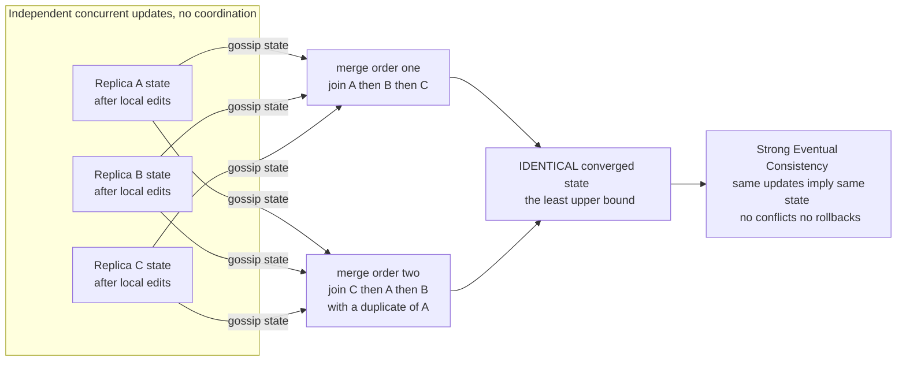

# 🧩 CRDTs (Conflict-free Replicated Data Types)

> [!abstract] TL;DR
> A **CRDT** is a data type engineered so that concurrent edits made on different replicas — with **no coordination** — always **merge automatically to the same state, with no conflicts**. The trick is algebra: CRDT states form a **join-semilattice** and the merge is **commutative, associative, and idempotent**, so applying merges in *any* order, *any* number of times, converges to the same least-upper-bound. This delivers **strong eventual consistency**: any two replicas that have seen the same set of updates are byte-for-byte identical — no rollbacks, no last-writer-wins data loss, no application-level conflict resolution. CRDTs are the backbone of real-time collaboration (Figma, Automerge, Yjs), active-active databases (Redis, Riak), and local-first software.

---

## Intuition

**Analogy — the shared tally jar.** Picture a group of friends splitting the cost of a trip, each keeping their *own* little notebook of "how much *I* personally chipped in." Nobody has to agree on a single running total in real time; nobody has to wait for anybody else. To learn the grand total at any moment, you just **sum everyone's private tallies**. Here is the magic: it does not matter *what order* you add the notebooks together, and it does not matter if you accidentally read the same notebook *twice* — you always get the same total. There is nothing to argue about, because everyone only ever *adds to their own line*, and addition of separate lines can never collide.

That is exactly what a CRDT does. Each replica edits its own slice of the state freely and offline. When replicas finally exchange what they know, a **merge** rule combines their states — and because that merge obeys the right algebraic laws (order-independent, duplicate-proof), *every* replica that has seen the *same* updates lands on the *identical* answer. Conflicts do not get *resolved*; they are made **impossible by design**. Compare this to the usual eventually-consistent story, where two people editing the same value produce a genuine collision that someone — the clock, or a human — has to break, often *losing* one of the edits. CRDTs trade that reconciliation headache for a little bookkeeping and a proof.

---

## How It Works

### The problem CRDTs solve

Under a network partition you must choose (per the [[CAP_Theorem_and_PACELC|CAP theorem]]): reject writes, or accept writes locally on multiple replicas and reconcile later. Reconciling later is where the pain lives. Plain **eventual consistency** promises only that replicas *converge if writes ever stop* — and it says nothing about *how* two concurrent writes to the same key get merged. The usual answers are ugly:

- **Last-writer-wins (LWW):** pick the write with the highest timestamp and **silently discard the other**. Simple, but it *loses data* and is at the mercy of clock skew.
- **Siblings / multi-value:** keep both conflicting versions (as Dynamo/Riak do via [[Vector_Clocks_and_Causality|version vectors]]) and hand the collision to the *application* to merge. Correct, but it pushes the hard problem onto every developer.

CRDTs give a third answer: **make the merge deterministic and conflict-free at the data-type level**. If the data type is built correctly, "two concurrent writes" is not an error condition — it is just another input the merge handles unambiguously.

### Strong Eventual Consistency (SEC)

Shapiro, Preguiça, Baquero, and Zawirski formalized the guarantee CRDTs provide as **Strong Eventual Consistency**:

> **Eventual delivery** — every update eventually reaches every replica, **and**
> **Strong convergence** — any two replicas that have **received the same set of updates** have **equivalent state.**

This is strictly stronger than plain eventual consistency. Plain EC only promises convergence *in the limit, once writes quiesce*; SEC promises that *seeing the same updates implies identical state right now*, with **no rollbacks and no conflict-resolution step**. Convergence is a *safety* property guaranteed by algebra, not an *eventual* hope guaranteed by the writes eventually stopping. (Where SEC sits relative to causal, sequential, and linearizable guarantees is mapped in [[Consistency_Models_Spectrum]].)

### The math — join-semilattices

The theoretical core is beautifully small. Take the set of possible replica states and equip it with a **partial order** `⊑` ("this state has absorbed at least as much as that one"). A CRDT requires that any two states have a **least upper bound** (LUB) — a smallest state that dominates both. A partial order with all binary LUBs is a **join-semilattice**, and the merge *is* the join `⊔`:

- **Commutative:** `a ⊔ b = b ⊔ a` → merge order does not matter.
- **Associative:** `(a ⊔ b) ⊔ c = a ⊔ (b ⊔ c)` → grouping does not matter.
- **Idempotent:** `a ⊔ a = a` → redelivering the same state does nothing.

Add one more rule — **updates are monotonic** (an update only moves a replica's state *up* the lattice, `s ⊑ update(s)`) — and you get the whole guarantee for free. Because merge is a LUB and updates climb the lattice, replicas that have absorbed the same updates compute the **same LUB**, regardless of message order, message duplication, or message redelivery. This is why the network can reorder, drop-and-retry, and duplicate freely: the algebra is immune to all three. (The join in a poset-viewed-as-a-category is exactly a **coproduct**; a semilattice is a **commutative idempotent monoid** — see [[Products_and_Coproducts]] and [[Monoids_and_Monoidal_Categories]] in the [[Category_Theory]] vault. The same monotone-lattice reasoning underlies the **CALM theorem**: programs computable without coordination are exactly the monotone ones.)

### Two flavors: state-based vs operation-based

| | **State-based (CvRDT, Convergent)** | **Operation-based (CmRDT, Commutative)** |
|---|---|---|
| What ships on the wire | the **whole state** | individual **operations** |
| Merge requirement | LUB `⊔` is commutative, associative, idempotent | operations **commute** for concurrent pairs |
| Network requirement | eventual delivery only — **robust to loss, duplication, reordering** | **reliable causal broadcast**, exactly-once delivery |
| Cost | large messages (ship full state) | small messages, but heavier delivery layer |

**State-based** replicas gossip their entire state and merge via the join; the idempotent, commutative join makes them bulletproof against a lossy/duplicating network. **Operation-based** replicas broadcast just the operations, which is cheap on bandwidth but demands a [[Reliable_and_Ordered_Broadcast|reliable causal-broadcast]] layer so that, e.g., an element's *add* is seen before its *remove*. **Delta-state CRDTs** (delta-CRDTs) are the pragmatic middle ground: they keep the robustness of state-based CRDTs but ship only the small **delta** that changed, not the whole state.

### Flow / Architecture



The two merge paths differ in **order** and one even **duplicates** a state — yet both land on the same least-upper-bound. That is commutativity plus associativity plus idempotence doing the work.

---

## Key Concepts

### Secondary (plain intuition)
- **Replica:** one copy of the data, editable on its own, even offline. There is no single master.
- **Merge:** the rule for combining two replicas' states. In a CRDT the merge never "picks a loser" — it folds both contributions together.
- **The promise:** if two replicas have seen the same edits, they show the *same* thing. You never have to ask a human "which version did you mean?"
- **Why order does not matter:** like summing separate tally sheets — rearranging or double-counting a sheet you already added changes nothing.

### Undergraduate (CS foundations)
- **Strong Eventual Consistency:** eventual delivery **+** "same updates ⟹ equivalent state," with no conflict-resolution step. Stronger than plain eventual consistency.
- **Join-semilattice:** a partial order in which every pair of states has a **least upper bound**; the CRDT merge is that LUB, and it is **commutative, associative, idempotent**.
- **Monotonic updates:** an update only moves state *up* the lattice; combined with a LUB merge you get order-, duplication-, and reordering-independent convergence.
- **CvRDT vs CmRDT:** ship-and-merge-whole-state (robust, bandwidth-heavy) vs broadcast-commuting-operations (cheap, needs reliable causal delivery). **Delta-CRDTs** ship only diffs.
- **The counter/set primitives:** G-Counter (grow-only, per-replica counts, merge = elementwise max, value = sum) and G-Set (grow-only set, merge = union) are the canonical semilattices to internalize first.

### Graduate (system-level)
- **The CRDT zoo:** **G-Counter** and **PN-Counter** (two G-Counters for increment/decrement); **G-Set**, **2P-Set** (add once, remove once, no re-add), **LWW-Register** and **LWW-Element-Set** (timestamped, lossy but compact); **OR-Set** (observed-remove: unique tags make concurrent add/remove deterministic with **add-wins** semantics); sequence/list CRDTs **RGA, Logoot, Treedoc, YATA** for collaborative text; **map/JSON CRDTs** in Automerge and Yjs.
- **Causal metadata & the delivery layer:** operation-based CRDTs lean on [[Vector_Clocks_and_Causality|vector clocks]] / [[Logical_Clocks_and_Happens_Before|happens-before]] for causal delivery so a remove never overtakes the add it targets.
- **CRDTs vs Operational Transformation (OT):** OT (classic Google Docs) *transforms* each operation against concurrent ones and typically needs a central server plus subtle correctness proofs; CRDTs *merge without transformation*, are decentralized, and have simpler convergence proofs — at the price of metadata (tombstones, unique tags). CRDTs increasingly win for **local-first / peer-to-peer** editing.
- **The cost model:** convergence is guaranteed, but **semantic** validity is not — you can converge to a *valid-but-unintended* state. Tombstones and unique tags accumulate; **garbage-collecting** them safely (only once every replica has observed a removal) is the hard operational problem. Not every operation has a natural CRDT.
- **CALM theorem:** a program has a coordination-free, consistent implementation **iff** it is **monotonic** — the deep reason CRDTs (monotone lattice climbs) can drop coordination entirely.

---

## Python Demo

Pure standard library for the CRDT simulation; `matplotlib` for the convergence visualization. No numpy required. The program (1) implements G-Counter, PN-Counter, and an OR-Set; (2) applies the **same** concurrent operations to replicas in **every possible merge order** and with **duplicate deliveries**, asserting all replicas end **identical**; (3) contrasts a naive last-writer-wins counter that **loses** a concurrent update; and (4) plots the different merge orders all converging to the same value.

```python
"""
CRDTs -- Conflict-free Replicated Data Types.

Demonstrates STRONG EVENTUAL CONSISTENCY: replicas that have observed the same
SET of updates converge to the SAME state, regardless of the ORDER or NUMBER of
times merges are applied. That is exactly commutativity + associativity +
idempotence -- the laws of a join-semilattice.

Implements:
  GCounter     grow-only counter; merge = elementwise max; value = sum
  PNCounter    increment AND decrement, via two G-Counters
  ORSet        observed-remove set; unique tags => concurrent add/remove is
               deterministic (add-wins)
  NaiveCounter a single int with last-writer-wins merge -- LOSES concurrent
               updates, shown for contrast
"""

import itertools
import uuid
import matplotlib.pyplot as plt


# --------------------------------------------------------------------------
# 1. G-Counter : grow-only counter (per-replica counts; merge = elementwise max)
# --------------------------------------------------------------------------
class GCounter:
    def __init__(self, replica):
        self.replica = replica
        self.counts = {}                         # replica_id -> count

    def increment(self, n=1):
        self.counts[self.replica] = self.counts.get(self.replica, 0) + n

    def merge(self, other):                       # LUB = elementwise max (pure)
        m = GCounter(self.replica)
        for r in set(self.counts) | set(other.counts):
            m.counts[r] = max(self.counts.get(r, 0), other.counts.get(r, 0))
        return m

    def value(self):
        return sum(self.counts.values())

    def state(self):
        return tuple(sorted(self.counts.items()))


# --------------------------------------------------------------------------
# 2. PN-Counter : increment AND decrement, as two grow-only counters
# --------------------------------------------------------------------------
class PNCounter:
    def __init__(self, replica):
        self.P = GCounter(replica)                # increments
        self.N = GCounter(replica)                # decrements

    def increment(self, n=1):
        self.P.increment(n)

    def decrement(self, n=1):
        self.N.increment(n)

    def merge(self, other):
        m = PNCounter(self.P.replica)
        m.P = self.P.merge(other.P)
        m.N = self.N.merge(other.N)
        return m

    def value(self):
        return self.P.value() - self.N.value()

    def state(self):
        return (self.P.state(), self.N.state())


# --------------------------------------------------------------------------
# 3. OR-Set : observed-remove set. Unique tags make concurrent add/remove
#    deterministic; a concurrent add that the remove did NOT observe survives
#    (add-wins). merge = union of adds and union of tombstones.
# --------------------------------------------------------------------------
class ORSet:
    def __init__(self):
        self.adds = {}                            # element -> set of unique tags
        self.removes = set()                      # observed-removed tags (tombstones)

    def add(self, element):
        tag = uuid.uuid4().hex                     # unique => concurrent adds cannot collide
        self.adds.setdefault(element, set()).add(tag)

    def remove(self, element):
        # only removes the tags OBSERVED so far; concurrent (unseen) adds survive
        for tag in self.adds.get(element, set()):
            self.removes.add(tag)

    def merge(self, other):
        m = ORSet()
        for e in set(self.adds) | set(other.adds):
            m.adds[e] = self.adds.get(e, set()) | other.adds.get(e, set())
        m.removes = self.removes | other.removes
        return m

    def value(self):
        return {e for e, tags in self.adds.items() if tags - self.removes}

    def state(self):
        return (tuple(sorted((e, tuple(sorted(t))) for e, t in self.adds.items())),
                tuple(sorted(self.removes)))


# --------------------------------------------------------------------------
# 4. Naive counter : one int, last-writer-wins merge. NOT a real join -> loses updates
# --------------------------------------------------------------------------
class NaiveCounter:
    def __init__(self, base=0):
        self.n = base

    def increment(self, n=1):
        self.n += n

    def merge(self, other):
        m = NaiveCounter()
        m.n = max(self.n, other.n)                 # "keep the latest/biggest": WRONG for counters
        return m

    def value(self):
        return self.n


# --------------------------------------------------------------------------
# Convergence harness: merge a list of states in a given order, optionally
# redelivering duplicates. merge() is pure, so states are never mutated.
# --------------------------------------------------------------------------
def merge_all(states, order, duplicate=False):
    seq = [states[i] for i in order]
    if duplicate:                                  # redeliver first and last again (idempotence)
        seq = seq + [states[order[0]], states[order[-1]]]
    acc = seq[0]
    for s in seq[1:]:
        acc = acc.merge(s)
    return acc


def all_orders_converge(states, key):
    """Merge in EVERY permutation, with and without duplicates; return the set of
    distinct results. Length 1 proves strong convergence."""
    seen = set()
    for order in itertools.permutations(range(len(states))):
        for dup in (False, True):
            seen.add(key(merge_all(states, order, dup)))
    return seen


# --------------------------------------------------------------------------
# Demo A : G-Counter -- three replicas increment concurrently, no coordination
# --------------------------------------------------------------------------
def demo_gcounter():
    r0, r1, r2 = GCounter("r0"), GCounter("r1"), GCounter("r2")
    r0.increment(3); r1.increment(5); r2.increment(2)
    states = [r0, r1, r2]
    results = all_orders_converge(states, key=lambda c: (c.state(), c.value()))
    assert len(results) == 1, "G-Counter FAILED to converge!"
    (state, val), = results
    n_orders = len(list(itertools.permutations(range(3)))) * 2
    print(f"[G-Counter]  all {n_orders} merge orders converge -> value = {val}  "
          f"(expected 3+5+2 = 10)")
    return states, val


# --------------------------------------------------------------------------
# Demo B : PN-Counter -- concurrent increments AND decrements
# --------------------------------------------------------------------------
def demo_pncounter():
    a, b, c = PNCounter("a"), PNCounter("b"), PNCounter("c")
    a.increment(10); a.decrement(3)                # net +7 on a
    b.increment(4)                                 # net +4 on b
    c.decrement(6)                                 # net -6 on c
    states = [a, b, c]
    results = all_orders_converge(states, key=lambda x: (x.state(), x.value()))
    assert len(results) == 1, "PN-Counter FAILED to converge!"
    (_, val), = results
    print(f"[PN-Counter] all merge orders converge -> value = {val}  "
          f"(expected 10-3 +4 -6 = 5)")


# --------------------------------------------------------------------------
# Demo C : OR-Set -- concurrent add vs remove of the SAME element (add-wins)
# --------------------------------------------------------------------------
def demo_orset():
    A, B, C = ORSet(), ORSet(), ORSet()
    A.add("apple"); A.add("banana")
    B = B.merge(A); C = C.merge(A)                 # replicate A's adds to B and C
    A.remove("apple")                              # A removes apple (observed tag)
    B.add("apple")                                 # B concurrently re-adds apple (NEW tag)
    C.add("cherry")                                # C adds cherry
    states = [A, B, C]
    results = all_orders_converge(states, key=lambda s: (frozenset(s.value()), s.state()))
    assert len(results) == 1, "OR-Set FAILED to converge!"
    (val, _), = results
    print(f"[OR-Set]     all merge orders converge -> {sorted(val)}  "
          f"(apple survives: add-wins over a concurrent remove)")


# --------------------------------------------------------------------------
# Demo D : the contrast -- naive LWW LOSES a concurrent update
# --------------------------------------------------------------------------
def demo_lost_update():
    # both replicas start from a replicated base of 5, then each does +1 concurrently
    na, nb = NaiveCounter(5), NaiveCounter(5)
    na.increment(); nb.increment()                 # each is now 6
    naive_val = na.merge(nb).value()               # max(6, 6) = 6  -> ONE increment lost!

    ga, gb = GCounter("A"), GCounter("B")
    ga.counts["base"] = 5; gb.counts["base"] = 5   # same replicated base of 5
    ga.increment(); gb.increment()                 # each bumps its OWN entry
    crdt_val = ga.merge(gb).value()                # 5 + 1 + 1 = 7  -> correct
    print(f"[Contrast]   naive last-writer-wins = {naive_val} (LOST an update)   "
          f"CRDT G-Counter = {crdt_val} (correct)")
    return naive_val, crdt_val, 7                  # naive, crdt, true value


# --------------------------------------------------------------------------
# Visualization : different merge orders all converging to the same value
# --------------------------------------------------------------------------
def trajectory(states, order):
    acc = states[order[0]]
    vals = [acc.value()]
    for i in order[1:]:
        acc = acc.merge(states[i])
        vals.append(acc.value())
    return vals


def visualize(states, true_val, naive_val, crdt_val, crdt_true):
    fig, (ax1, ax2) = plt.subplots(1, 2, figsize=(13, 5))

    # left: every merge order of the G-Counter converges to the same LUB value
    for order in itertools.permutations(range(len(states))):
        vals = trajectory(states, order)
        ax1.plot(range(len(vals)), vals, marker="o", alpha=0.75,
                 label="->".join(f"R{i}" for i in order))
    # a trajectory that REDELIVERS R0 (duplicate) -> flat step proves idempotence
    dup_order = (0, 0, 1, 2)
    acc = states[0]; dvals = [acc.value()]
    for i in dup_order[1:]:
        acc = acc.merge(states[i]); dvals.append(acc.value())
    ax1.plot(range(len(dvals)), dvals, marker="s", color="black", lw=2.5,
             label="R0->R0->R1->R2 (duplicate)")
    ax1.axhline(true_val, ls="--", color="gray")
    ax1.set_xlabel("merge step"); ax1.set_ylabel("G-Counter value")
    ax1.set_title("Every merge order converges to the same value\n"
                  "commutativity + associativity + idempotence")
    ax1.legend(fontsize=7, loc="lower right")

    # right: naive LWW loses an update; the CRDT does not
    bars = ax2.bar(["naive\nlast-writer-wins", "CRDT\nG-Counter"],
                   [naive_val, crdt_val],
                   color=["#e53935", "#43a047"])
    ax2.axhline(crdt_true, ls="--", color="gray")
    ax2.text(1.05, crdt_true + 0.03, f"true value = {crdt_true}", color="gray")
    for b, v in zip(bars, [naive_val, crdt_val]):
        ax2.text(b.get_x() + b.get_width() / 2, v + 0.05, str(v),
                 ha="center", fontsize=12)
    ax2.set_ylim(0, crdt_true + 1)
    ax2.set_ylabel("converged value")
    ax2.set_title("Two concurrent +1 on a base of 5\n"
                  "LWW silently drops one; the CRDT keeps both")

    fig.tight_layout()
    fig.savefig("crdts.png", dpi=120)
    print("\nSaved figure -> crdts.png")


if __name__ == "__main__":
    states, true_val = demo_gcounter()
    demo_pncounter()
    demo_orset()
    naive_val, crdt_val, crdt_true = demo_lost_update()
    visualize(states, true_val, naive_val, crdt_val, crdt_true)
```

Expected console output: every CRDT reports that **all** merge orders (and duplicate deliveries) collapse to a **single** result — value `10` for the G-Counter, `5` for the PN-Counter, `['apple', 'banana', 'cherry']` for the OR-Set (the concurrently re-added `apple` survives the remove, demonstrating add-wins). The contrast line shows the **naive LWW counter converging to 6** (one increment lost) while the **CRDT G-Counter converges to 7** (both increments preserved). The figure's left panel shows the different merge-order trajectories fanning out then meeting at `10`, with the duplicate-delivery line flat-stepping to prove idempotence.

---

## Real-World Applications

> **Example — Redis CRDTs (Active-Active geo-distribution).** Redis Enterprise's Active-Active databases replicate across regions where every region accepts local writes with sub-millisecond latency. The data types (counters, sets, hashes, sorted sets, strings) are implemented as CRDTs so that concurrent writes in different regions **merge deterministically** on gossip — a counter incremented in London and Tokyo simultaneously ends at the *sum*, never losing an increment. This is state/delta-based convergence giving availability under partition without a coordinator.

Other production uses:
- **Riak Data Types** — counters, sets, maps, flags exposed directly as CRDTs so applications get automatic conflict resolution instead of hand-merging Dynamo-style siblings.
- **Automerge and Yjs** — the two dominant JSON/text CRDT libraries powering **local-first** and real-time collaborative apps; Yjs (using the YATA sequence CRDT) underpins collaborative editors, whiteboards, and notebooks.
- **Figma** — its multiplayer engine uses CRDT-style merge semantics (with a server as relay) so simultaneous design edits converge without locking.
- **Apple Notes / device sync and Teletype for Atom** — offline edits on multiple devices merge on reconnect using CRDT structures.
- **Azure Cosmos DB** — offers CRDT-based conflict resolution for its multi-master ("multi-region writes") configuration.

CRDTs are increasingly favored over **Operational Transformation** for decentralized and offline-first settings, because they need no central transformation server and have simpler convergence proofs.

---

## Common Pitfalls

- **Assuming convergence means *correctness*.** CRDTs guarantee all replicas agree — not that the agreed state is what a human *wanted*. A remove racing an add resolves by a fixed policy (add-wins for OR-Set); if your app needed remove-wins, "converged" is still semantically *wrong*. Choose the CRDT whose merge semantics match your intent.
- **Unbounded tombstone / metadata growth.** Deletes in a 2P-Set or OR-Set leave **tombstones**, and OR-Set carries a **unique tag per add**. These accumulate forever unless **garbage-collected**, and GC is only safe once *every* replica has observed the removal — which itself needs causal metadata. Metadata can dwarf the payload in long-lived documents.
- **Forcing a CRDT onto an operation that has no natural one.** "Set a value to the maximum," "grow a counter," "union a set" are monotone and easy. Operations like "enforce a global uniqueness constraint" or "transfer such that balance never goes negative" are *not* naturally CRDT-able — they need coordination, exactly what the CALM theorem predicts.
- **Confusing state-based robustness with operation-based fragility.** Operation-based CRDTs *require* [[Reliable_and_Ordered_Broadcast|reliable, causal, exactly-once delivery]]; deliver an op twice, or a remove before its add, and you diverge. State-based CRDTs tolerate loss/dup/reorder for free. Do not deploy op-based CRDTs over an at-least-once, out-of-order channel without the causal layer.
- **Reaching for LWW-Register as a "simple CRDT."** LWW *is* a valid CRDT, but its merge **discards** the losing write, so it silently loses data under clock skew — the very problem CRDTs are meant to avoid. Use it only when losing concurrent writes is genuinely acceptable.
- **Ignoring per-replica identity in counters.** A G-Counter keys counts by **replica id**. Reuse an id across two nodes and their increments overwrite (via max) instead of summing — a subtle, data-losing configuration bug.

---

## Related Concepts

Verified in-vault links:

- [[Consistency_Models_Spectrum]] — the sibling that places strong eventual consistency alongside causal, sequential, and linearizable guarantees.
- [[CAP_Theorem_and_PACELC]] — CRDTs are an AP-optimal answer: always-available local writes that still converge under partition.
- [[Replication_Models]] — multi-leader / leaderless replication is precisely the setting whose concurrent writes CRDTs resolve by design.
- [[Vector_Clocks_and_Causality]] — the causal metadata that operation-based CRDTs use for causal delivery, and that state-based CRDTs use to know what a remove has "observed"; CRDTs *merge* the concurrency that vector clocks merely *detect*.
- [[Logical_Clocks_and_Happens_Before]] — the happens-before partial order that grounds "concurrent" operations and causal delivery.
- [[Reliable_and_Ordered_Broadcast]] — the delivery layer op-based (CmRDT) types depend on; state-based (CvRDT) types relax this to eventual delivery.
- [[The_Consensus_Problem]] — the *opposite* strategy: pay coordination cost for a single total order so conflicts never arise; CRDTs drop coordination entirely (CALM).
- [[Eventual_Consistency]] — the Java-vault note on the model CRDTs strengthen into *strong* eventual consistency.
- [[Consistency_Patterns]] — the System Design catalog of replication/consistency techniques CRDTs slot into.
- [[Category_Theory]], [[Monoids_and_Monoidal_Categories]], [[Products_and_Coproducts]] — the algebra: a semilattice is a commutative idempotent monoid, and the join (LUB) is a coproduct in a poset-as-category.

Planned sibling in this `Distributed_Systems_Theory` vault (referenced in prose above, not yet created): `Eventual_Consistency_and_Anti_Entropy`.

---

## Review Questions

**Secondary.** Using the shared tally-jar analogy, explain why two friends can each add money to their own notebook at the same time and never disagree about the grand total — even if one friend's notebook is accidentally read into the total twice. Which two properties of "adding notebooks" make this safe?

**Undergraduate.** A G-Counter keeps a per-replica map of counts, merges by taking the elementwise maximum, and reports the sum. (a) Show that this merge is commutative, associative, and idempotent. (b) Two replicas both start from a replicated base value of 5 and each performs one increment concurrently. Trace both the G-Counter and a naive single-integer "keep the larger value" counter through the merge, and explain precisely why the naive one loses an update while the CRDT does not.

**Graduate.** You must build a collaborative to-do list that is edited offline on phones and merged on reconnect, where a *remove* of an item should lose to a *concurrent re-add* (add-wins). (a) Choose between a state-based OR-Set and an operation-based CRDT, and justify the choice in terms of the delivery guarantees your mobile sync layer can realistically provide. (b) Describe the tombstone/tag metadata your choice accumulates and a concrete, *safe* garbage-collection protocol for it. (c) The product later demands a hard rule: "no list may ever exceed 100 items, globally." Explain, via the CALM theorem, why this requirement cannot be satisfied by any CRDT without reintroducing coordination.

---

## Sources

- Shapiro, M., Preguiça, N., Baquero, C., Zawirski, M. (2011). *Conflict-Free Replicated Data Types.* SSS 2011. https://hal.inria.fr/inria-00609399/document
- Shapiro, M., Preguiça, N., Baquero, C., Zawirski, M. (2011). *A Comprehensive Study of Convergent and Commutative Replicated Data Types.* INRIA Research Report RR-7506. https://hal.inria.fr/inria-00555588/document
- Kleppmann, M. (2017). *Designing Data-Intensive Applications*, Chapter 5 (Replication, "Handling Write Conflicts"). O'Reilly.
- Kleppmann, M., Beresford, A. R. (2017). *A Conflict-Free Replicated JSON Datatype.* IEEE TPDS. https://arxiv.org/abs/1608.03960
- Almeida, P. S., Shoker, A., Baquero, C. (2018). *Delta State Replicated Data Types.* Journal of Parallel and Distributed Computing. https://arxiv.org/abs/1603.01529
- Hellerstein, J. M., Alvaro, P. (2020). *Keeping CALM: When Distributed Consistency Is Easy.* Communications of the ACM. https://arxiv.org/abs/1901.01930

---

#distributed-systems #crdts #strong-eventual-consistency #conflict-free #collaborative-editing
