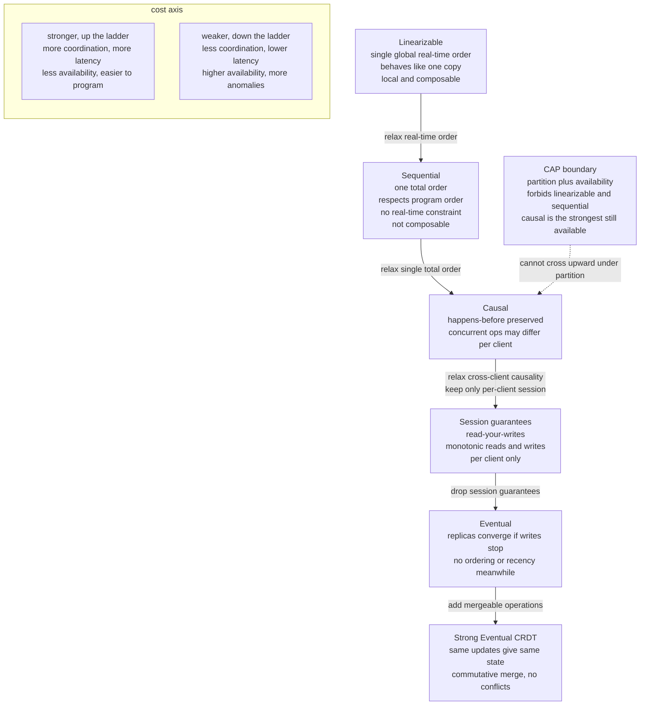

# 🪜 Consistency Models Spectrum

> [!abstract] TL;DR
> A **consistency model** is a *contract* between a replicated data store and the application: given the writes that have happened, it defines exactly **which read results are legal**. The models form a **spectrum** ordered by how tightly they constrain the visible order of operations — from **linearizable** (every read behaves as if there is a single copy updated in one global real-time order) down through **sequential**, **causal**, and **session guarantees**, to **eventual** (replicas merely converge *someday* if writes stop). Stronger is easier to program against but costs coordination, latency, and — under a network partition — availability. Picking the right point on this spectrum is the single most important semantic decision in any distributed data system.

---

## Intuition

**Analogy — the office whiteboard, copied to every floor.** Suppose your company writes its "current sprint goal" on a whiteboard, but there is one physical whiteboard on *every floor*, and an intern relays each edit up and down the stairs. When someone changes the goal on floor 3, the other floors are briefly stale until the intern gets there. Now ask the only question that matters to a reader: **"what am I allowed to see when I walk up and read my floor's board?"** There are many defensible answers, and each answer is a *consistency model*:

- **Strongest:** it is *as if* there were a single magic whiteboard everyone shares. The instant floor 3 edits it, every floor already shows the new goal, and everybody agrees on the exact order edits happened — even across floors, in real time. Wonderful to reason about, but it means the intern must sprint to freeze and update *all* boards before anyone reads, which is slow and stops entirely if a staircase is blocked (a partition).
- **Weakest:** every floor's board *eventually* shows the same goal once edits stop, but in the meantime different floors can show different things, and you might even walk upstairs and see an **older** goal than the one you just wrote yourself. Fast and always answerable, but bewildering.

The **consistency spectrum is the menu of promises** a store makes about how *stale* and how *out-of-order* your reads can be. This note lays out that menu from strong to weak, shows precisely what each promise forbids, and pins down where the CAP theorem forces you to give up the top of the menu.

---

## How It Works

### A consistency model is a constraint on the order of operations

Every model in the zoo is, formally, a **rule about which orderings of read/write operations are admissible**. A history of operations (each write and each read, with the value it returned) is *legal under model M* if there exists an ordering of the operations that (a) obeys M's ordering rules and (b) is a valid single-copy execution — every read returns the value of the most recent write in that order. Models differ only in **which orderings they permit**:

- **Real-time vs not** — must the order match wall-clock reality?
- **One total order vs a partial (causal) order vs none** — must everyone agree on a single sequence?
- **Global vs per-client** — is the promise about the whole system, or just about what *one client's session* observes?

Stronger models admit *fewer* orderings, which is exactly why they are easier to reason about (fewer surprising outcomes) and more expensive to provide (more coordination to rule out the forbidden ones).

### The rungs of the ladder, strong to weak

1. **Linearizability (atomic consistency).** Each operation appears to take effect **instantaneously at a single point between its invocation and its response**, and the resulting order is a *single global order consistent with real time*. The system "behaves like one copy." This is the gold standard and the most intuitive model, but it requires coordination on the critical path and is **impossible to keep while remaining available during a partition** (the CP corner of CAP). Crucially, linearizability is **local / composable**: a system is linearizable if each individual object is — a property the next rung lacks. Covered in depth in the vault sibling `Linearizability_and_Sequential_Consistency`.

2. **Sequential consistency (Lamport, 1979).** All processes observe operations in **some single total order** that respects each process's own **program order** — but that order **need not match real time**. It is strictly weaker than linearizability (drop the real-time constraint) and, importantly, **not composable**: composing two sequentially consistent objects can yield a non-sequential system. This is the classic *memory model* notion from multiprocessors (see `Memory_Consistency_Models`).

3. **Causal consistency.** Operations related by **happens-before** are seen in the same order by *everyone*, but **concurrent** operations may be seen in **different orders** by different clients. It is the **strongest model still achievable with full availability under partitions** (the "causal+" result; systems like COPS and Bayou). Its machinery is **vector clocks / dependency tracking** (`Vector_Clocks_and_Causality`, `Logical_Clocks_and_Happens_Before`) — a genuine sweet spot on the spectrum.

4. **Session guarantees (client-centric).** A pragmatic middle ground that promises consistency only *within one client's session*, cheaply, via sticky routing or version tokens. The four classic guarantees are: **read-your-writes** (you always see your own updates), **monotonic reads** (your reads never go backward in time), **monotonic writes** (your writes apply in the order you issued them), and **writes-follow-reads / consistent-prefix** (a write you make after reading X is ordered after X). These fix the *most jarring* anomalies of eventual consistency at almost no cost.

5. **Eventual consistency.** The only promise is: **if writes stop, all replicas eventually converge** to the same value. In the meantime there is *no ordering or recency guarantee* — you may read stale or out-of-order values, including missing your own writes. Maximally available and fast (Dynamo, DNS). Usually *strengthened* to session or causal consistency to tame the worst anomalies. See `Eventual_Consistency_and_Anti_Entropy`.

6. **Strong eventual consistency (SEC).** The **CRDT** guarantee: replicas that have received the **same set of updates** are in the **same state**, with **no conflict resolution needed**, because operations are designed to be **commutative / mergeable**. It is eventual consistency *without the conflicts* — you never have to arbitrate divergent writes. See `CRDTs`.

### Where CAP forces the choice

The **CAP theorem** (`CAP_Theorem`, `PACELC_Theorem`) draws a hard line across this ladder: **during a network partition you cannot have both linearizability and availability**. So a partition forces a jump *down* the ladder — the strongest model you can keep while staying available is **causal consistency**. `PACELC` extends the point: even with no partition (**E**lse), you still trade **L**atency against **C**onsistency, because higher rungs demand more round trips.



---

## Key Concepts

### Secondary (plain intuition)
- A **consistency model** is just a *promise about what a read can return* after some writes — the menu of promises runs from "always the freshest, everyone agrees" to "eventually everyone agrees, no promises meanwhile."
- **Strong** = behaves like one shared copy; intuitive but slow and can stall during network trouble. **Weak** = fast and always answerable, but you may see stale or out-of-order data, even your own writes coming back missing.
- **Session guarantees** are the cheap, sanity-preserving middle: at minimum, *see your own writes* and *never travel backward in time*.

### Undergraduate (CS foundations)
- **The contract view:** a model defines the set of *legal read results* by constraining the admissible **orderings** of operations. Three axes: real-time vs not; total vs causal vs none; global vs per-client.
- **Linearizability** = single total order + real-time respect + each op atomic between invoke and respond. **Sequential** = single total order + program order, *without* real-time. The difference is *only* the real-time constraint, but it has big consequences.
- **Composability / locality:** linearizability is *local* — a whole system is linearizable iff every object is — so you can reason object-by-object. Sequential consistency is **not** local; that is a major practical reason linearizability is the "useful strong model."
- **Causal consistency** preserves the **happens-before** partial order but lets **concurrent** writes be observed in different orders. It is implementable with vector clocks and needs no global coordination, so it survives partitions.
- **The four session guarantees** — read-your-writes, monotonic reads, monotonic writes, writes-follow-reads — are *client-centric* and combine (roughly) to approximate causal consistency for a single session.

### Graduate (system-level)
- **The consistency zoo (Viotti & Vukolić, 2016)** catalogs **50+ models** and their strict-relaxation lattice; the spectrum in this note is the well-trodden spine of that lattice. Non-transactional consistency is a *partial order* of models, not a single line — e.g., "consistent prefix" and "monotonic reads" are incomparable.
- **Causal+ consistency** adds *convergent conflict handling* to plain causal consistency so replicas do not diverge on concurrent writes (COPS, Eiger). The **CAC theorem** frames causal consistency as (essentially) the strongest achievable under availability + one-way convergence.
- **Consistency is not isolation.** *Consistency models* (this note) govern single-object read/write **visibility**; **transaction isolation levels** (serializability, snapshot isolation, read committed) govern **multi-object transaction** interleavings. "Consistency" in **CAP** means *linearizability*; "Consistency" in **ACID** means *preserving invariants*. Conflating them is a classic error — see `Distributed_Transactions_in_Databases`. **Strict serializability** is the transactional analog of linearizability (serializable + real-time).
- **Choosing a model per data type** is the real engineering skill: linearizable for **locks / leader-election / config** (etcd, ZooKeeper), causal/session for **social feeds and user profiles**, eventual/CRDT for **shopping carts, counters, collaborative text**. There is rarely one right answer for a whole system.

---

## Python Demo

A pure-standard-library simulation of a **replicated register** with replication lag, plus `matplotlib` to visualize *the same three operation histories classified under each consistency model*. We build tiny checkers — a **brute-force linearizability / sequential-consistency** verifier over a single register, plus **read-your-writes** and **monotonic-reads** session checkers — and run them against:

- **History A** — a client reads its own write from a *lagging* replica and gets the stale value: **eventually consistent but violates read-your-writes**.
- **History B** — two *concurrent* writes observed in **different orders** by two clients: **satisfies causal but not sequential consistency**.
- **History C** — every read returns the most recent completed write in real time: **linearizable**.

```python
"""
The consistency spectrum on ONE set of executions.

A replicated single register x. Versions are integers; version 0 is the
initial value. Each operation carries an invocation time (inv) and a
response time (res) -- the interval during which it was in flight (this is
what replication lag produces). We CLASSIFY three hand-built histories under
each model with real checkers, then visualize the verdicts.

Pure stdlib simulation + matplotlib. No numpy required.
"""

from dataclasses import dataclass
from itertools import permutations
from collections import defaultdict
import matplotlib.pyplot as plt
from matplotlib.patches import Rectangle


# --------------------------------------------------------------------------
# 1. Operation model
# --------------------------------------------------------------------------
@dataclass
class Op:
    client: str
    kind: str      # 'W' (write) or 'R' (read)
    ver: int       # version WRITTEN (for W) or version RETURNED (for R)
    inv: float     # invocation time (client issued it)
    res: float     # response time  (client got the answer)

    def label(self):
        return f"{self.kind}{self.ver}"


# --------------------------------------------------------------------------
# 2. Ordering predicates over a candidate total order (a permutation of ops)
# --------------------------------------------------------------------------
def legal_register(order):
    """A read must return the value of the most recent preceding write."""
    current = 0                       # initial version
    for op in order:
        if op.kind == 'W':
            current = op.ver
        elif op.ver != current:       # read disagrees with single-copy value
            return False
    return True


def respects_program_order(order):
    """Each client's ops must appear in the order that client issued them."""
    last_inv = {}
    for op in order:
        if op.client in last_inv and op.inv < last_inv[op.client]:
            return False
        last_inv[op.client] = op.inv
    return True


def respects_real_time(order):
    """If a finished before b started, a must come before b in the order."""
    for i in range(len(order)):
        for j in range(i + 1, len(order)):
            # order[i] is placed before order[j]; that is illegal only if
            # order[j] actually COMPLETED before order[i] was even invoked.
            if order[j].res <= order[i].inv:
                return False
    return True


# --------------------------------------------------------------------------
# 3. Global-order checkers (brute force -- fine for tiny histories)
# --------------------------------------------------------------------------
def sequentially_consistent(ops):
    return any(respects_program_order(p) and legal_register(p)
               for p in permutations(ops))


def linearizable(ops):
    return any(respects_program_order(p) and legal_register(p)
               and respects_real_time(p)
               for p in permutations(ops))


# --------------------------------------------------------------------------
# 4. Client-centric (session) checkers.
#    'supersedes[(a, b)] == True' means version a is CAUSALLY newer than b.
#    Concurrent versions are simply absent from this relation.
# --------------------------------------------------------------------------
def by_client(ops):
    groups = defaultdict(list)
    for op in sorted(ops, key=lambda o: (o.client, o.inv)):
        groups[op.client].append(op)
    return groups


def read_your_writes(ops, supersedes):
    """A client must never read a version older than one it wrote itself."""
    for _client, seq in by_client(ops).items():
        written = set()
        for op in seq:
            if op.kind == 'W':
                written.add(op.ver)
            else:
                if any((w, op.ver) in supersedes for w in written):
                    return False
    return True


def monotonic_reads(ops, supersedes):
    """A client's successive reads must never travel backward in time."""
    for _client, seq in by_client(ops).items():
        seen = []
        for op in seq:
            if op.kind == 'R':
                if any((prev, op.ver) in supersedes for prev in seen):
                    return False
                seen.append(op.ver)
    return True


def causally_consistent(ops, supersedes):
    # Simplified single-register causal check: causal consistency implies the
    # session guarantees, and here they are the discriminator vs sequential.
    return (read_your_writes(ops, supersedes)
            and monotonic_reads(ops, supersedes))


def eventual(final_replica_versions):
    """If writes stop, all replicas converge to one version."""
    return len(set(final_replica_versions)) == 1


# --------------------------------------------------------------------------
# 5. Three histories on the SAME replicated register
# --------------------------------------------------------------------------
# History A: one client writes v1 to replica R0, then reads from lagging R1
#            and gets the stale initial value v0. Eventual, but NOT RYW.
history_A = [
    Op('C0', 'W', 1, inv=0, res=1),     # write x = v1 at R0
    Op('C0', 'R', 0, inv=2, res=3),     # read from R1 (lagging) -> stale v0
]
super_A   = {(1, 0)}                     # v1 supersedes v0; nothing concurrent
final_A   = [1, 1, 1]                    # replicas converge to v1 later

# History B: two CONCURRENT writes (v1 by C0, v2 by C1) seen in DIFFERENT
#            orders by two readers. Causal (writes are concurrent) but the
#            two readers cannot be reconciled into one total order -> NOT sequential.
history_B = [
    Op('C0', 'W', 1, inv=0, res=1),     # concurrent write v1
    Op('C1', 'W', 2, inv=0, res=1),     # concurrent write v2
    Op('C2', 'R', 1, inv=2, res=3),     # reader C2 sees v1 ...
    Op('C2', 'R', 2, inv=4, res=5),     #            ... then v2
    Op('C3', 'R', 2, inv=2, res=3),     # reader C3 sees v2 ...
    Op('C3', 'R', 1, inv=4, res=5),     #            ... then v1
]
super_B   = {(1, 0), (2, 0)}            # v1,v2 both supersede v0 but are concurrent
final_B   = [2, 2, 2]                    # converge (conflict resolved) to some value

# History C: reads always return the most recent COMPLETED write. Linearizable.
history_C = [
    Op('C0', 'W', 1, inv=0, res=1),
    Op('C1', 'R', 1, inv=2, res=3),     # after W1 completed -> reads v1
    Op('C0', 'W', 2, inv=4, res=5),
    Op('C1', 'R', 2, inv=6, res=7),     # after W2 completed -> reads v2
]
super_C   = {(1, 0), (2, 1), (2, 0)}    # total chain v2 > v1 > v0
final_C   = [2, 2, 2]

SCENARIOS = [
    ("A: stale self-read", history_A, super_A, final_A),
    ("B: concurrent writes", history_B, super_B, final_B),
    ("C: real-time reads", history_C, super_C, final_C),
]

MODELS = ["Linearizable", "Sequential", "Causal",
          "Read-your-writes", "Monotonic-reads", "Eventual"]


def classify(ops, supersedes, final):
    return {
        "Linearizable":     linearizable(ops),
        "Sequential":       sequentially_consistent(ops),
        "Causal":           causally_consistent(ops, supersedes),
        "Read-your-writes": read_your_writes(ops, supersedes),
        "Monotonic-reads":  monotonic_reads(ops, supersedes),
        "Eventual":         eventual(final),
    }


# --------------------------------------------------------------------------
# 6. Report + visualization
# --------------------------------------------------------------------------
def main():
    verdicts = {}
    for name, ops, sup, final in SCENARIOS:
        v = classify(ops, sup, final)
        verdicts[name] = v
        print(f"\n{name}")
        for m in MODELS:
            print(f"   {m:<18} {'SATISFIES' if v[m] else 'VIOLATES'}")

    fig = plt.figure(figsize=(14, 8))
    gs = fig.add_gridspec(2, 3, height_ratios=[1.1, 1.0], hspace=0.45, wspace=0.25)

    # --- top row: spacetime diagram of each history ---
    for col, (name, ops, _sup, _final) in enumerate(SCENARIOS):
        ax = fig.add_subplot(gs[0, col])
        clients = sorted({o.client for o in ops})
        y = {c: i for i, c in enumerate(clients)}
        for c in clients:
            ax.axhline(y[c], color="#dddddd", lw=1, zorder=0)
        for op in ops:
            color = "#d9534f" if op.kind == 'W' else "#0275d8"
            ax.add_patch(Rectangle((op.inv, y[op.client] - 0.16),
                                   max(op.res - op.inv, 0.25), 0.32,
                                   color=color, alpha=0.85, zorder=2))
            ax.text((op.inv + op.res) / 2, y[op.client], op.label(),
                    ha="center", va="center", color="white",
                    fontsize=9, fontweight="bold", zorder=3)
        ax.set_yticks(range(len(clients)))
        ax.set_yticklabels(clients)
        ax.set_ylim(-0.6, len(clients) - 0.4)
        ax.set_xlim(-0.5, max(o.res for o in ops) + 0.5)
        ax.set_xlabel("real time")
        ax.set_title(name, fontsize=10)

    # --- bottom row: compliance matrix, models x histories ---
    ax = fig.add_subplot(gs[1, :])
    cols = [name for name, *_ in SCENARIOS]
    for i, m in enumerate(MODELS):
        for j, name in enumerate(cols):
            ok = verdicts[name][m]
            ax.add_patch(Rectangle((j, i), 1, 1,
                                   color="#2e7d32" if ok else "#c62828",
                                   alpha=0.85))
            ax.text(j + 0.5, i + 0.5, "OK" if ok else "X",
                    ha="center", va="center", color="white",
                    fontsize=13, fontweight="bold")
    ax.set_xticks([j + 0.5 for j in range(len(cols))])
    ax.set_xticklabels(cols)
    ax.set_yticks([i + 0.5 for i in range(len(MODELS))])
    ax.set_yticklabels(MODELS)
    ax.set_xlim(0, len(cols)); ax.set_ylim(0, len(MODELS))
    ax.invert_yaxis()
    ax.set_title("Same histories, classified under each consistency model "
                 "(green = satisfies, red = violates)", fontsize=11)

    fig.suptitle("The Consistency Spectrum: one register, three executions, six models",
                 fontsize=13, fontweight="bold")
    fig.savefig("consistency_spectrum.png", dpi=120, bbox_inches="tight")
    print("\nSaved figure -> consistency_spectrum.png")


if __name__ == "__main__":
    main()
```

**What the run shows.** The console and the bottom matrix report a clean, *nested* verdict — the essence of the spectrum:

- **History A** satisfies only **Eventual** (and, trivially, monotonic-reads since it has a single read); it **violates read-your-writes**, and therefore also causal, sequential, and linearizable. This is the canonical "eventual consistency surprised me by hiding my own write" anomaly caused by replication lag.
- **History B** satisfies **Causal**, the session checks, and **Eventual**, but the brute-force checker proves **no single total order** can explain both readers, so it is **not sequential** (and not linearizable). Two concurrent writes, two disagreeing observers — exactly what causal consistency permits and sequential consistency forbids.
- **History C** satisfies **every** model up to and including **Linearizable**, because a single real-time order (`W1, R1, W2, R2`) legally explains it.

Read down each column and the guarantees *nest*: linearizable implies sequential implies causal implies the session guarantees implies eventual — the ladder, verified by code.

---

## Real-World Applications

> **Example — one company, many models at once.** A large service almost never picks a single model globally; it picks one **per data type**:
> - **Locks, leader election, cluster config → linearizable.** `etcd` (backing Kubernetes) and `ZooKeeper` provide linearizable writes via Raft/Zab because a config value or a lock *must* behave like one copy — a stale read here means two leaders.
> - **Cross-region strong consistency → linearizable via consensus + clocks.** Google **Spanner** offers externally consistent (linearizable) transactions using **TrueTime** to commit-wait out clock uncertainty — the "we paid for atomic clocks to buy the top of the ladder" case.
> - **User feeds, social graphs, messaging → causal / session.** Facebook's **TAO** and causal stores like **COPS** ensure you never see a reply before the comment it answers, while tolerating partitions. Per-user **read-your-writes** ("I posted and immediately see my post") is delivered with sticky sessions.
> - **Shopping carts, counters, presence, collaborative text → eventual / CRDT.** **Amazon Dynamo** and **Riak** chose availability and let carts be an eventually-consistent, merge-on-read structure; **Redis CRDTs**, **Automerge/Yjs**, and Apple Notes use CRDTs for conflict-free collaborative editing. **DNS** is the textbook eventually-consistent system — TTL-bounded staleness, globally available.

---

## Common Pitfalls

- **Conflating the two meanings of "consistency."** *Consistency* in **CAP** means **linearizability** (a read/write recency property); *Consistency* in **ACID** means **preserving invariants** across a transaction. They are unrelated concepts wearing the same word. Always ask which one is meant.
- **Confusing consistency models with isolation levels.** Consistency models constrain **single-object** visibility; isolation levels (serializable, snapshot, read committed) constrain **multi-object transactions**. "Serializable but not linearizable" and "linearizable but not serializable" both exist; the transactional gold standard is **strict serializability** = serializable + real-time.
- **Assuming eventual consistency is *only* about staleness.** It also permits **out-of-order** anomalies: reading your own write as missing, reads that jump backward, and concurrent writes clobbering each other. Add **session guarantees** to kill the worst of these cheaply before reaching for full causal or strong consistency.
- **Believing sequential consistency composes.** It does not. Two sequentially consistent objects can combine into a non-sequential system. If you need to reason object-by-object, you need **linearizability** (which is local/composable) — a subtle but decisive reason it is the "useful" strong model.
- **Reaching for linearizability by default.** It is the easiest to program against, but it caps availability during partitions and adds latency on every operation (**PACELC**'s else-latency cost). Match the model to the data: most user-facing data is fine with causal or session consistency.
- **Thinking "causal" means "totally ordered."** Causal consistency deliberately leaves **concurrent** operations unordered; different clients *may* legally disagree on their order. If your application needs everyone to agree on a single order (e.g., a unique-username claim), causal is not enough — you need a total order, i.e., consensus.

---

## Related Concepts

Verified in-vault links:

- [[Distributed_Systems_Overview]] — the four difficulties (no global state, unreliable network, partial failure, no shared clock) that make consistency a *spectrum* rather than a given.
- [[Replication_Models]] — the DST-vault sibling on leader / multi-leader / leaderless replication; this note is *what guarantees* those replication schemes can offer.
- [[Vector_Clocks_and_Causality]] — the mechanism that *implements* causal consistency by tracking happens-before and flagging concurrency.
- [[Logical_Clocks_and_Happens_Before]] — the happens-before partial order that causal consistency preserves.
- [[CAP_Theorem]] — the impossibility that forbids linearizability + availability during a partition, forcing a jump down the ladder.
- [[PACELC_Theorem]] — the refinement: even without partitions you trade latency against consistency on every operation.
- [[Consistency_Models]] — the Database-vault companion mapping these models onto real distributed databases.
- [[Consistency_Patterns]] — the System-Design view of strong / eventual / weak patterns that map onto this spectrum.
- [[Availability_vs_Consistency]] — the practical C-vs-A decision this spectrum quantifies.
- [[Replication_Strategies]] — the Database-vault mechanics (leader/follower, multi-leader, leaderless) whose lag produces every anomaly here.
- [[Consensus_and_Quorums]] — how the *strong* end is actually built: quorum overlap and a single agreed order.
- [[Distributed_Transactions_in_Databases]] — where consistency models meet transaction **isolation** (serializability), the multi-object cousin.
- [[Memory_Consistency_Models]] — the *same* spectrum inside a single machine's shared memory (sequential consistency, TSO, release consistency).
- [[Eventual_Consistency]] — the weak-end model in depth, and the anomalies session guarantees exist to fix.

Planned siblings in this `Distributed_Systems_Theory` vault (referenced in prose above, not yet created): `Linearizability_and_Sequential_Consistency`, `Eventual_Consistency_and_Anti_Entropy`, `CAP_Theorem_and_PACELC`, `CRDTs`, `Distributed_Transactions`.

---

## Review Questions

**Secondary (understanding).** Using the whiteboard-on-every-floor analogy, explain the difference between the *strongest* promise (one magic shared board) and the *weakest* promise (each floor converges eventually). Give one everyday example of an app where each promise is the right choice.

**Undergraduate (application).** In the Python demo, History A is "eventual but not read-your-writes." Walk through exactly which operation makes it violate read-your-writes, and explain why *no* single total order can also make it sequentially consistent. Then explain what minimal, cheap fix (a session guarantee plus a routing trick) would make that client always see its own write.

**Graduate (analysis / trade-offs).** History B satisfies causal consistency but not sequential consistency. (a) Prove informally why no single total order can explain both readers. (b) Causal consistency is often called "the strongest model achievable with availability under partitions." Tie this to the CAP theorem: which rung of the ladder does a partition force you below, and why is causal — not sequential — the ceiling? (c) You are designing a store that must guarantee *globally unique usernames*. Explain why causal consistency is insufficient and what you must add.

---

## Sources

- Lamport, L. (1979). *How to Make a Multiprocessor Computer That Correctly Executes Multiprocess Programs* (sequential consistency). IEEE Transactions on Computers, C-28(9). https://lamport.azurewebsites.net/pubs/multi.pdf
- Herlihy, M., & Wing, J. (1990). *Linearizability: A Correctness Condition for Concurrent Objects.* ACM TOPLAS, 12(3). https://cs.brown.edu/~mph/HerlihyW90/p463-herlihy.pdf
- Ahamad, M., Neiger, G., Kohli, P., Burns, J., & Hutto, P. (1995). *Causal Memory: Definitions, Implementation, and Programming.* Distributed Computing, 9(1).
- Terry, D. et al. (1994). *Session Guarantees for Weakly Consistent Replicated Data* (Bayou). Proc. PDIS.
- Lloyd, W., Freedman, M., Kaminsky, M., & Andersen, D. (2011). *Don't Settle for Eventual: Scalable Causal Consistency for Wide-Area Storage with COPS.* SOSP '11. https://www.cs.cmu.edu/~dga/papers/cops-sosp2011.pdf
- Viotti, P., & Vukolić, M. (2016). *Consistency in Non-Transactional Distributed Storage Systems* (the "consistency zoo"). ACM Computing Surveys, 49(1). https://arxiv.org/abs/1512.00168
- Kleppmann, M. (2017). *Designing Data-Intensive Applications*, Chapters 5 and 9. O'Reilly. https://dataintensive.net/

---

#distributed-systems #consistency-models #causal-consistency #eventual-consistency #session-guarantees
