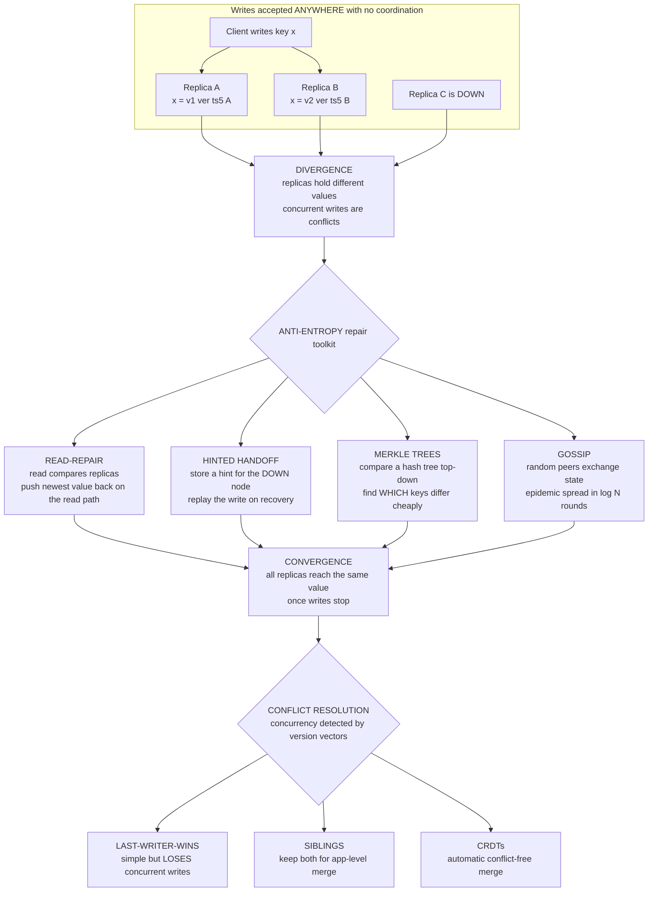

# 🔄 Eventual Consistency and Anti-Entropy

> [!abstract] TL;DR
> **Eventual consistency** is the weakest *useful* consistency model: it promises only that **if writes stop, all replicas eventually converge to the same value** — with no promise about *when*, and no promise that intermediate reads are fresh, ordered, or even mutually agreeing. You accept this weakness to buy the opposite of consensus: reads and writes **never block on coordination**, so the system stays **available and low-latency even under partitions** (the AP corner of CAP). Because writes are accepted anywhere, replicas *diverge*; the machinery that quietly drags them back together is **anti-entropy** — **read-repair**, **hinted handoff**, **Merkle-tree** comparison, and **gossip** — paired with a **conflict-resolution** policy (last-writer-wins, siblings, or CRDTs). This Dynamo-lineage design is the pragmatic backbone of internet-scale, geo-distributed storage: Amazon DynamoDB, Apache Cassandra, Riak, Voldemort, DNS, and CDN caches all live here. Understanding it *is* understanding how the AP world works.

---

## Intuition

**Analogy — a study group with private notebooks.** Picture five colleagues keeping a *shared* set of study notes, except each person edits **their own private copy** and only occasionally bumps into a neighbor and compares a few pages. When Ana updates the definition of a term, her notebook is now ahead of everyone else's — for a while the five copies genuinely **disagree**. Nobody waits for permission to write; nobody freezes their notebook until the whole group syncs. Instead, correctness comes from the *habit of gossiping*: every so often two people meet, spot which pages differ, and copy over whichever version is newer. As long as everyone keeps meeting and merging — **and as long as fresh edits eventually stop** — all five notebooks will **eventually match**, even though at any single instant they might not.

That habit is exactly eventual consistency. The system's top priority is that you can **always read and write your local copy immediately**, and it repairs the resulting divergence **in the background** rather than preventing it up front. The catch the analogy makes vivid: if two people edit the *same page* without having met since, you get **two conflicting versions of the truth**, and the group needs a rule for what to do about it — keep the later one, keep both, or merge them. That rule is the hard part, and everything technical below is either "how do the notebooks find their differences efficiently" or "what rule resolves a clash."

---

## How It Works

### The definition, stated precisely

**Eventual consistency** guarantees exactly one thing: *if clients stop submitting writes, then after some unspecified period every replica will converge to the same value.* Read that carefully for what it does **not** say. It says nothing about **when** convergence happens (could be milliseconds, could be minutes of gossip). It says nothing about **intermediate reads**, which may be **stale** (you read an old value), **out-of-order** (you see write 3 before write 2), or **divergent** (two replicas answer the same query differently at the same moment). It is deliberately the **weakest model that is still useful** — chosen when you want maximum **availability** and minimum **latency**, i.e. the **AP** side of the CAP theorem, developed in [[CAP_Theorem_and_PACELC]] and [[Consistency_Models_Spectrum]].

### Why anyone chooses such a weak guarantee

Because the alternative — strong consistency — requires **coordination on the critical path**: a write or read must talk to a quorum or a leader before it can return, which costs latency and, during a network partition, costs **availability** (the system must block or reject to stay correct). Eventual consistency inverts that: **reads and writes complete locally and never block**, so the system is **always writable, low-latency, and partition-tolerant**. That trade is ideal for high-scale, geo-distributed, or offline-capable workloads where a little staleness is harmless: **shopping carts** (better to accept an "add to cart" and reconcile later than to reject it), **social feeds**, **DNS** (records propagate lazily and that is fine), **CDN and application caches**, and mobile apps that must work offline. The setting is **leaderless or multi-leader replication**, developed in [[Replication_Strategies]] and [[Replication_Models]].

### The convergence problem this creates

Accepting writes anywhere is what makes the system available — and it is *also* what creates **divergence**. Two replicas can accept different writes to the same key before they have talked, so the system needs **background processes** to (1) **detect** which replicas differ, (2) **propagate** newer data to staler replicas, and (3) **resolve conflicts** when two writes to the same key were *concurrent* (neither causally saw the other). That whole reconciliation apparatus is called **anti-entropy** — literally, fighting the tendency of independently-mutating replicas to drift apart. Concurrency here is detected with **version vectors**: two writes conflict precisely when their version vectors are **incomparable**, the exact test built in [[Vector_Clocks_and_Causality]].

### The anti-entropy toolkit (the Dynamo / Cassandra repair machinery)

- **Read-repair (repair on the read path).** When a coordinator reads a key from several replicas and their responses disagree, it identifies the **newest version** and **writes it back** to the stale replicas *as part of serving the read*. Repair rides for free on read traffic — hot keys self-heal fast; cold keys need another mechanism.
- **Hinted handoff (availability under failure).** If a write's target replica is **down**, the coordinator stores a **hint** (a note: "deliver this write to node C when it comes back") on a temporary stand-in and **replays it on recovery**. This is what makes a **sloppy quorum** possible: the write succeeds against *any* N healthy nodes rather than the *specific* N owners, trading strict placement for availability.
- **Merkle trees (efficient background diff).** To repair cold keys without shipping the entire dataset, two replicas build a **hash tree over their key ranges** and compare it **top-down**: if two subtree hashes match, that whole range is identical and is skipped; only where hashes differ do they descend, ultimately exchanging just the keys that actually differ. Cost is **O(number of differences)**, not O(size of data) — the basis of Cassandra's `nodetool repair`.
- **Gossip (epidemic dissemination).** Each node periodically picks a **random peer** and exchanges state — data updates *and* membership/failure information. Like an epidemic (the **SI / SIR** models), an update reaches all N nodes in **O(log N)** rounds with no central coordinator, giving robust, scalable convergence. Membership gossip (e.g. **SWIM**) is how the cluster learns who is alive, feeding hinted handoff and repair. Developed in the planned `Gossip_and_Epidemic_Protocols`.
- **Active anti-entropy.** A scheduled, periodic **full comparison** (Merkle-driven) between replica pairs, so even never-read keys eventually converge — the safety net beneath read-repair.

### Conflict detection and resolution

Detection is causality: attach a **version vector** to each value; two versions **conflict** iff their vectors are **incomparable** (each ahead of the other in some coordinate). Resolution is a *policy choice*, and the choice is where data is silently won or lost:

- **Last-writer-wins (LWW)** — keep the version with the highest timestamp, discard the rest. Dead simple and used everywhere (Cassandra, DynamoDB's default), **but it is lossy**: two genuinely concurrent updates become "one wins, one silently vanishes." The famous caution is *"LWW throws away data."*
- **Siblings (keep both, resolve in the app)** — Dynamo's approach: return *all* conflicting versions to the client and let application semantics merge them (a shopping cart unions its items, so a lost update is a *disappearing* item — unacceptable). Correct but pushes complexity to the app.
- **CRDTs (conflict-free merge)** — design the data type so concurrent updates **merge deterministically and automatically** (a grow-only counter sums, an OR-Set unions). This yields **strong eventual consistency** — convergence *without any conflict-resolution step* — developed in [[CRDTs]].

### Flow / Architecture



---

## Key Concepts

### Secondary (plain intuition)
- **Eventual consistency** = everyone can read and write their own copy right away; the copies are patched up to match **later**, in the background.
- The only promise: **stop writing long enough and all copies end up identical**. It does **not** promise your reads are fresh or that two copies agree *right now*.
- You accept staleness to get **always-on, fast** service that survives network cuts.
- **Anti-entropy** is the "keep gossiping and merging" habit that makes the copies actually converge.

### Undergraduate (CS foundations)
- **The trade:** eventual consistency is the **AP** choice under CAP — no coordination on reads/writes, so **available + low-latency + partition-tolerant**, at the cost of recency and ordering.
- **Divergence is inherent:** accepting writes at any replica means replicas *will* disagree; the system needs background reconciliation.
- **The repair toolkit:** **read-repair** (fix stale replicas during a read), **hinted handoff** (buffer writes for down nodes, sloppy quorums), **Merkle trees** (hash-tree diff to find differing keys in O(differences)), **gossip/active anti-entropy** (periodic random-pair reconciliation).
- **Conflict detection** uses **version vectors** — concurrent writes are *incomparable* vectors, per [[Vector_Clocks_and_Causality]].
- **Conflict resolution policies:** LWW (simple, lossy), siblings (app merges), CRDTs (automatic merge).

### Graduate (system-level)
- **Dynamo as a blueprint:** consistent hashing for placement + leaderless **(N, R, W)** quorums + version vectors + read-repair + hinted handoff + Merkle anti-entropy + gossip membership. `R + W > N` gives *tunable* strength; pure eventual consistency is any weaker setting. Spawned Cassandra, Riak, Voldemort, DynamoDB.
- **Strong eventual consistency (SEC):** CRDTs guarantee that any two replicas that have received the *same set* of updates are in the *same state* — convergence with **no rollback and no resolution step** — because merge is a **join on a semilattice** (commutative, associative, idempotent).
- **Strengthening without giving up availability:** layer **session guarantees** (read-your-writes, monotonic reads, monotonic writes, writes-follow-reads) or **causal / causal+ consistency** on top to eliminate the worst anomalies while staying partition-tolerant — the strongest model achievable under partition per the CAP theorem.
- **Convergence as an epidemic:** anti-entropy is literally the **SI/SIR** epidemic model; gossip reaches all nodes in **O(log N)** rounds with high probability and is robust to node churn — hence its use for both data and membership (SWIM).
- **Operational reality:** anti-entropy repair is a real cost — Cassandra operators schedule `nodetool repair` to bound the window in which *never-read* keys stay divergent; skipping it risks resurrecting deleted data ("zombie" tombstone issues).

---

## Python Demo

A pure-standard-library simulation of an **eventually consistent key-value store** with **anti-entropy**. Five replicas accept writes locally (each tagged with a **last-writer-wins version** `(timestamp, writer_id)`) and **diverge**; nodes randomly **fail and recover**. Convergence is driven by (a) **read-repair** and (b) periodic **pairwise anti-entropy** that uses a **Merkle-tree diff** to find *which* keys differ without shipping the whole store. We run a write-heavy phase, then **stop writing**, and watch every replica **converge to an identical state**. `matplotlib` visualizes divergence-then-convergence; no numpy required.

```python
"""
Eventual Consistency with ANTI-ENTROPY -- a runnable simulation.

N replicas of a key-value store accept writes LOCALLY and diverge. Convergence
is driven by two anti-entropy mechanisms:
  (a) READ-REPAIR   -- a read comparing replicas pushes the NEWEST value back.
  (b) PAIRWISE SYNC -- random replica pairs reconcile using a MERKLE-TREE diff
                       to find WHICH keys differ, then merge by last-writer-wins.
We inject writes + node failures/recoveries, then STOP writes and watch every
replica CONVERGE to an identical state. Pure stdlib + matplotlib (no numpy).
"""

import hashlib
import random
from collections import defaultdict
import matplotlib.pyplot as plt

random.seed(7)

KEYS = [f"k{i}" for i in range(8)]      # small fixed keyspace
NBUCKETS = 4                            # Merkle leaf buckets (a power of two)

# ---- global logical clock: LWW versions are (timestamp, writer_id) tuples ----
_clock = 0
def tick():
    global _clock
    _clock += 1
    return _clock

def newer(va, vb):
    """LWW compare. Tuples order lexicographically: higher ts wins, id breaks ties."""
    return va > vb

# ---------------------------------------------------------------------------
# MERKLE TREE over a replica's store. Leaves are NBUCKETS buckets of keys; a
# binary tree of hashes sits above them. Two replicas compare the tree TOP-DOWN
# and open only the subtrees whose hashes differ -> O(differences), not O(all).
# ---------------------------------------------------------------------------
def bucket_of(key):
    return int(hashlib.sha256(key.encode()).hexdigest(), 16) % NBUCKETS

def leaf_hashes(store):
    """One hash per bucket over its sorted (key, version) entries (value omitted)."""
    buckets = defaultdict(list)
    for k, (val, ver) in store.items():
        buckets[bucket_of(k)].append((k, ver))
    return [hashlib.sha256(repr(sorted(buckets[b])).encode()).hexdigest()
            for b in range(NBUCKETS)]

def build_tree(leaves):
    """Return levels: level[0]=leaves, ..., level[-1]=[root]."""
    levels, cur = [leaves], leaves
    while len(cur) > 1:
        cur = [hashlib.sha256((cur[i] + cur[i + 1]).encode()).hexdigest()
               for i in range(0, len(cur), 2)]
        levels.append(cur)
    return levels

def tree_diff(store_a, store_b):
    """Walk both Merkle trees from the root, descending ONLY where hashes differ.
    Return (differing_leaf_buckets, node_comparisons)."""
    la, lb = build_tree(leaf_hashes(store_a)), build_tree(leaf_hashes(store_b))
    comparisons, differing = 0, []
    frontier = [(len(la) - 1, 0)]                 # start at the root node
    while frontier:
        lvl, idx = frontier.pop()
        comparisons += 1
        if la[lvl][idx] == lb[lvl][idx]:
            continue                              # identical subtree -> PRUNE
        if lvl == 0:
            differing.append(idx)                 # a leaf bucket that differs
        else:
            frontier += [(lvl - 1, 2 * idx), (lvl - 1, 2 * idx + 1)]
    return differing, comparisons

def keys_in_buckets(store_a, store_b, buckets):
    bset = set(buckets)
    return {k for k in set(store_a) | set(store_b) if bucket_of(k) in bset}

# ---------------------------------------------------------------------------
# A REPLICA: local key-value store + liveness flag. Merge is last-writer-wins.
# ---------------------------------------------------------------------------
class Replica:
    def __init__(self, rid):
        self.id = rid
        self.store = {}                # key -> (value, version=(ts, writer_id))
        self.alive = True

    def local_write(self, key, value):
        self.store[key] = (value, (tick(), self.id))

    def apply(self, key, value, ver):  # merge one incoming entry by LWW
        if key not in self.store or newer(ver, self.store[key][1]):
            self.store[key] = (value, ver)

def anti_entropy(a, b):
    """Reconcile two replicas: Merkle-diff -> differing buckets -> exchange ONLY
    those keys -> LWW-merge both directions. Returns number of keys shipped."""
    if not (a.alive and b.alive):
        return 0
    buckets, _ = tree_diff(a.store, b.store)
    keys = keys_in_buckets(a.store, b.store, buckets)
    for k in keys:
        ea, eb = a.store.get(k), b.store.get(k)
        if ea: b.apply(k, ea[0], ea[1])
        if eb: a.apply(k, eb[0], eb[1])
    return len(keys)

def read_repair(key, replicas):
    """Read a key from all alive replicas; find the newest version; write it back
    to any stale-or-missing replica -- repair on the read path."""
    responders = [r for r in replicas if r.alive and key in r.store]
    if not responders:
        return None
    val, ver = max((r.store[key] for r in responders), key=lambda e: e[1])
    for r in replicas:
        if r.alive:
            r.apply(key, val, ver)
    return val

def divergence(replicas):
    """Number of keys on which the alive replicas do NOT all agree. 0 => converged."""
    versions = defaultdict(set)
    for r in replicas:
        if r.alive:
            for k, (val, ver) in r.store.items():
                versions[k].add(ver)
    return sum(1 for s in versions.values() if len(s) > 1)

# ---------------------------------------------------------------------------
# SIMULATION: a write-heavy phase (replicas diverge, nodes fail/recover), then
# writes STOP and anti-entropy drives everyone to an identical state.
# ---------------------------------------------------------------------------
N, WRITE_ROUNDS, QUIET_ROUNDS = 5, 45, 45
replicas = [Replica(i) for i in range(N)]
div_hist, key_trace, ship_log = [], [], []

for rnd in range(WRITE_ROUNDS + QUIET_ROUNDS):
    writing = rnd < WRITE_ROUNDS

    # --- failures / recoveries during writing; the network HEALS in quiescence ---
    if writing:
        for r in replicas:
            if r.alive and random.random() < 0.05:
                r.alive = False                      # a replica goes down
            elif not r.alive and random.random() < 0.30:
                r.alive = True                       # ...and later recovers
        if sum(r.alive for r in replicas) < 3:       # never let the cluster collapse
            for r in replicas:
                r.alive = True
    else:
        for r in replicas:
            r.alive = True                           # partitions heal, everyone back

    alive = [r for r in replicas if r.alive]

    # --- local writes only during the writing phase (this is what diverges) ---
    if writing:
        for _ in range(3):
            random.choice(alive).local_write(random.choice(KEYS),
                                             random.randint(0, 999))

    # --- (a) occasional read-repair on a random key ---
    if random.random() < 0.4:
        read_repair(random.choice(KEYS), replicas)

    # --- (b) anti-entropy: gossip harder once writes have stopped ---
    for _ in range(2 if writing else N):
        alive = [r for r in replicas if r.alive]
        if len(alive) >= 2:
            a, b = random.sample(alive, 2)
            ship_log.append((rnd, anti_entropy(a, b)))

    div_hist.append(divergence(replicas))
    key_trace.append([(r.store[KEYS[0]][0] if r.alive and KEYS[0] in r.store else None)
                      for r in replicas])

# --- verify convergence ---
distinct_states = {tuple(sorted((k, v[0], v[1]) for k, v in r.store.items()))
                   for r in replicas}
print(f"final divergence (unconverged keys): {div_hist[-1]}")
print(f"distinct replica states after quiescence: {len(distinct_states)}"
      f"  -> {'ALL REPLICAS CONVERGED' if len(distinct_states) == 1 else 'NOT converged'}")

# ---------------------------------------------------------------------------
# VISUALIZATION: divergence-then-convergence over time.
# ---------------------------------------------------------------------------
fig, axes = plt.subplots(1, 3, figsize=(16, 4.8))

# Panel 1: divergence over time -- rises while writing, collapses to 0 after.
ax1 = axes[0]
ax1.plot(range(len(div_hist)), div_hist, color="crimson", lw=1.8)
ax1.axvline(WRITE_ROUNDS, ls="--", color="black")
ax1.text(WRITE_ROUNDS + 1, max(div_hist) * 0.9, "writes stop", fontsize=9)
ax1.fill_between(range(WRITE_ROUNDS, len(div_hist)), 0, max(div_hist) + 0.5,
                 color="green", alpha=0.06)
ax1.set_xlabel("round"); ax1.set_ylabel("keys where replicas disagree")
ax1.set_title("Divergence then CONVERGENCE\nanti-entropy drives disagreement to 0")

# Panel 2: value of one key at each replica -- lines diverge, then collapse to one.
ax2 = axes[1]
for rid in range(N):
    xs = [t for t in range(len(key_trace)) if key_trace[t][rid] is not None]
    ys = [key_trace[t][rid] for t in xs]
    ax2.plot(xs, ys, marker="o", ms=2.5, lw=1, alpha=0.8, label=f"replica {rid}")
ax2.axvline(WRITE_ROUNDS, ls="--", color="black")
ax2.set_xlabel("round"); ax2.set_ylabel(f"value held for key '{KEYS[0]}'")
ax2.set_title("Per-replica value of one key\nreplicas disagree, then agree")
ax2.legend(fontsize=7, ncol=2)

# Panel 3: Merkle efficiency -- keys shipped per sync vs shipping the whole store.
ax3 = axes[2]
rounds_s = [r for r, _ in ship_log]
ships = [k for _, k in ship_log]
ax3.scatter(rounds_s, ships, s=12, alpha=0.4, color="#1f77b4", label="keys shipped / sync")
ax3.axhline(len(KEYS), ls="--", color="gray", label="ship entire store")
ax3.axvline(WRITE_ROUNDS, ls="--", color="black")
ax3.set_xlabel("round"); ax3.set_ylabel("keys transferred")
ax3.set_ylim(-0.3, len(KEYS) + 0.5)
ax3.set_title("Merkle diff is O(differences)\nships only keys that differ")
ax3.legend(fontsize=7)

fig.suptitle("Eventual consistency via anti-entropy: replicas converge once writes stop",
             fontweight="bold")
fig.tight_layout()
plt.savefig("eventual_consistency.png", dpi=120)
print("saved eventual_consistency.png")
```

**What you observe.** During the writing phase the **divergence curve** stays high — local writes keep re-diverging the replicas faster than the two anti-entropy syncs per round can heal them, and a down node freezes with stale data. The moment **writes stop** (dashed line), gossip catches up: within a handful of rounds every unconverged key drops to **zero**, the per-key value lines **collapse onto a single value**, and the final check prints **one distinct replica state — all replicas converged**. The third panel shows the Merkle payoff: each sync ships only the **handful of keys that actually differ** (dropping to ~0 as replicas align), never the whole store, so anti-entropy cost is **O(differences)**, not O(dataset). This is "eventually" made concrete — and made *efficient*.

---

## Real-World Applications

- **Amazon Dynamo and DynamoDB.** The 2007 Dynamo paper is the blueprint: consistent hashing, leaderless **(N, R, W)** quorums, version vectors, **read-repair**, **hinted handoff**, **Merkle-tree** anti-entropy, and **gossip** membership. Its explicit goal — an *always-writeable* shopping cart — is the canonical eventual-consistency use case. DynamoDB productizes the lineage with tunable read consistency (eventual by default, strongly-consistent reads on request). See [[Consistent_Hashing]] and [[Consensus_and_Quorums]].
- **Apache Cassandra.** A direct Dynamo descendant. Tunable consistency per query (`ONE`, `QUORUM`, `ALL`), **read-repair** on the read path, **hinted handoff** for down nodes, and operator-scheduled **Merkle-tree anti-entropy** via `nodetool repair`. LWW-with-timestamp resolution is the default — with all its lossiness. See [[Cassandra]].
- **Riak and Voldemort.** Riak exposes conflict **siblings** through a `causal context` (vclock) header and lets the app merge them (or uses Riak Data Types, which are CRDTs). Voldemort used the same version-vector approach — the "keep both, resolve in the app" branch of the conflict tree.
- **DNS.** The internet's original eventually-consistent store: an updated record propagates lazily through caches bounded by TTLs. Resolvers everywhere may serve stale answers for a while; the system stays available and globally scalable precisely because it does **not** coordinate.
- **CDN and application caches.** Edge caches, and cache layers like write-behind / cache-aside setups, are eventually consistent by construction — the point is to answer locally and reconcile with the origin later. This is the everyday face of the AP world in [[Consistency_Patterns]].

---

## Common Pitfalls

- **"Eventual" means "soon."** It does not. Convergence time is *unbounded* by the model; if a replica stays partitioned, it stays divergent until it rejoins. Never build correctness on an assumed convergence deadline — enforce it operationally (active anti-entropy, repair schedules).
- **Trusting last-writer-wins to be safe.** LWW **silently discards** concurrent writes: two updates to the same key become "one wins, one vanishes, no error." For anything where lost updates matter (carts, counters, sets) use **siblings** or a **CRDT**, not LWW. This is *the* classic eventual-consistency data-loss bug.
- **Relying on wall-clock timestamps to order writes.** LWW timestamps come from clocks that **skew**. A node with a fast clock can shadow every other node's writes; a backwards clock step can resurrect old data. Use logical/version vectors for *detection*; treat physical-clock LWW as a lossy policy, not a truth (see `Physical_Clocks_and_Synchronization`).
- **Skipping active anti-entropy.** Read-repair only fixes keys that get *read*. Cold, never-read keys can stay divergent indefinitely — and in stores with tombstones, skipping scheduled repair within the tombstone GC window lets **deleted data come back to life** ("zombies"). Cassandra makes `nodetool repair` an operational requirement for exactly this reason.
- **Confusing "concurrent" with "conflicting."** Version vectors *detect* concurrency; they do not tell you it is a semantic clash. Two users adding different items to a cart are concurrent but should **both** survive (an OR-Set unions them). Detection is mechanical; resolution needs application meaning.
- **Sloppy-quorum surprises.** Hinted handoff lets a write succeed on stand-in nodes, so a subsequent `R`-node read may not yet see it even when `R + W > N` on paper — the durability/consistency guarantee is weaker than the strict-quorum arithmetic suggests during failures.
- **Assuming read-your-writes for free.** Plain eventual consistency does **not** guarantee you can read your own write (you might hit a stale replica). If users expect it, add **session guarantees** (sticky routing, read-your-writes) on top.

---

## Related Concepts

Verified in-vault links:

- [[Consistency_Models_Spectrum]] — the sibling that places eventual consistency at the weak end and shows what causal/session layers add above it.
- [[CAP_Theorem_and_PACELC]] — the theory sibling: eventual consistency is the **AP** (and PACELC "EL") choice — trade consistency for availability under partition, latency in normal operation.
- [[CRDTs]] — the conflict-free-merge branch of resolution and the route to **strong eventual consistency** (convergence with no resolution step).
- [[Replication_Models]] — leaderless and multi-leader replication is the writes-anywhere setting that makes divergence, and thus anti-entropy, necessary.
- [[Vector_Clocks_and_Causality]] — the version-vector algebra that *detects* concurrent (conflicting) writes: incomparable vectors = conflict. The detection half of anti-entropy.
- [[CAP_Theorem]] — the System-Design applied view of the availability-vs-consistency trade this model takes.
- [[Consistency_Models]] — the Database-vault treatment of where eventual sits among the consistency guarantees.
- [[Consistency_Patterns]] — the system-design patterns (write-behind caches, read-repair, quorum tuning) that operationalize this model.
- [[Replication_Strategies]] — the Database-vault view of leaderless/multi-leader replication that produces divergence.
- [[Consensus_and_Quorums]] — the `(N, R, W)` quorum tuning and sloppy quorums Dynamo-style stores expose; the CP counterpoint to full eventual consistency.
- [[Consistent_Hashing]] — how Dynamo-lineage stores place the replicas that anti-entropy later reconciles.
- [[Cassandra]] — a production Dynamo descendant; read-repair, hinted handoff, and `nodetool repair` Merkle anti-entropy in the wild.
- [[Eventual_Consistency]] — the Java-vault companion note with an implementation-focused treatment.
- [[Failure_Detectors]] — gossip-based membership and failure detection is what feeds hinted handoff and anti-entropy scheduling.
- [[Logical_Clocks_and_Happens_Before]] — the causality foundation underneath version vectors and conflict detection.
- [[Distributed_Systems_Overview]] — the parent map; eventual consistency is the pragmatic backbone of the AP-side systems it surveys.

> Planned siblings in this `Distributed_Systems_Theory` vault, referenced in prose above (not yet created): `Quorum_Systems`, `Gossip_and_Epidemic_Protocols`, `Physical_Clocks_and_Synchronization`.

---

## Review Questions

**Secondary (understanding).** Using the study-group-with-notebooks analogy, explain what "eventually consistent" promises and what it pointedly does *not* promise. Why is the group's habit of occasionally meeting and copying the newer page essential, and what goes wrong if two people edit the same page without having met?

**Undergraduate (application).** You run a leaderless store with `N = 3` replicas and default eventual consistency. A key is written on replica A, which then crashes before the write propagates; a client immediately reads the key from replicas B and C and gets the old value. Walk through how **read-repair**, **hinted handoff**, and periodic **Merkle-tree anti-entropy** would each contribute to the key eventually converging, and explain why the Merkle diff lets B and C sync without shipping the entire dataset.

**Graduate (analysis / trade-offs).** Your team must choose a conflict-resolution policy for a shopping-cart service on a Dynamo-style store. Compare **last-writer-wins**, **siblings**, and a **CRDT (OR-Set)** in terms of correctness (lost updates), operational and application complexity, and the guarantees each provides. Then explain what **strong eventual consistency** means, why a CRDT achieves it *without* a resolution step, and what you would additionally need to bolt on to give users **read-your-writes** without abandoning availability.

---

## Sources

- DeCandia, G. et al. (2007). *Dynamo: Amazon's Highly Available Key-value Store.* SOSP '07. [PDF](https://www.allthingsdistributed.com/files/amazon-dynamo-sosp2007.pdf)
- Vogels, W. (2009). *Eventually Consistent.* Communications of the ACM, 52(1). [DOI](https://doi.org/10.1145/1435417.1435432)
- Demers, A. et al. (1987). *Epidemic Algorithms for Replicated Database Maintenance.* PODC '87 — the foundational anti-entropy / gossip paper. [DOI](https://doi.org/10.1145/41840.41841)
- Shapiro, M., Preguiça, N., Baquero, C., Zawirski, M. (2011). *Conflict-free Replicated Data Types.* SSS '11 — strong eventual consistency. [PDF](https://hal.inria.fr/inria-00609399/document)
- Kleppmann, M. (2017). *Designing Data-Intensive Applications*, Chapter 5 (Replication). O'Reilly.
- Das, A., Gupta, I., Motivala, A. (2002). *SWIM: Scalable Weakly-consistent Infection-style Process Group Membership Protocol.* DSN '02. [PDF](https://www.cs.cornell.edu/projects/Quicksilver/public_pdfs/SWIM.pdf)

---

#distributed-systems #eventual-consistency #anti-entropy #read-repair #dynamo
