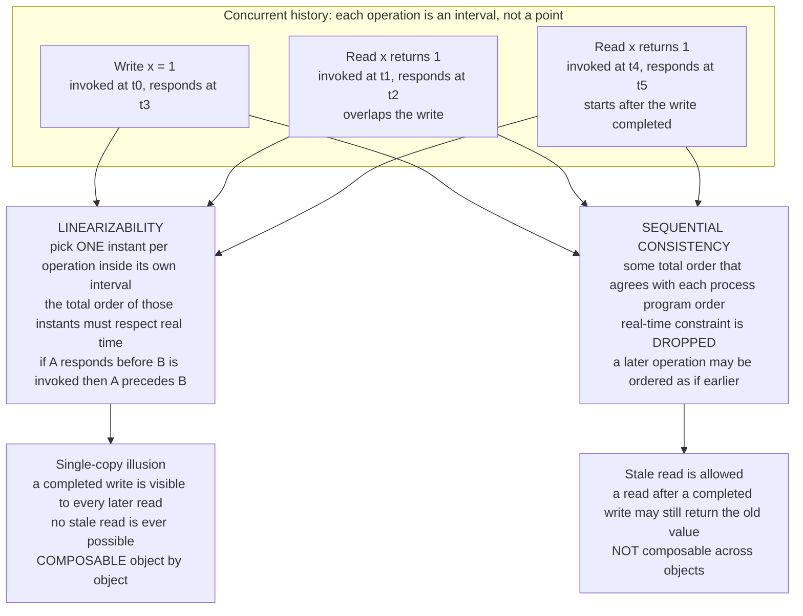

# 🎯 Linearizability and Sequential Consistency

> [!abstract] TL;DR
> **Linearizability** is the gold-standard strong-consistency model: every operation on a replicated object appears to take effect **atomically at a single instant** (its *linearization point*) somewhere between when it was called and when it returned, and that instant order **respects real time** — if operation A finished before B started, A is ordered before B. The payoff is the **single-copy illusion**: the whole distributed system behaves as if there is exactly one copy of the data, so the moment a write completes, *every* later read anywhere sees it — no stale answers. **Sequential consistency** (Lamport) is the strictly weaker cousin that keeps a single agreed total order but **drops the real-time requirement**: it only preserves each process's own program order, so a slow process's operations can be treated "as if" they happened earlier. Linearizability is the most intuitive guarantee precisely because it is how a single machine already behaves — and, precisely because it must simulate that single copy across a network, it is the **most expensive**: it demands coordination (consensus or quorums) on every operation, costing latency and, under a partition, availability.

---

## Intuition

**Analogy.** Imagine a shared whiteboard in an open-plan office that dozens of people read and write. The board is the promise: **there is only one board.** The instant you finish writing "meeting moved to 3pm," anyone who walks up afterward — from any desk, anywhere in the building — reads *3pm*. Nobody sees the old value once your marker leaves the board. That is **linearizability**: even though the office is huge and people are spread out, everyone shares one physical surface, and the world snaps to your update the moment your write completes. There is no "time travel" (you never read a value older than one you already saw) and no staleness (a finished write is instantly visible to all later reads).

Now weaken it. Suppose instead each person keeps a **personal photocopy** of the board and a central clerk occasionally reconciles them into one consistent *story* that everyone eventually agrees on — but the clerk is allowed to shuffle the timeline so long as each *individual* person's own actions stay in the order they did them. Two people can end up disagreeing about who "went first," and someone can read a value that is technically stale by the wall clock, yet everyone still agrees on *one* global sequence that is internally legal. That relaxed promise is **sequential consistency**: one agreed order, per-person order preserved, but the real-world clock is no longer the referee.

The single-copy board is the most natural thing in the world to reason about — which is exactly why it is the most expensive to fake when the "board" is actually five machines on three continents.

---

## How It Works

### Core Mechanics

1. **Operations are intervals, not points.** On a real system a call takes time: an operation has an **invocation** (when the client issues it) and a **response** (when the client learns the result). While it is in flight it *overlaps* other operations. A concurrent **history** is just the set of these intervals with their arguments and return values.

2. **Linearizability (Herlihy & Wing, 1990).** A history is *linearizable* if you can choose, for **each** operation, a single instant — the **linearization point** — lying **inside its own `[invocation, response]` interval**, such that executing the operations in the order of those instants is a **legal sequential execution of the object**, and the order **respects real time**: if operation A responded before operation B was invoked, then A's point precedes B's. Equivalently: the concurrent history is equivalent to some legal *sequential* history that also honors real-time order. Two operations that **overlap** may be linearized in either order (you have freedom to place their points); two operations that are **disjoint in time** are forced into their real-time order.

3. **The single-copy illusion.** Because every operation atomically "takes effect" at one instant and the order matches real time, the system is indistinguishable from a single machine holding one copy of the data, updated one operation at a time. This is why linearizability is also called **atomic consistency** or **external consistency**. It is the strongest single-object model on the consistency spectrum (see the planned `Consistency_Models_Spectrum` and [[Consistency_Models]]).

4. **The real-time recency guarantee — the defining feature.** Once a write **completes**, every read whose invocation is later in *wall-clock* time — issued by any client, anywhere — must observe that write or a *newer* value. **No stale reads.** This is what makes linearizability match human intuition ("I just wrote it, of course you can see it"), and it is *also* the source of its cost, because guaranteeing global recency requires talking across nodes on every operation (this is where bounded physical time matters — see [[Physical_Clocks_and_Synchronization]] and Spanner's TrueTime).

5. **Sequential consistency (Lamport, 1979).** A history is *sequentially consistent* if there exists **some** total order over all operations such that (a) it is consistent with each individual process's **program order** (the order that process issued its own operations), and (b) it is a legal sequential execution, and (c) **all processes agree on that single order**. Crucially it need **not** match real time: a slower process's operations may be placed "as if" they occurred earlier. This is exactly the classic shared-memory / multiprocessor model (see [[Memory_Consistency_Models]] and [[Reliable_and_Ordered_Broadcast]]).

6. **Linearizability vs sequential — the one difference that matters: real time.** Both demand a single legal total order all processes agree on. Linearizability additionally forces that order to honor the real-time (wall-clock) order between **non-overlapping** operations across *different* processes; sequential consistency only forces per-process program order. So the classic witness is: **write(x)=1 completes, then later a different process reads x=0.** That is sequentially consistent (a legal order `read0, write1` exists, each process's order trivially preserved) but **not** linearizable (the read started after the write finished, so real time demands it see 1). The Python demo below constructs exactly this case.

7. **Composability / locality — linearizability's killer feature.** Linearizability is **local**: a system made of multiple objects is linearizable **if and only if every individual object is linearizable**. This lets you reason **object-by-object** and compose linearizable components into a linearizable whole for free. **Sequential consistency is NOT composable**: you can have two objects that are each sequentially consistent, yet their combination is not. This is a major practical reason linearizability, despite its cost, is the *useful* strong model — you can build and verify it modularly.

8. **The cost — why you don't make everything linearizable.** Providing real-time recency means each operation must **coordinate** with enough of the cluster to be sure no newer value exists: consensus, or read/write **quorums**. That coordination costs **latency** on every request, and by the **CAP theorem** a linearizable system must sacrifice **availability** during a network partition (it must refuse or block rather than return possibly-stale data). **PACELC** adds the else-clause: *even when there is no partition*, linearizability pays a **latency** premium for the round trips. So linearizability is reserved for the few places that truly need it (coordination), while data planes use weaker models. See [[CAP_Theorem]] and the planned `CAP_Theorem_and_PACELC`.

9. **How linearizability is actually implemented.**
   - **Consensus log (Raft / Paxos):** a single replicated, totally-ordered log gives writes a real-time-consistent order. Subtlety: **reads must not bypass the log.** A stale leader that lost an election but doesn't know it can serve a **stale read**. Fixes: route reads through the leader **after** confirming leadership via a **read lease** or a **quorum heartbeat (ReadIndex)**, or run reads through the log too. See [[Consensus_and_Raft]] and [[The_Consensus_Problem]].
   - **ABD-style quorum register:** with read quorum `R` and write quorum `W` on `N` replicas where **`R + W > N`**, every read overlaps every completed write. A linearizable register additionally needs a **write-back / read-repair** phase (the reader propagates the highest value it saw to a quorum before returning) so that two concurrent reads can't disagree. See [[Consensus_and_Quorums]] and the planned `Quorum_Systems`.
   - **Single leader with synchronous reads:** simplest correct form — all reads and writes serialized through one node whose leadership is currently guaranteed.

10. **Checking linearizability is hard.** Deciding whether an arbitrary history is linearizable is **NP-complete** in general (the search over which overlapping operations linearize in which order is combinatorial). In practice, tools like **Jepsen** with **Knossos** or **Porcupine** generate concurrent workloads against real databases and then **brute-force / prune the search** for a valid linearization — the famous "Jepsen analyses" that repeatedly debunk vendors' consistency marketing by *finding* histories with no valid order. The demo below is a miniature of exactly this checker.

11. **Linearizability vs serializability — do not confuse them.** **Linearizability** is a *single-object*, real-time recency property (about one register/key). **Serializability** is a *transaction isolation* property: multi-object transactions appear to execute in *some* serial order — but that order need not match real time, and it says nothing about single-object recency. Combine both and you get **strict serializability** = serializable transactions whose serial order also respects real time — this is Google Spanner's **"external consistency."** See [[Distributed_Transactions_in_Databases]] and [[Isolation_Levels]].

### Flow / Architecture



---

## Key Concepts

**Secondary (intuition level).** Pretend a group of far-apart people share one whiteboard. Linearizability is the promise that the board really is *one* board: the instant you finish writing on it, everyone who looks afterward sees your update — never the old text. Sequential consistency is a looser promise: everyone eventually agrees on one story of what happened and each person's own actions stay in order, but someone might briefly read an out-of-date value because the timeline was allowed to be shuffled. The strong promise feels natural, but keeping many machines pretending to be one board is slow and, if the network splits, sometimes impossible.

**Undergraduate (CS background).**
- **Linearizable history** = there is an assignment of a **linearization point** inside every operation's `[inv, res]` interval such that the induced sequential order is (i) **legal** for the object's spec and (ii) **respects real time** (`A.res < B.inv ⟹ A before B`).
- **Register spec** (single-copy): `read` returns the value of the most recent preceding `write` (or the initial value); `write(v)` sets the value; `CAS(old, new)` succeeds and sets `new` **iff** the current value equals `old`, else fails and leaves it unchanged.
- **Sequential consistency** relaxes constraint (ii) to only **per-process program order**; the cross-process real-time edges are dropped. So `linearizable ⟹ sequentially consistent`, but not vice-versa. Real-time order is a *superset* of program order (a process waits for a response before its next call), which is why linearizability is strictly stronger.
- **Locality:** a set of objects is linearizable iff each object is — the property **composes**. Sequential consistency does **not** compose.
- **The witness that separates them:** `write(1)` completes at t=10; a *different* process's `read` at t=20 returns `0`. Sequentially consistent (order `read0, write1` is legal, program orders trivial); not linearizable (real time forces the read to see `1`).

**Graduate (systems-level).**
- **Cost model.** Linearizability requires a synchronization point that all operations funnel through with respect to *global real time*. Implementations pay for it with **consensus** (a Raft/Paxos log) or **intersecting quorums** (`R + W > N`) plus a **write-back** phase for reads. By CAP, a linearizable register cannot be **available** under a partition; by PACELC, it pays **latency** even without one. This is why coordination services (config, locks, leader election) are linearizable while bulk data stores default to weaker models.
- **The stale-leader read.** A Raft leader that has been superseded but not yet learned of it will happily serve a read that is *stale* — linearizability is violated silently. Correct systems gate reads behind a **leader lease** (safe only under bounded clock error) or a **ReadIndex quorum round-trip**, or run reads through the log. This is the single most common way "linearizable" systems leak staleness.
- **Verification is NP-complete.** Checking a history reduces to searching the exponential space of linearizations of overlapping operations. Practical checkers (Knossos, Porcupine, Elle-adjacent tools) prune aggressively using the **real-time partial order** and incremental spec evaluation — precisely the backtracking-over-minimal-elements strategy in the demo.
- **The isolation vs consistency axis.** Linearizability is *consistency* (recency of a single object across replicas); serializability is *isolation* (atomicity of multi-key transactions). They are **orthogonal** — a database can be serializable but not linearizable (stale snapshots) or linearizable-per-key but not serializable (no multi-key atomicity). **Strict serializability** = both, and is what Spanner's TrueTime-based **external consistency** delivers globally.

---

## Python Demo

```python
"""
A LINEARIZABILITY CHECKER over concurrent register histories, plus a
SEQUENTIAL-CONSISTENCY checker for contrast.

Model
-----
A single shared register (initial value 0) with operations:
    write(v)     -> ack        legal always; new state = v
    read()       -> r          legal iff r == current state
    cas(old,new) -> True/False succeeds iff state == old, then state = new

Each operation is an INTERVAL with an invocation time (inv) and a response
time (res) per client.

Checker (Wing & Gong / Herlihy-Wing style, brute-force backtracking)
--------------------------------------------------------------------
Search for a total order of the operations that is:
  (a) a legal sequential register execution, AND
  (b) consistent with a partial order `precedes`.
For LINEARIZABILITY  : precedes(A,B) = A returned before B was invoked (REAL TIME).
For SEQUENTIAL cons. : precedes(A,B) = same client and A called before B (PROGRAM ORDER).

Any linear extension is built left-to-right by only ever placing a MINIMAL
remaining operation (one nothing remaining is forced to precede) -- this is
sound AND complete for complete histories -- and checking legality against the
sequential spec incrementally, backtracking on any illegal step.

Pure standard library + matplotlib (numpy not required).
"""

from dataclasses import dataclass
import matplotlib.pyplot as plt

INIT = 0  # initial register value


@dataclass
class Op:
    client: str      # issuing process
    kind: str        # 'write' | 'read' | 'cas'
    arg: object      # write: value ; read: None ; cas: (old, new)
    ret: object      # read: value returned ; cas: True/False ; write: None
    inv: float       # invocation (call) time
    res: float       # response (return) time


def describe(op):
    if op.kind == "write":
        return f"{op.client}: write x={op.arg}"
    if op.kind == "read":
        return f"{op.client}: read -> {op.ret}"
    old, new = op.arg
    return f"{op.client}: cas {old}->{new} = {op.ret}"


def apply_op(op, state):
    """Sequential single-copy register spec. Returns (legal, new_state)."""
    if op.kind == "write":
        return True, op.arg
    if op.kind == "read":
        return (op.ret == state), state
    old, new = op.arg                       # compare-and-swap
    if state == old:
        return (op.ret is True), new        # success path
    return (op.ret is False), state         # failure path, state unchanged


def search(ops, precedes):
    """Backtracking search for a legal total order respecting `precedes`.
       Returns (found, order_as_list_of_indices)."""
    n = len(ops)

    def minimal(rem):
        # indices that NO remaining op is forced to precede -> valid next points
        return [i for i in rem
                if not any(precedes(ops[j], ops[i]) for j in rem if j != i)]

    def rec(rem, state, order):
        if not rem:
            return True, order
        for i in minimal(rem):
            ok, new_state = apply_op(ops[i], state)
            if ok:
                done, full = rec([j for j in rem if j != i],
                                 new_state, order + [i])
                if done:
                    return True, full
        return False, None

    return rec(list(range(n)), INIT, [])


# --- the two ordering constraints that separate the models ---
def rt_precedes(a, b):        # REAL TIME: a returned before b was invoked
    return a.res < b.inv


def po_precedes(a, b):        # PROGRAM ORDER: same client, earlier call
    return a.client == b.client and a.inv < b.inv


def is_linearizable(ops):
    return search(ops, rt_precedes)


def is_sequentially_consistent(ops):
    return search(ops, po_precedes)


def linearization_points(ops, order, eps=1e-6):
    """Earliest feasible, strictly increasing point inside each interval."""
    pts, prev = {}, float("-inf")
    for i in order:
        pts[i] = max(ops[i].inv, prev + eps)   # as-early-as-possible feasibility
        prev = pts[i]
    return pts


# ---------------------------------------------------------------------------
# Histories under test
# ---------------------------------------------------------------------------

# H1: LINEARIZABLE -- a concurrent read observes a still-in-flight write.
H1 = [
    Op("P1", "write", 1, None, 0, 30),
    Op("P2", "read", None, 1, 10, 20),   # overlaps the write -> may see 1
    Op("P1", "read", None, 1, 40, 50),
    Op("P2", "write", 2, None, 45, 70),
    Op("P1", "read", None, 2, 80, 90),
]

# H2: NOT LINEARIZABLE -- a stale read AFTER a completed write.
H2 = [
    Op("P1", "write", 1, None, 0, 10),
    Op("P2", "read", None, 0, 20, 30),   # starts at 20 > 10, yet returns old 0
]

# H3: SEQUENTIALLY CONSISTENT but NOT LINEARIZABLE.
#   Program orders:  P1: write1 -> write2 ;  P2: read->0 -> read->1
#   A legal order exists (read0, write1, read1, write2) that honors program
#   order, but the first read is stale in REAL time (write1 finished at t=10).
H3 = [
    Op("P1", "write", 1, None, 0, 10),
    Op("P2", "read", None, 0, 20, 30),
    Op("P1", "write", 2, None, 40, 50),
    Op("P2", "read", None, 1, 60, 70),
]

# H4: LINEARIZABLE CAS register == a mutual-exclusion lock (0 = free, 1 = held).
H4 = [
    Op("P1", "cas", (0, 1), True, 0, 20),    # P1 acquires the lock
    Op("P2", "cas", (0, 1), False, 5, 25),   # P2 fails: already held
    Op("P1", "write", 0, None, 30, 40),      # P1 releases
    Op("P2", "cas", (0, 1), True, 45, 55),   # P2 now acquires
]

# ---------------------------------------------------------------------------
# Run the checkers
# ---------------------------------------------------------------------------
for name, H in [("H1", H1), ("H2", H2), ("H3", H3), ("H4", H4)]:
    lin_ok, lin_order = is_linearizable(H)
    sc_ok, _ = is_sequentially_consistent(H)
    print(f"{name}: linearizable={lin_ok!s:5}  sequentially_consistent={sc_ok}")
    if lin_ok:
        print("      linearization:",
              "  ->  ".join(describe(H[i]) for i in lin_order))

# ---------------------------------------------------------------------------
# Visualize operation intervals + linearization points
# ---------------------------------------------------------------------------
def plot_history(ax, ops, title, lin_pts=None, marks=None):
    colors = {"write": "#2c7fb8", "read": "#31a354", "cas": "#e6550d"}
    for row, op in enumerate(ops):
        ax.barh(row, op.res - op.inv, left=op.inv, height=0.5,
                color=colors[op.kind], alpha=0.30,
                edgecolor=colors[op.kind], linewidth=1.6)
        ax.text(op.inv + 0.6, row + 0.30, describe(op),
                va="bottom", ha="left", fontsize=8)
    if lin_pts is not None:
        rank = {i: r for r, i in
                enumerate(sorted(lin_pts, key=lin_pts.get), start=1)}
        ax.plot([lin_pts[i] for i in range(len(ops))], range(len(ops)),
                linestyle=":", color="black", lw=1, zorder=4)
        for i in range(len(ops)):
            ax.plot(lin_pts[i], i, marker="D", color="black", ms=9, zorder=5)
            ax.text(lin_pts[i], i - 0.32, f"L{rank[i]}", ha="center",
                    va="top", fontsize=8, fontweight="bold")
    if marks is not None:
        for x in marks:
            ax.axvline(x, color="crimson", ls="--", lw=1.2)
        ax.text(0.99, 0.06, "NO valid linearization", transform=ax.transAxes,
                ha="right", va="bottom", color="crimson", fontweight="bold")
    ax.set_yticks(range(len(ops)))
    ax.set_yticklabels([op.client for op in ops])
    ax.set_ylim(-0.7, len(ops) - 0.2)
    ax.set_xlabel("real time")
    ax.set_title(title, fontsize=9, loc="left")
    ax.grid(axis="x", alpha=0.3)


fig, axes = plt.subplots(4, 1, figsize=(11, 13))
plot_history(
    axes[0], H1,
    "H1  LINEARIZABLE: diamonds L1..L5 are linearization points, one inside "
    "each interval; left-to-right = the single-copy order",
    lin_pts=linearization_points(H1, is_linearizable(H1)[1]))
plot_history(
    axes[1], H2,
    "H2  NOT LINEARIZABLE: write x=1 completes at t=10, yet P2's read at t=20 "
    "returns stale 0 (real-time recency violated)",
    marks=[10, 20])
plot_history(
    axes[2], H3,
    "H3  SEQUENTIALLY CONSISTENT but NOT LINEARIZABLE: a legal program-order "
    "total order exists, but the first read is stale in real time",
    marks=[10, 20])
plot_history(
    axes[3], H4,
    "H4  LINEARIZABLE CAS register = a lock: only one cas(0,1) succeeds; "
    "the loser observes the held value",
    lin_pts=linearization_points(H4, is_linearizable(H4)[1]))

plt.tight_layout()
plt.savefig("linearizability.png", dpi=120)
print("Saved plot to linearizability.png")
```

**Expected output:**

```
H1: linearizable=True   sequentially_consistent=True
      linearization: P1: write x=1  ->  P2: read -> 1  ->  P1: read -> 1  ->  P2: write x=2  ->  P1: read -> 2
H2: linearizable=False  sequentially_consistent=True
H3: linearizable=False  sequentially_consistent=True
H4: linearizable=True   sequentially_consistent=True
      linearization: P1: cas 0->1 = True  ->  P2: cas 0->1 = False  ->  P1: write x=0  ->  P2: cas 0->1 = True
```

**What you learn:** H2 and H3 both fail the linearizability search — the checker exhausts every real-time-respecting order and finds none is legal — yet both **pass** the sequential-consistency search. That gap *is* the concept: a legal single-order story exists, but honoring the **wall clock** breaks it. H1 shows the freedom you *do* have — the overlapping read is linearized *after* the still-in-flight write, so it legally sees the fresh value. H4 shows the whole reason we pay for linearizability: a compare-and-swap register is a **lock**, and only a linearizable CAS makes "exactly one acquirer wins" true.

---

## Real-World Applications

> **Example — etcd / ZooKeeper coordination.** Kubernetes stores cluster state in **etcd**, which serves **linearizable** reads and writes via the **Raft** log. Leader election, distributed locks, and config watches are only *correct* if reads are linearizable: two components must never disagree about "who is the leader" or "is this lock held." etcd offers a fast **serializable** (stale, local) read mode too — and explicitly documents that you must opt into **linearizable** reads (a quorum ReadIndex round-trip) when correctness depends on recency. That single flag is the CAP/PACELC cost made visible.

- **Google Spanner — external consistency.** Spanner provides **strict serializability**: transactions are serializable *and* their commit order respects real time globally. It buys the real-time part with **TrueTime**, waiting out bounded clock uncertainty on commit (see [[Physical_Clocks_and_Synchronization]] and [[Distributed_Transactions_in_Databases]]).
- **Compare-and-swap primitives.** Linearizable CAS registers underpin locks, leader election, and unique-constraint enforcement — exactly the H4 demo. AWS uses conditional writes (a CAS) in DynamoDB for optimistic concurrency; the guarantee is only meaningful if the register is linearizable.
- **Jepsen testing.** Kyle Kingsbury's **Jepsen** analyses generate concurrent histories against MongoDB, Cassandra, etcd, CockroachDB, Redis, and others, then run a **linearizability checker** (Knossos/Elle) to *find* histories with no valid order — repeatedly exposing "strongly consistent" claims that were false under partition or clock skew.
- **Where weaker suffices.** Shopping carts, feeds, caches, and analytics deliberately use **eventual** or **causal** consistency; they do not need real-time recency, so paying for linearizability there is pure latency loss. The engineering skill is knowing that linearizability is *rarely* needed — mostly only for coordination metadata (see [[Consistency_Models]]).

---

## Common Pitfalls

- **Confusing linearizability with serializability.** Linearizability is single-object, real-time recency; serializability is multi-object transaction isolation. "Serializable" databases can still return **stale snapshots** (not linearizable), and a linearizable key-value store gives you **no** multi-key atomicity. Say **strict serializability** when you mean both.
- **The stale-leader read.** Serving reads from a Raft/Paxos leader *without* a lease or quorum confirmation silently breaks linearizability when that leader was already deposed. Reads need `ReadIndex`/lease or must go through the log — this is the #1 real-world linearizability bug.
- **Assuming `R + W > N` alone gives linearizability.** Quorum intersection guarantees a read *sees* the latest completed write's value somewhere, but **without a write-back phase** two concurrent reads can still return different values (a read that observes an in-flight write, then a later read that observes the old one) — a real-time violation. ABD's read-repair step is mandatory.
- **Expecting sequential consistency to compose.** Gluing two sequentially-consistent objects can yield a non-sequentially-consistent system. If you need modular reasoning across objects, you need **linearizability** (which is local), not sequential consistency.
- **Making everything linearizable "to be safe."** Every linearizable operation pays coordination latency and forfeits availability under partition (CAP) — applied to the whole data plane this cripples throughput and uptime. Scope it to coordination metadata only.
- **Trusting timestamps for the real-time order.** Linearizability's real-time order is about *actual* wall-clock precedence, not client-assigned timestamps. With unsynchronized clocks, last-writer-wins by timestamp is **not** linearizable and can lose data (only bounded-error clocks like TrueTime rescue this).

---

## Related Concepts

- [[Consistency_Models]] — the full spectrum from eventual to strong; linearizability sits at the strong end and this note is its single-object apex (planned vault sibling `Consistency_Models_Spectrum` will mirror it).
- [[CAP_Theorem]] — formalizes why a linearizable ("C") system must sacrifice availability under a partition; the direct source of linearizability's cost (planned sibling `CAP_Theorem_and_PACELC` adds the latency else-clause).
- [[The_Consensus_Problem]] — consensus is the mechanism that builds a real-time-consistent total order; linearizable writes reduce to agreeing on a log.
- [[Consensus_and_Raft]] — the practical single-leader replicated log implementation, including the read-lease / ReadIndex subtlety for linearizable reads.
- [[Consensus_and_Quorums]] — the ABD quorum-register alternative (`R + W > N` plus write-back) for a linearizable single object without a full leader (planned sibling `Quorum_Systems`).
- [[Physical_Clocks_and_Synchronization]] — bounded physical time (TrueTime) is how Spanner buys the *real-time* part of external consistency; unbounded skew makes real-time order unknowable.
- [[Distributed_Transactions_in_Databases]] — serializability vs strict serializability; how linearizability composes with transaction isolation to give Spanner's external consistency.
- [[Isolation_Levels]] — the transaction-isolation axis that is orthogonal to the single-object consistency axis this note lives on.
- [[Memory_Consistency_Models]] — sequential consistency's original home: multiprocessor shared memory, and why hardware relaxes even that for speed.
- [[Reliable_and_Ordered_Broadcast]] — total-order (atomic) broadcast is equivalent to consensus and is the messaging primitive behind a linearizable replicated log.
- [[Leader_Election]] — a canonical coordination task that is only *correct* atop a linearizable store.
- [[Distributed_Locks]] — mutual exclusion built on linearizable CAS (the H4 demo); a non-linearizable lock is silently unsafe.

*Planned sibling notes referenced in prose (not yet created):* `Consistency_Models_Spectrum`, `CAP_Theorem_and_PACELC`, `Raft_Consensus`, `Quorum_Systems`, `Distributed_Transactions`.

---

## Review Questions

1. **(Conceptual)** State the linearizability condition precisely in terms of linearization points and the real-time order, then explain in one sentence why the history `write(x)=1 [completes at t=10]; read(x)->0 [starts at t=20]` is sequentially consistent but not linearizable. Which single clause of the definition does it violate?
2. **(Scenario)** You run a 5-node etcd cluster behind Kubernetes. To cut read latency, an engineer proposes serving reads directly from the current leader without any quorum confirmation. Construct the exact failure sequence (a network event plus two reads) in which a client observes a **stale** value, explain why this breaks linearizability, and name the two standard fixes and their costs.
3. **(Trade-off)** You must add a "claim this username" feature (globally unique). One design uses a linearizable CAS register per username; another uses an eventually-consistent store with async de-duplication. Compare them on correctness, latency (invoke PACELC), and availability under partition (invoke CAP). Why does composability make the linearizable design easier to reason about if usernames later need to interact with a second linearizable object (e.g., a reserved-names table)?

---

## Sources

- Herlihy, M. P., & Wing, J. M. "Linearizability: A Correctness Condition for Concurrent Objects." *ACM TOPLAS*, 1990. https://cs.brown.edu/~mph/HerlihyW90/p463-herlihy.pdf
- Lamport, L. "How to Make a Multiprocessor Computer That Correctly Executes Multiprocess Programs." *IEEE Transactions on Computers*, 1979. https://www.microsoft.com/en-us/research/publication/make-multiprocessor-computer-correctly-executes-multiprocess-programs/
- Attiya, H., & Welch, J. L. "Sequential Consistency versus Linearizability." *ACM TOCS*, 1994. https://dl.acm.org/doi/10.1145/176575.176576
- Kleppmann, M. *Designing Data-Intensive Applications*, Chapter 9: "Consistency and Consensus." O'Reilly, 2017.
- Kingsbury, K. "Jepsen" analyses and the Knossos/Elle linearizability checkers. https://jepsen.io/analyses

---

#distributed-systems #linearizability #sequential-consistency #strong-consistency #linearization-point
