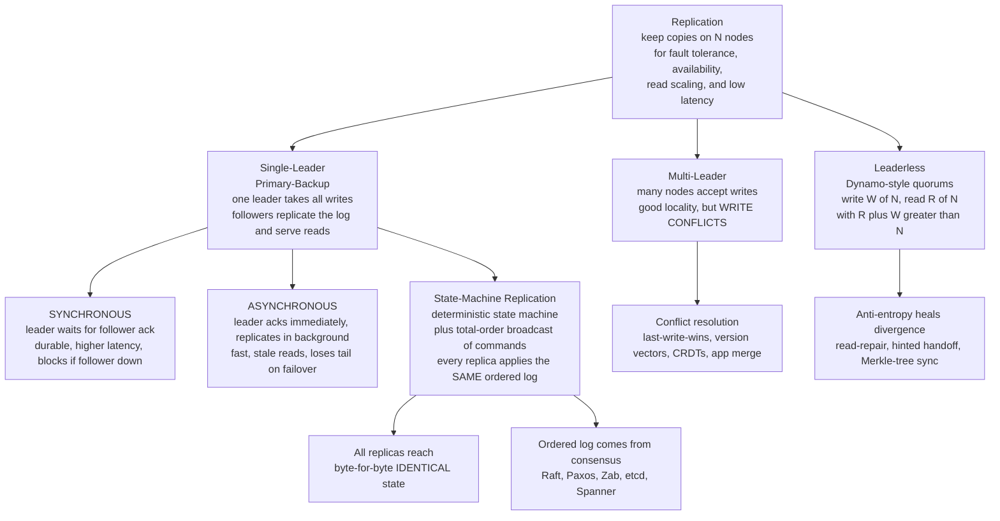

# 🗂️ Replication Models

> [!abstract] TL;DR
> **Replication** keeps copies of data on multiple nodes to buy **fault tolerance** (survive a node dying), **availability** (serve despite failures), **read scaling** (spread reads across replicas), and **low latency** (serve from a nearby copy). The entire difficulty is keeping those copies **consistent** under concurrent writes, crashes, and network delay. Three architectures divide the space: **single-leader / primary-backup** (one leader orders all writes and streams the log to followers — simple, no write conflicts, but a write bottleneck), **multi-leader** (many nodes accept writes — better locality, but write conflicts you must resolve), and **leaderless / quorum** (write to *W* of *N*, read from *R* of *N* with `R + W > N` — highly available, healed by anti-entropy). The unifying theory is **state-machine replication**: model the service as a **deterministic** state machine and use **total-order broadcast / consensus** to feed every replica the *same ordered log* — so they all reach identical state. Two orthogonal dials sit on top: **synchronous vs asynchronous** propagation trades durability for latency, and the choice of model plus that dial determines the consistency, availability, latency, and durability of the whole system.

---

## Intuition

**Analogy:** Keeping copies of your data on several machines is like several **librarians each maintaining a copy of the same ledger**. The payoff is obvious: if one library burns down, the ledger survives; and any reader can walk into the *nearest* branch instead of trekking to a single central archive. That is fault tolerance and read-scaling in one move.

But copies are not free. Every update must somehow reach **every** ledger, or the branches start disagreeing. And if two branches each accept an edit at the *same moment* — one records "balance = 100," another "balance = 120" — whose version is right? You now need a rule for propagating changes, ordering them, and reconciling conflicts. That tension — **replication buys fault tolerance and read-scaling at the cost of keeping copies in sync** — is the whole subject. The three replication models are just three different answers to "who is allowed to edit the ledger, and how do the edits reach everyone else?"

Translate librarians into servers, the ledger into a database, and "telling the other branches" into network packets that can be lost, delayed, or reordered while a branch is on fire, and you have the entire problem of replication.

---

## How It Works

### Why replicate at all

Four independent motivations, and most systems want more than one:

1. **Fault tolerance / durability** — if data lives on one node and that node dies, the data is gone. Copies on *f + 1* nodes survive *f* simultaneous failures.
2. **Availability** — a replica can keep serving while others are down or partitioned, so the *service* stays up even as individual nodes fail.
3. **Read scalability** — reads can be spread across many replicas, multiplying read throughput (this helps reads far more than writes, since every write must still hit every copy).
4. **Latency** — a geo-distributed system can serve each client from a *nearby* replica instead of a distant origin, cutting round-trip time.

Replication is therefore the **foundation of every fault-tolerant distributed system** — see [[Distributed_Systems_Overview]] for the four difficulties (no global clock, unreliable network, partial failure, no shared state) that make it hard.

### The core challenge: keeping replicas consistent

The easy part is *making* copies. The hard part is that after the copies exist, **every write must be propagated to all of them, in a way that survives concurrent writes, node crashes, and a network that loses, delays, and reorders messages.** Propagation has to answer two questions the analogy already exposed: in **what order** do updates apply (order matters for anything non-commutative), and what happens on a **conflict** (two writes to the same key racing). How a model answers those two questions *is* its consistency level — see *Consistency_Models_Spectrum*.

### Single-leader / primary-backup (the common case)

One node is the **leader** (primary); it accepts **all writes**, assigns them an order, and streams the resulting **change log** to the **followers** (backups/replicas). Followers apply the log in order and can **serve reads**. When the leader crashes, a follower is promoted — a **failover**, which requires **leader election** (see [[Leader_Election]]). This model is popular because it is *simple* and **avoids write conflicts entirely** (a single writer defines the one true order). Its costs: the leader is a **write bottleneck** and a **single point of write-availability** — no writes are possible during the failover gap.

### Synchronous vs asynchronous propagation (the key dial)

Independent of *which* model you pick is *when* the leader confirms a write:

- **Synchronous** — the leader waits for the follower to **acknowledge** it has stored the write before confirming success to the client. Guarantees the write survives a failover with **no data loss**, but pays **higher latency** and **blocks entirely if a follower is slow or down** (you cannot commit while waiting for a dead replica).
- **Asynchronous** — the leader confirms **immediately** and replicates in the background. **Fast and available**, but a leader crash can **lose recently-acknowledged writes** that had not yet reached any follower, and followers serve **stale reads** while they lag.
- **Semi-synchronous** — wait for **at least one** follower to ack (not all). The pragmatic middle: guarantees one durable copy exists without blocking on the slowest replica. Most production "sync replication" is actually semi-sync.

This is the **durability-vs-latency dial**, and it maps directly onto *CAP_Theorem_and_PACELC* — even with no partition, you are trading latency for consistency (the "ELC" half of PACELC).

### Replication lag and its anomalies

Because asynchronous replicas **lag** behind the leader, clients hit read anomalies: **read-your-writes** violations (you write, then read a follower that has not caught up and "your" write is missing), **monotonic-reads** violations (a second read goes to a further-behind replica and time appears to move backward), and **consistent-prefix** violations (you see effects before causes). The cure is **session / read-your-writes consistency** — route a client's reads to a replica known to have its writes, or to the leader. These live on the *Consistency_Models_Spectrum*.

### Multi-leader replication

Multiple nodes accept writes — used for **multi-datacenter** deployments (a leader per region for write locality) and **offline clients** (each device is its own leader that syncs later). Better write availability and locality, but it reintroduces the exact thing single-leader avoids: **write conflicts** when two leaders edit the same item concurrently. Resolution strategies include **last-write-wins** (simple, lossy), **version vectors** to detect concurrency (see [[Vector_Clocks_and_Causality]]), **CRDTs** that make operations commute so they *cannot* conflict, and application-level merge.

### Leaderless replication (Dynamo-style)

Any replica accepts writes directly. Clients **write to W replicas** and **read from R replicas** out of N, and choosing `R + W > N` forces the read and write sets to **overlap** on at least one node — so a read is guaranteed to see the latest write. Divergence that slips through is healed by **anti-entropy**: **read-repair** (fix stale replicas noticed during a read), **hinted handoff** (a temporary node holds writes for a down replica and forwards them later), and **Merkle-tree sync** (efficiently find and reconcile differing key ranges). This is the **quorum** approach — see *Quorum_Systems* and *Eventual_Consistency_and_Anti_Entropy*.

### State-machine replication (the theoretical backbone)

The unifying idea beneath primary-backup: model the service as a **deterministic state machine** — same start state + same ordered input → same output and same end state. Use **total-order broadcast** (equivalently, **consensus**) to feed *every* replica the **identical ordered sequence of commands**. Because each replica is deterministic and sees the same log, all replicas reach **identical state** forever. Compactly: **SMR = consensus + determinism**. This is exactly how Raft/Paxos-backed systems replicate (etcd, Spanner, CockroachDB) — see [[Reliable_and_Ordered_Broadcast]], [[The_Consensus_Problem]], and [[Raft_Consensus]].

Two flavors of SMR:

- **Active replication** — *every* replica executes *every* command. Symmetric, fast failover (all replicas are current), but wastes compute and requires strict determinism.
- **Passive replication** — the **primary executes** the command and ships the resulting **state diff** to backups (which do not re-execute). Handles non-determinism (only the primary decides), but failover is heavier.
- **Chain replication** — a special high-throughput layout: writes flow **down a chain** of replicas (head → … → tail) and reads are served from the **tail**. Because the tail has, by construction, the most-committed state, it gives **strong consistency** with good throughput (the head handles write ordering, the tail handles reads). Used in object/storage systems.



---

## Key Concepts

### Secondary (plain-language)
- Keep **copies of your data on several machines** so it survives a crash, stays available, and can be read from a nearby machine.
- The catch: every change must reach **every** copy, and if two copies are edited at once you need a rule for **whose version wins**.
- Three shapes: **one boss takes all edits** (single-leader), **several bosses each take edits** (multi-leader), or **anyone takes edits and they vote** (leaderless).
- **Wait for the copy to confirm** (synchronous, safe but slower) vs **confirm right away and copy later** (asynchronous, fast but you can lose the last few edits if the boss dies).

### Undergraduate (CS background)
- **Single-leader / primary-backup**: leader orders writes, streams a **replication log**; followers apply it and serve reads; **failover** promotes a follower and needs **leader election**.
- **Sync vs async vs semi-sync**: durability-vs-latency dial. Async introduces **replication lag** → read-your-writes, monotonic-reads, consistent-prefix anomalies, cured by **session consistency**.
- **Multi-leader**: write locality at the price of **conflicts**; resolve with LWW, **version vectors**, **CRDTs**, or app merge.
- **Leaderless quorums**: `R + W > N` guarantees read/write overlap; **anti-entropy** (read-repair, hinted handoff, Merkle sync) heals what slips through.
- **State-machine replication**: deterministic state machine + **total-order broadcast** of commands ⇒ identical replicas.

### Graduate (theory / system-level)
- **SMR = consensus + determinism.** Total-order broadcast is provably **equivalent to consensus** (see [[Reliable_and_Ordered_Broadcast]]), so ordered replication inherits consensus's limits — impossible in pure asynchrony with one crash (**FLP**, see [[FLP_Impossibility_Result]]), escaped via partial synchrony / a leader / randomization.
- **Active vs passive replication**: all replicas execute (needs strict determinism, cheap failover) vs primary executes and ships **state diffs** (tolerates non-determinism, heavier failover). **Chain replication** decouples write ordering (head) from read serving (tail) for strong consistency at high throughput.
- **Quorum intersection**: `W > N/2` for write-write ordering and `R + W > N` for read-write overlap; sloppy quorums + hinted handoff trade that guarantee for availability, weakening to **eventual consistency**.
- **The design decision**: single vs multi vs leaderless, crossed with sync vs async, *is* the choice of the system's consistency, availability, latency, and durability envelope — this is the core database/architecture trade-off tied directly to *CAP_Theorem_and_PACELC* and [[The_Consensus_Problem]].

---

## Python Demo

A pure-stdlib simulation contrasting the replication strategies. **Part 1** models **primary-backup / state-machine replication** and compares **synchronous** vs **asynchronous** log propagation, including a **lost-write-on-failover** scenario. **Part 2** shows that replicas applying the **same ordered log** (determinism) reach **identical** state, while a reordered log **diverges** — the heart of SMR. **Part 3** simulates a **leaderless quorum** write (write to *W* of *N*) and measures the **consistency-vs-latency-vs-durability** trade-off. Matplotlib visualizes replica progress, replication lag, the lost writes, and the quorum trade-off.

```python
"""
REPLICATION MODELS: primary-backup state-machine replication with SYNCHRONOUS
vs ASYNCHRONOUS log propagation, log-determinism, and a leaderless quorum write.
Pure-stdlib simulation + matplotlib visualization.
"""

import matplotlib.pyplot as plt
from matplotlib.patches import Rectangle

# ================================================================= #
# PART 1  Primary-backup: SYNC vs ASYNC log replication + failover
# ================================================================= #
# The client issues one write per tick (indices 0..N_WRITES-1). The leader
# commits (acks the client) write i at tick i. A follower APPLIES a write some
# ticks later depending on the replication mode.
N_WRITES = 12
LAG      = 2          # async: a follower is LAG ticks behind the leader
CRASH_T  = 8          # the leader crashes at this tick, then a follower is promoted
ticks    = list(range(N_WRITES))

# leader has committed writes 0..t  ->  count = t + 1
leader_committed = [t + 1 for t in ticks]
# ASYNC follower applies write i once i + LAG <= t  ->  count = t - LAG + 1
async_follower   = [max(0, t - LAG + 1) for t in ticks]
# SYNC follower: leader waits for its ack before committing -> equal to leader
sync_follower    = [t + 1 for t in ticks]

# On failover at CRASH_T we promote the follower. Writes the LEADER already
# acked to clients but the follower never received are LOST.
async_lost = leader_committed[CRASH_T] - async_follower[CRASH_T]   # == LAG
sync_lost  = leader_committed[CRASH_T] - sync_follower[CRASH_T]    # == 0

print("PART 1  primary-backup failover at tick", CRASH_T)
print(f"  ASYNC: leader acked {leader_committed[CRASH_T]} writes, "
      f"follower had {async_follower[CRASH_T]}  ->  LOST {async_lost} acked writes")
print(f"  SYNC : leader acked {sync_follower[CRASH_T]} writes, "
      f"follower had {sync_follower[CRASH_T]}   ->  LOST {sync_lost} acked writes\n")

# ================================================================= #
# PART 2  Determinism: same ordered log -> identical state
# ================================================================= #
# Ops are NON-commutative (set overwrites, incr adds), so order matters.
log = [("set", "x", 1), ("incr", "x", 5), ("set", "x", 100), ("incr", "x", 3)]

def apply_log(ops):
    state = {}
    for op, k, v in ops:
        state[k] = v if op == "set" else state.get(k, 0) + v
    return state

r1 = apply_log(log)                                   # replica: canonical order
r2 = apply_log(log)                                   # replica: SAME order
r3 = apply_log([log[0], log[2], log[1], log[3]])      # replica: REORDERED log
print("PART 2  state-machine replication (determinism)")
print(f"  replica1 same-order log : {r1}")
print(f"  replica2 same-order log : {r2}  -> identical = {r1 == r2}")
print(f"  replica3 REORDERED log  : {r3}  -> diverged  = {r3 != r1}")
print("  => identical state requires the SAME ORDERED log on every replica\n")

# ================================================================= #
# PART 3  Leaderless quorum write: write to W of N (Dynamo-style)
# ================================================================= #
N = 5
rep_latency = [8, 12, 15, 22, 40]          # per-replica ack latency (ms), ascending
Ws            = list(range(1, N + 1))
write_latency = [rep_latency[W - 1] for W in Ws]   # time to collect the W-th ack
read_quorum   = [N - W + 1 for W in Ws]            # R needed so that R + W > N
durability    = list(Ws)                            # copies made == W

print("PART 3  leaderless quorum (N = 5), R + W > N gives strong reads")
for W in Ws:
    strong = "strong" if (read_quorum[W - 1] + W > N) else "weak"
    print(f"  W={W}: write_latency={write_latency[W-1]:>2}ms  "
          f"durable_copies={W}  read_quorum R={read_quorum[W-1]}  ({strong})")

# ============================ VISUALIZATION ============================ #
fig, axes = plt.subplots(2, 2, figsize=(14, 9))
(ax1, ax2), (ax3, ax4) = axes

# --- ax1: ASYNC replication lag + lost-write-on-failover ---
ax1.step(ticks, leader_committed, where="post", color="#2980b9", lw=2.4,
         label="leader committed (acked)")
ax1.step(ticks, async_follower, where="post", color="#e67e22", lw=2.4,
         label="async follower applied")
ax1.fill_between(ticks, async_follower, leader_committed, step="post",
                 alpha=0.25, color="#e67e22", label="replication lag")
ax1.axvline(CRASH_T, color="#c0392b", ls="--", lw=2)
ax1.add_patch(Rectangle((CRASH_T, async_follower[CRASH_T]), 0.5, async_lost,
                        facecolor="#c0392b", alpha=0.55))
ax1.annotate(f"leader crashes\n{async_lost} ACKED writes LOST\non failover",
             xy=(CRASH_T, leader_committed[CRASH_T]), xytext=(2.4, 10.4),
             fontsize=9, color="#c0392b", fontweight="bold",
             arrowprops=dict(arrowstyle="->", color="#c0392b"))
ax1.set_title("ASYNC: fast but loses the un-replicated tail on failover",
              fontweight="bold")
ax1.set_xlabel("time (ticks)"); ax1.set_ylabel("writes applied")
ax1.legend(loc="upper left", fontsize=8); ax1.set_ylim(0, 13)

# --- ax2: SYNC replication -> no lag, crash-safe ---
ax2.step(ticks, leader_committed, where="post", color="#2980b9", lw=4,
         alpha=0.4, label="leader committed (acked)")
ax2.step(ticks, sync_follower, where="post", color="#2e8b57", lw=2.2,
         label="sync follower applied (overlaps)")
ax2.axvline(CRASH_T, color="#c0392b", ls="--", lw=2)
ax2.annotate("leader crashes\n0 writes lost\n(follower is current)",
             xy=(CRASH_T, sync_follower[CRASH_T]), xytext=(2.6, 10.4),
             fontsize=9, color="#2e8b57", fontweight="bold",
             arrowprops=dict(arrowstyle="->", color="#2e8b57"))
ax2.set_title("SYNC: durable (no lag) but higher latency, blocks if follower down",
              fontweight="bold")
ax2.set_xlabel("time (ticks)"); ax2.set_ylabel("writes applied")
ax2.legend(loc="upper left", fontsize=8); ax2.set_ylim(0, 13)

# --- ax3: mode trade-off (commit latency vs writes lost on failover) ---
modes      = ["async", "semi-sync", "sync"]
commit_lat = [1, 3, 5]           # relative client-observed commit latency
lost       = [async_lost, 0, 0]  # acked writes lost if the leader then crashes
avail      = ["available", "available", "BLOCKS if\nfollower down"]
xm = range(len(modes))
ax3.bar([i - 0.2 for i in xm], commit_lat, width=0.4,
        color="#2980b9", label="commit latency (relative)")
ax3.bar([i + 0.2 for i in xm], lost, width=0.4,
        color="#c0392b", label="acked writes lost on failover")
for i in xm:
    ax3.text(i, 5.4, avail[i], ha="center", fontsize=8, style="italic",
             color="#555")
ax3.set_xticks(list(xm)); ax3.set_xticklabels(modes)
ax3.set_ylim(0, 6.2); ax3.set_ylabel("relative units")
ax3.set_title("Primary-backup dial: durability vs latency vs availability",
              fontweight="bold")
ax3.legend(loc="upper center", fontsize=8)

# --- ax4: leaderless quorum -> latency vs durability vs read quorum ---
ax4.bar(Ws, write_latency, color="#8e44ad", alpha=0.75,
        label="write latency (ms) = W-th ack")
ax4.set_xlabel("W  (replicas a write waits for, of N=5)")
ax4.set_ylabel("write latency (ms)", color="#8e44ad")
ax4.tick_params(axis="y", labelcolor="#8e44ad")
axr = ax4.twinx()
axr.plot(Ws, read_quorum, "o-", color="#2e8b57", lw=2.2,
         label="read quorum R for R + W > N")
axr.plot(Ws, durability, "s--", color="#e67e22", lw=2,
         label="durable copies (== W)")
axr.set_ylabel("replicas", color="#2e8b57")
axr.tick_params(axis="y", labelcolor="#2e8b57")
ax4.axvline(3, color="#c0392b", ls=":", lw=1.5)
ax4.text(3.05, 36, "W=3 majority\nR=3, R+W>N", fontsize=8, color="#c0392b")
ax4.set_title("Leaderless: higher W = more durable + cheaper reads, slower writes",
              fontweight="bold")
l1, la1 = ax4.get_legend_handles_labels()
l2, la2 = axr.get_legend_handles_labels()
ax4.legend(l1 + l2, la1 + la2, loc="upper left", fontsize=8)

fig.suptitle("Replication models: sync vs async primary-backup, log determinism, "
             "and leaderless quorum trade-offs", fontsize=13, fontweight="bold")
plt.tight_layout(rect=(0, 0, 1, 0.96))
plt.savefig("replication_models.png", dpi=120)
plt.show()
print("\nSaved figure -> replication_models.png")
```

**What you see.** Part 1: the async leader races ahead and the follower trails by a constant **lag**; when the leader crashes at tick 8 it had acknowledged 9 writes but the follower held only 7, so **2 client-acknowledged writes vanish** on failover — the classic async data-loss window. The sync follower's line sits *on top of* the leader's, so failover loses **zero** writes — at the cost of latency and blocking when a follower is unavailable. Part 2 prints identical state for two replicas fed the same ordered log and a *diverged* state for the reordered replica, proving that SMR needs the **same order**, not just the same *set* of operations. Part 3 shows the quorum dial: larger *W* means more durable copies and a smaller required read quorum *R* (cheaper, more consistent reads) but slower writes — with `W = 3` (majority of 5) as the balanced point where `R + W > N` still holds.

---

## Real-World Applications

- **PostgreSQL / MySQL** — classic **single-leader (primary-replica)** replication streaming a **WAL / binlog**. Both support **asynchronous** (default, fast, lossy on failover) and **synchronous / semi-synchronous** modes; failover tooling (Patroni, Orchestrator) promotes a replica and must **fence** the old primary. See [[Replication]] and [[Replication_Strategies]].
- **MongoDB replica sets** — a **Raft-like** protocol elects a primary; secondaries replicate the **oplog**; write concern (`w:1`, `w:majority`) *is* the sync/async dial, and `w:majority` gives durable, failover-safe writes. See [[Failover]].
- **Apache Kafka partition replication** — each partition is a leader-based **replicated log**; followers in the **ISR** (in-sync replica set) must ack before a record is "committed" (`acks=all`), which is semi-synchronous SMR over an append-only log. See [[Kafka]] and [[Partitioning_and_Sharding]].
- **Cassandra / DynamoDB** — **leaderless quorum** replication; tunable consistency picks *W* and *R* per operation (`ONE`, `QUORUM`, `ALL`), with **read-repair**, **hinted handoff**, and **Merkle-tree** anti-entropy healing divergence. See [[Eventual_Consistency]] and [[Consensus_and_Quorums]].
- **etcd / ZooKeeper** — **state-machine replication** over **Raft / Zab**: a total-order log of operations is agreed by consensus and applied deterministically, giving strongly-consistent coordination state. See [[Consensus_and_Raft]].
- **Spanner / CockroachDB / TiKV** — each data range is a **Raft group** doing SMR; Spanner adds TrueTime to bound clock uncertainty for globally-consistent reads.
- **Chain replication in storage** — object/storage systems route writes down a replica chain and reads from the tail for strong consistency with high write throughput.

---

## Common Pitfalls

- **Assuming async replication is "basically consistent."** Under async, followers serve **stale reads** and a leader crash **loses acknowledged writes**. If clients must read their own writes, route their reads to the leader or a synced replica, or use `w:majority`/quorum.
- **Ignoring replication lag.** Lag causes read-your-writes, monotonic-reads, and consistent-prefix anomalies. Users see a comment they just posted disappear on refresh. Fix with **session / read-your-writes consistency**, not by hoping lag stays small.
- **Confusing "replicated" with "durable."** An async write acked by the leader lives on **one** node until it replicates. A crash in that window loses it despite the client seeing success. Durability requires the write to reach a **quorum** (`w:majority`) before ack.
- **Multi-leader without conflict handling.** Two leaders accepting concurrent writes to the same key *will* conflict. Last-write-wins silently **drops** data; use version vectors to *detect* concurrency and CRDTs or app merge to *resolve* it.
- **Believing `R + W > N` gives linearizability.** It gives **read-your-writes-style** overlap, not full linearizability — concurrent writes, sloppy quorums, and read-repair races still allow stale or non-monotonic reads. Leaderless quorums are strong-ish, not strict.
- **Even-sized replica sets / no fencing on failover.** A network partition can leave the old leader alive and unaware; without a **majority quorum** and **fencing tokens** you get **split-brain** — two leaders accepting divergent writes (see [[Leader_Election]]).
- **Non-deterministic state machines.** SMR only converges if every replica computes identically. Wall-clock reads, random numbers, iteration order, or non-deterministic floating-point make replicas diverge from the *same* log. Feed non-determinism in *through* the log, or use passive replication.
- **Read-scaling writes.** Adding followers scales *reads*, not *writes* — every write still hits every replica. To scale writes you need **partitioning/sharding**, which is orthogonal to replication.

---

## Related Concepts

- [[Reliable_and_Ordered_Broadcast]] — total-order broadcast is the primitive underneath state-machine replication; feed every replica the same ordered log and they stay identical.
- [[The_Consensus_Problem]] — SMR reduces to agreeing on one ordered log; replication and consensus are two faces of the same problem.
- [[Raft_Consensus]] — Raft *is* SMR: it agrees on one replicated log and applies it deterministically; the reference implementation of consensus-backed replication.
- [[Leader_Election]] — single-leader replication needs a leader; failover is a re-election that must avoid split-brain and fence the old primary.
- [[FLP_Impossibility_Result]] — why deterministic ordered replication is impossible in pure asynchrony with one crash, forcing partial-synchrony assumptions.
- [[Consensus_and_Raft]] — the system-design view of Raft-backed replicated logs (etcd, ZooKeeper, CockroachDB).
- [[Consensus_and_Quorums]] — the majority-quorum intersection property behind both synchronous-majority writes and leaderless `R + W > N`.
- [[Vector_Clocks_and_Causality]] — multi-leader and leaderless systems use version vectors to detect concurrent writes that need conflict resolution.
- [[Replication]] — the system-design view of primary-backup, sync vs async, and read replicas.
- [[Replication_Strategies]] — the database-side catalog of leader-based, multi-leader, and leaderless schemes.
- [[Failover]] — the operational promotion of a follower after a leader crash; the moment async loses data.
- [[Kafka]] — partition replication with an in-sync replica set is production semi-synchronous SMR over an append-only log.
- [[Eventual_Consistency]] — the convergence guarantee leaderless/async replicas provide once anti-entropy heals divergence.
- [[Consistency_Patterns]] — strong vs eventual vs read-your-writes consistency, the guarantees a replication model exposes to clients.
- [[CAP_Theorem]] — a partition forces the consistency-vs-availability choice each replication model resolves differently.
- [[PACELC_Theorem]] — even without a partition, sync vs async is the latency-vs-consistency ("ELC") trade-off.
- [[Partitioning_and_Sharding]] — orthogonal to replication; shard to scale writes, replicate each shard for fault tolerance.
- [[Distributed_Locks]] — leadership and single-writer guarantees rest on the same quorum + fencing machinery.
- [[Distributed_Systems_Overview]] — the partial-failure and no-global-clock difficulties that make replication necessary and hard.
- [[Failure_Models]] — replication's guarantees depend on the assumed failure model (crash-stop vs crash-recovery vs Byzantine).

> Vault siblings referenced in prose but not yet written (link when created): *Consistency_Models_Spectrum*, *Quorum_Systems*, *Eventual_Consistency_and_Anti_Entropy*, *CRDTs*, *CAP_Theorem_and_PACELC*.

---

## Review Questions

**Secondary (understanding):**
1. Using the librarians-and-ledgers analogy, explain the two things replication *buys* you and the one big *cost* it creates. Why does "confirm the edit right away and copy it to the other branches later" risk losing an edit?

**Undergraduate (application):**
2. A single-leader database is configured **asynchronous**. A user posts a comment (write succeeds), then immediately refreshes and the comment is **gone**. Explain exactly what happened in terms of the leader, the follower serving the read, and replication lag — and name two ways to fix it.
3. In a leaderless system with `N = 5`, a team sets `W = 3` and `R = 2`. Is a read guaranteed to see the latest acknowledged write? Show the arithmetic, then give a value of `R` that *does* guarantee it and state what that costs.

**Graduate (analysis / trade-offs):**
4. Explain why **state-machine replication requires both a deterministic state machine and total-order broadcast**, and what goes wrong if you drop either one. Connect this to the claim "SMR = consensus + determinism" and to the FLP impossibility result.
5. You are designing a globally-distributed database. Compare **single-leader (sync)**, **multi-leader**, and **leaderless quorum** replication along consistency, write availability during a partition, cross-region write latency, and conflict handling. For a low-latency social feed vs a banking ledger, which would you pick and why?

---

## Sources

- Kleppmann, M. (2017). *Designing Data-Intensive Applications*, Ch. 5 "Replication." O'Reilly. [dataintensive.net](https://dataintensive.net/)
- Schneider, F. B. (1990). *Implementing Fault-Tolerant Services Using the State Machine Approach: A Tutorial.* ACM Computing Surveys. [PDF](https://www.cs.cornell.edu/fbs/publications/SMSurvey.pdf)
- DeCandia, G. et al. (2007). *Dynamo: Amazon's Highly Available Key-value Store* (leaderless quorums, `R + W > N`, anti-entropy). SOSP. [PDF](https://www.allthingsdistributed.com/files/amazon-dynamo-sosp2007.pdf)
- van Renesse, R. & Schneider, F. B. (2004). *Chain Replication for Supporting High Throughput and Availability.* OSDI. [PDF](https://www.cs.cornell.edu/home/rvr/papers/OSDI04.pdf)
- Ongaro, D. & Ousterhout, J. (2014). *In Search of an Understandable Consensus Algorithm (Raft).* USENIX ATC. [PDF](https://raft.github.io/raft.pdf)

---

#distributed-systems #replication #state-machine-replication #primary-backup #leaderless
