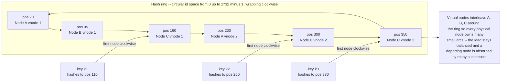

# 🧭 Consistent Hashing

> [!abstract] TL;DR
> **Consistent hashing** (Karger et al., 1997) maps keys to nodes by placing both on a shared **circular hash space** — a ring — where each key is owned by the first node clockwise from it. Its defining property is **minimal disruption**: when a node is added or removed, only the keys in that node's **arc** move — roughly **K/N keys** out of K — instead of the **~(N-1)/N of all keys** that plain `hash(key) mod N` remaps. Layering **virtual nodes** on top spreads each physical machine across many ring positions, flattening the load. This small, elegant idea is the partitioning backbone of the entire **Dynamo lineage** (DynamoDB, Cassandra, Riak), of **CDNs and web caches** (Akamai, memcached/ketama), and of modern **load balancers** (Google Maglev).

---

## Intuition

**Analogy:** Suppose a street numbers its houses by "resident's name, hashed, then `mod N`" where N is the number of mailboxes on the corner. It works — until the post office adds **one** more mailbox. Now `N` changed from 8 to 9, and *almost every* resident's mail is suddenly routed to a different box, because `x mod 8` and `x mod 9` disagree for nearly everyone. You have to **renumber the entire street** to add a single mailbox. That is exactly the disaster of plain **hash-mod-N**: adding or removing one server reshuffles almost all the data.

Consistent hashing fixes this by arranging the mailboxes and the residents around a **clock face** — a ring. Each resident's mail goes to the **next mailbox clockwise** from where their name lands on the clock. Now add a new mailbox: it slots in at one point on the clock and **steals only the residents sitting in the single arc just behind it**. Everyone else keeps the exact same mailbox they had. Remove a mailbox and its arc simply flows to the next one clockwise. **Only one arc's worth of people ever move** — minimal disruption is the entire point.

---

## How It Works

### The problem: why hash-mod-N is catastrophic

The obvious way to shard K keys across N nodes is `node = hash(key) mod N`. It balances load beautifully **while N is fixed** — but it welds the assignment to the *value of N itself*. Change N by one (a node joins, crashes, or is decommissioned) and the modulus changes for essentially every key: `hash(key) mod 8` and `hash(key) mod 9` land on the same bucket only about 1/9 of the time. So **~(N-1)/N of all keys are remapped** on a single membership change. For a stateful store that means moving nearly the whole dataset across the network; for a cache it means a **cache-miss storm** — almost every lookup misses at once and stampedes the origin. Membership changes are routine at scale (autoscaling, failures, deploys), so hash-mod-N is a non-starter.

### The hash ring — the core idea

Consistent hashing decouples the mapping from N by hashing **nodes and keys into the same large circular space** (for example, the integers `0` to `2^32 − 1`, where the top wraps around to the bottom):

1. **Place each node** on the ring at position `hash(node_id)`.
2. **Place each key** on the ring at position `hash(key)`.
3. **Assign each key** to the **first node encountered walking clockwise** from the key's position — the key's **successor node**. If you walk off the top of the ring, you wrap to the bottom.

Each node therefore **owns the arc** of the ring that ends at its own position (from the previous node, exclusive, up to itself, inclusive). The crucial consequence:

- **Adding a node** at position `p` inserts a new boundary. It **steals only the keys in the arc between its clockwise-previous neighbor and `p`** — keys that previously belonged to `p`'s successor. Every other key is untouched.
- **Removing a node** deletes its boundary; its arc **flows to the next node clockwise**. Again, only that one arc moves.

Either way, **only O(K/N) keys move** — the keys in a single arc — versus O(K) for hash-mod-N. That is the **minimal disruption** guarantee, and it is what makes distributed caches and stores **elastic**: you can grow and shrink the cluster while moving only a small, bounded slice of data.

Lookups are cheap: keep the node positions in a **sorted array** and do a **binary search** (`bisect`) for the first position `≥ hash(key)`, wrapping to index 0 if you run off the end. That is O(log N) per lookup with O(N) memory.

### The load-balance problem — and virtual nodes

A naive ring has a flaw: with only N random points, the arcs come out **wildly uneven**. Hashing is uniform *in expectation*, but with a handful of points some nodes land close together (tiny arcs, little data) while others straddle huge gaps (giant arcs, hot spots). The load standard deviation is large, and one unlucky node can own several times its fair share.

The fix, used **everywhere in production**, is **virtual nodes** (vnodes): place each physical node at **V distinct ring positions** instead of one, by hashing `node_id` together with a replica index (`hash(node_id + "#" + i)` for `i` in `0..V-1`). Now the ring has `N × V` interleaved points, and each physical node owns **many small arcs scattered around the circle**. By the law of large numbers, the *sum* of a node's many small arcs converges tightly on the fair share `K/N`, so the **load std-dev shrinks as V grows** (roughly like `1/√V`). Virtual nodes also deliver two more wins:

- **Smoother rebalancing** — when a node leaves, its *many* arcs are absorbed by *many different* successors, so no single survivor is slammed with the whole load; the movement is spread out.
- **Heterogeneity** — a machine with twice the capacity simply gets **twice as many vnodes**, taking a proportionally larger share of keys without any special-casing.

### Replication on the ring

Consistent hashing also defines **where replicas live**. To keep R copies of each key, store it on the **next R *distinct physical* nodes clockwise** from the key's position (skipping additional vnodes of a node you already picked). In Dynamo this ordered list is the key's **preference list**, and it is what a quorum read/write ranges over. So the same ring that partitions data *also* places its replicas — partitioning and replication fall out of one structure. (This dovetails with quorum systems and replication-model notes elsewhere in this vault.)

### Diagram: the ring, successor assignment, and virtual nodes



---

## Key Concepts

### Secondary (intuition level)
- Plain "hash then divide by number of servers" **reshuffles almost everything** when you add or remove one server.
- Consistent hashing puts servers and keys on a **clock face**; each key goes to the **next server clockwise**.
- Add or remove a server and **only one slice of the clock moves** — everyone else stays put. That is the whole trick.
- To keep servers evenly loaded, give each one **many spots on the clock** instead of one — these are **virtual nodes**.

### Undergraduate (mechanism level)
- **Ring construction:** hash nodes and keys into one circular space `0 .. 2^32 − 1`; a key's owner is its **clockwise successor**, found by **binary search** over sorted node positions (O(log N)).
- **Minimal disruption:** a membership change of ±1 node remaps only **~K/N keys** (one arc), versus **~(N−1)/N** for hash-mod-N — the property that makes scaling cheap.
- **Virtual nodes:** each physical node at **V ring positions** shrinks the keys-per-node **standard deviation** (~`1/√V`), smooths rebalancing, and supports **weighted / heterogeneous** nodes.
- **Replication:** the **next R distinct nodes clockwise** form the key's replica set (Dynamo's **preference list**).

### Graduate (research / systems level)
- **Formal guarantee (Karger et al.):** with V = Θ(log N) virtual points per node, every node owns Θ(1/N) of the ring **with high probability**, and any membership change moves an expected O(1/N) fraction of keys — *monotonicity* (keys only move to or from the changed node) plus *balance*.
- **Bounded-load consistent hashing** (Mirrokni–Thorup–Zadimoghaddam): caps any node at `(1 + ε)` times the average by overflowing to the next node clockwise, bounding tail load even under skewed key popularity.
- **Rendezvous / Highest-Random-Weight (HRW) hashing:** an alternative with the same minimal-disruption property and **no ring state** — each key picks `argmax_node hash(key, node)`; O(N) per lookup but trivially supports weights and needs no vnode bookkeeping.
- **Jump consistent hash** (Lamping–Veach, Google): O(1) memory, very fast, minimal movement — but assumes nodes are **numbered `0..N−1`** (no arbitrary add/remove or explicit weights).
- **Maglev hashing** (Google load balancer): builds a fixed-size **lookup table** giving *both* minimal disruption *and* near-perfect evenness for connection-level load balancing, trading a small table-build cost for O(1) lookups.

---

## Python Demo

This from-scratch simulation builds a real hash ring with `hashlib` + `bisect`, then proves the two headline properties by **measurement**. First it removes one node and counts moved keys for **consistent hashing vs hash-mod-N** — you see ~1/8 versus ~catastrophic. Then it sweeps the number of **virtual nodes** and shows the keys-per-node **std-dev collapse**, and that a departing node's load is **spread across many survivors** instead of dumped on one. Four matplotlib panels visualize the ring (V=1 vs V=50), the per-node load, and the variance-versus-V curve. Pure stdlib for the ring; matplotlib for plots; numpy not required.

```python
"""
Consistent hashing with a hash ring -- from scratch.

Place NODES on a circular hash space by hashing their ids; map each KEY to the
first node CLOCKWISE from the key's hash (its "successor"), found by bisect over
the sorted ring positions. We then demonstrate:

  1) MINIMAL DISRUPTION: removing 1 of N nodes moves only ~K/N keys under
     consistent hashing, versus ~(N-1)/N of ALL keys under hash-mod-N.
  2) VIRTUAL NODES: placing each physical node at V ring positions shrinks the
     keys-per-node std-dev and SPREADS a departing node's load over many
     survivors (smoother rebalancing).

Pure stdlib (hashlib, bisect, statistics) for the ring; matplotlib to visualize.
"""

import hashlib
import bisect
import math
import statistics
from collections import Counter
import matplotlib.pyplot as plt

RING = 2 ** 32                        # size of the circular hash space


def h(s):
    """Stable hash of a string -> a position on the ring in [0, RING)."""
    return int(hashlib.md5(s.encode()).hexdigest(), 16) % RING


class HashRing:
    """A consistent-hashing ring with optional virtual nodes."""

    def __init__(self, nodes=(), vnodes=1):
        self.vnodes = vnodes
        self._ring = {}               # ring position -> physical node id
        self._sorted = []             # sorted ring positions, for bisect
        for n in nodes:
            self.add(n)

    def _points(self, node):
        """The V ring positions owned by one physical node (deterministic)."""
        return [h(f"{node}#{i}") for i in range(self.vnodes)]

    def add(self, node):
        for p in self._points(node):
            self._ring[p] = node
        self._sorted = sorted(self._ring)

    def remove(self, node):
        for p in self._points(node):
            self._ring.pop(p, None)
        self._sorted = sorted(self._ring)

    def node_for(self, key):
        """First node CLOCKWISE from the key's hash; wraps around the ring."""
        if not self._sorted:
            return None
        idx = bisect.bisect_right(self._sorted, h(key)) % len(self._sorted)
        return self._ring[self._sorted[idx]]


# --- workload -------------------------------------------------------------
KEYS = [f"key-{i}" for i in range(20000)]
NODES = [f"node-{i}" for i in range(8)]


def assign(ring):
    return {k: ring.node_for(k) for k in KEYS}


# --- 1) minimal disruption: consistent hashing vs hash-mod-N --------------
def modn_assign(keys, n):
    return {k: h(k) % n for k in keys}


ring = HashRing(NODES, vnodes=1)
before = assign(ring)
ring.remove("node-7")                 # remove one of eight nodes
after = assign(ring)
ch_moved = sum(before[k] != after[k] for k in KEYS) / len(KEYS)

mod_before = modn_assign(KEYS, 8)     # hash-mod-N, shrink N from 8 -> 7
mod_after = modn_assign(KEYS, 7)
mod_moved = sum(mod_before[k] != mod_after[k] for k in KEYS) / len(KEYS)

print("Removing 1 of 8 nodes -- fraction of keys that MOVE:")
print(f"  consistent hashing : {ch_moved:6.1%}   (ideal ~ 1/8 = 12.5%)")
print(f"  hash-mod-N         : {mod_moved:6.1%}   (catastrophic reshuffle)")


# --- 2) virtual nodes improve LOAD BALANCE --------------------------------
def load_stats(vnodes):
    counts = Counter(assign(HashRing(NODES, vnodes=vnodes)).values())
    per = [counts[n] for n in NODES]
    ideal = len(KEYS) / len(NODES)
    return per, statistics.pstdev(per) / ideal      # std-dev as fraction of ideal


V_VALUES = [1, 5, 20, 100, 500]
balance = {}
print("\nLoad balance vs virtual nodes per physical node:")
for v in V_VALUES:
    _, rel_std = load_stats(v)
    balance[v] = rel_std
    print(f"  V={v:4d}  keys/node std-dev = {rel_std:5.1%} of the ideal share")


# --- 3) virtual nodes SMOOTH rebalancing on a membership change ------------
def removal_spread(vnodes, victim="node-7"):
    r = HashRing(NODES, vnodes=vnodes)
    b = assign(r)
    r.remove(victim)
    a = assign(r)
    gains = Counter(a[k] for k in KEYS if b[k] != a[k])   # who absorbed moved keys
    moved = sum(gains.values()) / len(KEYS)
    busiest = (max(gains.values()) / len(KEYS)) if gains else 0.0
    return moved, busiest


print("\nRemoving node-7 -- how the moved keys are absorbed:")
for v in (1, 100):
    moved, busiest = removal_spread(v)
    print(f"  V={v:4d}  moved {moved:5.1%} of keys; "
          f"busiest single survivor absorbed {busiest:5.1%}")


# ===========================================================================
# VISUALIZATION
# ===========================================================================
colors = plt.cm.tab10(range(len(NODES)))
cmap = {n: colors[i] for i, n in enumerate(NODES)}
fig = plt.figure(figsize=(14, 10))


def draw_ring(ax, vnodes, title, ms, alpha):
    r = HashRing(NODES, vnodes=vnodes)
    for pos, node in r._ring.items():
        theta = pos / RING * 2 * math.pi
        ax.plot([theta], [1.0], "o", ms=ms, color=cmap[node], alpha=alpha)
    ax.set_yticklabels([])
    ax.set_ylim(0, 1.2)
    ax.set_title(title, pad=16)


# Panel A: ring with V=1 -> few points, uneven arcs
axA = fig.add_subplot(2, 2, 1, projection="polar")
draw_ring(axA, 1, "Ring with V=1\n8 points -> uneven arcs", ms=12, alpha=1.0)

# Panel B: ring with V=50 -> interleaved points, even coverage
axB = fig.add_subplot(2, 2, 2, projection="polar")
draw_ring(axB, 50, "Ring with V=50\n400 interleaved points -> even arcs",
          ms=4, alpha=0.7)

# Panel C: keys per node, V=1 vs V=100
axC = fig.add_subplot(2, 2, 3)
per1, _ = load_stats(1)
per100, _ = load_stats(100)
x = list(range(len(NODES)))
axC.bar([i - 0.2 for i in x], per1, width=0.4, label="V=1", color="tab:red")
axC.bar([i + 0.2 for i in x], per100, width=0.4, label="V=100", color="tab:green")
axC.axhline(len(KEYS) / len(NODES), ls="--", color="black", label="ideal share")
axC.set_xticks(x)
axC.set_xticklabels([n.split("-")[1] for n in NODES])
axC.set_xlabel("physical node")
axC.set_ylabel("keys assigned")
axC.set_title("Virtual nodes flatten the per-node load")
axC.legend()

# Panel D: load std-dev vs V
axD = fig.add_subplot(2, 2, 4)
axD.plot(list(balance.keys()), [balance[v] * 100 for v in balance],
         "o-", color="tab:blue")
axD.set_xscale("log")
axD.set_xlabel("virtual nodes per physical node (log scale)")
axD.set_ylabel("keys/node std-dev, % of ideal")
axD.set_title("More vnodes -> lower load variance")
axD.grid(True, alpha=0.3)

fig.suptitle("Consistent hashing: minimal disruption + balanced load via virtual nodes",
             fontweight="bold", fontsize=13)
fig.tight_layout()
plt.savefig("consistent_hashing.png", dpi=120)
print("\nsaved consistent_hashing.png")
```

**What you observe.** Removing one of eight nodes moves only about **12–13%** of keys under consistent hashing but roughly **85–90%** under hash-mod-N — the difference between a shrug and a full re-shard. As V climbs from 1 to 500, the keys-per-node std-dev falls from tens of percent to a few percent, and the departing node's load stops landing on a single unlucky successor and instead **spreads across many** nodes. The polar panels make the mechanism visual: 8 lonely points give jagged arcs; 400 interleaved points tile the ring evenly.

---

## Real-World Applications

> **Example — Amazon Dynamo and Cassandra.** Amazon's **Dynamo** paper made ring-based partitioning famous: keys are hashed onto a ring, each key's data lives on its coordinator plus the **next R distinct nodes clockwise** (the *preference list*), and **virtual nodes** ("tokens") keep the ring balanced and let a rebuilding node pull data from many peers at once. **Apache Cassandra** and **ScyllaDB** are direct descendants — a token ring with configurable `num_tokens` (vnodes) per host, replication placed clockwise, and gossip-driven membership. This is why adding capacity to a Cassandra cluster streams only a fraction of the data instead of everything.

- **Databases / key-value stores** — DynamoDB, Cassandra, ScyllaDB, **Riak**, and **Couchbase** all partition (and place replicas) with ring-based consistent hashing plus vnodes.
- **Distributed caches** — **memcached** client libraries shard keys across servers using the **ketama** consistent-hashing scheme so that losing one cache server evicts only its slice, not the whole cache; Redis client-side sharding uses the same idea.
- **CDNs and web caching** — the **original motivation**: Akamai distributes cached objects across edge caches so adding or draining a cache causes only local cache misses, not a global miss storm ([[Content_Delivery_Network]], [[Caching]]).
- **Load balancers** — Google's **Maglev** hashes flows to backends with minimal disruption and near-perfect evenness, so a backend join/leave reassigns only a few connections; consistent hashing is a standard [[Load_Balancing_Algorithms|load-balancing algorithm]] for **session/connection affinity**.
- **Peer-to-peer DHTs** — **Chord** is essentially consistent hashing turned into a fully decentralized lookup: nodes and keys on a ring, each key owned by its successor, with finger tables for O(log N) routing (the distributed-hash-table sibling note in this vault covers this in depth).

---

## Common Pitfalls

- **Skipping virtual nodes** — a bare ring with one point per node has large, random load skew; one node can own several times its fair share. Always use vnodes (typically 100–256, or hundreds in Cassandra) unless you have a specific reason not to. This is the single most common beginner mistake.
- **A weak or non-uniform hash** — if `hash` clusters (e.g., a poor string hash, or hashing sequential ids without mixing), nodes bunch on the ring and arcs stay uneven no matter how many vnodes you add. Use a well-mixing hash (MD5/SHA-1 truncated, MurmurHash, xxHash) for ring positions.
- **Confusing minimal *movement* with balanced *movement*** — consistent hashing guarantees *few* keys move, but with V=1 those keys all dump onto **one** successor, briefly overloading it. Virtual nodes are what spread the reshuffle; the demo's panel 3/step 3 shows exactly this.
- **Hot keys defeat balance** — consistent hashing balances the *number* of keys, not their *traffic*. A single viral key still hammers one node. Mitigate with **bounded-load consistent hashing**, key replication/splitting, or a small local cache in front.
- **Forgetting replica distinctness** — walking clockwise for R replicas can land on **multiple vnodes of the same physical node**; you must skip to the next *distinct* physical node, or your "3 replicas" secretly live on 1–2 machines and you lose fault tolerance.
- **Non-deterministic vnode placement** — every node in the cluster must compute the *same* ring. Seed vnode positions from a stable `node_id` (not a random per-process seed), or different clients will disagree about who owns a key.

---

## Related Concepts

- [[Partitioning_and_Sharding]] — consistent hashing is the *partition function* that decides which shard a key lands in; this note frames the broader sharding problem it solves. (A dedicated *Partitioning and Sharding* sibling is planned for this vault's Distributed Data section.)
- [[Database_Sharding]] — the system-design view of splitting a dataset across nodes; consistent hashing is the elastic alternative to fixed range/mod sharding.
- [[Replication_Strategies]] — the ring's clockwise "next R distinct nodes" defines **replica placement** (Dynamo's preference list); replication and partitioning fall out of the same structure.
- [[Cassandra]] — a production token-ring store using consistent hashing + virtual nodes + clockwise replication exactly as described here.
- [[Caching]] and [[Content_Delivery_Network]] — the original web-caching use case: distribute cached objects so scaling the cache tier causes minimal misses.
- [[Load_Balancers]] and [[Load_Balancing_Algorithms]] — consistent hashing as a load-balancing scheme for sticky/affinity routing (Maglev-style).
- [[Hash_Table_Fundamentals]] — the ordinary hashing this technique generalizes from a fixed array of buckets to an elastic ring of nodes.
- [[Vector_Clocks_and_Causality]] — Dynamo pairs ring partitioning with vector clocks to reconcile concurrent writes to a replicated key.
- [[Distributed_Systems_Overview]] — the field-level context: partial failure and membership change are exactly why elastic, low-movement partitioning matters.
- [[Consensus_and_Raft]] — a contrast: consensus coordinates *strongly consistent* replicas, whereas the Dynamo ring pairs consistent hashing with *eventual* consistency and anti-entropy for availability.

> Companion notes planned for this vault's Distributed Data section — *Distributed Hash Tables* (Chord), *Quorum Systems*, *Replication Models*, and *Eventual Consistency and Anti-Entropy* — extend the ring machinery introduced here. A practical companion also lives at *System Design → Search and Algorithms → Consistent Hashing*.

---

## Review Questions

1. **(Secondary / understanding)** Explain in plain terms why `hash(key) mod N` forces almost every key to move when you add one server, and how putting keys and servers on a ring changes that. What does "the arc" refer to, and who owns it?
2. **(Undergraduate / application)** You run an 8-node cache with 1 vnode per node and measure that one node holds nearly 3× the keys of another, even though the hash is uniform. Explain the cause, and describe precisely how increasing the number of virtual nodes to 200 fixes both the load skew *and* the "one node absorbs everything" problem when a node later fails.
3. **(Graduate / trade-off)** You must pick a partition scheme for a service with (a) frequent autoscaling, (b) a few extremely hot keys, and (c) heterogeneous machine sizes. Compare consistent hashing (with vnodes), bounded-load consistent hashing, rendezvous (HRW) hashing, and jump consistent hash across movement-on-resize, load balance under skew, weighting/heterogeneity support, and per-lookup cost. Which do you choose, and what does each fail to give you?

---

## Sources

- David Karger, Eric Lehman, Tom Leighton, Matthew Levine, Daniel Lewin, Rina Panigrahy, "Consistent Hashing and Random Trees: Distributed Caching Protocols for Relieving Hot Spots on the World Wide Web," *STOC 1997* — the original paper. [PDF](https://www.cs.princeton.edu/courses/archive/fall09/cos518/papers/chash.pdf)
- Giuseppe DeCandia et al., "Dynamo: Amazon's Highly Available Key-value Store," *SOSP 2007* — ring partitioning, virtual nodes, and preference lists in production. [PDF](https://www.allthingsdistributed.com/files/amazon-dynamo-sosp2007.pdf)
- Ion Stoica, Robert Morris, David Karger, Frans Kaashoek, Hari Balakrishnan, "Chord: A Scalable Peer-to-peer Lookup Service for Internet Applications," *SIGCOMM 2001* — consistent hashing as a decentralized DHT. [PDF](https://pdos.csail.mit.edu/papers/chord:sigcomm01/chord_sigcomm.pdf)
- John Lamping & Eric Veach, "A Fast, Minimal Memory, Consistent Hash Algorithm" (Jump consistent hash), Google, 2014. [arXiv](https://arxiv.org/abs/1406.2294)
- Vahab Mirrokni, Mikkel Thorup, Morteza Zadimoghaddam, "Consistent Hashing with Bounded Loads," 2016. [arXiv](https://arxiv.org/abs/1608.01350)

---

#distributed-systems #consistent-hashing #hash-ring #virtual-nodes #load-balancing
