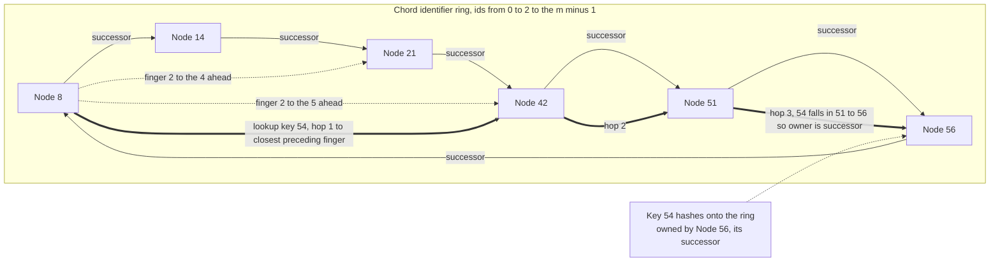

# 🕸️ Distributed Hash Tables

> [!abstract] TL;DR
> A **Distributed Hash Table (DHT)** is a fully **decentralized** key→node index that gives a huge peer-to-peer network an ordinary hash-table interface — `put(key, value)` and `get(key)` — with **no central directory**. It marries two ideas: **consistent-hashing-style assignment** (both keys and nodes are hashed into the same identifier space, and each key is owned by a deterministic node such as its *successor* on a ring) and a **distributed routing overlay** (each node knows only `O(log N)` other nodes, yet any node can *route* a lookup to the owner of any key in `O(log N)` hops). The payoff is a system that is **scalable** to millions of nodes, **fault-tolerant** under constant **churn** (nodes joining, leaving, and crashing), and **self-organizing** with **no single point of failure or control**. **Chord** (the classic teaching design) hashes onto a ring and uses a **finger table** of exponentially spaced shortcuts to halve the remaining distance each hop; **Kademlia** (by far the most *deployed* — BitTorrent's Mainline DHT, IPFS, Ethereum node discovery) uses an **XOR distance** metric and **k-buckets** for redundancy and churn resistance. DHTs are the structural backbone of trackerless BitTorrent, content routing in IPFS/libp2p, and blockchain peer discovery — proof that you can build a scalable, decentralized index over untrusted, churning nodes with only `O(log N)` state and `O(log N)` hops per lookup.

---

## Intuition

**Analogy:** Imagine a phone book spread across **millions of strangers' phones**, with **no central directory** and no one holding the whole book. Each person memorizes just a *handful* of other people's numbers. To find the entry for "Zoe," you don't search everyone — you ask the contact from your short list who is **numerically closest to Zoe**, that person forwards you to *their* closest contact, and so on. Even though nobody knows more than a few others, the query **homes in** on the person responsible for "Zoe" in only a **handful of hops**. That is exactly a DHT: every node knows only a few peers, but by repeatedly forwarding *"who do you know that is closer to this key?"* the lookup converges on the responsible node in about `log N` steps.

Translate "person" into a node, "phone number" into an **identifier on a ring**, "the entry for Zoe" into a **key**, and "your short list of contacts" into a **routing table** of a few carefully chosen shortcuts, and you have a structured peer-to-peer overlay. The magic is that the shortcuts are chosen at **exponentially increasing distances** — one contact roughly halfway around the space, one a quarter away, one an eighth away, and so on — so each forward at least **halves** the remaining gap, giving logarithmic lookups from purely local knowledge.

---

## How It Works

### What a DHT actually is

A DHT is a distributed system that provides a **hash-table abstraction** (`put`/`get` by key) where:

1. **The key space is partitioned across nodes.** A hash function maps every key *and* every node into the same large identifier space (for example `m`-bit integers, so ids run from `0` to `2^m - 1`). A deterministic rule assigns each key to a node — in Chord, a key is owned by its **successor**, the first node clockwise from the key's id (this is precisely the [[Consistent_Hashing]] assignment). Because the rule is a pure function of ids, **any node can compute *which* node owns a key** without asking anyone.
2. **Any node can route a lookup to the owner without a central directory.** The hard part is that a node does *not* know the full membership, so it cannot jump straight to the owner. Instead it maintains a small **routing overlay** — a table of shortcuts to other nodes — and **forwards the query greedily** toward the key's id until it reaches the owner. This is the piece that consistent hashing alone lacks (see the comparison below).

So a DHT = **consistent-hashing key assignment** + **a decentralized routing overlay**. It is the foundation of *structured* peer-to-peer systems, in contrast to *unstructured* P2P (like early Gnutella) that floods queries blindly.

### The four properties that define a good DHT

- **Scalability** — correct and efficient with millions of nodes; no component sees global state.
- **Decentralization** — no coordinator, no single point of failure or control; every node runs the same protocol.
- **Fault tolerance under churn** — nodes join, leave, and fail *continuously*. The overlay must self-repair so routing and key ownership stay correct despite constant membership change.
- **Efficiency** — `O(log N)` hops per lookup and `O(log N)` routing state per node. This is the sweet spot of the fundamental **state-vs-hops trade-off**: more routing state per node buys fewer hops (at the extreme, a *one-hop DHT* keeps a full `O(N)` table and resolves in one hop, viable only for smaller, stable systems), while less state means more hops.

### Chord: the canonical ring DHT

Chord (MIT, 2001) is the classic teaching DHT:

1. **Identifier ring.** Hash nodes and keys onto an `m`-bit ring (ids mod `2^m`), conceptually a circle.
2. **Successor ownership.** Key `k` is owned by `successor(k)` — the first node whose id is `>= k` going clockwise (wrapping past 0). This is consistent hashing: adding or removing a node only reassigns the keys in **one arc** of the ring, so churn causes **local** key movement, not a global reshuffle.
3. **Finger table.** Each node `n` keeps `m` shortcuts called **fingers**. Finger `i` points to `successor(n + 2^i)` — the node responsible for the id `2^i` positions ahead. So a node has pointers at distances `2^0, 2^1, 2^2, ...` around the ring: many nearby, exponentially fewer far away. Only about `log N` of these are *distinct*, giving `O(log N)` routing state.
4. **Greedy lookup.** To find `successor(k)`, a node forwards the query to the **closest preceding finger** — the finger whose id is nearest to `k` without overshooting. Because fingers double in reach, each hop at least **halves** the distance to the target, so the lookup terminates in `O(log N)` hops. When the remaining gap fits between a node and its immediate successor, that successor is the owner.
5. **Robustness and maintenance.** Each node also keeps a **successor list** (its next few successors) so a single failure does not break the ring, and a **stabilization** protocol periodically fixes successor and finger pointers as nodes join and leave.

### Kademlia: the most deployed DHT

Kademlia (2002) is what actually runs the internet's largest DHTs. Instead of a ring it defines distance between two ids as their **XOR** (`d(x, y) = x XOR y`), a metric that is **symmetric** — if `A` is close to `B`, then `B` is equally close to `A`, so nodes naturally learn about each other during normal lookups. Each node keeps **k-buckets**: for each distance range it stores up to `k` contacts (typically `k = 20`) rather than a single pointer. This redundancy means a lookup has several candidates at each step, making Kademlia **resistant to churn** (dead contacts are simply skipped) and enabling **parallel, iterative** lookups (query several close nodes at once, keep the closest responders). In practice Kademlia is simpler to implement correctly and more robust than Chord, which is why it powers BitTorrent's Mainline DHT, IPFS/libp2p, and Ethereum's node discovery.

### Other overlay geometries

- **Pastry / Tapestry** — **prefix routing**: each hop fixes one more digit of the target id (like longest-prefix routing), and they add **network-locality** awareness so hops prefer physically nearby nodes.
- **CAN (Content-Addressable Network)** — partitions a **`d`-dimensional coordinate space**; each node owns a zone and routes toward the target's coordinates through neighboring zones. These designs map out the *design space of overlay geometries* — ring, tree/prefix, and torus — each trading off state, hops, and locality differently.

### DHT vs consistent hashing (the crucial distinction)

They are related but **not the same**. Plain [[Consistent_Hashing]] is a key→node *mapping* usually used **inside a controlled cluster** where every node knows the **full membership** (kept in sync by gossip), so a lookup is a **local `O(1)` computation** — the client hashes the key and jumps straight to the owner. A DHT adds a **multi-hop routing overlay** for the case where a node **cannot know all the others** (open, internet-scale, churning P2P), trading that `O(1)` computation for an `O(log N)` *routed* lookup. Amazon's Dynamo, for example, uses consistent hashing **plus full membership via gossip** — it is *not* a multi-hop DHT, because inside a datacenter every node can afford to know all the others (see [[Eventual_Consistency]] and the anti-entropy machinery it relies on).



---

## Key Concepts

### Secondary (plain-language)
- A DHT is a **giant address book with no owner**, spread across millions of computers. Anyone can look up "who is responsible for this key" even though **no single machine knows everyone**.
- Every computer memorizes just a **few well-chosen neighbors**. To find a key, it keeps **forwarding the question to whoever it knows that is closest**, and the answer is found in a small number of hops.
- Machines are **constantly joining and leaving** ("churn"), so the system must keep **fixing its neighbor lists** automatically.
- The famous users are **BitTorrent** (finding peers without a central tracker) and **IPFS** (finding which node has a file).

### Undergraduate (CS background)
- **Structured overlay**: nodes and keys share one `m`-bit id space; key ownership is a deterministic function (Chord: `owner(k) = successor(k)`), exactly [[Consistent_Hashing]].
- **Finger table (Chord)**: `finger[i] = successor(n + 2^i)`; exponentially spaced shortcuts give `O(log N)` state and `O(log N)`-hop greedy routing because each hop halves the residual distance.
- **k-buckets and XOR distance (Kademlia)**: symmetric metric + up to `k` contacts per distance range → redundancy, parallel iterative lookups, churn resistance.
- **Churn handling**: successor lists, stabilization/repair, and **replication** of each key across the next few successors for durability.
- **Lookup styles**: *iterative* (the initiator drives each step, easy to debug) vs *recursive* (each hop forwards on the initiator's behalf, fewer round trips but harder failure handling).

### Graduate (theory / system-level)
- **State–hops trade-off is fundamental.** Routing state `s` per node and hop count `h` roughly satisfy `h = O(log_s N)`; `s = O(log N)` gives `h = O(log N)`, `s = O(N)` gives one-hop, and the whole design space (Chord, Kademlia, Pastry, CAN, one-hop, `O(√N)` two-hop) is points on this curve chosen for a target churn rate and lookup latency.
- **Correctness under concurrency and churn.** Chord's safety rests on maintaining correct **successor pointers**; fingers are only an *optimization* for speed. Stabilization must converge faster than churn destroys structure, or lookups return wrong owners (inconsistent/looping routes).
- **Security in permissionless overlays.** Open DHTs face **Sybil attacks** (one adversary forges many ids to control key regions), **Eclipse attacks** (surrounding a victim with malicious peers to isolate it), and **routing/storage attacks**. Mitigations include constraining id assignment (crypto-puzzles, IP-based buckets, certified ids), redundant/disjoint lookup paths, and quorum verification — but full defense requires trust or economic cost, tying into [[Byzantine_Agreement_and_PBFT]]-style adversarial models.
- **Latency reality.** `O(log N)` *hops* can still be tens of *internet* round trips; production systems reduce this with proximity-aware routing (Pastry), larger `k`/parallelism (Kademlia), or caching hot keys along lookup paths.

---

## Python Demo

A pure-stdlib **Chord** simulation with matplotlib visualization. It (1) hashes nodes and keys onto an `m`-bit ring and stores each key at its **successor**; (2) builds **finger tables** (`finger[i] = successor(n + 2^i)`) and runs an **iterative greedy lookup** that counts **hops**; (3) empirically shows lookups take **`O(log N)` hops** and each node keeps **`O(log N)` routing state** as `N` grows; and (4) demonstrates a node **JOIN/LEAVE** moving only a **local arc** of keys. The figure visualizes the ring, finger-table shortcuts, a lookup path, the scaling curves, and the key-transfer under churn.

```python
"""
CHORD DHT: nodes and keys hashed onto an m-bit ring, keys owned by their
SUCCESSOR node, O(log N) finger tables, greedy iterative lookup with hop
counting, an O(log N)-hops / O(log N)-state scaling experiment, and node
JOIN/LEAVE showing only LOCAL key transfer.  Pure stdlib + matplotlib.
"""

import bisect, hashlib, math, random
import matplotlib.pyplot as plt
from matplotlib.patches import Circle

random.seed(7)

# --------------------------------------------------------------------- #
# Ring interval helpers -- arithmetic mod M, clockwise
# --------------------------------------------------------------------- #
def in_oc(x, a, b, M):          # x in (a, b]  : open left, closed right
    a %= M; b %= M; x %= M
    if a == b:
        return True             # degenerate single node -> whole ring
    if a < b:
        return a < x <= b
    return x > a or x <= b      # interval wraps past 0

def in_oo(x, a, b, M):          # x in (a, b)  : open both ends
    a %= M; b %= M; x %= M
    if a == b:
        return x != a
    if a < b:
        return a < x < b
    return x > a or x < b

# --------------------------------------------------------------------- #
# Chord ring
# --------------------------------------------------------------------- #
class Chord:
    def __init__(self, m):
        self.m = m
        self.M = 1 << m
        self.nodes = []                 # sorted node ids present on the ring
        self.finger = {}                # node id -> [m finger targets]

    def successor_of(self, x):          # first node clockwise at or after x
        i = bisect.bisect_left(self.nodes, x % self.M)
        return self.nodes[i % len(self.nodes)]

    def build_fingers(self):
        # finger[i] = successor(n + 2**i).  Rebuilt from global membership for
        # clarity; real Chord updates these incrementally in stabilize().
        self.finger = {n: [self.successor_of(n + (1 << i)) for i in range(self.m)]
                       for n in self.nodes}

    def closest_preceding(self, n, key):
        # highest finger that still precedes the key -> greedy long jump
        for i in range(self.m - 1, -1, -1):
            f = self.finger[n][i]
            if in_oo(f, n, key, self.M):
                return f
        return n

    def lookup(self, start, key):
        # iterative find_successor.  Returns (owner, hops, path).
        n, path = start, [start]
        while not in_oc(key, n, self.finger[n][0], self.M):   # finger[0] = successor
            nxt = self.closest_preceding(n, key)
            if nxt == n:
                break
            n = nxt
            path.append(n)
        owner = self.finger[n][0]         # the key's successor owns it
        if owner != path[-1]:
            path.append(owner)
        return owner, len(path) - 1, path

    def add_node(self, nid):
        bisect.insort(self.nodes, nid)
        self.build_fingers()

    def remove_node(self, nid):
        self.nodes.remove(nid)
        self.build_fingers()

def h(s, M):
    return int(hashlib.sha1(str(s).encode()).hexdigest(), 16) % M

# ===================================================================== #
# PART A  Small readable ring: fingers, a lookup path, JOIN and LEAVE
# ===================================================================== #
ring = Chord(6)                                   # M = 64, easy to draw
node_ids = sorted(set(random.sample(range(ring.M), 8)))
ring.nodes = node_ids
ring.build_fingers()

key_ids = sorted(set(h(f"key-{i}", ring.M) for i in range(16)))
def owners(ch, keys):                             # key -> owning node (its successor)
    return {k: ch.successor_of(k) for k in keys}
owner_before = owners(ring, key_ids)

start      = node_ids[0]
target_key = key_ids[len(key_ids) // 2]
owner, hops, path = ring.lookup(start, target_key)
start_fingers = sorted(set(ring.finger[start]))   # capture BEFORE we mutate the ring

print("PART A  small Chord ring, m = 6, M =", ring.M)
print("  nodes :", node_ids)
print(f"  finger table of node {start}: {ring.finger[start]}")
print(f"  lookup key {target_key}: path {path} -> owner {owner} in {hops} hops\n")

# JOIN: the new node takes over exactly the keys in its arc, from ONE node
new_id = next(x for x in range(ring.M) if x not in node_ids)
ring.add_node(new_id)
owner_after_join = owners(ring, key_ids)
moved_join   = [k for k in key_ids if owner_before[k] != owner_after_join[k]]
sources_join = {owner_before[k] for k in moved_join}
print(f"  JOIN node {new_id}: {len(moved_join)} of {len(key_ids)} keys moved, "
      f"all from node set {sources_join} (only its old successor)")

# LEAVE: the departing node hands its keys to its successor only
leave_id = node_ids[3]
ring.remove_node(leave_id)
owner_after_leave = owners(ring, key_ids)
moved_leave = [k for k in key_ids if owner_after_join[k] != owner_after_leave[k]]
print(f"  LEAVE node {leave_id}: {len(moved_leave)} of {len(key_ids)} keys moved "
      f"to its successor only\n")

# ===================================================================== #
# PART B  Scaling: average lookup HOPS and routing STATE vs N
# ===================================================================== #
mB = 16                                            # M = 65536
Ns = [16, 32, 64, 128, 256, 512, 1024, 2048, 4096]
TRIALS = 500
avg_hops, avg_state = [], []
print("PART B  scaling experiment, m = 16")
for N in Ns:
    ch = Chord(mB)
    ch.nodes = sorted(random.sample(range(ch.M), N))
    ch.build_fingers()
    total = 0
    for _ in range(TRIALS):
        s = random.choice(ch.nodes)
        k = random.randrange(ch.M)
        total += ch.lookup(s, k)[1]
    avg_hops.append(total / TRIALS)
    avg_state.append(sum(len(set(ch.finger[n])) for n in ch.nodes) / N)
    print(f"  N={N:>4}: avg hops={avg_hops[-1]:.2f}  "
          f"distinct fingers/node={avg_state[-1]:.2f}  "
          f"(0.5*log2 N = {0.5*math.log2(N):.2f},  log2 N = {math.log2(N):.2f})")

# =========================== VISUALIZATION =========================== #
fig, axes = plt.subplots(2, 2, figsize=(15, 11))
(ax1, ax2), (ax3, ax4) = axes

# --- ax1: the small ring, keys, finger shortcuts, and the lookup path ---
def pos(idv, M, R=1.0):
    th = 2 * math.pi * idv / M                     # 0 at top, clockwise
    return (R * math.sin(th), R * math.cos(th))

ax1.add_patch(Circle((0, 0), 1.0, fill=False, color="#cccccc", lw=1))
for k in key_ids:                                  # keys as small grey dots
    x, y = pos(k, ring.M)
    ax1.plot(x, y, "o", ms=4, color="#bdc3c7", zorder=2)
for f in start_fingers:                            # finger shortcuts (dashed green)
    if f == start:
        continue
    x0, y0 = pos(start, ring.M); x1, y1 = pos(f, ring.M)
    ax1.annotate("", xy=(x1, y1), xytext=(x0, y0),
                 arrowprops=dict(arrowstyle="->", color="#27ae60",
                                 ls="--", lw=1.3, alpha=0.85), zorder=3)
for u, v in zip(path[:-1], path[1:]):              # lookup path (bold blue)
    x0, y0 = pos(u, ring.M); x1, y1 = pos(v, ring.M)
    ax1.annotate("", xy=(x1, y1), xytext=(x0, y0),
                 arrowprops=dict(arrowstyle="-|>", color="#2980b9", lw=2.6), zorder=4)
for n in node_ids:                                 # nodes on top; highlight endpoints
    x, y = pos(n, ring.M)
    if n == start:
        c, sz = "#e67e22", 200
    elif n == owner:
        c, sz = "#c0392b", 200
    else:
        c, sz = "#34495e", 120
    ax1.scatter([x], [y], s=sz, color=c, zorder=5, edgecolors="white")
    lx, ly = pos(n, ring.M, 1.14)
    ax1.text(lx, ly, str(n), ha="center", va="center", fontsize=9, fontweight="bold")
ax1.text(0, 0, f"lookup key {target_key}\nfrom node {start}\n"
               f"{hops} hops -> owner {owner}", ha="center", va="center",
         fontsize=9, color="#2c3e50",
         bbox=dict(boxstyle="round", fc="#f7f9fb", ec="#bbb"))
ax1.set_title("Chord ring: green = finger shortcuts,  blue = greedy lookup path",
              fontweight="bold")
ax1.set_xlim(-1.35, 1.35); ax1.set_ylim(-1.35, 1.35)
ax1.set_aspect("equal"); ax1.axis("off")

# --- ax2: average lookup hops vs N (O(log N)) ---
ax2.plot(Ns, avg_hops, "o-", color="#2980b9", lw=2.4, label="measured avg hops")
ax2.plot(Ns, [0.5*math.log2(N) for N in Ns], "s--", color="#27ae60", lw=1.8,
         label="0.5 log2 N (theory)")
ax2.plot(Ns, [math.log2(N) for N in Ns], ":", color="#c0392b", lw=1.8,
         label="log2 N (upper reference)")
ax2.set_xscale("log", base=2)
ax2.set_xlabel("N  (nodes, log scale)"); ax2.set_ylabel("average lookup hops")
ax2.set_title("Lookups scale as O(log N) hops as the network grows", fontweight="bold")
ax2.legend(fontsize=9); ax2.grid(alpha=0.3)

# --- ax3: routing state (distinct fingers) vs N (O(log N)) ---
ax3.plot(Ns, avg_state, "o-", color="#8e44ad", lw=2.4,
         label="avg distinct fingers / node")
ax3.plot(Ns, [math.log2(N) for N in Ns], "s--", color="#27ae60", lw=1.8,
         label="log2 N (theory)")
ax3.set_xscale("log", base=2)
ax3.set_xlabel("N  (nodes, log scale)"); ax3.set_ylabel("routing entries / node")
ax3.set_title("Each node stores only O(log N) routing state", fontweight="bold")
ax3.legend(fontsize=9); ax3.grid(alpha=0.3)

# --- ax4: JOIN / LEAVE move only a LOCAL fraction of keys ---
labels = ["total keys", "moved on\nJOIN", "moved on\nLEAVE"]
vals   = [len(key_ids), len(moved_join), len(moved_leave)]
bars = ax4.bar(labels, vals, color=["#34495e", "#27ae60", "#e67e22"])
for b, v in zip(bars, vals):
    ax4.text(b.get_x() + b.get_width()/2, v + 0.15, str(v), ha="center",
             fontweight="bold")
ax4.set_ylabel("number of keys")
ax4.set_title("Churn is cheap: only one node's arc of keys moves", fontweight="bold")
ax4.set_ylim(0, len(key_ids) + 2)

fig.suptitle("Chord DHT: O(log N) hops, O(log N) state, and local key transfer "
             "under churn", fontsize=14, fontweight="bold")
plt.tight_layout(rect=(0, 0, 1, 0.96))
plt.savefig("chord_dht.png", dpi=120)
plt.show()
print("\nSaved figure -> chord_dht.png")
```

**What you see.** The ring panel shows nodes placed by id on the circle, keys as grey dots, the highlighted start node's **finger shortcuts** fanning out at doubling distances (green), and the **greedy lookup path** (blue) reaching the key's owner in a few hops. The hop curve rises like `0.5 log2 N` as `N` grows a thousand-fold — flat compared to the linear `N` it routes over — confirming **`O(log N)` hops**. The routing-state curve tracks `log2 N`, confirming each node keeps only **`O(log N)` shortcuts** even as the network scales. The churn bars show that a **JOIN** or **LEAVE** moves only the **small arc of keys** owned by one node, all transferred from (or to) exactly one neighbor — the consistent-hashing property that makes DHTs cheap to maintain under constant membership change.

---

## Real-World Applications

- **BitTorrent Mainline DHT (trackerless torrents)** — a **Kademlia** DHT over UDP with tens of millions of concurrent peers. The key is the torrent's `infohash`; `get_peers` routes to the nodes storing the peer list for that swarm, so downloads work with **no central tracker**. The largest DHT ever deployed.
- **IPFS / libp2p content routing** — IPFS uses a **Kademlia DHT** to answer "which nodes have the content with this CID?" A provider announces `provide(CID)`, and a fetcher runs `findProviders(CID)` through the DHT to locate a peer holding the blocks. See [[IPFS_and_Filecoin]].
- **Ethereum / devp2p node discovery** — **discv5** is a **Kademlia-based DHT** over UDP used purely for **peer discovery** (finding other nodes to gossip blocks and transactions with), storing signed Ethereum Node Records. See [[P2P_Network_Architecture]] and [[Consensus_Mechanisms]].
- **Historic P2P systems** — the Kad network (eMule/aMule) and Overnet were early large Kademlia deployments; Freenet used a DHT-like routing for censorship-resistant storage; academic systems (Chord, Pastry, Tapestry, CAN) established the field.
- **Contrast — Amazon Dynamo / Cassandra** — these use [[Consistent_Hashing]] with **full membership via gossip**, so lookups are `O(1)` local computations, **not** multi-hop DHT routing. They borrow the DHT's key-assignment idea without the routing overlay because inside a datacenter every node can afford to know all the others (see [[Eventual_Consistency]] and [[Replication_Models]]).

---

## Common Pitfalls

- **Confusing a DHT with consistent hashing.** Consistent hashing is a key→node *mapping* used where every node knows full membership (`O(1)` lookup). A DHT adds a *routing overlay* for when nodes *cannot* know all others (`O(log N)` lookup). Dynamo is the former, BitTorrent's Mainline DHT is the latter — do not claim Dynamo "is a DHT."
- **Under-estimating churn and stale routing.** In open networks a large fraction of nodes leave within hours. Without frequent **stabilization/repair** and successor lists, fingers point at dead nodes, lookups loop or return the wrong owner. Correctness rests on the **successor pointer**, not the fingers — fingers are only a speed optimization.
- **No replication → data loss on departure.** If a key lives on a single owner, that node leaving loses the value. Real DHTs **replicate each key across the next `k` successors** (or `k` XOR-closest nodes in Kademlia) for durability, and re-replicate as membership shifts (an anti-entropy/repair concern akin to gossip-based sync).
- **`O(log N)` hops is not `O(log N)` milliseconds.** Each hop can be an internet round trip, so tens of hops means real latency. Mitigate with proximity-aware routing (Pastry), parallel/iterative lookups and large `k` (Kademlia), and path caching of hot keys.
- **Ignoring Sybil and Eclipse attacks.** In a permissionless DHT an adversary can forge many ids to own a key region (**Sybil**) or surround a victim with malicious peers (**Eclipse**) to censor or poison lookups. Constrain id assignment (crypto-puzzles, IP-diversity in buckets, certified ids), use redundant disjoint lookup paths, and verify results — see [[Byzantine_Agreement_and_PBFT]].
- **Load imbalance and hotspots.** Raw hashing gives uneven arcs and a popular key hammers one owner. Use **virtual nodes** (one physical node owns several ids) for smoother balance and **caching/replication of hot keys** along lookup paths.
- **NAT and firewalls.** Most peers sit behind NAT; a DHT that assumes direct connectivity fails in the wild. Production DHTs need hole-punching, relays, and reachability checks before trusting a contact.

---

## Related Concepts

- [[Consistent_Hashing]] — the key→node assignment a DHT is built on; a DHT is consistent hashing *plus* a decentralized routing overlay for when nodes do not know full membership.
- [[Partitioning_and_Sharding]] — a DHT is essentially partitioning the key space across nodes; the difference is *self-organizing, decentralized* partitioning under churn rather than a coordinator assigning shards.
- [[Replication_Models]] — DHTs replicate each key across the next few successors (leaderless, quorum-style) for durability under churn; the same replication ideas applied to a P2P overlay.
- [[Eventual_Consistency]] — DHT state (routing tables, key replicas) converges over time via stabilization and repair rather than being instantly consistent, exactly the eventual-consistency/anti-entropy pattern.
- [[Byzantine_Agreement_and_PBFT]] — open DHTs must resist malicious peers (Sybil, Eclipse, routing attacks); the adversarial-fault model and quorum verification connect DHT security to Byzantine agreement.
- [[Distributed_Systems_Overview]] — the partial-failure, no-global-clock, unreliable-network difficulties that make a self-organizing overlay under churn hard in the first place.
- [[P2P_Network_Architecture]] — the peer-to-peer layer (including Kademlia-based discv5 discovery) where DHTs live in real blockchain and file-sharing networks.
- [[IPFS_and_Filecoin]] — a production Kademlia DHT used for content routing (mapping a CID to the nodes that hold it).
- [[Consensus_Mechanisms]] — blockchains use a DHT for *peer discovery*, then a consensus mechanism for agreement; the two are distinct layers of a decentralized system.
- [[Hash_Table_Fundamentals]] — the in-memory data structure a DHT distributes; the same hash-and-bucket idea, scaled across untrusted machines with routing added.

> Vault siblings referenced in prose but not yet written (link when created): *Gossip_and_Epidemic_Protocols* (membership dissemination and anti-entropy repair), *Eventual_Consistency_and_Anti_Entropy*, and *Blockchain_and_Nakamoto_Consensus* (peer discovery via DHTs underneath Nakamoto-style networks).

---

## Review Questions

**Secondary (understanding):**
1. Using the "phone book spread across millions of strangers' phones" analogy, explain how a lookup can find the person responsible for a key when *no one* knows everybody. Why does forwarding to "whoever I know that is closest to the target" find the answer in only a handful of hops?

**Undergraduate (application):**
2. In Chord with an `m`-bit ring, a node `n` builds a finger table where `finger[i] = successor(n + 2^i)`. Explain precisely why greedy routing through the *closest preceding finger* takes `O(log N)` hops, and why each node needs only `O(log N)` *distinct* fingers even though the table has `m` entries.
3. A node joins a Chord ring. Explain which keys move, which single node they move *from*, and why joins/leaves cause only **local** key transfer rather than a global reshuffle. Connect this to the consistent-hashing property.

**Graduate (analysis / trade-offs):**
4. Compare **Chord** and **Kademlia** on routing metric, redundancy per routing entry, churn resistance, and ability to do parallel lookups. Why is Kademlia the one actually deployed at internet scale (BitTorrent, IPFS, Ethereum) despite Chord being the textbook design?
5. You are asked whether to build a service on a multi-hop DHT or on consistent hashing with full-membership gossip (Dynamo-style). State the deciding factors (network size, churn, trust, latency budget, whether nodes can know full membership) and give one scenario that clearly favors each. Then explain what a Sybil attack would do to the DHT option and one mitigation.

---

## Sources

- Stoica, I., Morris, R., Karger, D., Kaashoek, M. F., Balakrishnan, H. (2001). *Chord: A Scalable Peer-to-peer Lookup Service for Internet Applications.* SIGCOMM. [PDF](https://pdos.csail.mit.edu/papers/chord:sigcomm01/chord_sigcomm.pdf)
- Maymounkov, P. & Mazières, D. (2002). *Kademlia: A Peer-to-peer Information System Based on the XOR Metric.* IPTPS. [PDF](https://pdos.csail.mit.edu/~petar/papers/maymounkov-kademlia-lncs.pdf)
- Rowstron, A. & Druschel, P. (2001). *Pastry: Scalable, Decentralized Object Location and Routing for Large-Scale Peer-to-Peer Systems.* Middleware. [PDF](https://www.cs.rice.edu/~druschel/publications/Pastry.pdf)
- Ratnasamy, S., Francis, P., Handley, M., Karp, R., Shenker, S. (2001). *A Scalable Content-Addressable Network (CAN).* SIGCOMM. [PDF](https://people.eecs.berkeley.edu/~sylvia/papers/cans.pdf)
- Loewenstern, A. & Norberg, A. *BEP 5: DHT Protocol* (BitTorrent Mainline DHT, Kademlia). [bittorrent.org](https://www.bittorrent.org/beps/bep_0005.html)

---

#distributed-systems #dht #chord #kademlia #peer-to-peer
