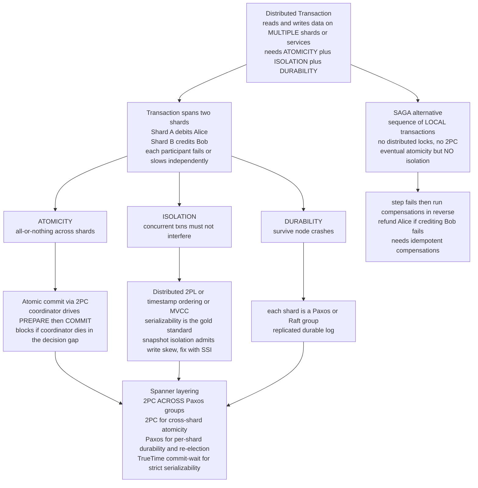

# 🔀 Distributed Transactions

> [!abstract] TL;DR
> A **distributed transaction** provides **ACID-like guarantees across multiple nodes, shards, or services** — the reads and writes it touches live on *different* machines that can each fail or slow down independently. It must deliver **atomicity** (all-or-nothing), **isolation** (concurrent transactions do not interfere), and **durability** across those nodes. **Atomicity** is solved by an **atomic-commit protocol** — classically **Two-Phase Commit (2PC)**, whose fatal weakness is *blocking* when the coordinator crashes; robust systems layer 2PC over **consensus** (Paxos/Raft) so the coordinator is fault-tolerant. **Isolation** is the harder, less-discussed half — enforced by distributed **two-phase locking**, **timestamp ordering**, or **MVCC/snapshot isolation** (which admits write-skew unless upgraded to **serializable snapshot isolation**). The strongest guarantee, **strict serializability / external consistency**, is achieved globally by **Google Spanner** (TrueTime commit-wait + 2PC over Paxos groups). When strict guarantees are too costly, the **saga** pattern trades them away: a sequence of local transactions with **compensating actions** giving *eventual* atomicity and **no isolation** — the microservice-era answer. The perennial wisdom: **the best distributed transaction is no distributed transaction.**

---

## Intuition

**Analogy:** A bank transfer must **debit** one account and **credit** another, and the only acceptable outcomes are *both happen* or *neither happens* — never a debit with no matching credit (money vanishes) or a credit with no debit (money is conjured). When both accounts live in **one database**, this is a trivial `BEGIN … COMMIT` — the engine hands you atomicity and isolation for free. Now put the two accounts on **different servers**. Suddenly you must *coordinate two independent participants* that can each crash, stall, or become unreachable at the worst possible moment. A guarantee that was a single line of SQL becomes one of the hardest problems in the field.

That single move — splitting the data across machines — is what turns a local certainty into a distributed negotiation. You now have to choose: enforce **strict atomicity and isolation** by making participants coordinate and hold locks across the network (correct but slow, and prone to *blocking* when a coordinator dies), or **stay available** by letting each participant act locally and reconciling afterward (fast and decoupled, but you expose half-finished states and give up isolation). Everything below is the study of that trade-off — the mechanisms that buy strict guarantees, their costs, and the saga alternative that deliberately abandons them.

---

## How It Works

### The problem: ACID across partitions

A distributed transaction reads and writes data spread over multiple **partitions/shards** (a sharded database) or multiple **services** (microservices). It still owes the caller the ACID properties, but each is now *harder*:

- **Atomicity** — the update must be all-or-nothing *across all participants*, even though any one can fail after others have committed. This is the **atomic-commitment** problem (see [[Atomic_Commitment]]).
- **Isolation** — concurrent distributed transactions must not observe each other's partial effects. Enforcing this requires a *global* concurrency-control scheme, not just per-node locking.
- **Durability** — each participant's decision must survive its own crash, which in practice means each shard replicates its log via consensus.

The reason this is far harder than a single-node transaction is **partial failure plus no shared clock**: participants fail and slow *independently*, and there is no free global order to appeal to. Atomicity and isolation, trivially co-guaranteed inside one engine, must now be manufactured separately over an unreliable network.

### Atomicity: atomic commit (2PC over consensus)

The all-or-nothing half is exactly **atomic commitment**, recapped from [[Atomic_Commitment]]. **Two-Phase Commit (2PC)** has a coordinator drive two round trips: **Phase 1 (prepare/vote)** — each participant durably prepares, **holds locks**, and votes YES or NO; **Phase 2 (decide)** — the coordinator commits *iff every vote is YES*, else aborts, and broadcasts the verdict. Its crippling flaw is **blocking**: if the coordinator crashes *after* collecting YES votes but *before* delivering the decision, every participant sits **in-doubt**, holding locks, unable to safely commit or abort alone. **3PC** and **consensus-based commit (Paxos Commit)** remove the blocking by replicating the coordinator's decision; the production answer is to run **2PC across Paxos/Raft groups** so a crashed coordinator is simply re-elected from its replicated log. **2PC for cross-shard atomicity, consensus for per-shard durability and availability.**

### Isolation across nodes: the harder half

Atomicity gets the headlines; **isolation** is the subtler problem. The gold standard is **serializability** — concurrent transactions produce a result equivalent to *some* serial (one-at-a-time) order. Distributed mechanisms:

- **Distributed two-phase locking (2PL)** — acquire read/write locks on every participant, hold them until commit; needs **distributed deadlock detection** (or wait-die / wound-wait timeouts). Correct and serializable, but locks held across the network kill throughput and breed deadlocks.
- **Timestamp ordering** — assign each transaction a global timestamp and order conflicting operations by it; no locks, but aborts/restarts under contention.
- **MVCC (multi-version concurrency control)** — writers create new versions; **readers see a consistent snapshot and never block writers** (and vice versa). The basis of **snapshot isolation**.
- **Snapshot isolation (SI)** — each transaction reads a snapshot at its start timestamp; fast and non-blocking for reads, but admits the **write-skew** anomaly (two transactions read overlapping data, each writes a disjoint part, together violating an invariant neither would alone). **Serializable Snapshot Isolation (SSI)** adds conflict detection to close write-skew while keeping SI's read performance. See [[Isolation_Levels]], [[MVCC_Internals]], and [[Concurrency_Control]].

### Strict serializability (external consistency) and Spanner

The strongest guarantee is **strict serializability** — serializable **and** linearizable: the serial order also respects real-time order (if T1 finishes before T2 starts, T1 precedes T2). **Google Spanner** achieves this *globally* with **TrueTime**: instead of pretending clocks are perfect, TrueTime exposes an explicit **bounded uncertainty interval** and Spanner performs **commit-wait** — a transaction waits out the clock uncertainty before releasing its commit timestamp, so timestamps never disagree with real-time order. This runs **layered over 2PC and Paxos**: **2PC** across the shard leaders for cross-shard atomicity, and each shard is a **Paxos group** for fault-tolerant durability and a re-electable coordinator. This landmark design ties together [[Physical_Clocks_and_Synchronization]], [[Paxos]], and [[Linearizability_and_Sequential_Consistency]]; the same recipe powers **CockroachDB** and **YugabyteDB** (Raft-based, without atomic clocks).

### Other modern designs: Percolator and Calvin

- **Percolator (Google)** — layers **snapshot-isolation** transactions on top of Bigtable using a **timestamp oracle** plus **client-driven 2PC** (locks and commit records stored *as data* in the KV rows). It powered incremental search-index updates and is the model behind **TiDB/TiKV**.
- **Calvin (deterministic databases)** — flips the order of operations: **pre-order all transactions via consensus first**, then execute them **deterministically** on every replica. Because the order is agreed up front, replicas need **no 2PC and no distributed commit** at execution time — each just runs the agreed sequence. This *deterministic database* idea underlies **FaunaDB**. See [[The_Consensus_Problem]].

### The saga alternative

When locking across services is untenable (long-lived business workflows, microservices that must not couple), a **[[Saga_Pattern|saga]]** abandons distributed atomicity: it is a **sequence of local transactions**, each with a **[[Compensating_Transaction|compensating transaction]]** that *semantically undoes* it. If step _k_ fails, run the compensations for steps _k−1 … 1_ in reverse (semantic rollback). A saga gives **atomicity eventually** but **no isolation** — intermediate states are visible to other readers (the money is briefly "in flight"). It holds **no distributed locks** and needs no 2PC, trading strict guarantees for **availability and decoupling**. Sagas are **orchestrated** (a central coordinator/engine drives the steps) or **choreographed** (services react to each other's events); compensations must be **idempotent** (safe to retry) and effectively **commutative**. To publish those events reliably without a dual-write, use the **transactional [[Outbox_Pattern|outbox]] + CDC** or **[[Event_Sourcing|event sourcing]]** — atomically write the state change and an outbox row in one *local* transaction, then relay it, avoiding the "wrote to the DB but the message was lost" inconsistency (see [[Reliable_and_Ordered_Broadcast]]).



---

## Key Concepts

### Secondary (plain-language)
- A transaction across several machines must be **all-or-nothing**: debit one account *and* credit the other, or do neither — never half.
- On **one** database this is one line of SQL. **Across** databases you must coordinate independent servers that can each crash mid-way.
- **Two-Phase Commit** = *everyone prepares and votes, then a coordinator tells all to commit* — but if the coordinator dies mid-way, the others are **stuck holding locks**.
- A **saga** is the easy-going alternative: do the steps one at a time and, if a later step fails, **undo the earlier ones** with compensating steps. Simpler and always available, but someone can briefly see a half-finished state.

### Undergraduate (CS background)
- Four properties, three now hard: **atomicity** (atomic commit / 2PC), **isolation** (global concurrency control), **durability** (per-shard replication).
- **Atomic commit**: 2PC prepare/vote then commit-iff-unanimous; **blocking** on coordinator crash; fixed by 3PC or **Paxos Commit**.
- **Isolation mechanisms**: distributed **2PL** + deadlock detection, **timestamp ordering**, **MVCC/snapshot isolation**; SI's **write-skew** anomaly and **SSI** as the fix.
- **Saga**: local transactions + compensations = *eventual* atomicity, **no isolation**; orchestrated vs choreographed; compensations must be **idempotent**.
- **Outbox + CDC** solves the **dual-write** problem: commit state and an event atomically in one local transaction, then relay.

### Graduate (system-level)
- **Atomicity and isolation are separable in the distributed setting**: 2PC gives atomicity, a *distinct* concurrency-control layer gives isolation. A system can have one without the other (a saga has neither strict form).
- **Strict serializability = serializable + linearizable.** **Spanner** manufactures a real-time-respecting order from **TrueTime** (bounded clock error + **commit-wait**), layered as **2PC over Paxos** — atomicity from 2PC, durability/availability from Paxos, external consistency from TrueTime.
- **Deterministic databases (Calvin)** dodge 2PC by agreeing the *total order first* via consensus, then executing deterministically; **Percolator** builds SI transactions on a KV store via a **timestamp oracle** + client-driven 2PC (locks stored as data).
- **Avoid distributed transactions**: they cost coordination messages, **locks held across the network**, and blocking — hurting availability. Strategies: **co-locate related data in one partition** so the transaction is single-node, model workflows as **sagas / eventual consistency**, and lean on **idempotency**. This is where atomicity, isolation, consistency, and consensus all collide — providing ACID across nodes means *layering atomic commit over consensus plus distributed isolation*, or deliberately abandoning strict guarantees.

---

## Python Demo

A pure-stdlib simulation transferring money from **Alice (Shard A)** to **Bob (Shard B)**, implemented **two ways**. Part 1 is a **2PC atomic transfer** (prepare/commit, holding locks) — it shows atomicity (both accounts change or neither) *and* the **coordinator-crash blocking** risk (both shards stuck in-doubt, locks held). Part 2 is a **saga** — local debit then local credit with a **compensating refund** if the credit fails — showing it preserves **eventual atomicity without distributed locks** but **exposes an intermediate inconsistency window** (no isolation) and needs **idempotent** compensations. Matplotlib visualizes both flows and their failure handling.

```python
"""
DISTRIBUTED TRANSACTIONS: transfer money Alice (Shard A) -> Bob (Shard B) two ways.
  Part 1  2PC atomic commit -- holds locks, atomic, but BLOCKS on coordinator crash.
  Part 2  SAGA -- local txns + compensating refund; no locks, eventual atomicity,
          but an intermediate window with NO isolation; compensations are idempotent.
Pure-stdlib simulation + matplotlib visualization.
"""

import matplotlib.pyplot as plt
from matplotlib.patches import Rectangle

TRANSFER = 30
INITIAL = {"A": {"Alice": 100}, "B": {"Bob": 50}}
TOTAL = 150  # Alice 100 + Bob 50; a correct transfer conserves this


class Shard:
    """One partition holding some accounts, with a durable WAL and 2PC locks."""

    def __init__(self, name, accounts):
        self.name = name
        self.accounts = dict(accounts)
        self.locked = set()        # accounts holding a 2PC lock
        self.wal = []              # durable write-ahead log (survives a crash)
        self.applied = set()       # op-ids already applied  -> idempotency

    # ---- 2PC participant API (locks held from PREPARE until the decision) ----
    def prepare(self, acct, delta):
        if self.accounts[acct] + delta < 0:      # would overdraw -> vote NO
            return "NO"
        self.locked.add(acct)                    # HOLD the lock
        self.wal.append(("prepared", acct, delta))
        return "YES"

    def commit(self, acct, delta):
        self.accounts[acct] += delta
        self.wal.append(("commit", acct, delta))
        self.locked.discard(acct)

    def abort(self, acct):
        self.wal.append(("abort", acct))
        self.locked.discard(acct)

    # ---- Saga local-transaction API (commits immediately, no distributed lock)-
    def local_apply(self, op_id, acct, delta):
        if op_id in self.applied:                # idempotent: skip a replay
            return False
        self.applied.add(op_id)
        self.accounts[acct] += delta
        self.wal.append(("local", op_id, delta))
        return True


def total(a, b):
    return sum(a.accounts.values()) + sum(b.accounts.values())


# ===================================================================== #
# PART 1  Two-Phase Commit atomic transfer
# ===================================================================== #
def two_phase_transfer(a, b, amount, crash_before_decision=False):
    votes = {"A": a.prepare("Alice", -amount), "B": b.prepare("Bob", +amount)}
    all_yes = all(v == "YES" for v in votes.values())

    if crash_before_decision and all_yes:
        # coordinator dies AFTER collecting YES votes, BEFORE logging/sending it
        return {"votes": votes, "decision": None, "blocked": True}

    decision = "COMMIT" if all_yes else "ABORT"
    if decision == "COMMIT":
        a.commit("Alice", -amount)
        b.commit("Bob", +amount)
    else:                                        # roll back prepared participants
        a.abort("Alice"); b.abort("Bob")
    return {"votes": votes, "decision": decision, "blocked": False}


print("PART 1  Two-Phase Commit (atomic, locks held)")
a1, b1 = Shard("A", INITIAL["A"]), Shard("B", INITIAL["B"])
r = two_phase_transfer(a1, b1, TRANSFER)
print(f"  success : votes={r['votes']} decision={r['decision']} "
      f"-> Alice={a1.accounts['Alice']} Bob={b1.accounts['Bob']} "
      f"total={total(a1, b1)} (conserved, ATOMIC)")

a2, b2 = Shard("A", INITIAL["A"]), Shard("B", INITIAL["B"])
r = two_phase_transfer(a2, b2, TRANSFER, crash_before_decision=True)
stuck = [s.name for s in (a2, b2) if s.locked]
print(f"  crash   : votes={r['votes']} decision={r['decision']} blocked={r['blocked']}")
print(f"            shards IN-DOUBT, locks held on {stuck} -> BLOCKED indefinitely")
print(f"            (recovery needs the coordinator's durable log to resolve)\n")

# ===================================================================== #
# PART 2  Saga: local debit -> local credit, with a compensating refund
# ===================================================================== #
def saga_transfer(a, b, amount, fail_credit=False):
    trail = [("start", total(a, b))]
    a.local_apply(("debit", "Alice"), "Alice", -amount)      # step 1: local commit
    trail.append(("after debit A", total(a, b)))             # <-- money "in flight"

    if fail_credit:                                          # step 2 fails
        a.local_apply(("refund", "Alice"), "Alice", +amount)  # compensate step 1
        trail.append(("after compensate", total(a, b)))
        return {"status": "COMPENSATED", "trail": trail}

    b.local_apply(("credit", "Bob"), "Bob", +amount)         # step 2: local commit
    trail.append(("after credit B", total(a, b)))
    return {"status": "COMMITTED", "trail": trail}


print("PART 2  Saga (no distributed locks, eventual atomicity, NO isolation)")
a3, b3 = Shard("A", INITIAL["A"]), Shard("B", INITIAL["B"])
r_ok = saga_transfer(a3, b3, TRANSFER)
print(f"  success : {r_ok['status']}  timeline={r_ok['trail']}")
print(f"            note total dips to {r_ok['trail'][1][1]} between steps "
      f"(a concurrent reader sees an INCONSISTENT state -> no isolation)")

a4, b4 = Shard("A", INITIAL["A"]), Shard("B", INITIAL["B"])
r_bad = saga_transfer(a4, b4, TRANSFER, fail_credit=True)
print(f"  failure : {r_bad['status']}   timeline={r_bad['trail']}")
print(f"            credit failed -> compensated -> Alice={a4.accounts['Alice']} "
      f"restored, total={total(a4, b4)} (eventual atomicity)")

# idempotency: replaying the compensation must NOT double-refund
before = a4.accounts["Alice"]
a4.local_apply(("refund", "Alice"), "Alice", +TRANSFER)  # duplicate delivery
print(f"  idempotency: replay refund -> Alice still {a4.accounts['Alice']} "
      f"(unchanged from {before}; compensation is idempotent)\n")

# ============================ VISUALIZATION ============================ #
GREEN, ORANGE, BLUE, RED, PURPLE = "#2e8b57", "#e67e22", "#2980b9", "#c0392b", "#8e44ad"
fig, axes = plt.subplots(2, 2, figsize=(14, 9))
(ax1, ax2), (ax3, ax4) = axes

# --- ax1: 2PC healthy -> both shards hold locks across the network, then commit
shards = ["Shard A\n(debit Alice)", "Shard B\n(credit Bob)"]
yp = {s: i for i, s in enumerate(shards)}
prep_t, commit_t = 1.0, 3.0
for s in shards:
    ax1.barh(yp[s], commit_t - prep_t, left=prep_t, height=0.5,
             color=GREEN, alpha=0.55, edgecolor="black")
    ax1.text((prep_t + commit_t) / 2, yp[s], "lock held", ha="center",
             va="center", fontsize=8)
ax1.axvline(prep_t, color=ORANGE, lw=2)
ax1.axvline(commit_t, color=BLUE, lw=2)
ax1.text(prep_t, 1.75, "PREPARE\nvote YES, lock", ha="center", color=ORANGE,
         fontsize=8, fontweight="bold")
ax1.text(commit_t, 1.75, "COMMIT\nboth apply", ha="center", color=BLUE,
         fontsize=8, fontweight="bold")
ax1.text((prep_t + commit_t) / 2, -0.9, "ATOMIC: both change or neither",
         ha="center", color=GREEN, fontsize=9, fontweight="bold")
ax1.set_xlim(0, 4.5); ax1.set_ylim(-1.3, 2.3)
ax1.set_yticks(list(yp.values())); ax1.set_yticklabels(shards)
ax1.set_xlabel("time ->"); ax1.set_title("2PC (healthy): atomic, locks held across the network",
                                         fontweight="bold")

# --- ax2: 2PC coordinator crash -> unbounded blocking window (locks held)
crash_t, edge = 3.0, 7.0
for s in shards:
    ax2.barh(yp[s], crash_t - prep_t, left=prep_t, height=0.5,
             color=GREEN, alpha=0.55, edgecolor="black")
    ax2.barh(yp[s], edge - crash_t, left=crash_t, height=0.5,
             color=RED, alpha=0.35, edgecolor=RED, hatch="//")
    ax2.annotate("", xy=(edge + 0.5, yp[s]), xytext=(edge - 0.2, yp[s]),
                 arrowprops=dict(arrowstyle="->", color=RED, lw=2))
ax2.axvline(prep_t, color=ORANGE, lw=2)
ax2.axvline(crash_t, color=RED, lw=2, ls="--")
ax2.text(prep_t, 1.75, "PREPARE\nvote YES, lock", ha="center", color=ORANGE,
         fontsize=8, fontweight="bold")
ax2.text(crash_t, 1.75, "coordinator\nCRASHES\nbefore deciding", ha="center",
         color=RED, fontsize=8, fontweight="bold")
ax2.text((crash_t + edge) / 2, -0.9, "IN-DOUBT: locks held indefinitely (blocking)",
         ha="center", color=RED, fontsize=9, fontweight="bold")
ax2.set_xlim(0, 8); ax2.set_ylim(-1.3, 2.3)
ax2.set_yticks(list(yp.values())); ax2.set_yticklabels(shards)
ax2.set_xlabel("time ->"); ax2.set_title("2PC (coordinator crash): blocking, no safe unilateral move",
                                         fontweight="bold")

# --- ax3: saga -> system-total balance dips (inconsistency) then recovers
ok_labels = [t[0] for t in r_ok["trail"]]
ok_totals = [t[1] for t in r_ok["trail"]]
xs = range(len(ok_totals))
ax3.step(xs, ok_totals, where="post", color=PURPLE, lw=2.4, marker="o",
         label="saga success")
ax3.axhline(TOTAL, color=GREEN, ls="--", lw=1.5, label="consistent total (150)")
ax3.fill_between(xs, ok_totals, TOTAL, step="post", color=RED, alpha=0.20)
ax3.annotate("intermediate state visible\nto concurrent readers\n= NO isolation",
             xy=(1, ok_totals[1]), xytext=(1.1, 108), fontsize=8, color=RED,
             fontweight="bold", arrowprops=dict(arrowstyle="->", color=RED))
ax3.set_xticks(list(xs)); ax3.set_xticklabels(ok_labels, rotation=12, fontsize=8)
ax3.set_ylabel("total money in system"); ax3.set_ylim(110, 155)
ax3.set_title("Saga: eventual atomicity, but an inconsistency window", fontweight="bold")
ax3.legend(loc="lower right", fontsize=8)

# --- ax4: qualitative comparison 2PC vs saga
crit = ["atomicity", "isolation", "no locks", "available\non crash", "decoupled\nservices"]
tpc_score = [1.0, 1.0, 0.0, 0.0, 0.0]     # atomic + isolated, but locks + blocking
saga_score = [0.7, 0.0, 1.0, 1.0, 1.0]    # eventual atomicity, no isolation, no locks
x = range(len(crit))
ax4.bar([i - 0.2 for i in x], tpc_score, width=0.4, color=BLUE, label="2PC")
ax4.bar([i + 0.2 for i in x], saga_score, width=0.4, color=ORANGE, label="Saga")
ax4.set_xticks(list(x)); ax4.set_xticklabels(crit, fontsize=8)
ax4.set_ylim(0, 1.2); ax4.set_ylabel("guarantee strength")
ax4.set_title("2PC vs Saga: strict guarantees vs availability", fontweight="bold")
ax4.legend(loc="upper center", fontsize=8, ncol=2)

fig.suptitle("Distributed transactions: 2PC atomic commit vs the Saga pattern",
             fontsize=13, fontweight="bold")
plt.tight_layout(rect=(0, 0, 1, 0.96))
plt.savefig("distributed_transactions.png", dpi=120)
plt.show()
print("Saved figure -> distributed_transactions.png")
```

**What it prints (abridged):**

```
PART 1  Two-Phase Commit (atomic, locks held)
  success : votes={'A': 'YES', 'B': 'YES'} decision=COMMIT -> Alice=70 Bob=80 total=150 (conserved, ATOMIC)
  crash   : votes={'A': 'YES', 'B': 'YES'} decision=None blocked=True
            shards IN-DOUBT, locks held on ['A', 'B'] -> BLOCKED indefinitely
            (recovery needs the coordinator's durable log to resolve)

PART 2  Saga (no distributed locks, eventual atomicity, NO isolation)
  success : COMMITTED  timeline=[('start', 150), ('after debit A', 120), ('after credit B', 150)]
            note total dips to 120 between steps (a concurrent reader sees an INCONSISTENT state -> no isolation)
  failure : COMPENSATED   timeline=[('start', 150), ('after debit A', 120), ('after compensate', 150)]
            credit failed -> compensated -> Alice=100 restored, total=150 (eventual atomicity)
  idempotency: replay refund -> Alice still 100 (unchanged from 100; compensation is idempotent)
```

**Reading it.** 2PC delivers strict atomicity — both accounts change (total stays 150) or neither — but when the coordinator dies in the decision gap, *both* shards are frozen **in-doubt holding locks**, the blocking failure that 3PC/Paxos-Commit exist to remove. The saga never holds a distributed lock and always makes progress: on success it commits step-by-step, and on the credit failure it runs the **compensating refund** so Alice is made whole (eventual atomicity). The cost is written all over the timeline — between the debit and the credit the system total reads **120**, a half-finished state a concurrent reader *can* observe (no isolation) — and replaying the refund proves compensations must be **idempotent** or they would double-refund.

---

## Real-World Applications

- **Google Spanner / CockroachDB / YugabyteDB** — distributed SQL with **serializable (Spanner: strict-serializable) transactions**; **2PC across Paxos/Raft groups**, Spanner adding **TrueTime commit-wait** for external consistency. See [[NewSQL]] and [[Paxos]].
- **TiDB / TiKV** — implement the **Percolator** model: snapshot-isolation transactions on a KV store via a **timestamp oracle** and client-driven 2PC (locks stored as data).
- **FaunaDB** — built on the **Calvin** deterministic-transaction design: order transactions via consensus first, then execute deterministically, avoiding execution-time 2PC.
- **XA / JTA distributed transactions** — the classic enterprise 2PC across resource managers (a DB + a message broker in one atomic unit); still used but avoided for its coupling and blocking. See [[Distributed_Transactions_in_Databases]].
- **Microservice sagas** — orchestration engines like **Temporal** and **Camunda/Zeebe** run long-lived sagas with compensations, plus the **transactional outbox + CDC** ([[Outbox_Pattern]], [[Event_Sourcing]]) for reliable cross-service messaging without 2PC.
- **Kafka transactions** — a transaction coordinator runs a 2PC-style protocol over the replicated log so a batch of produce + offset-commit is atomic across partitions.

---

## Common Pitfalls

- **Relying on plain 2PC for availability.** The coordinator is a single point of failure whose crash **blocks** in-doubt participants holding locks. Make the coordinator consensus-backed (Paxos/Raft) or avoid 2PC entirely.
- **Assuming atomicity implies isolation.** 2PC gives *all-or-nothing*, not *serializable*. Without a distinct concurrency-control layer (2PL / MVCC / SSI), concurrent distributed transactions still interleave and corrupt invariants.
- **Deploying snapshot isolation and expecting serializability.** SI admits **write-skew** — two transactions read a shared invariant and each write a disjoint half, together breaking it. Use **SSI** (or explicit predicate locks / `SELECT … FOR UPDATE`) when the invariant matters.
- **Non-idempotent or non-commutative saga compensations.** Retries and at-least-once delivery mean a compensation may run twice or out of order. If a refund is not idempotent you double-refund; design compensations to be safely replayable.
- **Forgetting the intermediate inconsistency of sagas.** A saga exposes half-done states (money "in flight"). Other reads may see them — never assume saga = isolated. Guard sensitive reads or mark records "pending."
- **The dual-write trap.** Writing to the database *and* separately publishing an event is not atomic — a crash between them loses the event. Use the **transactional outbox + CDC**, not two independent writes.
- **Reaching for distributed transactions by default.** They cost coordination, network-held locks, and availability. Prefer **co-locating related data in one partition** so the transaction is single-node — *the best distributed transaction is no distributed transaction* (see [[Partitioning_and_Sharding]]).

---

## Related Concepts

- [[Atomic_Commitment]] — the atomicity half: 2PC, its blocking flaw, 3PC, and Paxos Commit; this note builds isolation and sagas on top of it.
- [[Distributed_Transactions_in_Databases]] — the database-engine view of prepared transactions, XA, and cross-shard commit mechanics.
- [[Paxos]] — the consensus that makes each shard's log durable and the 2PC coordinator re-electable (Spanner's 2PC-over-Paxos).
- [[The_Consensus_Problem]] — Calvin pre-orders transactions via consensus; atomic commit and isolation both ultimately rest on agreement.
- [[Physical_Clocks_and_Synchronization]] — Spanner's TrueTime bounds clock uncertainty and uses commit-wait to get real-time-ordered (strict-serializable) transactions.
- [[Linearizability_and_Sequential_Consistency]] — strict serializability is serializability *plus* linearizable real-time order; the strongest guarantee Spanner targets.
- [[Consistency_Models_Spectrum]] — where strict serializability sits relative to linearizability, snapshot isolation, and weaker guarantees.
- [[Replication_Models]] — each shard replicates via state-machine replication for durability; distributed transactions coordinate *across* those replicated shards.
- [[Quorum_Systems]] — majority quorums give each shard's consensus its durability and the commit coordinator its fault tolerance.
- [[CAP_Theorem_and_PACELC]] — 2PC favours consistency and blocks under partition; sagas favour availability with eventual consistency.
- [[Reliable_and_Ordered_Broadcast]] — the primitive behind reliable cross-service messaging; underpins the outbox/event-sourcing alternative to 2PC.
- [[Partitioning_and_Sharding]] — a transaction is distributed only because data is split across shards; co-locating data avoids the whole problem.
- [[Transactions_and_ACID]] — the single-node ACID guarantees this note lifts to multiple nodes.
- [[Isolation_Levels]] — read-committed, snapshot isolation, serializable, and the anomalies (write-skew) that distributed isolation must handle.
- [[MVCC_Internals]] — multi-version concurrency control: the snapshot mechanism behind SI/SSI and Percolator's reads.
- [[Concurrency_Control]] — 2PL, timestamp ordering, and optimistic control, the toolbox for distributed isolation.
- [[Locking]] — distributed 2PL holds these across the network; the source of blocking and distributed deadlocks.
- [[Deadlocks]] — distributed 2PL needs distributed deadlock detection or wait-die / wound-wait avoidance.
- [[NewSQL]] — Spanner/CockroachDB/YugabyteDB: distributed SQL delivering serializable transactions at scale.
- [[Consistency_Models]] — the database-side catalog of strong, eventual, and read-your-writes guarantees a transaction exposes.
- [[Saga_Pattern]] — the availability-first alternative: local transactions with compensations, no distributed locks.
- [[Compensating_Transaction]] — the semantic-undo action a saga runs in reverse when a step fails.
- [[Outbox_Pattern]] — reliable event publishing in one local transaction, avoiding the dual-write inconsistency without 2PC.
- [[Event_Sourcing]] — persisting state as an event log, a natural fit for saga-style eventual atomicity.

---

## Review Questions

1. **(Secondary)** Using the bank-transfer analogy, explain why moving the two accounts from one database onto two servers turns a one-line operation into a hard problem. What is the one outcome a distributed transaction must never allow?
2. **(Undergraduate)** Contrast how **2PC** and a **saga** handle a failure that strikes *after* Alice has been debited but *before* Bob is credited. For each, state what happens to atomicity, whether locks are held, whether a concurrent reader can observe a half-finished state, and how recovery proceeds.
3. **(Graduate)** Explain how **Google Spanner** achieves **strict serializability** globally, naming the role of **2PC**, **Paxos**, and **TrueTime commit-wait** in the layering. Then contrast this with **Calvin's** deterministic approach that avoids 2PC, and with a **saga**, along the axes of isolation, availability, and coordination cost. When would you deliberately choose the saga despite its weaker guarantees?

---

## Sources

- Corbett, J. et al. (2012). *Spanner: Google's Globally-Distributed Database.* OSDI. [PDF](https://www.usenix.org/system/files/conference/osdi12/osdi12-final-16.pdf)
- Peng, D. & Dabek, F. (2010). *Large-scale Incremental Processing Using Distributed Transactions and Notifications* (Percolator). OSDI. [PDF](https://www.usenix.org/legacy/event/osdi10/tech/full_papers/Peng.pdf)
- Thomson, A. et al. (2012). *Calvin: Fast Distributed Transactions for Partitioned Database Systems.* SIGMOD. [PDF](https://www.cs.umd.edu/~abadi/papers/calvin-sigmod12.pdf)
- Garcia-Molina, H. & Salem, K. (1987). *Sagas.* ACM SIGMOD. [PDF](https://www.cs.cornell.edu/andru/cs711/2002fa/reading/sagas.pdf)
- Kleppmann, M. (2017). *Designing Data-Intensive Applications*, Ch. 7 "Transactions" & Ch. 9 "Consistency and Consensus." O'Reilly. [Book site](https://dataintensive.net/)

---

#distributed-systems #distributed-transactions #two-phase-commit #sagas #isolation
