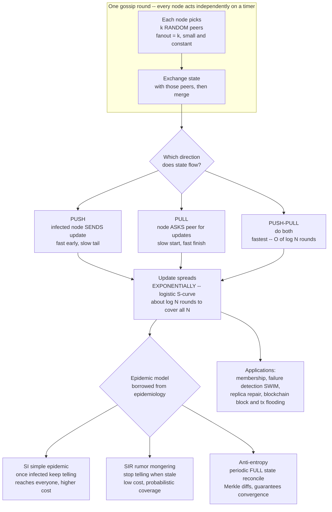

# 🦠 Gossip and Epidemic Protocols

> [!abstract] TL;DR
> A **gossip (epidemic) protocol** is a way for a large, dynamic cluster to disseminate information with **no coordinator and no fixed topology**: every node, on a fixed timer, picks a **few random peers** and exchanges state with them. Modeled directly on how rumors and viruses spread, an update **"infects"** the whole cluster **exponentially fast** — reaching all N nodes in about **log(N) rounds** — while doing only **constant work per node per round** and tolerating crashes, partitions, and message loss through **redundant random paths**. Introduced by *Demers et al.* (Xerox, 1987) for replicated-database maintenance, gossip is now the standard substrate for **cluster membership, failure detection, and anti-entropy repair** in Cassandra, DynamoDB, Consul/Serf, Riak, Redis Cluster, and blockchain P2P networks. The price is **eventual (not immediate) consistency** and some redundant messages — a trade almost always worth making at scale.

---

## Intuition

**Analogy — how a rumor takes over a school.** Nobody sends a memo. One student learns something juicy at 9 a.m. and whispers it to two friends. By 9:05 those two have each told two more, who tell two more, and within a handful of "rounds" the *entire* school knows — with no announcement, no organizer, and no master list of who has been told. If a few students are absent that day, it does not matter: the rumor still reaches everyone through the many overlapping paths, and the absentees pick it up the moment they walk back in. Crucially, the spread is **exponential** at first (each knower recruits new knowers) and the whole process finishes in a number of rounds proportional to the **logarithm** of the crowd size, not its size.

Epidemics of disease work identically, which is why the field borrows epidemiology's vocabulary wholesale: a node that does not yet have the update is **susceptible**, a node spreading it is **infected**, and a node that has stopped spreading it is **removed**. A gossip protocol is a *deliberate, engineered epidemic*: each machine periodically "coughs" its state onto a few random neighbors. That single, humble rule — **talk to random peers on a timer** — buys you dissemination that is simultaneously **fast, scalable, and astonishingly robust to failure**, which is exactly what you cannot get from a central broadcaster or a rigid spanning tree.

---

## How It Works

### The core mechanism: periodic exchange with random peers

Every node runs the same tiny loop, forever:

1. **Wait** one *gossip interval* (say, one second — the "round").
2. **Pick** `k` peers *uniformly at random* from the node's view of the membership. The number `k` is the **fanout**, and it is *small and constant* — often 1 to 3, regardless of whether the cluster has 10 nodes or 10,000.
3. **Exchange state** with each chosen peer according to the protocol's *style* (push, pull, or push-pull — below).
4. **Merge** whatever you learn into your local state.

That is the entire algorithm. Note what is *absent*: no leader, no coordinator, no fixed neighbor list, no global view, no acknowledgement of full delivery. Each node does **O(k) work per round** independent of N, so the *per-node* cost never grows — this constant-per-node budget is the root of gossip's scalability. Because peers are chosen *randomly and freshly each round*, the union of all messages forms a rapidly-shifting mesh of **redundant paths**; killing any node, dropping any message, or partitioning any link removes only one of exponentially many routes the information can take. That redundancy is *why* gossip is robust — failure just reroutes the epidemic.

### Why it is exponential and finishes in log(N) rounds

Watch the *infected fraction*. When only a small fraction `i` of the cluster is infected, almost every peer a spreader contacts is still susceptible, so the number of infected roughly **multiplies** each round — pure exponential growth, the steep left side of an **S-curve (logistic growth)**. As `i` climbs past one-half, spreaders increasingly waste contacts on already-infected peers, growth flattens, and the curve saturates at "everyone knows." Exponential growth to full coverage is, by definition, **logarithmic in time**: it takes about **log(N) rounds** to go from one infected node to all N. Randomized-rumor-spreading theory (Frieze–Grimmett; Karp et al.) sharpens this to **log₂(N) + ln(N) + O(1)** rounds for push-pull with fanout 1 — the demo reproduces exactly this shape.

### The three styles: push vs pull vs push-pull

The *direction* in which state flows during an exchange produces three variants with sharply different convergence profiles:

- **Push.** An *infected* node sends its update to `k` random peers. It is **fast early** — while few nodes know, every push likely lands on a fresh susceptible — but has a **slow tail**: once almost everyone is infected, a lone remaining susceptible is rarely the random target, so the last stragglers take many rounds. The susceptible fraction shrinks by only a constant factor `1/e` per round in the tail.
- **Pull.** A node *asks* a random peer "got anything new?" and copies whatever it learns. It has a **slow start** — when almost nobody is infected, asking a random peer usually turns up nothing — but a **blazing finish**: once most nodes are infected, a susceptible almost always finds an infected peer, so the susceptible fraction **squares each round** (`s → s²`, doubly-exponential collapse).
- **Push-pull.** Do *both* in the same exchange. You inherit push's fast start *and* pull's fast finish, giving the **best convergence — clean O(log N)** with the smallest constant. This is what real systems use.

### The epidemic models: SI, SIR, and anti-entropy

Demers et al. mapped three classic epidemiology models onto three engineering strategies with different cost/coverage trade-offs:

- **SI — Susceptible-Infected ("simple epidemic").** Once you know, you *keep telling forever*. Simple, and it *provably reaches everyone*, but every node gossips every update indefinitely — expensive at steady state.
- **SIR — Susceptible-Infected-Removed ("rumor mongering").** You tell others enthusiastically for a while, then — like a person who realizes the news is now stale — **stop** (become *removed*) once you notice many peers already know it. This slashes bandwidth but is now **probabilistic**: there is a small chance a few nodes never hear the "hot" rumor before everyone stops spreading it.
- **Anti-entropy.** Periodically, two nodes reconcile their **entire state** (or a compact digest of it), copying whatever the other is missing. It is more expensive but **guarantees eventual convergence** — it is the *safety net* that mops up anything rumor-mongering missed. To make full-state reconciliation cheap, systems compare **Merkle-tree** hashes to find *only the differences* instead of shipping everything. Real systems layer both: fast, cheap **rumor-mongering** to spread hot updates, plus slow, thorough **anti-entropy** to guarantee nothing is ever permanently lost.



### Membership and failure detection: the SWIM application

The single biggest use of gossip is keeping a large cluster's **membership list** current — who is alive, who joined, who left, who died — because that same information (a death notice, a join event) is just *another update to spread epidemically*. **SWIM** (*Scalable Weakly-consistent Infection-style Membership*, Das–Gupta–Motivala 2002) is the canonical design and separates two concerns that older protocols conflated:

- **Failure detection is done by randomized probing, not by all-to-all heartbeats.** Each period, a node directly **pings** *one* random member. If no ack arrives, it does not immediately declare death — it asks `k` other random members to **ping that node indirectly** on its behalf, which routes around a single bad link or a transient blip. Only if *all* those probes fail is the node marked **suspect**. This keeps detection cost **O(1) per node per period** instead of O(N).
- **Membership updates spread by infection.** Join, leave, and *suspect / confirm-dead* events are **piggybacked on the same probe/ack messages** and gossip outward epidemically, reaching the whole cluster in O(log N) time without a dedicated broadcast.

A crucial refinement is the **suspicion mechanism**: a node is first marked *suspect* (not dead) and that suspicion is gossiped; the accused node, on hearing it is suspected, **refutes** by broadcasting a higher-incarnation "I'm alive" — preventing a slow-but-live node from being wrongly evicted. **Lifeguard** (Consul's extensions) further reduces false positives by making timeouts *self-aware* of local scheduling delays. This machinery is the failure-detection layer's link to the broader theory of [[Failure_Detectors]] — SWIM is essentially a scalable, gossip-boosted eventually-perfect detector.

---

## Key Concepts

### Secondary (plain intuition)
- Gossip = **rumors in a school**: tell a few random people on a timer, and *everyone* knows within a handful of rounds, with no organizer.
- It is **exponential and fast**: the number who know roughly multiplies each round, so covering the whole cluster takes rounds proportional to *log of the size*, not the size.
- It is **robust**: if some machines are down or a message is lost, the news still gets through the many overlapping paths — and latecomers catch up next round.
- The cost: news is **eventually** everywhere, not *instantly*, and a few messages are redundant (you sometimes tell people who already knew).

### Undergraduate (mechanisms and models)
- **The loop:** every gossip interval, pick `k` random peers (**fanout**) and exchange state. Per-node work is **constant**, independent of N — the source of scalability.
- **Three styles:** **push** (fast start, slow tail), **pull** (slow start, fast finish, `s → s²`), **push-pull** (both — the practical O(log N) winner).
- **Epidemic models:** **SI** (spread forever, always reaches all, costly), **SIR / rumor-mongering** (stop when stale, cheap but probabilistic coverage), **anti-entropy** (periodic full-state reconcile — the guarantee).
- **Anti-entropy vs rumor-mongering:** anti-entropy is *reliable but heavy* (Dynamo/Cassandra repair, uses **Merkle trees** to find diffs efficiently); rumor-mongering is *cheap but best-effort*. Real systems **combine** them.
- **SWIM membership:** randomized ping + indirect ping for detection; **suspect → refute → confirm** to avoid evicting slow-but-live nodes; join/leave/death piggybacked and gossiped.

### Graduate (theory and tuning)
- **Randomized rumor spreading:** push-pull with fanout 1 completes in **log₂(N) + ln(N) + O(1)** rounds w.h.p. (Frieze–Grimmett; Karp–Schindelhauer–Shenker–Vöcking 2000). Message complexity for full coverage is **O(N log log N)** with the median-counter rumor-mongering rule — near-optimal.
- **Tuning knobs and their trade:** **fanout** `k` (higher = fewer rounds but more bandwidth and redundancy), **gossip interval** (shorter = lower latency, higher steady-state load), and **push/pull mode** (convergence speed vs message count). These trade **convergence latency against bandwidth**.
- **Guarantees:** **scalability** (constant per-node work), **robustness** (no single point of failure; partitions heal), **eventual convergence** with *very high probability* — but only *eventual*, not linearizable, consistency, and inherently some **redundant messages**. This is the weak end of the [[Consistency_Models_Spectrum]].
- **Epidemic replicated state:** gossip is how leaderless stores achieve **eventual consistency** — nodes anti-entropy their key-value state, using **vector-clock / version metadata** to detect and reconcile concurrent updates ([[Vector_Clocks_and_Causality]]).
- **Beyond uniform random:** *spatial* gossip, *hierarchical* gossip, and topology-aware peer selection reduce cross-datacenter traffic while preserving epidemic dynamics; SWIM's *round-robin* probe target (instead of pure random) bounds worst-case detection time.

---

## Python Demo

A pure-standard-library epidemic simulator plus `matplotlib` visualization. We spread **one** update through a cluster of N nodes from a single seed and watch it reach everyone in **O(log N) rounds** — the classic epidemic S-curve. Four experiments in one figure: (1) **push vs pull vs push-pull** convergence, (2) rounds-to-full growing like **log N** as N scales, (3) **robustness** under crashed nodes and message loss, and (4) the *same* mechanism reused as a **SWIM-style failure-detection broadcast** ("node X is dead" infects the cluster identically).

```python
"""
Gossip / epidemic dissemination simulator (pure stdlib) + matplotlib.

Spread ONE update through N nodes from a single infected seed and watch it
reach the whole cluster in ~log(N) rounds -- the epidemic S-curve. Compare
PUSH, PULL, PUSH-PULL; show O(log N) scaling; show ROBUSTNESS under node
failure + message loss; and reuse the identical mechanism as a SWIM-style
FAILURE-DETECTION broadcast ("node X crashed").
"""

import random
import math
import matplotlib.pyplot as plt

random.seed(7)


# --------------------------------------------------------------------------
# One synchronous gossip round.
#   infected : set of node ids that already hold the update
#   mode     : 'push' | 'pull' | 'pushpull'
#   k        : fanout (random peers each active node contacts this round)
#   loss     : probability that a single message is dropped
#   dead     : set of crashed node ids (never send or receive)
# --------------------------------------------------------------------------
def gossip_round(infected, N, mode, k=1, loss=0.0, dead=frozenset()):
    new = set(infected)
    if mode in ('push', 'pushpull'):                 # infected SEND to random peers
        for u in infected:
            if u in dead:
                continue
            for _ in range(k):
                v = random.randrange(N)
                if v not in dead and random.random() >= loss:
                    new.add(v)
    if mode in ('pull', 'pushpull'):                 # susceptibles ASK random peers
        for v in range(N):
            if v in infected or v in dead:
                continue
            for _ in range(k):
                u = random.randrange(N)
                if u in infected and u not in dead and random.random() >= loss:
                    new.add(v)
                    break
    return new


def run(N, mode, k=1, loss=0.0, dead=frozenset(), max_rounds=60):
    """Return the fraction of LIVE nodes infected after each round."""
    live = N - len(dead)
    start = 0
    while start in dead:                             # seed must be a live node
        start += 1
    infected = {start}
    frac = [len(infected) / live]
    for _ in range(max_rounds):
        infected = gossip_round(infected, N, mode, k, loss, dead)
        frac.append(len(infected - dead) / live)
        if len(infected - dead) >= live:            # all live nodes reached
            break
    return frac


def averaged(N, mode, trials=25, **kw):
    """Average the infection curve over random trials, padding to equal length."""
    curves = [run(N, mode, **kw) for _ in range(trials)]
    L = max(len(c) for c in curves)
    curves = [c + [c[-1]] * (L - len(c)) for c in curves]   # pad with final value
    return [sum(col) / trials for col in zip(*curves)]


def rounds_to_full(curve, thresh=0.999):
    for r, f in enumerate(curve):
        if f >= thresh:
            return r
    return len(curve) - 1


# -- Experiment 1: PUSH vs PULL vs PUSH-PULL ------------------------------
N = 2000
push = averaged(N, 'push')
pull = averaged(N, 'pull')
pp   = averaged(N, 'pushpull')
print("Rounds to reach 99.9%% coverage (N = %d):" % N)
print("  push      : %2d" % rounds_to_full(push))
print("  pull      : %2d" % rounds_to_full(pull))
print("  push-pull : %2d   (log2 N = %.1f)" % (rounds_to_full(pp), math.log2(N)))

# -- Experiment 2: convergence grows like O(log N) ------------------------
sizes = [64, 128, 256, 512, 1024, 2048, 4096, 8192]
conv  = [rounds_to_full(averaged(n, 'pushpull', trials=12)) for n in sizes]

# -- Experiment 3: ROBUSTNESS (25% dead + 30% message loss) ---------------
dead  = frozenset(random.sample(range(N), N // 4))
clean = averaged(N, 'pushpull')
harsh = averaged(N, 'pushpull', dead=dead, loss=0.30)

# -- Experiment 4: SWIM-style failure dissemination -----------------------
#    "node X crashed" is just another update -- identical epidemic dynamics.
swim = averaged(N, 'pushpull')


# -- Visualize ------------------------------------------------------------
fig, ax = plt.subplots(2, 2, figsize=(13, 9))

a = ax[0][0]
a.plot(push, 'o-', color="#d9534f", ms=3, label="push")
a.plot(pull, 's-', color="#0275d8", ms=3, label="pull")
a.plot(pp,   '^-', color="#2e7d32", ms=3, label="push-pull")
a.axhline(1.0, color="#999999", ls=":")
a.set_title("Epidemic S-curve  (N=%d, fanout=1)\npush: fast start  |  pull: fast finish  |  "
            "push-pull: best of both" % N, fontsize=9)
a.set_xlabel("gossip round"); a.set_ylabel("fraction infected"); a.legend(fontsize=8)

a = ax[0][1]
a.plot(sizes, conv, 'o-', color="#6f42c1", label="push-pull rounds to full")
a.plot(sizes, [1.7 * math.log2(n) for n in sizes], '--', color="#999999", label="c * log2 N")
a.set_xscale('log', base=2)
a.set_title("Convergence time grows as O(log N)", fontsize=9)
a.set_xlabel("cluster size N  (log2 scale)"); a.set_ylabel("rounds to full coverage")
a.legend(fontsize=8)

a = ax[1][0]
a.plot(clean, '^-', color="#2e7d32", ms=3, label="ideal: no failures")
a.plot(harsh, 'x-', color="#d9534f", ms=3, label="25% dead + 30% msg loss")
a.axhline(1.0, color="#999999", ls=":")
a.set_title("Robustness: gossip still covers ALL live nodes\ndespite crashes and dropped messages",
            fontsize=9)
a.set_xlabel("gossip round"); a.set_ylabel("fraction of LIVE nodes infected"); a.legend(fontsize=8)

a = ax[1][1]
a.plot(swim, 'o-', color="#e67e22", ms=3, label='"node X is dead" notice')
a.axhline(1.0, color="#999999", ls=":")
a.set_title("SWIM-style failure detection:\na death notice infects the cluster the same way",
            fontsize=9)
a.set_xlabel("gossip round"); a.set_ylabel("fraction that knows X died"); a.legend(fontsize=8)

fig.suptitle("Gossip / Epidemic Protocols: exponential, robust, O(log N) dissemination",
             fontsize=13, fontweight="bold")
fig.tight_layout(rect=[0, 0, 1, 0.96])
fig.savefig("gossip_epidemic.png", dpi=120)
print("\nSaved figure -> gossip_epidemic.png")
plt.show()
```

**What the run shows.** The console prints something like `push: 20, pull: 22, push-pull: 14` for N = 2000, next to `log2 N = 11.0` — push-pull is closest to the theoretical floor. In the top-left panel you *see* the three signatures: **push (red)** rockets up early then crawls to the last few nodes; **pull (blue)** dawdles at the start then snaps shut; **push-pull (green)** dominates both, tracing the cleanest S-curve. The top-right panel plots rounds-to-full against N on a log₂ x-axis and it lands on a **straight line hugging `c·log₂N`** — visual proof of **O(log N)** convergence: an 8192-node cluster converges in only a few more rounds than a 64-node one. The bottom-left panel is the punchline for reliability: even with **a quarter of the nodes dead and 30 % of messages dropped**, the harsh curve still climbs to **100 % of the live nodes** — barely slower than ideal, because the epidemic simply reroutes around the damage. The bottom-right panel makes the SWIM point concrete: a **failure notice spreads with the identical epidemic curve**, which is exactly why gossip is the natural substrate for membership and failure detection, not just data.

---

## Real-World Applications

Gossip is not a niche trick — it is the **membership and metadata backbone of the systems you run every day**:

- **Apache Cassandra** builds its entire cluster coordination on gossip: nodes gossip **membership, token-ranges, and heartbeat state** every second, run a **phi-accrual failure detector** on the gossiped heartbeats, and use **anti-entropy repair with Merkle trees** to reconcile replica divergence. The whole ring stays coherent with no master ([[Cassandra]]).
- **Amazon Dynamo / DynamoDB** use a gossip-based protocol so each node eventually learns the **partition assignment and liveness** of every other node, plus anti-entropy (Merkle trees) to repair replicas after failures — the design that popularized production gossip.
- **HashiCorp Serf and Consul** implement **SWIM (with Lifeguard extensions)** directly (the `memberlist` library) for scalable membership, failure detection, and event broadcast across thousands of agents and across WAN datacenters.
- **Riak** uses gossip to propagate ring/claim state and anti-entropy (active anti-entropy with hash trees) for replica repair — a faithful Dynamo descendant.
- **Redis Cluster** runs a dedicated **gossip bus** (the cluster port) over which nodes exchange **membership, slot ownership, and PFAIL/FAIL failure flags** — the mechanism by which a master failure is agreed upon and a replica promoted.
- **Blockchain P2P networks (Bitcoin, Ethereum)** flood **new transactions and blocks** to random peers — a gossip epidemic by another name — so a newly-mined block reaches the whole network in seconds without any central relay ([[P2P_Network_Architecture]]).
- **Monitoring and service meshes** (e.g., gossip-based metric/membership layers) and large **Kubernetes**-adjacent tooling reuse the same infection-style dissemination for scalable, coordinator-free state sharing.

---

## Common Pitfalls

- **Expecting immediate consistency.** Gossip guarantees *eventual* convergence, typically in O(log N) rounds — not instant, cluster-wide agreement. Building a feature that needs "every node sees this change *now*" on top of raw gossip (e.g., a distributed lock) is a category error; use consensus ([[Reliable_and_Ordered_Broadcast]], Raft/Paxos) for that, and reserve gossip for **soft state and membership**.
- **Fanout / interval mistuning that floods the network.** Cranking the fanout or shortening the interval to "converge faster" multiplies steady-state bandwidth for a *marginal* latency gain (convergence is already only log N). Conversely, too-small a fanout risks a disconnected epidemic. Tune against measured convergence, not intuition.
- **Rumor-mongering that drops updates.** Pure SIR (stop spreading when stale) is *probabilistic* — a few unlucky nodes may never hear a hot update. Without a periodic **anti-entropy** safety net, rare updates can be **permanently lost**. Always pair rumor-mongering with full-state reconciliation.
- **Anti-entropy without Merkle trees.** Reconciling *entire* datasets between replicas each cycle is crippling at scale. Compare **Merkle-tree digests** to transfer only the differing ranges; skipping this is why naive "repair" jobs saturate the network ([[Hash_Functions_and_Merkle_Trees]]).
- **Evicting slow-but-live nodes (false positives).** A node under GC pause or transient network stall looks dead. A membership protocol that jumps straight to "dead" causes flapping and needless data movement. SWIM's **suspect → refute → confirm** cycle exists precisely to give a lagging node a chance to prove it is alive — do not skip it.
- **Assuming symmetric, transitive reachability.** `p` reaching `q` does not mean `q` reaches `p`, and gray/partial partitions produce **inconsistent membership views**. SWIM's *indirect probing* (asking third parties to ping the suspect) is the standard defense; a naive direct-ping-only detector wedges on asymmetric failures.
- **Correlated failures defeat the independence assumption.** Gossip's robustness math assumes failures are roughly independent. A rack, AZ, or datacenter outage removes a *correlated block* of peers at once; topology-aware peer selection is needed so the epidemic still bridges failure domains.

---

## Related Concepts

Verified in-vault links:

- [[Distributed_Systems_Overview]] — the no-global-clock, partial-failure, unreliable-network setting that makes coordinator-free epidemic dissemination so attractive.
- [[Failure_Detectors]] — SWIM is a scalable, gossip-boosted eventually-perfect failure detector; gossip is how weak-completeness suspicions get amplified to the whole cluster.
- [[Consistency_Models_Spectrum]] — gossip lives at the weak end (eventual consistency); anti-entropy is the mechanism that delivers "converge if writes stop."
- [[Vector_Clocks_and_Causality]] — the version metadata anti-entropy uses to detect concurrent updates and decide what to reconcile during replica repair.
- [[Replication_Models]] — leaderless / multi-leader replication is the setting where gossip-based anti-entropy repair does its work.
- [[Reliable_and_Ordered_Broadcast]] — the *strong* alternative: when you need guaranteed, ordered delivery instead of probabilistic epidemic spread.
- [[Consistent_Hashing]] — pairs with gossip in Dynamo-style systems: consistent hashing decides *where* keys live, gossip keeps every node's view of that ring current.
- [[Cassandra]] — the flagship production user: gossip for membership + phi-accrual detection + Merkle-tree anti-entropy repair, all with no master.
- [[P2P_Network_Architecture]] — blockchain transaction/block flooding is gossip by another name; robust dissemination with no central relay.
- [[Hash_Functions_and_Merkle_Trees]] — the digest structure that makes anti-entropy full-state reconciliation cheap by pinpointing only the differences.
- [[Consensus_Mechanisms]] — the contrast class: Nakamoto/BFT consensus adds *agreement* on top of the gossip dissemination layer blockchains rely on.
- [[Service_Discovery]] — gossip-based membership (Serf/Consul) is one of the two main ways services find each other in a dynamic cluster.

Planned siblings in this `Distributed_Systems_Theory` vault (referenced in prose, not yet created): `Eventual_Consistency_and_Anti_Entropy` (the convergence mechanism gossip powers), `Distributed_Hash_Tables` (structured peer overlays vs unstructured gossip), `Blockchain_and_Nakamoto_Consensus` (P2P gossip flooding under consensus), `CAP_Theorem_and_PACELC`, and `CRDTs` (mergeable state that makes gossip conflict-free).

---

## Review Questions

**Secondary (understanding).** Using the rumor-in-a-school analogy, explain why a rumor reaches an entire 2000-student school in only *a dozen or so* rounds rather than 2000, and why a handful of absent students on rumor day does not stop it from eventually reaching everyone. Which real gossip property does each half of your answer illustrate?

**Undergraduate (application).** In the Python demo, **push** converges fast early but has a slow tail, while **pull** is slow early but finishes fast. Explain the mechanism behind *each* half of that behavior (what fraction of contacts are "wasted" in the tail of push, and why the susceptible fraction *squares* each round in the finish of pull), and argue why **push-pull** therefore converges in clean O(log N) time. Then describe what the bottom-left robustness panel demonstrates and *why* gossip survives a quarter of the cluster dying.

**Graduate (analysis / trade-offs).** (a) Distinguish **rumor-mongering (SIR)** from **anti-entropy**, and explain why a production store such as Cassandra runs *both* rather than choosing one. (b) SWIM detects failures with randomized direct + indirect probing instead of all-to-all heartbeats, and marks a node **suspect** before **dead**. Explain the scalability reason for the first choice and the correctness reason for the second, and connect SWIM to the completeness/accuracy framing of [[Failure_Detectors]]. (c) You must disseminate a value that *every* node must agree on in a single, total order (e.g., a leader identity). Explain precisely why gossip is the *wrong* tool here and what class of protocol you must use instead.

---

## Sources

- Demers, A., Greene, D., Hauser, C., Irish, W., Larson, J., Shenker, S., Sturgis, H., Swinehart, D., & Terry, D. (1987). *Epidemic Algorithms for Replicated Database Maintenance.* PODC '87 (Xerox PARC / Clearinghouse). https://dl.acm.org/doi/10.1145/41840.41841
- Das, A., Gupta, I., & Motivala, A. (2002). *SWIM: Scalable Weakly-consistent Infection-style Process Group Membership Protocol.* IEEE DSN. https://www.cs.cornell.edu/projects/Quicksilver/public_pdfs/SWIM.pdf
- van Renesse, R., Minsky, Y., & Hayden, M. (1998). *A Gossip-Style Failure Detection Service.* Middleware '98. https://www.cs.cornell.edu/home/rvr/papers/GossipFD.pdf
- Karp, R., Schindelhauer, C., Shenker, S., & Vöcking, B. (2000). *Randomized Rumor Spreading.* IEEE FOCS. https://ieeexplore.ieee.org/document/892324
- DeCandia, G. et al. (2007). *Dynamo: Amazon's Highly Available Key-value Store.* SOSP '07. https://www.allthingsdistributed.com/files/amazon-dynamo-sosp2007.pdf
- Lakshman, A., & Malik, P. (2010). *Cassandra: A Decentralized Structured Storage System.* ACM SIGOPS OSR. https://www.cs.cornell.edu/projects/ladis2009/papers/lakshman-ladis2009.pdf

---

#distributed-systems #gossip #epidemic-protocols #swim #anti-entropy
