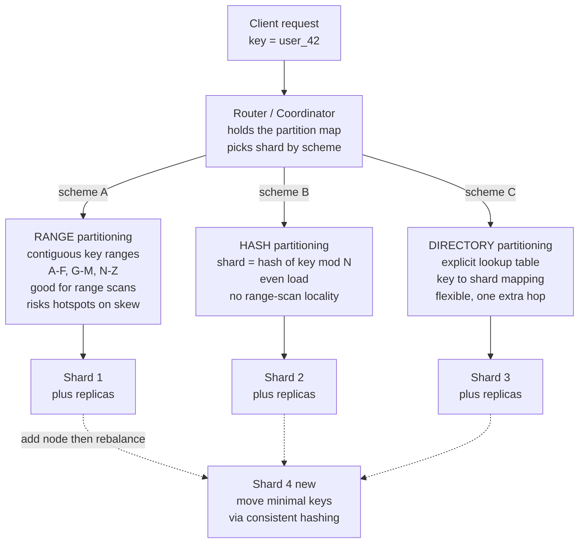

# 🧩 Partitioning and Sharding

> [!abstract] TL;DR
> **Partitioning** (a.k.a. **sharding**) splits a dataset into subsets — **partitions** — each held by a different node, so storage *and* throughput scale horizontally past what one machine can hold or serve. The scheme you choose is everything: **range** partitioning keeps keys ordered (great for scans) but concentrates skewed or sequential traffic onto a single **hotspot**; **hash** partitioning spreads load evenly but destroys range-scan locality and, in its naive `hash(key) mod N` form, **remaps almost every key** the moment you add a node. Partitioning is combined with **replication** (each partition is also copied for fault tolerance), and the choice of **partition key** — plus how you handle secondary indexes, rebalancing, request routing, and cross-partition queries — decides whether your system scales gracefully or drowns in hotspots and reshard pain.

---

## Intuition

**Analogy:** One library branch can't hold every book in the city, so you split the collection across many branches. But *how* you split matters enormously. Split **by first letter of the title** (A–F here, G–M there) and browsing "all titles starting with 'The'" is easy — but every branch that isn't holding the currently-trending titles sits half-empty while one overflows. Split **by a hash of the ISBN** and every branch fills evenly — but now "give me all books in this series" means driving to *every* branch, because consecutive volumes were scattered at random. And if you open a *new* branch, a bad splitting rule forces you to re-file **almost the entire city's collection** overnight.

Partitioning is the art of dividing data so that (1) each node holds a **fair share** (no overflowing branch = no hotspot), (2) the **common queries stay cheap** (related data lands together), and (3) **adding a node moves as few books as possible**. Get the split right and you scale forever; get it wrong and you get hotspots, scatter-gather queries, and catastrophic reshuffles.

---

## How It Works

### Why partition at all

A single node has a hard ceiling on disk, RAM, CPU, and network throughput. Once your dataset or request rate exceeds one machine, you must **scale out**. Partitioning is the mechanism: divide the keyspace into partitions, place each on a different node, and now `total capacity ≈ per-node capacity × node count` for *both* storage and throughput.

Partitioning is **distinct from — but almost always combined with — replication**. Replication makes *copies* of the same data for fault tolerance and read scaling; partitioning makes *different* data live on different nodes for capacity. Real systems do **both**: partition the dataset, then replicate *each partition* across a few nodes (see [[Replication_Strategies]]). A typical cluster is a grid of `partitions × replicas`.

### The goal: even load, cheap queries

The whole game is to spread **data and request load evenly** — avoiding **skew** and **hotspots** — while keeping the queries you actually run efficient. The lever that controls this is the **partition key** (a.k.a. shard key). A well-chosen key is the crux of the entire design; a poorly chosen one (low cardinality, monotonic, or correlated with a "celebrity") guarantees a hotspot no rebalancing can fix.

### Scheme 1 — Range partitioning

Assign **contiguous key ranges** to partitions: `A–F` on shard 1, `G–M` on shard 2, and so on. Boundaries are chosen (statically or dynamically) to balance size.

- **Pro:** keys stay **ordered**, so **range scans** and ordered iteration (`WHERE ts BETWEEN ...`, "next 100 rows") hit only one or a few adjacent partitions.
- **Con — the hotspot trap:** when access is skewed, one range gets hammered. The classic case is **sequential / timestamp keys**: if the key is "now", *every* new write lands in the single newest range — a write hotspot that pins one node while the rest idle. "Celebrity" keys (one user with millions of followers) do the same. The remedy is **re-splitting** hot ranges into smaller pieces and moving them.
- **Used by:** HBase, Bigtable, CockroachDB, MongoDB (ranged sharding).

### Scheme 2 — Hash partitioning

Route each key by a **hash of the key**: `shard = hash(key) mod N`. A good hash scatters even sequential or skewed keys uniformly.

- **Pro:** **even load** — the timestamp and celebrity hotspots vanish because adjacent/hot keys land on unrelated shards.
- **Con:** it **destroys range-scan locality** — consecutive keys are scattered, so a range query becomes a **scatter-gather** across all shards. And naive `mod N` has a fatal rebalancing flaw (below).
- **Used by:** Cassandra, DynamoDB, Riak, and most sharded caches.

### The resharding problem (why `mod N` is a trap)

Under `hash(key) mod N`, changing `N` (adding or removing a node) changes the modulus, so the shard for **nearly every key** changes at once — a data-movement storm that can saturate the network and stall the cluster. Growing from `N` to `N + 1` moves roughly `N / (N + 1)` of *all* keys (≈ 80% at N=4). The fixes minimize movement:

- **[[Consistent_Hashing]]** — map keys and nodes onto a ring; adding a node only steals keys from its ring neighbors, moving ≈ `1 / (N + 1)` of keys.
- **Fixed number of partitions** (hash-range) — create *many* partitions up front (say 256), far more than nodes, and assign whole partitions to nodes; adding a node just **reassigns some partitions**, never re-hashes keys.

### Compound keys and hotspot mitigation

Real systems combine even distribution *with* local ordering using **compound keys**: hash only **part** of the key. DynamoDB's `(partition key, sort key)` hashes the partition key (even spread across nodes) but keeps items with the same partition key **sorted** by the sort key on one node — so `user_id + timestamp` gives you a hot-free spread *and* efficient "latest N events for this user" scans. To tame a known write hotspot, add a **random prefix/suffix** (or a small bucket number) to the key so one logical hot key spreads across several physical partitions — at the cost of having to scatter-read it back.

### Secondary indexes — the hard problem

A **secondary index** (query by a non-partition-key attribute, e.g. "all orders with status = shipped") rarely aligns with the partition key. Two designs, with opposite cost profiles:

- **Local / document-partitioned index:** each partition indexes only its *own* documents. **Writes are cheap** (one local update) but **reads scatter-gather** across every partition and merge. Used by Cassandra secondary indexes, Elasticsearch, MongoDB.
- **Global / term-partitioned index:** the index itself is partitioned **by the indexed term**. **Reads are targeted** (go straight to the term's partition) but **writes are expensive and cross-partition** (one document touches multiple remote index partitions), which flirts with [[Distributed_Transactions_in_Databases|distributed transactions]]. Used by DynamoDB global secondary indexes.

### Rebalancing

When nodes are added or removed, partitions must **move** to re-balance. Strategies:

- **Fixed number of partitions** (`>>` nodes) — move whole partitions between nodes; simple and predictable. Riak, Elasticsearch, Couchbase.
- **Dynamic partitioning** — split a partition when it grows too big, merge when it shrinks. HBase, RethinkDB, MongoDB.
- **Proportional to nodes** — a fixed number of partitions *per node*; splitting happens when nodes join. Cassandra.

Good rebalancing moves the **minimum** data and avoids cascading load (don't rebalance *onto* a node that then tips over). It can be **automatic** or **operator-triggered** — full automation risks a feedback loop where a flaky node is wrongly declared dead, triggering a rebalance that overloads everyone.

### Request routing

Clients must find *which* node holds a key — a **service-discovery** problem for shards. Three patterns: (1) a **routing tier / coordinator** that any node can forward through, (2) a **partition-aware client** that holds the partition map, or (3) a separate **routing service** backed by a consensus store (ZooKeeper/etcd) that tracks the authoritative map. Keeping every client's view of the map consistent as partitions move is itself a [[Consensus_and_Quorums|consensus]]/[[Leader_Election|coordination]] problem.

### Cross-partition operations

Queries or transactions spanning partitions are **expensive** — scatter-gather reads, or a distributed commit ([[Distributed_Transactions_in_Databases]]). The design principle is **keep related data co-located** in the same partition (via a well-chosen compound key) so common operations stay single-partition. "Avoid cross-shard transactions" is a recurring rule because they add latency, coupling, and a distributed-failure surface.



---

## Key Concepts

### Secondary (plain-language)
- One machine can't hold or serve everything, so you **split the data across many machines** — that split is partitioning (sharding).
- **Range** splitting keeps similar keys together (easy to grab a range) but can leave one machine **overloaded** while others idle (a hotspot).
- **Hash** splitting spreads everything **evenly** but scatters neighbors, so "give me a range" now means asking every machine.
- Adding a machine should move **as few items as possible** — a bad rule reshuffles almost everything.

### Undergraduate (CS background)
- **Partition key / shard key** determines placement; low cardinality or monotonic keys cause skew.
- **Range vs hash vs directory** schemes, and the read/write trade-offs of **local vs global secondary indexes** (scatter-gather reads vs cross-partition writes).
- **`hash(key) mod N` resharding** moves ≈ `N / (N + 1)` of keys on adding a node; **consistent hashing** and **fixed partitions** cut that to the minimum.
- **Partitioning is orthogonal to replication** — you do both; each partition is replicated.

### Graduate (system-level)
- **Compound keys** (`partition key` + `sort key`) reconcile even distribution with intra-partition ordering; **salting** hot keys trades read cost for write spread.
- **Rebalancing policy** (fixed count vs dynamic split/merge vs proportional-to-nodes) interacts with **failure detection** — over-eager automation causes rebalance storms and cascading overload.
- **Request routing** is a coordination problem: the partition map is replicated state that must stay consistent under movement, typically via a consensus-backed directory ([[Consensus_and_Quorums]], [[Leader_Election]]).
- **Cross-partition transactions** force the choice between co-locating data (schema design) and paying for atomic commit / scatter-gather at scale.

---

## Python Demo

A pure-stdlib simulation comparing **range** and **hash** partitioning on a **skewed, sequential (timestamp-like)** key workload, visualized with matplotlib. It measures four things: (1) storage balance, (2) the **hotspot** that recency-skewed access creates under range partitioning, (3) how many shards a **range scan** must touch under each scheme, and (4) the **resharding churn** — the fraction of keys that move when adding a node — showing `hash(key) mod N` remaps almost everything while consistent hashing would move the minimum.

```python
"""
Partitioning schemes on a SKEWED, sequential (timestamp-like) key workload:
RANGE vs HASH.

Shows:
  1. Storage balance   -> keys per shard (both even on COUNT).
  2. HOTSPOT           -> request load per shard under recency skew:
                          RANGE piles recent/sequential keys on ONE shard;
                          HASH spreads load evenly.
  3. Range-scan cost   -> shards a contiguous query [lo,hi) must touch:
                          RANGE touches a few (locality); HASH touches ALL
                          (scatter-gather) -- hashing destroys locality.
  4. Resharding churn  -> fraction of ALL keys that MOVE when adding a node:
                          hash(key) mod N remaps ~N/(N+1) of keys (a movement
                          storm) vs the ~1/(N+1) minimum consistent hashing hits.

Pure stdlib + matplotlib. No numpy required.
"""

import hashlib
import math
import matplotlib.pyplot as plt

# ------------------------------------------------------------------ workload
N_KEYS   = 20_000
N_SHARDS = 4
KEYSPACE = N_KEYS                    # keys 0..N_KEYS-1 are sequential/timestamp-like
keys     = list(range(N_KEYS))

# Recency skew: the newest (highest) keys are far hotter -- the classic
# time-series "latest data is hot" pattern. Load decays exponentially into
# the past, so essentially all traffic hits the most recent keys.
def weight(k):
    return math.exp((k - (N_KEYS - 1)) / 800.0)

weights  = [weight(k) for k in keys]
total_wt = sum(weights)

# ---------------------------------------------------------- partition schemes
def range_shard(key, n, span=KEYSPACE):
    """Contiguous equal ranges [0,w) [w,2w) ... -> preserves key order."""
    w = span / n
    return min(int(key // w), n - 1)

def _h(key):
    return int(hashlib.md5(str(key).encode()).hexdigest(), 16)

def hash_shard(key, n):
    """hash(key) mod n -> spreads keys evenly, destroys ordering."""
    return _h(key) % n

# ----------------------------------------------- (1)+(2) balance and hotspot
def loads(shard_fn, n):
    counts = [0] * n                 # keys per shard   (storage balance)
    load   = [0.0] * n               # request load per shard (weighted)
    for k, wt in zip(keys, weights):
        s = shard_fn(k, n)
        counts[s] += 1
        load[s]   += wt
    return counts, load

range_counts, range_load = loads(range_shard, N_SHARDS)
hash_counts,  hash_load  = loads(hash_shard,  N_SHARDS)

def imbalance(load):
    mean = sum(load) / len(load)
    return max(load) / mean          # 1.0 = perfectly even; higher = hotspot

print(f"Workload: {N_KEYS} sequential recency-skewed keys, {N_SHARDS} shards\n")
print("Request-load imbalance (max/mean, 1.0 = perfect):")
print(f"  RANGE : {imbalance(range_load):4.2f}x   <- HOTSPOT on the newest shard")
print(f"  HASH  : {imbalance(hash_load):4.2f}x   <- load spread evenly")

# --------------------------------------------------- (3) range-scan locality
LO, HI = 9_000, 9_500                # a contiguous range query
range_hit = {range_shard(k, N_SHARDS) for k in range(LO, HI)}
hash_hit  = {hash_shard(k,  N_SHARDS) for k in range(LO, HI)}
print(f"\nRange scan over keys [{LO},{HI}) touches:")
print(f"  RANGE : {len(range_hit)} shard(s) {sorted(range_hit)}  (locality)")
print(f"  HASH  : {len(hash_hit)} shard(s) -> scatter-gather across all")

# ------------------------------------------------------- (4) resharding churn
def churn(shard_fn, n_old, n_new):
    moved = sum(1 for k in keys if shard_fn(k, n_old) != shard_fn(k, n_new))
    return moved / len(keys)

ns          = list(range(2, 9))      # grow cluster, adding one node at a time
hash_churn  = [churn(hash_shard,  n, n + 1) for n in ns]
range_churn = [churn(range_shard, n, n + 1) for n in ns]
ideal_churn = [1.0 / (n + 1) for n in ns]     # consistent-hashing minimum

print("\nFraction of ALL keys that MOVE when adding one node:")
for n, hc, ic in zip(ns, hash_churn, ideal_churn):
    print(f"  {n}->{n+1} shards : hash-mod-N {hc:4.0%}   ideal(consistent) {ic:4.0%}")

# ================================================================ visualize
fig, ax = plt.subplots(2, 2, figsize=(13, 9))
sx = range(N_SHARDS)

# (1) storage balance -- keys per shard
ax[0, 0].bar([i - 0.2 for i in sx], range_counts, width=0.4,
             label="range", color="#2980b9")
ax[0, 0].bar([i + 0.2 for i in sx], hash_counts, width=0.4,
             label="hash", color="#e67e22")
ax[0, 0].set_title("(1) Storage balance: keys per shard\nboth even on COUNT")
ax[0, 0].set_xlabel("shard"); ax[0, 0].set_ylabel("keys stored")
ax[0, 0].set_xticks(list(sx)); ax[0, 0].legend()

# (2) request load per shard -- the hotspot
rl = [x / total_wt for x in range_load]
hl = [x / total_wt for x in hash_load]
ax[0, 1].bar([i - 0.2 for i in sx], rl, width=0.4, label="range", color="#2980b9")
ax[0, 1].bar([i + 0.2 for i in sx], hl, width=0.4, label="hash", color="#e67e22")
ax[0, 1].set_title("(2) Request load under recency skew\nRANGE = HOTSPOT, HASH = even")
ax[0, 1].set_xlabel("shard"); ax[0, 1].set_ylabel("fraction of total load")
ax[0, 1].set_xticks(list(sx)); ax[0, 1].legend()
ax[0, 1].annotate("hotspot", xy=(N_SHARDS - 1 - 0.2, max(rl)),
                  xytext=(N_SHARDS - 2.4, max(rl) * 0.82),
                  arrowprops=dict(arrowstyle="->", color="#c0392b"),
                  color="#c0392b", fontweight="bold")

# (3) range-scan locality -- shards touched
ax[1, 0].bar(["range", "hash"], [len(range_hit), len(hash_hit)],
             color=["#2980b9", "#e67e22"])
ax[1, 0].set_title(f"(3) Range scan [{LO},{HI}): shards touched\n"
                   "HASH must scatter-gather ALL shards")
ax[1, 0].set_ylabel("shards contacted")
ax[1, 0].set_ylim(0, N_SHARDS + 0.5)

# (4) resharding churn vs ideal
ax[1, 1].plot(ns, [c * 100 for c in hash_churn], "o-", color="#c0392b",
              label="hash(key) mod N")
ax[1, 1].plot(ns, [c * 100 for c in range_churn], "s--", color="#2980b9",
              label="range (equal resplit)")
ax[1, 1].plot(ns, [c * 100 for c in ideal_churn], "^:", color="#2e8b57",
              label="ideal = consistent hashing")
ax[1, 1].set_title("(4) Resharding churn: keys moved on adding a node\n"
                   "hash-mod-N moves ALMOST EVERYTHING")
ax[1, 1].set_xlabel("cluster size before adding a node (N -> N+1)")
ax[1, 1].set_ylabel("percent of keys moved")
ax[1, 1].set_ylim(0, 100); ax[1, 1].legend()

plt.tight_layout()
plt.savefig("partitioning_schemes.png", dpi=110)
plt.show()
print("\nSaved figure -> partitioning_schemes.png")
```

**What it prints (approximately):**

```
Workload: 20000 sequential recency-skewed keys, 4 shards

Request-load imbalance (max/mean, 1.0 = perfect):
  RANGE : 4.00x   <- HOTSPOT on the newest shard
  HASH  : 1.01x   <- load spread evenly

Range scan over keys [9000,9500) touches:
  RANGE : 1 shard(s) [1]  (locality)
  HASH  : 4 shard(s) -> scatter-gather across all

Fraction of ALL keys that MOVE when adding one node:
  2->3 shards : hash-mod-N  67%   ideal(consistent)  33%
  3->4 shards : hash-mod-N  75%   ideal(consistent)  25%
  4->5 shards : hash-mod-N  80%   ideal(consistent)  20%
  ...
```

**Takeaways:** range and hash both balance *storage* (equal key counts), but under recency-skewed access **range pins ~all load on the newest shard** (a 4× hotspot with 4 shards — the worst case) while hash stays flat. Yet a contiguous **range scan** touches **one** shard under range partitioning and **all four** under hash (scatter-gather). And `hash(key) mod N` **moves ~80% of keys** just to add one node — the resharding storm that motivates [[Consistent_Hashing]] and fixed-partition schemes, which move only the minimal ~`1/(N+1)`.

---

## Real-World Applications

- **Cassandra / DynamoDB** — hash (token-ring) partitioning on the partition key for even load; DynamoDB's `(partition key, sort key)` compound key co-locates and orders a user's items on one partition while spreading users across nodes.
- **HBase / Bigtable / CockroachDB** — range partitioning for ordered scans; they auto-split hot ranges to fight the timestamp/celebrity hotspot. See [[Cassandra]] and [[MongoDB]] for concrete shard-key guidance.
- **MongoDB** — supports both **ranged** and **hashed** shard keys; the docs explicitly warn that a monotonically increasing shard key creates a single hot shard, and recommend hashed keys or compound keys to spread writes.
- **Vitess (sharded MySQL) & Citus (sharded Postgres)** — add a routing/coordinator tier over many database shards; schema design co-locates related rows (same shard) to avoid cross-shard transactions.
- **Apache Kafka** — a topic is split into **partitions**; the producer's partitioner (hash of the message key, by default) decides the partition, giving parallel throughput while preserving per-key ordering *within* a partition. See [[Kafka]].
- **Elasticsearch** — indexes are sharded (document-partitioned local indexes); searches scatter-gather across shards and merge — the classic local-index read cost.
- **Sharded caches (Memcached/Redis clusters)** — historically `hash(key) mod N`, which broke badly on node changes and drove the industry to [[Consistent_Hashing]].

---

## Common Pitfalls

- **Monotonic / timestamp partition key** — sequential keys funnel every new write into the single newest range: an instant write hotspot. Use a hashed or compound key, or bucket the timestamp, so writes spread.
- **`hash(key) mod N` for placement** — looks fine until you add or lose a node, then it remaps ~`N/(N+1)` of all keys in one storm. Use consistent hashing or a fixed number of partitions instead.
- **Low-cardinality or celebrity keys** — partitioning by `country` or `status`, or a key dominated by one whale user, defeats even hashing (one value = one partition). Salt hot keys or pick a higher-cardinality key.
- **Choosing hash when you need range scans** — hashing scatters neighbors, turning ordered queries into scatter-gather across every shard. If ordered access dominates, range-partition and manage hotspots instead.
- **Ignoring the secondary-index cost** — local indexes make reads scatter-gather; global indexes make writes cross-partition. Pick the profile that matches your read/write ratio; don't discover it in production.
- **Cross-shard transactions everywhere** — a schema that scatters related rows forces distributed commits and scatter-gather joins. Co-locate related data in one partition via a shared partition key.
- **Rebalancing storms** — fully automatic rebalancing plus a flaky failure detector can declare a slow node dead and trigger a move that overloads the survivors. Rate-limit rebalancing and prefer moving whole fixed partitions.

---

## Related Concepts

- [[Consistent_Hashing]] — the fix for `hash(key) mod N` resharding: adding/removing a node moves only a node's ring-neighbor keys, minimizing churn.
- [[Replication_Strategies]] — the orthogonal axis: you partition *and* replicate each partition; leader/follower, multi-leader, and leaderless replication all layer on top of partitioning.
- [[Distributed_Transactions_in_Databases]] — what cross-partition writes and global secondary-index updates escalate into; the reason to keep operations single-partition.
- [[Consensus_and_Quorums]] — the routing/partition map and replica set membership are consensus-backed state; quorum overlap underlies each partition's consistency.
- [[Leader_Election]] — each partition (or replica group) typically has an elected leader that owns writes; routing must track the current leader.
- [[Distributed_Systems_Overview]] — where partitioning sits in the map of distributed data, and the "no global state / partial failure" facts that make routing and rebalancing hard.
- [[Consistency_Models]] — the guarantee spectrum each partition's replicas provide; partitioning does not by itself give cross-partition consistency.
- [[Database_Sharding]] — the System Design / engineering treatment of the same idea (sharding strategies, joins across shards, resharding operations).
- [[CAP_Theorem]] — a partition of the *network* forces the C-vs-A choice per replica group; distinct from, but often conflated with, data partitioning.
- [[Horizontal_Scaling]] — scaling out is the motivation; partitioning is how storage and throughput actually scale horizontally.

> Distributed Systems Theory siblings referenced in prose and to be wikilinked once written: *Replication Models*, *Distributed Transactions* (DST-native), *Distributed Hash Tables*, and *Quorum Systems*. A companion note with the same concept exists in the Database vault (`Database/06_Distributed_Databases/Partitioning_and_Sharding.md`) covering the DBMS-engineering angle.

---

## Review Questions

1. **(Secondary)** Using the library analogy, explain why splitting books "by first letter of the title" can leave one branch overflowing while others sit empty, and why splitting "by a hash of the ISBN" fixes that but makes "give me the whole series" harder. Which everyday query does each split make cheap or expensive?
2. **(Undergraduate)** You store an append-heavy event log keyed by timestamp across 4 shards. Under **range** partitioning, which shard gets all the write traffic and why? Rewrite the partition key so writes spread evenly *and* you can still efficiently fetch "the latest 100 events for user X." What did you trade away?
3. **(Graduate)** A cache uses `hash(key) mod N` across N nodes. Estimate the fraction of keys that must move when you grow from 8 to 9 nodes, and explain why. Then contrast three remedies — consistent hashing, a fixed large number of partitions, and dynamic range splitting — on (a) keys moved per node change, (b) support for range scans, and (c) operational complexity. When would you still choose range partitioning despite its hotspot risk?

---

## Sources

- Kleppmann, M. *Designing Data-Intensive Applications*, Ch. 6 "Partitioning." O'Reilly, 2017. [dataintensive.net](https://dataintensive.net/)
- DeCandia, G. et al. "Dynamo: Amazon's Highly Available Key-value Store." *SOSP*, 2007. (Consistent hashing + partitioning in production.) [PDF](https://www.allthingsdistributed.com/files/amazon-dynamo-sosp2007.pdf)
- Chang, F. et al. "Bigtable: A Distributed Storage System for Structured Data." *OSDI*, 2006. (Range partitioning via tablets.) [PDF](https://research.google.com/archive/bigtable-osdi06.pdf)
- Karger, D. et al. "Consistent Hashing and Random Trees." *STOC*, 1997. (The minimal-movement remedy for reshuffling.) [PDF](https://www.cs.princeton.edu/courses/archive/fall09/cos518/papers/chash.pdf)
- Apache Kafka Documentation — "Topics and Partitions." [kafka.apache.org](https://kafka.apache.org/documentation/#intro_concepts_and_terms)

---

#distributed-systems #partitioning #sharding #hotspots #rebalancing
